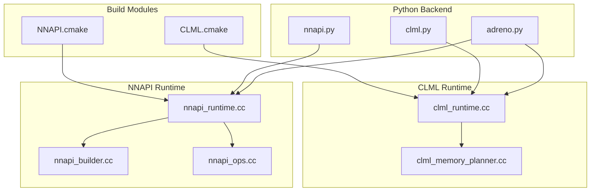
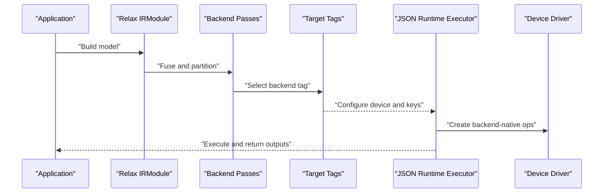
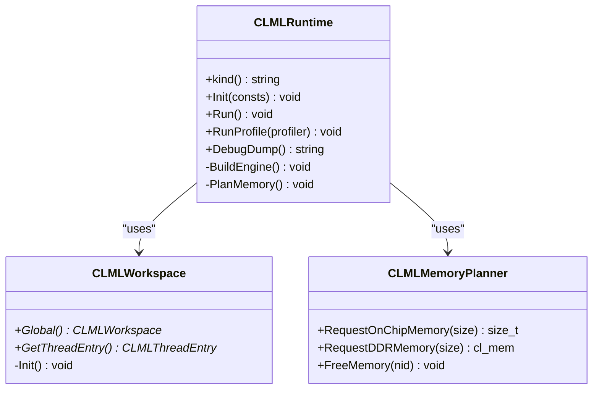
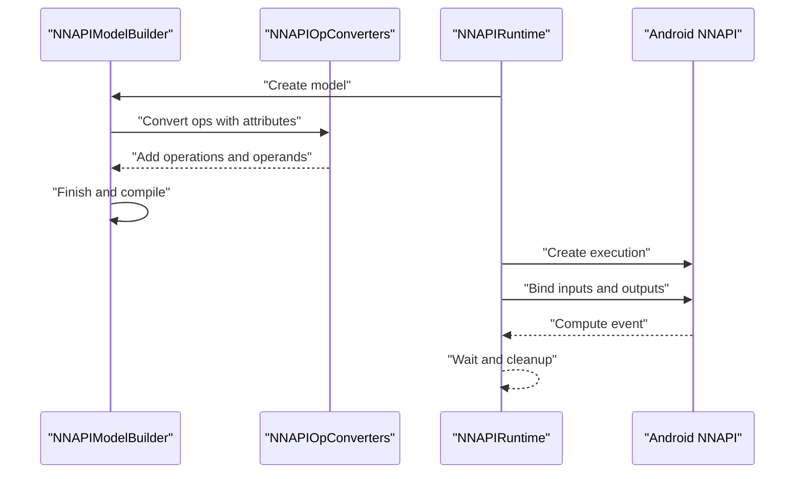
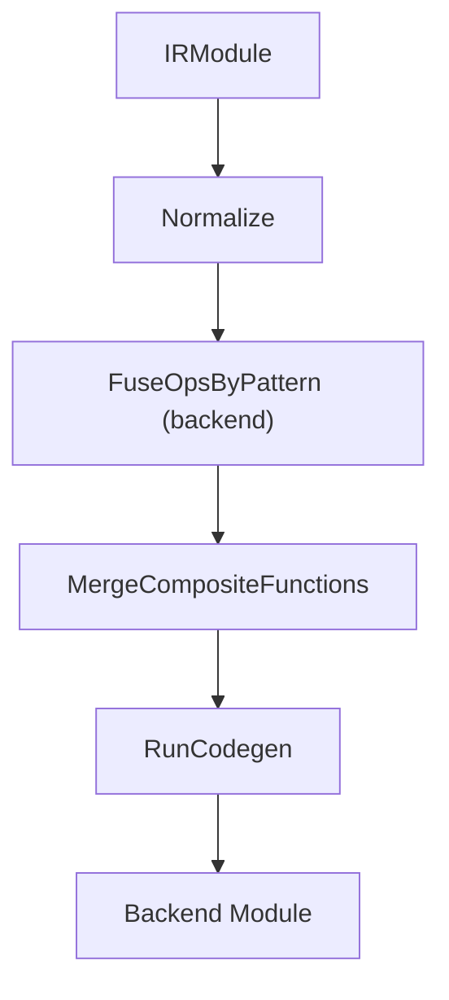
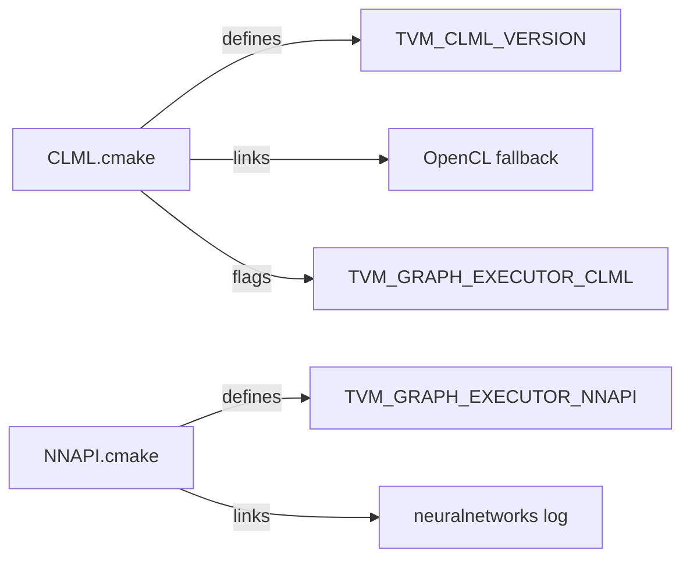

# Mobile Backends

<cite>
**Referenced Files in This Document**
- [CLML.cmake](file://cmake/modules/contrib/CLML.cmake)
- [NNAPI.cmake](file://cmake/modules/contrib/NNAPI.cmake)
- [clml_runtime.cc](file://src/runtime/contrib/clml/clml_runtime.cc)
- [clml_memory_planner.cc](file://src/runtime/contrib/clml/clml_memory_planner.cc)
- [nnapi_runtime.cc](file://src/runtime/contrib/nnapi/nnapi_runtime.cc)
- [nnapi_builder.cc](file://src/runtime/contrib/nnapi/nnapi_builder.cc)
- [nnapi_ops.cc](file://src/runtime/contrib/nnapi/nnapi_ops.cc)
- [clml.py](file://python/tvm/relax/backend/adreno/clml.py)
- [adreno.py](file://python/tvm/target/tag_registry/adreno.py)
- [nnapi.py](file://python/tvm/relax/backend/contrib/nnapi.py)
</cite>

## Table of Contents
1. [Introduction](#introduction)
2. [Project Structure](#project-structure)
3. [Core Components](#core-components)
4. [Architecture Overview](#architecture-overview)
5. [Detailed Component Analysis](#detailed-component-analysis)
6. [Dependency Analysis](#dependency-analysis)
7. [Performance Considerations](#performance-considerations)
8. [Troubleshooting Guide](#troubleshooting-guide)
9. [Conclusion](#conclusion)
10. [Appendices](#appendices)

## Introduction
This document explains mobile-specific backends in the TVM codebase, focusing on Qualcomm Adreno GPU acceleration via CLML and Android NNAPI. It covers mobile-optimized kernels, power-aware optimizations, platform-specific deployment strategies, pipeline configuration, performance optimization for battery life, thermal management, Snapdragon AI optimization, neural network acceleration, and mobile memory constraints. Practical examples demonstrate backend configuration, platform-specific tuning, and deployment considerations.

## Project Structure
Mobile backends are implemented as runtime modules integrated with TVM’s JSON graph executor. The build system enables optional inclusion of CLML and NNAPI components. Python-side Relax passes and target tags coordinate backend selection and graph partitioning.

**Diagram sources**
- [CLML.cmake:18-87](file://cmake/modules/contrib/CLML.cmake#L18-L87)
- [NNAPI.cmake:19-40](file://cmake/modules/contrib/NNAPI.cmake#L19-L40)
- [clml.py:591-616](file://python/tvm/relax/backend/adreno/clml.py#L591-L616)
- [nnapi.py:301-322](file://python/tvm/relax/backend/contrib/nnapi.py#L301-L322)
- [adreno.py:21-65](file://python/tvm/target/tag_registry/adreno.py#L21-L65)
- [clml_runtime.cc:146-219](file://src/runtime/contrib/clml/clml_runtime.cc#L146-L219)
- [clml_memory_planner.cc:1-269](file://src/runtime/contrib/clml/clml_memory_planner.cc#L1-L269)
- [nnapi_runtime.cc:51-78](file://src/runtime/contrib/nnapi/nnapi_runtime.cc#L51-L78)
- [nnapi_builder.cc:133-228](file://src/runtime/contrib/nnapi/nnapi_builder.cc#L133-L228)
- [nnapi_ops.cc:552-595](file://src/runtime/contrib/nnapi/nnapi_ops.cc#L552-L595)

**Section sources**
- [CLML.cmake:18-87](file://cmake/modules/contrib/CLML.cmake#L18-L87)
- [NNAPI.cmake:19-40](file://cmake/modules/contrib/NNAPI.cmake#L19-L40)
- [clml.py:591-616](file://python/tvm/relax/backend/adreno/clml.py#L591-L616)
- [nnapi.py:301-322](file://python/tvm/relax/backend/contrib/nnapi.py#L301-L322)
- [adreno.py:21-65](file://python/tvm/target/tag_registry/adreno.py#L21-L65)

## Core Components
- CLML runtime: A JSON graph executor backed by Qualcomm’s CLML ML runtime, integrating with OpenCL for device context and memory management. It supports on-chip global memory, recordable queues, dynamic tensor shapes, and tuning cache persistence.
- NNAPI runtime: A JSON graph executor that compiles Relax graphs into Android Neural Networks (NNAPI) models and executes them on-device with feature-level gating.
- Python backend passes: Pattern registries and module passes to convert Relax graphs to backend-specific composites and run codegen.
- Target tags: Device and backend tags for Adreno GPUs enabling OpenCL/CLML/Vulkan/textured layouts.

Key capabilities:
- Mobile-optimized kernels: Convolution, pooling, matmul, softmax, batch norm, and elementwise ops.
- Power-aware optimizations: On-chip memory reuse, ping-pong allocation, and tuning cache to reduce energy.
- Thermal management: Tuning and profiling hooks to adjust execution behavior.
- Platform deployment: Graph executor builds for CLML and NNAPI, with fallback to OpenCL.

**Section sources**
- [clml_runtime.cc:146-219](file://src/runtime/contrib/clml/clml_runtime.cc#L146-L219)
- [clml_memory_planner.cc:108-195](file://src/runtime/contrib/clml/clml_memory_planner.cc#L108-L195)
- [nnapi_runtime.cc:51-78](file://src/runtime/contrib/nnapi/nnapi_runtime.cc#L51-L78)
- [nnapi_builder.cc:133-228](file://src/runtime/contrib/nnapi/nnapi_builder.cc#L133-L228)
- [nnapi_ops.cc:552-595](file://src/runtime/contrib/nnapi/nnapi_ops.cc#L552-L595)
- [clml.py:591-616](file://python/tvm/relax/backend/adreno/clml.py#L591-L616)
- [nnapi.py:301-322](file://python/tvm/relax/backend/contrib/nnapi.py#L301-L322)
- [adreno.py:21-65](file://python/tvm/target/tag_registry/adreno.py#L21-L65)

## Architecture Overview
The mobile backends integrate at three layers:
- Build-time: Feature flags select CLML or NNAPI components and link required libraries.
- Python/Relax: Pattern-based graph partitioning and code generation to backend composites.
- Runtime: JSON graph executor that constructs device-native operations and manages memory.

[No sources needed since this diagram shows conceptual workflow, not actual code structure]

## Detailed Component Analysis

### CLML Backend
The CLML backend integrates with OpenCL and Qualcomm’s CLML interface to accelerate CNN-like workloads on Adreno GPUs. It supports:
- On-chip global memory for intermediate tensors with ping-pong allocation.
- Recordable command queues for replayable execution.
- Dynamic tensor shapes with runtime dimension updates.
- Tuning cache persistence to accelerate future runs.

**Diagram sources**
- [clml_runtime.cc:146-219](file://src/runtime/contrib/clml/clml_runtime.cc#L146-L219)
- [clml_runtime.cc:930-1149](file://src/runtime/contrib/clml/clml_runtime.cc#L930-L1149)
- [clml_memory_planner.cc:108-195](file://src/runtime/contrib/clml/clml_memory_planner.cc#L108-L195)

Key runtime behaviors:
- Initialization validates CL device extensions and queries CLML interface versions.
- Memory planning builds reference counts and partitions on-chip/global memory with fragmentation-aware reuse.
- Execution supports recordable queues and profiling timers; dynamic tensors update descriptors mid-run.

Power and thermal considerations:
- On-chip reuse reduces DRAM bandwidth and improves energy efficiency.
- Tuning cache persists learned configurations to minimize warm-up overhead.
- Profiling hooks enable measuring per-layer durations and shapes.

**Section sources**
- [clml_runtime.cc:56-138](file://src/runtime/contrib/clml/clml_runtime.cc#L56-L138)
- [clml_runtime.cc:221-269](file://src/runtime/contrib/clml/clml_runtime.cc#L221-L269)
- [clml_runtime.cc:365-509](file://src/runtime/contrib/clml/clml_runtime.cc#L365-L509)
- [clml_runtime.cc:518-690](file://src/runtime/contrib/clml/clml_runtime.cc#L518-L690)
- [clml_runtime.cc:722-820](file://src/runtime/contrib/clml/clml_runtime.cc#L722-L820)
- [clml_runtime.cc:831-922](file://src/runtime/contrib/clml/clml_runtime.cc#L831-L922)
- [clml_runtime.cc:930-1149](file://src/runtime/contrib/clml/clml_runtime.cc#L930-L1149)
- [clml_memory_planner.cc:108-195](file://src/runtime/contrib/clml/clml_memory_planner.cc#L108-L195)

### NNAPI Backend
The NNAPI backend compiles Relax graphs into Android NNAPI models, enabling hardware-accelerated inference on supported devices. It:
- Converts supported Relax ops to NNAPI operations with operand types and attributes.
- Builds and compiles the model, then executes with input/output bindings.
- Enforces minimum feature levels per operation.

**Diagram sources**
- [nnapi_runtime.cc:73-128](file://src/runtime/contrib/nnapi/nnapi_runtime.cc#L73-L128)
- [nnapi_runtime.cc:130-184](file://src/runtime/contrib/nnapi/nnapi_runtime.cc#L130-L184)
- [nnapi_builder.cc:133-228](file://src/runtime/contrib/nnapi/nnapi_builder.cc#L133-L228)
- [nnapi_ops.cc:552-595](file://src/runtime/contrib/nnapi/nnapi_ops.cc#L552-L595)

Operational highlights:
- Operand creation and type mapping from DLDataType to NNAPI tensor types.
- Converter registry maps Relax ops to NNAPI operations with required parameters.
- Compilation preference set to single-answer mode for latency-sensitive mobile scenarios.

**Section sources**
- [nnapi_runtime.cc:51-78](file://src/runtime/contrib/nnapi/nnapi_runtime.cc#L51-L78)
- [nnapi_runtime.cc:180-184](file://src/runtime/contrib/nnapi/nnapi_runtime.cc#L180-L184)
- [nnapi_builder.cc:133-228](file://src/runtime/contrib/nnapi/nnapi_builder.cc#L133-L228)
- [nnapi_ops.cc:43-132](file://src/runtime/contrib/nnapi/nnapi_ops.cc#L43-L132)
- [nnapi_ops.cc:298-411](file://src/runtime/contrib/nnapi/nnapi_ops.cc#L298-L411)
- [nnapi_ops.cc:488-521](file://src/runtime/contrib/nnapi/nnapi_ops.cc#L488-L521)

### Python Backend Integration and Pipeline
Python-side passes and pattern registries coordinate backend selection and graph transformation:
- CLML pass sequence converts layouts, normalizes ops, fuses patterns, merges composites, and runs codegen.
- NNAPI partitioning fuses supported patterns and merges composite functions, gated by feature level.
- Target tags define device and backend keys for selection.

**Diagram sources**
- [clml.py:591-616](file://python/tvm/relax/backend/adreno/clml.py#L591-L616)
- [nnapi.py:301-322](file://python/tvm/relax/backend/contrib/nnapi.py#L301-L322)
- [adreno.py:21-65](file://python/tvm/target/tag_registry/adreno.py#L21-L65)

**Section sources**
- [clml.py:591-616](file://python/tvm/relax/backend/adreno/clml.py#L591-L616)
- [clml.py:685-715](file://python/tvm/relax/backend/adreno/clml.py#L685-L715)
- [nnapi.py:301-322](file://python/tvm/relax/backend/contrib/nnapi.py#L301-L322)
- [adreno.py:21-65](file://python/tvm/target/tag_registry/adreno.py#L21-L65)

## Dependency Analysis
Build-time dependencies:
- CLML.cmake detects CLML SDK version, sets compile definitions, and optionally links OpenCL fallback for graph executor builds.
- NNAPI.cmake conditionally compiles codegen/runtime and links Android NNAPI and log libraries.

**Diagram sources**
- [CLML.cmake:18-87](file://cmake/modules/contrib/CLML.cmake#L18-L87)
- [NNAPI.cmake:19-40](file://cmake/modules/contrib/NNAPI.cmake#L19-L40)

**Section sources**
- [CLML.cmake:18-87](file://cmake/modules/contrib/CLML.cmake#L18-L87)
- [NNAPI.cmake:19-40](file://cmake/modules/contrib/NNAPI.cmake#L19-L40)

## Performance Considerations
- Memory hierarchy:
  - Prefer on-chip global memory for intermediate activations via ping-pong allocation to reduce DRAM traffic.
  - Dynamic tensors disable on-chip and recordable queue optimizations; use only when necessary.
- Power-aware execution:
  - Enable tuning cache to persist learned configurations and reduce warm-up costs.
  - Use profiling hooks to identify bottlenecks and adjust partitioning.
- Thermal management:
  - Shorten execution sequences and avoid long-running batches when thermal headroom is low.
  - Prefer NNAPI single-answer preference for latency-sensitive tasks.
- Mobile constraints:
  - Limit dynamic shapes and variable-length sequences.
  - Prefer NCHW layouts and FP16 where supported to reduce memory bandwidth.

[No sources needed since this section provides general guidance]

## Troubleshooting Guide
Common issues and remedies:
- CLML initialization failures:
  - Ensure device supports required extensions and CLML interface version compatibility.
  - Disable recordable queues if debugging is needed.
- Memory allocation failures:
  - Verify on-chip memory size and fragmentation; review allocation stats and reject counts.
  - Reduce graph complexity or increase available memory headroom.
- NNAPI unsupported operations:
  - Confirm operation feature level and adjust partitioning to exclude unsupported ops.
  - Validate operand types and shapes match NNAPI expectations.

**Section sources**
- [clml_runtime.cc:75-87](file://src/runtime/contrib/clml/clml_runtime.cc#L75-L87)
- [clml_runtime.cc:811-820](file://src/runtime/contrib/clml/clml_runtime.cc#L811-L820)
- [nnapi_runtime.cc:231-241](file://src/runtime/contrib/nnapi/nnapi_runtime.cc#L231-L241)

## Conclusion
The TVM mobile backends provide robust, platform-specific acceleration for Adreno GPUs via CLML and Android NNAPI. They incorporate power-aware optimizations, memory-conscious planning, and flexible deployment strategies. By leveraging backend passes, target tags, and runtime profiling, developers can achieve efficient, thermal-aware inference on mobile devices.

[No sources needed since this section summarizes without analyzing specific files]

## Appendices

### Build and Deployment Examples
- CLML graph executor build:
  - Enable CLML and optionally set a custom path to CLML SDK; the build system locates OpenCL libraries and adds definitions for graph execution.
- NNAPI runtime build:
  - Enable NNAPI runtime to include NNAPI-specific codegen/runtime and link Android NNAPI and log libraries.

**Section sources**
- [CLML.cmake:45-87](file://cmake/modules/contrib/CLML.cmake#L45-L87)
- [NNAPI.cmake:30-40](file://cmake/modules/contrib/NNAPI.cmake#L30-L40)

### Backend Configuration References
- CLML backend pass sequence:
  - Convert layouts, normalize, fold batch norm, append reshape to BN, fold constants, fuse patterns, merge composites, and run codegen.
- NNAPI partitioning:
  - Fuse supported patterns and merge composites, optionally filtered by minimum feature level.

**Section sources**
- [clml.py:591-616](file://python/tvm/relax/backend/adreno/clml.py#L591-L616)
- [nnapi.py:301-322](file://python/tvm/relax/backend/contrib/nnapi.py#L301-L322)