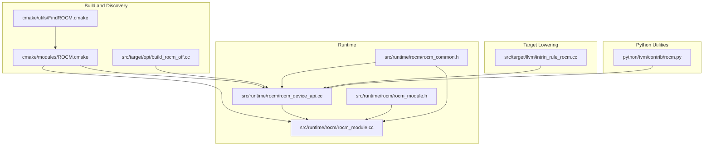
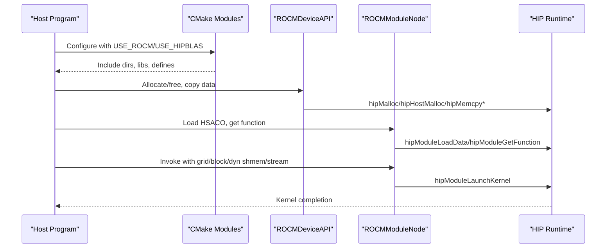
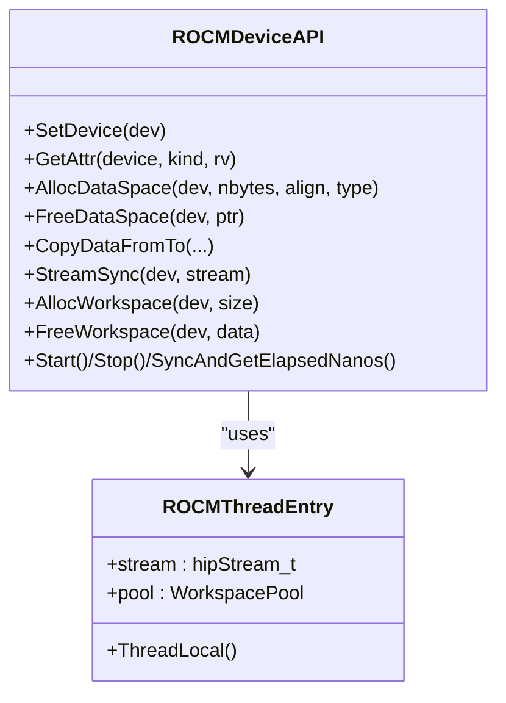
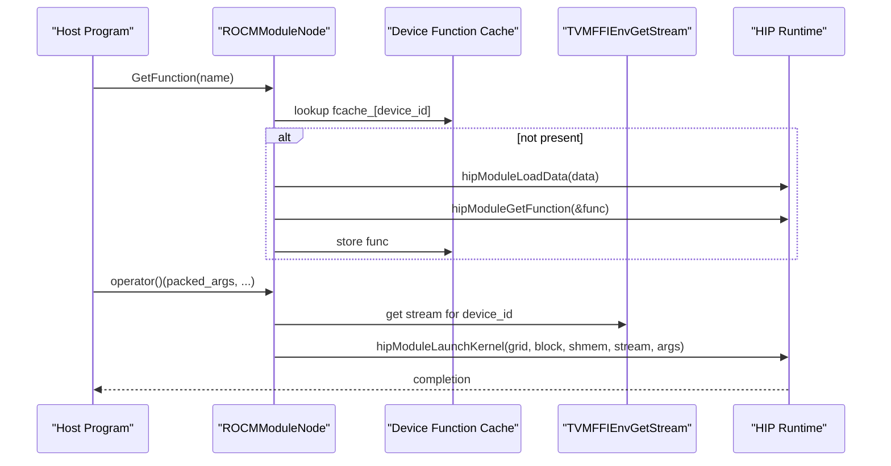
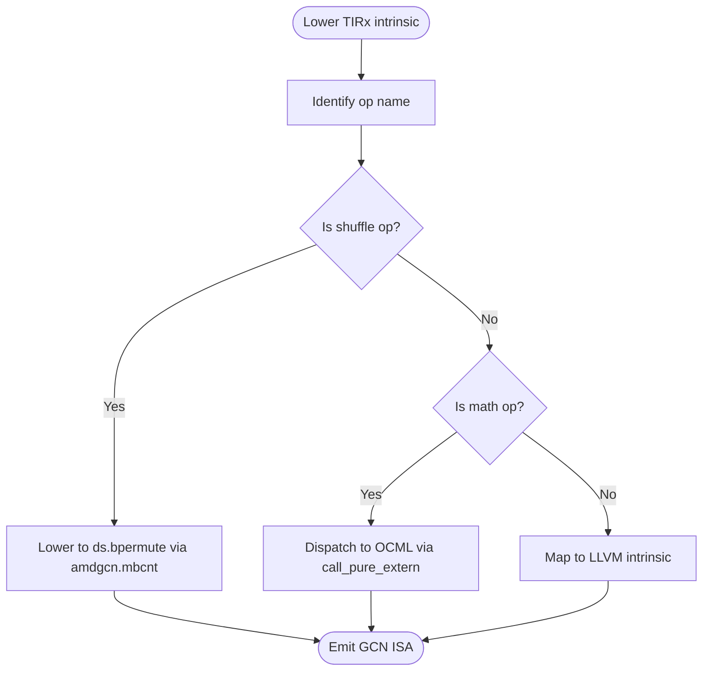
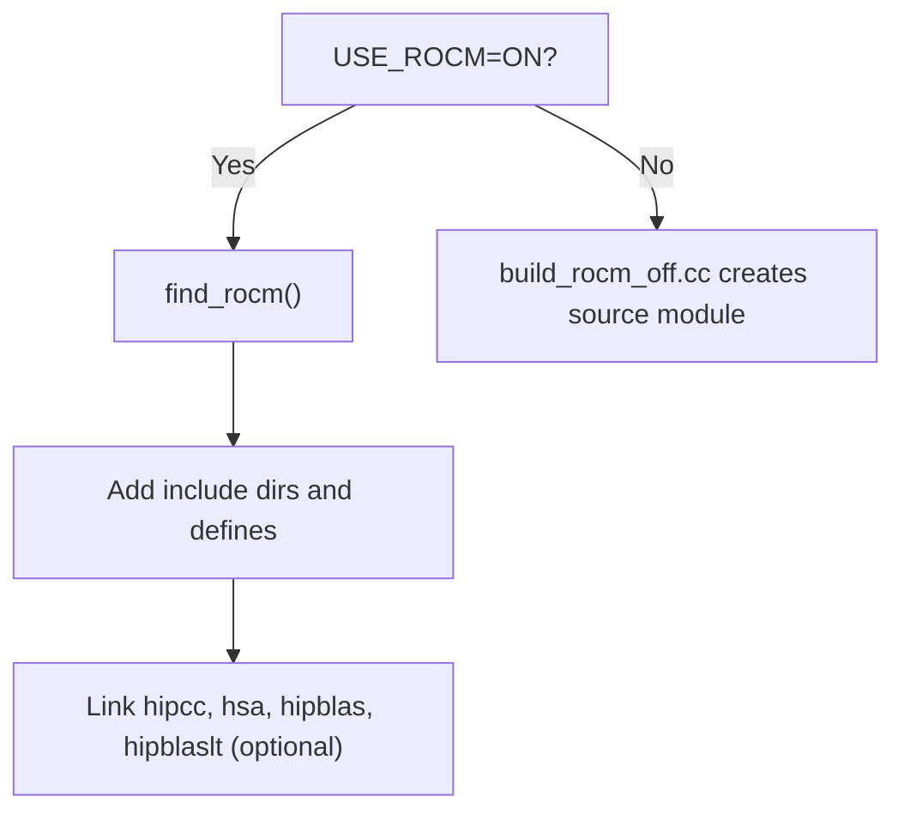
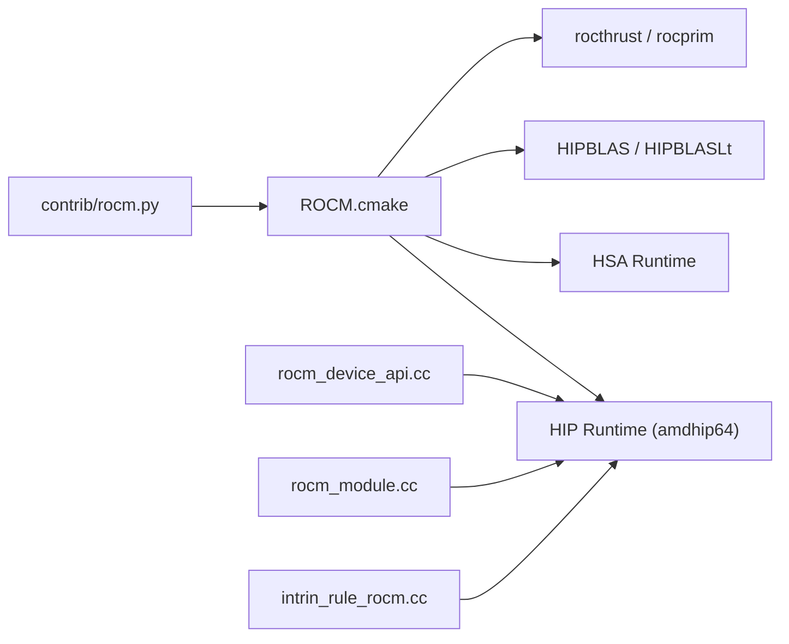

# ROCm Backend

<cite>
**Referenced Files in This Document**
- [ROCM.cmake](file://cmake/modules/ROCM.cmake)
- [FindROCM.cmake](file://cmake/utils/FindROCM.cmake)
- [rocm_common.h](file://src/runtime/rocm/rocm_common.h)
- [rocm_device_api.cc](file://src/runtime/rocm/rocm_device_api.cc)
- [rocm_module.cc](file://src/runtime/rocm/rocm_module.cc)
- [rocm_module.h](file://src/runtime/rocm/rocm_module.h)
- [intrin_rule_rocm.cc](file://src/target/llvm/intrin_rule_rocm.cc)
- [build_rocm_off.cc](file://src/target/opt/build_rocm_off.cc)
- [rocm.py](file://python/tvm/contrib/rocm.py)
</cite>

## Table of Contents
1. [Introduction](#introduction)
2. [Project Structure](#project-structure)
3. [Core Components](#core-components)
4. [Architecture Overview](#architecture-overview)
5. [Detailed Component Analysis](#detailed-component-analysis)
6. [Dependency Analysis](#dependency-analysis)
7. [Performance Considerations](#performance-considerations)
8. [Troubleshooting Guide](#troubleshooting-guide)
9. [Conclusion](#conclusion)

## Introduction
This document explains the ROCm backend for AMD GPUs in the TVM stack. It covers HIP runtime integration, kernel loading and execution, memory management, and AMD-specific hardware features exposed via the runtime. It also outlines multi-GPU support, memory bandwidth optimization, compute unit utilization strategies, and practical setup and tuning guidance derived from the repository’s build and runtime components.

## Project Structure
The ROCm backend spans build-time configuration, runtime device API, module loader, and target intrinsic lowering. The following diagram shows how these pieces fit together.

**Diagram sources**
- [ROCM.cmake:18-73](file://cmake/modules/ROCM.cmake#L18-L73)
- [FindROCM.cmake:34-69](file://cmake/utils/FindROCM.cmake#L34-L69)
- [build_rocm_off.cc:26-44](file://src/target/opt/build_rocm_off.cc#L26-L44)
- [rocm_device_api.cc:38-311](file://src/runtime/rocm/rocm_device_api.cc#L38-L311)
- [rocm_module.h:38-55](file://src/runtime/rocm/rocm_module.h#L38-L55)
- [rocm_module.cc:50-249](file://src/runtime/rocm/rocm_module.cc#L50-L249)
- [rocm_common.h:38-68](file://src/runtime/rocm/rocm_common.h#L38-L68)
- [intrin_rule_rocm.cc:40-217](file://src/target/llvm/intrin_rule_rocm.cc#L40-L217)
- [rocm.py:104-126](file://python/tvm/contrib/rocm.py#L104-L126)

**Section sources**
- [ROCM.cmake:18-73](file://cmake/modules/ROCM.cmake#L18-L73)
- [FindROCM.cmake:34-69](file://cmake/utils/FindROCM.cmake#L34-L69)
- [build_rocm_off.cc:26-44](file://src/target/opt/build_rocm_off.cc#L26-L44)
- [rocm_device_api.cc:38-311](file://src/runtime/rocm/rocm_device_api.cc#L38-L311)
- [rocm_module.h:38-55](file://src/runtime/rocm/rocm_module.h#L38-L55)
- [rocm_module.cc:50-249](file://src/runtime/rocm/rocm_module.cc#L50-L249)
- [rocm_common.h:38-68](file://src/runtime/rocm/rocm_common.h#L38-L68)
- [intrin_rule_rocm.cc:40-217](file://src/target/llvm/intrin_rule_rocm.cc#L40-L217)
- [rocm.py:104-126](file://python/tvm/contrib/rocm.py#L104-L126)

## Core Components
- HIP runtime integration and device attributes: The ROCm device API exposes GPU capabilities and manages allocations, copies, and synchronization through HIP calls.
- Kernel module loader: The ROCm module loads HSACO binaries per device, caches functions, and launches kernels with configured grid/block sizes and streams.
- Target intrinsic lowering: AMD-specific intrinsics and math functions are lowered to OCML and LLVM AMDGCN intrinsics.
- Build and discovery: CMake modules configure compilation and linking against ROCm libraries and HIPBLAS when enabled.
- Python utilities: Helpers for linking, bitcode discovery, and architecture detection.

**Section sources**
- [rocm_device_api.cc:38-311](file://src/runtime/rocm/rocm_device_api.cc#L38-L311)
- [rocm_module.cc:50-249](file://src/runtime/rocm/rocm_module.cc#L50-L249)
- [rocm_module.h:38-55](file://src/runtime/rocm/rocm_module.h#L38-L55)
- [rocm_common.h:38-68](file://src/runtime/rocm/rocm_common.h#L38-L68)
- [intrin_rule_rocm.cc:40-217](file://src/target/llvm/intrin_rule_rocm.cc#L40-L217)
- [ROCM.cmake:18-73](file://cmake/modules/ROCM.cmake#L18-L73)
- [rocm.py:104-126](file://python/tvm/contrib/rocm.py#L104-L126)

## Architecture Overview
The ROCm backend integrates with TVM’s runtime and code generation pipeline. At build time, CMake locates ROCm and HIPBLAS, defines platform macros, and adds source files. At runtime, the device API queries GPU properties and manages memory and streams. The module loader handles per-GPU HSACO modules and kernel launches. Target lowering maps TIRx intrinsics to AMD GCN math functions.

**Diagram sources**
- [ROCM.cmake:18-73](file://cmake/modules/ROCM.cmake#L18-L73)
- [rocm_device_api.cc:149-210](file://src/runtime/rocm/rocm_device_api.cc#L149-L210)
- [rocm_module.cc:105-184](file://src/runtime/rocm/rocm_module.cc#L105-L184)

## Detailed Component Analysis

### HIP Runtime Integration and Device API
The ROCm device API encapsulates HIP calls for device selection, attribute retrieval, memory allocation, and data movement. It also provides timers using HIP events and exposes a thread-local workspace pool.

Key responsibilities:
- Device attributes: max threads per block, warp size, L2 cache size, total/global memory, compute capability string, GCN arch name, API version.
- Memory: aligned device/host allocation, peer-to-peer and host-device copies, stream synchronization.
- Timers: event-based timing on the current device stream.
- Workspace: thread-local pooled allocation scoped to the ROCm device.

**Diagram sources**
- [rocm_device_api.cc:38-311](file://src/runtime/rocm/rocm_device_api.cc#L38-L311)
- [rocm_common.h:54-64](file://src/runtime/rocm/rocm_common.h#L54-L64)

**Section sources**
- [rocm_device_api.cc:38-311](file://src/runtime/rocm/rocm_device_api.cc#L38-L311)
- [rocm_common.h:38-68](file://src/runtime/rocm/rocm_common.h#L38-L68)

### Kernel Module Loader and Multi-GPU Support
The ROCm module loader supports multi-GPU by maintaining a per-GPU module table and lazily loading HSACO images. It caches function pointers per device and uses the current device’s stream for launches.

Highlights:
- Per-GPU module storage with a fixed upper bound.
- Lazy load on first use per device.
- Launch configuration via grid/block/dynamic shared memory and packed argument buffers.
- Thread-safe access to module and function caches.

**Diagram sources**
- [rocm_module.cc:105-184](file://src/runtime/rocm/rocm_module.cc#L105-L184)
- [rocm_module.h:38-55](file://src/runtime/rocm/rocm_module.h#L38-L55)

**Section sources**
- [rocm_module.cc:50-249](file://src/runtime/rocm/rocm_module.cc#L50-L249)
- [rocm_module.h:38-55](file://src/runtime/rocm/rocm_module.h#L38-L55)

### AMD-Specific Hardware Features and Intrinsics
AMD GCN intrinsics and OCML math functions are mapped during code generation. The lowering layer dispatches TIRx intrinsics to OCML or LLVM AMDGCN intrinsics and implements warp shuffle primitives using AMDGCN DS instructions.

Focus areas:
- Warp shuffle primitives lowered to ds.bpermute sequences.
- OCML math intrinsics dispatched via call_pure_extern with OCML prefixes.
- Certain intrinsics mapped to standard LLVM intrinsics (e.g., exp, log, sqrt).

**Diagram sources**
- [intrin_rule_rocm.cc:40-217](file://src/target/llvm/intrin_rule_rocm.cc#L40-L217)

**Section sources**
- [intrin_rule_rocm.cc:40-217](file://src/target/llvm/intrin_rule_rocm.cc#L40-L217)

### Build-Time Configuration and HIPBLAS Integration
CMake modules locate ROCm and HIPBLAS, define platform macros, and conditionally include HIPBLAS and Thrust components. They also handle the fallback when ROCm is disabled.

Highlights:
- Platform macros for HIP platform detection.
- Conditional inclusion of HIPBLAS and HIPBLASLt libraries.
- Thrust support requires hipcc compiler and finds rocthrust/rocprim.
- Fallback module creation when ROCm is disabled.

**Diagram sources**
- [ROCM.cmake:18-73](file://cmake/modules/ROCM.cmake#L18-L73)
- [FindROCM.cmake:34-69](file://cmake/utils/FindROCM.cmake#L34-L69)
- [build_rocm_off.cc:26-44](file://src/target/opt/build_rocm_off.cc#L26-L44)

**Section sources**
- [ROCM.cmake:18-73](file://cmake/modules/ROCM.cmake#L18-L73)
- [FindROCM.cmake:34-69](file://cmake/utils/FindROCM.cmake#L34-L69)
- [build_rocm_off.cc:26-44](file://src/target/opt/build_rocm_off.cc#L26-L44)

### Python Utilities for Linking and Bitcode Discovery
The Python utilities provide:
- Linking relocatable object files to HSA Code Objects using ld.lld.
- Discovering ROCm device library bitcode paths for linking.
- Detecting AMD GPU architecture via rocminfo or environment.

These utilities integrate with global callbacks registered in the runtime to produce HSACO artifacts and to discover bitcode dependencies.

**Section sources**
- [rocm.py:66-126](file://python/tvm/contrib/rocm.py#L66-L126)
- [rocm.py:128-178](file://python/tvm/contrib/rocm.py#L128-L178)
- [rocm.py:232-273](file://python/tvm/contrib/rocm.py#L232-L273)

## Dependency Analysis
The ROCm backend depends on HIP runtime and optionally HIPBLAS/HIPBLASLt and Thrust. Build-time discovery sets include and library paths, while runtime components depend on HIP APIs for device management and kernel execution.

**Diagram sources**
- [ROCM.cmake:18-73](file://cmake/modules/ROCM.cmake#L18-L73)
- [rocm_device_api.cc:24-33](file://src/runtime/rocm/rocm_device_api.cc#L24-L33)
- [rocm_module.cc:25-41](file://src/runtime/rocm/rocm_module.cc#L25-L41)
- [intrin_rule_rocm.cc:25-35](file://src/target/llvm/intrin_rule_rocm.cc#L25-L35)
- [rocm.py:104-126](file://python/tvm/contrib/rocm.py#L104-L126)

**Section sources**
- [ROCM.cmake:18-73](file://cmake/modules/ROCM.cmake#L18-L73)
- [rocm_device_api.cc:24-33](file://src/runtime/rocm/rocm_device_api.cc#L24-L33)
- [rocm_module.cc:25-41](file://src/runtime/rocm/rocm_module.cc#L25-L41)
- [intrin_rule_rocm.cc:25-35](file://src/target/llvm/intrin_rule_rocm.cc#L25-L35)
- [rocm.py:104-126](file://python/tvm/contrib/rocm.py#L104-L126)

## Performance Considerations
- Compute unit utilization
  - Use grid and block dimensions aligned with the GPU’s warp size and occupancy characteristics. The device API exposes warp size and max threads per block to guide scheduling.
  - Prefer coalesced global memory access patterns and ensure alignment for device allocations.
- Memory bandwidth optimization
  - Minimize host-device transfers; batch copies and overlap computation with data movement using streams.
  - Use pinned host memory for faster transfers when appropriate.
- Kernel launch overhead
  - Reuse cached function handles per device to avoid repeated hipModuleGetFunction calls.
  - Pack arguments efficiently and leverage dynamic shared memory for intermediate buffers.
- AMD GCN specifics
  - Leverage DS shuffles and vectorized memory ops; ensure shuffle indices are computed correctly using AMDGCN lane-id helpers.
  - Choose math intrinsics that map to OCML for numerical stability and throughput.

[No sources needed since this section provides general guidance]

## Troubleshooting Guide
- ROCm not found during build
  - Ensure ROCm SDK path is provided or available in standard locations. The finder script logs discovered paths and libraries.
- Linking failures for HSACO
  - Verify ld.lld availability and correct bitcode paths. The Python utility checks for required bitcode files and raises descriptive errors.
- HIP runtime errors
  - The common header defines macros to throw on HIP errors and to assert on non-success codes. Review error messages for failing HIP calls.
- Multi-GPU module loading
  - Confirm that HSACO binaries are relocatable and that per-GPU modules are lazily loaded on demand.

**Section sources**
- [FindROCM.cmake:34-69](file://cmake/utils/FindROCM.cmake#L34-L69)
- [rocm.py:66-126](file://python/tvm/contrib/rocm.py#L66-L126)
- [rocm_common.h:38-51](file://src/runtime/rocm/rocm_common.h#L38-L51)
- [rocm_module.cc:105-134](file://src/runtime/rocm/rocm_module.cc#L105-L134)

## Conclusion
The ROCm backend integrates HIP runtime, AMD GCN intrinsics, and multi-GPU module loading into TVM’s runtime and build system. By leveraging device attributes, stream-based execution, and AMD-specific math and shuffle intrinsics, it enables efficient kernel execution on AMD GPUs. Proper build configuration, careful memory management, and tuned launch parameters are essential for achieving strong performance.