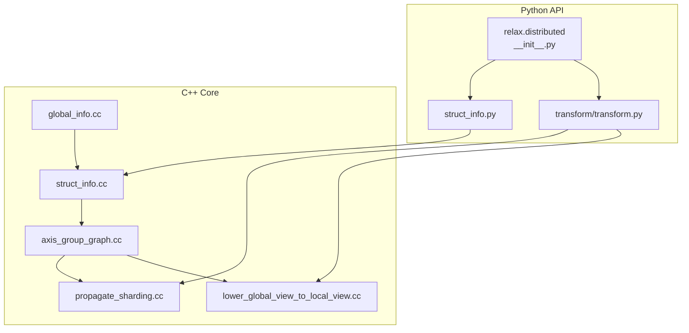
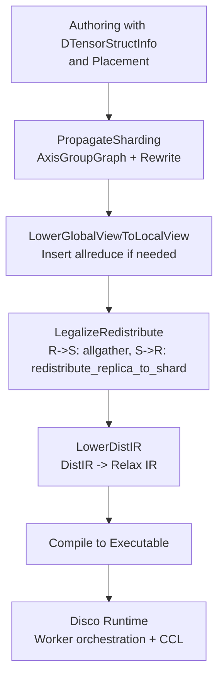
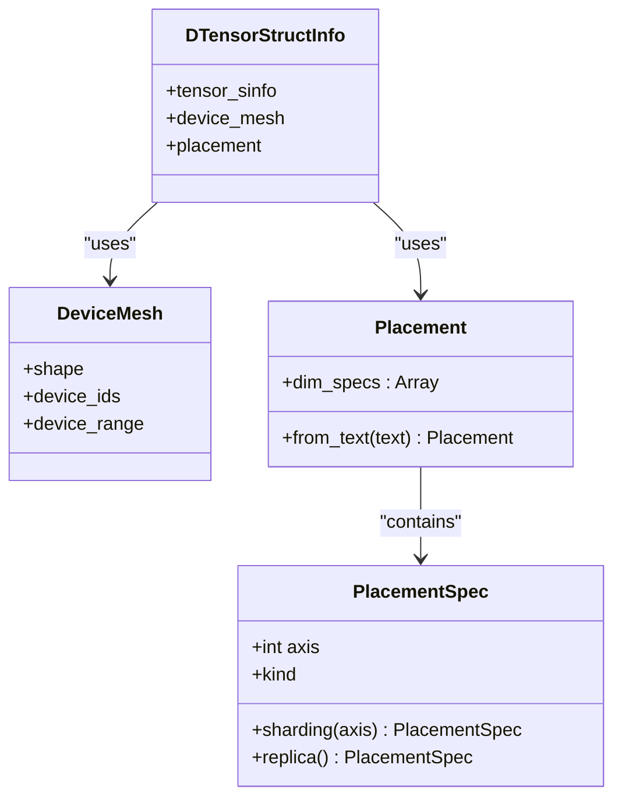
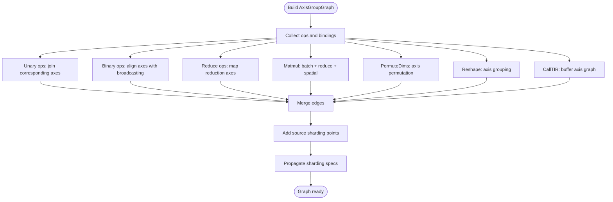
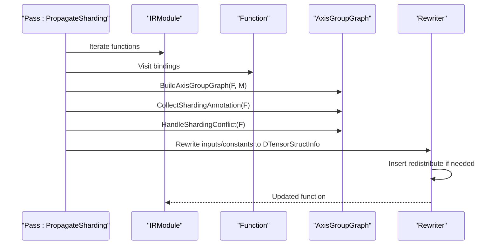
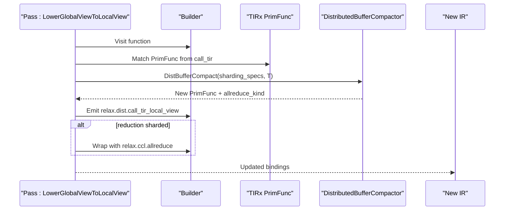
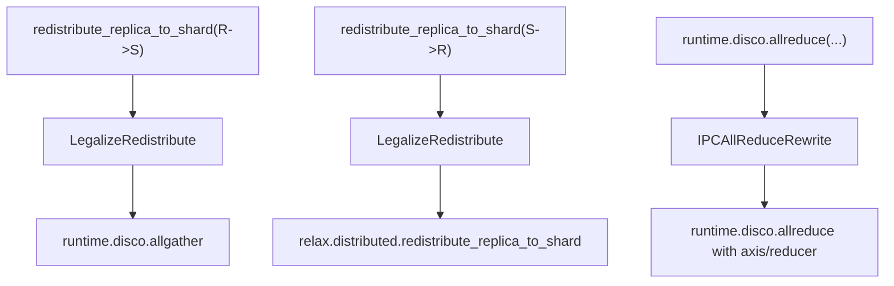
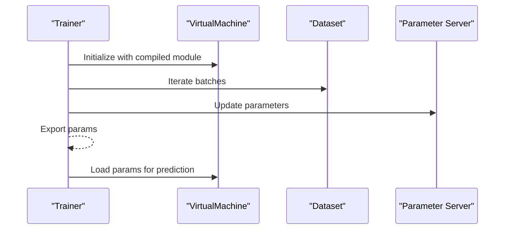
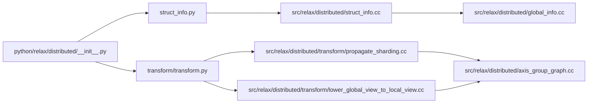

# Distributed Computing

<cite>
**Referenced Files in This Document**
- [global_info.cc](file://src/relax/distributed/global_info.cc)
- [struct_info.cc](file://src/relax/distributed/struct_info.cc)
- [axis_group_graph.cc](file://src/relax/distributed/axis_group_graph.cc)
- [lower_global_view_to_local_view.cc](file://src/relax/distributed/transform/lower_global_view_to_local_view.cc)
- [propagate_sharding.cc](file://src/relax/distributed/transform/propagate_sharding.cc)
- [__init__.py](file://python/tvm/relax/distributed/__init__.py)
- [struct_info.py](file://python/tvm/relax/distributed/struct_info.py)
- [transform.py](file://python/tvm/relax/distributed/transform/transform.py)
- [index.rst](file://docs/arch/index.rst)
- [relax_vm.rst](file://docs/arch/relax_vm.rst)
- [test_transform_ipc_allreduce_rewrite.py](file://tests/python/relax/test_transform_ipc_allreduce_rewrite.py)
- [test_transform_legalize_ops_ccl.py](file://tests/python/relax/test_transform_legalize_ops_ccl.py)
- [test_distributed_transform_lower_global_to_local_view.py](file://tests/python/relax/distributed/test_distributed_transform_lower_global_to_local_view.py)
- [test_distributed_dtensor_sinfo.py](file://tests/python/relax/distributed/test_distributed_dtensor_sinfo.py)
- [test_op_distributed.py](file://tests/python/relax/test_op_distributed.py)
- [proxy.py](file://python/tvm/rpc/proxy.py)
</cite>

## Table of Contents
1. [Introduction](#introduction)
2. [Project Structure](#project-structure)
3. [Core Components](#core-components)
4. [Architecture Overview](#architecture-overview)
5. [Detailed Component Analysis](#detailed-component-analysis)
6. [Dependency Analysis](#dependency-analysis)
7. [Performance Considerations](#performance-considerations)
8. [Troubleshooting Guide](#troubleshooting-guide)
9. [Conclusion](#conclusion)
10. [Appendices](#appendices)

## Introduction
This document explains the Relax distributed computing system in Apache TVM. It focuses on distributed compilation, global information management, and distributed struct info handling. It also covers distributed transformation passes, sharding strategies, inter-process communication, distributed training support, parameter server integration, multi-device coordination, practical setup examples, and performance monitoring approaches.

## Project Structure
The distributed system spans C++ core components and Python APIs:
- C++ core: distributed global info (device meshes), distributed struct info (placement specs, DTensor struct info), axis group graph construction, and transformation passes (propagate sharding, lower global view to local view).
- Python bindings: distributed module exposing DeviceMesh, Placement, DTensorStructInfo, and transformation passes.

**Diagram sources**
- [__init__.py:19-25](file://python/tvm/relax/distributed/__init__.py#L19-L25)
- [struct_info.py:18-148](file://python/tvm/relax/distributed/struct_info.py#L18-L148)
- [transform.py:18-69](file://python/tvm/relax/distributed/transform/transform.py#L18-L69)
- [global_info.cc:27-72](file://src/relax/distributed/global_info.cc#L27-L72)
- [struct_info.cc:31-145](file://src/relax/distributed/struct_info.cc#L31-L145)
- [axis_group_graph.cc:66-393](file://src/relax/distributed/axis_group_graph.cc#L66-L393)
- [propagate_sharding.cc:43-625](file://src/relax/distributed/transform/propagate_sharding.cc#L43-L625)
- [lower_global_view_to_local_view.cc:359-443](file://src/relax/distributed/transform/lower_global_view_to_local_view.cc#L359-L443)

**Section sources**
- [__init__.py:19-25](file://python/tvm/relax/distributed/__init__.py#L19-L25)
- [struct_info.py:18-148](file://python/tvm/relax/distributed/struct_info.py#L18-L148)
- [transform.py:18-69](file://python/tvm/relax/distributed/transform/transform.py#L18-L69)
- [global_info.cc:27-72](file://src/relax/distributed/global_info.cc#L27-L72)
- [struct_info.cc:31-145](file://src/relax/distributed/struct_info.cc#L31-L145)
- [axis_group_graph.cc:66-393](file://src/relax/distributed/axis_group_graph.cc#L66-L393)
- [propagate_sharding.cc:43-625](file://src/relax/distributed/transform/propagate_sharding.cc#L43-L625)
- [lower_global_view_to_local_view.cc:359-443](file://src/relax/distributed/transform/lower_global_view_to_local_view.cc#L359-L443)

## Core Components
- DeviceMesh: Defines the topology and device IDs of a logical device mesh used for distributed placement.
- PlacementSpec and Placement: Describe per-axis distribution (sharding vs replica) and the full placement across mesh dimensions.
- DTensorStructInfo: Encapsulates a tensor’s shape/type plus device mesh and placement for distributed execution.
- Axis Group Graph: Captures axis-wise data movement semantics across ops to drive sharding propagation and redistribution decisions.
- Transformation passes:
  - PropagateSharding: Builds axis group graph, collects sharding annotations, resolves conflicts, and rewrites functions to DTensor IR.
  - LowerGlobalViewToLocalView: Lowers global-view TIR to local-view by inserting allreduce when reductions are sharded and adjusting loops/buffers accordingly.
  - LegalizeRedistribute and LowerDistIR: Legalize redistribute ops to CCL ops and lower DistIR to Relax IR.

**Section sources**
- [global_info.cc:29-60](file://src/relax/distributed/global_info.cc#L29-L60)
- [struct_info.cc:37-118](file://src/relax/distributed/struct_info.cc#L37-L118)
- [struct_info.cc:121-145](file://src/relax/distributed/struct_info.cc#L121-L145)
- [axis_group_graph.cc:66-393](file://src/relax/distributed/axis_group_graph.cc#L66-L393)
- [propagate_sharding.cc:43-625](file://src/relax/distributed/transform/propagate_sharding.cc#L43-L625)
- [lower_global_view_to_local_view.cc:359-443](file://src/relax/distributed/transform/lower_global_view_to_local_view.cc#L359-L443)

## Architecture Overview
The distributed pipeline integrates Relax IR, struct info, and TIR lowering:
- Authoring: Users annotate sharding via Placement and DeviceMesh and use DTensorStructInfo to describe distributed shapes.
- Compilation: PropagateSharding constructs an axis group graph and rewrites to DTensor IR; LowerGlobalViewToLocalView inserts allreduce when needed; LegalizeRedistribute lowers redistribute ops to CCL calls.
- Runtime: Disco orchestrates workers, dispatches compiled programs, and coordinates collective operations.

**Diagram sources**
- [propagate_sharding.cc:416-437](file://src/relax/distributed/transform/propagate_sharding.cc#L416-L437)
- [lower_global_view_to_local_view.cc:414-430](file://src/relax/distributed/transform/lower_global_view_to_local_view.cc#L414-L430)
- [propagate_sharding.cc:485-487](file://src/relax/distributed/transform/propagate_sharding.cc#L485-L487)
- [index.rst:258-266](file://docs/arch/index.rst#L258-L266)

**Section sources**
- [index.rst:258-266](file://docs/arch/index.rst#L258-L266)
- [relax_vm.rst:20-33](file://docs/arch/relax_vm.rst#L20-L33)
- [propagate_sharding.cc:416-437](file://src/relax/distributed/transform/propagate_sharding.cc#L416-L437)
- [lower_global_view_to_local_view.cc:414-430](file://src/relax/distributed/transform/lower_global_view_to_local_view.cc#L414-L430)

## Detailed Component Analysis

### Distributed Struct Info and Device Mesh
- DeviceMesh supports construction from shape and device IDs or a device range; validates total device count equals mesh product.
- PlacementSpec distinguishes sharding along a tensor axis versus replica; Placement aggregates per-mesh-dimension specs.
- DTensorStructInfo composes TensorStructInfo with DeviceMesh and Placement, validating dimensionality and axis bounds.

**Diagram sources**
- [global_info.cc:29-60](file://src/relax/distributed/global_info.cc#L29-L60)
- [struct_info.cc:37-118](file://src/relax/distributed/struct_info.cc#L37-L118)
- [struct_info.cc:121-145](file://src/relax/distributed/struct_info.cc#L121-L145)

**Section sources**
- [global_info.cc:29-60](file://src/relax/distributed/global_info.cc#L29-L60)
- [struct_info.cc:37-118](file://src/relax/distributed/struct_info.cc#L37-L118)
- [struct_info.cc:121-145](file://src/relax/distributed/struct_info.cc#L121-L145)

### Axis Group Graph Construction
- Builds edges across ops to capture axis-wise semantics:
  - Unary ops: join corresponding axes between input and output.
  - Binary ops: align axes considering broadcasting.
  - Reduce ops: map reduction axes from input to output (keeping dims or not).
  - Matmul: join batch dims, reduction dims, and spatial dims.
  - PermuteDims and Reshape: propagate axis correspondences respecting permutations and reshaping.
  - CallTIR: uses TIR buffer axis graph to relate inputs/outputs.
- Adds source sharding points from annotate_sharding annotations and propagates specs to resolve conflicts.

**Diagram sources**
- [axis_group_graph.cc:79-393](file://src/relax/distributed/axis_group_graph.cc#L79-L393)

**Section sources**
- [axis_group_graph.cc:79-393](file://src/relax/distributed/axis_group_graph.cc#L79-L393)

### PropagateSharding Pass
- Constructs AxisGroupGraph from function and module.
- Collects annotate_sharding bindings to seed sharding specs.
- Detects and rejects conflicting sharding (e.g., constants sharded, mesh mismatch, replicated axis sharded twice).
- Rewrites inputs/constants to DTensorStructInfo and emits redistribute when inferred and annotated placements differ.
- Emits specialized distributed builtin ops for KV cache views.

**Diagram sources**
- [propagate_sharding.cc:416-437](file://src/relax/distributed/transform/propagate_sharding.cc#L416-L437)
- [propagate_sharding.cc:476-487](file://src/relax/distributed/transform/propagate_sharding.cc#L476-L487)

**Section sources**
- [propagate_sharding.cc:416-437](file://src/relax/distributed/transform/propagate_sharding.cc#L416-L437)
- [propagate_sharding.cc:476-487](file://src/relax/distributed/transform/propagate_sharding.cc#L476-L487)

### LowerGlobalViewToLocalView Pass
- Identifies DistIR call_tir and lowers it to local-view TIR:
  - Determines sharding specs from DTensorStructInfo of inputs/outputs.
  - Compacts buffers and adjusts loops/blocks to reflect local shards.
  - Inserts allreduce when reduction axes are sharded.
  - Replaces call_tir with relax.dist.call_tir_local_view and wraps with allreduce when needed.

**Diagram sources**
- [lower_global_view_to_local_view.cc:414-430](file://src/relax/distributed/transform/lower_global_view_to_local_view.cc#L414-L430)
- [lower_global_view_to_local_view.cc:152-171](file://src/relax/distributed/transform/lower_global_view_to_local_view.cc#L152-L171)

**Section sources**
- [lower_global_view_to_local_view.cc:359-443](file://src/relax/distributed/transform/lower_global_view_to_local_view.cc#L359-L443)
- [lower_global_view_to_local_view.cc:152-171](file://src/relax/distributed/transform/lower_global_view_to_local_view.cc#L152-L171)

### Inter-Process Communication and Collective Operations
- Legalization transforms redistribute ops to CCL ops:
  - R->S: redistribute_replica_to_shard becomes allgather.
  - S->R: redistribute_replica_to_shard becomes redistribute_replica_to_shard.
- IPC allreduce rewrite tests demonstrate rewriting packed calls to runtime.disco.allreduce with axis and reducer selection.
- Tests cover allreduce, allgather, and broadcast-from-zero conversions to call_dps_packed runtime.disco.*.

**Diagram sources**
- [propagate_sharding.cc:485-487](file://src/relax/distributed/transform/propagate_sharding.cc#L485-L487)
- [test_transform_legalize_ops_ccl.py:40-97](file://tests/python/relax/test_transform_legalize_ops_ccl.py#L40-L97)
- [test_transform_ipc_allreduce_rewrite.py:26-155](file://tests/python/relax/test_transform_ipc_allreduce_rewrite.py#L26-L155)

**Section sources**
- [propagate_sharding.cc:485-487](file://src/relax/distributed/transform/propagate_sharding.cc#L485-L487)
- [test_transform_legalize_ops_ccl.py:40-97](file://tests/python/relax/test_transform_legalize_ops_ccl.py#L40-L97)
- [test_transform_ipc_allreduce_rewrite.py:26-155](file://tests/python/relax/test_transform_ipc_allreduce_rewrite.py#L26-L155)

### Distributed Training Support and Parameter Server Integration
- Distributed training support is integrated into the Relax training stack and VM. The training tests demonstrate initialization, updates, exporting/loading parameters, and numeric correctness checks.
- Parameter server integration is coordinated via the RPC and tracker subsystems, which pair clients and servers and manage connection lifecycles.

**Diagram sources**
- [test_training_trainer_numeric.py:125-171](file://tests/python/relax/test_training_trainer_numeric.py#L125-L171)
- [proxy.py:415-449](file://python/tvm/rpc/proxy.py#L415-L449)

**Section sources**
- [test_training_trainer_numeric.py:125-171](file://tests/python/relax/test_training_trainer_numeric.py#L125-L171)
- [proxy.py:415-449](file://python/tvm/rpc/proxy.py#L415-L449)

## Dependency Analysis
- Python distributed module depends on C++ FFI APIs for DeviceMesh, Placement, DTensorStructInfo, and transformation passes.
- Transformation passes depend on axis group graph construction and TIRx utilities to compact buffers and adjust loops.
- Runtime relies on Disco for worker orchestration and CCL for inter-process communication.

**Diagram sources**
- [__init__.py:19-25](file://python/tvm/relax/distributed/__init__.py#L19-L25)
- [struct_info.py:18-148](file://python/tvm/relax/distributed/struct_info.py#L18-L148)
- [transform.py:18-69](file://python/tvm/relax/distributed/transform/transform.py#L18-L69)
- [struct_info.cc:31-145](file://src/relax/distributed/struct_info.cc#L31-L145)
- [global_info.cc:27-72](file://src/relax/distributed/global_info.cc#L27-L72)
- [axis_group_graph.cc:66-393](file://src/relax/distributed/axis_group_graph.cc#L66-L393)
- [propagate_sharding.cc:43-625](file://src/relax/distributed/transform/propagate_sharding.cc#L43-L625)
- [lower_global_view_to_local_view.cc:359-443](file://src/relax/distributed/transform/lower_global_view_to_local_view.cc#L359-L443)

**Section sources**
- [__init__.py:19-25](file://python/tvm/relax/distributed/__init__.py#L19-L25)
- [struct_info.py:18-148](file://python/tvm/relax/distributed/struct_info.py#L18-L148)
- [transform.py:18-69](file://python/tvm/relax/distributed/transform/transform.py#L18-L69)
- [struct_info.cc:31-145](file://src/relax/distributed/struct_info.cc#L31-L145)
- [global_info.cc:27-72](file://src/relax/distributed/global_info.cc#L27-L72)
- [axis_group_graph.cc:66-393](file://src/relax/distributed/axis_group_graph.cc#L66-L393)
- [propagate_sharding.cc:43-625](file://src/relax/distributed/transform/propagate_sharding.cc#L43-L625)
- [lower_global_view_to_local_view.cc:359-443](file://src/relax/distributed/transform/lower_global_view_to_local_view.cc#L359-L443)

## Performance Considerations
- Sharding granularity: Prefer sharding on larger tensor axes to maximize parallelism and minimize communication overhead.
- Allreduce fusion: Inserting allreduce after reductions reduces synchronization points; ensure compatible axis alignment.
- Buffer compaction: LowerGlobalViewToLocalView reduces buffer sizes per device and shortens loop extents to local shards.
- Legalization: Converting redistribute ops to efficient CCL calls avoids unnecessary copies and leverages optimized collectives.

[No sources needed since this section provides general guidance]

## Troubleshooting Guide
- Sharding conflicts:
  - Constants cannot be sharded; convert to parameters.
  - Device mesh mismatch across axes.
  - Replicated axis sharded twice on the same mesh dimension.
- Indivisibility errors:
  - redistribute_replica_to_shard requires the tensor dimension to be divisible by the number of workers along that mesh axis.
- IPC allreduce rewrite:
  - Only supported reducers and axes are applied; others are skipped as tested.

**Section sources**
- [propagate_sharding.cc:309-319](file://src/relax/distributed/transform/propagate_sharding.cc#L309-L319)
- [propagate_sharding.cc:284-300](file://src/relax/distributed/transform/propagate_sharding.cc#L284-L300)
- [test_op_distributed.py:36-59](file://tests/python/relax/test_op_distributed.py#L36-L59)
- [test_transform_ipc_allreduce_rewrite.py:130-155](file://tests/python/relax/test_transform_ipc_allreduce_rewrite.py#L130-L155)

## Conclusion
The Relax distributed system provides a structured approach to modeling, compiling, and executing distributed machine learning workloads. By combining DTensor struct info, axis group graph propagation, and targeted lowering passes, it enables efficient sharding, redistribution, and collective communication. The integration with Disco and the training stack completes the end-to-end pipeline for multi-device execution.

[No sources needed since this section summarizes without analyzing specific files]

## Appendices

### Practical Examples

- Setting up distributed compilation environment:
  - Define DeviceMesh with shape and device IDs or device range.
  - Annotate sharding using Placement and PlacementSpec.
  - Apply PropagateSharding to rewrite to DTensor IR.
  - Lower global view to local view and legalize redistribute to CCL.
  - Compile and run with Disco runtime.

- Configuring distributed transformations:
  - Use annotate_sharding to seed sharding specs.
  - PropagateSharding will resolve conflicts and emit redistributes when needed.
  - LowerGlobalViewToLocalView inserts allreduce for sharded reductions.

- Optimizing distributed workloads:
  - Choose sharding axes aligned with computation patterns.
  - Fuse reductions with allreduce to reduce synchronization.
  - Compact buffers and adjust loop bounds for local shards.

**Section sources**
- [global_info.cc:29-60](file://src/relax/distributed/global_info.cc#L29-L60)
- [struct_info.py:57-82](file://python/tvm/relax/distributed/struct_info.py#L57-L82)
- [propagate_sharding.cc:226-242](file://src/relax/distributed/transform/propagate_sharding.cc#L226-L242)
- [propagate_sharding.cc:416-437](file://src/relax/distributed/transform/propagate_sharding.cc#L416-L437)
- [lower_global_view_to_local_view.cc:414-430](file://src/relax/distributed/transform/lower_global_view_to_local_view.cc#L414-L430)
- [test_distributed_transform_lower_global_to_local_view.py:202-231](file://tests/python/relax/distributed/test_distributed_transform_lower_global_to_local_view.py#L202-L231)

### Distributed Debugging and Monitoring
- Use tests to validate:
  - DTensor struct info equality and JSON round-tripping.
  - Lowering correctness for global-to-local view.
  - Legalization of CCL ops and IPC allreduce rewrite behavior.
- Monitor runtime behavior via RPC tracker and proxy pairing to diagnose connectivity and matching issues.

**Section sources**
- [test_distributed_dtensor_sinfo.py:44-79](file://tests/python/relax/distributed/test_distributed_dtensor_sinfo.py#L44-L79)
- [test_distributed_transform_lower_global_to_local_view.py:202-231](file://tests/python/relax/distributed/test_distributed_transform_lower_global_to_local_view.py#L202-L231)
- [test_transform_legalize_ops_ccl.py:40-97](file://tests/python/relax/test_transform_legalize_ops_ccl.py#L40-L97)
- [test_transform_ipc_allreduce_rewrite.py:26-155](file://tests/python/relax/test_transform_ipc_allreduce_rewrite.py#L26-L155)
- [proxy.py:415-449](file://python/tvm/rpc/proxy.py#L415-L449)