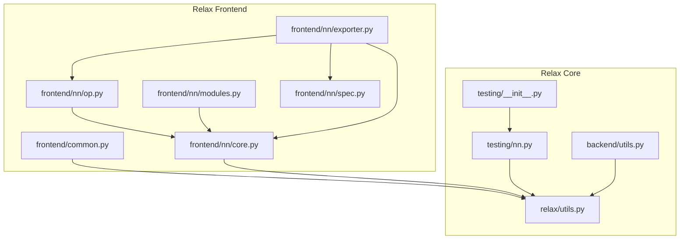
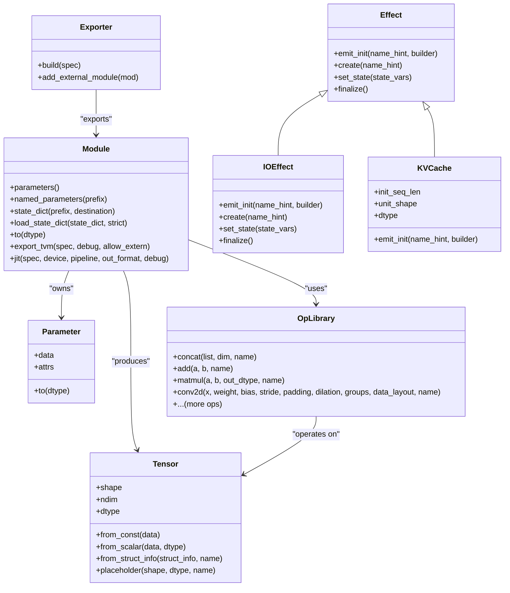
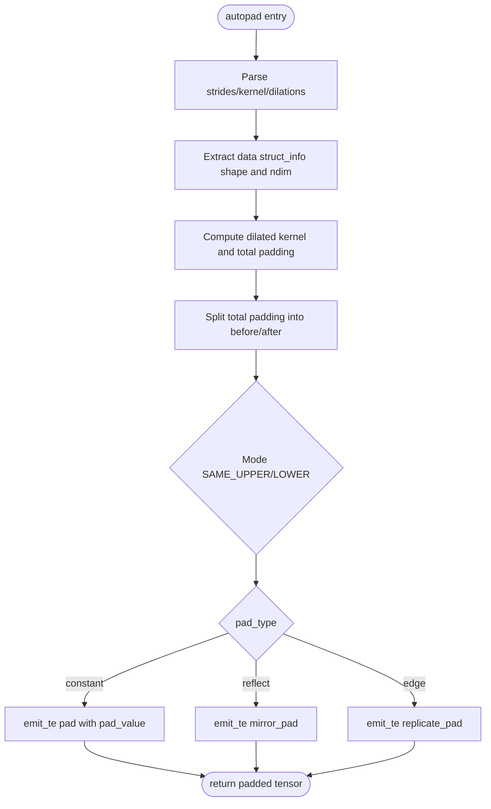
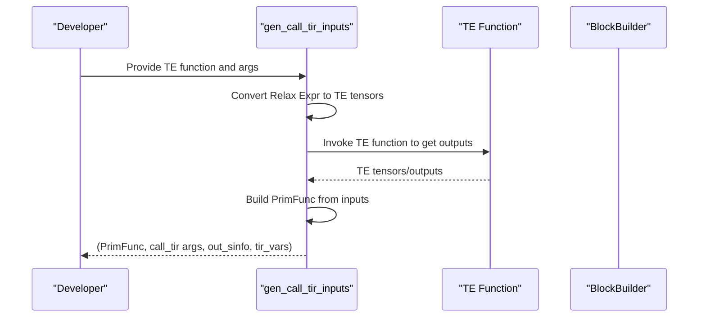
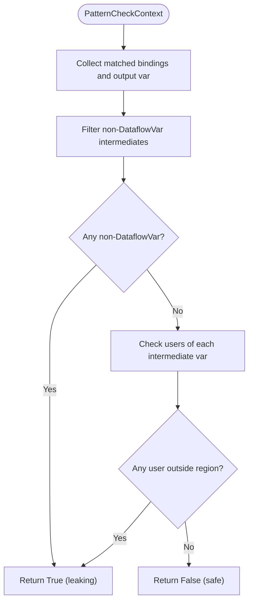
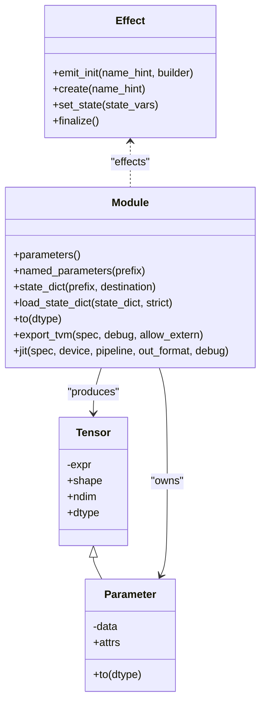
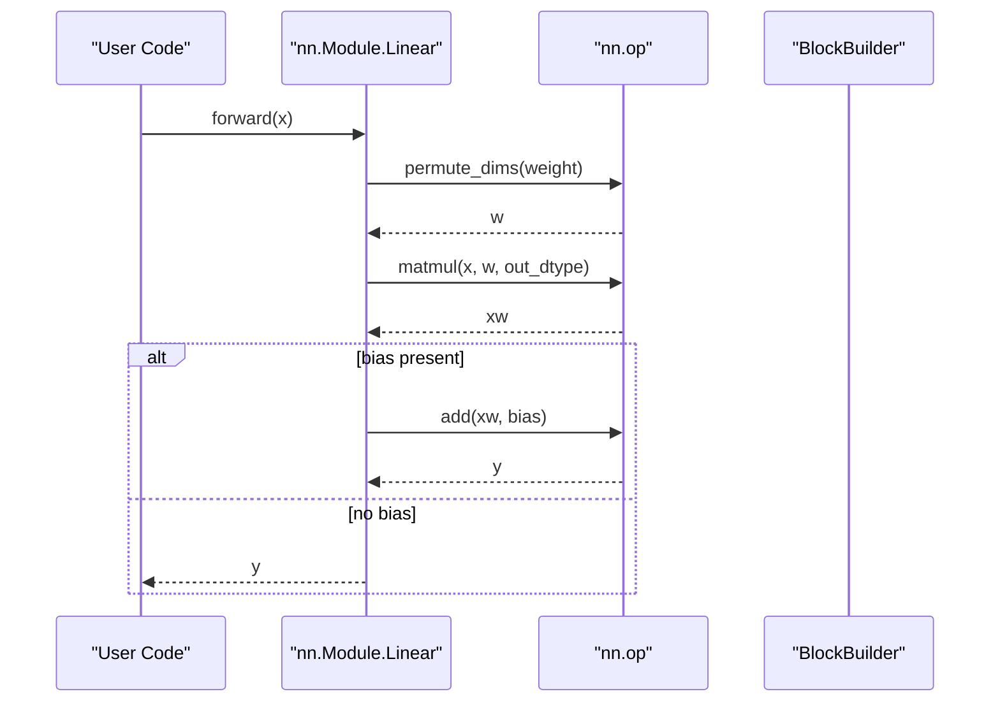
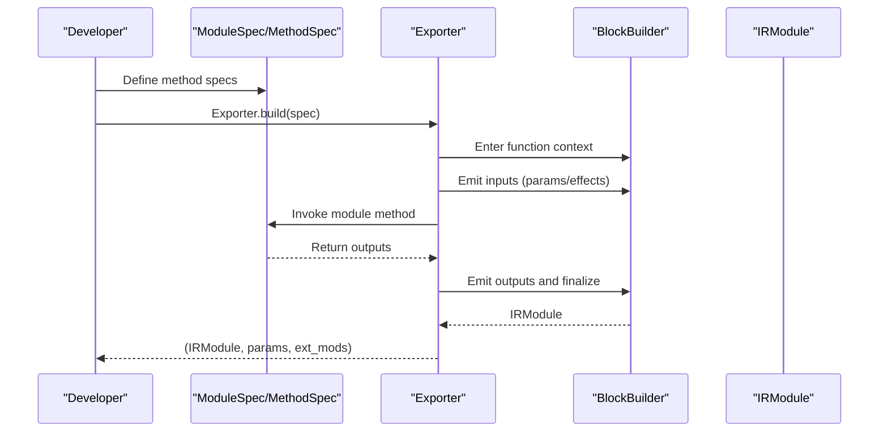
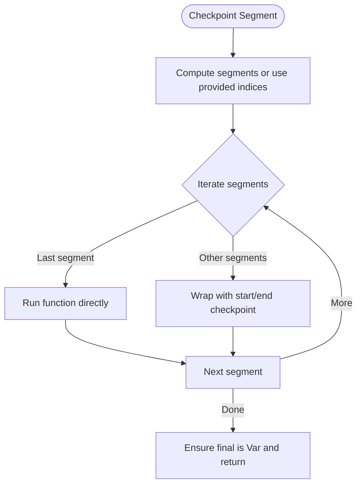
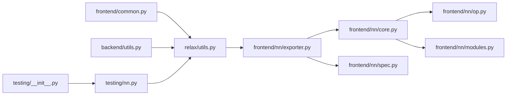

# Common Frontend Utilities

<cite>
**Referenced Files in This Document**
- [common.py](file://python/tvm/relax/frontend/common.py)
- [utils.py](file://python/tvm/relax/utils.py)
- [backend/utils.py](file://python/tvm/relax/backend/utils.py)
- [testing/__init__.py](file://python/tvm/relax/testing/__init__.py)
- [testing/nn.py](file://python/tvm/relax/testing/nn.py)
- [frontend/nn/core.py](file://python/tvm/relax/frontend/nn/core.py)
- [frontend/nn/op.py](file://python/tvm/relax/frontend/nn/op.py)
- [frontend/nn/modules.py](file://python/tvm/relax/frontend/nn/modules.py)
- [frontend/nn/spec.py](file://python/tvm/relax/frontend/nn/spec.py)
- [frontend/nn/exporter.py](file://python/tvm/relax/frontend/nn/exporter.py)
</cite>

## Table of Contents
1. [Introduction](#introduction)
2. [Project Structure](#project-structure)
3. [Core Components](#core-components)
4. [Architecture Overview](#architecture-overview)
5. [Detailed Component Analysis](#detailed-component-analysis)
6. [Dependency Analysis](#dependency-analysis)
7. [Performance Considerations](#performance-considerations)
8. [Troubleshooting Guide](#troubleshooting-guide)
9. [Conclusion](#conclusion)
10. [Appendices](#appendices)

## Introduction
This document describes the common frontend utilities and shared infrastructure used across Relax frontends. It focuses on helper functions, common data structures, and shared building blocks that enable consistent model construction, tensor manipulation, shape inference, conversion utilities, error handling, debugging, and testing. It also provides practical examples for developing new frontends and extending existing functionality within the broader Relax ecosystem.

## Project Structure
The common frontend utilities span several modules:
- Frontend utilities for common tasks such as parameter detachment and autopadding
- General Relax utilities for expression conversion, PrimFunc generation, and metadata parsing
- Backend utilities for BYOC pattern matching and shape/dtype extraction
- Testing infrastructure for constructing workloads and checkpointing
- nn.Module infrastructure, operators, built-in modules, compilation specs, and exporter

**Diagram sources**
- [common.py:1-128](file://python/tvm/relax/frontend/common.py#L1-128)
- [utils.py:1-392](file://python/tvm/relax/utils.py#L1-392)
- [backend/utils.py:1-96](file://python/tvm/relax/backend/utils.py#L1-96)
- [testing/nn.py:1-355](file://python/tvm/relax/testing/nn.py#L1-355)
- [testing/__init__.py:1-25](file://python/tvm/relax/testing/__init__.py#L1-25)
- [frontend/nn/core.py:1-757](file://python/tvm/relax/frontend/nn/core.py#L1-757)
- [frontend/nn/op.py:1-800](file://python/tvm/relax/frontend/nn/op.py#L1-800)
- [frontend/nn/modules.py:1-800](file://python/tvm/relax/frontend/nn/modules.py#L1-800)
- [frontend/nn/spec.py:1-258](file://python/tvm/relax/frontend/nn/spec.py#L1-258)
- [frontend/nn/exporter.py:1-337](file://python/tvm/relax/frontend/nn/exporter.py#L1-337)

**Section sources**
- [common.py:1-128](file://python/tvm/relax/frontend/common.py#L1-128)
- [utils.py:1-392](file://python/tvm/relax/utils.py#L1-392)
- [backend/utils.py:1-96](file://python/tvm/relax/backend/utils.py#L1-96)
- [testing/nn.py:1-355](file://python/tvm/relax/testing/nn.py#L1-355)
- [testing/__init__.py:1-25](file://python/tvm/relax/testing/__init__.py#L1-25)
- [frontend/nn/core.py:1-757](file://python/tvm/relax/frontend/nn/core.py#L1-757)
- [frontend/nn/op.py:1-800](file://python/tvm/relax/frontend/nn/op.py#L1-800)
- [frontend/nn/modules.py:1-800](file://python/tvm/relax/frontend/nn/modules.py#L1-800)
- [frontend/nn/spec.py:1-258](file://python/tvm/relax/frontend/nn/spec.py#L1-258)
- [frontend/nn/exporter.py:1-337](file://python/tvm/relax/frontend/nn/exporter.py#L1-337)

## Core Components
- Frontend common utilities:
  - Parameter detachment from IRModule functions
  - Autopadding helper for dynamic shapes
- General Relax utilities:
  - Metadata partitioner for Relax text
  - Expression conversion helpers
  - Call_TIR inputs generator for TE functions
- Backend utilities:
  - Backend dispatcher base class
  - Shape/dtype extraction and target resolution
  - Intermediate variable leak detection
- nn.Module infrastructure:
  - Tensor, Parameter, Module, Object, Effect abstractions
  - JIT compilation and export to IRModule
- Operators and modules:
  - Tensor operators (concat, add, matmul, convolutions, etc.)
  - Built-in modules (Linear, Conv2D, Norm layers, KVCache, IOEffect)
- Compilation specifications and exporter:
  - Method/module specs and parameter/effect modes
  - Exporter that builds IRModule and attaches external modules

**Section sources**
- [common.py:26-128](file://python/tvm/relax/frontend/common.py#L26-128)
- [utils.py:43-392](file://python/tvm/relax/utils.py#L43-392)
- [backend/utils.py:26-96](file://python/tvm/relax/backend/utils.py#L26-96)
- [frontend/nn/core.py:90-757](file://python/tvm/relax/frontend/nn/core.py#L90-757)
- [frontend/nn/op.py:40-800](file://python/tvm/relax/frontend/nn/op.py#L40-800)
- [frontend/nn/modules.py:30-800](file://python/tvm/relax/frontend/nn/modules.py#L30-800)
- [frontend/nn/spec.py:31-258](file://python/tvm/relax/frontend/nn/spec.py#L31-258)
- [frontend/nn/exporter.py:46-337](file://python/tvm/relax/frontend/nn/exporter.py#L46-337)

## Architecture Overview
The common frontend utilities form a layered architecture:
- Data structures and abstractions (Tensor, Parameter, Module)
- Operator library built on top of Relax ops
- Exporter that translates nn.Module to IRModule
- Utilities for autopadding, metadata parsing, and PrimFunc generation
- Backend dispatcher and pattern-matching helpers for BYOC

**Diagram sources**
- [frontend/nn/core.py:90-757](file://python/tvm/relax/frontend/nn/core.py#L90-757)
- [frontend/nn/modules.py:30-800](file://python/tvm/relax/frontend/nn/modules.py#L30-800)
- [frontend/nn/op.py:40-800](file://python/tvm/relax/frontend/nn/op.py#L40-800)
- [frontend/nn/exporter.py:46-337](file://python/tvm/relax/frontend/nn/exporter.py#L46-337)

## Detailed Component Analysis

### Frontend Common Utilities
- detach_params: Detaches the "params" attribute from IRModule functions and returns a mapping of detached parameters.
- autopad: Computes padding offsets for dynamic shapes and emits a pad operation using TOP-BPI.

**Diagram sources**
- [common.py:58-128](file://python/tvm/relax/frontend/common.py#L58-128)

**Section sources**
- [common.py:26-128](file://python/tvm/relax/frontend/common.py#L26-128)

### General Relax Utilities
- metadata_partitioner: Splits Relax text into program and metadata sections by scanning braces.
- convert_to_expr: Converts Python values to Relax expressions with strict typing rules.
- copy_with_new_vars: Copies a Relax function with fresh variables to satisfy well-formedness.
- gen_call_tir_inputs: Converts TE tensors/expressions to a PrimFunc and prepares call_tir inputs, including output struct info and TIR variables.

**Diagram sources**
- [utils.py:146-392](file://python/tvm/relax/utils.py#L146-392)

**Section sources**
- [utils.py:43-392](file://python/tvm/relax/utils.py#L43-392)

### Backend Utilities
- BackendDispatcher: Base class for BYOC dispatchers with helpers for GPU target detection, shape/dtype extraction, and target resolution from struct info.
- has_leaking_intermediate_variables: Detects if intermediate variables in a fused region escape to outside usage.

**Diagram sources**
- [backend/utils.py:76-96](file://python/tvm/relax/backend/utils.py#L76-96)

**Section sources**
- [backend/utils.py:26-96](file://python/tvm/relax/backend/utils.py#L26-96)

### nn.Module Infrastructure
- Tensor: Symbolic tensor wrapper with eager shape/dtype inference.
- Parameter: Special tensor bound to optional concrete data; supports dtype conversion and validation.
- Module: Container for parameters and submodules; supports JIT compilation and export.
- Effect/Object: Non-user-facing constructs for side effects and opaque objects.
- wrap_nested: Emits and wraps Relax expressions into Tensor or tuple of Tensors.

**Diagram sources**
- [frontend/nn/core.py:90-757](file://python/tvm/relax/frontend/nn/core.py#L90-757)

**Section sources**
- [frontend/nn/core.py:90-757](file://python/tvm/relax/frontend/nn/core.py#L90-757)

### Operators and Modules
- Operators: Concatenation, addition/subtraction/multiplication/division, sum/max/min, matmul, conv1d/2d/3d, transpose convolutions, permute, reshape, repeat, etc.
- Built-in modules: Linear, Conv1D/2D/3D, Transposed Convs, LayerNorm, RMSNorm, GroupNorm, KVCache, IOEffect.

**Diagram sources**
- [frontend/nn/op.py:318-351](file://python/tvm/relax/frontend/nn/op.py#L318-351)
- [frontend/nn/modules.py:97-173](file://python/tvm/relax/frontend/nn/modules.py#L97-173)

**Section sources**
- [frontend/nn/op.py:40-800](file://python/tvm/relax/frontend/nn/op.py#L40-800)
- [frontend/nn/modules.py:97-173](file://python/tvm/relax/frontend/nn/modules.py#L97-173)

### Compilation Specifications and Exporter
- Specs: Int, Tensor, Object, Tuple, MethodSpec, ModuleSpec define dynamic/static shapes and method signatures.
- Exporter: Builds IRModule from nn.Module, handles parameter/effect packing modes, and attaches external modules.

**Diagram sources**
- [frontend/nn/spec.py:194-258](file://python/tvm/relax/frontend/nn/spec.py#L194-258)
- [frontend/nn/exporter.py:87-144](file://python/tvm/relax/frontend/nn/exporter.py#L87-144)

**Section sources**
- [frontend/nn/spec.py:31-258](file://python/tvm/relax/frontend/nn/spec.py#L31-258)
- [frontend/nn/exporter.py:46-337](file://python/tvm/relax/frontend/nn/exporter.py#L46-337)

### Testing Infrastructure
- Testing helpers: emit, emit_te, checkpoint, emit_checkpoint, emit_checkpoint_sequential, Placeholder, Parameter, Module, Sequential, ReLU, LogSoftmax, Linear, init_params, and utilities for unique naming.

**Diagram sources**
- [testing/nn.py:95-157](file://python/tvm/relax/testing/nn.py#L95-157)

**Section sources**
- [testing/nn.py:31-355](file://python/tvm/relax/testing/nn.py#L31-355)
- [testing/__init__.py:21-25](file://python/tvm/relax/testing/__init__.py#L21-25)

## Dependency Analysis
Key dependencies and relationships:
- nn.Module depends on Tensor/Parameter abstractions and operator library
- Exporter depends on specs, BlockBuilder, and effects
- gen_call_tir_inputs bridges TE and Relax for PrimFunc emission
- BackendDispatcher relies on struct info and target resolution

**Diagram sources**
- [frontend/nn/core.py:1-757](file://python/tvm/relax/frontend/nn/core.py#L1-757)
- [frontend/nn/op.py:1-800](file://python/tvm/relax/frontend/nn/op.py#L1-800)
- [frontend/nn/modules.py:1-800](file://python/tvm/relax/frontend/nn/modules.py#L1-800)
- [frontend/nn/exporter.py:1-337](file://python/tvm/relax/frontend/nn/exporter.py#L1-337)
- [frontend/nn/spec.py:1-258](file://python/tvm/relax/frontend/nn/spec.py#L1-258)
- [utils.py:1-392](file://python/tvm/relax/utils.py#L1-392)
- [common.py:1-128](file://python/tvm/relax/frontend/common.py#L1-128)
- [backend/utils.py:1-96](file://python/tvm/relax/backend/utils.py#L1-96)
- [testing/nn.py:1-355](file://python/tvm/relax/testing/nn.py#L1-355)
- [testing/__init__.py:1-25](file://python/tvm/relax/testing/__init__.py#L1-25)

**Section sources**
- [frontend/nn/core.py:1-757](file://python/tvm/relax/frontend/nn/core.py#L1-757)
- [frontend/nn/op.py:1-800](file://python/tvm/relax/frontend/nn/op.py#L1-800)
- [frontend/nn/modules.py:1-800](file://python/tvm/relax/frontend/nn/modules.py#L1-800)
- [frontend/nn/exporter.py:1-337](file://python/tvm/relax/frontend/nn/exporter.py#L1-337)
- [frontend/nn/spec.py:1-258](file://python/tvm/relax/frontend/nn/spec.py#L1-258)
- [utils.py:1-392](file://python/tvm/relax/utils.py#L1-392)
- [common.py:1-128](file://python/tvm/relax/frontend/common.py#L1-128)
- [backend/utils.py:1-96](file://python/tvm/relax/backend/utils.py#L1-96)
- [testing/nn.py:1-355](file://python/tvm/relax/testing/nn.py#L1-355)
- [testing/__init__.py:1-25](file://python/tvm/relax/testing/__init__.py#L1-25)

## Performance Considerations
- Prefer symbolic shapes and dynamic pads to avoid recompilation for varying sizes.
- Use autopad for convolution to reduce manual shape computations.
- Leverage gen_call_tir_inputs to minimize overhead when bridging TE and Relax.
- Use parameter/effect packing modes judiciously to balance memory and API ergonomics.
- Keep intermediate variables scoped within fused regions to improve memory locality.

## Troubleshooting Guide
- Shape/dtype mismatches in Parameter setting:
  - Ensure shapes and dtypes match the declared TensorStructInfo.
- Unknown target or missing target context:
  - BackendDispatcher requires a current Target; annotate or set target context before use.
- Duplicate external symbols:
  - Exporter.add_external_module prevents duplicates; resolve conflicts by renaming symbols.
- Unbound TIR variables:
  - gen_call_tir_inputs computes unbound TIR vars; ensure all symbolic dimensions are handled consistently.

**Section sources**
- [frontend/nn/core.py:272-310](file://python/tvm/relax/frontend/nn/core.py#L272-310)
- [backend/utils.py:55-73](file://python/tvm/relax/backend/utils.py#L55-73)
- [frontend/nn/exporter.py:75-85](file://python/tvm/relax/frontend/nn/exporter.py#L75-85)
- [utils.py:292-322](file://python/tvm/relax/utils.py#L292-322)

## Conclusion
The common frontend utilities provide a cohesive foundation for building, exporting, and optimizing Relax models. They standardize tensor manipulation, shape inference, and conversion pathways, while offering robust testing and debugging helpers. Following the patterns and best practices outlined here will streamline frontend development and integration across the Relax ecosystem.

## Appendices

### Practical Examples and Recipes
- Using autopad for dynamic convolution:
  - Call the autopad helper with data, strides, kernel_shape, dilations, and pad_type; it emits the appropriate pad operation.
- Building a module with JIT and export:
  - Define nn.Module subclasses, specify ModuleSpec with dynamic shapes, call export_tvm or jit to produce IRModule and parameters.
- Bridging TE and Relax:
  - Use gen_call_tir_inputs to convert TE tensors/expressions into a PrimFunc and prepare call_tir arguments and output struct info.
- Debugging with effects:
  - Enable debug mode in export/jit to include IOEffect and KVCache for runtime inspection.

**Section sources**
- [common.py:58-128](file://python/tvm/relax/frontend/common.py#L58-128)
- [frontend/nn/core.py:460-576](file://python/tvm/relax/frontend/nn/core.py#L460-576)
- [utils.py:146-392](file://python/tvm/relax/utils.py#L146-392)
- [frontend/nn/exporter.py:87-144](file://python/tvm/relax/frontend/nn/exporter.py#L87-144)