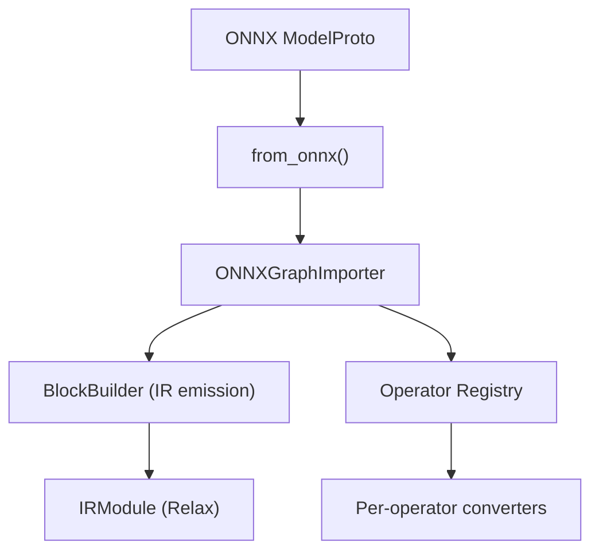
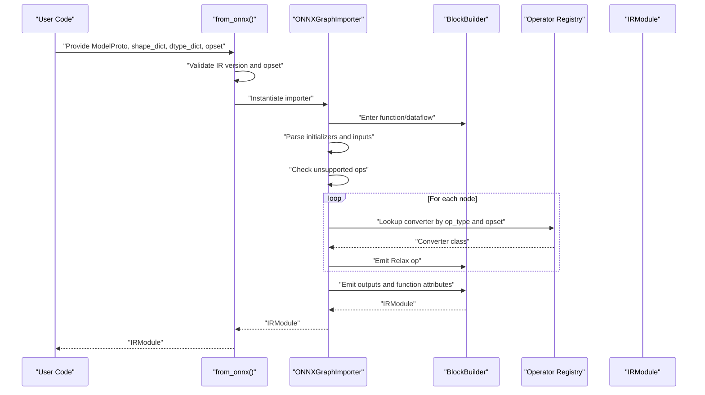
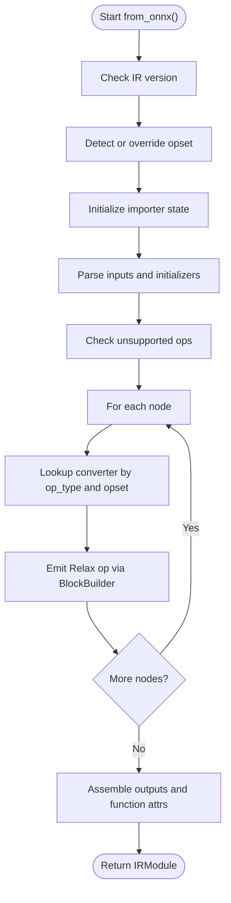
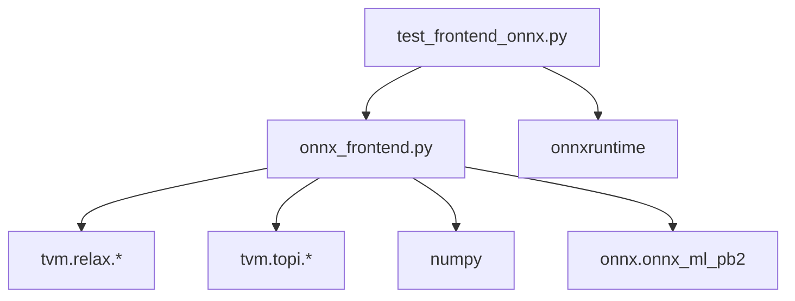

# ONNX Frontend

<cite>
**Referenced Files in This Document**
- [onnx_frontend.py](file://python/tvm/relax/frontend/onnx/onnx_frontend.py)
- [__init__.py](file://python/tvm/relax/frontend/onnx/__init__.py)
- [test_frontend_onnx.py](file://tests/python/relax/test_frontend_onnx.py)
</cite>

## Table of Contents
1. [Introduction](#introduction)
2. [Project Structure](#project-structure)
3. [Core Components](#core-components)
4. [Architecture Overview](#architecture-overview)
5. [Detailed Component Analysis](#detailed-component-analysis)
6. [Dependency Analysis](#dependency-analysis)
7. [Performance Considerations](#performance-considerations)
8. [Troubleshooting Guide](#troubleshooting-guide)
9. [Conclusion](#conclusion)
10. [Appendices](#appendices)

## Introduction
This document describes the ONNX frontend integration that converts ONNX models into TVM’s Relax IR. It covers the importer architecture, operator support, attribute mapping, graph transformation pipeline, version compatibility, dynamic shape handling, preprocessing, shape inference, constant folding, and practical usage patterns. It also includes debugging tips, performance optimization strategies, and best practices for working with ONNX models in TVM.

## Project Structure
The ONNX frontend resides under the Relax frontend package and exposes a single entry point for model conversion. The test suite validates operator coverage, dynamic shapes, and numerical fidelity against ONNX Runtime.

**Diagram sources**
- [onnx_frontend.py:5338-5425](file://python/tvm/relax/frontend/onnx/onnx_frontend.py#L5338-L5425)

**Section sources**
- [onnx_frontend.py:5338-5425](file://python/tvm/relax/frontend/onnx/onnx_frontend.py#L5338-L5425)
- [__init__.py:18-23](file://python/tvm/relax/frontend/onnx/__init__.py#L18-L23)

## Core Components
- from_onnx: Public entry point that validates the model, detects opset, constructs Relax IR, and returns an IRModule.
- ONNXGraphImporter: Core converter that parses inputs, initializers, nodes, and emits Relax expressions.
- Operator Registry: Maps ONNX operator names to converter classes with version-specific implementations.
- BlockBuilder: Emits Relax IR nodes, dataflow blocks, and function outputs.
- Utility helpers: Shape parsing, type conversion, constant extraction, and shape tensor computations.

Key responsibilities:
- Preprocessing: Sanitize input names, parse ValueInfoProto shapes, and normalize dtypes.
- Graph traversal: Resolve node dependencies, handle subgraphs (If), and enforce shape compatibility.
- Operator conversion: Map ONNX attributes to Relax/TVM ops, with opset-aware dispatch.
- Post-processing: Attach function attributes (e.g., num_input, params), and optionally keep parameters as inputs.

**Section sources**
- [onnx_frontend.py:4928-4986](file://python/tvm/relax/frontend/onnx/onnx_frontend.py#L4928-L4986)
- [onnx_frontend.py:5070-5087](file://python/tvm/relax/frontend/onnx/onnx_frontend.py#L5070-L5087)
- [onnx_frontend.py:5226-5259](file://python/tvm/relax/frontend/onnx/onnx_frontend.py#L5226-L5259)

## Architecture Overview
The importer follows a structured pipeline:
1. Validation and detection: IR version, opset, and optional ONNX checker.
2. Initialization: Build importer state, shape/dtype dictionaries, and BlockBuilder.
3. Parse inputs and initializers: Create variables or constants depending on configuration.
4. Unsupported op check: Fail early if operators are not supported.
5. Node construction: Traverse nodes, resolve inputs, and emit Relax expressions.
6. Output assembly: Collect outputs, attach attributes, and return IRModule.

**Diagram sources**
- [onnx_frontend.py:5338-5425](file://python/tvm/relax/frontend/onnx/onnx_frontend.py#L5338-L5425)
- [onnx_frontend.py:4928-4986](file://python/tvm/relax/frontend/onnx/onnx_frontend.py#L4928-L4986)
- [onnx_frontend.py:5226-5259](file://python/tvm/relax/frontend/onnx/onnx_frontend.py#L5226-L5259)

## Detailed Component Analysis

### Import Pipeline and Entry Point
- from_onnx validates IR version and opset, checks the model with ONNX checker, and delegates to ONNXGraphImporter.from_onnx.
- The importer enforces that IR version meets a minimum requirement and warns if the provided opset is lower than the model’s declared opset.
- It supports overriding opset for testing and sanitizing input names to valid Relax identifiers.

Practical usage patterns:
- Pass shape_dict and dtype_dict to guide static shape inference and dtype resolution.
- Use keep_params_in_input to keep weights as explicit inputs for easier inspection/modification.
- Enable sanitize_input_names to avoid invalid identifiers.

**Section sources**
- [onnx_frontend.py:5338-5425](file://python/tvm/relax/frontend/onnx/onnx_frontend.py#L5338-L5425)
- [onnx_frontend.py:4908-4927](file://python/tvm/relax/frontend/onnx/onnx_frontend.py#L4908-L4927)
- [onnx_frontend.py:5008-5035](file://python/tvm/relax/frontend/onnx/onnx_frontend.py#L5008-L5035)

### Graph Parsing and Node Construction
- Inputs: Parse ValueInfoProto shapes and dtypes, sanitize names, and create Relax variables.
- Initializers: Convert TensorProtos to constants or variables depending on keep_params_in_input.
- Unsupported ops: Raise OpNotImplemented with a list of unsupported operator types.
- Shape compatibility: Certain ops accept ShapeExpr inputs; otherwise, they are rejected with a clear error.
- If subgraphs: Recursively construct then/else branches and emit If expressions.

**Diagram sources**
- [onnx_frontend.py:4928-4986](file://python/tvm/relax/frontend/onnx/onnx_frontend.py#L4928-L4986)
- [onnx_frontend.py:5070-5087](file://python/tvm/relax/frontend/onnx/onnx_frontend.py#L5070-L5087)
- [onnx_frontend.py:5120-5187](file://python/tvm/relax/frontend/onnx/onnx_frontend.py#L5120-L5187)

**Section sources**
- [onnx_frontend.py:5043-5069](file://python/tvm/relax/frontend/onnx/onnx_frontend.py#L5043-L5069)
- [onnx_frontend.py:4988-5007](file://python/tvm/relax/frontend/onnx/onnx_frontend.py#L4988-L5007)
- [onnx_frontend.py:5070-5087](file://python/tvm/relax/frontend/onnx/onnx_frontend.py#L5070-L5087)
- [onnx_frontend.py:5120-5187](file://python/tvm/relax/frontend/onnx/onnx_frontend.py#L5120-L5187)

### Operator Support Matrix and Attribute Mapping
The importer maintains a registry of ONNX-to-Relax converters. Each converter class implements versioned methods (e.g., _impl_v13) and selects the appropriate implementation based on the model’s opset. Examples include:

- Arithmetic and logical: Add, Sub, Mul, Div, Pow, Mod, Equal, Less, Greater, Bitwise ops, Round.
- Activations: Sigmoid, Softmax, LogSoftmax, Hardmax, Relu, LeakyRelu, PRelu, Gelu variants, Mish, Swish-style activations.
- Linear algebra: MatMul, Gemm, MatMulInteger16, BatchNormalization, InstanceNormalization, MeanVarianceNormalization.
- Convolutions: Conv, ConvTranspose with auto_pad handling and layout selection.
- Reshaping and indexing: Reshape, Transpose, Concat, Split, Gather/GatherElements/GatherND, Squeeze/Unsqueeze, Shape, Size, Where, Expand, Tile, Slice, Pad.
- Vision/image ops: Resize (including ROI and dynamic sizes), RoiAlign, MaxRoiPool, AffineGrid, Einsum.
- Control-flow: If (subgraph handling).

Notes:
- Experimental/commercial domains (e.g., com.microsoft) are supported when declared in opset_import.
- Some ops require specific dtypes or have restrictions (e.g., MatMulInteger16, BitShift direction, Pad mode).
- Dynamic shapes are supported where implemented; otherwise, errors indicate missing static information.

**Section sources**
- [onnx_frontend.py:284-313](file://python/tvm/relax/frontend/onnx/onnx_frontend.py#L284-L313)
- [onnx_frontend.py:382-419](file://python/tvm/relax/frontend/onnx/onnx_frontend.py#L382-L419)
- [onnx_frontend.py:1068-1098](file://python/tvm/relax/frontend/onnx/onnx_frontend.py#L1068-L1098)
- [onnx_frontend.py:1421-1489](file://python/tvm/relax/frontend/onnx/onnx_frontend.py#L1421-L1489)
- [onnx_frontend.py:2570-2698](file://python/tvm/relax/frontend/onnx/onnx_frontend.py#L2570-L2698)
- [onnx_frontend.py:2808-2939](file://python/tvm/relax/frontend/onnx/onnx_frontend.py#L2808-L2939)
- [onnx_frontend.py:3068-3094](file://python/tvm/relax/frontend/onnx/onnx_frontend.py#L3068-L3094)

### Shape Inference and Symbolic Shapes
- Shape parsing: Converts ValueInfoProto dimensions to either concrete ints or SizeVar-based expressions.
- Expression evaluation: Parses shape expressions like “A - B” into PrimExpr and SizeVar combinations.
- Shape compatibility: Certain ops (Reshape, Resize, ConstantOfShape, Gather, Slice, Shape, Expand, Concat, Equal, Where, Cast, Squeeze) accept ShapeExpr inputs; others reject them.
- Dynamic shape handling: Uses shape tensors, tensor_to_shape, and arithmetic to derive output shapes for ops like Unsqueeze/Squeeze, Slice, Expand, Tile.

Common pitfalls:
- Missing static rank or length for dynamic ops raises explicit errors.
- Broadcast rules for Expand enforce ONNX semantics (preserving -1, aligning shapes right).

**Section sources**
- [onnx_frontend.py:140-189](file://python/tvm/relax/frontend/onnx/onnx_frontend.py#L140-L189)
- [onnx_frontend.py:2106-2176](file://python/tvm/relax/frontend/onnx/onnx_frontend.py#L2106-L2176)
- [onnx_frontend.py:2441-2567](file://python/tvm/relax/frontend/onnx/onnx_frontend.py#L2441-L2567)
- [onnx_frontend.py:2178-2320](file://python/tvm/relax/frontend/onnx/onnx_frontend.py#L2178-L2320)

### Constant Folding and Parameter Handling
- get_constant: Attempts to convert a variable to a constant if it exists in the parameter registry; updates the node map accordingly.
- Initializer handling: If keep_params_in_input is True, initializers become explicit inputs; otherwise they are folded into constants.
- Constant ops: Constant and ConstantOfShape convert TensorProtos to Relax constants with proper dtypes.

Best practices:
- Use keep_params_in_input=True when you need to inspect or modify weights post-import.
- Prefer folding constants for deployment to reduce parameter overhead.

**Section sources**
- [onnx_frontend.py:78-112](file://python/tvm/relax/frontend/onnx/onnx_frontend.py#L78-L112)
- [onnx_frontend.py:4997-5006](file://python/tvm/relax/frontend/onnx/onnx_frontend.py#L4997-L5006)
- [onnx_frontend.py:1623-1641](file://python/tvm/relax/frontend/onnx/onnx_frontend.py#L1623-L1641)
- [onnx_frontend.py:1643-1667](file://python/tvm/relax/frontend/onnx/onnx_frontend.py#L1643-L1667)

### Dynamic Shapes and Experimental Operators
- Dynamic shapes: Supported widely (e.g., Slice, Expand, Tile, Resize, AffineGrid), with careful checks for known ranks and lengths.
- Experimental/com.microsoft domain: Supported when declared in opset_import; examples include MatMulInteger (domain “com.microsoft”) and Attention.

Validation and testing:
- Tests cover dynamic inputs, symbolic shapes, and shape expressions.
- Numerical fidelity is validated against ONNX Runtime using DecomposeOpsForInference and LegalizeOps.

**Section sources**
- [onnx_frontend.py:401-482](file://python/tvm/relax/frontend/onnx/onnx_frontend.py#L401-L482)
- [test_frontend_onnx.py:402-434](file://tests/python/relax/test_frontend_onnx.py#L402-L434)
- [test_frontend_onnx.py:4246-4278](file://tests/python/relax/test_frontend_onnx.py#L4246-L4278)

### Practical Examples and Workflows
- Basic import and inference:
  - Use from_onnx to convert a ModelProto.
  - Apply relax.transform.DecomposeOpsForInference and relax.transform.LegalizeOps.
  - Detach parameters and compile with TVM runtime.
- Handling dynamic shapes:
  - Provide shape_dict with symbolic dimensions (e.g., “A”, “B”).
  - Ensure ops support dynamic inputs; otherwise, adjust model or pre-specialize shapes.
- Managing unsupported features:
  - Identify unsupported ops via the error message and either export a compatible model or implement a custom converter.

**Section sources**
- [test_frontend_onnx.py:122-146](file://tests/python/relax/test_frontend_onnx.py#L122-L146)
- [test_frontend_onnx.py:4246-4278](file://tests/python/relax/test_frontend_onnx.py#L4246-L4278)

## Dependency Analysis
The ONNX frontend depends on:
- TVM Relax IR and BlockBuilder for emitting expressions.
- Topi ops for certain lowering paths (e.g., pad, tile, resize).
- ONNX protobuf for model parsing and optional checker.
- NumPy for array conversions and shape computations.

**Diagram sources**
- [onnx_frontend.py:48-58](file://python/tvm/relax/frontend/onnx/onnx_frontend.py#L48-L58)
- [test_frontend_onnx.py:28-40](file://tests/python/relax/test_frontend_onnx.py#L28-L40)

**Section sources**
- [onnx_frontend.py:48-58](file://python/tvm/relax/frontend/onnx/onnx_frontend.py#L48-L58)
- [test_frontend_onnx.py:28-40](file://tests/python/relax/test_frontend_onnx.py#L28-L40)

## Performance Considerations
- Prefer static shapes when possible to enable better kernel selection and eliminate dynamic checks.
- Use keep_params_in_input only when you need to inspect or modify weights; otherwise fold constants to reduce overhead.
- Legalization and decomposition passes improve compatibility and enable downstream optimizations.
- For large models, consider pre-folding constants and pruning unused initializers.

[No sources needed since this section provides general guidance]

## Troubleshooting Guide
Common issues and resolutions:
- Unsupported operator: The importer raises OpNotImplemented with a list of unsupported op types. Export a compatible model or implement a converter.
- Shape errors: Many ops require known ranks or lengths; ensure inputs have sufficient static information or specialize shapes.
- Opset mismatch: Overriding opset lower than the model’s declared opset triggers a warning; align opsets or use the model’s declared version.
- Dynamic shape pitfalls: Some ops do not support dynamic parameters; switch to static shapes or adjust model structure.
- Validation failures: If ONNX checker reports issues, fix the model before importing.

Debugging tips:
- Enable sanitize_input_names to avoid invalid identifiers.
- Use DecomposeOpsForInference and LegalizeOps to reveal intermediate IR and locate problematic ops.
- Compare outputs with ONNX Runtime using the test harness to isolate discrepancies.

**Section sources**
- [onnx_frontend.py:5070-5087](file://python/tvm/relax/frontend/onnx/onnx_frontend.py#L5070-L5087)
- [onnx_frontend.py:5414-5422](file://python/tvm/relax/frontend/onnx/onnx_frontend.py#L5414-L5422)
- [test_frontend_onnx.py:122-146](file://tests/python/relax/test_frontend_onnx.py#L122-L146)

## Conclusion
The ONNX frontend provides a robust pathway to convert ONNX models into TVM’s Relax IR. It supports a wide range of operators, handles dynamic shapes where feasible, and integrates with TVM’s pass pipeline for further optimization. By understanding the importer’s architecture, operator registry, and shape handling, users can effectively debug conversion issues, optimize performance, and adopt best practices for production deployments.

[No sources needed since this section summarizes without analyzing specific files]

## Appendices

### ONNX Version Compatibility
- Minimum IR version enforced by the importer.
- Opset detection and override behavior.
- Domain-specific opsets (e.g., com.microsoft) supported when declared.

**Section sources**
- [onnx_frontend.py:5373-5378](file://python/tvm/relax/frontend/onnx/onnx_frontend.py#L5373-L5378)
- [onnx_frontend.py:5400-5422](file://python/tvm/relax/frontend/onnx/onnx_frontend.py#L5400-L5422)

### Operator Coverage Highlights
- Arithmetic/logical: Add, Sub, Mul, Div, Pow, Mod, Equal, Less, Greater, Bitwise ops, Round.
- Activations: Sigmoid, Softmax, LogSoftmax, Hardmax, Relu, LeakyRelu, PRelu, Gelu variants, Mish.
- Linear algebra: MatMul, Gemm, MatMulInteger16, BatchNormalization, InstanceNormalization.
- Convolutions: Conv, ConvTranspose with auto_pad and layouts.
- Reshaping/indexing: Reshape, Transpose, Concat, Split, Gather/GatherElements/GatherND, Squeeze/Unsqueeze, Shape, Size, Where, Expand, Tile, Slice, Pad.
- Vision/image: Resize (ROI and dynamic sizes), RoiAlign, MaxRoiPool, AffineGrid, Einsum.

**Section sources**
- [onnx_frontend.py:472-542](file://python/tvm/relax/frontend/onnx/onnx_frontend.py#L472-L542)
- [onnx_frontend.py:1220-1301](file://python/tvm/relax/frontend/onnx/onnx_frontend.py#L1220-L1301)
- [onnx_frontend.py:1421-1489](file://python/tvm/relax/frontend/onnx/onnx_frontend.py#L1421-L1489)
- [onnx_frontend.py:2570-2698](file://python/tvm/relax/frontend/onnx/onnx_frontend.py#L2570-L2698)
- [onnx_frontend.py:2808-2939](file://python/tvm/relax/frontend/onnx/onnx_frontend.py#L2808-L2939)
- [onnx_frontend.py:3068-3094](file://python/tvm/relax/frontend/onnx/onnx_frontend.py#L3068-L3094)