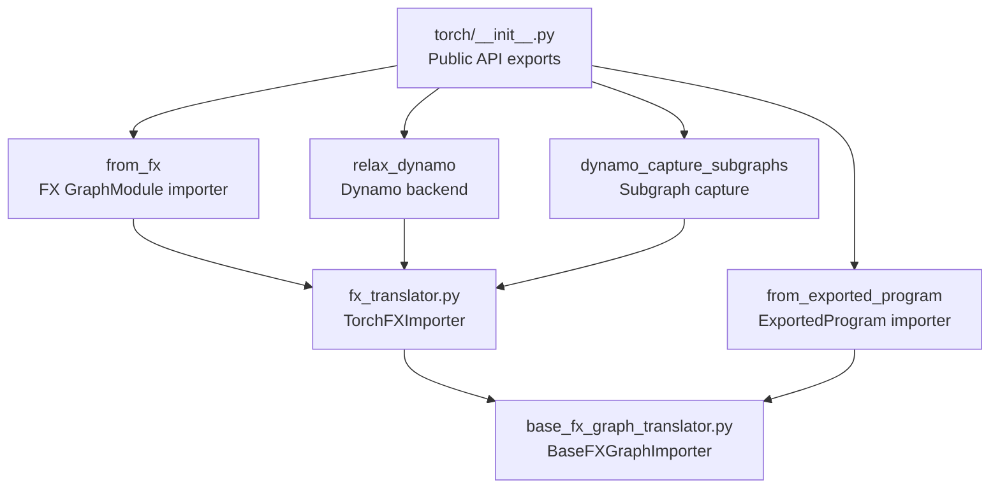
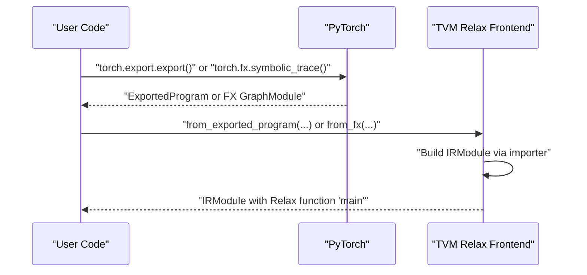
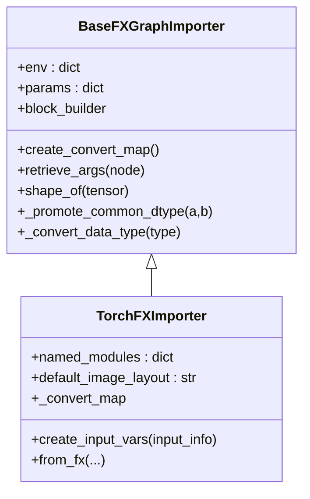
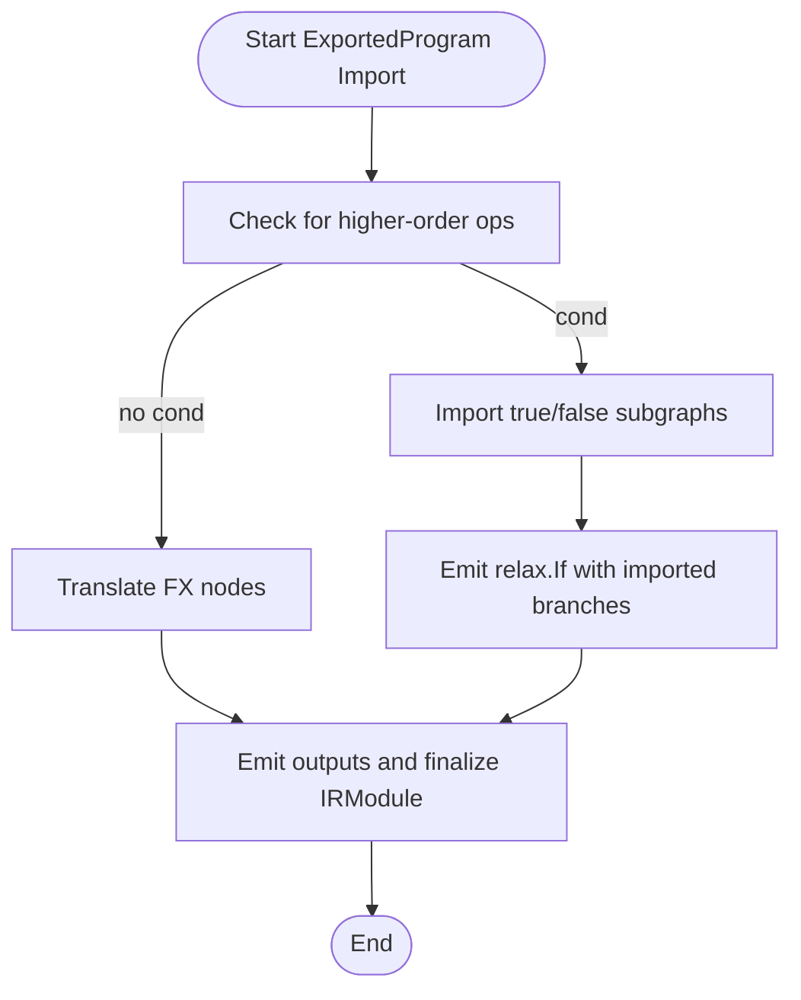
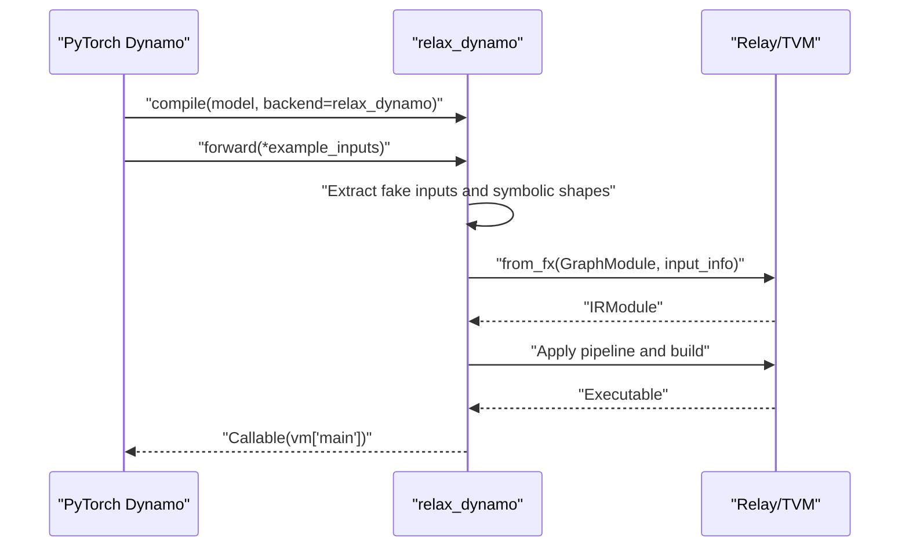
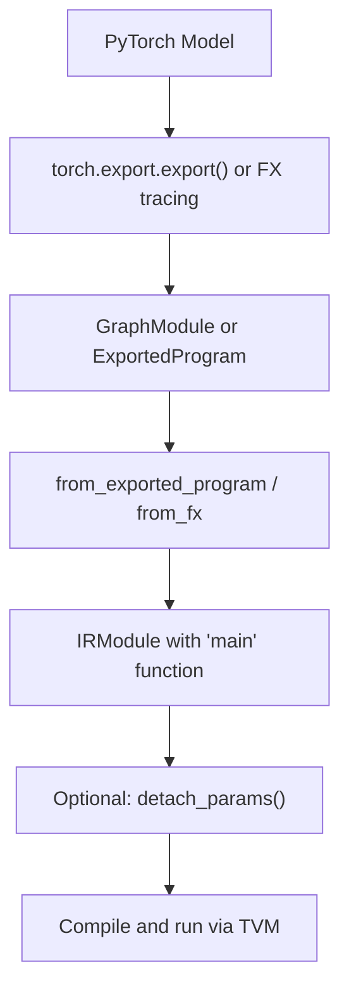
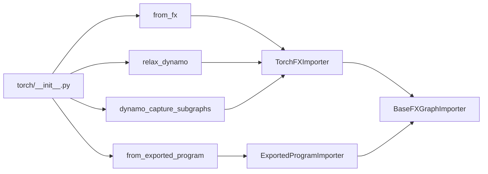

# PyTorch Frontend

<cite>
**Referenced Files in This Document**
- [__init__.py](file://python/tvm/relax/frontend/torch/__init__.py)
- [base_fx_graph_translator.py](file://python/tvm/relax/frontend/torch/base_fx_graph_translator.py)
- [fx_translator.py](file://python/tvm/relax/frontend/torch/fx_translator.py)
- [exported_program_translator.py](file://python/tvm/relax/frontend/torch/exported_program_translator.py)
- [dynamo.py](file://python/tvm/relax/frontend/torch/dynamo.py)
- [import_model.py](file://docs/how_to/tutorials/import_model.py)
- [test_frontend_dynamo.py](file://tests/python/relax/test_frontend_dynamo.py)
- [test_pytorch_integration.py](file://tests/python/relax/test_pytorch_integration.py)
</cite>

## Table of Contents
1. [Introduction](#introduction)
2. [Project Structure](#project-structure)
3. [Core Components](#core-components)
4. [Architecture Overview](#architecture-overview)
5. [Detailed Component Analysis](#detailed-component-analysis)
6. [Dependency Analysis](#dependency-analysis)
7. [Performance Considerations](#performance-considerations)
8. [Troubleshooting Guide](#troubleshooting-guide)
9. [Conclusion](#conclusion)
10. [Appendices](#appendices)

## Introduction
This document explains the PyTorch frontend integration for converting PyTorch models into TVM’s Relax IR. It covers three primary translation pathways:
- FX graph translation for torch.export workflows
- ExportedProgram translation for torch.export graphs
- Dynamo integration for dynamic graph capture and execution

It details the translation pipeline from PyTorch tensors to Relax IR, operator mapping, shape inference, parameter handling, and advanced features such as symbolic shapes, dynamic control flow, and custom operator support. Practical examples, version handling, and debugging strategies are included.

## Project Structure
The PyTorch frontend resides under the Relax frontend package and exposes a small public API surface while implementing robust internal translators.

**Diagram sources**
- [__init__.py:22-24](file://python/tvm/relax/frontend/torch/__init__.py#L22-L24)
- [fx_translator.py:31-44](file://python/tvm/relax/frontend/torch/fx_translator.py#L31-L44)
- [exported_program_translator.py:37-47](file://python/tvm/relax/frontend/torch/exported_program_translator.py#L37-L47)
- [dynamo.py:38-142](file://python/tvm/relax/frontend/torch/dynamo.py#L38-L142)
- [base_fx_graph_translator.py:32-47](file://python/tvm/relax/frontend/torch/base_fx_graph_translator.py#L32-L47)

**Section sources**
- [__init__.py:18-25](file://python/tvm/relax/frontend/torch/__init__.py#L18-L25)

## Core Components
- TorchFXImporter: Converts FX GraphModules (from torch.export or torch.fx.symbolic_trace) into Relax IR. Handles operator mapping, parameter embedding, and input variable creation.
- ExportedProgramImporter: Specializes the base importer for torch.export graphs, including higher-order control-flow handling and specialized ops.
- BaseFXGraphImporter: Provides shared utilities for shape inference, dtype conversion, parameter handling, and common operator implementations.
- Dynamo backend: Bridges torch.compile with TVM by capturing FX subgraphs and compiling them into a TVM executable.

Key capabilities:
- Operator coverage for activations, normalization, convolution families, pooling, attention, and tensor manipulation.
- Parameter handling: embedding vs. passing as inputs; dtype promotion and casting.
- Dynamic shapes and symbolic variables for flexible shapes.
- Custom operator extension via a conversion map.

**Section sources**
- [fx_translator.py:31-44](file://python/tvm/relax/frontend/torch/fx_translator.py#L31-L44)
- [exported_program_translator.py:37-47](file://python/tvm/relax/frontend/torch/exported_program_translator.py#L37-L47)
- [base_fx_graph_translator.py:32-47](file://python/tvm/relax/frontend/torch/base_fx_graph_translator.py#L32-L47)
- [dynamo.py:38-142](file://python/tvm/relax/frontend/torch/dynamo.py#L38-L142)

## Architecture Overview
The frontend supports multiple entry points depending on the PyTorch export path used.

**Diagram sources**
- [import_model.py:80-95](file://docs/how_to/tutorials/import_model.py#L80-L95)
- [exported_program_translator.py:37-47](file://python/tvm/relax/frontend/torch/exported_program_translator.py#L37-L47)
- [fx_translator.py:1059-1166](file://python/tvm/relax/frontend/torch/fx_translator.py#L1059-L1166)

## Detailed Component Analysis

### FX Graph Translator (TorchFXImporter)
Responsibilities:
- Translate FX GraphModules into Relax IR.
- Map PyTorch operators to Relax equivalents.
- Handle parameters as constants or function inputs.
- Manage input variables and return tuple handling.

Highlights:
- Input creation from explicit shapes and dtypes.
- Module-level parameter embedding with dtype checks.
- Extensive operator map covering activations, norms, convolutions, pooling, attention, and tensor manipulations.
- Support for inplace operations and dtype conversions.

**Diagram sources**
- [base_fx_graph_translator.py:32-47](file://python/tvm/relax/frontend/torch/base_fx_graph_translator.py#L32-L47)
- [fx_translator.py:31-44](file://python/tvm/relax/frontend/torch/fx_translator.py#L31-L44)

**Section sources**
- [fx_translator.py:1059-1166](file://python/tvm/relax/frontend/torch/fx_translator.py#L1059-L1166)
- [fx_translator.py:1169-1281](file://python/tvm/relax/frontend/torch/fx_translator.py#L1169-L1281)

### ExportedProgram Translator (ExportedProgramImporter)
Responsibilities:
- Translate torch.export graphs into Relax IR.
- Handle higher-order control-flow constructs (e.g., torch.ops.higher_order.cond).
- Specialized handling for batch norm variants and functional forms.
- Sparse tensor fallback and conversion utilities.

Advanced features:
- Branch subgraph import with fresh symbolic variables to avoid leakage.
- Identity slice pruning for dynamic shapes to improve shape inference.
- Functional-style batch norm and normalization handling.

**Diagram sources**
- [exported_program_translator.py:1302-1341](file://python/tvm/relax/frontend/torch/exported_program_translator.py#L1302-L1341)
- [exported_program_translator.py:1430-1470](file://python/tvm/relax/frontend/torch/exported_program_translator.py#L1430-L1470)

**Section sources**
- [exported_program_translator.py:1283-1286](file://python/tvm/relax/frontend/torch/exported_program_translator.py#L1283-L1286)
- [exported_program_translator.py:1474-1599](file://python/tvm/relax/frontend/torch/exported_program_translator.py#L1474-L1599)

### Dynamo Integration
Responsibilities:
- Provide a torch.compile backend that captures FX subgraphs and builds TVM executables.
- Support dynamic capture with symbolic shapes and device selection.
- Execute converted models directly from PyTorch.

Key behaviors:
- Backend factory returns a callable that consumes FX GraphModule and example inputs.
- Device detection and target selection (CPU/GPU).
- Pipeline selection and optional custom pipeline.
- Fake tensor handling for symbolic shapes.

**Diagram sources**
- [dynamo.py:52-140](file://python/tvm/relax/frontend/torch/dynamo.py#L52-L140)
- [dynamo.py:145-194](file://python/tvm/relax/frontend/torch/dynamo.py#L145-L194)

**Section sources**
- [dynamo.py:38-142](file://python/tvm/relax/frontend/torch/dynamo.py#L38-L142)
- [dynamo.py:145-194](file://python/tvm/relax/frontend/torch/dynamo.py#L145-L194)

### Translation Pipeline: PyTorch Tensors to Relax IR
End-to-end flow:
- Input preparation: Provide shapes and dtypes for FX-based import.
- Parameter handling: Embed as constants or pass as inputs; dtype conversion and validation.
- Operator mapping: Map PyTorch ops to Relax ops with shape and dtype propagation.
- Control flow: Handle dynamic control flow via higher-order ops and branch subgraphs.
- Output handling: Unwrap unit return tuples and bind outputs appropriately.

**Diagram sources**
- [import_model.py:80-95](file://docs/how_to/tutorials/import_model.py#L80-L95)
- [exported_program_translator.py:37-47](file://python/tvm/relax/frontend/torch/exported_program_translator.py#L37-L47)
- [fx_translator.py:1059-1166](file://python/tvm/relax/frontend/torch/fx_translator.py#L1059-L1166)

**Section sources**
- [import_model.py:80-117](file://docs/how_to/tutorials/import_model.py#L80-L117)
- [fx_translator.py:1059-1166](file://python/tvm/relax/frontend/torch/fx_translator.py#L1059-L1166)

## Dependency Analysis
- Public API: Exports three primary functions—`from_exported_program`, `from_fx`, and the Dynamo backend helpers.
- Internal translators share a common base for utilities and operator implementations.
- Dynamo backend depends on FX importers and TVM build/runtime.

**Diagram sources**
- [__init__.py:22-24](file://python/tvm/relax/frontend/torch/__init__.py#L22-L24)
- [fx_translator.py:31-44](file://python/tvm/relax/frontend/torch/fx_translator.py#L31-L44)
- [exported_program_translator.py:37-47](file://python/tvm/relax/frontend/torch/exported_program_translator.py#L37-L47)
- [dynamo.py:38-142](file://python/tvm/relax/frontend/torch/dynamo.py#L38-L142)
- [base_fx_graph_translator.py:32-47](file://python/tvm/relax/frontend/torch/base_fx_graph_translator.py#L32-L47)

**Section sources**
- [__init__.py:18-25](file://python/tvm/relax/frontend/torch/__init__.py#L18-L25)

## Performance Considerations
- Prefer torch.export over FX tracing for improved operator decomposition and coverage.
- Use keep_params_as_input when weights need independent management (e.g., quantization or weight sharing).
- Run the default TVM optimization pipeline to enable passes that improve performance.
- For Dynamo, choose appropriate target and pipeline; CPU/GPU selection is automatic based on input devices.

[No sources needed since this section provides general guidance]

## Troubleshooting Guide
Common issues and resolutions:
- Unsupported operators: Extend the importer with a custom_convert_map to map unknown ops to Relax equivalents.
- Dtype mismatches: Ensure parameter dtypes are float32/float16; the importer validates and raises errors for unsupported types.
- Dynamic shapes: Use symbolic shapes in input_info; the Dynamo backend extracts SymInts and maps them to TVM SizeVars.
- Control flow: Higher-order ops like cond are supported; ensure branch subgraphs are imported correctly.
- Verification: Compare TVM outputs with original PyTorch to validate correctness.

Practical references:
- Custom operator support via custom_convert_map and importer hooks.
- Dynamo backend usage and symbolic shape handling.
- Integration tests validating end-to-end conversion and execution.

**Section sources**
- [import_model.py:118-136](file://docs/how_to/tutorials/import_model.py#L118-L136)
- [dynamo.py:88-99](file://python/tvm/relax/frontend/torch/dynamo.py#L88-L99)
- [test_frontend_dynamo.py:295-304](file://tests/python/relax/test_frontend_dynamo.py#L295-L304)
- [test_pytorch_integration.py](file://tests/python/relax/test_pytorch_integration.py)

## Conclusion
The PyTorch frontend provides a comprehensive pathway to convert PyTorch models into TVM’s Relax IR. It supports modern export workflows, dynamic graph capture, and advanced features like symbolic shapes and higher-order control flow. With clear APIs, extensive operator coverage, and extensibility via custom converters, it enables efficient deployment and optimization of PyTorch models within the TVM ecosystem.

[No sources needed since this section summarizes without analyzing specific files]

## Appendices

### Practical Examples
- Basic import using torch.export and detach_params.
- Custom operator mapping via a custom_convert_map.
- Dynamo backend usage for dynamic capture and execution.

**Section sources**
- [import_model.py:80-117](file://docs/how_to/tutorials/import_model.py#L80-L117)
- [import_model.py:118-136](file://docs/how_to/tutorials/import_model.py#L118-L136)