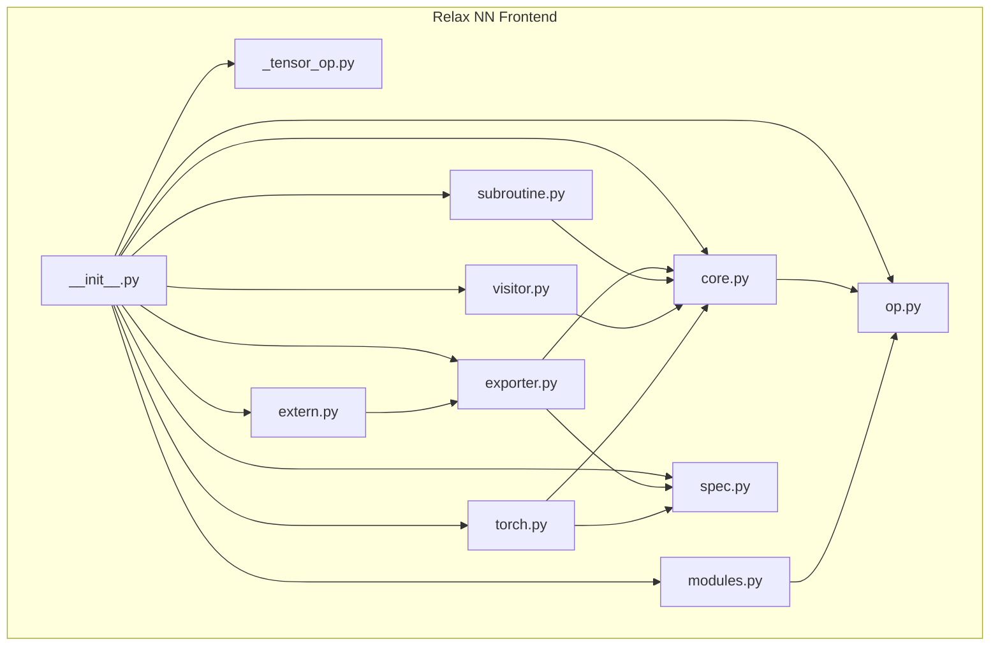
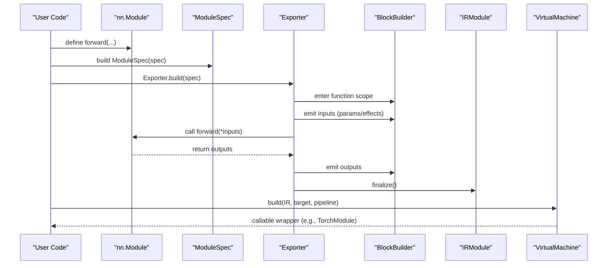
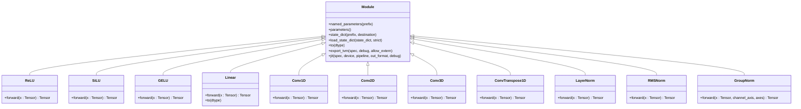
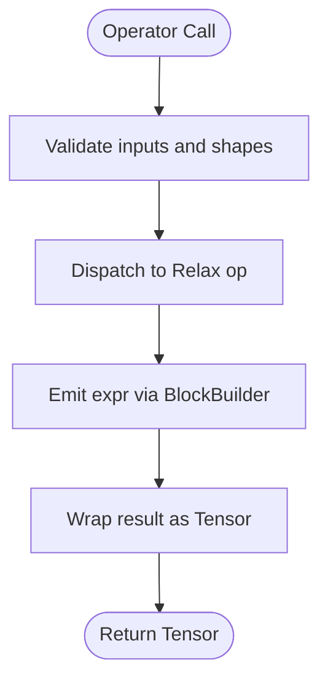
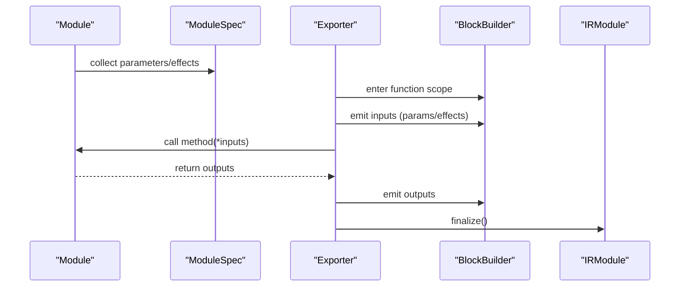
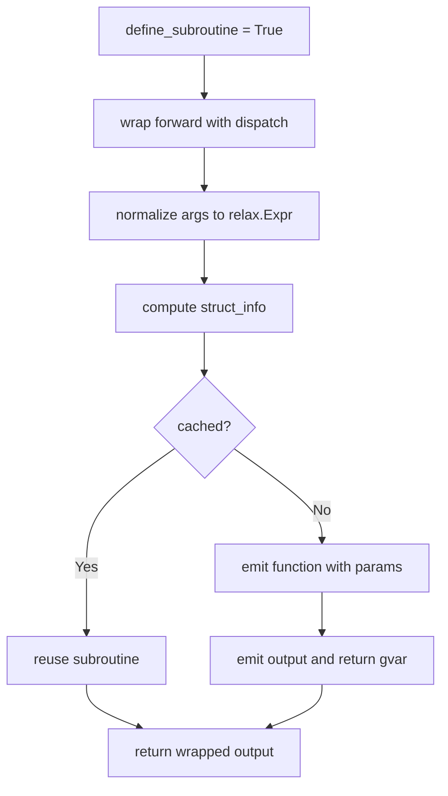
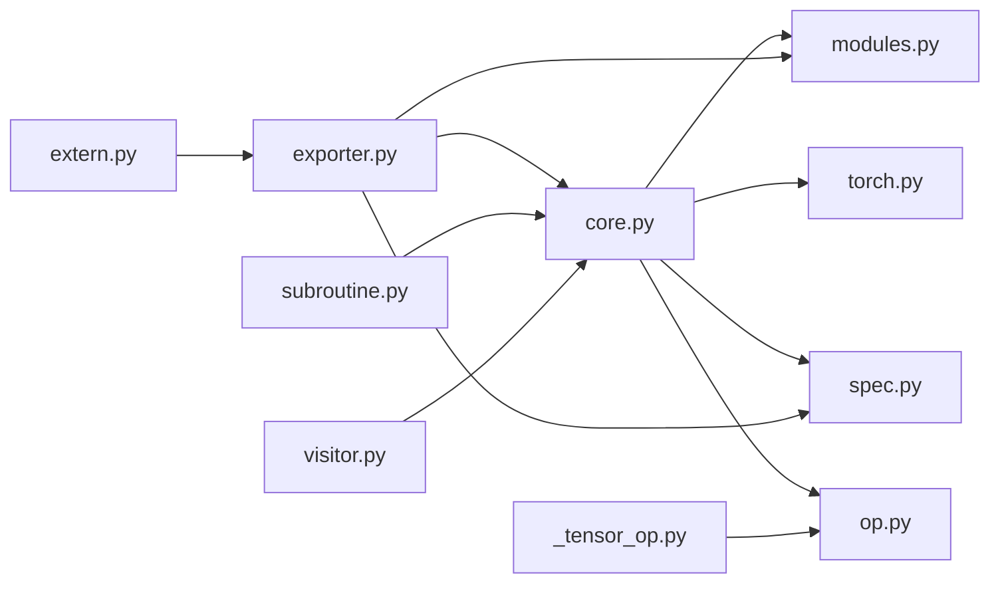

# Relax NN Frontend

<cite>
**Referenced Files in This Document**
- [__init__.py](file://python/tvm/relax/frontend/nn/__init__.py)
- [core.py](file://python/tvm/relax/frontend/nn/core.py)
- [modules.py](file://python/tvm/relax/frontend/nn/modules.py)
- [op.py](file://python/tvm/relax/frontend/nn/op.py)
- [spec.py](file://python/tvm/relax/frontend/nn/spec.py)
- [exporter.py](file://python/tvm/relax/frontend/nn/exporter.py)
- [subroutine.py](file://python/tvm/relax/frontend/nn/subroutine.py)
- [visitor.py](file://python/tvm/relax/frontend/nn/visitor.py)
- [_tensor_op.py](file://python/tvm/relax/frontend/nn/_tensor_op.py)
- [torch.py](file://python/tvm/relax/frontend/nn/torch.py)
- [extern.py](file://python/tvm/relax/frontend/nn/extern.py)
</cite>

## Table of Contents
1. [Introduction](#introduction)
2. [Project Structure](#project-structure)
3. [Core Components](#core-components)
4. [Architecture Overview](#architecture-overview)
5. [Detailed Component Analysis](#detailed-component-analysis)
6. [Dependency Analysis](#dependency-analysis)
7. [Performance Considerations](#performance-considerations)
8. [Troubleshooting Guide](#troubleshooting-guide)
9. [Conclusion](#conclusion)
10. [Appendices](#appendices)

## Introduction
This document describes the Relax NN frontend system in TVM, which provides a PyTorch-like API to construct neural networks and export them to TVM’s intermediate representation (IRModule). It covers:
- High-level neural network construction API (modules, operators, and model specification language)
- Module composition patterns and subroutine system for reusable computation blocks
- Exporter functionality to generate Relax IR from high-level NN specifications
- Visitor patterns for AST traversal
- Tensor operation utilities
- Practical examples, best practices, and debugging techniques

## Project Structure
The Relax NN frontend lives under python/tvm/relax/frontend/nn and exposes a cohesive API surface:
- Public API entrypoint aggregates core types, modules, operators, and helpers
- Core infrastructure defines Tensor, Parameter, Module, and Effect abstractions
- Built-in modules implement common neural network layers
- Operators provide tensor operations mapped to Relax ops
- Specification language defines dynamic shapes and method signatures
- Exporter converts modules to IRModule with parameter and effect handling
- Subroutine system enables reusable computation blocks
- Visitor supports transforming and mutating module graphs
- External module support integrates handcrafted kernels
- Torch compatibility layer bridges PyTorch tensors and TVM VM

**Diagram sources**
- [__init__.py:20-44](file://python/tvm/relax/frontend/nn/__init__.py#L20-L44)
- [core.py:90-150](file://python/tvm/relax/frontend/nn/core.py#L90-L150)
- [modules.py:58-95](file://python/tvm/relax/frontend/nn/modules.py#L58-L95)
- [op.py:40-80](file://python/tvm/relax/frontend/nn/op.py#L40-L80)
- [spec.py:31-85](file://python/tvm/relax/frontend/nn/spec.py#L31-L85)
- [exporter.py:46-94](file://python/tvm/relax/frontend/nn/exporter.py#L46-L94)
- [subroutine.py:67-118](file://python/tvm/relax/frontend/nn/subroutine.py#L67-L118)
- [visitor.py:24-82](file://python/tvm/relax/frontend/nn/visitor.py#L24-L82)
- [_tensor_op.py:41-105](file://python/tvm/relax/frontend/nn/_tensor_op.py#L41-L105)
- [torch.py:33-87](file://python/tvm/relax/frontend/nn/torch.py#L33-L87)
- [extern.py:36-80](file://python/tvm/relax/frontend/nn/extern.py#L36-L80)

**Section sources**
- [__init__.py:20-44](file://python/tvm/relax/frontend/nn/__init__.py#L20-L44)

## Core Components
- Tensor: Symbolic tensor wrapper over relax.Expr with eager shape/dtype inference
- Parameter: Learnable tensor with optional binding to concrete values
- Module: Base class for neural network components; supports nested composition
- Effect: Side-effect carriers (e.g., IO, KV cache); integrated into exported IR
- Object: Non-tensor frontend object placeholders

Key capabilities:
- Parameter iteration and state_dict management
- Module.to(dtype) recursion and JIT compilation to TVM VM
- Export to IRModule with optional external modules and effects

**Section sources**
- [core.py:90-150](file://python/tvm/relax/frontend/nn/core.py#L90-L150)
- [core.py:235-310](file://python/tvm/relax/frontend/nn/core.py#L235-L310)
- [core.py:354-460](file://python/tvm/relax/frontend/nn/core.py#L354-L460)
- [core.py:328-353](file://python/tvm/relax/frontend/nn/core.py#L328-L353)
- [core.py:312-327](file://python/tvm/relax/frontend/nn/core.py#L312-L327)

## Architecture Overview
The Relax NN frontend composes modules into a computation graph, lowers them to Relax IR via an exporter, and optionally attaches external modules and effects. JIT compilation integrates with the TVM VM and supports PyTorch tensor bridging.

**Diagram sources**
- [exporter.py:87-144](file://python/tvm/relax/frontend/nn/exporter.py#L87-L144)
- [core.py:460-576](file://python/tvm/relax/frontend/nn/core.py#L460-L576)
- [torch.py:33-87](file://python/tvm/relax/frontend/nn/torch.py#L33-L87)

## Detailed Component Analysis

### Neural Network Modules
Built-in modules encapsulate common layers and activations:
- Activations: ReLU, SiLU, GELU, Identity
- Convolutions: Conv1D, Conv2D, Conv3D, ConvTranspose1D
- Normalizations: LayerNorm, RMSNorm, GroupNorm
- Linear: General matrix multiplication with optional bias and out_dtype accumulation

Each module defines a forward method that composes tensor operations from the op module.

**Diagram sources**
- [core.py:354-460](file://python/tvm/relax/frontend/nn/core.py#L354-L460)
- [modules.py:58-95](file://python/tvm/relax/frontend/nn/modules.py#L58-L95)
- [modules.py:97-173](file://python/tvm/relax/frontend/nn/modules.py#L97-L173)
- [modules.py:175-259](file://python/tvm/relax/frontend/nn/modules.py#L175-L259)
- [modules.py:261-364](file://python/tvm/relax/frontend/nn/modules.py#L261-L364)
- [modules.py:366-469](file://python/tvm/relax/frontend/nn/modules.py#L366-L469)
- [modules.py:471-567](file://python/tvm/relax/frontend/nn/modules.py#L471-L567)
- [modules.py:569-627](file://python/tvm/relax/frontend/nn/modules.py#L569-L627)
- [modules.py:629-684](file://python/tvm/relax/frontend/nn/modules.py#L629-L684)
- [modules.py:687-748](file://python/tvm/relax/frontend/nn/modules.py#L687-L748)

**Section sources**
- [modules.py:58-95](file://python/tvm/relax/frontend/nn/modules.py#L58-L95)
- [modules.py:97-173](file://python/tvm/relax/frontend/nn/modules.py#L97-L173)
- [modules.py:175-259](file://python/tvm/relax/frontend/nn/modules.py#L175-L259)
- [modules.py:261-364](file://python/tvm/relax/frontend/nn/modules.py#L261-L364)
- [modules.py:366-469](file://python/tvm/relax/frontend/nn/modules.py#L366-L469)
- [modules.py:471-567](file://python/tvm/relax/frontend/nn/modules.py#L471-L567)
- [modules.py:569-627](file://python/tvm/relax/frontend/nn/modules.py#L569-L627)
- [modules.py:629-684](file://python/tvm/relax/frontend/nn/modules.py#L629-L684)
- [modules.py:687-748](file://python/tvm/relax/frontend/nn/modules.py#L687-L748)

### Operator Definitions and Tensor Utilities
Operators provide numpy-style broadcasting and shape inference:
- Arithmetic: add, subtract, multiply, divide
- Reductions: sum, max, min
- Transformations: reshape, permute_dims, broadcast_to, repeat, chunk
- Convolutions: conv1d, conv2d, conv3d, conv1d_transpose
- Comparisons: maximum, minimum, less, greater, etc.
- Matmul with optional out_dtype accumulation

Tensor utilities include member operators via _TensorOp, enabling intuitive arithmetic and transformations.

**Diagram sources**
- [op.py:40-80](file://python/tvm/relax/frontend/nn/op.py#L40-L80)
- [_tensor_op.py:41-105](file://python/tvm/relax/frontend/nn/_tensor_op.py#L41-L105)

**Section sources**
- [op.py:40-80](file://python/tvm/relax/frontend/nn/op.py#L40-L80)
- [op.py:318-351](file://python/tvm/relax/frontend/nn/op.py#L318-L351)
- [op.py:353-502](file://python/tvm/relax/frontend/nn/op.py#L353-L502)
- [op.py:504-650](file://python/tvm/relax/frontend/nn/op.py#L504-L650)
- [op.py:652-706](file://python/tvm/relax/frontend/nn/op.py#L652-L706)
- [_tensor_op.py:41-105](file://python/tvm/relax/frontend/nn/_tensor_op.py#L41-L105)

### Model Specification Language
The specification language defines dynamic shapes and method signatures:
- Int, Tensor, Object, Tuple descriptors
- MethodSpec captures method signature, argument specs, and parameter/effect modes
- ModuleSpec aggregates per-method specs for export

Dynamic shapes are supported via symbolic variables; layouts and groupings are handled per operator.

**Section sources**
- [spec.py:31-85](file://python/tvm/relax/frontend/nn/spec.py#L31-L85)
- [spec.py:87-126](file://python/tvm/relax/frontend/nn/spec.py#L87-L126)
- [spec.py:194-258](file://python/tvm/relax/frontend/nn/spec.py#L194-L258)

### Exporter and IR Generation
The Exporter transforms a module into an IRModule:
- Builds parameter and effect lists
- Emits function signatures with packed/plain modes
- Converts MethodSpec to inputs and emits outputs
- Supports external modules and effect initialization

**Diagram sources**
- [exporter.py:87-144](file://python/tvm/relax/frontend/nn/exporter.py#L87-L144)
- [exporter.py:160-291](file://python/tvm/relax/frontend/nn/exporter.py#L160-L291)

**Section sources**
- [exporter.py:46-94](file://python/tvm/relax/frontend/nn/exporter.py#L46-L94)
- [exporter.py:87-144](file://python/tvm/relax/frontend/nn/exporter.py#L87-L144)
- [exporter.py:160-291](file://python/tvm/relax/frontend/nn/exporter.py#L160-L291)

### Subroutine System for Reusable Computation Blocks
SubroutineMixin enables generating private subroutines from module forward methods:
- Normalizes arguments and computes struct info
- Caches subroutines keyed by signature and dataflow context
- Generates SSA-compatible functions and returns wrapped outputs

**Diagram sources**
- [subroutine.py:67-118](file://python/tvm/relax/frontend/nn/subroutine.py#L67-L118)
- [subroutine.py:129-184](file://python/tvm/relax/frontend/nn/subroutine.py#L129-L184)

**Section sources**
- [subroutine.py:67-118](file://python/tvm/relax/frontend/nn/subroutine.py#L67-L118)
- [subroutine.py:129-184](file://python/tvm/relax/frontend/nn/subroutine.py#L129-L184)

### Visitor Pattern for AST Traversal
Mutator traverses module graphs and supports overriding visit_* methods to transform nodes:
- Handles ModuleList, ModuleDict, Module, Effect, Parameter
- Recursively visits nested structures and replaces nodes

**Section sources**
- [visitor.py:24-82](file://python/tvm/relax/frontend/nn/visitor.py#L24-L82)
- [visitor.py:119-181](file://python/tvm/relax/frontend/nn/visitor.py#L119-L181)

### PyTorch Compatibility Layer
TorchModule bridges PyTorch tensors and TVM VM:
- Converts torch tensors to TVM tensors and back
- Wraps VM methods by method name
- Manages effect initialization and parameter passing

**Section sources**
- [torch.py:33-87](file://python/tvm/relax/frontend/nn/torch.py#L33-L87)
- [torch.py:89-137](file://python/tvm/relax/frontend/nn/torch.py#L89-L137)

### External Modules and Kernel Integration
ExternModule integrates handcrafted kernels:
- ObjectModule loads prebuilt object files
- SourceModule compiles C++/CUDA sources and links into artifacts
- Symbols map function names to shape/dtype inference functions
- AttachExternModules pass integrates external modules into IRModule

**Section sources**
- [extern.py:36-80](file://python/tvm/relax/frontend/nn/extern.py#L36-L80)
- [extern.py:103-203](file://python/tvm/relax/frontend/nn/extern.py#L103-L203)
- [extern.py:367-399](file://python/tvm/relax/frontend/nn/extern.py#L367-L399)

## Dependency Analysis
Relational dependencies among core components:

**Diagram sources**
- [core.py:90-150](file://python/tvm/relax/frontend/nn/core.py#L90-L150)
- [op.py:40-80](file://python/tvm/relax/frontend/nn/op.py#L40-L80)
- [modules.py:58-95](file://python/tvm/relax/frontend/nn/modules.py#L58-L95)
- [spec.py:31-85](file://python/tvm/relax/frontend/nn/spec.py#L31-L85)
- [torch.py:33-87](file://python/tvm/relax/frontend/nn/torch.py#L33-L87)
- [exporter.py:87-144](file://python/tvm/relax/frontend/nn/exporter.py#L87-L144)
- [extern.py:36-80](file://python/tvm/relax/frontend/nn/extern.py#L36-L80)
- [subroutine.py:67-118](file://python/tvm/relax/frontend/nn/subroutine.py#L67-L118)
- [visitor.py:24-82](file://python/tvm/relax/frontend/nn/visitor.py#L24-L82)
- [_tensor_op.py:41-105](file://python/tvm/relax/frontend/nn/_tensor_op.py#L41-L105)

**Section sources**
- [core.py:90-150](file://python/tvm/relax/frontend/nn/core.py#L90-L150)
- [exporter.py:87-144](file://python/tvm/relax/frontend/nn/exporter.py#L87-L144)

## Performance Considerations
- Mixed precision: use out_dtype accumulation in Linear to reduce bandwidth and improve throughput
- Layout choices: select data_layout aligned with target backend for convolutions
- Subroutines: enable define_subroutine to factor repeated computation and reduce IR size
- JIT pipeline: choose appropriate pipeline stages for target device
- External kernels: integrate optimized kernels via SourceModule to accelerate critical paths

[No sources needed since this section provides general guidance]

## Troubleshooting Guide
Common issues and remedies:
- Parameter dtype mismatch: ensure Parameter dtype consistency before conversion; avoid converting bound parameters
- Shape inference errors: verify symbolic shapes and ensure at most one -1 per reshape
- Effect mode mismatches: align effect_mode and param_mode with exported function attributes
- External symbol conflicts: ensure unique symbols across registered ExternModules
- JIT argument count errors: match torch-to-TVM conversions with MethodSpec argument counts

**Section sources**
- [core.py:298-310](file://python/tvm/relax/frontend/nn/core.py#L298-L310)
- [op.py:758-795](file://python/tvm/relax/frontend/nn/op.py#L758-L795)
- [exporter.py:134-141](file://python/tvm/relax/frontend/nn/exporter.py#L134-L141)
- [extern.py:75-86](file://python/tvm/relax/frontend/nn/extern.py#L75-L86)
- [torch.py:67-87](file://python/tvm/relax/frontend/nn/torch.py#L67-L87)

## Conclusion
The Relax NN frontend offers a powerful, PyTorch-like interface to define neural networks, compose reusable subroutines, export to IRModule, and integrate with TVM’s VM and external kernels. By leveraging the specification language, exporter, and visitor/mutator patterns, developers can build efficient, portable models with strong debugging and performance controls.

[No sources needed since this section summarizes without analyzing specific files]

## Appendices

### Practical Example Index
- Building a simple feed-forward network using Linear and activation modules
- Defining a custom module with Parameter and nested ModuleList/ModuleDict
- Integrating external kernels via SourceModule and attaching them into IRModule
- Using JIT to compile and run with PyTorch tensors via TorchModule

[No sources needed since this section provides general guidance]