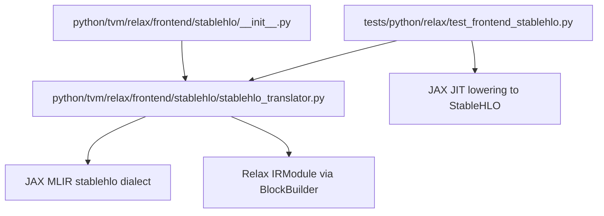
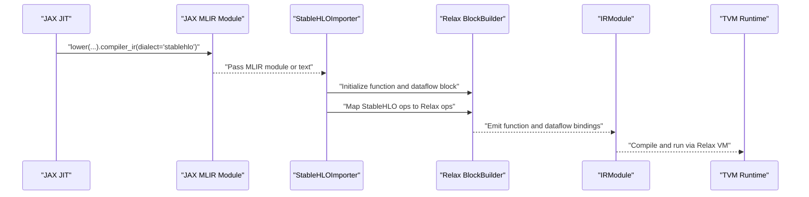
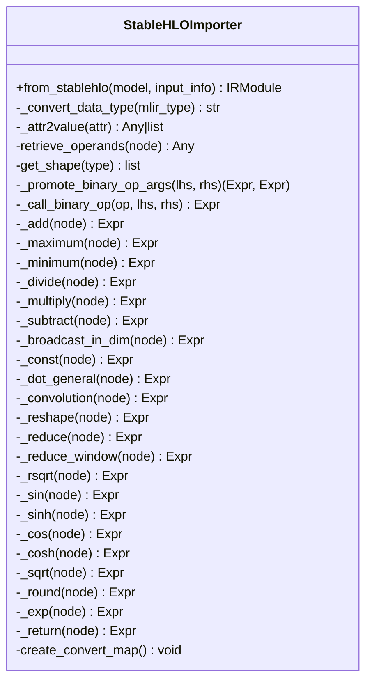
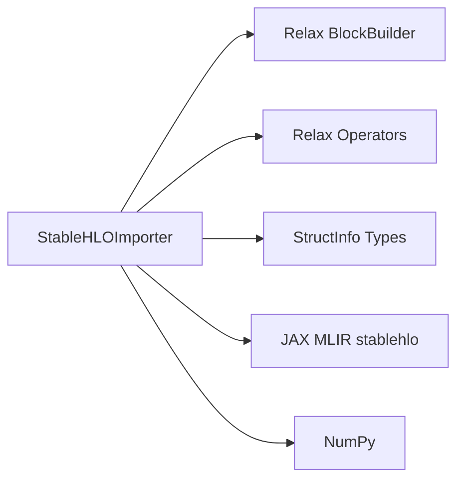

# StableHLO Frontend

<cite>
**Referenced Files in This Document**
- [stablehlo_translator.py](file://python/tvm/relax/frontend/stablehlo/stablehlo_translator.py)
- [__init__.py](file://python/tvm/relax/frontend/stablehlo/__init__.py)
- [test_frontend_stablehlo.py](file://tests/python/relax/test_frontend_stablehlo.py)
- [relax_to_pyfunc_converter.py](file://python/tvm/relax/relax_to_pyfunc_converter.py)
- [relax_vm.rst](file://docs/arch/relax_vm.rst)
- [relax.py](file://python/tvm/script/relax.py)
- [struct_info.h](file://include/tvm/relax/struct_info.h)
- [relax.py (frontend)](file://python/tvm/relax/__init__.py)
</cite>

## Table of Contents
1. [Introduction](#introduction)
2. [Project Structure](#project-structure)
3. [Core Components](#core-components)
4. [Architecture Overview](#architecture-overview)
5. [Detailed Component Analysis](#detailed-component-analysis)
6. [Dependency Analysis](#dependency-analysis)
7. [Performance Considerations](#performance-considerations)
8. [Troubleshooting Guide](#troubleshooting-guide)
9. [Conclusion](#conclusion)
10. [Appendices](#appendices)

## Introduction
This document describes the StableHLO frontend integration for converting XLA StableHLO dialect programs into Relax IR. It covers the importer implementation, operator coverage, attribute mapping, shape inference, parameter management, and integration with JAX/XLA workflows. It also provides guidance on model conversion pipelines, debugging conversion issues, performance optimization, and best practices for StableHLO-to-Relax conversion.

## Project Structure
The StableHLO frontend resides under the Relax frontend package and exposes a single entry function to convert a StableHLO MLIR module into a Relax IRModule.

**Diagram sources**
- [__init__.py:18-23](file://python/tvm/relax/frontend/stablehlo/__init__.py#L18-L23)
- [stablehlo_translator.py:355-415](file://python/tvm/relax/frontend/stablehlo/stablehlo_translator.py#L355-L415)
- [test_frontend_stablehlo.py:106-114](file://tests/python/relax/test_frontend_stablehlo.py#L106-L114)

**Section sources**
- [__init__.py:18-23](file://python/tvm/relax/frontend/stablehlo/__init__.py#L18-L23)
- [stablehlo_translator.py:355-415](file://python/tvm/relax/frontend/stablehlo/stablehlo_translator.py#L355-L415)

## Core Components
- StableHLOImporter: Converts a JAX MLIR stablehlo module into a Relax IRModule. It maps StableHLO operations to Relax operators, handles constants, shapes, and attributes, and constructs Relax functions with dataflow blocks.
- from_stablehlo: Public API that accepts either a parsed MLIR module or a textual StableHLO string and returns an IRModule.

Key capabilities:
- Data type mapping from MLIR element types to Relax dtype strings.
- Operand retrieval and shape extraction from MLIR types.
- Attribute parsing for constants and dense arrays.
- Operation mapping for arithmetic, unary math, convolution, reshape, reduce, reduce-window, and binary broadcasting.
- Dynamic shape support via symbolic variables for unknown dimensions.

**Section sources**
- [stablehlo_translator.py:41-76](file://python/tvm/relax/frontend/stablehlo/stablehlo_translator.py#L41-L76)
- [stablehlo_translator.py:100-138](file://python/tvm/relax/frontend/stablehlo/stablehlo_translator.py#L100-L138)
- [stablehlo_translator.py:171-187](file://python/tvm/relax/frontend/stablehlo/stablehlo_translator.py#L171-L187)
- [stablehlo_translator.py:208-236](file://python/tvm/relax/frontend/stablehlo/stablehlo_translator.py#L208-L236)
- [stablehlo_translator.py:246-252](file://python/tvm/relax/frontend/stablehlo/stablehlo_translator.py#L246-L252)
- [stablehlo_translator.py:254-288](file://python/tvm/relax/frontend/stablehlo/stablehlo_translator.py#L254-L288)
- [stablehlo_translator.py:326-353](file://python/tvm/relax/frontend/stablehlo/stablehlo_translator.py#L326-L353)
- [stablehlo_translator.py:355-415](file://python/tvm/relax/frontend/stablehlo/stablehlo_translator.py#L355-L415)
- [stablehlo_translator.py:418-446](file://python/tvm/relax/frontend/stablehlo/stablehlo_translator.py#L418-L446)

## Architecture Overview
End-to-end conversion from JAX StableHLO to Relax IR and execution on the Relax VM.

**Diagram sources**
- [test_frontend_stablehlo.py:106-114](file://tests/python/relax/test_frontend_stablehlo.py#L106-L114)
- [stablehlo_translator.py:355-415](file://python/tvm/relax/frontend/stablehlo/stablehlo_translator.py#L355-L415)
- [relax_vm.rst:94-126](file://docs/arch/relax_vm.rst#L94-L126)

## Detailed Component Analysis

### StableHLOImporter Class
The importer encapsulates:
- MLIR type and attribute parsing helpers.
- Operand retrieval and shape inference.
- Binary promotion for arithmetic operations.
- Operation-specific converters for StableHLO primitives.

**Diagram sources**
- [stablehlo_translator.py:28-415](file://python/tvm/relax/frontend/stablehlo/stablehlo_translator.py#L28-L415)

**Section sources**
- [stablehlo_translator.py:28-415](file://python/tvm/relax/frontend/stablehlo/stablehlo_translator.py#L28-L415)

### Operator Coverage and Mapping
Supported StableHLO operations and their Relax counterparts:
- Arithmetic: add, subtract, multiply, divide
- Comparisons: maximum, minimum
- Math: rsqrt, sqrt, exp, sin, cos, sinh, cosh, round
- Reshape and broadcast: reshape, broadcast_in_dim
- Linear algebra: dot_general -> matmul
- Convolution: convolution -> nn.conv2d
- Reductions: reduce -> sum, reduce_window -> max_pool2d
- Constants: constant -> const
- Control flow: func.return/stablehlo.return -> emit_output

Notes:
- Binary arithmetic promotes scalar constants to tensors with matching dtype.
- Convolution uses NHWC data layout and HWIO kernel layout.
- Reduce-window currently supports maximum reducer and infers NHWC layout.

**Section sources**
- [stablehlo_translator.py:157-187](file://python/tvm/relax/frontend/stablehlo/stablehlo_translator.py#L157-L187)
- [stablehlo_translator.py:204-236](file://python/tvm/relax/frontend/stablehlo/stablehlo_translator.py#L204-L236)
- [stablehlo_translator.py:246-252](file://python/tvm/relax/frontend/stablehlo/stablehlo_translator.py#L246-L252)
- [stablehlo_translator.py:254-288](file://python/tvm/relax/frontend/stablehlo/stablehlo_translator.py#L254-L288)
- [stablehlo_translator.py:326-353](file://python/tvm/relax/frontend/stablehlo/stablehlo_translator.py#L326-L353)

### Attribute Mapping
- Data types: MLIR element types are mapped to Relax dtype strings (e.g., f16/f32/f64/i8/i16/i32/i64/ui8/ui16/ui32/ui64).
- Dense constants: Integer and floating dense attributes are parsed into numpy arrays and reshaped according to the MLIR type shape.
- Attributes for convolution: window_strides, padding, lhs_dilation, rhs_dilation, batch_group_count.
- Attributes for reduce/reduce_window: dimensions, reducer operation name checks.

**Section sources**
- [stablehlo_translator.py:42-76](file://python/tvm/relax/frontend/stablehlo/stablehlo_translator.py#L42-L76)
- [stablehlo_translator.py:77-98](file://python/tvm/relax/frontend/stablehlo/stablehlo_translator.py#L77-L98)
- [stablehlo_translator.py:208-236](file://python/tvm/relax/frontend/stablehlo/stablehlo_translator.py#L208-L236)
- [stablehlo_translator.py:246-252](file://python/tvm/relax/frontend/stablehlo/stablehlo_translator.py#L246-L252)
- [stablehlo_translator.py:254-288](file://python/tvm/relax/frontend/stablehlo/stablehlo_translator.py#L254-L288)

### Shape Inference and Dynamic Shapes
- Shape extraction uses ShapedType to iterate over dimensions.
- Dynamic dimensions are represented as symbolic variables (tirx.Var) to preserve generality across runs.
- Reshape and broadcast operations infer output shapes from result types.

**Section sources**
- [stablehlo_translator.py:122-138](file://python/tvm/relax/frontend/stablehlo/stablehlo_translator.py#L122-L138)
- [stablehlo_translator.py:189-197](file://python/tvm/relax/frontend/stablehlo/stablehlo_translator.py#L189-L197)
- [stablehlo_translator.py:238-244](file://python/tvm/relax/frontend/stablehlo/stablehlo_translator.py#L238-L244)

### Parameter Management and Entry Function
- Inputs are collected from the MLIR function arguments and wrapped as Relax TensorStructInfo variables.
- The importer creates a function named "main" and emits a single output via emit_output.
- The resulting IRModule contains a single function with a dataflow block.

**Section sources**
- [stablehlo_translator.py:374-415](file://python/tvm/relax/frontend/stablehlo/stablehlo_translator.py#L374-L415)

### Integration with JAX/XLA Workflows
- JAX lowers a jitted function to StableHLO via lower(...).compiler_ir(dialect="stablehlo").
- The importer accepts either a parsed MLIR module or a textual StableHLO string.
- Tests demonstrate end-to-end correctness by comparing TVM Relax outputs against JAX outputs.

**Section sources**
- [test_frontend_stablehlo.py:106-114](file://tests/python/relax/test_frontend_stablehlo.py#L106-L114)
- [test_frontend_stablehlo.py:116-137](file://tests/python/relax/test_frontend_stablehlo.py#L116-L137)
- [stablehlo_translator.py:437-445](file://python/tvm/relax/frontend/stablehlo/stablehlo_translator.py#L437-L445)

### Practical Examples
- Unary math and binary arithmetic correctness tests validate operator coverage.
- Convolution test demonstrates parameter passing and accuracy verification.
- Dynamic shape test asserts structural equality of Relax IR with expected module.

**Section sources**
- [test_frontend_stablehlo.py:200-230](file://tests/python/relax/test_frontend_stablehlo.py#L200-L230)
- [test_frontend_stablehlo.py:232-251](file://tests/python/relax/test_frontend_stablehlo.py#L232-L251)
- [test_frontend_stablehlo.py:254-261](file://tests/python/relax/test_frontend_stablehlo.py#L254-L261)
- [test_frontend_stablehlo.py:316-324](file://tests/python/relax/test_frontend_stablehlo.py#L316-L324)
- [test_frontend_stablehlo.py:331-361](file://tests/python/relax/test_frontend_stablehlo.py#L331-L361)
- [test_frontend_stablehlo.py:168-197](file://tests/python/relax/test_frontend_stablehlo.py#L168-L197)

## Dependency Analysis
- Internal dependencies:
  - StableHLOImporter depends on Relax BlockBuilder and Relax operators for emitting expressions.
  - Uses TVM’s StructInfo types for shape and dtype annotations.
- External dependencies:
  - JAX MLIR stablehlo dialect for parsing StableHLO IR.
  - NumPy for dense attribute conversion.

**Diagram sources**
- [stablehlo_translator.py:28-415](file://python/tvm/relax/frontend/stablehlo/stablehlo_translator.py#L28-L415)
- [struct_info.h:144-216](file://include/tvm/relax/struct_info.h#L144-L216)

**Section sources**
- [stablehlo_translator.py:28-415](file://python/tvm/relax/frontend/stablehlo/stablehlo_translator.py#L28-L415)
- [struct_info.h:144-216](file://include/tvm/relax/struct_info.h#L144-L216)

## Performance Considerations
- Prefer compiling Relax modules for production execution rather than interpreting bytecode to reduce dispatch overhead.
- Keep StableHLO lowering on GPU/CPU targets aligned with downstream accelerators to minimize data movement.
- Use appropriate dtypes to avoid unnecessary precision conversions.

[No sources needed since this section provides general guidance]

## Troubleshooting Guide
Common issues and remedies:
- Unsupported operation: The importer raises an assertion if an operation is not in the convert map. Add the missing mapping or preprocess the StableHLO to decompose unsupported ops.
- Unsupported attribute type: Dense integer/float elements are supported; other attribute kinds cause a ValueError. Ensure StableHLO attributes are representable as dense arrays.
- Shape mismatches: Verify that dynamic shapes are preserved as symbolic variables; otherwise, adjust input shapes to match inferred shapes.
- Execution failures: When running on the VM, ensure inputs match the expected dtypes and shapes; mismatches raise runtime errors.

**Section sources**
- [stablehlo_translator.py:407-410](file://python/tvm/relax/frontend/stablehlo/stablehlo_translator.py#L407-L410)
- [stablehlo_translator.py:92-98](file://python/tvm/relax/frontend/stablehlo/stablehlo_translator.py#L92-L98)
- [test_frontend_stablehlo.py:130-137](file://tests/python/relax/test_frontend_stablehlo.py#L130-L137)

## Conclusion
The StableHLO frontend provides a focused and extensible pathway to convert StableHLO programs into Relax IR. It supports a practical subset of StableHLO operations, integrates cleanly with JAX/XLA, and leverages Relax’s structured information and VM for efficient execution. Extending operator coverage and refining shape inference will further improve fidelity and performance.

[No sources needed since this section summarizes without analyzing specific files]

## Appendices

### Appendix A: Operator Mapping Reference
- stablehlo.add -> Relax add
- stablehlo.subtract -> Relax subtract
- stablehlo.multiply -> Relax multiply
- stablehlo.divide -> Relax divide
- stablehlo.maximum -> Relax maximum
- stablehlo.minimum -> Relax minimum
- stablehlo.rsqrt -> Relax rsqrt
- stablehlo.sqrt -> Relax sqrt
- stablehlo.exp -> Relax exp
- stablehlo.sine -> Relax sin
- stablehlo.cosine -> Relax cos
- stablehlo.sinh -> Relax sinh
- stablehlo.cosh -> Relax cosh
- stablehlo.round_nearest_afz -> Relax round
- stablehlo.reshape -> Relax reshape
- stablehlo.broadcast_in_dim -> Relax broadcast_to
- stablehlo.constant -> Relax const
- stablehlo.dot_general -> Relax matmul
- stablehlo.convolution -> Relax nn.conv2d
- stablehlo.reduce -> Relax sum
- stablehlo.reduce_window -> Relax nn.max_pool2d
- stablehlo.return -> Relax emit_output

**Section sources**
- [stablehlo_translator.py:326-353](file://python/tvm/relax/frontend/stablehlo/stablehlo_translator.py#L326-L353)

### Appendix B: Data Type Mapping Reference
- f16 -> float16
- f32 -> float32
- f64 -> float64
- i1 -> bool
- i8 -> int8
- i16 -> int16
- i32 -> int32
- i64 -> int64
- ui8 -> uint8
- ui16 -> uint16
- ui32 -> uint32
- ui64 -> uint64

**Section sources**
- [stablehlo_translator.py:42-76](file://python/tvm/relax/frontend/stablehlo/stablehlo_translator.py#L42-L76)

### Appendix C: Relax VM Execution Modes
- bytecode: interpreted by VM bytecode dispatch loop.
- compiled: compiled into TIR functions for direct register manipulation.

**Section sources**
- [relax_vm.rst:94-126](file://docs/arch/relax_vm.rst#L94-L126)