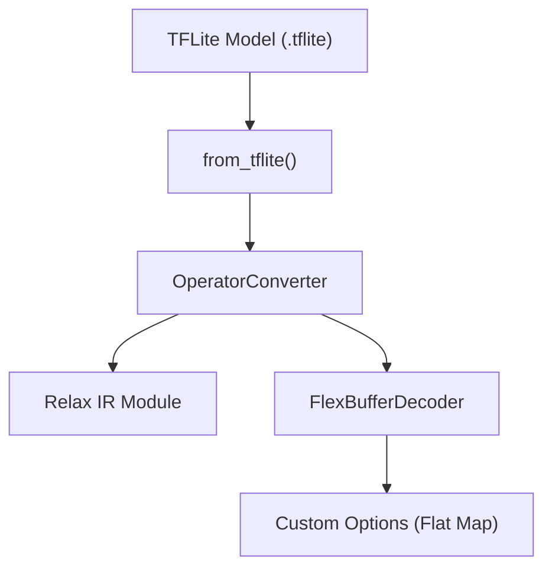
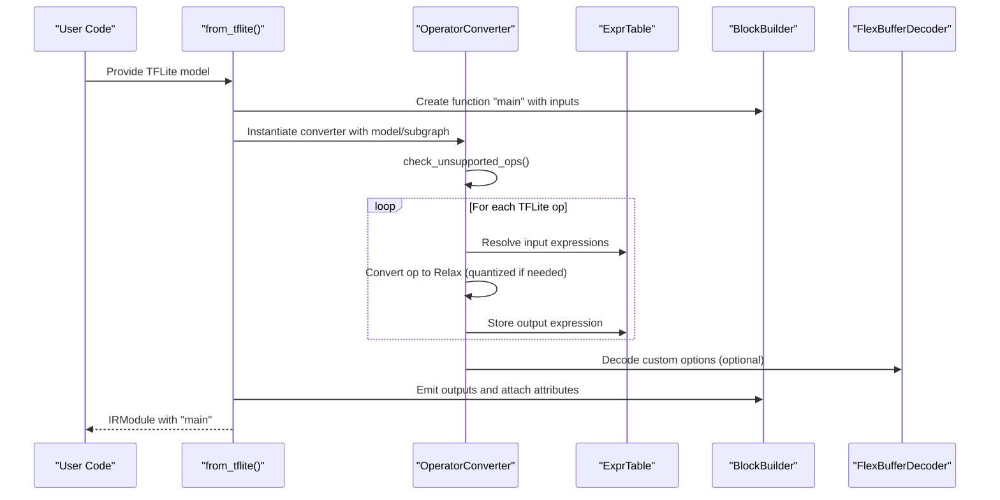
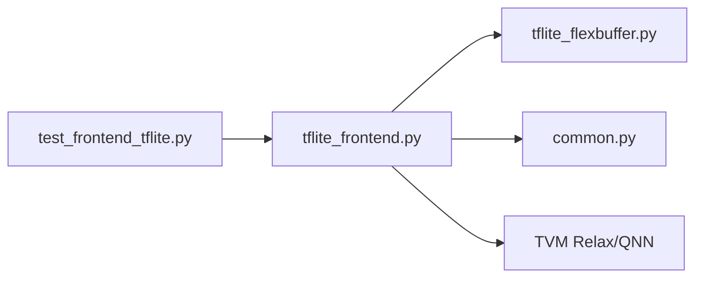

# TensorFlow Lite Frontend

<cite>
**Referenced Files in This Document**
- [tflite_frontend.py](file://python/tvm/relax/frontend/tflite/tflite_frontend.py)
- [tflite_flexbuffer.py](file://python/tvm/relax/frontend/tflite/tflite_flexbuffer.py)
- [__init__.py](file://python/tvm/relax/frontend/tflite/__init__.py)
- [common.py](file://python/tvm/relax/frontend/common.py)
- [test_frontend_tflite.py](file://tests/python/relax/test_frontend_tflite.py)
</cite>

## Table of Contents
1. [Introduction](#introduction)
2. [Project Structure](#project-structure)
3. [Core Components](#core-components)
4. [Architecture Overview](#architecture-overview)
5. [Detailed Component Analysis](#detailed-component-analysis)
6. [Dependency Analysis](#dependency-analysis)
7. [Performance Considerations](#performance-considerations)
8. [Troubleshooting Guide](#troubleshooting-guide)
9. [Conclusion](#conclusion)
10. [Appendices](#appendices)

## Introduction
This document explains the TensorFlow Lite (TFLite) frontend integration for converting .tflite models into TVM’s Relax IR. It covers the importer pipeline, operator coverage, quantization handling, FlexBuffer support for custom operators, subgraph handling, tensor metadata preservation, and practical usage patterns. It also provides debugging tips, optimization strategies, and mobile deployment considerations.

## Project Structure
The TFLite frontend resides under the Relax frontend namespace and consists of:
- A primary importer that converts TFLite flatbuffer models to Relax IR
- A FlexBuffer decoder for parsing custom operator options
- Tests validating conversion correctness and end-to-end execution

**Diagram sources**
- [tflite_frontend.py:4118-4277](file://python/tvm/relax/frontend/tflite/tflite_frontend.py#L4118-L4277)
- [tflite_flexbuffer.py:68-160](file://python/tvm/relax/frontend/tflite/tflite_flexbuffer.py#L68-L160)

**Section sources**
- [tflite_frontend.py:4118-4277](file://python/tvm/relax/frontend/tflite/tflite_frontend.py#L4118-L4277)
- [tflite_flexbuffer.py:68-160](file://python/tvm/relax/frontend/tflite/tflite_flexbuffer.py#L68-L160)
- [__init__.py:17-22](file://python/tvm/relax/frontend/tflite/__init__.py#L17-L22)

## Core Components
- from_tflite: Top-level entry point that parses a TFLite model and builds a Relax IRModule with a single function “main”.
- OperatorConverter: Maps TFLite builtin/custom operators to Relax ops, handles quantization, and manages expression table state.
- FlexBufferDecoder: Partial decoder for FlexBuffer custom options, supporting maps and typed vectors.
- ExprTable: Tracks Relax expressions by tensor names, supports parameter registration and overrides for preprocessing.

Key capabilities:
- Single-subgraph support (main subgraph)
- Expression table-driven IR construction
- Quantization-aware conversions (dequantize, quantize, requantize)
- Detection postprocess and NMS variants via custom options decoding
- Sparse densification helper for sparse weights

**Section sources**
- [tflite_frontend.py:4118-4277](file://python/tvm/relax/frontend/tflite/tflite_frontend.py#L4118-L4277)
- [tflite_frontend.py:53-87](file://python/tvm/relax/frontend/tflite/tflite_frontend.py#L53-L87)
- [tflite_frontend.py:99-399](file://python/tvm/relax/frontend/tflite/tflite_frontend.py#L99-L399)
- [tflite_flexbuffer.py:68-160](file://python/tvm/relax/frontend/tflite/tflite_flexbuffer.py#L68-L160)

## Architecture Overview
End-to-end conversion flow from TFLite to Relax IR:

**Diagram sources**
- [tflite_frontend.py:4118-4277](file://python/tvm/relax/frontend/tflite/tflite_frontend.py#L4118-L4277)
- [tflite_frontend.py:322-348](file://python/tvm/relax/frontend/tflite/tflite_frontend.py#L322-L348)
- [tflite_flexbuffer.py:146-160](file://python/tvm/relax/frontend/tflite/tflite_flexbuffer.py#L146-L160)

## Detailed Component Analysis

### Import Pipeline and Subgraph Handling
- Single-subgraph assumption: The importer asserts exactly one subgraph and uses its inputs/outputs.
- Input metadata: Shapes and dtypes are inferred from the model; optional overrides can be supplied.
- Function emission: The importer constructs a Relax function with dataflow blocks, attaches “num_input” and “params” attributes.

Practical notes:
- Multi-subgraph models are not supported by the importer.
- Output resolution uses tensor wrappers to handle prefetched constants.

**Section sources**
- [tflite_frontend.py:4219-4277](file://python/tvm/relax/frontend/tflite/tflite_frontend.py#L4219-L4277)
- [tflite_frontend.py:4096-4115](file://python/tvm/relax/frontend/tflite/tflite_frontend.py#L4096-L4115)

### Operator Support and Mapping
The converter maintains a registry mapping TFLite operator names to Relax conversion functions. Representative mappings include:
- Arithmetic: ADD, SUB, MUL, DIV, POW, SQUARE, SQUARED_DIFFERENCE
- Comparisons: EQUAL, NOT_EQUAL, LESS, LESS_EQUAL, GREATER, GREATER_EQUAL
- Logical: LOGICAL_AND, LOGICAL_OR, LOGICAL_NOT
- Activations: RELU, RELU6, RELU_N1_TO_1, TANH, SIGMOID, GELU, ELU, SWISH
- Pooling: MAX_POOL_2D, AVERAGE_POOL_2D, L2_POOL_2D
- Convolutions: CONV_2D, DEPTHWISE_CONV_2D, TRANSPOSE_CONV
- Matrix ops: MATMUL, BATCH_MATMUL, MATRIX_DIAG, MATRIX_SET_DIAG
- Reshaping: RESHAPE, SQUEEZE, EXPAND_DIMS, TRANSPOSE, PACK, UNPACK
- Indexing: GATHER, GATHER_ND, STRIDED_SLICE, SLICE, WHERE
- Sampling: TOPK_V2, RANGE, ONE_HOT
- Padding and interpolation: PAD, PADV2, RESIZE_BILINEAR, RESIZE_NEAREST_NEIGHBOR
- Reductions: SUM, MEAN, MAX, MIN, PROD
- Special: QUANTIZE, DEQUANTIZE, FAKE_QUANT, DETECTION_POSTPROCESS, NON_MAX_SUPPRESSION_V5

Unsupported/dynamic-range quantization:
- The checker raises errors for unsupported operators and warns about dynamic range quantization optimized ops.

**Section sources**
- [tflite_frontend.py:118-240](file://python/tvm/relax/frontend/tflite/tflite_frontend.py#L118-L240)
- [tflite_frontend.py:242-283](file://python/tvm/relax/frontend/tflite/tflite_frontend.py#L242-L283)

### Quantization Handling
- Per-tensor vs per-axis quantization: The importer recognizes both and validates constraints (e.g., zero points for per-axis).
- Scale and zero-point propagation: Quantized tensors carry qnn_params; conversions insert dequantize/quantize/requantize as needed.
- Dtype constraints: Certain ops require int8 inputs/outputs for quantized reshape and similar constraints.
- Activation fusion: Quantized activation clipping is supported for specific fused activations.

Limitations:
- Full quantized model support is not yet implemented in the Relax frontend; quantized ops raise errors during conversion.

**Section sources**
- [tflite_frontend.py:420-478](file://python/tvm/relax/frontend/tflite/tflite_frontend.py#L420-L478)
- [tflite_frontend.py:560-579](file://python/tvm/relax/frontend/tflite/tflite_frontend.py#L560-L579)
- [tflite_frontend.py:586-618](file://python/tvm/relax/frontend/tflite/tflite_frontend.py#L586-L618)

### FlexBuffer Support for Custom Operators
- FlexBufferDecoder supports decoding a flat map from FlexBuffer, extracting keys and typed vectors.
- Used by DETECTION_POSTPROCESS to parse custom options such as num_classes, max_detections, and scaling factors.
- Decoder is intentionally partial; only required types for supported custom ops are implemented.

Usage example:
- DETECTION_POSTPROCESS reads custom options and validates required attributes before constructing Relax ops.

**Section sources**
- [tflite_flexbuffer.py:68-160](file://python/tvm/relax/frontend/tflite/tflite_flexbuffer.py#L68-L160)
- [tflite_frontend.py:3268-3507](file://python/tvm/relax/frontend/tflite/tflite_frontend.py#L3268-L3507)

### Tensor Metadata Preservation
- Tensor names: Retrieved from subgraph tensors; fallback to generated names if absent.
- Shapes and dtypes: Inferred from model metadata; can be overridden via inputs.
- Constants: Tensor buffers are materialized as Relax constants and registered in the expression table.

**Section sources**
- [tflite_frontend.py:4057-4077](file://python/tvm/relax/frontend/tflite/tflite_frontend.py#L4057-L4077)
- [tflite_frontend.py:4096-4115](file://python/tvm/relax/frontend/tflite/tflite_frontend.py#L4096-L4115)
- [tflite_frontend.py:3823-3834](file://python/tvm/relax/frontend/tflite/tflite_frontend.py#L3823-L3834)

### Conversion Pipeline Optimization
- Prefetching: Some ops (e.g., sparse densification) can prefetch dense equivalents into the expression table to avoid runtime computation.
- Shape inference: When tensor shapes are empty, the converter infers them from upstream expressions.
- Autopad helpers: Common padding logic is encapsulated for reuse across convolution-like ops.

**Section sources**
- [tflite_frontend.py:3812-3822](file://python/tvm/relax/frontend/tflite/tflite_frontend.py#L3812-L3822)
- [tflite_frontend.py:3836-3844](file://python/tvm/relax/frontend/tflite/tflite_frontend.py#L3836-L3844)
- [common.py:58-128](file://python/tvm/relax/frontend/common.py#L58-L128)

### Practical Examples

- Basic conversion from a concrete TensorFlow function to TFLite and then to Relax IR:
  - Steps: Create concrete function, convert to TFLite, parse with from_tflite, compile and run.
  - Example references: [tflite_frontend.py:4145-4207](file://python/tvm/relax/frontend/tflite/tflite_frontend.py#L4145-L4207)

- End-to-end verification with test cases:
  - Tests cover arithmetic, comparisons, logical ops, element-wise activations, pooling, reshaping, and more.
  - Example references: [test_frontend_tflite.py:96-113](file://tests/python/relax/test_frontend_tflite.py#L96-L113), [test_frontend_tflite.py:263-280](file://tests/python/relax/test_frontend_tflite.py#L263-L280)

- Handling quantized models:
  - Quantization checks and conversions are integrated into operator converters; attempting to convert quantized models currently raises errors.
  - Example references: [tflite_frontend.py:474-477](file://python/tvm/relax/frontend/tflite/tflite_frontend.py#L474-L477)

- Custom operator extensions:
  - DETECTION_POSTPROCESS demonstrates decoding FlexBuffer custom options and building Relax IR for postprocessing.
  - Example references: [tflite_frontend.py:3268-3507](file://python/tvm/relax/frontend/tflite/tflite_frontend.py#L3268-L3507)

**Section sources**
- [tflite_frontend.py:4145-4207](file://python/tvm/relax/frontend/tflite/tflite_frontend.py#L4145-L4207)
- [test_frontend_tflite.py:96-113](file://tests/python/relax/test_frontend_tflite.py#L96-L113)
- [test_frontend_tflite.py:263-280](file://tests/python/relax/test_frontend_tflite.py#L263-L280)
- [tflite_frontend.py:474-477](file://python/tvm/relax/frontend/tflite/tflite_frontend.py#L474-L477)
- [tflite_frontend.py:3268-3507](file://python/tvm/relax/frontend/tflite/tflite_frontend.py#L3268-L3507)

## Dependency Analysis
- External dependencies:
  - tflite Python bindings for flatbuffer parsing
  - numpy for buffer interpretation and shape handling
  - TVM Relax IR and QNN ops for quantized conversions
- Internal dependencies:
  - FlexBufferDecoder used by DETECTION_POSTPROCESS
  - Common autopad utilities reused across ops

**Diagram sources**
- [tflite_frontend.py:35-39](file://python/tvm/relax/frontend/tflite/tflite_frontend.py#L35-L39)
- [tflite_flexbuffer.py:21-22](file://python/tvm/relax/frontend/tflite/tflite_flexbuffer.py#L21-L22)
- [common.py:20-24](file://python/tvm/relax/frontend/common.py#L20-L24)
- [test_frontend_tflite.py:25-36](file://tests/python/relax/test_frontend_tflite.py#L25-L36)

**Section sources**
- [tflite_frontend.py:35-39](file://python/tvm/relax/frontend/tflite/tflite_frontend.py#L35-L39)
- [tflite_flexbuffer.py:21-22](file://python/tvm/relax/frontend/tflite/tflite_flexbuffer.py#L21-L22)
- [common.py:20-24](file://python/tvm/relax/frontend/common.py#L20-L24)
- [test_frontend_tflite.py:25-36](file://tests/python/relax/test_frontend_tflite.py#L25-L36)

## Performance Considerations
- Prefer NHWC layouts for image ops where supported to align with TFLite defaults.
- Use autopad helpers to avoid manual padding overhead.
- Minimize constant creation by leveraging prefetched nodes for dense equivalents of sparse weights.
- Avoid dynamic shapes when possible; static shapes enable better optimization passes.

[No sources needed since this section provides general guidance]

## Troubleshooting Guide
Common issues and resolutions:
- Unsupported operators: The checker raises OpNotImplemented with a list of unsupported ops; remove or replace unsupported ops in the source model.
- Dynamic range quantization: Ops flagged as likely dynamic range quantization require disabling dynamic range quantization or switching to full integer quantization.
- Quantized models: Attempting to convert quantized models raises errors; dequantize or adjust model to float32 equivalents.
- Custom operators: Custom operators are not supported unless explicitly mapped; DETECTION_POSTPROCESS is supported via FlexBuffer decoding.
- Subgraph mismatch: Only single-subgraph models are supported; split multi-subgraph models into separate conversions.

**Section sources**
- [tflite_frontend.py:242-283](file://python/tvm/relax/frontend/tflite/tflite_frontend.py#L242-L283)
- [tflite_frontend.py:474-477](file://python/tvm/relax/frontend/tflite/tflite_frontend.py#L474-L477)
- [tflite_frontend.py:391-398](file://python/tvm/relax/frontend/tflite/tflite_frontend.py#L391-L398)

## Conclusion
The TFLite frontend provides a robust pathway from TFLite models to Relax IR with strong operator coverage, quantization-aware conversions, and FlexBuffer support for custom operators. While full quantized model support remains pending, the importer enables efficient conversion and execution for a wide range of models. For production mobile deployment, prefer float32 or supported quantized subsets, and leverage the provided tests and examples as references.

[No sources needed since this section summarizes without analyzing specific files]

## Appendices

### Appendix A: Operator Coverage Highlights
Representative supported operators include:
- Arithmetic and comparisons
- Activations and reductions
- Convolutions and pooling
- Reshaping and indexing
- Vision ops: DETECTION_POSTPROCESS, NON_MAX_SUPPRESSION_V5
- Quantization ops: QUANTIZE, DEQUANTIZE, FAKE_QUANT

**Section sources**
- [tflite_frontend.py:118-240](file://python/tvm/relax/frontend/tflite/tflite_frontend.py#L118-L240)
- [tflite_frontend.py:3268-3507](file://python/tvm/relax/frontend/tflite/tflite_frontend.py#L3268-L3507)

### Appendix B: Example Workflows
- From TensorFlow to Relax IR: Use the provided example in the importer docstring to convert a concrete function to TFLite and then to Relax IR.
- Running converted models: Tests demonstrate compiling and executing Relax modules on CPU targets.

**Section sources**
- [tflite_frontend.py:4145-4207](file://python/tvm/relax/frontend/tflite/tflite_frontend.py#L4145-L4207)
- [test_frontend_tflite.py:65-94](file://tests/python/relax/test_frontend_tflite.py#L65-L94)