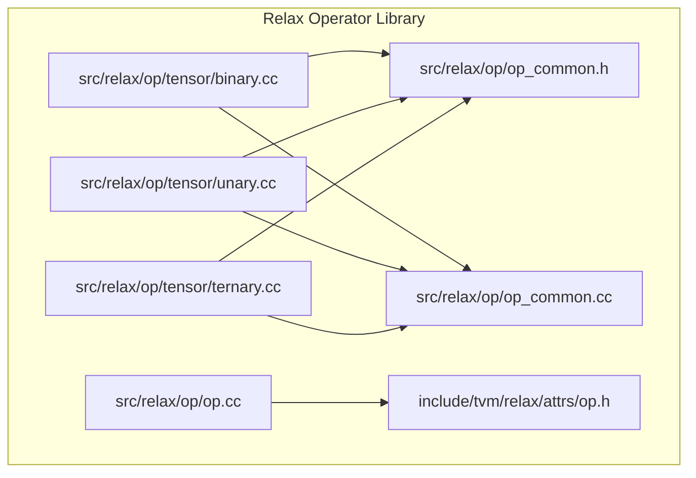
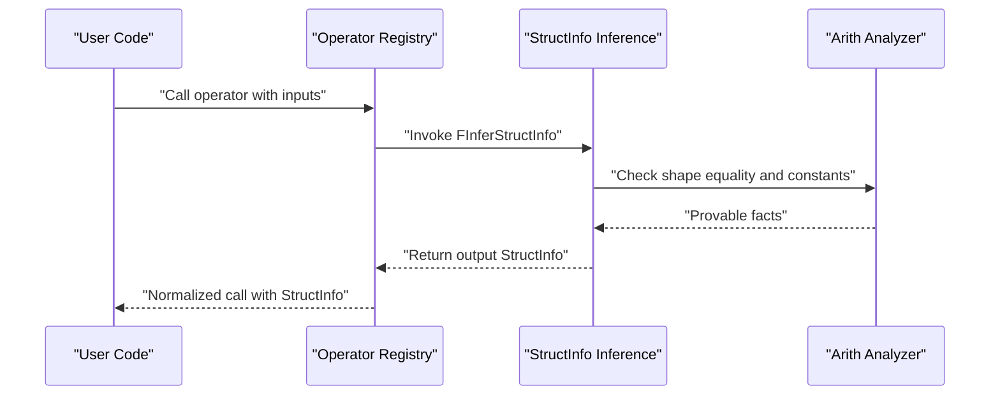
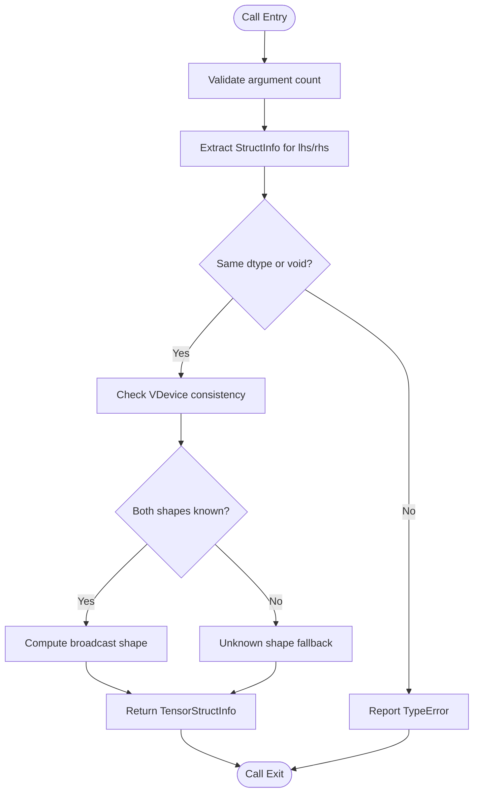
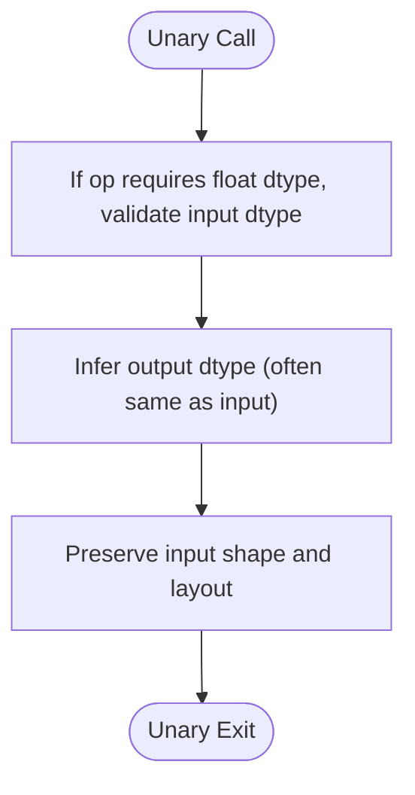
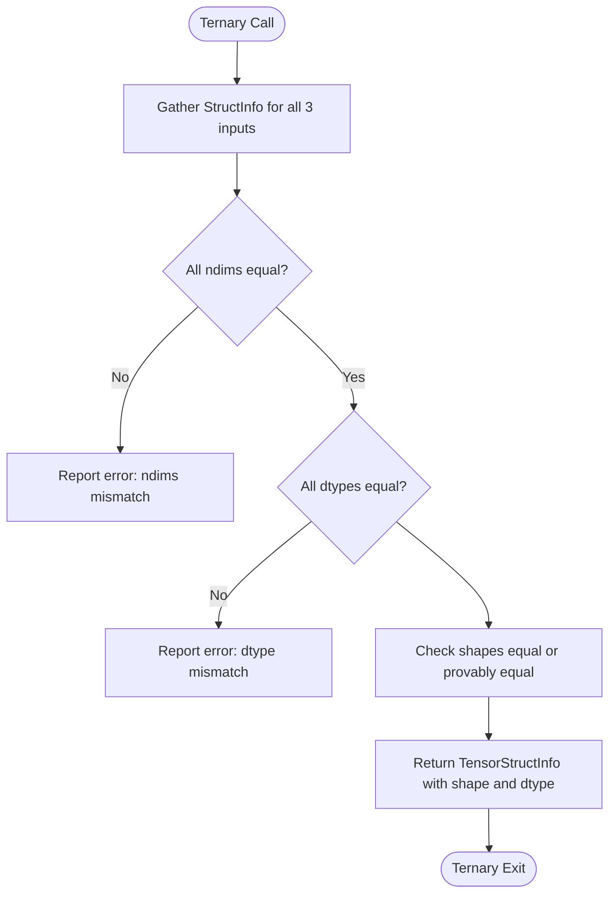
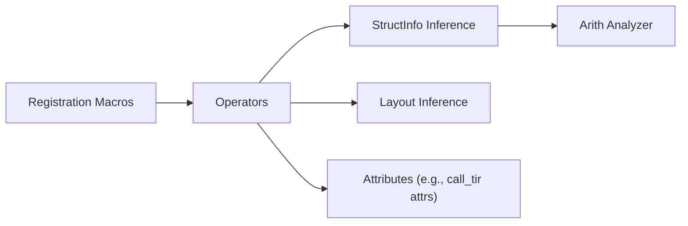

# Arithmetic Operators

<cite>
**Referenced Files in This Document**
- [binary.cc](file://src/relax/op/tensor/binary.cc)
- [unary.cc](file://src/relax/op/tensor/unary.cc)
- [ternary.cc](file://src/relax/op/tensor/ternary.cc)
- [op_common.h](file://src/relax/op/op_common.h)
- [op_common.cc](file://src/relax/op/op_common.cc)
- [op.cc](file://src/relax/op/op.cc)
- [op.h](file://include/tvm/relax/attrs/op.h)
- [test_op_binary.py](file://tests/python/relax/test_op_binary.py)
</cite>

## Table of Contents
1. [Introduction](#introduction)
2. [Project Structure](#project-structure)
3. [Core Components](#core-components)
4. [Architecture Overview](#architecture-overview)
5. [Detailed Component Analysis](#detailed-component-analysis)
6. [Dependency Analysis](#dependency-analysis)
7. [Performance Considerations](#performance-considerations)
8. [Troubleshooting Guide](#troubleshooting-guide)
9. [Conclusion](#conclusion)
10. [Appendices](#appendices)

## Introduction
This document describes Relax arithmetic operators, focusing on:
- Binary arithmetic operations: add, subtract, multiply, divide, floor_divide, power, mod, floor_mod, minimum, maximum, log_add_exp
- Unary arithmetic operations: negative, abs, sqrt, rsqrt, square, exp, log, sin, cos, tan, sinh, cosh, asin, acos, atan, asinh, acosh, atanh, ceil, floor, round, trunc, sigmoid, erf, bitwise_not, logical_not, sign
- Ternary operations: where and fused multiply-add (ewise_fma)

It explains operator semantics, broadcasting rules, type promotion, parameter specifications, input/output shapes, numerical precision considerations, practical usage in neural networks and data transformations, and performance characteristics.

## Project Structure
Relax arithmetic operators are implemented in the Relax operator library under the tensor module. Registration and inference utilities are centralized in common headers and source files.

**Diagram sources**
- [binary.cc:196-238](file://src/relax/op/tensor/binary.cc#L196-L238)
- [unary.cc:39-103](file://src/relax/op/tensor/unary.cc#L39-L103)
- [ternary.cc:133-151](file://src/relax/op/tensor/ternary.cc#L133-L151)
- [op_common.h:158-274](file://src/relax/op/op_common.h#L158-L274)
- [op_common.cc:109-147](file://src/relax/op/op_common.cc#L109-L147)
- [op.cc:576-620](file://src/relax/op/op.cc#L576-L620)
- [op.h:33-120](file://include/tvm/relax/attrs/op.h#L33-L120)

**Section sources**
- [binary.cc:196-238](file://src/relax/op/tensor/binary.cc#L196-L238)
- [unary.cc:39-103](file://src/relax/op/tensor/unary.cc#L39-L103)
- [ternary.cc:133-151](file://src/relax/op/tensor/ternary.cc#L133-L151)
- [op_common.h:158-274](file://src/relax/op/op_common.h#L158-L274)
- [op_common.cc:109-147](file://src/relax/op/op_common.cc#L109-L147)
- [op.cc:576-620](file://src/relax/op/op.cc#L576-L620)
- [op.h:33-120](file://include/tvm/relax/attrs/op.h#L33-L120)

## Core Components
- Binary arithmetic operators are registered and implemented via a dedicated macro and broadcast inference utility. Broadcasting follows standard NumPy-style rules, with shape inference performed symbolically when possible.
- Unary arithmetic operators are registered with optional float-dtype requirement and preserve input shape/dtype semantics.
- Ternary operators include where and ewise_fma, with strict shape and dtype consistency checks.

Key implementation references:
- Binary broadcast and dtype inference: [binary.cc:32-143](file://src/relax/op/tensor/binary.cc#L32-L143), [op_common.h:295-337](file://src/relax/op/op_common.h#L295-L337), [op_common.cc:109-147](file://src/relax/op/op_common.cc#L109-L147)
- Unary dtype and purity policies: [unary.cc:39-68](file://src/relax/op/tensor/unary.cc#L39-L68), [op_common.h:165-171](file://src/relax/op/op_common.h#L165-L171)
- Ternary where and ewise_fma: [ternary.cc:133-151](file://src/relax/op/tensor/ternary.cc#L133-L151)

**Section sources**
- [binary.cc:32-143](file://src/relax/op/tensor/binary.cc#L32-L143)
- [op_common.h:295-337](file://src/relax/op/op_common.h#L295-L337)
- [op_common.cc:109-147](file://src/relax/op/op_common.cc#L109-L147)
- [unary.cc:39-68](file://src/relax/op/tensor/unary.cc#L39-L68)
- [ternary.cc:133-151](file://src/relax/op/tensor/ternary.cc#L133-L151)

## Architecture Overview
The Relax arithmetic operator architecture consists of:
- Operator registration macros that attach metadata (argument counts, purity, mixed-precision policy) and inference functions to the operator registry.
- StructInfo inference utilities that compute output dtype, shape, and device placement based on inputs.
- Broadcasting inference that resolves symbolic shapes and validates compatibility.

**Diagram sources**
- [binary.cc:32-143](file://src/relax/op/tensor/binary.cc#L32-L143)
- [op_common.cc:109-147](file://src/relax/op/op_common.cc#L109-L147)
- [op_common.h:165-171](file://src/relax/op/op_common.h#L165-L171)

## Detailed Component Analysis

### Binary Arithmetic Operators
- Operators: add, subtract, multiply, divide, floor_divide, power, mod, floor_mod, minimum, maximum, log_add_exp
- Semantics:
  - Elementwise arithmetic with broadcasting.
  - Output dtype promotion follows arithmetic rules; for mixed bool and numeric dtypes, the bool type is rejected unless explicitly allowed.
  - Output shape is computed by broadcasting input shapes; symbolic mismatches fall back to unknown shape.
- Broadcasting rules:
  - Align from the trailing dimensions.
  - Dimensions of size 1 are broadcast; unequal constant sizes must be provably equal.
  - Unknown shapes may lead to unknown output shape.
- Type promotion:
  - Both operands must have the same dtype unless one is void (used internally).
  - Mixed-precision policy is “follow” for arithmetic operators.
- Parameter specifications:
  - Two tensor or scalar (Prim) arguments.
  - Optional sinfo_args may override inferred vdevice.
- Numerical precision:
  - Floating-point inputs are required for transcendental and sqrt/rsqrt-like ops (validated by unary registration).
  - Division and floor_divide preserve floating-point semantics when inputs are float-like.
- Practical examples:
  - Neural networks: batch normalization residual addition, attention score scaling, loss computation.
  - Mathematical expressions: mean subtraction, variance normalization, activation mixing.
  - Data transformations: channel-wise scaling, mask application, normalization.

**Diagram sources**
- [binary.cc:32-143](file://src/relax/op/tensor/binary.cc#L32-L143)
- [op_common.h:295-337](file://src/relax/op/op_common.h#L295-L337)
- [op_common.cc:109-147](file://src/relax/op/op_common.cc#L109-L147)

**Section sources**
- [binary.cc:32-143](file://src/relax/op/tensor/binary.cc#L32-L143)
- [op_common.h:295-337](file://src/relax/op/op_common.h#L295-L337)
- [op_common.cc:109-147](file://src/relax/op/op_common.cc#L109-L147)
- [test_op_binary.py:68-79](file://tests/python/relax/test_op_binary.py#L68-L79)

### Unary Arithmetic Operators
- Operators: negative, abs, sqrt, rsqrt, square, exp, log, sin, cos, tan, sinh, cosh, asin, acos, atan, asinh, acosh, atanh, ceil, floor, round, trunc, sigmoid, erf, bitwise_not, logical_not, sign
- Semantics:
  - Elementwise operation preserving input shape.
  - Floating-point dtype requirement enforced for transcendental and sqrt/rsqrt-like ops.
  - Mixed-precision policy is “follow.”
- Parameter specifications:
  - One tensor argument.
- Numerical precision:
  - Transcendental and sqrt/rsqrt require float-like dtypes.
  - bitwise_not/logical_not/sign operate on integer/boolean inputs.

**Diagram sources**
- [unary.cc:39-68](file://src/relax/op/tensor/unary.cc#L39-L68)
- [op_common.h:165-171](file://src/relax/op/op_common.h#L165-L171)
- [op_common.h:258-262](file://src/relax/op/op_common.h#L258-L262)

**Section sources**
- [unary.cc:39-68](file://src/relax/op/tensor/unary.cc#L39-L68)
- [op_common.h:165-171](file://src/relax/op/op_common.h#L165-L171)
- [op_common.h:258-262](file://src/relax/op/op_common.h#L258-L262)

### Ternary Operations
- where(condition, x, y): select elements from x or y based on condition; all three tensors must have the same shape and dtype.
- ewise_fma(a, b, c): fused multiply-add a*b + c; all inputs must have the same shape and dtype.
- Semantics:
  - Shape equality checks across all three inputs.
  - Dtype equality enforced.
  - Mixed-precision policy “follow.”

**Diagram sources**
- [ternary.cc:32-116](file://src/relax/op/tensor/ternary.cc#L32-L116)

**Section sources**
- [ternary.cc:32-116](file://src/relax/op/tensor/ternary.cc#L32-L116)

## Dependency Analysis
- Operator registration relies on macros that attach:
  - Argument metadata (number of inputs, argument names/types)
  - Structural inference attributes (FInferStructInfo)
  - Layout inference (FRelaxInferLayout)
  - Mixed-precision policy (TMixedPrecisionPolicy)
  - Purity flag (FPurity)
- Broadcasting and shape inference depend on:
  - Arith analyzer for equality proofs
  - ShapeExpr and PrimExpr for symbolic shapes
- Attribute types for advanced operators (e.g., call_tir variants) are defined centrally.

**Diagram sources**
- [op_common.h:158-171](file://src/relax/op/op_common.h#L158-L171)
- [op_common.cc:109-147](file://src/relax/op/op_common.cc#L109-L147)
- [op.cc:576-620](file://src/relax/op/op.cc#L576-L620)
- [op.h:33-120](file://include/tvm/relax/attrs/op.h#L33-L120)

**Section sources**
- [op_common.h:158-171](file://src/relax/op/op_common.h#L158-L171)
- [op_common.cc:109-147](file://src/relax/op/op_common.cc#L109-L147)
- [op.cc:576-620](file://src/relax/op/op.cc#L576-L620)
- [op.h:33-120](file://include/tvm/relax/attrs/op.h#L33-L120)

## Performance Considerations
- Broadcasting:
  - Prefer aligned shapes to avoid unknown output shapes and reduce layout conversions.
  - Known constant dimensions enable efficient vectorized kernels.
- Mixed precision:
  - “Follow” policy preserves input precision; choose input dtypes to minimize unnecessary upcasting.
- Layout inference:
  - Unary and binary elementwise ops preserve input layout when possible, reducing data movement.
- Device placement:
  - VDevice consistency is enforced; mismatched devices produce errors early, preventing costly rework.

[No sources needed since this section provides general guidance]

## Troubleshooting Guide
Common issues and resolutions:
- Shape mismatch during broadcasting:
  - Ensure trailing dimensions align and unequal dims are broadcastable or provably equal.
  - Reference: [op_common.cc:109-147](file://src/relax/op/op_common.cc#L109-L147)
- Dtype mismatch for binary ops:
  - Both operands must share the same dtype (or one is void).
  - Reference: [op_common.h:295-337](file://src/relax/op/op_common.h#L295-L337)
- Float-dtype requirement for unary ops:
  - Transcendental and sqrt/rsqrt require float-like dtypes.
  - Reference: [unary.cc:39-68](file://src/relax/op/tensor/unary.cc#L39-L68)
- Ternary shape/dtype consistency:
  - where and ewise_fma require equal shapes and dtypes across all three inputs.
  - Reference: [ternary.cc:32-116](file://src/relax/op/tensor/ternary.cc#L32-L116)
- call_tir validation:
  - Explicit output StructInfo must be compatible with the PrimFunc signature.
  - Reference: [op.cc:539-574](file://src/relax/op/op.cc#L539-L574)

**Section sources**
- [op_common.cc:109-147](file://src/relax/op/op_common.cc#L109-L147)
- [op_common.h:295-337](file://src/relax/op/op_common.h#L295-L337)
- [unary.cc:39-68](file://src/relax/op/tensor/unary.cc#L39-L68)
- [ternary.cc:32-116](file://src/relax/op/tensor/ternary.cc#L32-L116)
- [op.cc:539-574](file://src/relax/op/op.cc#L539-L574)

## Conclusion
Relax arithmetic operators provide robust, structured inference for shapes, dtypes, and device placement, with clear broadcasting semantics and mixed-precision policies. By adhering to dtype and shape requirements and leveraging layout preservation, users can write efficient and reliable neural network computations and data transformations.

[No sources needed since this section summarizes without analyzing specific files]

## Appendices

### Parameter Specifications and Semantics Summary
- Binary arithmetic:
  - Inputs: two tensors/scalars; outputs broadcast shape and consistent dtype.
  - Examples: [test_op_binary.py:68-79](file://tests/python/relax/test_op_binary.py#L68-L79)
- Unary arithmetic:
  - Inputs: one tensor; outputs preserve shape and dtype (subject to op-specific dtype requirements).
- Ternary:
  - where: condition, x, y with equal shapes/dtypes.
  - ewise_fma: a, b, c with equal shapes/dtypes.

**Section sources**
- [test_op_binary.py:68-79](file://tests/python/relax/test_op_binary.py#L68-L79)
- [ternary.cc:133-151](file://src/relax/op/tensor/ternary.cc#L133-L151)
- [unary.cc:39-68](file://src/relax/op/tensor/unary.cc#L39-L68)
- [binary.cc:32-143](file://src/relax/op/tensor/binary.cc#L32-L143)