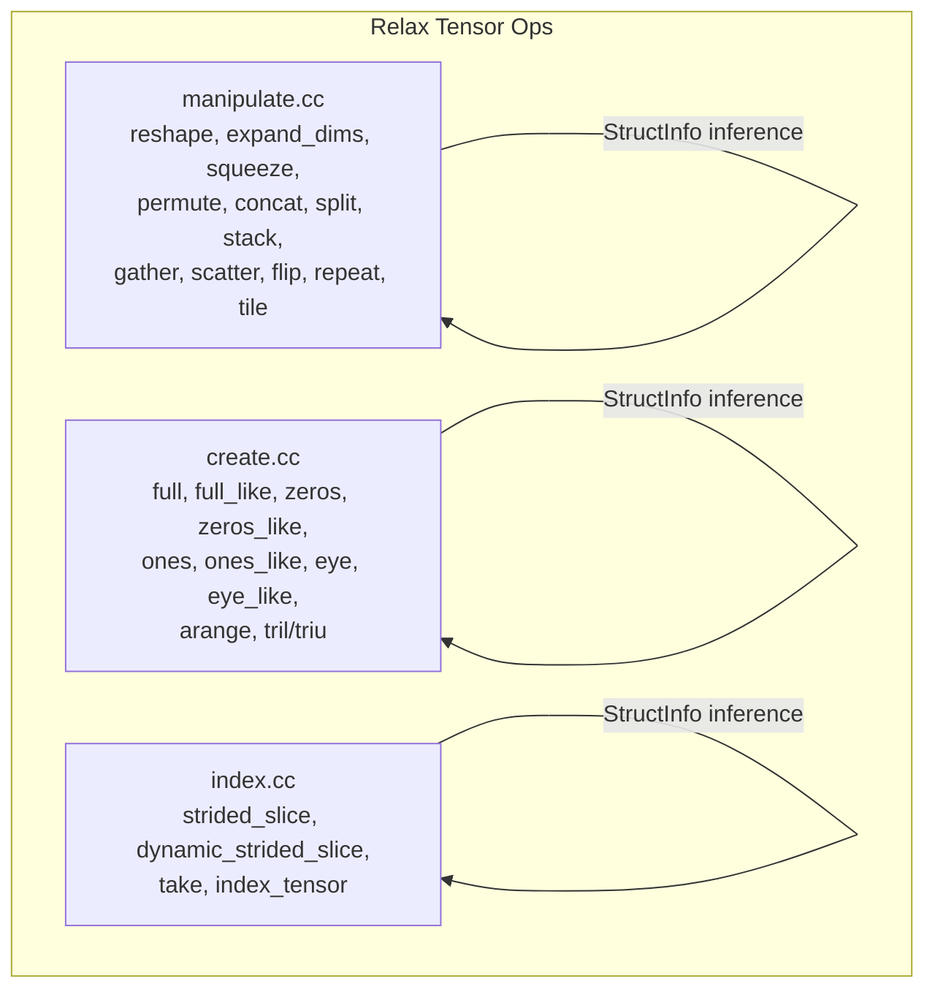
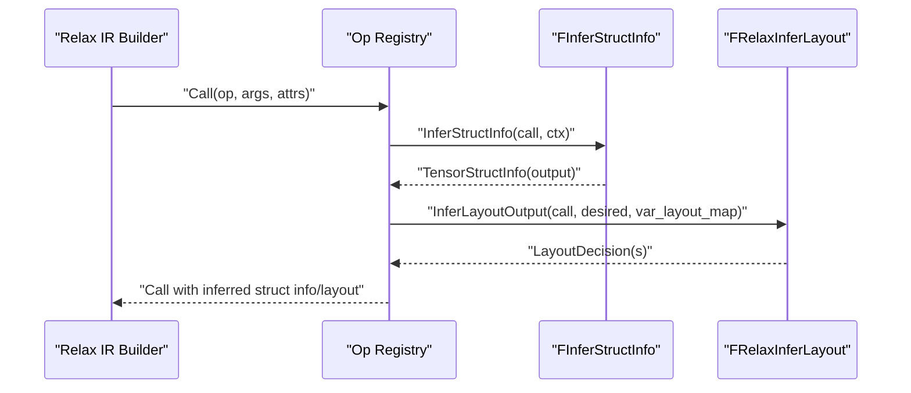
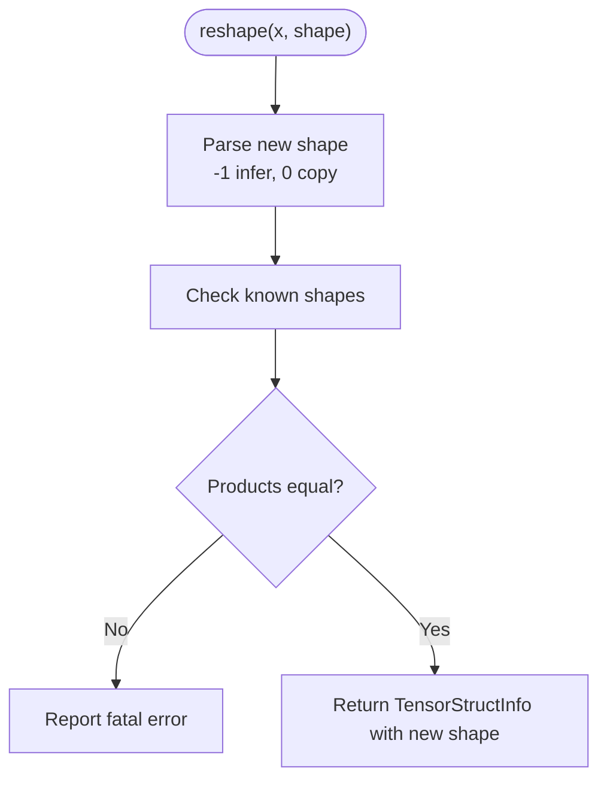
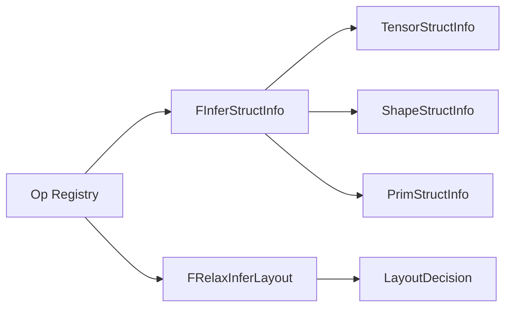

# Data Manipulation Operators

<cite>
**Referenced Files in This Document**
- [manipulate.cc](file://src/relax/op/tensor/manipulate.cc)
- [create.cc](file://src/relax/op/tensor/create.cc)
- [index.cc](file://src/relax/op/tensor/index.cc)
</cite>

## Table of Contents
1. [Introduction](#introduction)
2. [Project Structure](#project-structure)
3. [Core Components](#core-components)
4. [Architecture Overview](#architecture-overview)
5. [Detailed Component Analysis](#detailed-component-analysis)
6. [Dependency Analysis](#dependency-analysis)
7. [Performance Considerations](#performance-considerations)
8. [Troubleshooting Guide](#troubleshooting-guide)
9. [Conclusion](#conclusion)

## Introduction
This document explains Relax data manipulation and creation operators implemented in the TVM codebase. It covers:
- Shape operations: reshape, expand_dims, squeeze, permute
- Array creation operations: full, zeros, ones, arange, eye
- Slicing and indexing operations: strided_slice, dynamic_strided_slice, take, index_tensor
- Concatenation and splitting operations: concat, split, stack
- Type conversion operations: ones_like, zeros_like, full_like, eye_like
- Broadcasting semantics, memory layout considerations, and view vs copy behavior
- Practical patterns for tensor reshaping and efficient memory usage

## Project Structure
Relax operators are implemented in the Relax tensor operator module:
- Shape and manipulation operators: [manipulate.cc](file://src/relax/op/tensor/manipulate.cc)
- Creation and initialization operators: [create.cc](file://src/relax/op/tensor/create.cc)
- Slicing and indexing operators: [index.cc](file://src/relax/op/tensor/index.cc)

**Diagram sources**
- [manipulate.cc:142-1060](file://src/relax/op/tensor/manipulate.cc#L142-L1060)
- [create.cc:45-387](file://src/relax/op/tensor/create.cc#L45-L387)
- [index.cc:45-483](file://src/relax/op/tensor/index.cc#L45-L483)

**Section sources**
- [manipulate.cc:1-200](file://src/relax/op/tensor/manipulate.cc#L1-L200)
- [create.cc:1-120](file://src/relax/op/tensor/create.cc#L1-L120)
- [index.cc:1-60](file://src/relax/op/tensor/index.cc#L1-L60)

## Core Components
- Shape operations
  - reshape: Reshape a tensor to a new shape with size compatibility checks.
  - expand_dims: Insert new axes of length 1 at specified positions.
  - squeeze: Remove axes of length 1; supports explicit axes or all unit-length axes.
  - permute_dims: Rearrange tensor axes; identity permutation returns input.
- Array creation
  - full/full_like: Fill a tensor with a scalar value; dtype handling.
  - zeros/zeros_like, ones/ones_like: Initialize tensors with zeros/ones; dtype propagation.
  - eye/eye_like: Create identity-like matrices; supports diagonal offset.
  - arange: Create 1-D sequences with start/stop/step; computes output length.
- Slicing and indexing
  - strided_slice: Static slicing with per-axis begin/end/stride; supports inbound assumption.
  - dynamic_strided_slice: Dynamic slicing with begin/end/stride tensors.
  - take: Select elements along an axis using integer indices; supports mode.
  - index_tensor: Advanced indexing with a tuple of integer index tensors.
- Concatenation and splitting
  - concat: Concatenate a tuple of tensors along an axis; validates shapes and dtypes.
  - split: Split a tensor along an axis into multiple pieces; supports indices or equal sections.
  - stack: Stack a tuple of tensors along a new axis; inserts new dimension.
- Broadcasting and layout
  - broadcast semantics: Enforced during reshape, concat, squeeze, and other ops via structural checks.
  - layout transforms: Permute, reshape, and others preserve or transform memory layout metadata.

**Section sources**
- [manipulate.cc:997-1400](file://src/relax/op/tensor/manipulate.cc#L997-L1400)
- [create.cc:45-387](file://src/relax/op/tensor/create.cc#L45-L387)
- [index.cc:45-483](file://src/relax/op/tensor/index.cc#L45-L483)

## Architecture Overview
Operators are defined as Relax Call nodes with:
- An Op registry entry
- StructInfo inference to derive output shape/dtype/vdevice
- Optional layout inference for memory layout transformations

**Diagram sources**
- [manipulate.cc:1008-1060](file://src/relax/op/tensor/manipulate.cc#L1008-L1060)
- [create.cc:93-100](file://src/relax/op/tensor/create.cc#L93-L100)
- [index.cc:476-483](file://src/relax/op/tensor/index.cc#L476-L483)

## Detailed Component Analysis

### Shape Operations

#### reshape
- Purpose: Change tensor shape while preserving total element count.
- Behavior:
  - Accepts either a ShapeExpr or an array of PrimExpr for new shape.
  - Supports special values: 0 copies from input shape, -1 infers to maintain size.
  - Structural checks enforce size compatibility.
- StructInfo inference:
  - Validates input tensor and new shape struct info.
  - Computes product of old/new shapes; reports error if mismatch.
  - Returns TensorStructInfo with target shape and dtype.
- Layout inference:
  - Not specialized; preserves layout semantics implicitly.

**Diagram sources**
- [manipulate.cc:900-1052](file://src/relax/op/tensor/manipulate.cc#L900-L1052)

**Section sources**
- [manipulate.cc:997-1060](file://src/relax/op/tensor/manipulate.cc#L997-L1060)

#### expand_dims
- Purpose: Insert new axes of length 1 at given positions.
- Behavior:
  - Normalizes negative axes; inserts 1-sized dimensions.
  - Preserves dtype and vdevice; unknown ndim remains unknown.
- StructInfo inference:
  - Builds output shape by placing 1s at normalized axes and copying existing dims.
- Layout inference:
  - Inserts new axes into layout string; maintains existing layout order.

**Section sources**
- [manipulate.cc:405-507](file://src/relax/op/tensor/manipulate.cc#L405-L507)

#### squeeze
- Purpose: Remove axes of length 1.
- Behavior:
  - axis=None removes all unit-length axes; axis=[] is no-op.
  - For symbolic dims, falls back to unknown ndim.
- StructInfo inference:
  - Validates unit-length dimensions; silently skips non-unit dims (matching PyTorch behavior).
  - Returns new shape with unit-length axes removed.

**Section sources**
- [manipulate.cc:1241-1330](file://src/relax/op/tensor/manipulate.cc#L1241-L1330)

#### permute_dims
- Purpose: Rearrange axes of a tensor.
- Behavior:
  - axis=None reverses axes; identity permutation returns input.
  - Normalizes axes and validates against tensor ndim.
- StructInfo inference:
  - Permutes shape entries according to axes.
- Layout inference:
  - Transposes layout string to match new axis order.

**Section sources**
- [manipulate.cc:778-897](file://src/relax/op/tensor/manipulate.cc#L778-L897)

### Array Creation Operations

#### full, full_like
- Purpose: Create tensors filled with a scalar value.
- Behavior:
  - full: shape + fill_value + dtype; dtype defaults to fill_value’s dtype.
  - full_like: inherits dtype from fill_value or overrides with dtype.
- StructInfo inference:
  - Validates shape is ShapeStructInfo and fill_value is 0-d.
  - Returns TensorStructInfo with provided shape and dtype.

**Section sources**
- [create.cc:45-142](file://src/relax/op/tensor/create.cc#L45-L142)

#### zeros, zeros_like, ones, ones_like
- Purpose: Initialize tensors with zeros or ones.
- Behavior:
  - zeros/ones require explicit dtype; ones_like/zeros_like inherit or override dtype.
- StructInfo inference:
  - Uses provided dtype or propagates input dtype.

**Section sources**
- [create.cc:174-246](file://src/relax/op/tensor/create.cc#L174-L246)

#### eye, eye_like
- Purpose: Create identity-like matrices.
- Behavior:
  - eye: n, m, k specify rows, columns, diagonal offset; dtype required.
  - eye_like: matches input tensor’s shape and dtype (optionally overridden).
- StructInfo inference:
  - Validates input tensor for eye_like; constructs ShapeExpr(n, m) or copies input shape.

**Section sources**
- [create.cc:248-332](file://src/relax/op/tensor/create.cc#L248-L332)

#### arange
- Purpose: Create 1-D sequences [start, stop) with step.
- Behavior:
  - Computes number of elements using floor division or ceiling depending on dtypes.
- StructInfo inference:
  - Returns 1-D TensorStructInfo with computed length.

**Section sources**
- [create.cc:334-387](file://src/relax/op/tensor/create.cc#L334-L387)

### Slicing and Indexing Operations

#### strided_slice
- Purpose: Static slicing with per-axis begin/end/stride.
- Behavior:
  - Requires axes, begin, end tuples of equal length; optional strides default to 1.
  - assume_inbound enables constraint context for simplification.
- StructInfo inference:
  - Normalizes axes; computes output length per axis using topi::GetLength.
  - Returns TensorStructInfo with computed ShapeExpr or unknown shape if not fully known.
- Layout inference:
  - Preserves layout; transforms axes to new layout when needed.

**Section sources**
- [index.cc:137-483](file://src/relax/op/tensor/index.cc#L137-L483)

#### dynamic_strided_slice
- Purpose: Dynamic slicing with begin/end/stride tensors.
- Behavior:
  - Validates begin/end/stride are 1-D int64 tensors with known length equal to ndim.
  - Output shape depends on runtime values; returns unknown shape otherwise.
- Layout inference:
  - Falls back to initial layout due to dynamic nature.

**Section sources**
- [index.cc:485-582](file://src/relax/op/tensor/index.cc#L485-L582)

#### take
- Purpose: Select elements along an axis using integer indices.
- Behavior:
  - axis=None requires data to be 1-D; axis specified normalizes axis.
  - Output shape concatenates indices shape with data shape excluding selected axis.
- StructInfo inference:
  - Validates indices dtype and shape; constructs output shape accordingly.

**Section sources**
- [index.cc:45-135](file://src/relax/op/tensor/index.cc#L45-L135)

#### index_tensor
- Purpose: Advanced indexing with a tuple of integer index tensors.
- Behavior:
  - Broadcasts index shapes; counts of indices must not exceed data ndim.
  - Output shape combines broadcast of indices with tail of data shape.
- StructInfo inference:
  - Validates integer dtypes for indices; performs broadcast shape checks.

**Section sources**
- [manipulate.cc:555-695](file://src/relax/op/tensor/manipulate.cc#L555-L695)

### Concatenation and Splitting Operations

#### concat
- Purpose: Concatenate a tuple of tensors along an axis.
- Behavior:
  - All tensors must have same dtype and compatible shapes except on the concat axis.
  - Computes output shape by summing along concat axis.
- StructInfo inference:
  - Validates dtype consistency, ndim consistency, and shape equality on non-concat axes.
  - Returns TensorStructInfo with computed output shape or unknown if not fully known.

**Section sources**
- [manipulate.cc:142-328](file://src/relax/op/tensor/manipulate.cc#L142-L328)

#### split
- Purpose: Split a tensor along an axis into multiple pieces.
- Behavior:
  - Supports specifying split indices or equal sections; computes sizes using ceildiv or differences.
- StructInfo inference:
  - Constructs output tuple of TensorStructInfo with adjusted shapes per piece.

**Section sources**
- [manipulate.cc:1062-1184](file://src/relax/op/tensor/manipulate.cc#L1062-L1184)

#### stack
- Purpose: Stack a tuple of tensors along a new axis.
- Behavior:
  - All input tensors must have identical shapes and dtypes.
  - Inserts new dimension at axis position.
- StructInfo inference:
  - Validates shape and dtype consistency; constructs output shape with new axis.

**Section sources**
- [manipulate.cc:1440-1611](file://src/relax/op/tensor/manipulate.cc#L1440-L1611)

### Broadcasting Semantics
- broadcast_to: Enforces target shape compatibility by checking dimension-wise equality or unit-length source dims.
- reshape: Requires total element count equality; rejects incompatible shapes.
- concat: Requires equal shapes on all axes except the concat axis.
- squeeze: Silently ignores non-unit axes; only removes unit-length axes.
- strided_slice: No implicit broadcasting; produces a slice with possibly smaller dimensions.
- index_tensor: Broadcasts index shapes; mismatches reported as errors.

**Section sources**
- [manipulate.cc:61-140](file://src/relax/op/tensor/manipulate.cc#L61-L140)
- [manipulate.cc:157-207](file://src/relax/op/tensor/manipulate.cc#L157-L207)
- [manipulate.cc:1256-1330](file://src/relax/op/tensor/manipulate.cc#L1256-L1330)
- [index.cc:275-437](file://src/relax/op/tensor/index.cc#L275-L437)

### Memory Layout Considerations and View vs Copy Behavior
- Layout inference:
  - Many operators preserve or transform layout metadata (e.g., permute_dims, expand_dims, squeeze, stack, repeat, tile).
  - Sub-indexed layouts are handled conservatively; fallback to initial layout when unsupported.
- View vs copy:
  - Operators like reshape, permute_dims, squeeze, strided_slice may represent views when shapes and layouts align.
  - take, index_tensor, scatter/gather variants may create copies depending on indexing patterns.
- Practical guidance:
  - Prefer contiguous layouts for performance-sensitive paths.
  - Use layout_transform to align with target kernels; TVM’s IndexMap supports padding and axis separators.

**Section sources**
- [manipulate.cc:459-498](file://src/relax/op/tensor/manipulate.cc#L459-L498)
- [manipulate.cc:847-888](file://src/relax/op/tensor/manipulate.cc#L847-L888)
- [manipulate.cc:1332-1390](file://src/relax/op/tensor/manipulate.cc#L1332-L1390)
- [manipulate.cc:1614-1642](file://src/relax/op/tensor/manipulate.cc#L1614-L1642)
- [manipulate.cc:1814-1870](file://src/relax/op/tensor/manipulate.cc#L1814-L1870)
- [manipulate.cc:1938-2014](file://src/relax/op/tensor/manipulate.cc#L1938-L2014)

### Common Data Transformation Patterns and Model Compatibility
- Reshaping for model compatibility:
  - Use reshape to flatten or fold dimensions before fully connected layers.
  - Use expand_dims to add broadcasting-ready singleton dimensions.
  - Use squeeze to remove unit-length axes introduced by reductions.
- Efficient memory usage:
  - Prefer stack with axis=0 for batched concatenation along a new dimension.
  - Use strided_slice for fast windowing without copying data when possible.
  - Use take for selecting subsets along an axis to reduce downstream computation.

[No sources needed since this section provides general guidance]

## Dependency Analysis
- Operator registration:
  - Each operator registers an Op with FInferStructInfo and optional FRelaxInferLayout.
- StructInfo inference:
  - Operators rely on TensorStructInfo, ShapeStructInfo, and PrimStructInfo to derive outputs.
- Analyzer usage:
  - arith::Analyzer is used for simplifying expressions and proving equalities.

**Diagram sources**
- [manipulate.cc:1008-1060](file://src/relax/op/tensor/manipulate.cc#L1008-L1060)
- [create.cc:93-100](file://src/relax/op/tensor/create.cc#L93-L100)
- [index.cc:476-483](file://src/relax/op/tensor/index.cc#L476-L483)

**Section sources**
- [manipulate.cc:1008-1060](file://src/relax/op/tensor/manipulate.cc#L1008-L1060)
- [create.cc:93-100](file://src/relax/op/tensor/create.cc#L93-L100)
- [index.cc:476-483](file://src/relax/op/tensor/index.cc#L476-L483)

## Performance Considerations
- Prefer static shapes and axes for operators that support layout inference to avoid fallback to initial layouts.
- Use arange and eye for efficient construction of common patterns without explicit loops.
- Use strided_slice for windowing operations; it avoids copying when bounds and strides are static.
- Use stack and concat judiciously; concatenating many small tensors can be expensive; consider batching.

[No sources needed since this section provides general guidance]

## Troubleshooting Guide
- Shape mismatch errors:
  - reshape: Ensure total element count matches; avoid conflicting -1 and 0 values.
  - concat: Verify shapes are equal on all axes except the concat axis.
  - squeeze: Non-unit axes are ignored; confirm intended axes removal.
- Dtype and axis errors:
  - take, index_tensor, scatter/gather: Require integer indices; ensure axis within [-ndim, ndim-1].
  - strided_slice: Axes, begin, end must be tuples of equal length; strides default to 1.
- Layout issues:
  - Sub-indexed layouts may force fallback to initial layouts; simplify or transform layout explicitly.

**Section sources**
- [manipulate.cc:1008-1060](file://src/relax/op/tensor/manipulate.cc#L1008-L1060)
- [index.cc:275-437](file://src/relax/op/tensor/index.cc#L275-L437)
- [index.cc:485-582](file://src/relax/op/tensor/index.cc#L485-L582)

## Conclusion
Relax provides a comprehensive set of data manipulation and creation operators with robust StructInfo inference and optional layout inference. Understanding broadcasting rules, shape constraints, and layout behavior helps write efficient and portable transformations for model compilation and execution.