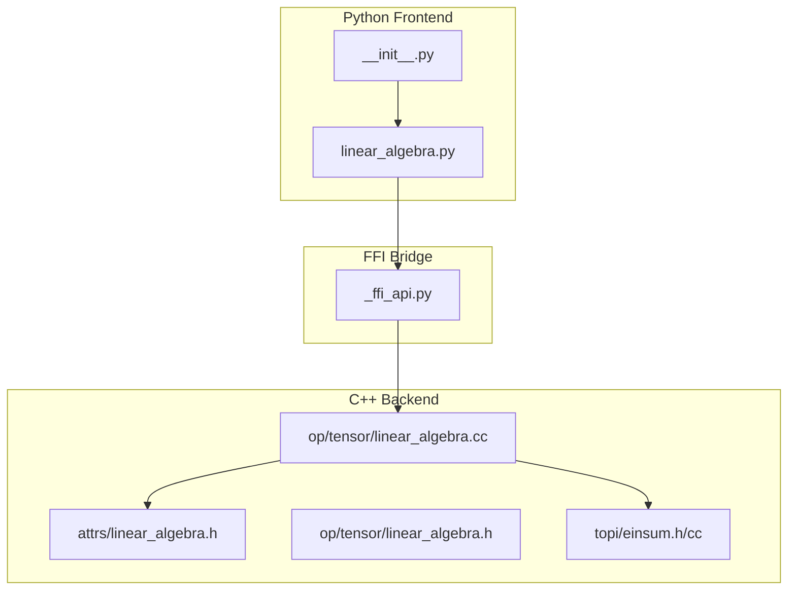
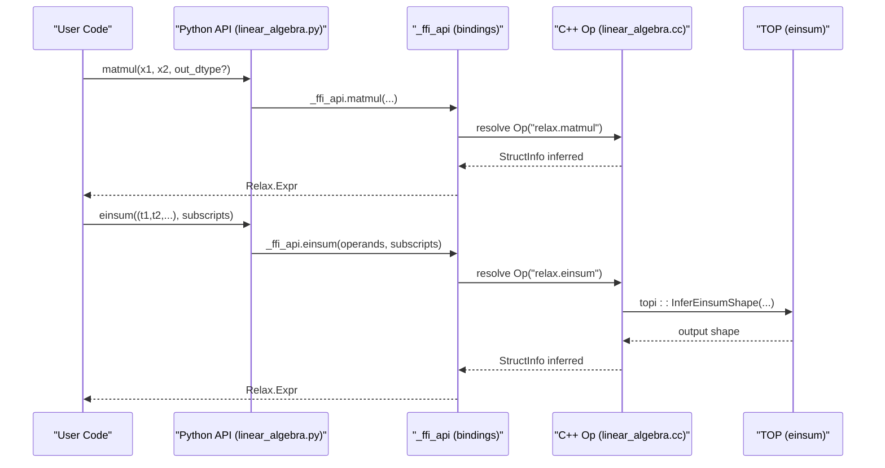
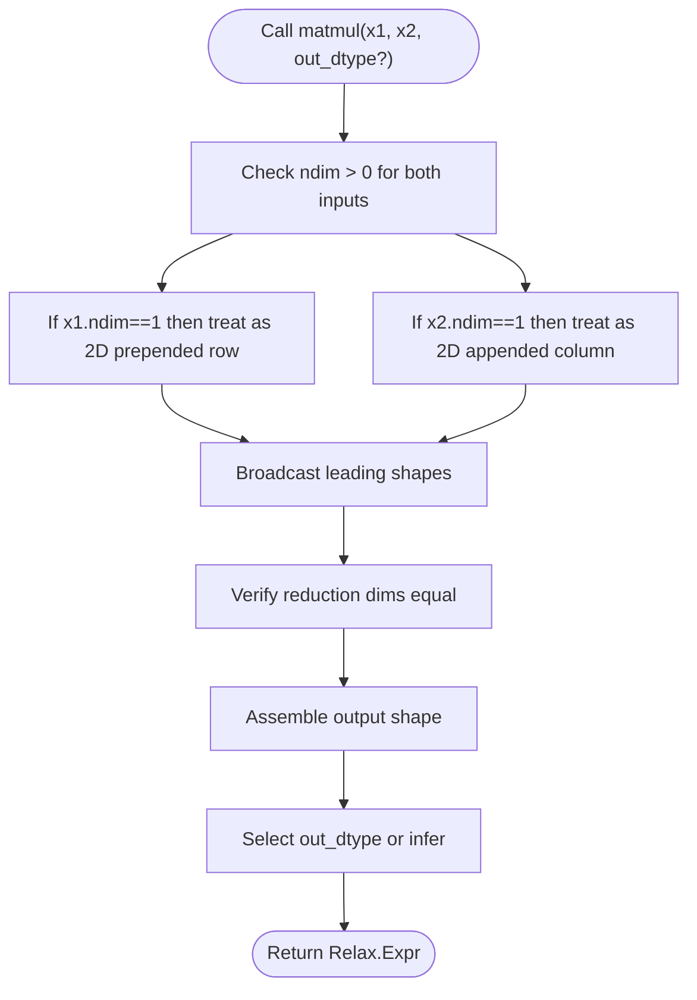
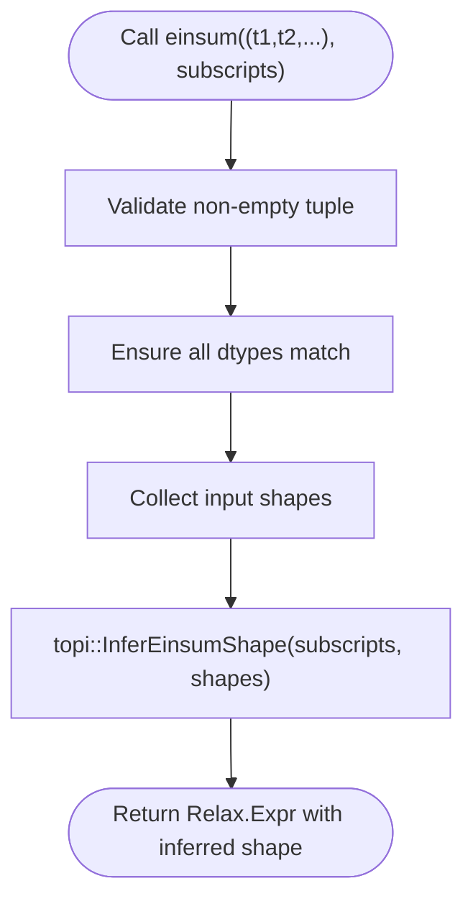
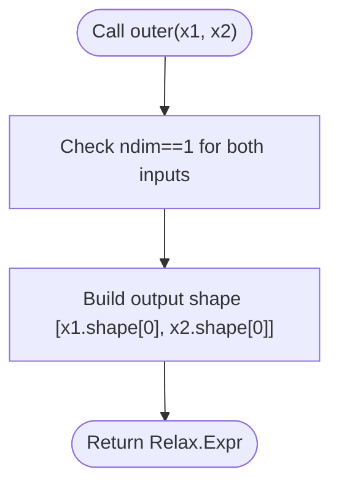
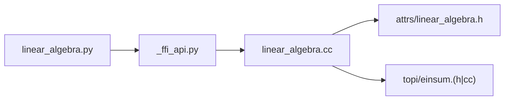

# Linear Algebra Operators

<cite>
**Referenced Files in This Document**
- [linear_algebra.h](file://include/tvm/relax/attrs/linear_algebra.h)
- [linear_algebra.cc](file://src/relax/op/tensor/linear_algebra.cc)
- [linear_algebra.h](file://src/relax/op/tensor/linear_algebra.h)
- [linear_algebra.py](file://python/tvm/relax/op/linear_algebra.py)
- [__init__.py](file://python/tvm/relax/op/__init__.py)
- [einsum.h](file://include/tvm/topi/einsum.h)
- [einsum.cc](file://src/topi/einsum.cc)
- [test_op_linear_algebra.py](file://tests/python/relax/test_op_linear_algebra.py)
- [test_tvmscript_parser_op_linear_algebra.py](file://tests/python/relax/test_tvmscript_parser_op_linear_algebra.py)
- [linear_algebra.py](file://python/tvm/relax/transform/legalize_ops/linear_algebra.py)
</cite>

## Table of Contents
1. [Introduction](#introduction)
2. [Project Structure](#project-structure)
3. [Core Components](#core-components)
4. [Architecture Overview](#architecture-overview)
5. [Detailed Component Analysis](#detailed-component-analysis)
6. [Dependency Analysis](#dependency-analysis)
7. [Performance Considerations](#performance-considerations)
8. [Troubleshooting Guide](#troubleshooting-guide)
9. [Conclusion](#conclusion)
10. [Appendices](#appendices)

## Introduction
This document describes Relax linear algebra operators currently present in the repository, focusing on matrix operations (matmul, dot, outer), decomposition operations (cholesky, lu, qr), solving operations (solve, triangular_solve), eigenvalue operations (eig, eigvals), and norm operations (norm, frobenius_norm). It explains tensor contraction semantics, batch operations, and performance considerations. It also includes examples of common linear algebra patterns in machine learning, optimization problems, and scientific computing applications, along with numerical stability considerations and hardware-specific optimizations.

Note: The current repository snapshot exposes matmul, einsum, and outer operators. Decomposition, solving, eigenvalue, and norm operators are not present in the referenced files and therefore are not documented here. Users requiring those operators should consult upstream extensions or implement them via TIR calls.

## Project Structure
Relax linear algebra operators are defined and registered in the C++ backend and exposed to Python via FFI bindings. The primary components are:
- Attribute definitions for operators (e.g., matmul, einsum)
- Operator implementations and struct-info inference
- Python front-end APIs
- Tests and legalizations

**Diagram sources**
- [linear_algebra.py:1-140](file://python/tvm/relax/op/linear_algebra.py#L1-L140)
- [__init__.py](file://python/tvm/relax/op/__init__.py#L91)
- [linear_algebra.h:32-54](file://include/tvm/relax/attrs/linear_algebra.h#L32-L54)
- [linear_algebra.h:44-60](file://src/relax/op/tensor/linear_algebra.h#L44-L60)
- [linear_algebra.cc:44-303](file://src/relax/op/tensor/linear_algebra.cc#L44-L303)
- [einsum.h](file://include/tvm/topi/einsum.h)
- [einsum.cc](file://src/topi/einsum.cc)

**Section sources**
- [linear_algebra.h:32-54](file://include/tvm/relax/attrs/linear_algebra.h#L32-L54)
- [linear_algebra.cc:44-303](file://src/relax/op/tensor/linear_algebra.cc#L44-L303)
- [linear_algebra.h:44-60](file://src/relax/op/tensor/linear_algebra.h#L44-L60)
- [linear_algebra.py:28-139](file://python/tvm/relax/op/linear_algebra.py#L28-L139)
- [__init__.py](file://python/tvm/relax/op/__init__.py#L91)

## Core Components
- matmul: General matrix multiplication with broadcasting on leading dimensions. Supports mixed precision policy and dtype override.
- einsum: Einstein summation over a tuple of tensors with subscript specification.
- outer: Outer product of two 1-D vectors producing a 2-D matrix.

These operators are pure (no side effects), support struct-info inference, and integrate with Relax’s type system and device placement.

**Section sources**
- [linear_algebra.cc:44-174](file://src/relax/op/tensor/linear_algebra.cc#L44-L174)
- [linear_algebra.cc:178-262](file://src/relax/op/tensor/linear_algebra.cc#L178-L262)
- [linear_algebra.cc:266-303](file://src/relax/op/tensor/linear_algebra.cc#L266-L303)
- [linear_algebra.py:28-139](file://python/tvm/relax/op/linear_algebra.py#L28-L139)

## Architecture Overview
The Relax linear algebra pipeline connects Python front-end calls to C++ operator implementations, which register ops, infer struct info, and dispatch to underlying libraries where applicable.

**Diagram sources**
- [linear_algebra.py:28-112](file://python/tvm/relax/op/linear_algebra.py#L28-L112)
- [linear_algebra.cc:44-174](file://src/relax/op/tensor/linear_algebra.cc#L44-L174)
- [linear_algebra.cc:178-262](file://src/relax/op/tensor/linear_algebra.cc#L178-L262)
- [einsum.h](file://include/tvm/topi/einsum.h)
- [einsum.cc](file://src/topi/einsum.cc)

## Detailed Component Analysis

### Matrix Multiplication (matmul)
- Semantics: Batched matrix multiplication with broadcasting on leading dimensions. The reduction dimension must match between operands.
- Shape inference: Handles 1-D to 2-D prepending, broadcasts prefixes, validates reduction dimension equality, and constructs output shape.
- Mixed precision: Supports overriding output dtype via attributes; registered with always-on mixed-precision policy.
- Device placement: Struct info preserves vdevice when consistent across inputs.

**Diagram sources**
- [linear_algebra.cc:57-161](file://src/relax/op/tensor/linear_algebra.cc#L57-L161)

**Section sources**
- [linear_algebra.cc:44-174](file://src/relax/op/tensor/linear_algebra.cc#L44-L174)
- [linear_algebra.h:34-44](file://src/relax/op/tensor/linear_algebra.h#L34-L44)
- [linear_algebra.py:28-51](file://python/tvm/relax/op/linear_algebra.py#L28-L51)

### Einstein Summation (einsum)
- Semantics: General tensor contraction via subscript notation over a tuple of tensors.
- Input validation: Ensures at least one tensor, all tensors have the same dtype, and shapes are compatible.
- Shape inference: Delegates to topi::InferEinsumShape to compute output shape.
- Device placement: Propagates vdevice when consistent.

**Diagram sources**
- [linear_algebra.cc:191-255](file://src/relax/op/tensor/linear_algebra.cc#L191-L255)
- [einsum.h](file://include/tvm/topi/einsum.h)
- [einsum.cc](file://src/topi/einsum.cc)

**Section sources**
- [linear_algebra.cc:178-262](file://src/relax/op/tensor/linear_algebra.cc#L178-L262)
- [linear_algebra.py:93-112](file://python/tvm/relax/op/linear_algebra.py#L93-L112)

### Outer Product (outer)
- Semantics: Outer product of two 1-D vectors produces a 2-D matrix.
- Shape inference: Validates both inputs are 1-D; constructs output shape as [m, n].

**Diagram sources**
- [linear_algebra.cc:276-295](file://src/relax/op/tensor/linear_algebra.cc#L276-L295)

**Section sources**
- [linear_algebra.cc:266-303](file://src/relax/op/tensor/linear_algebra.cc#L266-L303)
- [linear_algebra.py:115-139](file://python/tvm/relax/op/linear_algebra.py#L115-L139)

### Conceptual Overview
- Tensor Contraction Semantics: matmul performs a reduction over the last dimension of the first operand and the second-to-last dimension of the second operand, broadcasting leading dimensions.
- Batch Operations: Leading dimensions beyond the last two are treated as batch dimensions and broadcast according to NumPy-style rules.
- Examples:
  - Dense layer: y = matmul(x, permute_dims(weight, axes=None)) + bias
  - Attention heads: einsum("nhtd, nthD -> nhd", [Q, K]) for logits

[No sources needed since this section doesn't analyze specific source files]

## Dependency Analysis
- Python API depends on FFI bindings to call C++ operator implementations.
- matmul and einsum rely on struct-info inference and device placement logic.
- einsum delegates shape computation to topi::InferEinsumShape.

**Diagram sources**
- [linear_algebra.py:28-112](file://python/tvm/relax/op/linear_algebra.py#L28-L112)
- [__init__.py](file://python/tvm/relax/op/__init__.py#L91)
- [linear_algebra.cc:44-262](file://src/relax/op/tensor/linear_algebra.cc#L44-L262)
- [linear_algebra.h:32-54](file://include/tvm/relax/attrs/linear_algebra.h#L32-L54)
- [einsum.h](file://include/tvm/topi/einsum.h)

**Section sources**
- [__init__.py](file://python/tvm/relax/op/__init__.py#L91)
- [linear_algebra.cc:44-262](file://src/relax/op/tensor/linear_algebra.cc#L44-L262)

## Performance Considerations
- Mixed Precision: matmul is registered with an always-on mixed-precision policy, enabling faster accumulation types when safe.
- Broadcasting Overhead: Excessive leading-dimension broadcasting increases memory traffic; prefer pre-broadcasting when possible.
- Kernel Libraries: For advanced linear algebra operations (e.g., decomposition, eigenvalue, norms), leverage external libraries via TIR calls or specialized backends. The repository integrates with cuBLAS/CuTT/CUTLASS elsewhere; use call_tir to invoke vendor kernels when available.
- Hardware-Specific Optimizations: Prefer contiguous layouts and aligned strides. On GPU, ensure column-major layouts for optimal GEMM performance.

[No sources needed since this section provides general guidance]

## Troubleshooting Guide
Common issues and resolutions:
- Matmul scalar operands: Inputs must be at least 1-D; scalar tensors are rejected during struct-info inference.
- Reduction dimension mismatch: The reduction dimension of the two operands must be equal; otherwise, a diagnostic error is reported.
- Einsum empty tuple: Requires at least one tensor in the input tuple.
- Einsum dtype mismatch: All input tensors must have the same dtype.
- Einsum unknown shapes: If shapes are not known, struct info falls back to unknown shape inference.

**Section sources**
- [linear_algebra.cc:88-147](file://src/relax/op/tensor/linear_algebra.cc#L88-L147)
- [linear_algebra.cc:192-201](file://src/relax/op/tensor/linear_algebra.cc#L192-L201)
- [linear_algebra.cc:229-235](file://src/relax/op/tensor/linear_algebra.cc#L229-L235)

## Conclusion
The Relax linear algebra module provides robust primitives for matrix multiplication, Einstein summation, and outer products with strong struct-info inference and device-awareness. While decomposition, solving, eigenvalue, and norm operations are not present in the current snapshot, the architecture supports extending the suite by adding new ops, attributes, and legalizations, and by integrating vendor libraries via TIR calls.

[No sources needed since this section summarizes without analyzing specific files]

## Appendices

### API Reference Summary
- matmul(x1, x2, out_dtype=None): General matrix multiplication with optional output dtype.
- einsum(operands, subscripts): Einstein summation over a tuple of tensors.
- outer(x1, x2): Outer product of two 1-D vectors.

**Section sources**
- [linear_algebra.py:28-139](file://python/tvm/relax/op/linear_algebra.py#L28-L139)
- [__init__.py](file://python/tvm/relax/op/__init__.py#L91)

### Example Patterns
- Dense Layer: Combine permute_dims and matmul with optional bias addition.
- Attention Logits: Use einsum to contract Q and K along head dimensions.
- Covariance Outer Products: Use outer to construct rank-one updates.

[No sources needed since this section doesn't analyze specific source files]

### Legalization and Transform
- LegalizeOps transforms can map Relax linear algebra ops to backend-specific implementations. See the linear algebra legalization module for patterns.

**Section sources**
- [linear_algebra.py](file://python/tvm/relax/transform/legalize_ops/linear_algebra.py)

### Tests
- Operator tests validate semantics and shape inference for matmul and einsum.
- TVMScript parser tests ensure correct parsing of Relax linear algebra ops.

**Section sources**
- [test_op_linear_algebra.py](file://tests/python/relax/test_op_linear_algebra.py)
- [test_tvmscript_parser_op_linear_algebra.py](file://tests/python/relax/test_tvmscript_parser_op_linear_algebra.py)