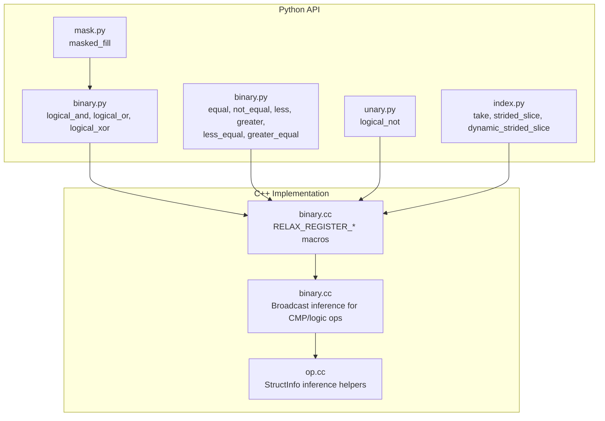
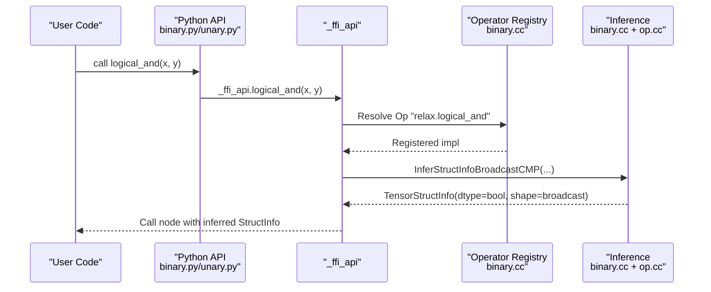
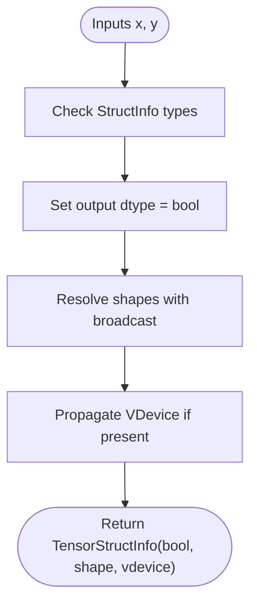
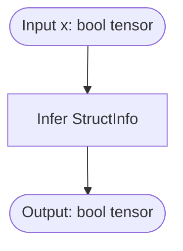
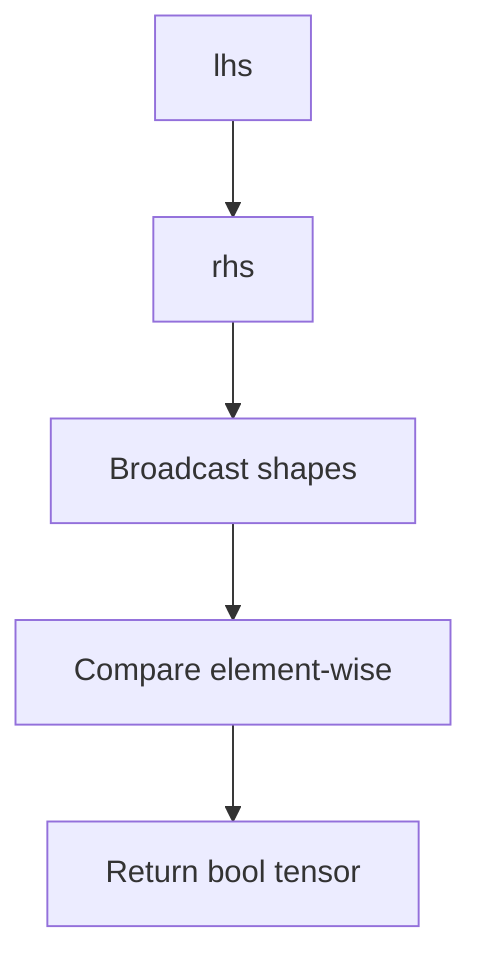
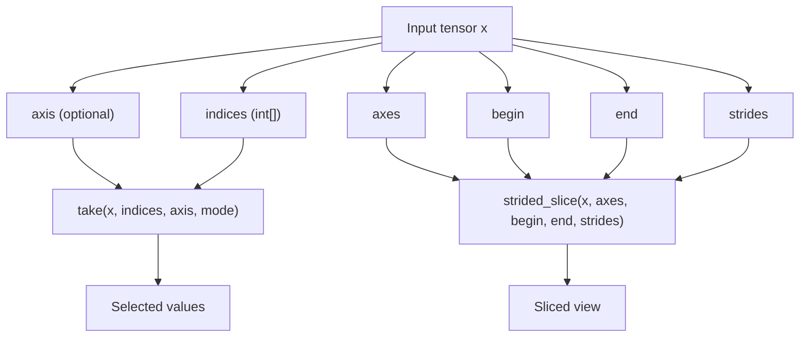
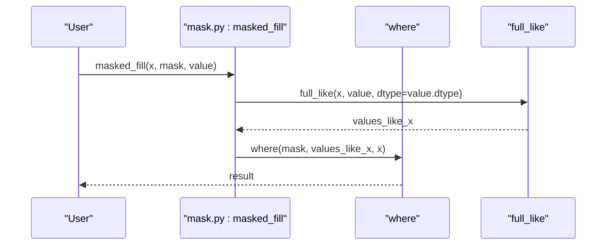
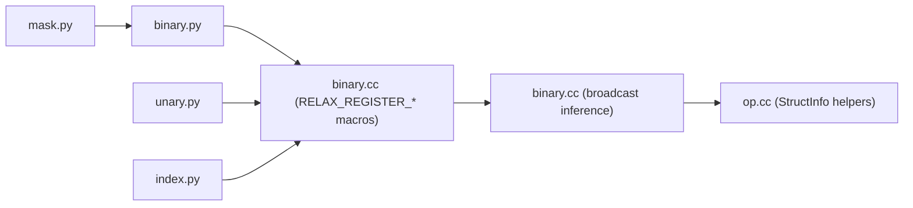

# Logical Operators

<cite>
**Referenced Files in This Document**
- [binary.cc](file://src/relax/op/tensor/binary.cc)
- [binary.py](file://python/tvm/relax/op/binary.py)
- [unary.py](file://python/tvm/relax/op/unary.py)
- [mask.py](file://python/tvm/relax/op/mask.py)
- [index.py](file://python/tvm/relax/op/index.py)
- [op.cc](file://src/relax/op/op.cc)
- [test_op_unary.py](file://tests/python/relax/test_op_unary.py)
- [test_frontend_onnx.py](file://tests/python/relax/test_frontend_onnx.py)
</cite>

## Table of Contents
1. [Introduction](#introduction)
2. [Project Structure](#project-structure)
3. [Core Components](#core-components)
4. [Architecture Overview](#architecture-overview)
5. [Detailed Component Analysis](#detailed-component-analysis)
6. [Dependency Analysis](#dependency-analysis)
7. [Performance Considerations](#performance-considerations)
8. [Troubleshooting Guide](#troubleshooting-guide)
9. [Conclusion](#conclusion)

## Introduction
This document explains Relax logical and comparison operators, focusing on:
- Boolean operations: logical_and, logical_or, logical_not
- Comparison operators: equal, not_equal, less, greater, less_equal, greater_equal
- Indexing operations: take, strided_slice, dynamic_strided_slice
- Mask creation and boolean array operations
- Advanced indexing patterns and conditional logic
- Broadcasting behavior for logical operations
- Performance implications of different logical patterns

It synthesizes Python APIs, operator registration, and inference logic from the TVM Relax codebase to help both practitioners and developers use these operators effectively.

## Project Structure
Relevant parts of the Relax operator ecosystem:
- Python operator bindings expose high-level APIs for logical and comparison operations.
- C++ operator registration and inference define broadcasting semantics and output shape/type deduction.
- Mask utilities provide convenience wrappers for masked fill using where.
- Indexing utilities provide advanced selection patterns.

**Diagram sources**
- [binary.cc:134-143](file://src/relax/op/tensor/binary.cc#L134-L143)
- [binary.py:338-383](file://python/tvm/relax/op/binary.py#L338-L383)
- [unary.py:291-304](file://python/tvm/relax/op/unary.py#L291-L304)
- [mask.py:23-39](file://python/tvm/relax/op/mask.py#L23-L39)
- [index.py:28-145](file://python/tvm/relax/op/index.py#L28-L145)
- [op.cc:68-85](file://src/relax/op/op.cc#L68-L85)

**Section sources**
- [binary.cc:134-143](file://src/relax/op/tensor/binary.cc#L134-L143)
- [binary.py:338-383](file://python/tvm/relax/op/binary.py#L338-L383)
- [unary.py:291-304](file://python/tvm/relax/op/unary.py#L291-L304)
- [mask.py:23-39](file://python/tvm/relax/op/mask.py#L23-L39)
- [index.py:28-145](file://python/tvm/relax/op/index.py#L28-L145)
- [op.cc:68-85](file://src/relax/op/op.cc#L68-L85)

## Core Components
- Logical binary operators: logical_and, logical_or, logical_xor
- Logical unary operator: logical_not
- Comparison operators: equal, not_equal, less, greater, less_equal, greater_equal
- Indexing operators: take, strided_slice, dynamic_strided_slice
- Mask utility: masked_fill built on where

These components are exposed via Python bindings and backed by C++ operator registration and inference logic.

**Section sources**
- [binary.py:338-383](file://python/tvm/relax/op/binary.py#L338-L383)
- [unary.py:291-304](file://python/tvm/relax/op/unary.py#L291-L304)
- [binary.cc:208-227](file://src/relax/op/tensor/binary.cc#L208-L227)
- [index.py:28-145](file://python/tvm/relax/op/index.py#L28-L145)
- [mask.py:23-39](file://python/tvm/relax/op/mask.py#L23-L39)

## Architecture Overview
The logical and comparison operators follow a consistent pattern:
- Python API functions delegate to FFI-generated functions.
- C++ operator registration macros register ops and implementations.
- Broadcast inference determines output shape/dtype for binary comparisons/logical ops.
- StructInfo helpers infer shapes and types for expressions.

**Diagram sources**
- [binary.cc:134-143](file://src/relax/op/tensor/binary.cc#L134-L143)
- [binary.py:338-351](file://python/tvm/relax/op/binary.py#L338-L351)
- [op.cc:68-85](file://src/relax/op/op.cc#L68-L85)

## Detailed Component Analysis

### Logical Binary Operators
- logical_and, logical_or, logical_xor are registered as binary broadcast ops.
- Output dtype is boolean; shape follows numpy-style broadcasting rules.
- StructInfo inference ensures consistent propagation of shape and dtype.

**Diagram sources**
- [binary.cc:134-143](file://src/relax/op/tensor/binary.cc#L134-L143)

**Section sources**
- [binary.cc:222-227](file://src/relax/op/tensor/binary.cc#L222-L227)
- [binary.cc:134-143](file://src/relax/op/tensor/binary.cc#L134-L143)
- [binary.py:338-383](file://python/tvm/relax/op/binary.py#L338-L383)

### Logical Unary Operator
- logical_not is a unary operator with dedicated registration and inference.
- It operates on boolean inputs and returns boolean output.

**Diagram sources**
- [unary.py:291-304](file://python/tvm/relax/op/unary.py#L291-L304)
- [binary.cc:134-143](file://src/relax/op/tensor/binary.cc#L134-L143)

**Section sources**
- [unary.py:291-304](file://python/tvm/relax/op/unary.py#L291-L304)
- [test_op_unary.py:62-63](file://tests/python/relax/test_op_unary.py#L62-L63)

### Comparison Operators
- equal, not_equal, less, greater, less_equal, greater_equal are registered as comparison ops.
- Output dtype is boolean; broadcasting rules mirror arithmetic comparisons.

**Diagram sources**
- [binary.cc:138-143](file://src/relax/op/tensor/binary.cc#L138-L143)
- [binary.py:191-296](file://python/tvm/relax/op/binary.py#L191-L296)

**Section sources**
- [binary.cc:208-215](file://src/relax/op/tensor/binary.cc#L208-L215)
- [binary.py:191-296](file://python/tvm/relax/op/binary.py#L191-L296)

### Indexing Operations
- take: Select along a given axis using integer indices; supports boundary modes.
- strided_slice: Fixed-range slicing with axes, begin, end, strides; supports negative strides.
- dynamic_strided_slice: Runtime-computed begin/end/strides.

**Diagram sources**
- [index.py:28-145](file://python/tvm/relax/op/index.py#L28-L145)

**Section sources**
- [index.py:28-145](file://python/tvm/relax/op/index.py#L28-L145)

### Mask Creation and Boolean Array Operations
- masked_fill fills locations defined by a boolean mask with a specified value.
- Internally uses where(mask, fill_values, original_tensor).

**Diagram sources**
- [mask.py:23-39](file://python/tvm/relax/op/mask.py#L23-L39)

**Section sources**
- [mask.py:23-39](file://python/tvm/relax/op/mask.py#L23-L39)

### Conditional Logic and Filtering
- Combine comparisons with logical operators to form predicates.
- Use boolean masks with where/select-like patterns to filter or branch.
- Indexing operations enable advanced selection patterns (take, strided_slice) to implement filters and gather operations.

Examples of patterns:
- Predicate construction: compare + logical_and/logical_or
- Filtering: masked_fill with negated mask; or select regions via take/strided_slice
- Advanced selection: dynamic_strided_slice for runtime slicing bounds

[No sources needed since this section describes general usage patterns]

## Dependency Analysis
- Python bindings depend on FFI-generated functions.
- Operator registration macros bind Python names to C++ implementations.
- StructInfo inference helpers unify shape/dtype deduction across operators.
- Indexing and mask utilities depend on core operator registry.

**Diagram sources**
- [binary.cc:134-143](file://src/relax/op/tensor/binary.cc#L134-L143)
- [binary.py:338-383](file://python/tvm/relax/op/binary.py#L338-L383)
- [unary.py:291-304](file://python/tvm/relax/op/unary.py#L291-L304)
- [mask.py:23-39](file://python/tvm/relax/op/mask.py#L23-L39)
- [index.py:28-145](file://python/tvm/relax/op/index.py#L28-L145)
- [op.cc:68-85](file://src/relax/op/op.cc#L68-L85)

**Section sources**
- [binary.cc:134-143](file://src/relax/op/tensor/binary.cc#L134-L143)
- [op.cc:68-85](file://src/relax/op/op.cc#L68-L85)

## Performance Considerations
- Broadcasting behavior:
  - Logical and comparison operators broadcast shapes according to numpy semantics.
  - Broadcasting can increase memory bandwidth and computation volume; prefer aligned shapes when possible.
- Dtype implications:
  - Outputs of logical/comparison operators are boolean; downstream operations should account for dtype conversions.
- Indexing modes:
  - take with mode "fast" assumes in-bounds indices; clipping/wrapping modes may incur extra checks.
  - dynamic_strided_slice computes begin/end/strides at runtime; prefer fixed strided_slice when shapes are static.
- Masking:
  - masked_fill uses where internally; avoid excessive branching by reusing masks and minimizing redundant allocations.

[No sources needed since this section provides general guidance]

## Troubleshooting Guide
Common issues and resolutions:
- Shape mismatches in logical/comparison operations:
  - Ensure inputs are broadcast-compatible; check inferred shapes via StructInfo.
- Unexpected boolean output:
  - Confirm operator choice: logical_* for boolean logic, compare_* for element-wise comparisons.
- Out-of-bounds indexing:
  - For take, choose mode "clip" or "wrap" to avoid segmentation faults.
- Mask correctness:
  - Verify mask dtype and shape align with the tensor being filtered.
- ONNX/other frontends:
  - Tests confirm And/Or/Xor and Compare ops are supported; validate frontend translation.

**Section sources**
- [test_op_unary.py:62-63](file://tests/python/relax/test_op_unary.py#L62-L63)
- [test_frontend_onnx.py:602-643](file://tests/python/relax/test_frontend_onnx.py#L602-L643)

## Conclusion
Relax provides a comprehensive set of logical and comparison operators with robust broadcasting and inference. Combined with indexing and mask utilities, they enable expressive conditional logic, filtering, and advanced selection patterns. Understanding broadcasting behavior and choosing appropriate indexing modes helps achieve both correctness and performance.