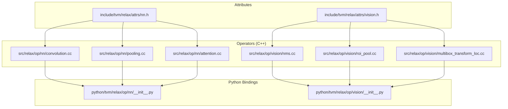
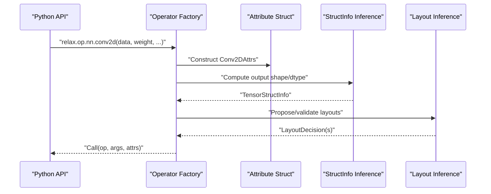
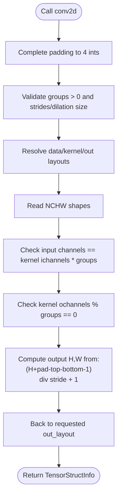
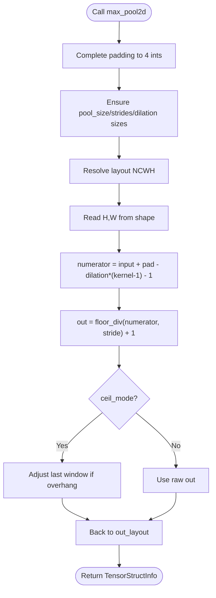
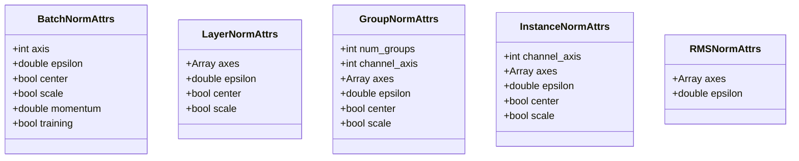
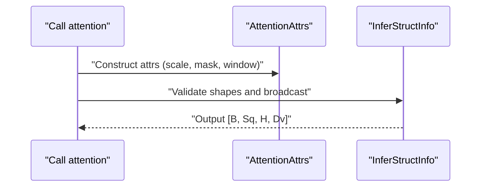
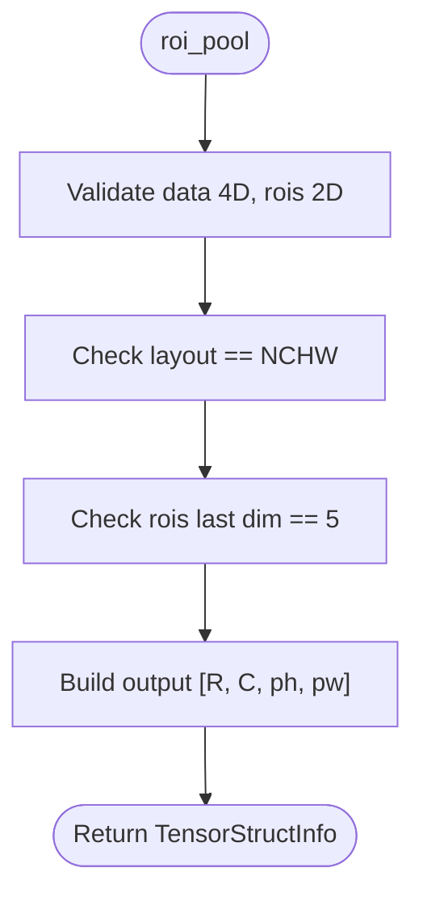
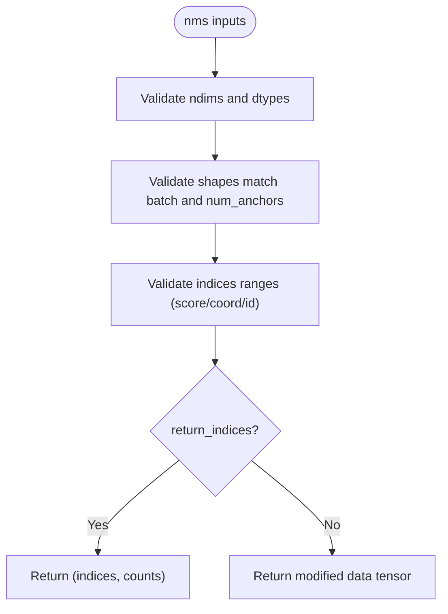
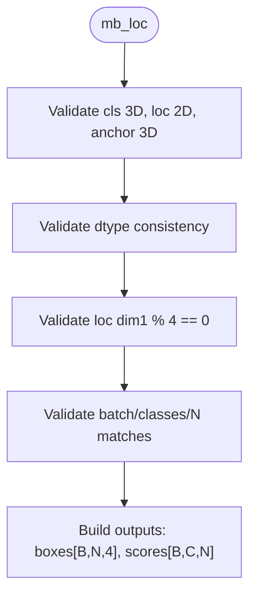
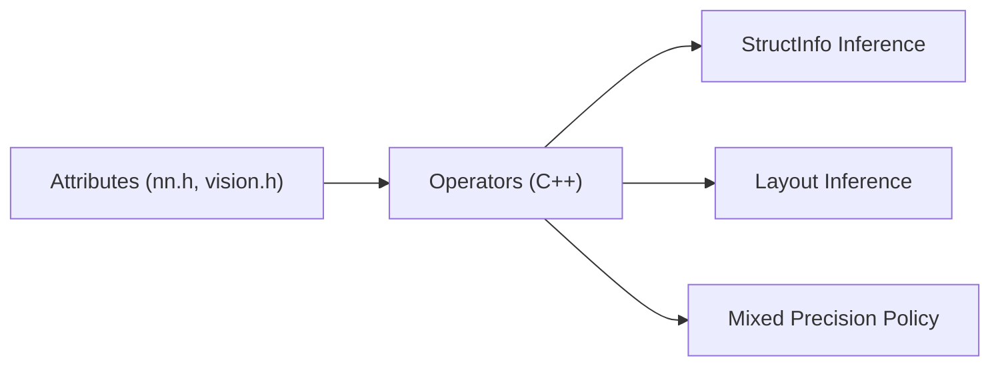

# Neural Network Operators

<cite>
**Referenced Files in This Document**
- [convolution.cc](file://src/relax/op/nn/convolution.cc)
- [pooling.cc](file://src/relax/op/nn/pooling.cc)
- [attention.cc](file://src/relax/op/nn/attention.cc)
- [nn.h](file://include/tvm/relax/attrs/nn.h)
- [vision.h](file://include/tvm/relax/attrs/vision.h)
- [nms.cc](file://src/relax/op/vision/nms.cc)
- [roi_pool.cc](file://src/relax/op/vision/roi_pool.cc)
- [multibox_transform_loc.cc](file://src/relax/op/vision/multibox_transform_loc.cc)
- [__init__.py (nn)](file://python/tvm/relax/op/nn/__init__.py)
- [__init__.py (vision)](file://python/tvm/relax/op/vision/__init__.py)
</cite>

## Table of Contents
1. [Introduction](#introduction)
2. [Project Structure](#project-structure)
3. [Core Components](#core-components)
4. [Architecture Overview](#architecture-overview)
5. [Detailed Component Analysis](#detailed-component-analysis)
6. [Dependency Analysis](#dependency-analysis)
7. [Performance Considerations](#performance-considerations)
8. [Troubleshooting Guide](#troubleshooting-guide)
9. [Conclusion](#conclusion)

## Introduction
This document describes Relax neural network operators implemented in the TVM codebase. It covers convolution operations (conv1d, conv2d, conv3d and transposed variants), pooling operations (max_pool, avg_pool, adaptive_pool), normalization operations (batch_norm, layer_norm, group_norm), activation functions (relu, sigmoid, tanh, gelu), attention mechanisms, and vision-specific operations (ROI pooling, NMS, multi-box detection). For each operator family, we explain parameters, padding modes, stride configurations, and output shape computation. Practical examples from common neural network architectures and optimization strategies for different hardware targets are included.

## Project Structure
Relax operators are defined in C++ with structured attributes in header files and exposed via Python bindings. The core operator implementations live under src/relax/op/nn and src/relax/op/vision, with attributes defined in include/tvm/relax/attrs.

**Diagram sources**
- [nn.h:32-168](file://include/tvm/relax/attrs/nn.h#L32-L168)
- [vision.h:51-174](file://include/tvm/relax/attrs/vision.h#L51-L174)
- [convolution.cc:43-594](file://src/relax/op/nn/convolution.cc#L43-L594)
- [pooling.cc:39-789](file://src/relax/op/nn/pooling.cc#L39-L789)
- [attention.cc:31-193](file://src/relax/op/nn/attention.cc#L31-L193)
- [nms.cc:43-357](file://src/relax/op/vision/nms.cc#L43-L357)
- [roi_pool.cc:36-129](file://src/relax/op/vision/roi_pool.cc#L36-L129)
- [multibox_transform_loc.cc:37-205](file://src/relax/op/vision/multibox_transform_loc.cc#L37-L205)
- [__init__.py (nn):20-62](file://python/tvm/relax/op/nn/__init__.py#L20-L62)
- [__init__.py (vision):20-24](file://python/tvm/relax/op/vision/__init__.py#L20-L24)

**Section sources**
- [nn.h:32-168](file://include/tvm/relax/attrs/nn.h#L32-L168)
- [vision.h:51-174](file://include/tvm/relax/attrs/vision.h#L51-L174)
- [convolution.cc:43-594](file://src/relax/op/nn/convolution.cc#L43-L594)
- [pooling.cc:39-789](file://src/relax/op/nn/pooling.cc#L39-L789)
- [attention.cc:31-193](file://src/relax/op/nn/attention.cc#L31-L193)
- [nms.cc:43-357](file://src/relax/op/vision/nms.cc#L43-L357)
- [roi_pool.cc:36-129](file://src/relax/op/vision/roi_pool.cc#L36-L129)
- [multibox_transform_loc.cc:37-205](file://src/relax/op/vision/multibox_transform_loc.cc#L37-L205)
- [__init__.py (nn):20-62](file://python/tvm/relax/op/nn/__init__.py#L20-L62)
- [__init__.py (vision):20-24](file://python/tvm/relax/op/vision/__init__.py#L20-L24)

## Core Components
- Convolution families: conv1d, conv2d, conv3d, conv1d_transpose, conv2d_transpose, conv3d_transpose. Parameters include strides, padding, dilation, groups, data/kernel/out layouts, and optional explicit output dtype.
- Pooling families: max_pool1d/2d/3d, avg_pool1d/2d/3d, adaptive_avg_pool1d/2d/3d. Parameters include pool_size, strides, padding, dilation, ceil_mode, count_include_pad, and layout.
- Normalization: batch_norm, layer_norm, group_norm, instance_norm, rms_norm. Parameters include axis/channel axes, epsilon, center/scale flags, and group counts.
- Activations: relu, sigmoid, tanh, gelu, leakyrelu, prelu, softplus, softmax, log_softmax, silu, relu6, selu.
- Attention: attention, attention_bias, attention_var_len. Parameters include scale, causal_mask type, window_size, and optional bias.
- Vision: roi_pool, roi_align, non_max_suppression, all_class_non_max_suppression, get_valid_counts, multibox_transform_loc. Parameters include pooled_size, spatial_scale, mode, thresholds, variances, and output formats.

**Section sources**
- [convolution.cc:43-594](file://src/relax/op/nn/convolution.cc#L43-L594)
- [pooling.cc:39-789](file://src/relax/op/nn/pooling.cc#L39-L789)
- [attention.cc:31-193](file://src/relax/op/nn/attention.cc#L31-L193)
- [nn.h:576-744](file://include/tvm/relax/attrs/nn.h#L576-L744)
- [vision.h:51-174](file://include/tvm/relax/attrs/vision.h#L51-L174)
- [nms.cc:43-357](file://src/relax/op/vision/nms.cc#L43-L357)
- [roi_pool.cc:36-129](file://src/relax/op/vision/roi_pool.cc#L36-L129)
- [multibox_transform_loc.cc:37-205](file://src/relax/op/vision/multibox_transform_loc.cc#L37-L205)

## Architecture Overview
The Relax operator system composes:
- Attribute structs define operator parameters and are registered for reflection.
- Operator factories construct typed Calls with validated attributes.
- Struct info inference computes output shapes and dtypes.
- Layout inference decides data/kernel/output layouts.
- Mixed precision policy controls dtype promotion.

**Diagram sources**
- [convolution.cc:208-233](file://src/relax/op/nn/convolution.cc#L208-L233)
- [nn.h:76-120](file://include/tvm/relax/attrs/nn.h#L76-L120)
- [pooling.cc:155-190](file://src/relax/op/nn/pooling.cc#L155-L190)
- [vision.h:51-91](file://include/tvm/relax/attrs/vision.h#L51-L91)

## Detailed Component Analysis

### Convolution Operations
- conv1d, conv2d, conv3d: Support strides, padding (symmetric/asymmetric), dilation, groups, data/kernel/out layouts, and out_dtype. Output shape computed from input, kernel, padding, dilation, and stride.
- conv1d_transpose, conv2d_transpose, conv3d_transpose: Additional output_padding to disambiguate output shape; validates constraints on groups and strides vs. output_padding.

**Diagram sources**
- [convolution.cc:208-316](file://src/relax/op/nn/convolution.cc#L208-L316)
- [nn.h:76-120](file://include/tvm/relax/attrs/nn.h#L76-L120)

**Section sources**
- [convolution.cc:43-594](file://src/relax/op/nn/convolution.cc#L43-L594)
- [nn.h:32-168](file://include/tvm/relax/attrs/nn.h#L32-L168)

### Pooling Operations
- max_pool1d/2d/3d, avg_pool1d/2d/3d: pool_size, strides, padding, dilation, ceil_mode, count_include_pad, layout. Output shape computed similarly to convolution with optional ceil_mode adjustments.
- adaptive_avg_pool1d/2d/3d: output_size controls output spatial dimensions; otherwise preserves input shape semantics.

**Diagram sources**
- [pooling.cc:155-258](file://src/relax/op/nn/pooling.cc#L155-L258)
- [nn.h:363-447](file://include/tvm/relax/attrs/nn.h#L363-L447)

**Section sources**
- [pooling.cc:39-789](file://src/relax/op/nn/pooling.cc#L39-L789)
- [nn.h:322-522](file://include/tvm/relax/attrs/nn.h#L322-L522)

### Normalization Operations
- batch_norm: axis, epsilon, center, scale, momentum, training flag.
- layer_norm: axes, epsilon, center, scale.
- group_norm: num_groups, channel_axis, axes, epsilon, center, scale.
- instance_norm: channel_axis, axes, epsilon, center, scale.
- rms_norm: axes, epsilon.

**Diagram sources**
- [nn.h:576-694](file://include/tvm/relax/attrs/nn.h#L576-L694)

**Section sources**
- [nn.h:576-694](file://include/tvm/relax/attrs/nn.h#L576-L694)

### Activation Functions
Common activations include relu, sigmoid, tanh, gelu, leakyrelu, prelu, softplus, softmax, log_softmax, silu, relu6, selu. These are exposed via Python bindings and participate in mixed precision policies where applicable.

**Section sources**
- [__init__.py (nn):20-62](file://python/tvm/relax/op/nn/__init__.py#L20-L62)

### Attention Mechanisms
- attention(query, key, value, optional bias, scale, causal_mask, window_size)
- attention_var_len(query, key, value, seqstart_q, seqstart_k, max_seqlen_q, max_seqlen_k, scale, causal_mask, window_size)

Shape inference enforces 4D shapes [B, S, H, D] for Q/K/V and optional bias broadcasting rules.

**Diagram sources**
- [attention.cc:31-193](file://src/relax/op/nn/attention.cc#L31-L193)
- [nn.h:726-744](file://include/tvm/relax/attrs/nn.h#L726-L744)

**Section sources**
- [attention.cc:31-193](file://src/relax/op/nn/attention.cc#L31-L193)
- [nn.h:726-744](file://include/tvm/relax/attrs/nn.h#L726-L744)

### Vision-Specific Operations

#### ROI Pooling
- roi_pool(data, rois, pooled_size, spatial_scale, layout)
- Supports NCHW layout; output shape is [num_rois, C, pooled_h, pooled_w].

**Diagram sources**
- [roi_pool.cc:36-129](file://src/relax/op/vision/roi_pool.cc#L36-L129)
- [vision.h:76-91](file://include/tvm/relax/attrs/vision.h#L76-L91)

**Section sources**
- [roi_pool.cc:36-129](file://src/relax/op/vision/roi_pool.cc#L36-L129)
- [vision.h:76-91](file://include/tvm/relax/attrs/vision.h#L76-L91)

#### Non-Max Suppression (NMS)
- non_max_suppression(data, valid_count, indices, max_output_size, iou_threshold, force_suppress, top_k, coord_start, score_index, id_index, return_indices, invalid_to_bottom)
- all_class_non_max_suppression(boxes, scores, max_output_boxes_per_class, iou_threshold, score_threshold, output_format)
- get_valid_counts(data, score_threshold, id_index, score_index)

**Diagram sources**
- [nms.cc:195-357](file://src/relax/op/vision/nms.cc#L195-L357)
- [vision.h:113-150](file://include/tvm/relax/attrs/vision.h#L113-L150)

**Section sources**
- [nms.cc:43-357](file://src/relax/op/vision/nms.cc#L43-L357)
- [vision.h:35-150](file://include/tvm/relax/attrs/vision.h#L35-L150)

#### Multi-Box Detection (SSD-style)
- multibox_transform_loc(cls_pred, loc_pred, anchor, clip, threshold, variances, keep_background)
- Decodes class logits and location encodings into boxes and scores; validates shapes and variances length.

**Diagram sources**
- [multibox_transform_loc.cc:37-205](file://src/relax/op/vision/multibox_transform_loc.cc#L37-L205)
- [vision.h:152-174](file://include/tvm/relax/attrs/vision.h#L152-L174)

**Section sources**
- [multibox_transform_loc.cc:37-205](file://src/relax/op/vision/multibox_transform_loc.cc#L37-L205)
- [vision.h:152-174](file://include/tvm/relax/attrs/vision.h#L152-L174)

## Dependency Analysis
- Operators depend on attribute structs for parameter validation and reflection.
- Struct info inference depends on layout transformations and analyzer arithmetic.
- Layout inference propagates or transforms layouts consistently across inputs and outputs.
- Mixed precision policies are attached to operators to control dtype promotion.

**Diagram sources**
- [nn.h:32-744](file://include/tvm/relax/attrs/nn.h#L32-L744)
- [vision.h:35-174](file://include/tvm/relax/attrs/vision.h#L35-L174)
- [convolution.cc:43-594](file://src/relax/op/nn/convolution.cc#L43-L594)
- [pooling.cc:39-789](file://src/relax/op/nn/pooling.cc#L39-L789)
- [attention.cc:31-193](file://src/relax/op/nn/attention.cc#L31-L193)
- [nms.cc:43-357](file://src/relax/op/vision/nms.cc#L43-L357)
- [roi_pool.cc:36-129](file://src/relax/op/vision/roi_pool.cc#L36-L129)
- [multibox_transform_loc.cc:37-205](file://src/relax/op/vision/multibox_transform_loc.cc#L37-L205)

**Section sources**
- [convolution.cc:43-594](file://src/relax/op/nn/convolution.cc#L43-L594)
- [pooling.cc:39-789](file://src/relax/op/nn/pooling.cc#L39-L789)
- [attention.cc:31-193](file://src/relax/op/nn/attention.cc#L31-L193)
- [nms.cc:43-357](file://src/relax/op/vision/nms.cc#L43-L357)
- [roi_pool.cc:36-129](file://src/relax/op/vision/roi_pool.cc#L36-L129)
- [multibox_transform_loc.cc:37-205](file://src/relax/op/vision/multibox_transform_loc.cc#L37-L205)

## Performance Considerations
- Mixed precision: Many operators declare TMixedPrecisionPolicy to enable dtype promotion for throughput. Use explicit out_dtype to control accumulation types in convolutions.
- Layout selection: InferLayout passes propagate or transform layouts to favor hardware-friendly formats (e.g., NCHW). Prefer desired layouts when known to reduce implicit transposes.
- Padding and stride tuning: Choose padding modes and stride configurations to minimize boundary effects and maximize FLOPs/cycle utilization.
- Hardware-specific kernels: Operators integrate with backend kernels; ensure target configuration matches operator layout and dtype expectations.

[No sources needed since this section provides general guidance]

## Troubleshooting Guide
- Shape mismatches: Struct info inference reports detailed diagnostics when shapes violate constraints (e.g., groups, channel divisibility, layout dimensions).
- Parameter validation: ICHECK statements enforce constraints (e.g., groups > 0, strides/dilation sizes, output_padding < stride).
- Layout errors: Layout inference rejects incompatible desired layouts or unsupported transforms.
- NMS parameter ranges: Indices and coordinate ranges are validated; mismatched shapes between inputs cause explicit diagnostics.

**Section sources**
- [convolution.cc:51-126](file://src/relax/op/nn/convolution.cc#L51-L126)
- [pooling.cc:47-121](file://src/relax/op/nn/pooling.cc#L47-L121)
- [nms.cc:135-343](file://src/relax/op/vision/nms.cc#L135-L343)

## Conclusion
Relax provides a comprehensive set of neural network operators with robust parameter validation, precise shape inference, layout propagation, and mixed precision support. The documented families cover mainstream CNN ops, normalization, activations, attention, and vision tasks. Correctly configuring parameters such as padding, stride, groups, and layouts enables efficient execution across diverse hardware targets.