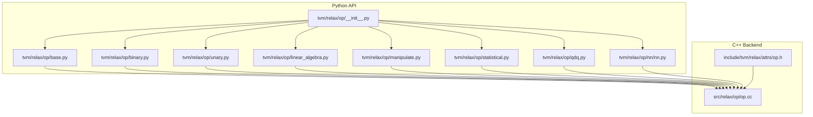
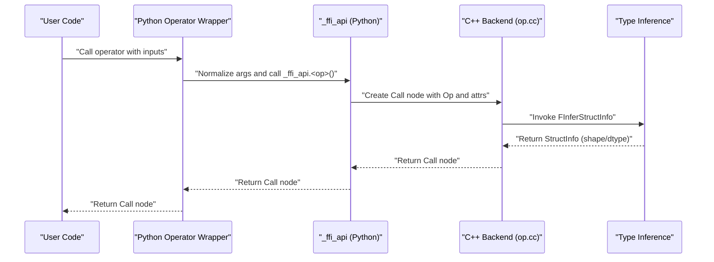
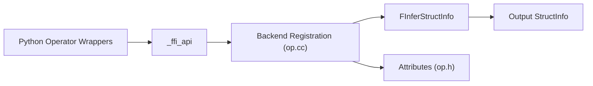

# Operator Library

<cite>
**Referenced Files in This Document**
- [__init__.py](file://python/tvm/relax/op/__init__.py)
- [base.py](file://python/tvm/relax/op/base.py)
- [binary.py](file://python/tvm/relax/op/binary.py)
- [unary.py](file://python/tvm/relax/op/unary.py)
- [linear_algebra.py](file://python/tvm/relax/op/linear_algebra.py)
- [manipulate.py](file://python/tvm/relax/op/manipulate.py)
- [statistical.py](file://python/tvm/relax/op/statistical.py)
- [qdq.py](file://python/tvm/relax/op/qdq.py)
- [nn.py](file://python/tvm/relax/op/nn/nn.py)
- [op.cc](file://src/relax/op/op.cc)
- [op.h](file://include/tvm/relax/attrs/op.h)
</cite>

## Table of Contents
1. [Introduction](#introduction)
2. [Project Structure](#project-structure)
3. [Core Components](#core-components)
4. [Architecture Overview](#architecture-overview)
5. [Detailed Component Analysis](#detailed-component-analysis)
6. [Dependency Analysis](#dependency-analysis)
7. [Performance Considerations](#performance-considerations)
8. [Troubleshooting Guide](#troubleshooting-guide)
9. [Conclusion](#conclusion)
10. [Appendices](#appendices)

## Introduction
This document describes the Relax operator library system in the TVM ecosystem. It explains how operators are organized into categories (arithmetic, logical, neural network, linear algebra, statistical, data manipulation, and quantization/dequantization), how operators are constructed and validated, how type inference works, and how built-in and framework-specific mappings are handled. It also covers operator attributes, broadcasting rules, performance characteristics, and fusion opportunities.

## Project Structure
The Relax operator library is exposed via a Python package that aggregates numerous operator modules. Operators are grouped by domain (e.g., binary, unary, linear_algebra, manipulate, statistical, qdq, nn) and are imported into a central namespace for convenient usage.

**Diagram sources**
- [__init__.py:21-179](file://python/tvm/relax/op/__init__.py#L21-L179)
- [base.py:1-889](file://python/tvm/relax/op/base.py#L1-L889)
- [binary.py:1-467](file://python/tvm/relax/op/binary.py#L1-L467)
- [unary.py:1-618](file://python/tvm/relax/op/unary.py#L1-L618)
- [linear_algebra.py:1-140](file://python/tvm/relax/op/linear_algebra.py#L1-L140)
- [manipulate.py:1-871](file://python/tvm/relax/op/manipulate.py#L1-L871)
- [statistical.py:1-371](file://python/tvm/relax/op/statistical.py#L1-L371)
- [qdq.py:1-89](file://python/tvm/relax/op/qdq.py#L1-L89)
- [nn.py:1-2372](file://python/tvm/relax/op/nn/nn.py#L1-L2372)
- [op.cc:1-1615](file://src/relax/op/op.cc#L1-L1615)
- [op.h:1-125](file://include/tvm/relax/attrs/op.h#L1-L125)

**Section sources**
- [__init__.py:21-179](file://python/tvm/relax/op/__init__.py#L21-L179)

## Core Components
- Operator namespace: The central import aggregator exposes all operators and related utilities.
- Base operators: Core primitives such as call_tir, call_pure_packed, call_inplace_packed, call_dps_packed, call_tir_with_grad, and auxiliary ops like shape_of, size, tensor_to_shape, shape_to_tensor, assert_op, print, and device hints.
- Arithmetic/logical operators: Binary arithmetic and comparison operators; unary arithmetic and transcendental operators.
- Linear algebra: Matrix multiplication, linear transformation, einsum, outer product.
- Data manipulation: Broadcasting, concatenation, reshaping, permutation, layout transforms, and more.
- Statistical: Reductions (sum, mean, prod, min, max, std, var, cumsum, cumprod) and related operations.
- Quantization/dequantization: Quantize and dequantize with per-channel support.
- Neural networks: Convolution variants (1D/2D/3D), pooling, normalization, and attention helpers.

These components are wired together so that Python-side operator wrappers delegate to a compiled backend via an FFI API, enabling efficient execution and type-safe composition.

**Section sources**
- [__init__.py:24-167](file://python/tvm/relax/op/__init__.py#L24-L167)
- [base.py:94-800](file://python/tvm/relax/op/base.py#L94-L800)
- [binary.py:26-186](file://python/tvm/relax/op/binary.py#L26-L186)
- [unary.py:27-192](file://python/tvm/relax/op/unary.py#L27-L192)
- [linear_algebra.py:28-140](file://python/tvm/relax/op/linear_algebra.py#L28-L140)
- [manipulate.py:31-200](file://python/tvm/relax/op/manipulate.py#L31-L200)
- [statistical.py:26-192](file://python/tvm/relax/op/statistical.py#L26-L192)
- [qdq.py:23-89](file://python/tvm/relax/op/qdq.py#L23-L89)
- [nn.py:26-200](file://python/tvm/relax/op/nn/nn.py#L26-L200)

## Architecture Overview
The operator architecture consists of:
- Python operator wrappers that normalize inputs and construct Call nodes.
- A backend registration system that binds operator names to implementations and type inference functions.
- Attribute types that define operator-specific metadata (e.g., inplace indices, device hints).
- StructInfo-based type inference that derives shapes and dtypes for outputs.

**Diagram sources**
- [base.py:94-133](file://python/tvm/relax/op/base.py#L94-L133)
- [op.cc:115-136](file://src/relax/op/op.cc#L115-L136)
- [op.h:33-119](file://include/tvm/relax/attrs/op.h#L33-L119)

## Detailed Component Analysis

### Base Operators
Base operators provide foundational constructs for calling into TIR primfuncs, packed functions, and Python functions, as well as device hints and assertions.

Key capabilities:
- call_tir: Calls a TIR PrimFunc with explicit output structure info and optional symbolic vars.
- call_tir_with_grad: Binds a TE gradient function name and kwargs to enable autodiff.
- call_tir_inplace: Performs in-place computation with aliasing constraints.
- call_pure_packed and call_inplace_packed: Treat packed function calls as pure or in-place pure.
- call_dps_packed: Destination-passing-style packed function invocation.
- call_py_func: Calls a registered Python function.
- Device hints: to_vdevice and hint_on_device attributes.
- Utilities: shape_of, size, tensor_to_shape, shape_to_tensor, assert_op, print.

Implementation highlights:
- Argument normalization ensures tuples are wrapped and out_sinfo is a list.
- In-place variants validate indices and enforce uniqueness and non-empty selection.
- StructInfo inference for packed calls validates function purity and opaqueness.

**Section sources**
- [base.py:94-800](file://python/tvm/relax/op/base.py#L94-L800)
- [op.cc:115-200](file://src/relax/op/op.cc#L115-L200)
- [op.h:33-119](file://include/tvm/relax/attrs/op.h#L33-L119)

### Arithmetic and Logical Operators
Arithmetic operators include addition, subtraction, multiplication, division, floor division, modulo, floor_mod, power, and log-add-exp. Logical and comparison operators include equality, inequality, greater-than, less-than, and logical operations (and, or, xor, not).

- Broadcasting: All binary ops follow numpy-style broadcasting rules.
- Parameter validation: Inputs are normalized to expressions; shapes are inferred via StructInfo.
- Examples: The binary module includes usage examples demonstrating broadcasting behavior.

**Section sources**
- [binary.py:26-186](file://python/tvm/relax/op/binary.py#L26-L186)
- [unary.py:27-192](file://python/tvm/relax/op/unary.py#L27-L192)

### Linear Algebra Operators
Linear algebra includes:
- matmul: General matrix multiplication with batch broadcasting rules.
- linear: Fully connected layer implemented as matmul + bias.
- einsum: Einstein summation over multiple operands.
- outer: Outer product of two vectors.

Behavior:
- Output dtype can be optionally specified; otherwise inferred from inputs.
- linear internally composes matmul and permute_dims.

**Section sources**
- [linear_algebra.py:28-140](file://python/tvm/relax/op/linear_algebra.py#L28-L140)

### Data Manipulation Operators
Manipulation operators include:
- Broadcasting: broadcast_to with explicit target shape.
- Concatenation: concat over an axis or flattened concatenation.
- Reshaping and dimensionality: flatten, reshape, expand_dims, squeeze.
- Permutation and layout: permute_dims, layout_transform with index maps and optional padding.
- Slicing and advanced indexing: strided_slice, dynamic_strided_slice, take, gather_* and scatter_* variants.
- Tiling and repetition: tile, repeat.
- Set operations: unique, nonzero.
- Meshgrid and one-hot encoding: meshgrid, one_hot.

Notes:
- layout_transform supports callable or IndexMap-based transformations and optional axis separators.
- Shape inference preserves structural information via StructInfo.

**Section sources**
- [manipulate.py:31-200](file://python/tvm/relax/op/manipulate.py#L31-L200)

### Statistical Operators
Statistical reductions include:
- sum, mean, prod, min, max, std, variance, median
- cumsum, cumprod with optional axis, dtype, and exclusive flag

Behavior:
- axis can be an int or list of ints; None implies reduction over all axes.
- keepdims controls whether reduced axes remain as size-one dimensions for broadcasting.

**Section sources**
- [statistical.py:26-192](file://python/tvm/relax/op/statistical.py#L26-L192)

### Quantization and Dequantization
Quantization/dequantization operators:
- quantize: Applies scale, zero_point, and clamps to produce quantized output with configurable axis.
- dequantize: Converts quantized data back to floating-point using scale and zero_point.

Usage:
- axis parameter selects the channel dimension for per-channel quantization.
- Output dtype can be configured (e.g., int8 for quantized output, float32 for dequantized output).

**Section sources**
- [qdq.py:23-89](file://python/tvm/relax/op/qdq.py#L23-L89)

### Neural Network Operators
Neural network operators include:
- conv1d, conv2d, conv3d: Configurable strides, padding, dilation, groups, layouts, and out_dtype.
- Pooling, normalization, and attention helpers are available in the nn module.

Layout and precision:
- Accepts flexible data/kernel layouts and converts to canonical forms internally.
- out_dtype enables mixed-precision execution.

**Section sources**
- [nn.py:26-200](file://python/tvm/relax/op/nn/nn.py#L26-L200)

### Operator Construction, Parameter Validation, and Type Inference
Construction:
- Python wrappers normalize arguments and construct Call nodes.
- Out structure info is provided to guide output shapes and dtypes.

Validation:
- In-place packed and call_tir_inplace validate indices for uniqueness and bounds.
- call_pure_packed and call_inplace_packed require opaque function targets and at least one non-skipped output.

Type inference:
- StructInfo functions derive output structure from inputs and attributes.
- Specialized inference handles shape_of, packed calls, and device hints.

Attributes:
- call_tir_with_grad: associates a TE gradient function name and kwargs.
- call_tir_inplace and call_inplace_packed: specify which inputs alias outputs.
- to_vdevice and hint_on_device: specify destination device and memory scope.

**Section sources**
- [base.py:94-800](file://python/tvm/relax/op/base.py#L94-L800)
- [op.cc:88-200](file://src/relax/op/op.cc#L88-L200)
- [op.h:33-119](file://include/tvm/relax/attrs/op.h#L33-L119)

### Broadcasting Rules
Broadcasting is applied consistently across binary arithmetic and comparison operators. The rules align with numpy-style broadcasting semantics, ensuring that arrays with different shapes can be combined according to alignment of trailing dimensions.

**Section sources**
- [binary.py:26-186](file://python/tvm/relax/op/binary.py#L26-L186)

### Built-in and Framework-Specific Operator Mappings
- call_pure_packed and call_inplace_packed: Bind to opaque PackedFuncs and treat them as pure or in-place pure.
- call_dps_packed: Supports destination-passing-style packed functions.
- call_py_func: Bridges Python functions into Relax IR.
- call_tir and call_tir_with_grad: Bridge to TIR PrimFuncs and integrate with autodiff.

These mappings are registered in the backend and enforced by StructInfo inference and attribute validation.

**Section sources**
- [base.py:263-337](file://python/tvm/relax/op/base.py#L263-L337)
- [op.cc:115-200](file://src/relax/op/op.cc#L115-L200)

### Operator Fusion Opportunities and Optimization Strategies
- In-place computation: call_tir_inplace and call_inplace_packed enable memory reuse by aliasing outputs to inputs, reducing allocations and copies.
- Pure packed calls: call_pure_packed allows aggressive compiler optimizations (reordering, elimination) under the assumption of purity.
- Layout transforms: layout_transform with IndexMap enables efficient kernels by avoiding explicit copies.
- Reduction fusion: Statistical operators (sum, mean, prod, min, max, std, variance, cumsum, cumprod) can be fused with preceding computations to reduce intermediate storage.
- Quantization/dequantization: Quantize/dequantize can be fused with preceding/backward operators to minimize bandwidth and leverage quantized kernels.

[No sources needed since this section provides general guidance]

## Dependency Analysis
The operator library exhibits a layered dependency model:
- Python operator modules depend on _ffi_api to construct Call nodes.
- Backend registration binds operator names to implementations and inference functions.
- Attribute types define operator-specific metadata.
- StructInfo inference ensures type safety and shape correctness.

**Diagram sources**
- [base.py:94-133](file://python/tvm/relax/op/base.py#L94-L133)
- [op.cc:115-200](file://src/relax/op/op.cc#L115-L200)
- [op.h:33-119](file://include/tvm/relax/attrs/op.h#L33-L119)

**Section sources**
- [op.cc:115-200](file://src/relax/op/op.cc#L115-L200)

## Performance Considerations
- Prefer in-place operations where safe to reduce memory traffic and allocations.
- Use layout_transform with IndexMap to avoid unnecessary copies and align with kernel-friendly layouts.
- Fuse reductions with upstream computations to minimize intermediate tensors.
- Leverage mixed precision via out_dtype in convolution and linear layers.
- Quantize/dequantize strategically to reduce bandwidth and enable quantized kernels.

[No sources needed since this section provides general guidance]

## Troubleshooting Guide
Common issues and remedies:
- Invalid in-place indices: Ensure indices are unique, within bounds, and at least one is not skipped (-1).
- Packed call purity: call_pure_packed and call_inplace_packed require opaque functions; otherwise, inference will fail.
- Shape mismatches: Verify broadcasting compatibility for binary ops and correct axis specifications for reductions and manipulations.
- Device placement: Use to_vdevice and hint_on_device attributes to ensure proper device allocation and memory scope.

**Section sources**
- [op.cc:140-200](file://src/relax/op/op.cc#L140-L200)
- [op.h:91-119](file://include/tvm/relax/attrs/op.h#L91-L119)

## Conclusion
The Relax operator library offers a comprehensive, type-safe, and extensible set of operators spanning arithmetic, logical, linear algebra, statistical, data manipulation, and quantization domains. Its design emphasizes structured inference, attribute-driven semantics, and efficient backend integration, enabling robust model authoring and optimization.

## Appendices

### Example Usage Patterns
- Binary arithmetic with broadcasting:
  - Use add, multiply, subtract, divide with numpy-style broadcasting semantics.
- Linear algebra:
  - Use matmul for general matrix multiplication; compose with permute_dims and bias for linear layers.
- Data manipulation:
  - Use reshape, permute_dims, layout_transform to prepare inputs for kernels.
- Statistical reductions:
  - Use sum, mean, std with axis and keepdims to control output shapes.
- Quantization/dequantization:
  - Use quantize and dequantize with appropriate axis and out_dtype for per-channel quantization.
- Neural networks:
  - Use conv1d/conv2d with strides, padding, dilation, groups, and layout parameters.

[No sources needed since this section summarizes usage patterns without quoting specific files]