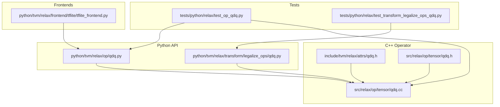
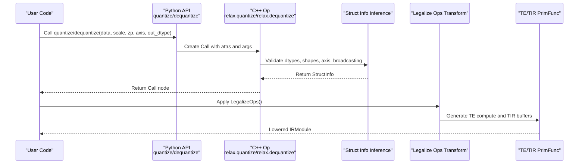
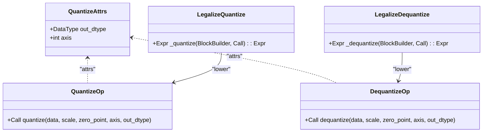
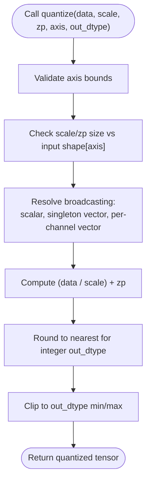
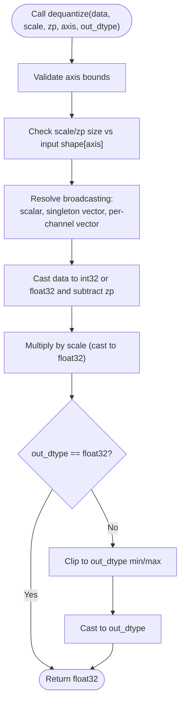
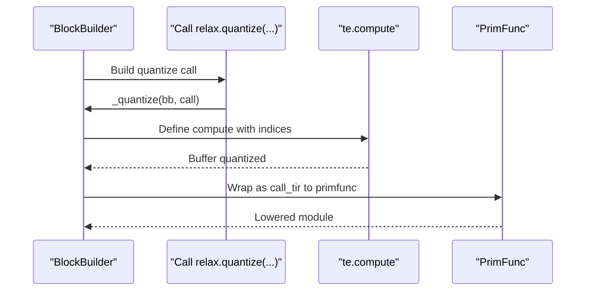
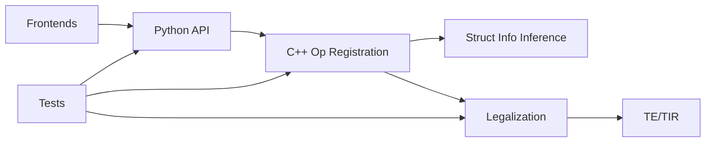

# Quantization Operators

<cite>
**Referenced Files in This Document**
- [qdq.py](file://python/tvm/relax/op/qdq.py)
- [qdq.py](file://python/tvm/relax/transform/legalize_ops/qdq.py)
- [qdq.h](file://include/tvm/relax/attrs/qdq.h)
- [qdq.cc](file://src/relax/op/tensor/qdq.cc)
- [qdq.h](file://src/relax/op/tensor/qdq.h)
- [test_op_qdq.py](file://tests/python/relax/test_op_qdq.py)
- [test_transform_legalize_ops_qdq.py](file://tests/python/relax/test_transform_legalize_ops_qdq.py)
- [tflite_frontend.py](file://python/tvm/relax/frontend/tflite/tflite_frontend.py)
- [relax_to_pyfunc_converter.py](file://python/tvm/relax/relax_to_pyfunc_converter.py)
- [dlpack.h](file://3rdparty/tvm-ffi/3rdparty/dlpack/include/dlpack/dlpack.h)
</cite>

## Table of Contents
1. [Introduction](#introduction)
2. [Project Structure](#project-structure)
3. [Core Components](#core-components)
4. [Architecture Overview](#architecture-overview)
5. [Detailed Component Analysis](#detailed-component-analysis)
6. [Dependency Analysis](#dependency-analysis)
7. [Performance Considerations](#performance-considerations)
8. [Troubleshooting Guide](#troubleshooting-guide)
9. [Conclusion](#conclusion)
10. [Appendices](#appendices)

## Introduction
This document explains Relax quantization and dequantization operators, focusing on:
- Quantization operations: quantize, quantize_per_tensor, quantize_per_channel
- Dequantization operations: dequantize, dequantize_per_tensor, dequantize_per_channel
- Quantization calibration utilities and workflows
- Quantization schemes, scale and zero-point parameters, and supported data types (int4, int8, uint4, etc.)
- Post-training quantization workflows, quantization-aware training integration, and deployment considerations
- Performance benefits and accuracy trade-offs

It synthesizes the Python API, C++ operator definitions, struct info inference, and lowering logic, and connects them to end-to-end test coverage and frontend integrations.

## Project Structure
The quantization stack spans Python APIs, C++ operator definitions, struct info inference, and lowering transforms:
- Python API exposes quantize and dequantize with parameters for scale, zero_point, axis, and out_dtype.
- C++ operator registration defines attributes, argument metadata, and struct info inference rules.
- Legalization transforms lower quantize/dequantize into TE/TIR computations.
- Tests validate correctness, struct info inference, and lowering behavior.
- Frontends integrate quantization into model conversion pipelines.

**Diagram sources**
- [qdq.py:23-88](file://python/tvm/relax/op/qdq.py#L23-L88)
- [qdq.py:51-160](file://python/tvm/relax/transform/legalize_ops/qdq.py#L51-L160)
- [qdq.h:32-47](file://include/tvm/relax/attrs/qdq.h#L32-L47)
- [qdq.cc:41-245](file://src/relax/op/tensor/qdq.cc#L41-L245)
- [qdq.h:43-56](file://src/relax/op/tensor/qdq.h#L43-L56)
- [test_op_qdq.py:24-68](file://tests/python/relax/test_op_qdq.py#L24-L68)
- [test_transform_legalize_ops_qdq.py:37-244](file://tests/python/relax/test_transform_legalize_ops_qdq.py#L37-L244)
- [tflite_frontend.py:547-578](file://python/tvm/relax/frontend/tflite/tflite_frontend.py#L547-L578)

**Section sources**
- [qdq.py:23-88](file://python/tvm/relax/op/qdq.py#L23-L88)
- [qdq.py:51-160](file://python/tvm/relax/transform/legalize_ops/qdq.py#L51-L160)
- [qdq.h:32-47](file://include/tvm/relax/attrs/qdq.h#L32-L47)
- [qdq.cc:41-245](file://src/relax/op/tensor/qdq.cc#L41-L245)
- [qdq.h:43-56](file://src/relax/op/tensor/qdq.h#L43-L56)
- [test_op_qdq.py:24-68](file://tests/python/relax/test_op_qdq.py#L24-L68)
- [test_transform_legalize_ops_qdq.py:37-244](file://tests/python/relax/test_transform_legalize_ops_qdq.py#L37-L244)
- [tflite_frontend.py:547-578](file://python/tvm/relax/frontend/tflite/tflite_frontend.py#L547-L578)

## Core Components
- Python quantize/dequantize API: Provides function signatures and docstrings for quantization and dequantization with scale, zero_point, axis, and out_dtype.
- C++ operator definitions: Define Relax ops, attributes, arguments, and struct info inference rules.
- Legalization transforms: Lower quantize/dequantize into TE compute and TIR buffers.
- Struct info inference: Validates dtypes, shapes, axis ranges, and parameter broadcasting semantics.
- Frontend integration: Converts frontend quantized tensors to Relax quantize/dequantize ops.

Key capabilities:
- Per-tensor and per-channel quantization via axis selection and parameter broadcasting.
- Support for float16/float32 scales, int8/uint8/... zero_points, and output dtypes including int8/int16/uint8/uint16 and float8 variants.
- Axis validation and shape checks ensure scale/zp sizes match the selected channel dimension.

**Section sources**
- [qdq.py:23-88](file://python/tvm/relax/op/qdq.py#L23-L88)
- [qdq.cc:54-131](file://src/relax/op/tensor/qdq.cc#L54-L131)
- [qdq.cc:157-236](file://src/relax/op/tensor/qdq.cc#L157-L236)
- [qdq.py:51-160](file://python/tvm/relax/transform/legalize_ops/qdq.py#L51-L160)
- [qdq.h:32-47](file://include/tvm/relax/attrs/qdq.h#L32-L47)

## Architecture Overview
The quantization pipeline consists of:
- Python API layer exposing quantize/dequantize.
- Operator registration and struct info inference in C++.
- Legalization transforms converting ops to TE/TIR.
- Runtime lowering and execution.

**Diagram sources**
- [qdq.py:23-88](file://python/tvm/relax/op/qdq.py#L23-L88)
- [qdq.cc:133-140](file://src/relax/op/tensor/qdq.cc#L133-L140)
- [qdq.cc:238-245](file://src/relax/op/tensor/qdq.cc#L238-L245)
- [qdq.py:51-160](file://python/tvm/relax/transform/legalize_ops/qdq.py#L51-L160)

## Detailed Component Analysis

### Python API: quantize and dequantize
- quantize(data, scale, zero_point, axis=-1, out_dtype="int8"): Produces quantized output with rounding and clipping to out_dtype.
- dequantize(data, scale, zero_point, axis=-1, out_dtype="float32"): Recovers float values via scale multiplication and zero_point subtraction.

Behavior highlights:
- Axis controls channel-wise quantization/dequantization.
- out_dtype determines output dtype and clipping boundaries.
- Scale and zero_point can be scalars or vectors aligned along axis.

**Section sources**
- [qdq.py:23-88](file://python/tvm/relax/op/qdq.py#L23-L88)

### C++ Operator Definitions and Struct Info Inference
- Attributes: QuantizeAttrs include out_dtype and axis.
- Registration: TVM_REGISTER_OP for relax.quantize and relax.dequantize with argument metadata and FInferStructInfo.
- Struct info inference validates:
  - Supported input/output dtypes for quantize and dequantize.
  - Axis bounds and parameter broadcasting compatibility.
  - Shape equality checks for scale/zp against the selected axis.

Supported dtypes observed in inference rules:
- Quantize out_dtype: int8, uint8, int16, uint16, float8_e4m3fn, float8_e5m2.
- Dequantize out_dtype: float16, float32.
- Scale dtypes: float16, float32.
- Zero point dtypes: int8, uint8, int16, uint16, int32, uint32, float16.

Note: The codebase supports float8 variants and int4/uint4 via the underlying DLDataType enumeration. While inference rules for quantize explicitly list int8/uint8/... and float8 variants, int4/uint4 are not enumerated in the quantize out_dtype checks. However, the DLDataType code includes FP4 and FP6 families and U2/U4/S2/S4 families, indicating potential support for 4-bit types at runtime. For production usage, confirm whether int4/uint4 are intended for quantize out_dtype by checking downstream lowering and hardware backends.

**Section sources**
- [qdq.h:32-47](file://include/tvm/relax/attrs/qdq.h#L32-L47)
- [qdq.cc:54-131](file://src/relax/op/tensor/qdq.cc#L54-L131)
- [qdq.cc:157-236](file://src/relax/op/tensor/qdq.cc#L157-L236)
- [dlpack.h:162-182](file://3rdparty/tvm-ffi/3rdparty/dlpack/include/dlpack/dlpack.h#L162-L182)

### Legalization Transforms: Lowering quantize and dequantize
- quantize lowering:
  - Computes (data / scale) + zero_point, rounds for integer outputs, and clips to out_dtype min/max.
  - Supports singleton/broadcasting for scale and zero_point along axis or scalar.
- dequantize lowering:
  - Computes (data - zero_point) * scale.
  - Uses float32 accumulation for intermediate precision; optionally clips and casts to float16/float32.

Broadcasting logic:
- Const scalars: used directly.
- Singleton vectors: extracted via single-element indexing.
- Per-channel vectors: indexed by indices[axis].

Clipping:
- clip_cast uses min/max values of target dtype to clamp results.

**Section sources**
- [qdq.py:51-96](file://python/tvm/relax/transform/legalize_ops/qdq.py#L51-L96)
- [qdq.py:98-160](file://python/tvm/relax/transform/legalize_ops/qdq.py#L98-L160)

### Struct Info Inference Details
- Quantize:
  - out_dtype must be among supported types; otherwise, a fatal diagnostic is reported.
  - Input dtype must be float16/float32.
  - Scale dtype must be float16/float32.
  - Zero point dtype must be int8/uint8/int16/uint16/int32/uint32/float16.
  - Axis must be within [0, ndim-1]; negative axis normalized.
  - Parameter size checks ensure scale/zp align with input shape at axis.
- Dequantize:
  - out_dtype must be float16/float32.
  - Input dtype includes int8/uint8/int16/uint16/int32/float8_e4m3fn/float8_e5m2/float16/float32.
  - Scale dtype must be float16/float32.
  - Zero point dtype must be int8/uint8/int16/uint16/int32/uint32/float16.
  - Axis and shape checks mirror quantize.

**Section sources**
- [qdq.cc:54-131](file://src/relax/op/tensor/qdq.cc#L54-L131)
- [qdq.cc:157-236](file://src/relax/op/tensor/qdq.cc#L157-L236)

### End-to-End Test Coverage
- Correctness:
  - Verifies op identity and struct info inference for quantize and dequantize.
- Symbolic shapes:
  - Tests struct info with symbolic dimensions.
- Legalization:
  - Validates lowering to TE/TIR primfuncs for per-tensor and per-channel cases.
  - Demonstrates float32 -> int8 quantization and float16/float32 dequantization.

**Section sources**
- [test_op_qdq.py:24-68](file://tests/python/relax/test_op_qdq.py#L24-L68)
- [test_transform_legalize_ops_qdq.py:37-244](file://tests/python/relax/test_transform_legalize_ops_qdq.py#L37-L244)

### Frontend Integration (TFLite)
- Frontend helpers:
  - has_same_qnn_params compares scales and zero points with tolerance.
  - quantize/dequantize helper functions map frontend tensors to Relax quantize/dequantize ops using qnn parameters.

**Section sources**
- [tflite_frontend.py:547-578](file://python/tvm/relax/frontend/tflite/tflite_frontend.py#L547-L578)

### Python Mapping Approximation
- The converter approximates Relax quantize/dequantize to PyTorch equivalents for compatibility.

**Section sources**
- [relax_to_pyfunc_converter.py:335-337](file://python/tvm/relax/relax_to_pyfunc_converter.py#L335-L337)

## Architecture Overview

**Diagram sources**
- [qdq.h:32-47](file://include/tvm/relax/attrs/qdq.h#L32-L47)
- [qdq.cc:41-150](file://src/relax/op/tensor/qdq.cc#L41-L150)
- [qdq.py:51-160](file://python/tvm/relax/transform/legalize_ops/qdq.py#L51-L160)

## Detailed Component Analysis

### Quantization Flow (Per-Tensor and Per-Channel)

**Diagram sources**
- [qdq.cc:92-127](file://src/relax/op/tensor/qdq.cc#L92-L127)
- [qdq.py:60-87](file://python/tvm/relax/transform/legalize_ops/qdq.py#L60-L87)

### Dequantization Flow (Intermediate Precision and Casting)

**Diagram sources**
- [qdq.cc:197-231](file://src/relax/op/tensor/qdq.cc#L197-L231)
- [qdq.py:122-152](file://python/tvm/relax/transform/legalize_ops/qdq.py#L122-L152)

### Legalization Sequence (Example: Quantize)

**Diagram sources**
- [qdq.py:89-95](file://python/tvm/relax/transform/legalize_ops/qdq.py#L89-L95)

## Dependency Analysis
- Python API depends on C++ operator registration and attrs.
- Legalization transforms depend on TE/TIR and BlockBuilder.
- Struct info inference depends on analyzer and shape utilities.
- Frontends depend on Python API to construct quantize/dequantize calls.

**Diagram sources**
- [qdq.py:23-88](file://python/tvm/relax/op/qdq.py#L23-L88)
- [qdq.cc:133-140](file://src/relax/op/tensor/qdq.cc#L133-L140)
- [qdq.py:51-160](file://python/tvm/relax/transform/legalize_ops/qdq.py#L51-L160)
- [test_op_qdq.py:24-68](file://tests/python/relax/test_op_qdq.py#L24-L68)
- [test_transform_legalize_ops_qdq.py:37-244](file://tests/python/relax/test_transform_legalize_ops_qdq.py#L37-L244)

**Section sources**
- [qdq.py:23-88](file://python/tvm/relax/op/qdq.py#L23-L88)
- [qdq.cc:133-140](file://src/relax/op/tensor/qdq.cc#L133-L140)
- [qdq.py:51-160](file://python/tvm/relax/transform/legalize_ops/qdq.py#L51-L160)
- [test_op_qdq.py:24-68](file://tests/python/relax/test_op_qdq.py#L24-L68)
- [test_transform_legalize_ops_qdq.py:37-244](file://tests/python/relax/test_transform_legalize_ops_qdq.py#L37-L244)

## Performance Considerations
- Memory footprint: Quantized dtypes (e.g., int8/uint8) reduce storage and bandwidth compared to float32.
- Compute: Quantization introduces division, rounding, and clipping; dequantization involves subtraction and multiplication. These are typically vectorizable and efficient on modern accelerators.
- Intermediate precision: Dequantization uses float32 accumulation to mitigate precision loss during scale multiplication and subtraction.
- Broadcasting overhead: Per-channel parameters incur indexing costs; per-tensor parameters minimize overhead.
- Hardware acceleration: Many targets provide specialized kernels for quantized GEMM and convolutions; ensure backend support for chosen dtypes.

[No sources needed since this section provides general guidance]

## Troubleshooting Guide
Common issues and resolutions:
- Unsupported dtype errors:
  - Quantize out_dtype must be among supported types; dequantize out_dtype must be float16/float32.
  - Scale dtype must be float16/float32; zero_point dtype must be int8/uint8/int16/uint16/int32/uint32/float16.
- Axis out of range:
  - Axis must be within [0, ndim-1]; negative axis is normalized.
- Parameter size mismatch:
  - scale/zp size must match input shape at axis; singleton or scalar broadcasting is allowed.
- Unexpected NaN/inf:
  - Verify scale is non-zero and finite; ensure zero_point alignment with dtype semantics.
- Frontend parameter mismatches:
  - Use has_same_qnn_params to compare scales/zero points with tolerance.

**Section sources**
- [qdq.cc:54-131](file://src/relax/op/tensor/qdq.cc#L54-L131)
- [qdq.cc:157-236](file://src/relax/op/tensor/qdq.cc#L157-L236)
- [tflite_frontend.py:547-557](file://python/tvm/relax/frontend/tflite/tflite_frontend.py#L547-L557)

## Conclusion
Relax quantize and dequantize provide a flexible, type-safe foundation for post-training quantization and quantization-aware training. The design enforces strict dtype and shape checks, supports per-tensor and per-channel modes, and lowers to efficient TE/TIR computations. Combined with frontend integrations and comprehensive tests, the operators enable robust deployment across diverse hardware backends.

[No sources needed since this section summarizes without analyzing specific files]

## Appendices

### Quantization Schemes and Parameters
- Quantization scheme: Affine quantization with scale and zero_point.
- Scale: Positive real-valued parameter controlling bin width; float16/float32 supported.
- Zero point: Controls bin offset; int8/uint8/int16/uint16/int32/uint32/float16 supported.
- Axis: Channel axis for per-channel quantization; defaults to last axis.
- out_dtype: Output dtype for quantize; float16/float32 for dequantize.

**Section sources**
- [qdq.py:23-88](file://python/tvm/relax/op/qdq.py#L23-L88)
- [qdq.h:32-47](file://include/tvm/relax/attrs/qdq.h#L32-L47)
- [qdq.cc:54-131](file://src/relax/op/tensor/qdq.cc#L54-L131)
- [qdq.cc:157-236](file://src/relax/op/tensor/qdq.cc#L157-L236)

### Supported Data Types
- Quantize out_dtype: int8, uint8, int16, uint16, float8_e4m3fn, float8_e5m2.
- Dequantize out_dtype: float16, float32.
- Scale dtypes: float16, float32.
- Zero point dtypes: int8, uint8, int16, uint16, int32, uint32, float16.
- Underlying runtime supports FP4/FP6 and U2/U4/S2/S4 families via DLDataType.

**Section sources**
- [qdq.cc:56-90](file://src/relax/op/tensor/qdq.cc#L56-L90)
- [qdq.cc:179-195](file://src/relax/op/tensor/qdq.cc#L179-L195)
- [dlpack.h:162-182](file://3rdparty/tvm-ffi/3rdparty/dlpack/include/dlpack/dlpack.h#L162-L182)

### Workflows and Integration

#### Post-training quantization (PTQ)
- Collect representative dataset.
- Calibrate scale and zero_point per tensor or per channel.
- Replace float ops with quantize -> op -> dequantize sequences.
- Legalize and compile for target.

#### Quantization-aware training (QAT)
- Insert quantize/dequantize around trainable ops.
- Use straight-through gradient approximations.
- Fine-tune to recover accuracy.

#### Deployment considerations
- Backend support: Ensure target hardware/backends support chosen dtypes.
- Calibration artifacts: Prefer symmetric or asymmetric schemes aligned with hardware.
- Mixed-precision: Combine low-bit quantization with higher-precision accumulators where beneficial.

[No sources needed since this section provides general guidance]