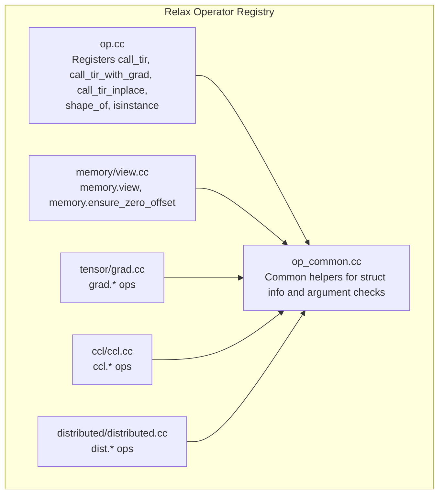
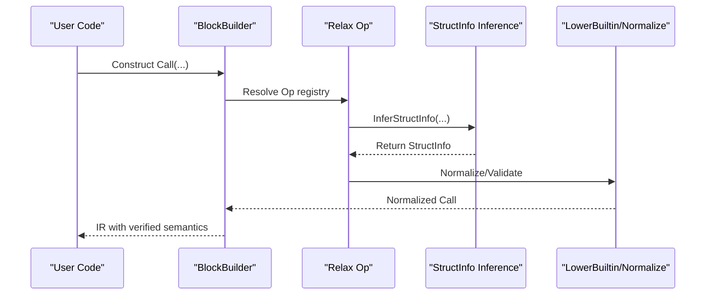
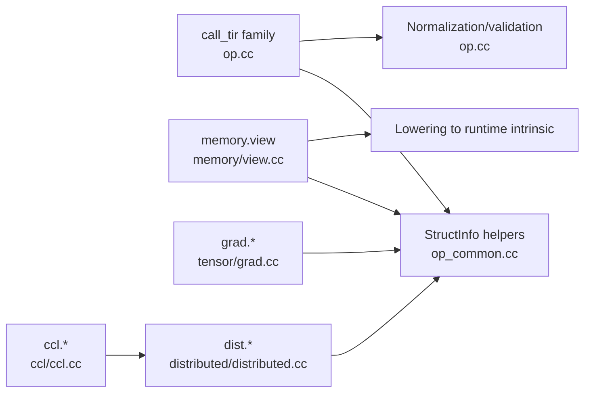

# Specialized Operators

<cite>
**Referenced Files in This Document**
- [op.cc](file://src/relax/op/op.cc)
- [op_common.cc](file://src/relax/op/op_common.cc)
- [view.cc](file://src/relax/op/memory/view.cc)
- [distributed.cc](file://src/relax/op/distributed/distributed.cc)
- [grad.cc](file://src/relax/op/tensor/grad.cc)
- [ccl.cc](file://src/relax/op/ccl/ccl.cc)
</cite>

## Table of Contents
1. [Introduction](#introduction)
2. [Project Structure](#project-structure)
3. [Core Components](#core-components)
4. [Architecture Overview](#architecture-overview)
5. [Detailed Component Analysis](#detailed-component-analysis)
6. [Dependency Analysis](#dependency-analysis)
7. [Performance Considerations](#performance-considerations)
8. [Troubleshooting Guide](#troubleshooting-guide)
9. [Conclusion](#conclusion)

## Introduction
This document explains Relax specialized operators across categories:
- Built-in operators: call_tir, call_tir_with_grad, call_tir_inplace, shape_of, isinstance
- Memory management operators: memory.view, memory.ensure_zero_offset
- Virtual machine operators: make_closure, invoke_closure
- Gradient operators: grad.no_grad, grad.start_checkpoint, grad.end_checkpoint, grad.nll_loss_backward, grad.max_pool2d_backward, grad.avg_pool2d_backward, grad.take_backward
- Distributed computing operators: ccl.allreduce, ccl.allgather, ccl.broadcast_from_worker0, ccl.scatter_from_worker0, dist.annotate_sharding, dist.redistribute, dist.call_tir_local_view, dist.redistribute_replica_to_shard

It covers operator semantics, parameter specifications, integration with Relax’s execution model, and practical compilation patterns and optimizations.

## Project Structure
The specialized operators are implemented as Relax primitive operators registered in dedicated source files. Each operator exposes:
- A Python-friendly constructor exposed via reflection
- StructInfo inference for static shape/type analysis
- Optional lowering/builtin lowering hooks
- Validation and normalization helpers for call_tir family

**Diagram sources**
- [op.cc:29-800](file://src/relax/op/op.cc#L29-L800)
- [op_common.cc:24-212](file://src/relax/op/op_common.cc#L24-L212)
- [view.cc:29-401](file://src/relax/op/memory/view.cc#L29-L401)
- [grad.cc:31-243](file://src/relax/op/tensor/grad.cc#L31-L243)
- [ccl.cc:26-177](file://src/relax/op/ccl/ccl.cc#L26-L177)
- [distributed.cc:37-239](file://src/relax/op/distributed/distributed.cc#L37-L239)

**Section sources**
- [op.cc:29-800](file://src/relax/op/op.cc#L29-L800)
- [op_common.cc:24-212](file://src/relax/op/op_common.cc#L24-L212)

## Core Components
- call_tir, call_tir_with_grad, call_tir_inplace: Call TIR PrimFuncs with explicit output struct info and optional gradient specification. They normalize and validate argument tuples, enforce purity, and support in-place mutation.
- shape_of: Returns the shape of a tensor as a ShapeExpr.
- isinstance: Type inspection operator for Relax expressions.
- memory.view: Reinterpret a tensor with a different shape/dtype/offset without copying data.
- make_closure, invoke_closure: VM-level closures for higher-order control flow and staged computation.
- grad.*: Gradient-related controls and backward primitives for training.
- ccl.* and dist.*: Collective communication and distributed tensor redistribution.

**Section sources**
- [op.cc:259-800](file://src/relax/op/op.cc#L259-L800)
- [view.cc:32-401](file://src/relax/op/memory/view.cc#L32-L401)
- [grad.cc:34-243](file://src/relax/op/tensor/grad.cc#L34-L243)
- [ccl.cc:29-177](file://src/relax/op/ccl/ccl.cc#L29-L177)
- [distributed.cc:42-239](file://src/relax/op/distributed/distributed.cc#L42-L239)

## Architecture Overview
Operators integrate with Relax’s static analysis and lowering pipeline:
- StructInfo inference ensures correctness before lowering.
- Normalization enforces argument tuple form and validates shapes/types.
- Lowering transforms high-level operators into VM/runtime intrinsics or TIR calls.

**Diagram sources**
- [op.cc:434-586](file://src/relax/op/op.cc#L434-L586)
- [op_common.cc:27-82](file://src/relax/op/op_common.cc#L27-L82)
- [view.cc:303-365](file://src/relax/op/memory/view.cc#L303-L365)

## Detailed Component Analysis

### Built-in Operators
- call_tir
  - Purpose: Invoke a TIR PrimFunc with explicit output struct info. Accepts an optional packed integer tuple for dynamic shapes.
  - Parameters:
    - func: GlobalVar referencing a TIR PrimFunc
    - args: Tuple of input tensors
    - packed_ints: Optional ShapeExpr of ints for dynamic shapes
    - sinfo_args: Exactly one output StructInfo describing the PrimFunc’s return
  - Semantics:
    - Validates argument tuple form and struct info compatibility
    - Supports normalization to inline tuple and binding resolution
    - Enforces purity
  - Use cases:
    - Integrating hand-tuned kernels with static shape guarantees
    - Passing dynamic shapes via packed integers
  - Integration:
    - StructInfo inference uses the provided sinfo_args
    - Normalization ensures args are an inline tuple
    - Validation compares inferred vs. provided output struct info

- call_tir_with_grad
  - Purpose: Same as call_tir but annotates gradient behavior via attributes.
  - Parameters:
    - func, args, packed_ints as above
    - Attributes: gradient specification name and kwargs
  - Use cases:
    - Staged gradient computation with explicit TE-backed backward rules

- call_tir_inplace
  - Purpose: In-place mutation of inputs into outputs with strict shape/dtype checks.
  - Parameters:
    - func, args, packed_ints as above
    - inplace_indices: Array mapping each output to an input index (-1 means newly allocated)
  - Semantics:
    - Normalization verifies one in-place index per output
    - Validation enforces exact shape/dtype match for in-place inputs
    - Enforces purity (safe only if outputs are not live elsewhere)

- shape_of
  - Purpose: Extract shape of a tensor as a ShapeExpr.
  - Parameters: tensor input
  - Semantics:
    - If input has a defined shape, returns ShapeStructInfo with values
    - If unknown, returns ShapeStructInfo with ndim

- isinstance
  - Purpose: Type inspection for Relax expressions.
  - Parameters: expression, target type
  - Semantics: Returns a boolean indicating whether the expression matches the target type

**Section sources**
- [op.cc:259-800](file://src/relax/op/op.cc#L259-L800)
- [op_common.cc:27-82](file://src/relax/op/op_common.cc#L27-L82)

### Memory Management Operators
- memory.view
  - Purpose: Reinterpret a tensor with a new shape/dtype/offset without copying.
  - Parameters:
    - x: input tensor
    - shape: ShapeExpr or void (keep input shape)
    - dtype: DataTypeImm or void (keep input dtype)
    - relative_byte_offset: int64 PrimValue or void (default 0)
  - Semantics:
    - Validates bounds against element counts and sizes
    - Infers output StructInfo with preserved vdevice
  - Use cases:
    - Strided views, reinterpretation for different dtypes, aligned access
  - Integration:
    - StructInfo inference and validation
    - Lowering to runtime.TVMTensorCreateView

- memory.ensure_zero_offset
  - Purpose: Ensure a tensor’s buffer starts at a zero-byte offset for alignment.
  - Parameters: tensor input
  - Semantics: Pass-through struct info; lowers to vm.builtin.ensure_zero_offset
  - Use cases: Ensuring alignment for fast kernels

**Section sources**
- [view.cc:32-401](file://src/relax/op/memory/view.cc#L32-L401)

### Virtual Machine Operators
- make_closure
  - Purpose: Construct a closure from a function and captured constants.
  - Parameters:
    - func: Function to capture
    - free_vars: List of captured constants
  - Semantics:
    - Produces a callable closure for later invocation
  - Use cases:
    - Higher-order control flow and staged computation

- invoke_closure
  - Purpose: Invoke a closure with arguments.
  - Parameters:
    - closure: Closure produced by make_closure
    - args: Arguments to pass to the closure
  - Semantics:
    - Executes the underlying function with captured environment
  - Use cases:
    - Dynamic dispatch and staged execution

Integration with Relax’s execution model:
- These operators bridge high-level Relax IR with VM execution semantics, enabling staged computation and dynamic control flow.

**Section sources**
- [op.cc:87-136](file://src/relax/op/op.cc#L87-L136)
- [op.cc:138-257](file://src/relax/op/op.cc#L138-L257)

### Gradient Operators
- grad.no_grad
  - Purpose: Mark a region to exclude from gradient computation.
  - Parameters: input tensor
  - Semantics: Pass-through struct info; marks region as no-grad

- grad.start_checkpoint / grad.end_checkpoint
  - Purpose: Mark a checkpoint stage for memory-efficient recomputation.
  - Parameters: input/output vars
  - Semantics:
    - start_checkpoint expects a Var
    - end_checkpoint expects a Var
  - Use cases:
    - Activation checkpointing in backpropagation

- grad.nll_loss_backward
  - Purpose: Backward pass for negative log-likelihood loss.
  - Parameters:
    - output_grad: upstream gradient
    - predictions, targets: forward inputs
    - weights: optional per-target weights
    - reduction: reduction mode
    - ignore_index: index to ignore
  - Semantics: Returns struct info of predictions

- grad.max_pool2d_backward / grad.avg_pool2d_backward
  - Purpose: Backward passes for pooling operations.
  - Parameters:
    - output_grad: upstream gradient
    - data: forward input tensor
    - Pool2DAttrs: kernel size, strides, padding, dilation, layout, etc.
  - Semantics: Returns struct info of data

- grad.take_backward
  - Purpose: Backward pass for gather-like operations.
  - Parameters:
    - output_grad: upstream gradient
    - x: source tensor
    - indices: indices used in forward
    - axis: optional gather axis
  - Semantics: Returns struct info of x

**Section sources**
- [grad.cc:34-243](file://src/relax/op/tensor/grad.cc#L34-L243)

### Distributed Computing Operators
- ccl.allreduce
  - Purpose: Allreduce over a tensor across workers.
  - Parameters:
    - x: input tensor
    - op_type: reduction operation type
    - in_group: whether to restrict to a subgroup
  - Semantics: Preserves dtype and shape; supports layout inference

- ccl.allgather
  - Purpose: Gather tensors from all workers along a specified axis.
  - Parameters:
    - x: input tensor
    - num_workers: expansion factor for axis 0
    - in_group: whether to restrict to a subgroup
  - Semantics: Multiplies axis 0 by num_workers

- ccl.broadcast_from_worker0
  - Purpose: Broadcast tensor from worker 0 to others.
  - Parameters: x
  - Semantics: Pass-through struct info

- ccl.scatter_from_worker0
  - Purpose: Scatter equal slices from worker 0 to others.
  - Parameters:
    - data: input tensor
    - num_workers: number of workers
    - axis: scatter axis
  - Semantics: Divides axis by num_workers; validates divisibility

- dist.annotate_sharding
  - Purpose: Attach sharding metadata to a tensor without changing data.
  - Parameters:
    - input: tensor
    - device_mesh: device mesh
    - placement: placement spec
  - Semantics: Pass-through struct info

- dist.redistribute
  - Purpose: Change distribution of a DTensor.
  - Parameters:
    - input: DTensor
    - device_mesh, placement: new distribution
  - Semantics: Returns DTensor with new placement

- dist.call_tir_local_view
  - Purpose: Call TIR with explicit DTensor output struct info.
  - Parameters:
    - func: GlobalVar to TIR PrimFunc
    - args: Tuple of inputs
    - packed_ints: optional ShapeExpr of ints
    - sinfo_args: output DTensor struct info
  - Semantics: Uses provided sinfo_args

- dist.redistribute_replica_to_shard
  - Purpose: Shard a replicated tensor along an axis.
  - Parameters:
    - input: DTensor with replica placement
    - num_workers: shard factor
    - axis: shard axis
  - Semantics: Creates S-axis placement; validates divisibility

**Section sources**
- [ccl.cc:29-177](file://src/relax/op/ccl/ccl.cc#L29-L177)
- [distributed.cc:42-239](file://src/relax/op/distributed/distributed.cc#L42-L239)

## Dependency Analysis
- call_tir family depends on:
  - StructInfo inference helpers
  - Argument tuple normalization and validation
  - Packed integer handling for dynamic shapes
- memory.view depends on:
  - StructInfo inference for shape/dtype/offset
  - Runtime lowering to TVM tensor view intrinsic
- grad.* depends on:
  - Tensor struct info propagation
  - Attribute-driven semantics for backward rules
- ccl.* and dist.* depend on:
  - Device mesh and placement abstractions
  - Collective semantics and divisibility checks

**Diagram sources**
- [op.cc:434-586](file://src/relax/op/op.cc#L434-L586)
- [op_common.cc:27-82](file://src/relax/op/op_common.cc#L27-L82)
- [view.cc:303-365](file://src/relax/op/memory/view.cc#L303-L365)
- [grad.cc:34-243](file://src/relax/op/tensor/grad.cc#L34-L243)
- [ccl.cc:29-177](file://src/relax/op/ccl/ccl.cc#L29-L177)
- [distributed.cc:42-239](file://src/relax/op/distributed/distributed.cc#L42-L239)

**Section sources**
- [op.cc:434-586](file://src/relax/op/op.cc#L434-L586)
- [op_common.cc:27-82](file://src/relax/op/op_common.cc#L27-L82)
- [view.cc:303-365](file://src/relax/op/memory/view.cc#L303-L365)
- [grad.cc:34-243](file://src/relax/op/tensor/grad.cc#L34-L243)
- [ccl.cc:29-177](file://src/relax/op/ccl/ccl.cc#L29-L177)
- [distributed.cc:42-239](file://src/relax/op/distributed/distributed.cc#L42-L239)

## Performance Considerations
- call_tir_inplace
  - Use only when outputs are not live elsewhere; ensures no extra allocation and preserves aliasing.
  - Validate in-place indices and shapes to avoid redundant copies.
- memory.view
  - Prefer views for reinterpretation to avoid copies; ensure bounds and alignment to prevent undefined behavior.
  - Use memory.ensure_zero_offset before invoking aligned kernels.
- grad.checkpointing
  - Use start_checkpoint/end_checkpoint to reduce activation memory in backprop.
  - Pair with recomputation-friendly forward kernels.
- ccl.allgather/allreduce
  - Choose appropriate op_type and axis to minimize bandwidth.
  - Ensure shapes align with num_workers for scatter/gather to avoid extra copies.

[No sources needed since this section provides general guidance]

## Troubleshooting Guide
- call_tir normalization/validation errors
  - Ensure args is an inline tuple or can be resolved to one; packed_ints must be ShapeStructInfo with known dimensionality when provided.
  - Verify sinfo_args compatibility with the PrimFunc signature.

- memory.view bounds errors
  - If shape/dtype/offset changes, ensure the resulting view fits within the original buffer.
  - Provide explicit shape/dtype when input shape is unknown.

- call_tir_inplace mismatch
  - Each output must correspond to an in-place input with identical dtype and shape.
  - Use -1 for outputs that allocate new storage.

- ccl.scatter_from_worker0 divisibility
  - Axis length must be divisible by num_workers.

- dist.redistribute_replica_to_shard
  - Input axis must be divisible by num_workers; placement must be replica on the chosen axis.

**Section sources**
- [op.cc:434-586](file://src/relax/op/op.cc#L434-L586)
- [view.cc:51-296](file://src/relax/op/memory/view.cc#L51-L296)
- [ccl.cc:142-165](file://src/relax/op/ccl/ccl.cc#L142-L165)
- [distributed.cc:183-212](file://src/relax/op/distributed/distributed.cc#L183-L212)

## Conclusion
Relax specialized operators provide a cohesive interface for integrating low-level kernels, managing memory efficiently, controlling gradient computation, and orchestrating distributed execution. By leveraging StructInfo inference, normalization, and lowering hooks, these operators maintain correctness and performance across diverse compilation targets and execution environments.