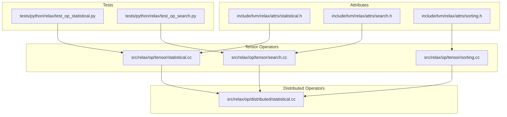
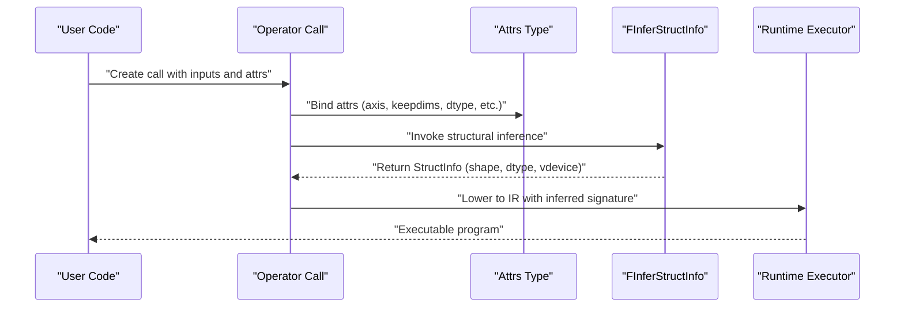
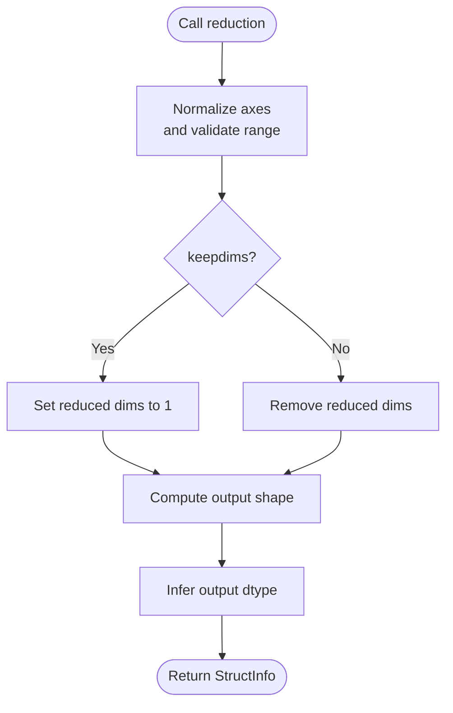
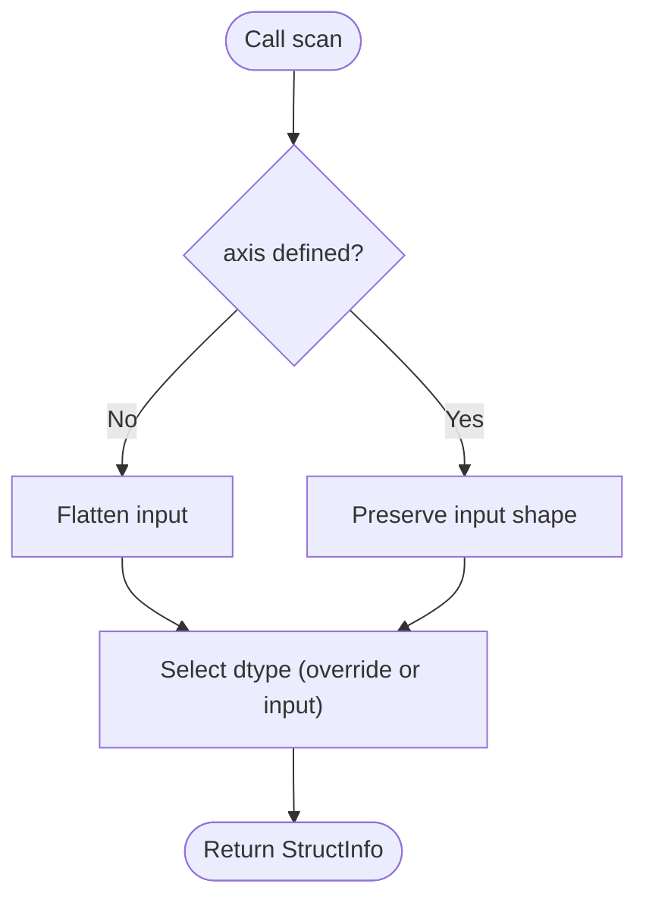
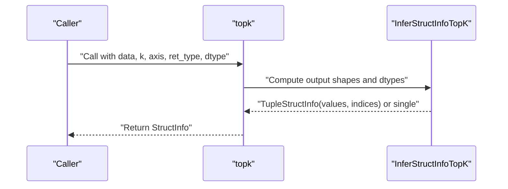
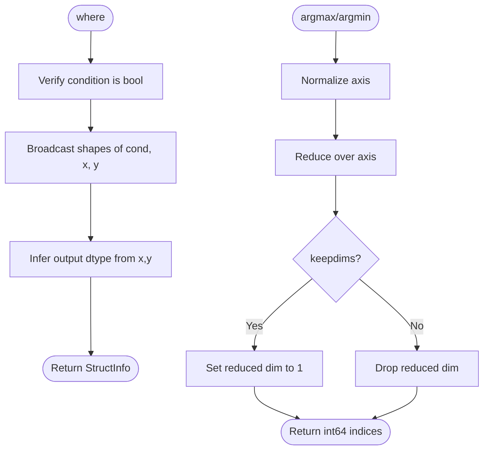
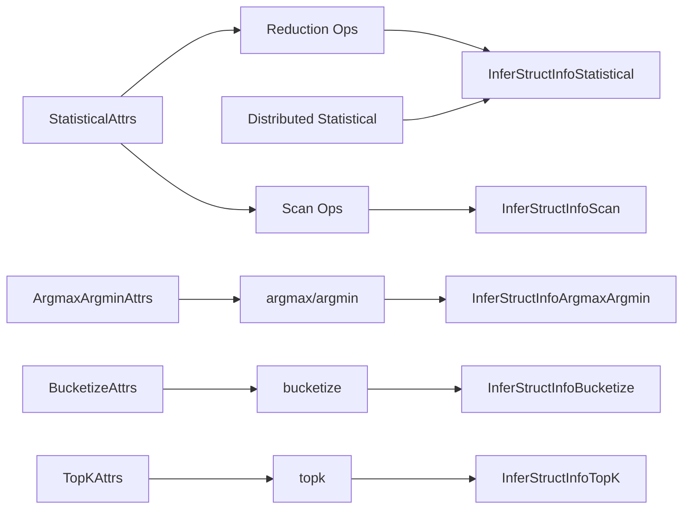

# Statistical Operators

<cite>
**Referenced Files in This Document**
- [statistical.h](file://include/tvm/relax/attrs/statistical.h)
- [search.h](file://include/tvm/relax/attrs/search.h)
- [sorting.h](file://include/tvm/relax/attrs/sorting.h)
- [statistical.cc](file://src/relax/op/tensor/statistical.cc)
- [search.cc](file://src/relax/op/tensor/search.cc)
- [sorting.cc](file://src/relax/op/tensor/sorting.cc)
- [dist_statistical.cc](file://src/relax/op/distributed/statistical.cc)
- [test_op_statistical.py](file://tests/python/relax/test_op_statistical.py)
- [test_op_search.py](file://tests/python/relax/test_op_search.py)
</cite>

## Table of Contents
1. [Introduction](#introduction)
2. [Project Structure](#project-structure)
3. [Core Components](#core-components)
4. [Architecture Overview](#architecture-overview)
5. [Detailed Component Analysis](#detailed-component-analysis)
6. [Dependency Analysis](#dependency-analysis)
7. [Performance Considerations](#performance-considerations)
8. [Troubleshooting Guide](#troubleshooting-guide)
9. [Conclusion](#conclusion)

## Introduction
This document describes Relax statistical and search operators, focusing on reduction operations (sum, mean, prod, max, min, std, variance, median), scanning operations (cumsum, cumprod), sorting operations (sort, argsort, topk), searching operations (where, argmax, argmin, bucketize), and histogram-related capabilities. It explains axis specifications, keepdims behavior, and numerical precision considerations, and provides examples of practical usage in data analysis, model evaluation, and preprocessing pipelines. Performance characteristics and memory usage patterns for large-scale operations are also discussed.

## Project Structure
Relax statistical and search operators are defined via attributes and implemented in dedicated operator modules:
- Attributes define operator hyperparameters and are declared in header files under include/tvm/relax/attrs/.
- Operator implementations live under src/relax/op/tensor/ and distributed variants under src/relax/op/distributed/.
- Tests under tests/python/relax/ validate structural inference and correctness.

**Diagram sources**
- [statistical.h:32-70](file://include/tvm/relax/attrs/statistical.h#L32-L70)
- [search.h:32-65](file://include/tvm/relax/attrs/search.h#L32-L65)
- [sorting.h:33-104](file://include/tvm/relax/attrs/sorting.h#L33-L104)
- [statistical.cc:245-318](file://src/relax/op/tensor/statistical.cc#L245-L318)
- [search.cc:40-88](file://src/relax/op/tensor/search.cc#L40-L88)
- [sorting.cc:40-167](file://src/relax/op/tensor/sorting.cc#L40-L167)
- [dist_statistical.cc:27-84](file://src/relax/op/distributed/statistical.cc#L27-L84)
- [test_op_statistical.py:28-37](file://tests/python/relax/test_op_statistical.py#L28-L37)
- [test_op_search.py:28-35](file://tests/python/relax/test_op_search.py#L28-L35)

**Section sources**
- [statistical.h:32-70](file://include/tvm/relax/attrs/statistical.h#L32-L70)
- [search.h:32-65](file://include/tvm/relax/attrs/search.h#L32-L65)
- [sorting.h:33-104](file://include/tvm/relax/attrs/sorting.h#L33-L104)
- [statistical.cc:245-318](file://src/relax/op/tensor/statistical.cc#L245-L318)
- [search.cc:40-88](file://src/relax/op/tensor/search.cc#L40-L88)
- [sorting.cc:40-167](file://src/relax/op/tensor/sorting.cc#L40-L167)
- [dist_statistical.cc:27-84](file://src/relax/op/distributed/statistical.cc#L27-L84)
- [test_op_statistical.py:28-37](file://tests/python/relax/test_op_statistical.py#L28-L37)
- [test_op_search.py:28-35](file://tests/python/relax/test_op_search.py#L28-L35)

## Core Components
- Reduction attributes: axis and keepdims are shared across most reduction-like operators.
- Search attributes: argmax/argmin axis and keepdims; bucketize output dtype and boundary behavior; where condition must be boolean.
- Sorting attributes: axis, descending, dtype for indices; topk supports returning values, indices, or both.
- Scanning attributes: axis, dtype override, and exclusive prefix behavior.

Key behaviors:
- Axis normalization: negative axes are normalized to positive indices; repeated or out-of-range axes produce errors.
- keepdims: when true, reduced axes remain with size 1; when false, axes are removed.
- Output dtypes: reductions preserve input dtype unless overridden; argmax/argmin return int64 indices; where output dtype inferred from x and y.

**Section sources**
- [statistical.h:32-49](file://include/tvm/relax/attrs/statistical.h#L32-L49)
- [search.h:32-49](file://include/tvm/relax/attrs/search.h#L32-L49)
- [sorting.h:33-104](file://include/tvm/relax/attrs/sorting.h#L33-L104)
- [statistical.cc:40-92](file://src/relax/op/tensor/statistical.cc#L40-L92)
- [search.cc:191-248](file://src/relax/op/tensor/search.cc#L191-L248)
- [sorting.cc:56-92](file://src/relax/op/tensor/sorting.cc#L56-L92)

## Architecture Overview
The Relax operator stack composes:
- Attribute nodes define operator parameters.
- FInferStructInfo functions compute output shape and dtype.
- TVM_REGISTER_OP registers operator semantics and inference hooks.
- Distributed variants infer sharding specs for multi-device execution.

**Diagram sources**
- [statistical.cc:245-318](file://src/relax/op/tensor/statistical.cc#L245-L318)
- [search.cc:90-187](file://src/relax/op/tensor/search.cc#L90-L187)
- [sorting.cc:40-167](file://src/relax/op/tensor/sorting.cc#L40-L167)

## Detailed Component Analysis

### Reduction Operations (sum, mean, prod, max, min, std, variance, median)
- Operators: sum, mean, prod, max, min, std, variance, median.
- Attributes: axis (optional), keepdims (bool).
- Structural inference:
  - Unknown ndim inputs: output ndim remains unknown.
  - keepdims true: reduced axes become size 1.
  - keepdims false: reduced axes are removed from shape.
  - axis=None: reduce over all axes (scalar output).
  - axis=[]: no reduction (identity shape).
- Special cases:
  - median returns a tuple of (values, indices) when reducing over a single axis; otherwise returns values only.

**Diagram sources**
- [statistical.cc:40-92](file://src/relax/op/tensor/statistical.cc#L40-L92)
- [statistical.cc:183-243](file://src/relax/op/tensor/statistical.cc#L183-L243)

**Section sources**
- [statistical.h:32-49](file://include/tvm/relax/attrs/statistical.h#L32-L49)
- [statistical.cc:40-92](file://src/relax/op/tensor/statistical.cc#L40-L92)
- [statistical.cc:183-243](file://src/relax/op/tensor/statistical.cc#L183-L243)
- [test_op_statistical.py:45-123](file://tests/python/relax/test_op_statistical.py#L45-L123)

### Scanning Operations (cumsum, cumprod)
- Operators: cumsum, cumprod.
- Attributes: axis (optional), dtype (override), exclusive (bool).
- Structural inference:
  - axis=None: flatten and scan over the single reduced dimension.
  - axis specified: scan along the given axis; output shape matches input.
  - dtype override: sets output dtype; otherwise inherits input dtype.

**Diagram sources**
- [statistical.cc:155-181](file://src/relax/op/tensor/statistical.cc#L155-L181)

**Section sources**
- [statistical.h:51-70](file://include/tvm/relax/attrs/statistical.h#L51-L70)
- [statistical.cc:245-290](file://src/relax/op/tensor/statistical.cc#L245-L290)
- [test_op_statistical.py:217-259](file://tests/python/relax/test_op_statistical.py#L217-L259)

### Sorting Operations (sort, argsort, topk)
- sort: axis (default -1), descending (default false).
- argsort: axis, descending, dtype (indices dtype).
- topk: k, axis, largest (top-k largest or smallest), ret_type ("both", "values", "indices"), dtype (indices dtype).
- Structural inference:
  - sort and argsort preserve input shape; argsort’s index dtype configurable.
  - topk returns either values only, indices only, or both as a tuple; shape modified along axis to k (or min(k, dim_size)).

**Diagram sources**
- [sorting.cc:101-167](file://src/relax/op/tensor/sorting.cc#L101-L167)

**Section sources**
- [sorting.h:33-104](file://include/tvm/relax/attrs/sorting.h#L33-L104)
- [sorting.cc:56-92](file://src/relax/op/tensor/sorting.cc#L56-L92)
- [sorting.cc:120-167](file://src/relax/op/tensor/sorting.cc#L120-L167)

### Searching Operations (where, argmax, argmin, bucketize)
- where: condition (bool), x, y; broadcasts all three; output dtype inferred from x and y; condition must be boolean.
- argmax/argmin: axis (default -1), keepdims; output dtype is int64 indices; axis normalization enforced.
- bucketize: input tensor and 1-D boundaries; out_int32 controls output int32/int64; right controls boundary behavior; boundaries must be 1-D.

**Diagram sources**
- [search.cc:101-179](file://src/relax/op/tensor/search.cc#L101-L179)
- [search.cc:191-248](file://src/relax/op/tensor/search.cc#L191-L248)

**Section sources**
- [search.h:32-49](file://include/tvm/relax/attrs/search.h#L32-L49)
- [search.cc:90-187](file://src/relax/op/tensor/search.cc#L90-L187)
- [search.cc:191-248](file://src/relax/op/tensor/search.cc#L191-L248)
- [test_op_search.py:288-444](file://tests/python/relax/test_op_search.py#L288-L444)

### Histogram Operations
- Direct histogram operator is not exposed in the Relax tensor operator set.
- bucketize provides binning capability for placing values into histogram bins; it returns discrete bin indices and can be composed with other operators to form histograms (e.g., bincount, histogram binning).
- bucketize requires boundaries to be a 1-D strictly increasing sequence; otherwise behavior is undefined.

**Section sources**
- [search.h:51-65](file://include/tvm/relax/attrs/search.h#L51-L65)
- [search.cc:40-88](file://src/relax/op/tensor/search.cc#L40-L88)
- [test_op_search.py:28-35](file://tests/python/relax/test_op_search.py#L28-L35)

## Dependency Analysis
- Attribute types are referenced by operator implementations to define semantics and inference.
- Structural inference functions depend on axis normalization utilities and shape/type analysis.
- Distributed statistical operators reuse reduction inference logic and add sharding spec inference.

**Diagram sources**
- [statistical.h:32-70](file://include/tvm/relax/attrs/statistical.h#L32-L70)
- [search.h:32-65](file://include/tvm/relax/attrs/search.h#L32-L65)
- [sorting.h:76-104](file://include/tvm/relax/attrs/sorting.h#L76-L104)
- [statistical.cc:40-92](file://src/relax/op/tensor/statistical.cc#L40-L92)
- [statistical.cc:155-181](file://src/relax/op/tensor/statistical.cc#L155-L181)
- [search.cc:191-248](file://src/relax/op/tensor/search.cc#L191-L248)
- [search.cc:55-78](file://src/relax/op/tensor/search.cc#L55-L78)
- [sorting.cc:120-167](file://src/relax/op/tensor/sorting.cc#L120-L167)
- [dist_statistical.cc:27-77](file://src/relax/op/distributed/statistical.cc#L27-L77)

**Section sources**
- [statistical.cc:40-92](file://src/relax/op/tensor/statistical.cc#L40-L92)
- [statistical.cc:155-181](file://src/relax/op/tensor/statistical.cc#L155-L181)
- [search.cc:55-78](file://src/relax/op/tensor/search.cc#L55-L78)
- [search.cc:191-248](file://src/relax/op/tensor/search.cc#L191-L248)
- [sorting.cc:120-167](file://src/relax/op/tensor/sorting.cc#L120-L167)
- [dist_statistical.cc:27-77](file://src/relax/op/distributed/statistical.cc#L27-L77)

## Performance Considerations
- Memory usage:
  - Reductions with keepdims=true increase output size by adding unit dimensions; large keepdims tensors can significantly raise peak memory.
  - argmax/argmin return int64 indices; int64 indexing arrays can roughly double memory compared to int32 for large tensors.
  - topk with ret_type="both" doubles the memory footprint for storing both values and indices.
- Numerical precision:
  - Output dtype follows input dtype unless overridden (e.g., scan dtype override). Mixed-precision reductions may accumulate error differently; consider casting to higher precision (e.g., float64) for stability-sensitive aggregations.
  - std/variance are sensitive to cancellation; consider using numerically stable online algorithms or Kahan summation when implemented in backends.
- Parallelism and layout:
  - Distributed statistical inference adds sharding specs; ensure layouts align with the reduced axes to minimize communication.
  - Sorting/topk can be compute-intensive; leverage backend-specific optimizations (e.g., GPU streams, pinned memory) and avoid unnecessary copies.
- Broadcasting and where:
  - Broadcasting in where can increase temporary storage; pre-align shapes when possible to reduce intermediates.

[No sources needed since this section provides general guidance]

## Troubleshooting Guide
Common issues and resolutions:
- Invalid axis:
  - Symptoms: errors indicating out-of-range or repeated axes.
  - Resolution: normalize negative axes; ensure axes are within [-ndim, ndim-1] and unique.
- where condition not boolean:
  - Symptoms: errors stating condition must be boolean.
  - Resolution: cast condition to bool before calling where.
- dtype mismatches in where:
  - Symptoms: type errors when x and y dtypes differ.
  - Resolution: align dtypes of x and y to a common type compatible with broadcasting rules.
- topk ret_type invalid:
  - Symptoms: internal errors for unsupported ret_type.
  - Resolution: use "both", "values", or "indices".
- bucketize boundaries not 1-D:
  - Symptoms: errors requiring boundaries to be 1-D.
  - Resolution: ensure boundaries is a 1-D tensor and strictly increasing.

**Section sources**
- [statistical.cc:40-92](file://src/relax/op/tensor/statistical.cc#L40-L92)
- [search.cc:101-179](file://src/relax/op/tensor/search.cc#L101-L179)
- [search.cc:55-78](file://src/relax/op/tensor/search.cc#L55-L78)
- [sorting.cc:120-167](file://src/relax/op/tensor/sorting.cc#L120-L167)
- [test_op_statistical.py:183-198](file://tests/python/relax/test_op_statistical.py#L183-L198)
- [test_op_search.py:227-238](file://tests/python/relax/test_op_search.py#L227-L238)

## Conclusion
Relax provides a comprehensive suite of statistical and search operators with robust structural inference and clear axis/keepdims semantics. Proper use of dtype overrides, careful axis handling, and awareness of memory and numerical trade-offs enable efficient and reliable large-scale analytics and ML workflows. For histogram-like operations, bucketize combined with downstream counting/binning operators offers flexible binning support.