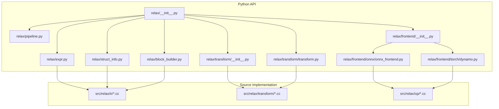
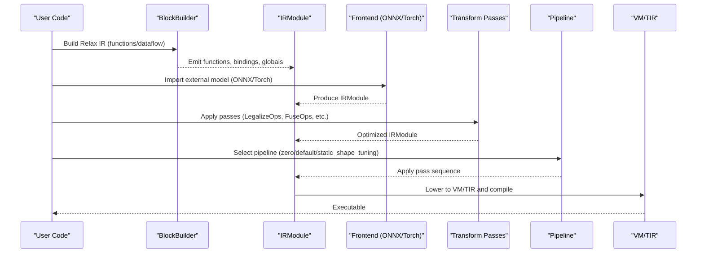
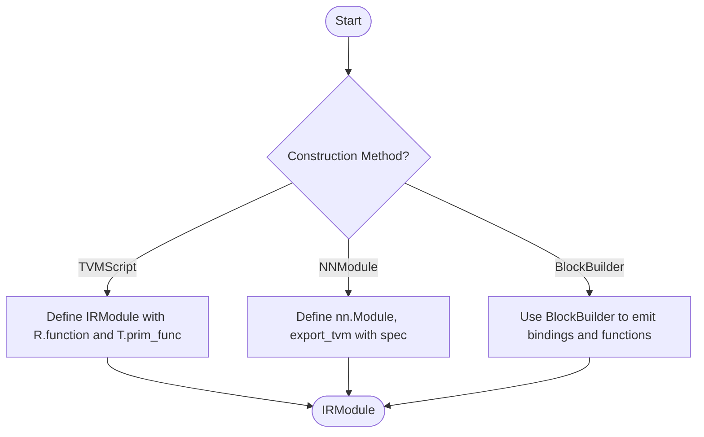
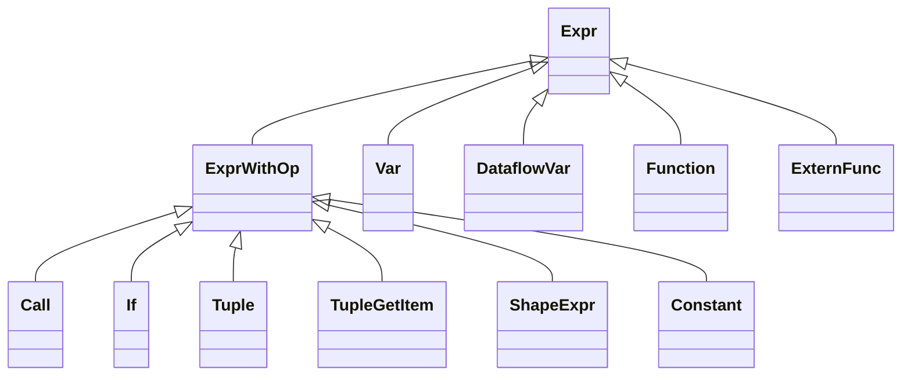
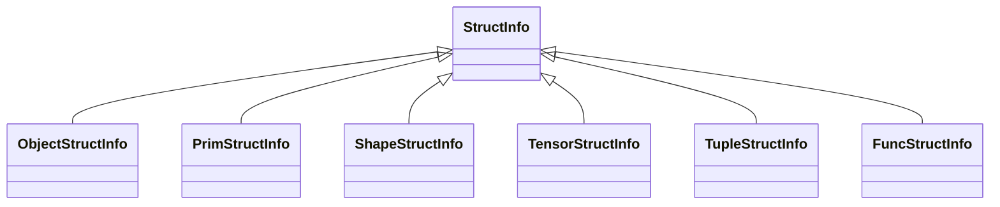
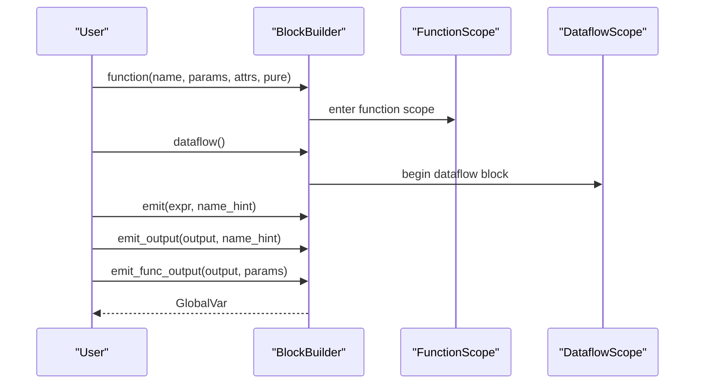
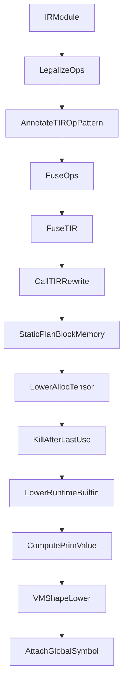
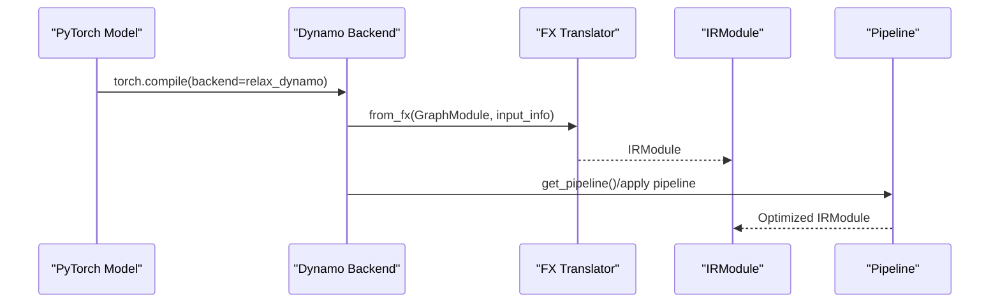
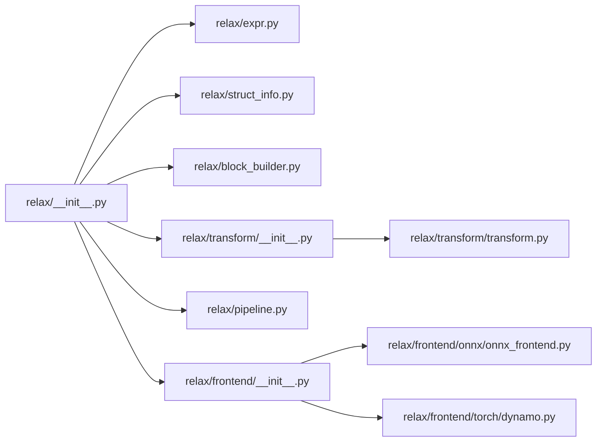

# Relax API

<cite>
**Referenced Files in This Document**
- [__init__.py](file://python/tvm/relax/__init__.py)
- [expr.py](file://python/tvm/relax/expr.py)
- [struct_info.py](file://python/tvm/relax/struct_info.py)
- [block_builder.py](file://python/tvm/relax/block_builder.py)
- [transform/__init__.py](file://python/tvm/relax/transform/__init__.py)
- [transform/transform.py](file://python/tvm/relax/transform/transform.py)
- [pipeline.py](file://python/tvm/relax/pipeline.py)
- [frontend/__init__.py](file://python/tvm/relax/frontend/__init__.py)
- [onnx/onnx_frontend.py](file://python/tvm/relax/frontend/onnx/onnx_frontend.py)
- [torch/dynamo.py](file://python/tvm/relax/frontend/torch/dynamo.py)
- [relax_creation.py](file://docs/deep_dive/relax/tutorials/relax_creation.py)
- [relax_transformation.py](file://docs/deep_dive/relax/tutorials/relax_transformation.py)
</cite>

## Table of Contents
1. [Introduction](#introduction)
2. [Project Structure](#project-structure)
3. [Core Components](#core-components)
4. [Architecture Overview](#architecture-overview)
5. [Detailed Component Analysis](#detailed-component-analysis)
6. [Dependency Analysis](#dependency-analysis)
7. [Performance Considerations](#performance-considerations)
8. [Troubleshooting Guide](#troubleshooting-guide)
9. [Conclusion](#conclusion)
10. [Appendices](#appendices)

## Introduction
This document provides comprehensive API documentation for TVM’s Relax frontend system. It explains how to construct Relax IR (RelaxModule), define functions, and operate at the graph level. It covers RelaxExpr types, RelaxVar binding, and the RelaxStructInfo system. It also documents Relax transformation passes, optimization utilities, and integration with TVM’s broader compilation pipeline. Practical examples demonstrate Relax IR construction, transformation workflows, and integration with ONNX, PyTorch, and TensorFlow frontends. Finally, it addresses debugging, visualization, and performance optimization techniques.

## Project Structure
Relax resides primarily under python/tvm/relax and src/relax. The Python package exposes high-level APIs for building, transforming, and compiling Relax programs. The core components include:
- IR nodes and types (RelaxExpr, RelaxVar, StructInfo)
- BlockBuilder for imperative IR construction
- Transformation passes for optimization and lowering
- Frontends for importing models from ONNX, PyTorch, and others
- Pre-defined compilation pipelines

**Diagram sources**
- [__init__.py:24-123](file://python/tvm/relax/__init__.py#L24-L123)
- [expr.py:47-800](file://python/tvm/relax/expr.py#L47-L800)
- [struct_info.py:34-283](file://python/tvm/relax/struct_info.py#L34-L283)
- [block_builder.py:107-808](file://python/tvm/relax/block_builder.py#L107-L808)
- [transform/__init__.py:20-103](file://python/tvm/relax/transform/__init__.py#L20-L103)
- [transform/transform.py:43-200](file://python/tvm/relax/transform/transform.py#L43-L200)
- [pipeline.py:33-348](file://python/tvm/relax/pipeline.py#L33-L348)
- [frontend/__init__.py:18-22](file://python/tvm/relax/frontend/__init__.py#L18-L22)
- [onnx/onnx_frontend.py:18-800](file://python/tvm/relax/frontend/onnx/onnx_frontend.py#L18-L800)
- [torch/dynamo.py:38-239](file://python/tvm/relax/frontend/torch/dynamo.py#L38-L239)

**Section sources**
- [__init__.py:24-123](file://python/tvm/relax/__init__.py#L24-L123)
- [pipeline.py:33-348](file://python/tvm/relax/pipeline.py#L33-L348)

## Core Components
- Relax IR nodes and types: Expressions, variables, calls, tuples, shape expressions, constants, and typed variants.
- StructInfo: Static and runtime structural information for values (objects, primitives, shapes, tensors, tuples, functions).
- BlockBuilder: Imperative builder for constructing Relax functions with dataflow blocks, emitting bindings, and adding functions.
- Transformations: Passes for operator legalization, fusion, layout transforms, memory planning, and lowering to VM/TIR.
- Frontends: ONNX, PyTorch (Dynamo), and others for importing models into Relax IR.
- Pipelines: Pre-defined sequences of passes for zero-, default, and tuning-focused builds.

**Section sources**
- [expr.py:47-800](file://python/tvm/relax/expr.py#L47-L800)
- [struct_info.py:34-283](file://python/tvm/relax/struct_info.py#L34-L283)
- [block_builder.py:107-808](file://python/tvm/relax/block_builder.py#L107-L808)
- [transform/__init__.py:20-103](file://python/tvm/relax/transform/__init__.py#L20-L103)
- [frontend/__init__.py:18-22](file://python/tvm/relax/frontend/__init__.py#L18-L22)

## Architecture Overview
The Relax frontend integrates with TVM’s compilation pipeline. Users can construct IR via TVMScript, NNModule API, or BlockBuilder. Frontends convert external models into Relax IR. Transformations optimize and lower the IR. Pipelines orchestrate pass sequences for different targets and optimization levels. The resulting IR is lowered to VM/TIR and compiled to executable artifacts.

**Diagram sources**
- [block_builder.py:107-808](file://python/tvm/relax/block_builder.py#L107-L808)
- [onnx/onnx_frontend.py:18-800](file://python/tvm/relax/frontend/onnx/onnx_frontend.py#L18-L800)
- [torch/dynamo.py:38-239](file://python/tvm/relax/frontend/torch/dynamo.py#L38-L239)
- [transform/transform.py:43-200](file://python/tvm/relax/transform/transform.py#L43-L200)
- [pipeline.py:33-348](file://python/tvm/relax/pipeline.py#L33-L348)

## Detailed Component Analysis

### Relax IR Construction and Graph-Level Operations
- TVMScript-based construction: Define IRModule with Relax functions and TIR prim_func, enabling cross-level calls.
- NNModule API: PyTorch-like module definition and export to IRModule with parameter specification.
- BlockBuilder API: Low-level imperative builder for constructing Relax functions, emitting bindings, and adding TIR functions.

**Diagram sources**
- [relax_creation.py:46-283](file://docs/deep_dive/relax/tutorials/relax_creation.py#L46-L283)
- [block_builder.py:107-808](file://python/tvm/relax/block_builder.py#L107-L808)

**Section sources**
- [relax_creation.py:46-283](file://docs/deep_dive/relax/tutorials/relax_creation.py#L46-L283)
- [block_builder.py:107-808](file://python/tvm/relax/block_builder.py#L107-L808)

### RelaxExpr Types and Variable Binding
- Expression hierarchy: Call, If, Tuple, TupleGetItem, ShapeExpr, Constant, Var/DataflowVar, Function, ExternFunc, and more.
- Operators and arithmetic overloads: Overloaded ops on tensor-like expressions for concise construction.
- Variable binding: Var creation with optional StructInfo; binding via emit/emit_output; lookup and normalization.

**Diagram sources**
- [expr.py:532-800](file://python/tvm/relax/expr.py#L532-L800)

**Section sources**
- [expr.py:532-800](file://python/tvm/relax/expr.py#L532-L800)

### RelaxStructInfo System
- ObjectStructInfo, PrimStructInfo, ShapeStructInfo, TensorStructInfo, TupleStructInfo, FuncStructInfo.
- StructInfo captures static type and runtime structural information; used for type inference and correctness.
- FuncStructInfo supports opaque functions with custom derivation rules.

**Diagram sources**
- [struct_info.py:34-283](file://python/tvm/relax/struct_info.py#L34-L283)

**Section sources**
- [struct_info.py:34-283](file://python/tvm/relax/struct_info.py#L34-L283)

### BlockBuilder API
- Scopes: FunctionScope, DataflowScope, TestingScope.
- Emitting: emit, emit_output, emit_func_output; emit_te/call_te; match_cast.
- Normalization and finalization: normalize, get, finalize; add_func/update_func; begin/end scope.

**Diagram sources**
- [block_builder.py:39-808](file://python/tvm/relax/block_builder.py#L39-L808)

**Section sources**
- [block_builder.py:39-808](file://python/tvm/relax/block_builder.py#L39-L808)

### Relax Transformation Passes and Workflows
- Built-in passes: LegalizeOps, AnnotateTIROpPattern, FuseOps, FuseTIR, CallTIRRewrite, ToNonDataflow, RemovePurityChecking, StaticPlanBlockMemory, RewriteCUDAGraph, LowerAllocTensor, KillAfterLastUse, LowerRuntimeBuiltin, ComputePrimValue, VMShapeLower, AttachGlobalSymbol, etc.
- Pass categories: FunctionPass, DataflowBlockPass.
- Custom passes: Use PyExprMutator/PyExprVisitor to implement IR-level transformations.

**Diagram sources**
- [transform/__init__.py:20-103](file://python/tvm/relax/transform/__init__.py#L20-L103)
- [transform/transform.py:43-200](file://python/tvm/relax/transform/transform.py#L43-L200)

**Section sources**
- [transform/__init__.py:20-103](file://python/tvm/relax/transform/__init__.py#L20-L103)
- [transform/transform.py:43-200](file://python/tvm/relax/transform/transform.py#L43-L200)
- [relax_transformation.py:65-143](file://docs/deep_dive/relax/tutorials/relax_transformation.py#L65-L143)

### Frontend Integration and Model Import
- ONNX frontend: Converts ONNX graphs to Relax IR with operator registry and shape inference.
- PyTorch Dynamo: Integrates torch.compile with Relax; captures subgraphs and builds IRModule; selects target and pipeline.
- Frontend exports: Common utilities for parameter handling and shape parsing.

**Diagram sources**
- [torch/dynamo.py:38-239](file://python/tvm/relax/frontend/torch/dynamo.py#L38-L239)
- [onnx/onnx_frontend.py:18-800](file://python/tvm/relax/frontend/onnx/onnx_frontend.py#L18-L800)

**Section sources**
- [onnx/onnx_frontend.py:18-800](file://python/tvm/relax/frontend/onnx/onnx_frontend.py#L18-L800)
- [torch/dynamo.py:38-239](file://python/tvm/relax/frontend/torch/dynamo.py#L38-L239)

### Compilation Pipelines
- Zero pipeline: LegalizeOps, AnnotateTIROpPattern, FoldConstant, FuseOps, FuseTIR; optionally MetaScheduleApplyDatabase.
- Default build pipeline: DispatchSampling/DispatchSortScan, LegalizeOps, RewriteDataflowReshape, ToNonDataflow, RemovePurityChecking, CallTIRRewrite, StaticPlanBlockMemory, RewriteCUDAGraph, LowerAllocTensor, KillAfterLastUse, LowerRuntimeBuiltin, ComputePrimValue, VMShapeLower, AttachGlobalSymbol.
- Static shape tuning pipeline: DecomposeOpsForInference, CanonicalizeBindings, zero_pipeline, optional layout rewrite and MetaSchedule tuning.

```mermaid
flowchart TD
S["IRModule"] --> Z["Zero Pipeline"]
S --> D["Default Build Pipeline"]
S --> ST["Static Shape Tuning Pipeline"]
Z --> Z1["LegalizeOps"]
Z --> Z2["AnnotateTIROpPattern"]
Z --> Z3["FoldConstant"]
Z --> Z4["FuseOps"]
Z --> Z5["FuseTIR"]
Z --> Z6["MetaScheduleApplyDatabase"]
D --> D1["DispatchSampling/DispatchSortScan"]
D --> D2["LegalizeOps"]
D --> D3["RewriteDataflowReshape"]
D --> D4["ToNonDataflow"]
D --> D5["RemovePurityChecking"]
D --> D6["CallTIRRewrite"]
D --> D7["StaticPlanBlockMemory"]
D --> D8["RewriteCUDAGraph"]
D --> D9["LowerAllocTensor"]
D --> D10["KillAfterLastUse"]
D --> D11["LowerRuntimeBuiltin"]
D --> D12["ComputePrimValue"]
D --> D13["VMShapeLower"]
D --> D14["AttachGlobalSymbol"]
ST --> ST1["DecomposeOpsForInference"]
ST --> ST2["CanonicalizeBindings"]
ST --> ST3["Zero Pipeline"]
ST --> ST4["Layout Rewrite (optional)"]
ST --> ST5["MetaSchedule TuneIRMod"]
ST --> ST6["MetaSchedule ApplyDatabase"]
ST --> ST7["Post Layout Rewrite (optional)"]
```

**Diagram sources**
- [pipeline.py:33-348](file://python/tvm/relax/pipeline.py#L33-L348)

**Section sources**
- [pipeline.py:33-348](file://python/tvm/relax/pipeline.py#L33-L348)

## Dependency Analysis
- Public API exposure: __init__.py re-exports core types, operators, VM, BlockBuilder, StructInfo, pipeline utilities, and submodules.
- IR and transformation dependencies: expr.py/struct_info.py define core types; block_builder.py depends on expr/struct_info and op base; transform/__init__.py aggregates pass classes; pipeline.py composes passes; frontends depend on op registry and TVM runtime.

**Diagram sources**
- [__init__.py:24-123](file://python/tvm/relax/__init__.py#L24-L123)
- [expr.py:47-800](file://python/tvm/relax/expr.py#L47-L800)
- [struct_info.py:34-283](file://python/tvm/relax/struct_info.py#L34-L283)
- [block_builder.py:107-808](file://python/tvm/relax/block_builder.py#L107-L808)
- [transform/__init__.py:20-103](file://python/tvm/relax/transform/__init__.py#L20-L103)
- [transform/transform.py:43-200](file://python/tvm/relax/transform/transform.py#L43-L200)
- [pipeline.py:33-348](file://python/tvm/relax/pipeline.py#L33-L348)
- [frontend/__init__.py:18-22](file://python/tvm/relax/frontend/__init__.py#L18-L22)
- [onnx/onnx_frontend.py:18-800](file://python/tvm/relax/frontend/onnx/onnx_frontend.py#L18-L800)
- [torch/dynamo.py:38-239](file://python/tvm/relax/frontend/torch/dynamo.py#L38-L239)

**Section sources**
- [__init__.py:24-123](file://python/tvm/relax/__init__.py#L24-L123)

## Performance Considerations
- Operator fusion: Use AnnotateTIROpPattern followed by FuseOps and FuseTIR to reduce kernel launches.
- Memory planning: StaticPlanBlockMemory and KillAfterLastUse improve memory efficiency.
- Layout transforms: OptimizeLayoutTransform and related passes can improve cache locality and kernel performance.
- Target-aware pipelines: Use target-specific pipelines and dispatch passes to leverage backend libraries (cuBLAS, cuDNN, etc.).
- MetaSchedule tuning: Static shape tuning pipeline integrates tuning logs to optimize kernels for specific targets.

[No sources needed since this section provides general guidance]

## Troubleshooting Guide
- Shape and type mismatches: Use StructInfo to annotate shapes and dtypes; rely on normalize to complete type inference.
- Missing legalization: LegalizeOps pass registers backend-specific implementations; ensure target dispatch passes are included.
- Dynamic shapes: Some kernels do not support dynamic shapes; consider static shape tuning pipeline or canonicalization.
- Debugging IR: Print IRModule via show(); use ExprFunctor visitors/mutators to inspect/rewrite parts of the IR.
- Frontend issues: Verify operator coverage in ONNX/Torch frontends; add missing operators to registries or use BlockBuilder to construct manually.

**Section sources**
- [struct_info.py:34-283](file://python/tvm/relax/struct_info.py#L34-L283)
- [transform/transform.py:43-200](file://python/tvm/relax/transform/transform.py#L43-L200)
- [relax_transformation.py:65-143](file://docs/deep_dive/relax/tutorials/relax_transformation.py#L65-L143)

## Conclusion
Relax provides a powerful, extensible frontend for constructing and optimizing ML models within TVM. With multiple construction APIs, a robust StructInfo system, rich transformation passes, and strong frontend integrations, Relax enables efficient compilation across diverse hardware targets. The provided pipelines and utilities streamline the journey from model import to optimized execution.

[No sources needed since this section summarizes without analyzing specific files]

## Appendices

### Practical Examples Index
- Constructing Relax IR with TVMScript, NNModule, and BlockBuilder: [relax_creation.py:46-283](file://docs/deep_dive/relax/tutorials/relax_creation.py#L46-L283)
- Applying transformations and custom rewrites: [relax_transformation.py:65-143](file://docs/deep_dive/relax/tutorials/relax_transformation.py#L65-L143)

**Section sources**
- [relax_creation.py:46-283](file://docs/deep_dive/relax/tutorials/relax_creation.py#L46-L283)
- [relax_transformation.py:65-143](file://docs/deep_dive/relax/tutorials/relax_transformation.py#L65-L143)