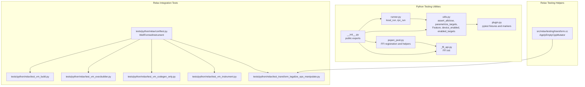
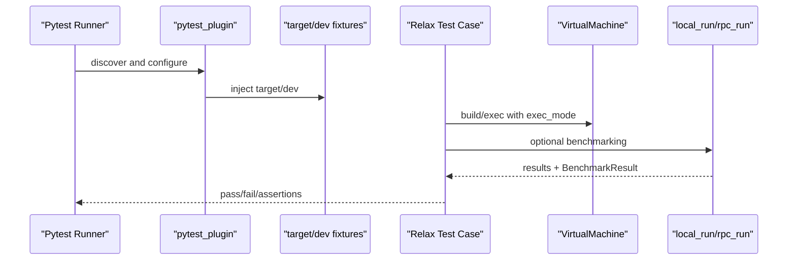
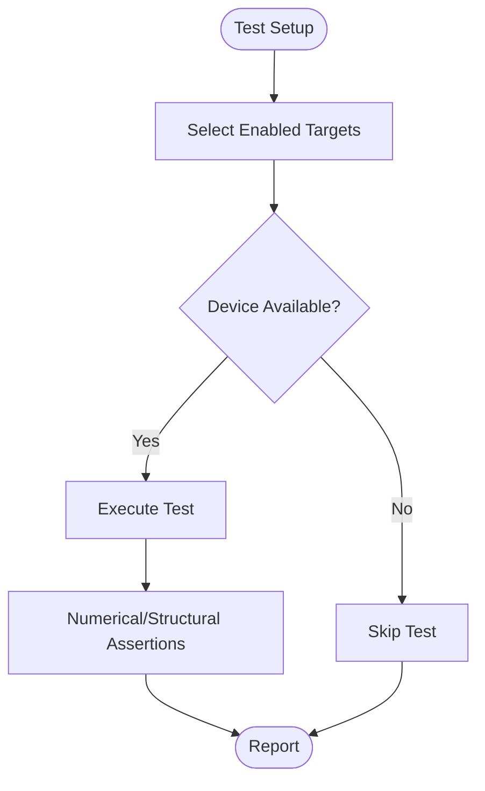
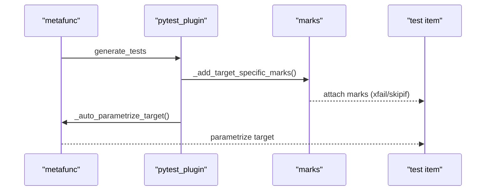
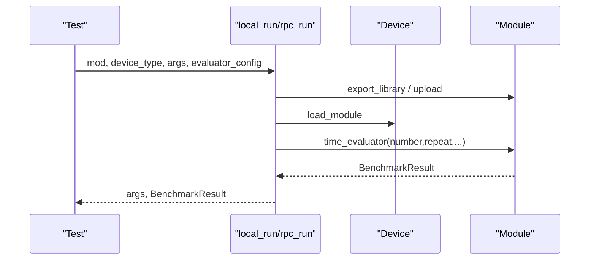
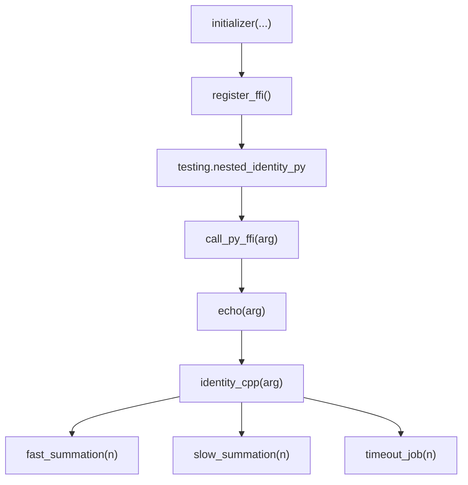
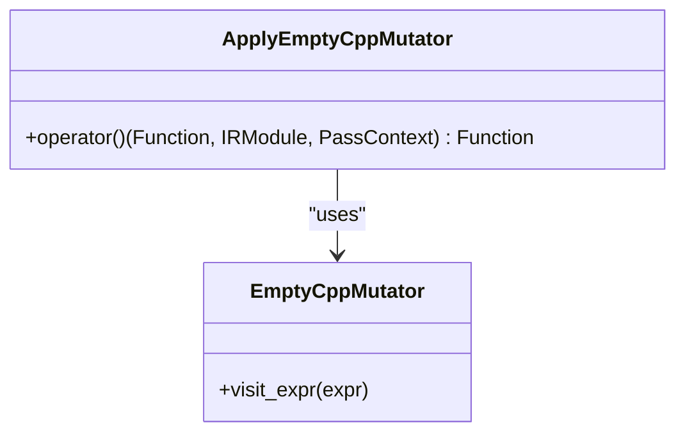
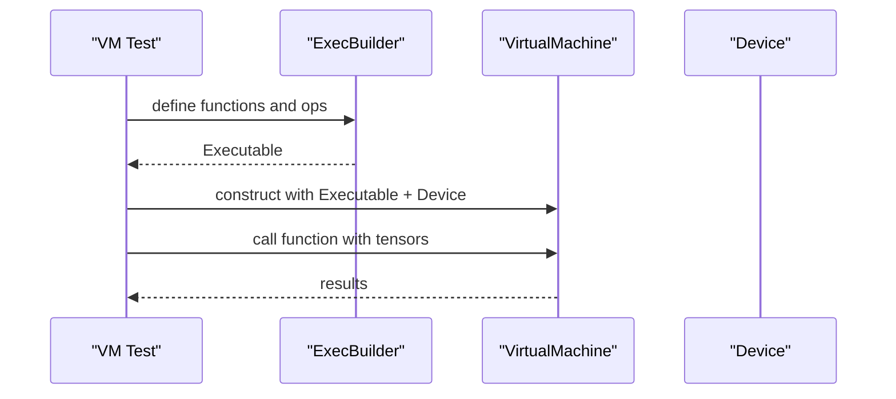
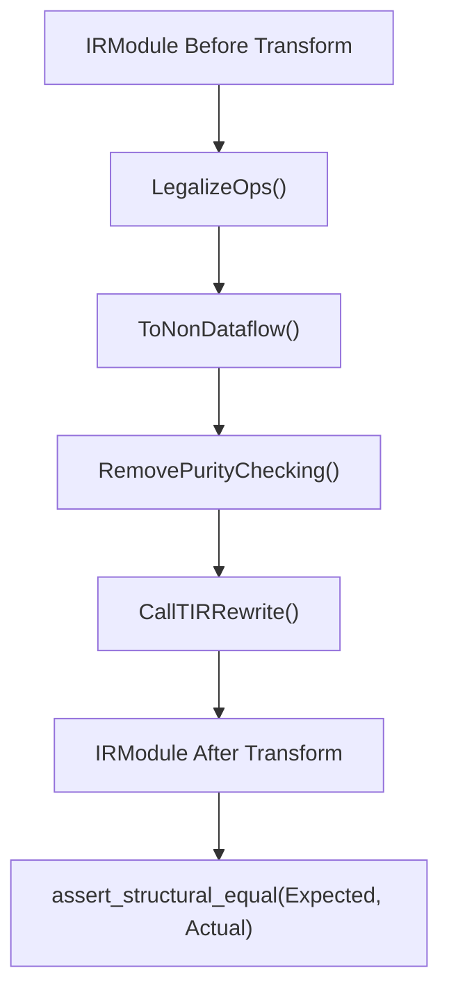
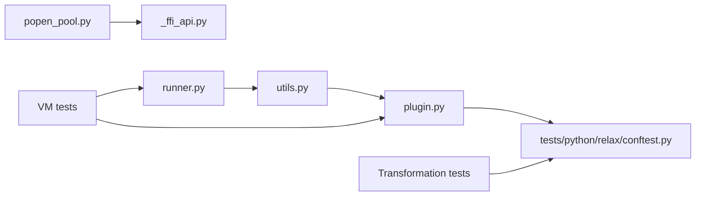

# Testing Framework

<cite>
**Referenced Files in This Document**
- [python/tvm/testing/__init__.py](file://python/tvm/testing/__init__.py)
- [python/tvm/testing/utils.py](file://python/tvm/testing/utils.py)
- [python/tvm/testing/plugin.py](file://python/tvm/testing/plugin.py)
- [python/tvm/testing/runner.py](file://python/tvm/testing/runner.py)
- [python/tvm/testing/popen_pool.py](file://python/tvm/testing/popen_pool.py)
- [python/tvm/testing/_ffi_api.py](file://python/tvm/testing/_ffi_api.py)
- [src/relax/testing/transform.cc](file://src/relax/testing/transform.cc)
- [tests/python/relax/conftest.py](file://tests/python/relax/conftest.py)
- [tests/python/relax/test_vm_build.py](file://tests/python/relax/test_vm_build.py)
- [tests/python/relax/test_vm_execbuilder.py](file://tests/python/relax/test_vm_execbuilder.py)
- [tests/python/relax/test_vm_codegen_only.py](file://tests/python/relax/test_vm_codegen_only.py)
- [tests/python/relax/test_vm_instrument.py](file://tests/python/relax/test_vm_instrument.py)
- [tests/python/relax/test_transform_legalize_ops_manipulate.py](file://tests/python/relax/test_transform_legalize_ops_manipulate.py)
</cite>

## Table of Contents
1. [Introduction](#introduction)
2. [Project Structure](#project-structure)
3. [Core Components](#core-components)
4. [Architecture Overview](#architecture-overview)
5. [Detailed Component Analysis](#detailed-component-analysis)
6. [Dependency Analysis](#dependency-analysis)
7. [Performance Considerations](#performance-considerations)
8. [Troubleshooting Guide](#troubleshooting-guide)
9. [Conclusion](#conclusion)
10. [Appendices](#appendices)

## Introduction
This document describes the Relax testing framework in the TVM codebase. It focuses on testing utilities for AST printing, library comparison, and transformation validation; testing patterns for Relax IR construction, transformation verification, and runtime testing; VM testing utilities; performance benchmarking; and regression testing approaches. It also provides practical examples, best practices, debugging techniques, and continuous integration workflows tailored for Relax development.

## Project Structure
The Relax testing ecosystem spans Python-side utilities, Relax-specific C++ testing helpers, and comprehensive integration tests for VM and transformation correctness.

**Diagram sources**
- [python/tvm/testing/__init__.py:1-49](file://python/tvm/testing/__init__.py#L1-L49)
- [python/tvm/testing/utils.py:1-800](file://python/tvm/testing/utils.py#L1-L800)
- [python/tvm/testing/plugin.py:1-382](file://python/tvm/testing/plugin.py#L1-L382)
- [python/tvm/testing/runner.py:1-236](file://python/tvm/testing/runner.py#L1-L236)
- [python/tvm/testing/popen_pool.py:1-79](file://python/tvm/testing/popen_pool.py#L1-L79)
- [python/tvm/testing/_ffi_api.py:1-25](file://python/tvm/testing/_ffi_api.py#L1-L25)
- [src/relax/testing/transform.cc:1-47](file://src/relax/testing/transform.cc#L1-L47)
- [tests/python/relax/conftest.py:35-85](file://tests/python/relax/conftest.py#L35-L85)
- [tests/python/relax/test_vm_build.py:45-63](file://tests/python/relax/test_vm_build.py#L45-L63)
- [tests/python/relax/test_vm_execbuilder.py:50-86](file://tests/python/relax/test_vm_execbuilder.py#L50-L86)
- [tests/python/relax/test_vm_codegen_only.py:264-311](file://tests/python/relax/test_vm_codegen_only.py#L264-L311)
- [tests/python/relax/test_vm_instrument.py:74-103](file://tests/python/relax/test_vm_instrument.py#L74-L103)
- [tests/python/relax/test_transform_legalize_ops_manipulate.py:1738-1777](file://tests/python/relax/test_transform_legalize_ops_manipulate.py#L1738-L1777)

**Section sources**
- [python/tvm/testing/__init__.py:1-49](file://python/tvm/testing/__init__.py#L1-L49)
- [python/tvm/testing/utils.py:1-800](file://python/tvm/testing/utils.py#L1-L800)
- [python/tvm/testing/plugin.py:1-382](file://python/tvm/testing/plugin.py#L1-L382)
- [python/tvm/testing/runner.py:1-236](file://python/tvm/testing/runner.py#L1-L236)
- [python/tvm/testing/popen_pool.py:1-79](file://python/tvm/testing/popen_pool.py#L1-L79)
- [python/tvm/testing/_ffi_api.py:1-25](file://python/tvm/testing/_ffi_api.py#L1-L25)
- [src/relax/testing/transform.cc:1-47](file://src/relax/testing/transform.cc#L1-L47)
- [tests/python/relax/conftest.py:35-85](file://tests/python/relax/conftest.py#L35-L85)
- [tests/python/relax/test_vm_build.py:45-63](file://tests/python/relax/test_vm_build.py#L45-L63)
- [tests/python/relax/test_vm_execbuilder.py:50-86](file://tests/python/relax/test_vm_execbuilder.py#L50-L86)
- [tests/python/relax/test_vm_codegen_only.py:264-311](file://tests/python/relax/test_vm_codegen_only.py#L264-L311)
- [tests/python/relax/test_vm_instrument.py:74-103](file://tests/python/relax/test_vm_instrument.py#L74-L103)
- [tests/python/relax/test_transform_legalize_ops_manipulate.py:1738-1777](file://tests/python/relax/test_transform_legalize_ops_manipulate.py#L1738-L1777)

## Core Components
- Python testing utilities: assertion helpers, numerical gradient checks, target selection, and feature gating.
- Pytest plugin: automatic target parametrization, fixture injection, and requirement marking.
- Runtime execution runners: local and RPC-based module execution with timing/benchmarking.
- PopOpen pool helpers: FFI registration and global function hooks for cross-language tests.
- Relax C++ testing helpers: minimal mutators and pass scaffolding for transformation tests.
- Relax integration tests: VM build, execution builder, codegen-only, instrumentation, and transformation validation.

Key responsibilities:
- Provide deterministic, portable, and reproducible test environments across targets.
- Validate IR structural equality and transformation correctness.
- Verify VM execution semantics and performance characteristics.
- Support regression testing via well-formedness instrumentation and targeted assertions.

**Section sources**
- [python/tvm/testing/utils.py:106-262](file://python/tvm/testing/utils.py#L106-L262)
- [python/tvm/testing/utils.py:390-518](file://python/tvm/testing/utils.py#L390-L518)
- [python/tvm/testing/plugin.py:82-230](file://python/tvm/testing/plugin.py#L82-L230)
- [python/tvm/testing/runner.py:80-150](file://python/tvm/testing/runner.py#L80-L150)
- [python/tvm/testing/runner.py:152-236](file://python/tvm/testing/runner.py#L152-L236)
- [python/tvm/testing/popen_pool.py:30-79](file://python/tvm/testing/popen_pool.py#L30-L79)
- [src/relax/testing/transform.cc:28-42](file://src/relax/testing/transform.cc#L28-L42)

## Architecture Overview
The Relax testing architecture integrates Python utilities, pytest plugins, and Relax-specific tests. The plugin auto-applies target parametrization and injects fixtures. Tests leverage VM builders and executors, and rely on structural equality checks and well-formedness instrumentation.

**Diagram sources**
- [python/tvm/testing/plugin.py:82-230](file://python/tvm/testing/plugin.py#L82-L230)
- [python/tvm/testing/runner.py:80-150](file://python/tvm/testing/runner.py#L80-L150)
- [python/tvm/testing/runner.py:152-236](file://python/tvm/testing/runner.py#L152-L236)
- [tests/python/relax/test_vm_build.py:45-63](file://tests/python/relax/test_vm_build.py#L45-L63)

## Detailed Component Analysis

### Python Testing Utilities
- Assertion helpers: numerical closeness checks and gradient validation for numerical stability.
- Target selection: environment-aware target enumeration and device availability checks.
- Feature gating: compile-time and run-time checks for optional features and hardware.

**Diagram sources**
- [python/tvm/testing/utils.py:390-518](file://python/tvm/testing/utils.py#L390-L518)
- [python/tvm/testing/utils.py:106-262](file://python/tvm/testing/utils.py#L106-L262)

**Section sources**
- [python/tvm/testing/utils.py:106-262](file://python/tvm/testing/utils.py#L106-L262)
- [python/tvm/testing/utils.py:390-518](file://python/tvm/testing/utils.py#L390-L518)

### Pytest Plugin and Fixtures
- Automatic target parametrization and requirement marking based on target kinds.
- Fixture injection for device and target selection.
- Known-failing target handling and xfail propagation.

**Diagram sources**
- [python/tvm/testing/plugin.py:118-230](file://python/tvm/testing/plugin.py#L118-L230)

**Section sources**
- [python/tvm/testing/plugin.py:82-230](file://python/tvm/testing/plugin.py#L82-L230)

### Runtime Execution Runners
- Local execution: exports module, loads on device, benchmarks via time_evaluator, downloads results.
- RPC execution: exports module, uploads to remote, executes remotely, collects results and profiles.

**Diagram sources**
- [python/tvm/testing/runner.py:80-150](file://python/tvm/testing/runner.py#L80-L150)
- [python/tvm/testing/runner.py:152-236](file://python/tvm/testing/runner.py#L152-L236)

**Section sources**
- [python/tvm/testing/runner.py:80-150](file://python/tvm/testing/runner.py#L80-L150)
- [python/tvm/testing/runner.py:152-236](file://python/tvm/testing/runner.py#L152-L236)

### PopOpen Pool and FFI Registration
- Global function registration for Python/CPP interop.
- Helper functions for summation and timeouts to simulate workloads.

**Diagram sources**
- [python/tvm/testing/popen_pool.py:30-79](file://python/tvm/testing/popen_pool.py#L30-L79)
- [python/tvm/testing/_ffi_api.py:19-25](file://python/tvm/testing/_ffi_api.py#L19-L25)

**Section sources**
- [python/tvm/testing/popen_pool.py:30-79](file://python/tvm/testing/popen_pool.py#L30-L79)
- [python/tvm/testing/_ffi_api.py:19-25](file://python/tvm/testing/_ffi_api.py#L19-L25)

### Relax C++ Transformation Testing Helper
- Minimal C++ mutator pass registered via FFI to validate pass infrastructure in tests.

**Diagram sources**
- [src/relax/testing/transform.cc:28-42](file://src/relax/testing/transform.cc#L28-L42)

**Section sources**
- [src/relax/testing/transform.cc:28-42](file://src/relax/testing/transform.cc#L28-L42)

### VM Testing Utilities and Patterns
- VM build and execution across bytecode and compiled modes.
- ExecBuilder-based multi-function VM creation and validation.
- Codegen-only mode verification and prim value/string literal handling.
- Instrumentation and library comparator for functional verification.

**Diagram sources**
- [tests/python/relax/test_vm_execbuilder.py:50-86](file://tests/python/relax/test_vm_execbuilder.py#L50-L86)
- [tests/python/relax/test_vm_build.py:45-63](file://tests/python/relax/test_vm_build.py#L45-L63)
- [tests/python/relax/test_vm_codegen_only.py:264-311](file://tests/python/relax/test_vm_codegen_only.py#L264-L311)
- [tests/python/relax/test_vm_instrument.py:74-103](file://tests/python/relax/test_vm_instrument.py#L74-L103)

**Section sources**
- [tests/python/relax/test_vm_build.py:45-63](file://tests/python/relax/test_vm_build.py#L45-L63)
- [tests/python/relax/test_vm_execbuilder.py:50-86](file://tests/python/relax/test_vm_execbuilder.py#L50-L86)
- [tests/python/relax/test_vm_codegen_only.py:264-311](file://tests/python/relax/test_vm_codegen_only.py#L264-L311)
- [tests/python/relax/test_vm_instrument.py:74-103](file://tests/python/relax/test_vm_instrument.py#L74-L103)

### Transformation Validation and Structural Equality
- Legalization and layout transform sequences validated via structural equality.
- Well-formedness instrumentation ensures inputs and outputs remain well-formed.

**Diagram sources**
- [tests/python/relax/test_transform_legalize_ops_manipulate.py:1738-1777](file://tests/python/relax/test_transform_legalize_ops_manipulate.py#L1738-L1777)
- [tests/python/relax/conftest.py:62-85](file://tests/python/relax/conftest.py#L62-L85)

**Section sources**
- [tests/python/relax/test_transform_legalize_ops_manipulate.py:1738-1777](file://tests/python/relax/test_transform_legalize_ops_manipulate.py#L1738-L1777)
- [tests/python/relax/conftest.py:62-85](file://tests/python/relax/conftest.py#L62-L85)

## Dependency Analysis
- Python utilities depend on NumPy, pytest, TVM runtime, and target detection.
- Pytest plugin depends on TVM target parsing and feature registry.
- VM tests depend on Relax build and VirtualMachine runtime.
- Transformation tests depend on Relax passes and structural equality.

**Diagram sources**
- [python/tvm/testing/utils.py:1-800](file://python/tvm/testing/utils.py#L1-L800)
- [python/tvm/testing/plugin.py:1-382](file://python/tvm/testing/plugin.py#L1-L382)
- [python/tvm/testing/runner.py:1-236](file://python/tvm/testing/runner.py#L1-L236)
- [python/tvm/testing/popen_pool.py:1-79](file://python/tvm/testing/popen_pool.py#L1-L79)
- [python/tvm/testing/_ffi_api.py:1-25](file://python/tvm/testing/_ffi_api.py#L1-L25)
- [tests/python/relax/conftest.py:35-85](file://tests/python/relax/conftest.py#L35-L85)

**Section sources**
- [python/tvm/testing/utils.py:1-800](file://python/tvm/testing/utils.py#L1-L800)
- [python/tvm/testing/plugin.py:1-382](file://python/tvm/testing/plugin.py#L1-L382)
- [python/tvm/testing/runner.py:1-236](file://python/tvm/testing/runner.py#L1-L236)
- [python/tvm/testing/popen_pool.py:1-79](file://python/tvm/testing/popen_pool.py#L1-L79)
- [python/tvm/testing/_ffi_api.py:1-25](file://python/tvm/testing/_ffi_api.py#L1-L25)
- [tests/python/relax/conftest.py:35-85](file://tests/python/relax/conftest.py#L35-L85)

## Performance Considerations
- Use the runtime runners’ evaluator configuration to control repeat/number/min_repeat_ms for stable benchmarking.
- Enable CPU cache flush preprocessor when measuring CPU kernels to reduce noise.
- Prefer compiled execution mode for performance-sensitive VM tests.
- Limit scope of parametrization to essential targets to reduce CI time.

[No sources needed since this section provides general guidance]

## Troubleshooting Guide
- Target/device mismatches: verify enabled targets and device existence using target selection utilities.
- Gradient checks: use numerical gradient helpers to detect analytical gradient discrepancies.
- Structural equality failures: compare expected vs. actual IRModules and inspect differences.
- VM execution errors: validate inputs (dtype/shape) and ensure proper device allocation.
- Well-formedness violations: rely on injected instrumentation to catch malformed IR before/after transforms.

**Section sources**
- [python/tvm/testing/utils.py:106-262](file://python/tvm/testing/utils.py#L106-L262)
- [tests/python/relax/conftest.py:62-85](file://tests/python/relax/conftest.py#L62-L85)
- [tests/python/relax/test_vm_codegen_only.py:264-311](file://tests/python/relax/test_vm_codegen_only.py#L264-L311)

## Conclusion
The Relax testing framework combines robust Python utilities, a powerful pytest plugin, and targeted VM and transformation tests. Together they ensure compilation correctness, runtime reliability, and performance stability across diverse targets. Adhering to the patterns and best practices outlined here will streamline development, improve test coverage, and accelerate CI feedback loops.

[No sources needed since this section summarizes without analyzing specific files]

## Appendices

### Practical Examples Index
- VM build and execution: [tests/python/relax/test_vm_build.py:45-63](file://tests/python/relax/test_vm_build.py#L45-L63)
- ExecBuilder multi-function VM: [tests/python/relax/test_vm_execbuilder.py:50-86](file://tests/python/relax/test_vm_execbuilder.py#L50-L86)
- Codegen-only mode and prim/string literals: [tests/python/relax/test_vm_codegen_only.py:264-311](file://tests/python/relax/test_vm_codegen_only.py#L264-L311)
- VM instrumentation and library comparator: [tests/python/relax/test_vm_instrument.py:74-103](file://tests/python/relax/test_vm_instrument.py#L74-L103)
- Transformation validation via structural equality: [tests/python/relax/test_transform_legalize_ops_manipulate.py:1738-1777](file://tests/python/relax/test_transform_legalize_ops_manipulate.py#L1738-L1777)

### Best Practices
- Use parametrize_targets and device-enabled checks to ensure portability.
- Validate numerical outputs with assert_allclose and gradient checks where applicable.
- Leverage well-formedness instrumentation to prevent regressions.
- Prefer compiled VM mode for performance-sensitive scenarios; use bytecode for rapid iteration.
- Export artifacts locally or via RPC for reproducible remote testing.

[No sources needed since this section provides general guidance]