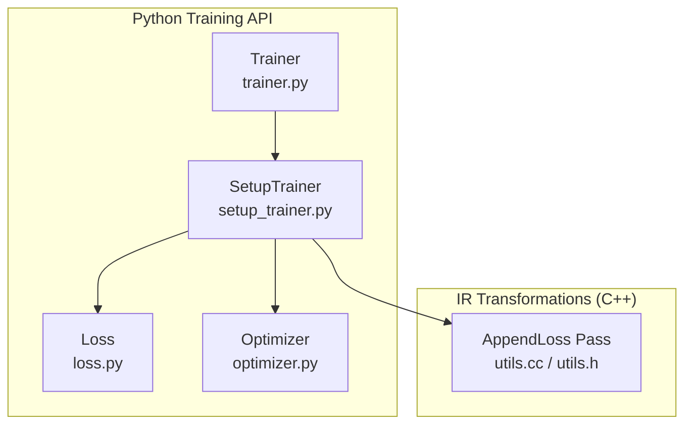
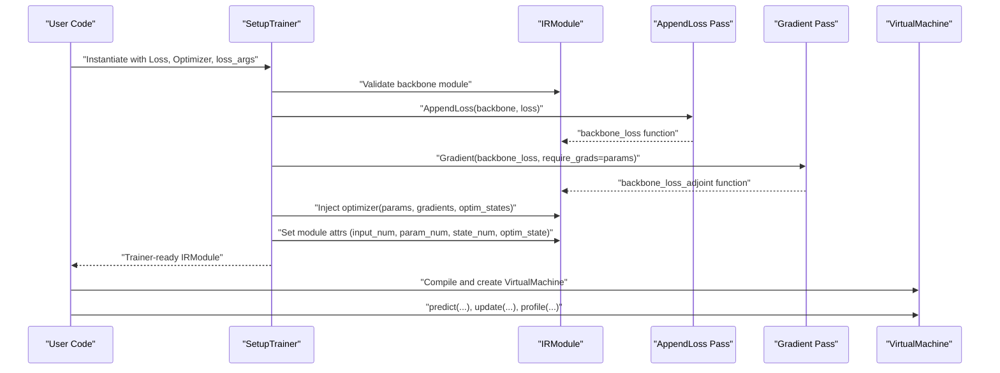
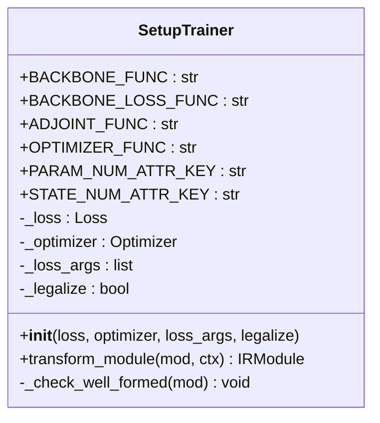
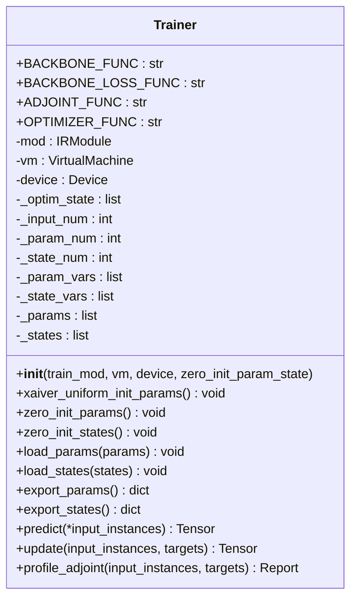
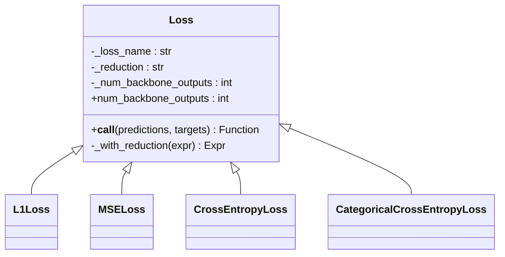
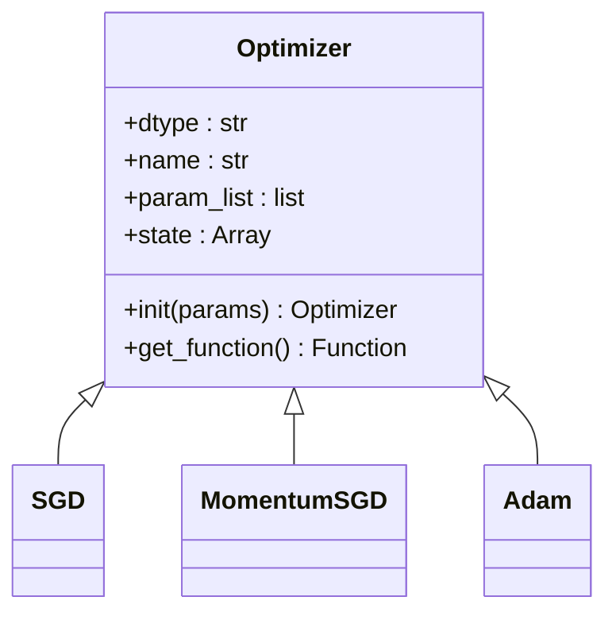
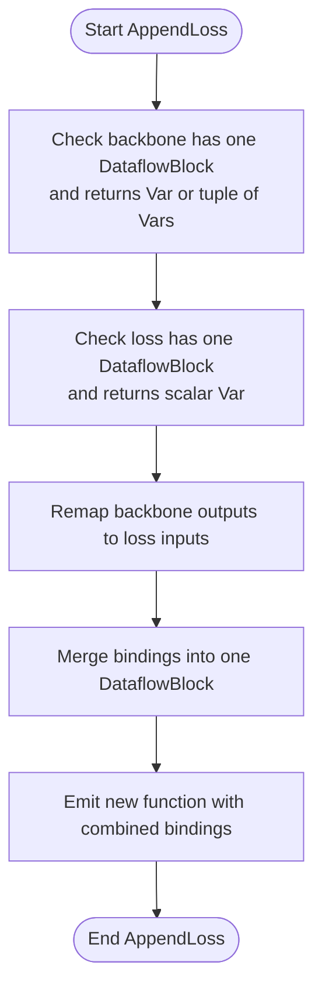
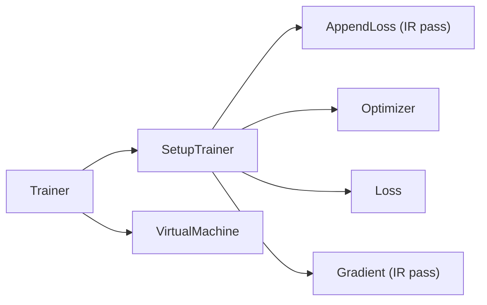

# Training Utilities

<cite>
**Referenced Files in This Document**
- [setup_trainer.py](file://python/tvm/relax/training/setup_trainer.py)
- [trainer.py](file://python/tvm/relax/training/trainer.py)
- [loss.py](file://python/tvm/relax/training/loss.py)
- [optimizer.py](file://python/tvm/relax/training/optimizer.py)
- [utils.cc](file://src/relax/training/utils.cc)
- [utils.h](file://src/relax/training/utils.h)
- [test_training_setup_trainer.py](file://tests/python/relax/test_training_setup_trainer.py)
- [test_training_trainer_numeric.py](file://tests/python/relax/test_training_trainer_numeric.py)
- [test_training_loss.py](file://tests/python/relax/test_training_loss.py)
- [test_training_optimizer.py](file://tests/python/relax/test_training_optimizer.py)
- [test_transform_gradient_numeric.py](file://tests/python/relax/test_transform_gradient_numeric.py)
- [test_transform_to_mixed_precision.py](file://tests/python/relax/test_transform_to_mixed_precision.py)
- [__init__.py](file://python/tvm/relax/__init__.py)
</cite>

## Table of Contents
1. [Introduction](#introduction)
2. [Project Structure](#project-structure)
3. [Core Components](#core-components)
4. [Architecture Overview](#architecture-overview)
5. [Detailed Component Analysis](#detailed-component-analysis)
6. [Dependency Analysis](#dependency-analysis)
7. [Performance Considerations](#performance-considerations)
8. [Troubleshooting Guide](#troubleshooting-guide)
9. [Conclusion](#conclusion)
10. [Appendices](#appendices)

## Introduction
This document describes the Relax training utilities system in the TVM codebase. It covers how to set up a training pipeline, configure optimizers, define loss functions, orchestrate training via a unified Trainer API, compute gradients, and manage training loops. It also documents distributed training support, mixed precision training, and optimization techniques, along with practical examples and debugging tools.

## Project Structure
The training utilities are organized under the Relax Python package with supporting C++ passes for IR transformations:
- Python training API: SetupTrainer, Trainer, Loss, Optimizer
- C++ IR pass: AppendLoss for composing backbone + loss into a single function
- Tests validating correctness and numeric behavior

**Diagram sources**
- [setup_trainer.py:34-213](file://python/tvm/relax/training/setup_trainer.py#L34-L213)
- [trainer.py:28-396](file://python/tvm/relax/training/trainer.py#L28-L396)
- [loss.py:43-383](file://python/tvm/relax/training/loss.py#L43-L383)
- [optimizer.py:35-716](file://python/tvm/relax/training/optimizer.py#L35-L716)
- [utils.cc:39-232](file://src/relax/training/utils.cc#L39-L232)
- [utils.h:34-54](file://src/relax/training/utils.h#L34-L54)

**Section sources**
- [setup_trainer.py:34-213](file://python/tvm/relax/training/setup_trainer.py#L34-L213)
- [trainer.py:28-396](file://python/tvm/relax/training/trainer.py#L28-L396)
- [loss.py:43-383](file://python/tvm/relax/training/loss.py#L43-L383)
- [optimizer.py:35-716](file://python/tvm/relax/training/optimizer.py#L35-L716)
- [utils.cc:39-232](file://src/relax/training/utils.cc#L39-L232)
- [utils.h:34-54](file://src/relax/training/utils.h#L34-L54)

## Core Components
- SetupTrainer: Transforms a backbone IRModule into a complete training module by appending loss, decomposing ops for training/inference, computing gradients, and injecting an optimizer function. It also sets module attributes for input, parameter, and state counts and initializes optimizer states.
- Trainer: A high-level wrapper around the compiled Relax VM. It manages parameters, states, optimizer states, and exposes predict/update/profile methods to run training loops.
- Loss: A family of loss functions (L1, MSE, CrossEntropy, CategoricalCrossEntropy) that generate Relax functions with optional reductions.
- Optimizer: A family of optimizers (SGD, MomentumSGD, Adam) that generate Relax functions to update parameters and maintain internal states.
- AppendLoss IR pass: A C++ pass that composes a backbone function with a loss function into a single function with a scalar return.

Key capabilities:
- Training setup and orchestration
- Automatic differentiation via Gradient pass
- Mixed precision lowering via ToMixedPrecision
- Profiling via VirtualMachine profiling

**Section sources**
- [setup_trainer.py:34-213](file://python/tvm/relax/training/setup_trainer.py#L34-L213)
- [trainer.py:28-396](file://python/tvm/relax/training/trainer.py#L28-L396)
- [loss.py:43-383](file://python/tvm/relax/training/loss.py#L43-L383)
- [optimizer.py:35-716](file://python/tvm/relax/training/optimizer.py#L35-L716)
- [utils.cc:39-232](file://src/relax/training/utils.cc#L39-L232)
- [utils.h:34-54](file://src/relax/training/utils.h#L34-L54)

## Architecture Overview
The training pipeline transforms a backbone module into a trainer module and executes it through the Relax VM.

**Diagram sources**
- [setup_trainer.py:172-213](file://python/tvm/relax/training/setup_trainer.py#L172-L213)
- [utils.cc:40-60](file://src/relax/training/utils.cc#L40-L60)
- [trainer.py:258-396](file://python/tvm/relax/training/trainer.py#L258-L396)

## Detailed Component Analysis

### SetupTrainer
Responsibilities:
- Validates the backbone module’s structure and attributes
- Appends a loss function to the backbone using AppendLoss
- Decomposes operators for inference and training contexts
- Computes gradients via the Gradient pass
- Injects an optimizer function and initializes optimizer states
- Optionally legalizes the module to TIR

Key behaviors:
- Enforces well-formedness and presence of backbone function and module attributes
- Derives input, parameter, and state counts from module attributes
- Builds optimizer states and attaches them to module attributes
- Produces functions: backbone, backbone_loss, backbone_loss_adjoint, optimizer

**Diagram sources**
- [setup_trainer.py:34-213](file://python/tvm/relax/training/setup_trainer.py#L34-L213)

**Section sources**
- [setup_trainer.py:120-213](file://python/tvm/relax/training/setup_trainer.py#L120-L213)
- [test_training_setup_trainer.py:31-181](file://tests/python/relax/test_training_setup_trainer.py#L31-L181)

### Trainer
Responsibilities:
- Manages parameters, states, and optimizer states
- Provides predict, update, and profile methods
- Supports initialization (zero/Xavier uniform), loading/saving parameters, and exporting states
- Executes functions on the compiled Relax VM

Key behaviors:
- Initializes internal buffers for params/states based on module attributes
- Ensures all parameters and states are initialized before predict/update
- Calls backbone, backbone_loss_adjoint, and optimizer functions via VM
- Supports profiling of the adjoint function

**Diagram sources**
- [trainer.py:28-396](file://python/tvm/relax/training/trainer.py#L28-L396)

**Section sources**
- [trainer.py:76-396](file://python/tvm/relax/training/trainer.py#L76-L396)
- [test_training_trainer_numeric.py:56-171](file://tests/python/relax/test_training_trainer_numeric.py#L56-L171)

### Loss Functions
Capabilities:
- Base class defines reduction modes (mean, sum, none) and backbone output count
- Concrete losses: L1Loss, MSELoss, CrossEntropyLoss, CategoricalCrossEntropyLoss
- Each loss returns a Relax Function with a scalar output suitable for AppendLoss

**Diagram sources**
- [loss.py:43-383](file://python/tvm/relax/training/loss.py#L43-L383)

**Section sources**
- [loss.py:83-383](file://python/tvm/relax/training/loss.py#L83-L383)
- [test_training_loss.py:39-105](file://tests/python/relax/test_training_loss.py#L39-L105)

### Optimizers
Capabilities:
- Base Optimizer enforces parameter types and dtype consistency, stores states, and generates optimizer functions
- SGD, MomentumSGD, Adam implement specific update rules and state management
- Optimizer functions accept (params, gradients, optim_states) and return (new_params, new_optim_states)

**Diagram sources**
- [optimizer.py:35-716](file://python/tvm/relax/training/optimizer.py#L35-L716)

**Section sources**
- [optimizer.py:113-716](file://python/tvm/relax/training/optimizer.py#L113-L716)
- [test_training_optimizer.py:29-39](file://tests/python/relax/test_training_optimizer.py#L29-L39)

### AppendLoss IR Pass
Purpose:
- Composes a backbone function with a loss function into a single function with a scalar return
- Validates that backbone has one DataflowBlock and returns either a Var or a tuple of Vars
- Validates that loss has one DataflowBlock and returns a scalar tensor

**Diagram sources**
- [utils.cc:40-207](file://src/relax/training/utils.cc#L40-L207)
- [utils.h:34-54](file://src/relax/training/utils.h#L34-L54)

**Section sources**
- [utils.cc:39-232](file://src/relax/training/utils.cc#L39-L232)
- [utils.h:34-54](file://src/relax/training/utils.h#L34-L54)

## Dependency Analysis
High-level dependencies among training components:

- SetupTrainer depends on AppendLoss and Gradient passes to compose and differentiate the training function
- Optimizer generates the optimizer function injected into the module
- Trainer orchestrates execution via the compiled VM

**Diagram sources**
- [setup_trainer.py:172-213](file://python/tvm/relax/training/setup_trainer.py#L172-L213)
- [trainer.py:258-396](file://python/tvm/relax/training/trainer.py#L258-L396)
- [utils.cc:40-60](file://src/relax/training/utils.cc#L40-L60)

**Section sources**
- [setup_trainer.py:172-213](file://python/tvm/relax/training/setup_trainer.py#L172-L213)
- [trainer.py:258-396](file://python/tvm/relax/training/trainer.py#L258-L396)

## Performance Considerations
- Mixed Precision: Use ToMixedPrecision to reduce memory bandwidth and increase throughput. Tests demonstrate applying the pass and asserting structural equality of transformed modules.
- Legalization: SetupTrainer optionally legalizes the module to TIR for execution on target backends.
- Profiling: Trainer supports profiling of the adjoint function via VirtualMachine profiling to inspect kernel-level performance.
- Initialization: Xavier uniform initialization can accelerate convergence for deep networks.

Practical tips:
- Prefer float16 where numerically safe for forward and backward passes
- Profile bottlenecks using VM profiling reports
- Initialize parameters appropriately to stabilize early training

**Section sources**
- [test_transform_to_mixed_precision.py:29-36](file://tests/python/relax/test_transform_to_mixed_precision.py#L29-L36)
- [trainer.py:351-396](file://python/tvm/relax/training/trainer.py#L351-L396)
- [trainer.py:121-146](file://python/tvm/relax/training/trainer.py#L121-L146)

## Troubleshooting Guide
Common issues and resolutions:
- Invalid backbone module: Missing required attributes or function name leads to explicit errors during SetupTrainer validation.
- Uninitialized parameters/states: Trainer raises errors if parameters or states are not initialized before predict/update.
- Parameter/state mismatch: Trainer validates input lengths and names when loading parameters or states.
- Numeric verification: Tests compare computed gradients against numerical approximations to validate correctness.

Debugging techniques:
- Use profile_adjoint to inspect per-kernel timing and overhead
- Verify module structure and attributes before training
- Compare structural equality of expected vs. generated IR modules in tests

**Section sources**
- [test_training_setup_trainer.py:183-230](file://tests/python/relax/test_training_setup_trainer.py#L183-L230)
- [trainer.py:242-257](file://python/tvm/relax/training/trainer.py#L242-L257)
- [test_training_trainer_numeric.py:146-168](file://tests/python/relax/test_training_trainer_numeric.py#L146-L168)
- [test_transform_gradient_numeric.py:104-144](file://tests/python/relax/test_transform_gradient_numeric.py#L104-L144)

## Conclusion
The Relax training utilities provide a cohesive framework for constructing training pipelines from backbone models. SetupTrainer composes loss and gradients into a single IRModule, Trainer offers a high-level interface for execution and optimization, and the suite of Loss and Optimizer classes enables flexible training configurations. Mixed precision and profiling further enhance performance and observability.

## Appendices

### Practical Example: Building a Training Pipeline
Steps:
1. Define a backbone IRModule with param_num and state_num attributes and a backbone function
2. Instantiate a Loss and Optimizer
3. Run SetupTrainer to produce a trainer module
4. Compile and create a VirtualMachine
5. Wrap with Trainer and initialize parameters/states
6. Iterate predict/update to train

Reference tests illustrate end-to-end usage with different optimizers and numeric checks.

**Section sources**
- [test_training_setup_trainer.py:31-181](file://tests/python/relax/test_training_setup_trainer.py#L31-L181)
- [test_training_trainer_numeric.py:56-107](file://tests/python/relax/test_training_trainer_numeric.py#L56-L107)

### Distributed Training Support
- Relax distributed module provides infrastructure for multi-device/multi-process training
- While not covered in detail here, the training utilities integrate with Relax’s distributed primitives for collective communication and axis grouping

**Section sources**
- [__init__.py:114-116](file://python/tvm/relax/__init__.py#L114-L116)