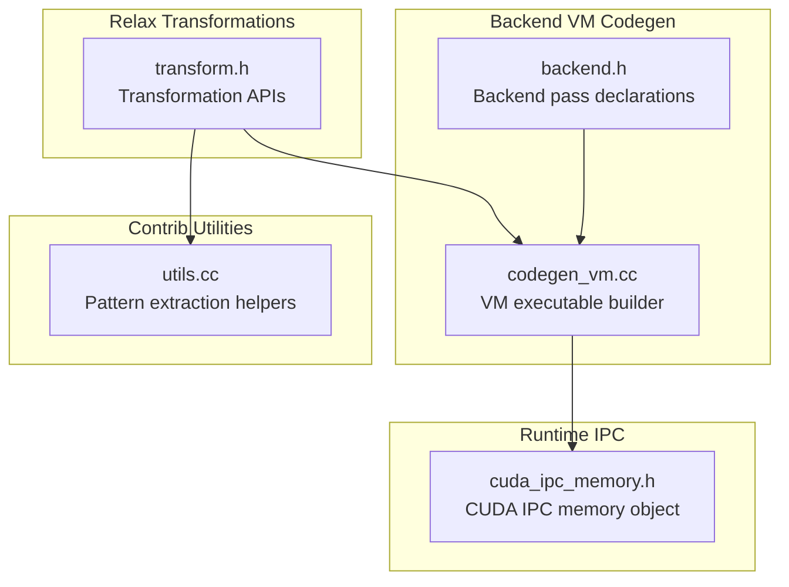
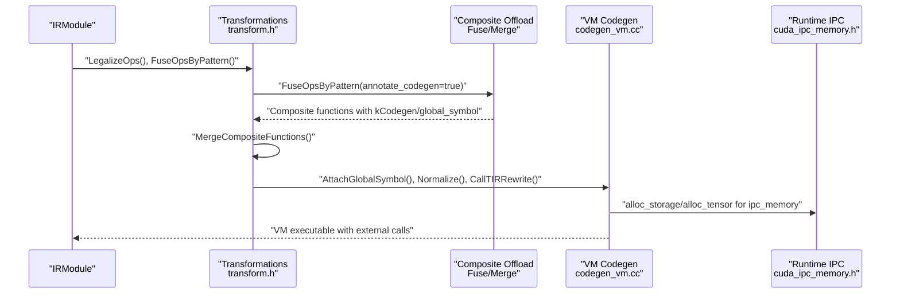
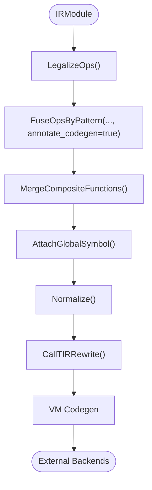
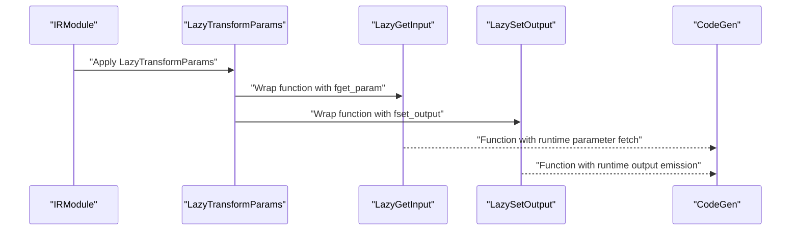
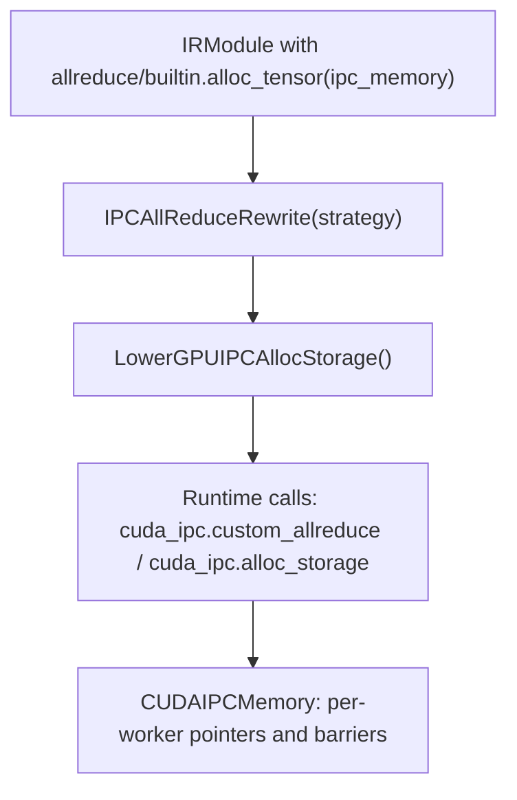
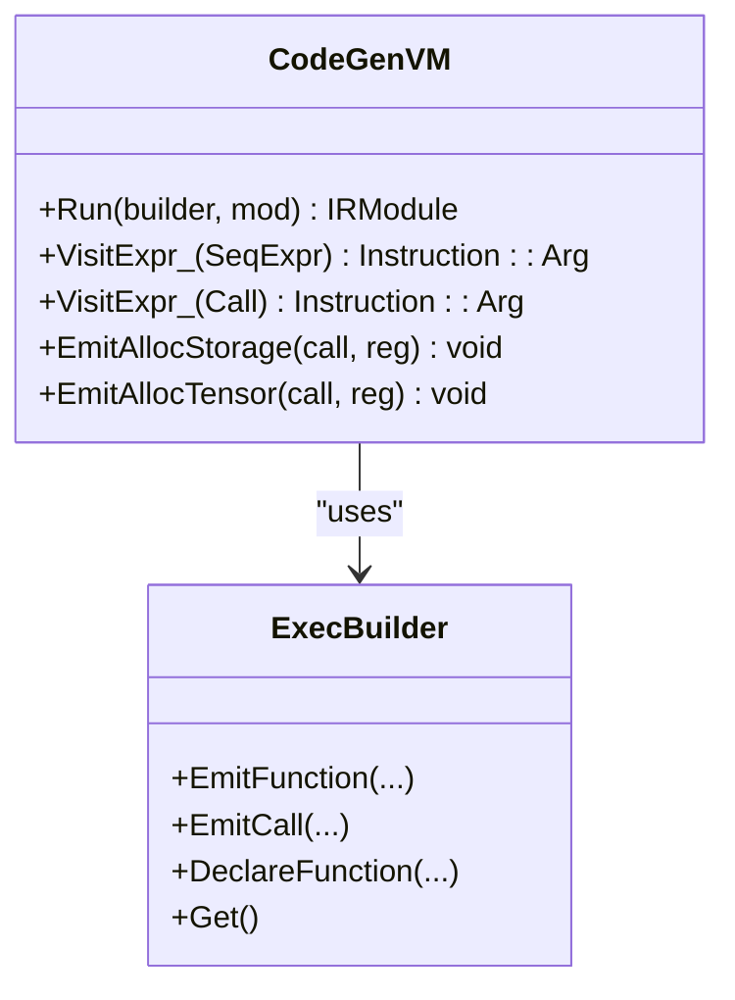
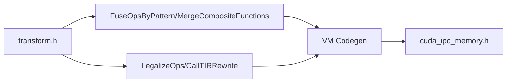

# Code Generation Preparation

<cite>
**Referenced Files in This Document**
- [transform.h](file://include/tvm/relax/transform.h)
- [backend.h](file://include/tvm/relax/backend.h)
- [codegen_vm.cc](file://src/relax/backend/vm/codegen_vm.cc)
- [utils.cc](file://src/relax/backend/contrib/utils.cc)
- [cuda_ipc_memory.h](file://include/tvm/runtime/disco/cuda_ipc_memory.h)
- [test_transform_lazy_transform_params.py](file://tests/python/relax/test_transform_lazy_transform_params.py)
- [test_transform_ipc_allreduce_rewrite.py](file://tests/python/relax/test_transform_ipc_allreduce_rewrite.py)
- [test_transform_lower_gpu_ipc_alloc_storage.py](file://tests/python/relax/test_transform_lower_gpu_ipc_alloc_storage.py)
</cite>

## Table of Contents
1. [Introduction](#introduction)
2. [Project Structure](#project-structure)
3. [Core Components](#core-components)
4. [Architecture Overview](#architecture-overview)
5. [Detailed Component Analysis](#detailed-component-analysis)
6. [Dependency Analysis](#dependency-analysis)
7. [Performance Considerations](#performance-considerations)
8. [Troubleshooting Guide](#troubleshooting-guide)
9. [Conclusion](#conclusion)
10. [Appendices](#appendices)

## Introduction
This document explains how TVM’s Relax IR is prepared for code generation via targeted transformations. It focuses on three pillars:
- External module attachment and composite function offloading
- Parameter lazy transformation for runtime-driven parameter loading/storing
- Distributed communication rewriting for inter-process communication (IPC) allreduce and GPU IPC storage allocation
It also covers how these transformations integrate with the code generation pipeline and how to debug and optimize for specific deployment targets.

## Project Structure
The relevant parts of the repository for code generation preparation are organized around:
- Relax transformation APIs and pass registry
- Backend-specific VM code generation
- Contributed backend utilities and pattern extraction
- Runtime components for GPU IPC memory and allreduce

**Diagram sources**
- [transform.h:1-688](file://include/tvm/relax/transform.h#L1-L688)
- [backend.h:27-48](file://include/tvm/relax/backend.h#L27-L48)
- [codegen_vm.cc:446-523](file://src/relax/backend/vm/codegen_vm.cc#L446-L523)
- [utils.cc:34-81](file://src/relax/backend/contrib/utils.cc#L34-L81)
- [cuda_ipc_memory.h:41-94](file://include/tvm/runtime/disco/cuda_ipc_memory.h#L41-L94)

**Section sources**
- [transform.h:1-688](file://include/tvm/relax/transform.h#L1-L688)
- [backend.h:27-48](file://include/tvm/relax/backend.h#L27-L48)

## Core Components
This section outlines the key transformation capabilities that prepare Relax modules for code generation and backend offloading.

- External module attachment and composite offloading
  - Composite function fusion and annotation for external backends
  - Merging composites into single offload units
  - Global symbol and codegen attribute propagation
  - Reference: [transform.h:535-564](file://include/tvm/relax/transform.h#L535-L564)

- Parameter lazy transformation
  - Lazy parameter retrieval and output emission via packed functions
  - Runtime-driven parameter lifecycle management
  - Reference: [lazy_transform_params.cc:250-284](file://src/relax/transform/lazy_transform_params.cc#L250-L284)

- Distributed communication rewriting
  - IPC-aware allreduce rewriting and GPU IPC storage lowering
  - Runtime integration via packed functions for custom collectives
  - Reference: [test_transform_ipc_allreduce_rewrite.py:45-127](file://tests/python/relax/test_transform_ipc_allreduce_rewrite.py#L45-L127), [test_transform_lower_gpu_ipc_alloc_storage.py:26-97](file://tests/python/relax/test_transform_lower_gpu_ipc_alloc_storage.py#L26-L97)

- Backend VM code generation
  - VM executable construction from Relax functions
  - Allocation and tensor operations mapped to VM builtins
  - Reference: [codegen_vm.cc:52-109](file://src/relax/backend/vm/codegen_vm.cc#L52-L109)

**Section sources**
- [transform.h:535-564](file://include/tvm/relax/transform.h#L535-L564)
- [codegen_vm.cc:52-109](file://src/relax/backend/vm/codegen_vm.cc#L52-L109)
- [test_transform_ipc_allreduce_rewrite.py:45-127](file://tests/python/relax/test_transform_ipc_allreduce_rewrite.py#L45-L127)
- [test_transform_lower_gpu_ipc_alloc_storage.py:26-97](file://tests/python/relax/test_transform_lower_gpu_ipc_alloc_storage.py#L26-L97)

## Architecture Overview
The preparation pipeline transforms a Relax module into a backend-ready form, integrating with external backends and runtime facilities.

**Diagram sources**
- [transform.h:535-564](file://include/tvm/relax/transform.h#L535-L564)
- [codegen_vm.cc:336-364](file://src/relax/backend/vm/codegen_vm.cc#L336-L364)
- [cuda_ipc_memory.h:81-94](file://include/tvm/runtime/disco/cuda_ipc_memory.h#L81-L94)

## Detailed Component Analysis

### External Module Attachment and Composite Offloading
- Purpose: Prepare Relax modules for external backend execution by grouping operators into composite functions and annotating them for offload.
- Key passes:
  - FuseOpsByPattern with annotate_codegen to wrap composites with codegen attributes and global symbols
  - MergeCompositeFunctions to consolidate composites into offload units
  - AttachGlobalSymbol and RunCodegen to finalize symbol resolution and backend invocation
- Backend integration:
  - Composites are annotated with kCodegen and global_symbol attributes to signal offload targets
  - VM codegen maps external functions to packed function calls

**Diagram sources**
- [transform.h:535-564](file://include/tvm/relax/transform.h#L535-L564)
- [codegen_vm.cc:446-448](file://src/relax/backend/vm/codegen_vm.cc#L446-L448)

**Section sources**
- [transform.h:535-564](file://include/tvm/relax/transform.h#L535-L564)
- [codegen_vm.cc:446-448](file://src/relax/backend/vm/codegen_vm.cc#L446-L448)

### Parameter Lazy Transformation
- Purpose: Defer parameter loading and output emission to runtime via packed functions, reducing cold-start costs and enabling flexible parameter management.
- Mechanism:
  - LazyGetInput/LazySetOutput transform functions to accept runtime callbacks for parameter retrieval and output emission
  - kNumInput attribute controls how many parameters are provided at runtime versus compiled-in
  - Outputs can be lazily emitted via fset_output callbacks
- Integration:
  - After lazy transformation, LegalizeOps and code generation proceed normally

**Diagram sources**
- [lazy_transform_params.cc:250-284](file://src/relax/transform/lazy_transform_params.cc#L250-L284)

**Section sources**
- [lazy_transform_params.cc:250-284](file://src/relax/transform/lazy_transform_params.cc#L250-L284)
- [test_transform_lazy_transform_params.py:628-761](file://tests/python/relax/test_transform_lazy_transform_params.py#L628-L761)

### Distributed Communication Rewriting (IPC Allreduce and GPU IPC Storage)
- Purpose: Optimize distributed allreduce and storage allocation for GPU IPC scenarios.
- IPC Allreduce Rewriting:
  - Rewrites allreduce calls to use runtime.disco.cuda_ipc.custom_allreduce when available
  - Ensures allocations use “ipc_memory” scope for efficient cross-GPU communication
- GPU IPC Storage Lowering:
  - Translates memory.alloc_storage and builtin.alloc_tensor with “ipc_memory” into runtime.disco.cuda_ipc.alloc_storage calls
- Runtime integration:
  - CUDAIPCMemory encapsulates per-worker data pointers and barrier signals for efficient collectives

**Diagram sources**
- [test_transform_ipc_allreduce_rewrite.py:45-127](file://tests/python/relax/test_transform_ipc_allreduce_rewrite.py#L45-L127)
- [test_transform_lower_gpu_ipc_alloc_storage.py:26-97](file://tests/python/relax/test_transform_lower_gpu_ipc_alloc_storage.py#L26-L97)
- [cuda_ipc_memory.h:41-94](file://include/tvm/runtime/disco/cuda_ipc_memory.h#L41-L94)

**Section sources**
- [test_transform_ipc_allreduce_rewrite.py:45-127](file://tests/python/relax/test_transform_ipc_allreduce_rewrite.py#L45-L127)
- [test_transform_lower_gpu_ipc_alloc_storage.py:26-97](file://tests/python/relax/test_transform_lower_gpu_ipc_alloc_storage.py#L26-L97)
- [cuda_ipc_memory.h:41-94](file://include/tvm/runtime/disco/cuda_ipc_memory.h#L41-L94)

### Backend VM Code Generation Integration
- Purpose: Translate Relax IR into a VM executable suitable for deployment.
- Key steps:
  - Ensure global symbols and normalization
  - Rewrite call_tir and shape lowering
  - Emit VM instructions for allocation, tensor operations, and function calls
- External module linkage:
  - Link external libraries and constant loaders into the final executable

**Diagram sources**
- [codegen_vm.cc:52-109](file://src/relax/backend/vm/codegen_vm.cc#L52-L109)
- [codegen_vm.cc:336-364](file://src/relax/backend/vm/codegen_vm.cc#L336-L364)

**Section sources**
- [codegen_vm.cc:52-109](file://src/relax/backend/vm/codegen_vm.cc#L52-L109)
- [codegen_vm.cc:446-523](file://src/relax/backend/vm/codegen_vm.cc#L446-L523)

## Dependency Analysis
- Transformation-to-backend dependencies:
  - Composite offloading depends on pattern-based fusion and merging
  - VM code generation depends on global symbol attachment and call_tir rewriting
- Runtime IPC dependencies:
  - IPC allreduce and storage lowering depend on runtime availability of custom collective and allocator functions
  - CUDAIPCMemory provides the runtime abstraction for per-worker memory and barriers

**Diagram sources**
- [transform.h:535-564](file://include/tvm/relax/transform.h#L535-L564)
- [codegen_vm.cc:446-448](file://src/relax/backend/vm/codegen_vm.cc#L446-L448)
- [cuda_ipc_memory.h:81-94](file://include/tvm/runtime/disco/cuda_ipc_memory.h#L81-L94)

**Section sources**
- [transform.h:535-564](file://include/tvm/relax/transform.h#L535-L564)
- [codegen_vm.cc:446-448](file://src/relax/backend/vm/codegen_vm.cc#L446-L448)
- [cuda_ipc_memory.h:81-94](file://include/tvm/runtime/disco/cuda_ipc_memory.h#L81-L94)

## Performance Considerations
- Reduce memory footprint:
  - Use StaticPlanBlockMemory to reuse allocations and minimize peak memory
  - Prefer “ipc_memory” allocations for cross-GPU communication to avoid host transfers
- Improve fusion coverage:
  - FuseOpsByPattern with annotate_codegen enables backend offload of fused regions
  - MergeCompositeFunctions reduces call overhead for small composites
- Optimize parameter lifecycle:
  - LazyTransformParams defers parameter loading until needed, reducing warm-up time
- VM code generation:
  - CanonicalizeBindings and DeadCodeElimination reduce redundant bindings and dead code before VM emission

[No sources needed since this section provides general guidance]

## Troubleshooting Guide
- Composite offload not triggered:
  - Verify FuseOpsByPattern is applied with annotate_codegen and that MergeCompositeFunctions runs afterward
  - Ensure functions have global_symbol attributes and kCodegen annotations
  - References: [transform.h:535-564](file://include/tvm/relax/transform.h#L535-L564)
- IPC allreduce not applied:
  - Confirm runtime.disco.cuda_ipc.custom_allreduce exists; otherwise rewrite will be skipped
  - Check that allocations use “ipc_memory” scope
  - References: [test_transform_ipc_allreduce_rewrite.py:45-127](file://tests/python/relax/test_transform_ipc_allreduce_rewrite.py#L45-L127)
- GPU IPC storage lowering fails:
  - Ensure memory.alloc_storage or builtin.alloc_tensor uses “ipc_memory”
  - Verify runtime.disco.cuda_ipc.alloc_storage is available
  - References: [test_transform_lower_gpu_ipc_alloc_storage.py:26-97](file://tests/python/relax/test_transform_lower_gpu_ipc_alloc_storage.py#L26-L97)
- VM codegen errors:
  - Ensure AttachGlobalSymbol is applied before VM codegen
  - Check that call_tir is rewritten and shape expressions are lowered
  - References: [codegen_vm.cc:52-109](file://src/relax/backend/vm/codegen_vm.cc#L52-L109)

**Section sources**
- [transform.h:535-564](file://include/tvm/relax/transform.h#L535-L564)
- [test_transform_ipc_allreduce_rewrite.py:45-127](file://tests/python/relax/test_transform_ipc_allreduce_rewrite.py#L45-L127)
- [test_transform_lower_gpu_ipc_alloc_storage.py:26-97](file://tests/python/relax/test_transform_lower_gpu_ipc_alloc_storage.py#L26-L97)
- [codegen_vm.cc:52-109](file://src/relax/backend/vm/codegen_vm.cc#L52-L109)

## Conclusion
Code generation preparation in TVM’s Relax stack hinges on three pillars:
- External module attachment and composite offloading for backend specialization
- Parameter lazy transformation for flexible runtime parameter management
- Distributed communication rewriting for efficient GPU IPC allreduce and storage
These transformations integrate tightly with VM code generation and runtime facilities, enabling robust deployment across diverse hardware targets.

[No sources needed since this section summarizes without analyzing specific files]

## Appendices

### Backend-Specific Preparation Steps
- CPU/GPU targets:
  - LegalizeOps, FuseOpsByPattern with annotate_codegen, MergeCompositeFunctions, AttachGlobalSymbol, CallTIRRewrite, RunCodegen
  - References: [transform.h:254-256](file://include/tvm/relax/transform.h#L254-L256), [transform.h:535-564](file://include/tvm/relax/transform.h#L535-L564)
- VM deployment:
  - Normalize, AttachGlobalSymbol, CallTIRRewrite, VM codegen, linking external modules
  - References: [codegen_vm.cc:446-523](file://src/relax/backend/vm/codegen_vm.cc#L446-L523)
- Distributed training:
  - IPCAllReduceRewrite, LowerGPUIPCAllocStorage, CUDAIPCMemory integration
  - References: [test_transform_ipc_allreduce_rewrite.py:45-127](file://tests/python/relax/test_transform_ipc_allreduce_rewrite.py#L45-L127), [test_transform_lower_gpu_ipc_alloc_storage.py:26-97](file://tests/python/relax/test_transform_lower_gpu_ipc_alloc_storage.py#L26-L97), [cuda_ipc_memory.h:41-94](file://include/tvm/runtime/disco/cuda_ipc_memory.h#L41-L94)

**Section sources**
- [transform.h:254-256](file://include/tvm/relax/transform.h#L254-L256)
- [transform.h:535-564](file://include/tvm/relax/transform.h#L535-L564)
- [codegen_vm.cc:446-523](file://src/relax/backend/vm/codegen_vm.cc#L446-L523)
- [test_transform_ipc_allreduce_rewrite.py:45-127](file://tests/python/relax/test_transform_ipc_allreduce_rewrite.py#L45-L127)
- [test_transform_lower_gpu_ipc_alloc_storage.py:26-97](file://tests/python/relax/test_transform_lower_gpu_ipc_alloc_storage.py#L26-L97)
- [cuda_ipc_memory.h:41-94](file://include/tvm/runtime/disco/cuda_ipc_memory.h#L41-L94)