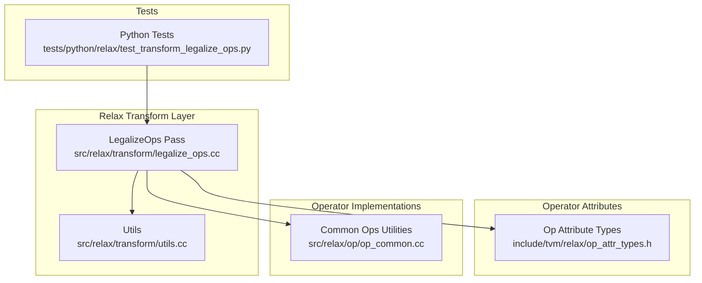
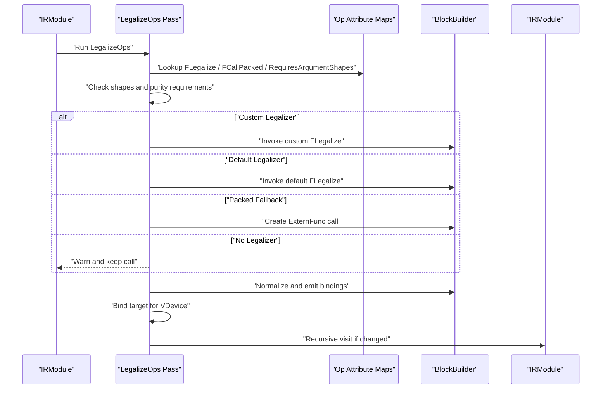
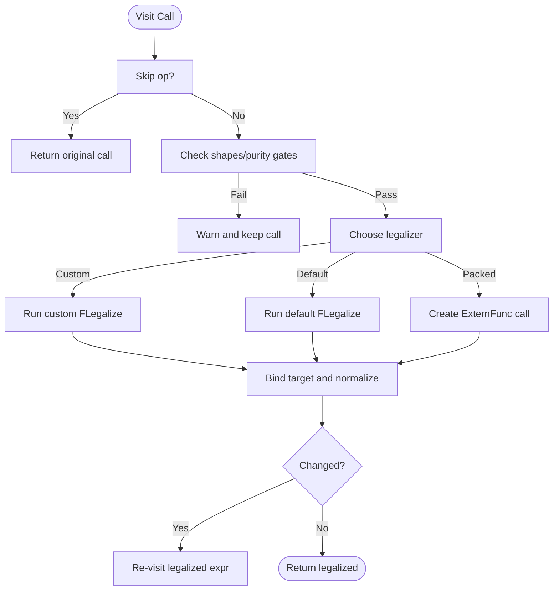
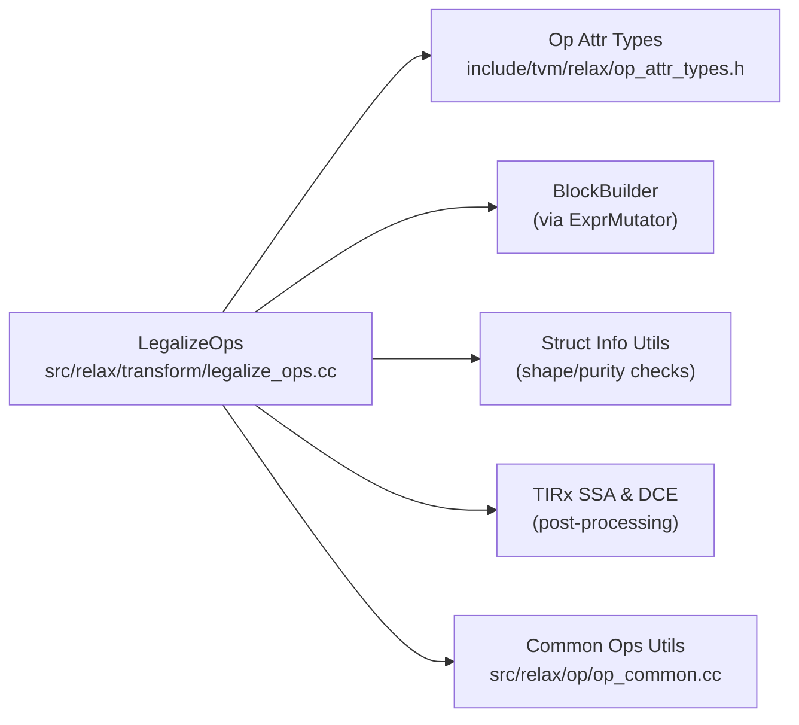

# Legalization Passes

<cite>
**Referenced Files in This Document**
- [legalize_ops.cc](file://src/relax/transform/legalize_ops.cc)
- [op_attr_types.h](file://include/tvm/relax/op_attr_types.h)
- [op_common.cc](file://src/relax/op/op_common.cc)
- [utils.cc](file://src/relax/transform/utils.cc)
- [test_transform_legalize_ops.py](file://tests/python/relax/test_transform_legalize_ops.py)
- [relax_vm.rst](file://docs/arch/relax_vm.rst)
</cite>

## Table of Contents
1. [Introduction](#introduction)
2. [Project Structure](#project-structure)
3. [Core Components](#core-components)
4. [Architecture Overview](#architecture-overview)
5. [Detailed Component Analysis](#detailed-component-analysis)
6. [Dependency Analysis](#dependency-analysis)
7. [Performance Considerations](#performance-considerations)
8. [Troubleshooting Guide](#troubleshooting-guide)
9. [Conclusion](#conclusion)

## Introduction
This document explains Relax legalization passes: how high-level operators are transformed into target-specific implementations, the legalizer framework architecture, operator dispatch mechanism, and backend-specific implementations. It covers built-in legalizers for arithmetic operations, neural network layers, and data manipulation, and provides guidance on implementing custom legalizers, handling operator fallback chains, debugging legalization failures, and understanding the relationship between legalization and code generation backends.

## Project Structure
Legalization is implemented as a Relax pass that traverses IR modules and replaces high-level operator calls with concrete implementations (typically call_tir to TIR PrimFuncs). The pass integrates with operator attributes to select the appropriate legalizer and ensures purity and target annotations are handled correctly.

**Diagram sources**
- [legalize_ops.cc:234-392](file://src/relax/transform/legalize_ops.cc#L234-L392)
- [op_attr_types.h:111-125](file://include/tvm/relax/op_attr_types.h#L111-L125)
- [op_common.cc:27-82](file://src/relax/op/op_common.cc#L27-L82)
- [utils.cc:27-96](file://src/relax/transform/utils.cc#L27-L96)
- [test_transform_legalize_ops.py:31-166](file://tests/python/relax/test_transform_legalize_ops.py#L31-L166)

**Section sources**
- [legalize_ops.cc:1-438](file://src/relax/transform/legalize_ops.cc#L1-L438)
- [op_attr_types.h:1-151](file://include/tvm/relax/op_attr_types.h#L1-L151)
- [op_common.cc:1-212](file://src/relax/op/op_common.cc#L1-L212)
- [utils.cc:1-96](file://src/relax/transform/utils.cc#L1-L96)
- [test_transform_legalize_ops.py:1-357](file://tests/python/relax/test_transform_legalize_ops.py#L1-L357)

## Core Components
- LegalizeOps pass: Traverses Relax IR, dispatches to operator-specific legalizers, and lowers to call_tir with TIR PrimFuncs. It supports custom legalizers, packed-function fallbacks, purity wrapping, and target attribute propagation for VDevice annotations.
- Operator attribute types: Define the function signatures for operator metadata such as struct info inference, normalization/validation, and the primary legalizer.
- Common op utilities: Provide helpers for argument validation, shape inference, and layout decisions used by many legalizers.
- Tests: Demonstrate custom legalizer registration, recursive legalization, and preservation of scalar dtypes.

Key responsibilities:
- Dispatch logic and fallback chain selection
- Shape and purity requirements enforcement
- Recursive legalization until fixed point
- Target-aware PrimFunc binding for VDevice

**Section sources**
- [legalize_ops.cc:63-104](file://src/relax/transform/legalize_ops.cc#L63-L104)
- [op_attr_types.h:111-125](file://include/tvm/relax/op_attr_types.h#L111-L125)
- [op_common.cc:38-82](file://src/relax/op/op_common.cc#L38-L82)
- [test_transform_legalize_ops.py:31-166](file://tests/python/relax/test_transform_legalize_ops.py#L31-L166)

## Architecture Overview
The legalizer framework is centered around operator attributes and a pass that mutates Relax IR. Operators declare capabilities via attributes (e.g., struct info inference, legalizer function, packed-function fallback, purity). The LegalizeOps pass evaluates per-call constraints and selects the most specific legalizer available.

**Diagram sources**
- [legalize_ops.cc:234-392](file://src/relax/transform/legalize_ops.cc#L234-L392)
- [op_attr_types.h:111-125](file://include/tvm/relax/op_attr_types.h#L111-L125)

## Detailed Component Analysis

### LegalizeOps Pass
The pass transforms an IRModule by visiting each function and replacing operator calls with target-specific implementations. It enforces shape and purity constraints, supports custom legalizers, and ensures generated PrimFuncs carry appropriate target annotations for VDevice.

Key behaviors:
- Shape requirement gating: Operators may require argument shapes and/or return shape to be known. Data-dependent operators are exempt from return shape requirement.
- Fallback chain: Custom legalizer map, default legalizer map, explicit packed-function replacement, or warning and no-op.
- Purity handling: If an original operator is pure but the legalized result is not, the pass wraps the call to preserve purity semantics.
- Target propagation: When VDevice annotations are present, the pass ensures generated PrimFuncs are annotated appropriately and calls are rebound to the correct GlobalVar.

**Diagram sources**
- [legalize_ops.cc:234-392](file://src/relax/transform/legalize_ops.cc#L234-L392)

**Section sources**
- [legalize_ops.cc:47-61](file://src/relax/transform/legalize_ops.cc#L47-L61)
- [legalize_ops.cc:109-147](file://src/relax/transform/legalize_ops.cc#L109-L147)
- [legalize_ops.cc:149-232](file://src/relax/transform/legalize_ops.cc#L149-L232)
- [legalize_ops.cc:234-392](file://src/relax/transform/legalize_ops.cc#L234-L392)

### Operator Attribute Types
Operator attributes define the contract between operators and the legalizer framework:
- FInferStructInfo: Computes output struct info from inputs.
- FLegalize: Lowers a call to concrete implementations (often call_tir).
- FCallPacked: Explicitly maps an operator to a packed function.
- FNormalize/FValidate: Normalization/validation hooks (used elsewhere in Relax).
- FPurity: Indicates whether an operator is pure.

These types are used by the pass to dispatch and validate legalizations.

**Section sources**
- [op_attr_types.h:56-125](file://include/tvm/relax/op_attr_types.h#L56-L125)

### Common Legalizer Utilities
Utilities support common validation and inference tasks used by many legalizers:
- Argument count and type checks for tensor inputs
- Binary broadcasting shape inference
- Axis normalization for reduction-like ops
- Layout inference helpers

These utilities streamline legalizer implementations and reduce duplication.

**Section sources**
- [op_common.cc:27-82](file://src/relax/op/op_common.cc#L27-L82)
- [op_common.cc:109-147](file://src/relax/op/op_common.cc#L109-L147)
- [op_common.cc:149-178](file://src/relax/op/op_common.cc#L149-L178)

### Built-in Legalizers and Backends
Built-in legalizers are registered as operator attributes and typically lower to call_tir with TIR PrimFuncs. Backend-specific implementations are integrated through:
- Target annotations on PrimFuncs and VDevice StructInfo
- Passes that generate device-specific kernels
- Pattern registries and backend adapters

While the pass itself is generic, backend-specific code generation backends consume the legalized IR and produce executable kernels.

**Section sources**
- [legalize_ops.cc:149-232](file://src/relax/transform/legalize_ops.cc#L149-L232)
- [relax_vm.rst:94-126](file://docs/arch/relax_vm.rst#L94-L126)

### Implementing Custom Legalizers
To implement a custom legalizer:
- Register a function under the operator’s FLegalize attribute.
- Optionally register FInferStructInfo for output shape/type inference.
- Optionally mark FPurity if the operation is pure.
- Use the BlockBuilder to emit intermediate bindings and return a simplified expression.

The pass supports recursive legalization, so returning additional operator calls will be processed automatically.

**Section sources**
- [test_transform_legalize_ops.py:31-166](file://tests/python/relax/test_transform_legalize_ops.py#L31-L166)
- [test_transform_legalize_ops.py:314-335](file://tests/python/relax/test_transform_legalize_ops.py#L314-L335)
- [op_attr_types.h:111-125](file://include/tvm/relax/op_attr_types.h#L111-L125)

### Handling Operator Fallback Chains
Fallback chain precedence:
1. Custom legalizer map (per-operator override)
2. Default legalizer map (built-in operator lowering)
3. Packed-function fallback (explicit mapping)
4. Warning and no-op (if shape/purity requirements not met)

The pass logs warnings when no legalizer is found and shapes/return info are missing.

**Section sources**
- [legalize_ops.cc:234-347](file://src/relax/transform/legalize_ops.cc#L234-L347)

### Debugging Legalization Failures
Common failure modes and remedies:
- Missing known shapes: Ensure argument shapes and return shape (unless data-dependent) are known. The pass will warn and skip.
- Missing legalizer: Register FLegalize for the operator or provide a packed-function fallback.
- Purity mismatch: If the original operator is pure but the legalized result is not, the pass wraps it. Verify FPurity is set correctly.
- Target mismatch: When VDevice annotations are present, ensure generated PrimFuncs carry compatible target attributes.

**Section sources**
- [legalize_ops.cc:254-347](file://src/relax/transform/legalize_ops.cc#L254-L347)
- [legalize_ops.cc:109-147](file://src/relax/transform/legalize_ops.cc#L109-L147)
- [legalize_ops.cc:149-232](file://src/relax/transform/legalize_ops.cc#L149-L232)

## Dependency Analysis
The LegalizeOps pass depends on:
- Operator attribute maps for dispatch
- BlockBuilder for emitting bindings and normalizing expressions
- Structural info utilities for shape/purity checks
- TIRx SSA conversion and dead-code elimination for cleanup after target propagation

**Diagram sources**
- [legalize_ops.cc:234-392](file://src/relax/transform/legalize_ops.cc#L234-L392)
- [op_attr_types.h:111-125](file://include/tvm/relax/op_attr_types.h#L111-L125)
- [op_common.cc:27-82](file://src/relax/op/op_common.cc#L27-L82)

**Section sources**
- [legalize_ops.cc:80-104](file://src/relax/transform/legalize_ops.cc#L80-L104)
- [legalize_ops.cc:234-392](file://src/relax/transform/legalize_ops.cc#L234-L392)

## Performance Considerations
- Recursive legalization: The pass re-visits expressions after legalizing to handle chains of operators. Keep custom legalizers minimal and focused to avoid excessive reprocessing.
- Target propagation: When VDevice annotations are present, the pass may duplicate PrimFuncs and trigger dead-code elimination and SSA conversion. This improves correctness but adds overhead.
- Shape inference: Operators that require known shapes can short-circuit legalization, preventing unnecessary work.

[No sources needed since this section provides general guidance]

## Troubleshooting Guide
- Shape/purity warnings: If the pass warns about missing shapes or purity, ensure struct info is fully known and FPurity is set appropriately.
- No legalizer found: Register FLegalize or provide a packed-function fallback for the operator.
- Unexpected recursion: Verify custom legalizers do not indefinitely emit the same operator; rely on the pass’s built-in recursion guard.
- Backend mismatch: Confirm generated PrimFuncs carry the correct target attribute and calls are rebound to the appropriate GlobalVar.

**Section sources**
- [legalize_ops.cc:254-347](file://src/relax/transform/legalize_ops.cc#L254-L347)
- [legalize_ops.cc:149-232](file://src/relax/transform/legalize_ops.cc#L149-L232)
- [test_transform_legalize_ops.py:337-357](file://tests/python/relax/test_transform_legalize_ops.py#L337-L357)

## Conclusion
Legalization is a central mechanism that bridges high-level Relax operators and backend-specific implementations. The LegalizeOps pass provides a robust dispatch and fallback system, integrates with operator attributes, and ensures purity and target correctness. By registering appropriate attributes and leveraging common utilities, developers can implement custom legalizers that integrate seamlessly with the broader compilation pipeline and backends.