# Optimization Passes

<cite>
**Referenced Files in This Document**
- [fuse_ops.cc](file://src/relax/transform/fuse_ops.cc)
- [dead_code_elimination.cc](file://src/relax/transform/dead_code_elimination.cc)
- [canonicalize_bindings.cc](file://src/relax/transform/canonicalize_bindings.cc)
- [eliminate_common_subexpr.cc](file://src/relax/transform/eliminate_common_subexpr.cc)
- [convert_layout.cc](file://src/relax/transform/convert_layout.cc)
- [rewrite_dataflow_reshape.cc](file://src/relax/transform/rewrite_dataflow_reshape.cc)
- [fold_constant.cc](file://src/relax/transform/fold_constant.cc)
- [fuse_tir.cc](file://src/relax/transform/fuse_tir.cc)
- [test_optimize_layout_transform.py](file://tests/python/relax/test_optimize_layout_transform.py)
</cite>

## Table of Contents
1. [Introduction](#introduction)
2. [Project Structure](#project-structure)
3. [Core Components](#core-components)
4. [Architecture Overview](#architecture-overview)
5. [Detailed Component Analysis](#detailed-component-analysis)
6. [Dependency Analysis](#dependency-analysis)
7. [Performance Considerations](#performance-considerations)
8. [Troubleshooting Guide](#troubleshooting-guide)
9. [Conclusion](#conclusion)
10. [Appendices](#appendices)

## Introduction
This document explains the Relax optimization passes in Apache TVM with a focus on layout transformation optimizations, redundant operation elimination, and computation fusion strategies. It covers the optimization pipeline architecture, pass ordering requirements, and dependency management. Specific optimizations include transpose-like layout conversions, reshape removal, and constant folding. Practical guidance is included for configuring optimization pipelines, measuring optimization impact, and troubleshooting side effects, along with performance profiling techniques.

## Project Structure
Relax optimization passes live under the Relax transform subsystem. Each pass is implemented as a pass function that transforms an IRModule or Function using visitors/mutators. Representative passes include:
- Operator fusion and grouping: fuse_ops.cc
- Dead code elimination: dead_code_elimination.cc
- Binding canonicalization: canonicalize_bindings.cc
- Common subexpression elimination: eliminate_common_subexpr.cc
- Layout conversion: convert_layout.cc
- Reshape rewrite: rewrite_dataflow_reshape.cc
- Constant folding: fold_constant.cc
- TIR fusion: fuse_tir.cc

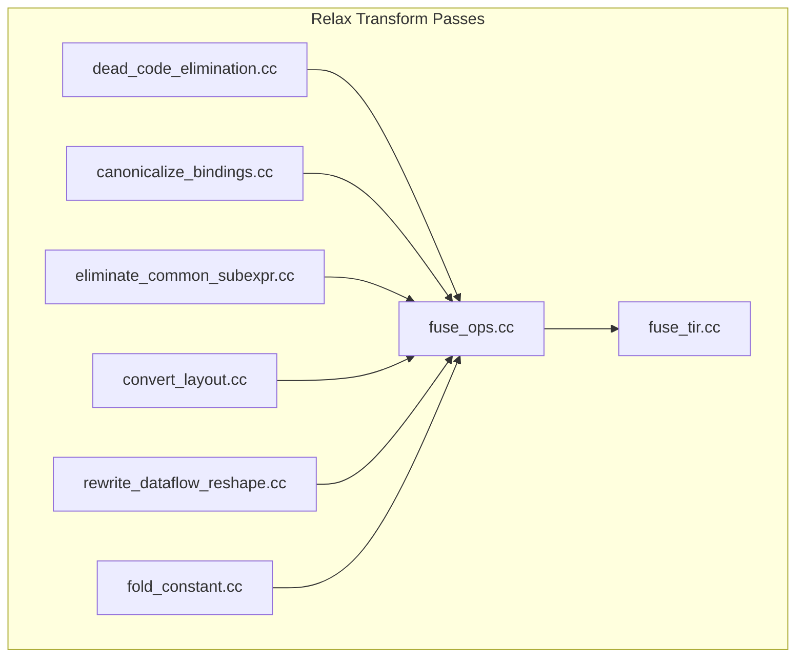

**Diagram sources**
- [fuse_ops.cc:1-1478](file://src/relax/transform/fuse_ops.cc#L1-L1478)
- [dead_code_elimination.cc:1-153](file://src/relax/transform/dead_code_elimination.cc#L1-L153)
- [canonicalize_bindings.cc:1-605](file://src/relax/transform/canonicalize_bindings.cc#L1-L605)
- [eliminate_common_subexpr.cc:1-236](file://src/relax/transform/eliminate_common_subexpr.cc#L1-L236)
- [convert_layout.cc:1-374](file://src/relax/transform/convert_layout.cc#L1-L374)
- [rewrite_dataflow_reshape.cc:1-178](file://src/relax/transform/rewrite_dataflow_reshape.cc#L1-L178)
- [fold_constant.cc:1-438](file://src/relax/transform/fold_constant.cc#L1-L438)
- [fuse_tir.cc:1-1331](file://src/relax/transform/fuse_tir.cc#L1-L1331)

**Section sources**
- [fuse_ops.cc:1-1478](file://src/relax/transform/fuse_ops.cc#L1-L1478)
- [dead_code_elimination.cc:1-153](file://src/relax/transform/dead_code_elimination.cc#L1-L153)
- [canonicalize_bindings.cc:1-605](file://src/relax/transform/canonicalize_bindings.cc#L1-L605)
- [eliminate_common_subexpr.cc:1-236](file://src/relax/transform/eliminate_common_subexpr.cc#L1-L236)
- [convert_layout.cc:1-374](file://src/relax/transform/convert_layout.cc#L1-L374)
- [rewrite_dataflow_reshape.cc:1-178](file://src/relax/transform/rewrite_dataflow_reshape.cc#L1-L178)
- [fold_constant.cc:1-438](file://src/relax/transform/fold_constant.cc#L1-L438)
- [fuse_tir.cc:1-1331](file://src/relax/transform/fuse_tir.cc#L1-L1331)

## Core Components
- Operator Fusion (FuseOps): Groups Relax bindings into composite functions guided by operator patterns and post-dominator analysis. It prepares functions for downstream TIR fusion.
- Dead Code Elimination (DCE): Removes unused bindings and functions to reduce IR size and improve subsequent optimizations.
- Binding Canonicalization: Simplifies trivial bindings and match-casts, reducing overhead and enabling further optimizations.
- Common Subexpression Elimination (CSE): Identifies repeated expressions and replaces them with trivial bindings.
- Layout Conversion (ConvertLayout): Infers and applies layout transformations (including transpose-like swaps) to align with target layouts.
- Reshape Rewrite: Converts dataflow reshape calls back to high-level reshape operators for later lowering.
- Constant Folding (FoldConstant): Evaluates constant-producing call_tir constructs and replaces them with constants when beneficial.
- TIR Fusion (FuseTIR): Fuses primitive Relax functions into a single TIR PrimFunc, enabling kernel-level optimizations.

**Section sources**
- [fuse_ops.cc:1-1478](file://src/relax/transform/fuse_ops.cc#L1-L1478)
- [dead_code_elimination.cc:1-153](file://src/relax/transform/dead_code_elimination.cc#L1-L153)
- [canonicalize_bindings.cc:1-605](file://src/relax/transform/canonicalize_bindings.cc#L1-L605)
- [eliminate_common_subexpr.cc:1-236](file://src/relax/transform/eliminate_common_subexpr.cc#L1-L236)
- [convert_layout.cc:1-374](file://src/relax/transform/convert_layout.cc#L1-L374)
- [rewrite_dataflow_reshape.cc:1-178](file://src/relax/transform/rewrite_dataflow_reshape.cc#L1-L178)
- [fold_constant.cc:1-438](file://src/relax/transform/fold_constant.cc#L1-L438)
- [fuse_tir.cc:1-1331](file://src/relax/transform/fuse_tir.cc#L1-L1331)

## Architecture Overview
The Relax optimization pipeline composes multiple passes. Typical recommended ordering:
1. Canonicalize bindings and match-casts
2. Dead code elimination
3. Common subexpression elimination
4. Layout conversion
5. Reshape rewrite
6. Operator fusion (FuseOps)
7. Constant folding
8. TIR fusion (FuseTIR)

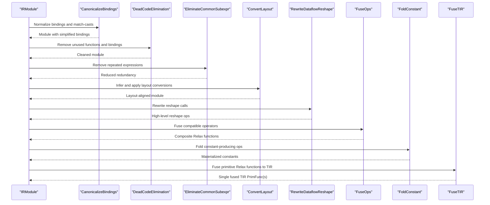

**Diagram sources**
- [canonicalize_bindings.cc:565-569](file://src/relax/transform/canonicalize_bindings.cc#L565-L569)
- [dead_code_elimination.cc:94-134](file://src/relax/transform/dead_code_elimination.cc#L94-L134)
- [eliminate_common_subexpr.cc:213-216](file://src/relax/transform/eliminate_common_subexpr.cc#L213-L216)
- [convert_layout.cc:348-353](file://src/relax/transform/convert_layout.cc#L348-L353)
- [rewrite_dataflow_reshape.cc:156-158](file://src/relax/transform/rewrite_dataflow_reshape.cc#L156-L158)
- [fuse_ops.cc:723-743](file://src/relax/transform/fuse_ops.cc#L723-L743)
- [fold_constant.cc:301-403](file://src/relax/transform/fold_constant.cc#L301-L403)
- [fuse_tir.cc:1298-1301](file://src/relax/transform/fuse_tir.cc#L1298-L1301)

## Detailed Component Analysis

### Operator Fusion (FuseOps)
FuseOps groups Relax bindings into composite functions using operator pattern analysis and post-dominator analysis. It builds an indexed forward graph, partitions groups, and emits grouped functions with appropriate parameters and outputs.

Key behaviors:
- Builds a graph from dataflow bindings and assigns operator patterns.
- Uses post-dominator analysis to decide fusion boundaries.
- Emits grouped functions with attributes marking them as primitive.
- Supports tuple parameter handling and partial tuple usage.

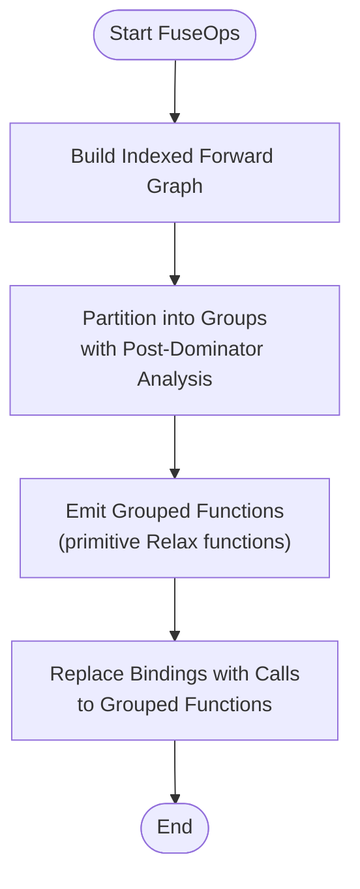

**Diagram sources**
- [fuse_ops.cc:111-137](file://src/relax/transform/fuse_ops.cc#L111-L137)
- [fuse_ops.cc:715-756](file://src/relax/transform/fuse_ops.cc#L715-L756)
- [fuse_ops.cc:783-786](file://src/relax/transform/fuse_ops.cc#L783-L786)
- [fuse_ops.cc:794-800](file://src/relax/transform/fuse_ops.cc#L794-L800)

**Section sources**
- [fuse_ops.cc:56-94](file://src/relax/transform/fuse_ops.cc#L56-L94)
- [fuse_ops.cc:102-374](file://src/relax/transform/fuse_ops.cc#L102-L374)
- [fuse_ops.cc:376-675](file://src/relax/transform/fuse_ops.cc#L376-L675)
- [fuse_ops.cc:693-800](file://src/relax/transform/fuse_ops.cc#L693-L800)

### Dead Code Elimination (DCE)
DCE removes unused functions and unused local bindings. It performs two passes:
- Remove unused functions by tracing call chains from entry functions.
- Remove unused variables per function.
- Re-run unused function removal to account for changes.

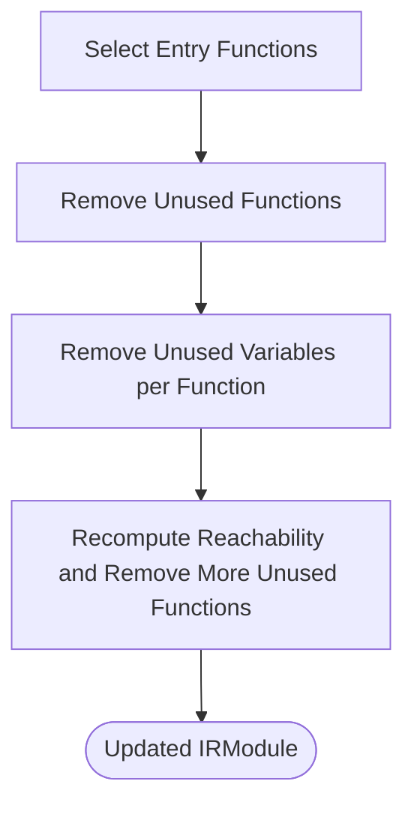

**Diagram sources**
- [dead_code_elimination.cc:94-134](file://src/relax/transform/dead_code_elimination.cc#L94-L134)

**Section sources**
- [dead_code_elimination.cc:47-92](file://src/relax/transform/dead_code_elimination.cc#L47-L92)
- [dead_code_elimination.cc:94-134](file://src/relax/transform/dead_code_elimination.cc#L94-L134)

### Binding Canonicalization
Two complementary passes:
- CanonicalizeTIRVariables: Rewrites symbolic variables consistently across branches and match-casts.
- CanonicalizeRelaxBindings: Removes trivial bindings and match-casts, and prunes dataflow-only bindings that solely serve as outputs.

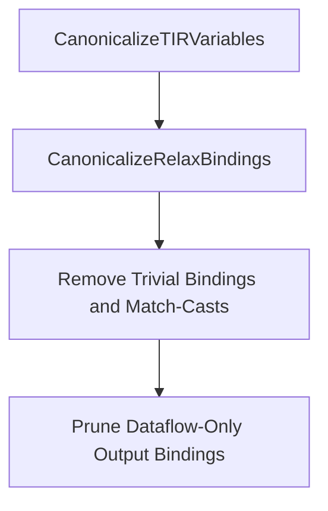

**Diagram sources**
- [canonicalize_bindings.cc:561-569](file://src/relax/transform/canonicalize_bindings.cc#L561-L569)

**Section sources**
- [canonicalize_bindings.cc:38-144](file://src/relax/transform/canonicalize_bindings.cc#L38-L144)
- [canonicalize_bindings.cc:146-558](file://src/relax/transform/canonicalize_bindings.cc#L146-L558)
- [canonicalize_bindings.cc:561-569](file://src/relax/transform/canonicalize_bindings.cc#L561-L569)

### Common Subexpression Elimination (CSE)
CSE detects repeated expressions and replaces later bindings with trivial bindings to reused variables. It avoids deduplicating impure or allocator calls and supports a call-only mode.

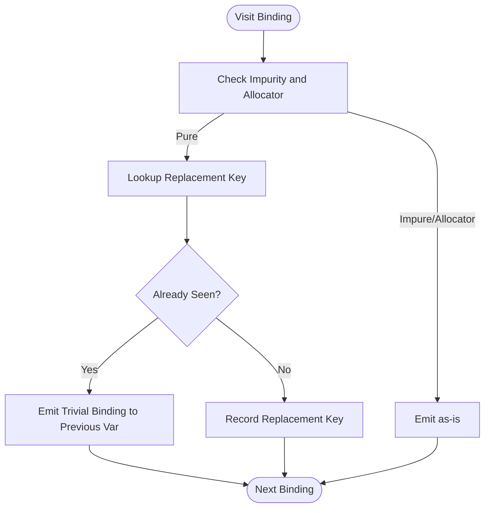

**Diagram sources**
- [eliminate_common_subexpr.cc:91-210](file://src/relax/transform/eliminate_common_subexpr.cc#L91-L210)

**Section sources**
- [eliminate_common_subexpr.cc:39-84](file://src/relax/transform/eliminate_common_subexpr.cc#L39-L84)
- [eliminate_common_subexpr.cc:91-210](file://src/relax/transform/eliminate_common_subexpr.cc#L91-L210)

### Layout Conversion (ConvertLayout)
ConvertLayout infers desired layouts per operator and rewrites inputs/outputs to match. It supports:
- Axis-swapping conversions via permute_dims.
- General layout transformations via layout_transform with IndexMap.
- Default policy fallback and custom layout callbacks.

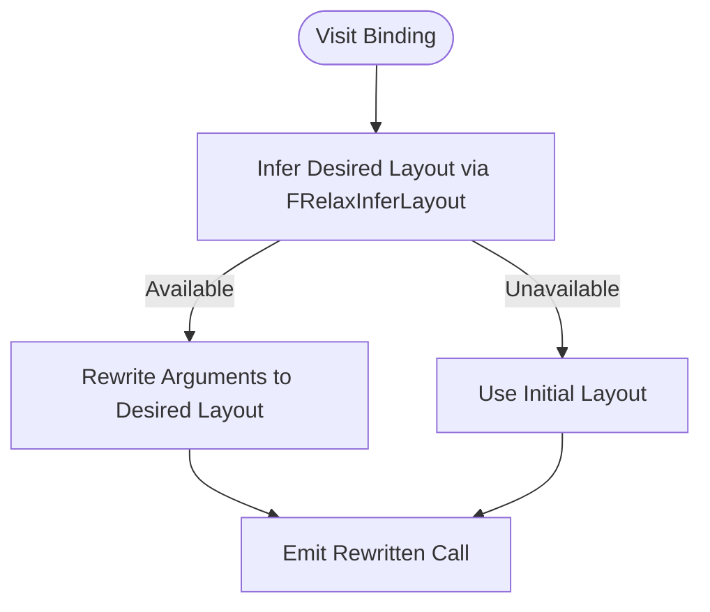

**Diagram sources**
- [convert_layout.cc:202-272](file://src/relax/transform/convert_layout.cc#L202-L272)

**Section sources**
- [convert_layout.cc:80-346](file://src/relax/transform/convert_layout.cc#L80-L346)
- [convert_layout.cc:348-353](file://src/relax/transform/convert_layout.cc#L348-L353)

### Reshape Rewrite (RewriteDataflowReshape)
Rewrites reshape calls originating from fused TIR PrimFuncs back to high-level reshape operators, ensuring element counts match and dtype compatibility.

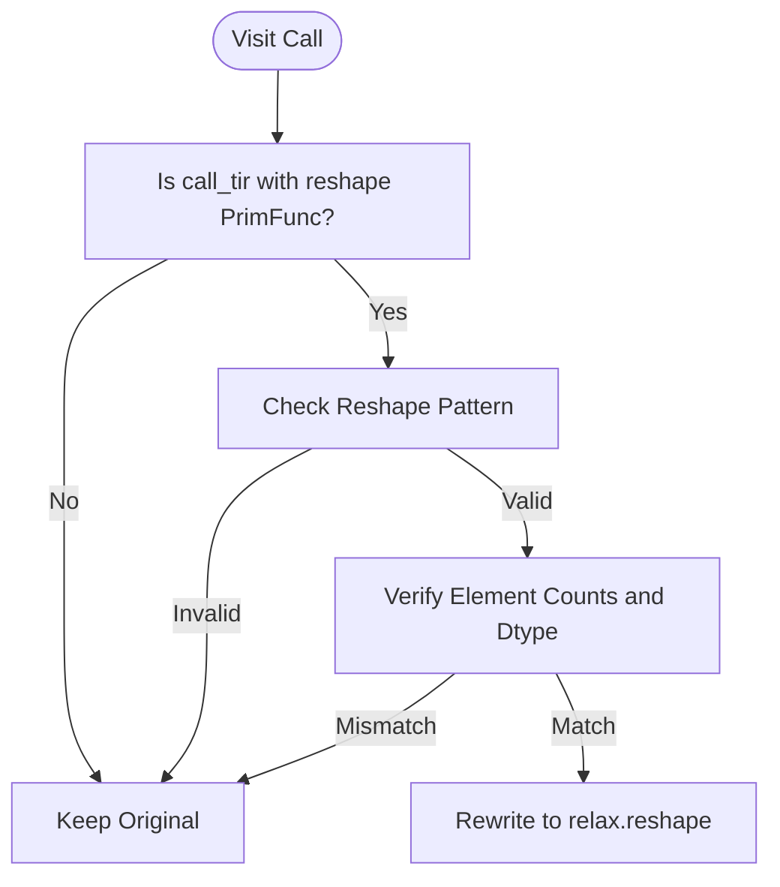

**Diagram sources**
- [rewrite_dataflow_reshape.cc:110-151](file://src/relax/transform/rewrite_dataflow_reshape.cc#L110-L151)

**Section sources**
- [rewrite_dataflow_reshape.cc:52-154](file://src/relax/transform/rewrite_dataflow_reshape.cc#L52-L154)

### Constant Folding (FoldConstant)
Folds constant-producing call_tir constructs into constants when beneficial. It evaluates small outputs and avoids large constant materialization for creation-only ops.

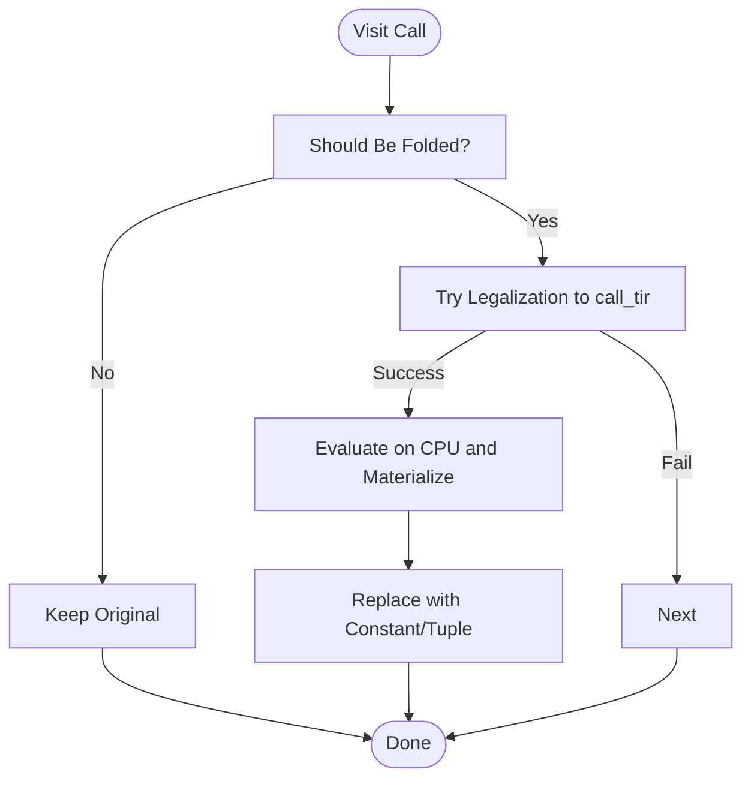

**Diagram sources**
- [fold_constant.cc:269-293](file://src/relax/transform/fold_constant.cc#L269-L293)
- [fold_constant.cc:301-403](file://src/relax/transform/fold_constant.cc#L301-L403)

**Section sources**
- [fold_constant.cc:34-438](file://src/relax/transform/fold_constant.cc#L34-L438)

### TIR Fusion (FuseTIR)
FuseTIR converts primitive Relax functions into a single TIR PrimFunc. It:
- Renames and reuses symbolic variables deterministically.
- Substitutes buffers across fused blocks.
- Handles in-place outputs and output buffer allocation.
- Updates non-primitive Relax functions to call the fused TIR.

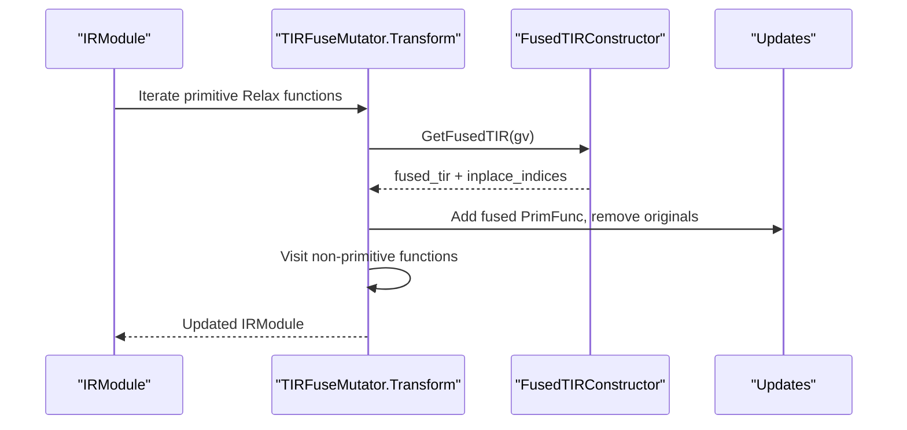

**Diagram sources**
- [fuse_tir.cc:1123-1180](file://src/relax/transform/fuse_tir.cc#L1123-L1180)
- [fuse_tir.cc:534-548](file://src/relax/transform/fuse_tir.cc#L534-L548)
- [fuse_tir.cc:1298-1301](file://src/relax/transform/fuse_tir.cc#L1298-L1301)

**Section sources**
- [fuse_tir.cc:412-413](file://src/relax/transform/fuse_tir.cc#L412-L413)
- [fuse_tir.cc:526-548](file://src/relax/transform/fuse_tir.cc#L526-L548)
- [fuse_tir.cc:1123-1180](file://src/relax/transform/fuse_tir.cc#L1123-L1180)
- [fuse_tir.cc:1298-1301](file://src/relax/transform/fuse_tir.cc#L1298-L1301)

## Dependency Analysis
- FuseOps depends on operator pattern attributes and post-dominator analysis; it emits primitive Relax functions intended for FuseTIR.
- DCE reduces IR size and removes dead functions/bindings, improving correctness and performance of subsequent passes.
- CanonicalizeBindings and CSE prepare the IR for fusion by simplifying structure and removing redundancy.
- ConvertLayout influences downstream fusion by aligning layouts, reducing extra layout-transform nodes.
- RewriteDataflowReshape ensures reshape semantics are preserved at the high level before fusion.
- FoldConstant reduces runtime overhead by materializing small constants.
- FuseTIR consumes primitive Relax functions produced by FuseOps and lowers them to efficient TIR kernels.

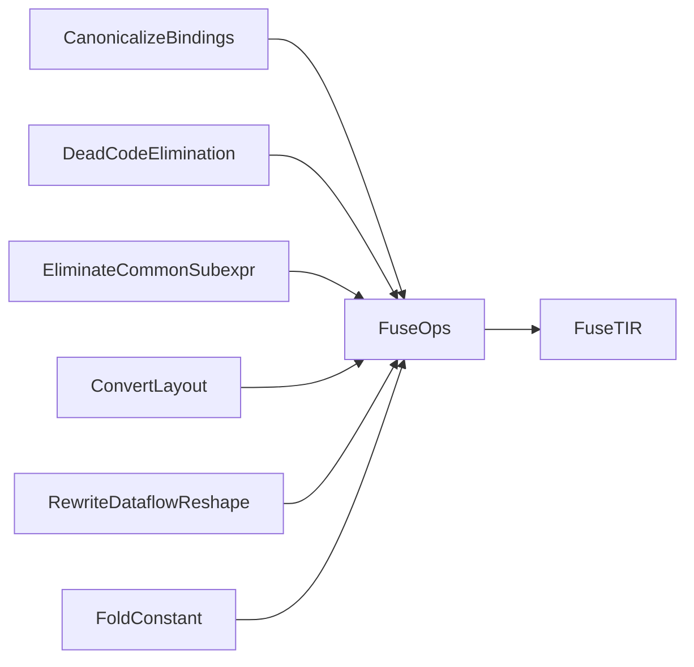

**Diagram sources**
- [canonicalize_bindings.cc:588-594](file://src/relax/transform/canonicalize_bindings.cc#L588-L594)
- [dead_code_elimination.cc:94-134](file://src/relax/transform/dead_code_elimination.cc#L94-L134)
- [eliminate_common_subexpr.cc:213-216](file://src/relax/transform/eliminate_common_subexpr.cc#L213-L216)
- [convert_layout.cc:357-364](file://src/relax/transform/convert_layout.cc#L357-L364)
- [rewrite_dataflow_reshape.cc:162-167](file://src/relax/transform/rewrite_dataflow_reshape.cc#L162-L167)
- [fuse_ops.cc:723-743](file://src/relax/transform/fuse_ops.cc#L723-L743)
- [fuse_tir.cc:1298-1301](file://src/relax/transform/fuse_tir.cc#L1298-L1301)
- [fold_constant.cc:422-427](file://src/relax/transform/fold_constant.cc#L422-L427)

**Section sources**
- [fuse_ops.cc:723-743](file://src/relax/transform/fuse_ops.cc#L723-L743)
- [fuse_tir.cc:1298-1301](file://src/relax/transform/fuse_tir.cc#L1298-L1301)

## Performance Considerations
- Prefer early canonicalization and CSE to reduce graph complexity before fusion.
- Use DCE to prune unused functions and bindings to minimize memory and compilation overhead.
- Layout alignment via ConvertLayout reduces extra layout-transform overhead and improves memory access patterns.
- Limit constant folding to small outputs to avoid bloating the compiled binary.
- FuseTIR yields significant kernel-level gains but requires schedulable TIR functions and careful handling of in-place outputs.

[No sources needed since this section provides general guidance]

## Troubleshooting Guide
Common issues and remedies:
- Unexpected layout mismatches after ConvertLayout: Verify operator-specific layout inference and ensure inputs have known dimensions.
- Incorrect fusion boundaries: Confirm operator patterns and post-dominator analysis results; consider adjusting pass ordering to canonicalize bindings first.
- Reshape rewrite not applied: Ensure the underlying PrimFunc matches the reshape pattern and element counts are preserved.
- Constant folding skipped: Review pass thresholds and ensure the output is not a large creation-only op.
- FuseTIR fails on unschedulable functions: Ensure the fused function body is a single root block and parameters are tensors/scalars as expected.

**Section sources**
- [convert_layout.cc:202-224](file://src/relax/transform/convert_layout.cc#L202-L224)
- [fuse_ops.cc:715-756](file://src/relax/transform/fuse_ops.cc#L715-L756)
- [rewrite_dataflow_reshape.cc:110-151](file://src/relax/transform/rewrite_dataflow_reshape.cc#L110-L151)
- [fold_constant.cc:153-192](file://src/relax/transform/fold_constant.cc#L153-L192)
- [fuse_tir.cc:689-694](file://src/relax/transform/fuse_tir.cc#L689-L694)

## Conclusion
Relax optimization passes provide a structured pipeline to improve model performance and reduce runtime overhead. Effective ordering—canonicalization, DCE, CSE, layout conversion, reshape rewrite, operator fusion, constant folding, and TIR fusion—yields strong benefits. Proper configuration and monitoring of pass outputs enable robust optimization deployment.

[No sources needed since this section summarizes without analyzing specific files]

## Appendices

### Practical Examples: Configuring Optimization Pipelines
- Example pipeline composition using pass functions:
  - CanonicalizeBindings
  - DeadCodeElimination
  - EliminateCommonSubexpr
  - ConvertLayout
  - RewriteDataflowReshape
  - FuseOps
  - FoldConstant
  - FuseTIR

- Measuring optimization impact:
  - Compare module sizes and function counts before/after passes.
  - Profile execution time and memory usage on representative workloads.
  - Validate numerical accuracy against a baseline.

- Troubleshooting side effects:
  - Inspect IR diffs around layout conversions and fusion boundaries.
  - Temporarily disable passes to isolate regressions.
  - Use targeted tests to validate specific optimizations.

[No sources needed since this section provides general guidance]

### Example: Layout Transformation Optimization Test
- A test demonstrates layout-transform fusion where multiple layout-transforms are combined into a single fused computation, followed by a high-level add operation.

**Section sources**
- [test_optimize_layout_transform.py:116-162](file://tests/python/relax/test_optimize_layout_transform.py#L116-L162)