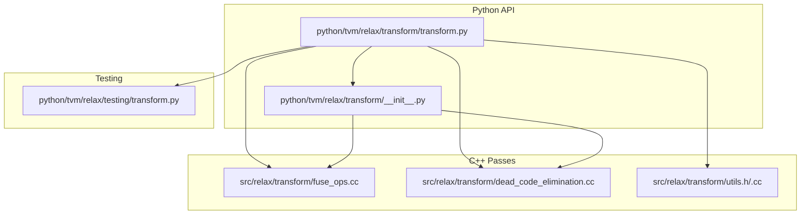
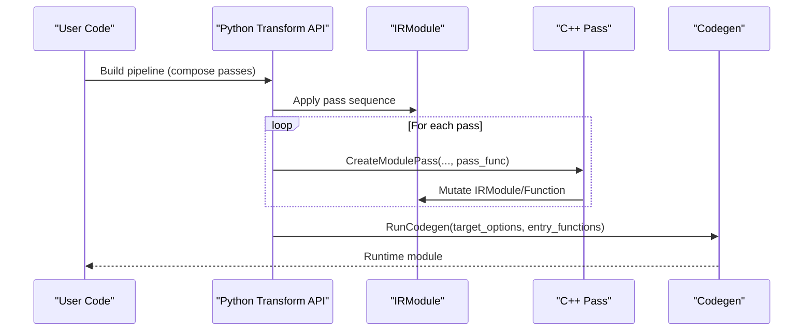
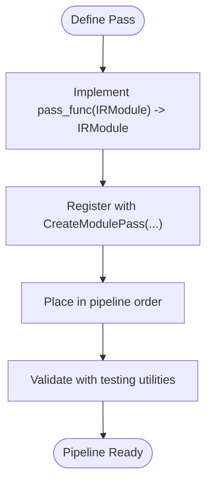
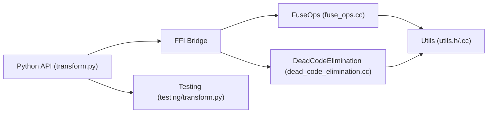

# Transformation Pipeline Construction

<cite>
**Referenced Files in This Document**
- [python/tvm/relax/transform/__init__.py](file://python/tvm/relax/transform/__init__.py)
- [python/tvm/relax/transform/transform.py](file://python/tvm/relax/transform/transform.py)
- [src/relax/transform/utils.h](file://src/relax/transform/utils.h)
- [src/relax/transform/utils.cc](file://src/relax/transform/utils.cc)
- [src/relax/transform/dead_code_elimination.cc](file://src/relax/transform/dead_code_elimination.cc)
- [src/relax/transform/fuse_ops.cc](file://src/relax/transform/fuse_ops.cc)
- [python/tvm/relax/testing/transform.py](file://python/tvm/relax/testing/transform.py)
</cite>

## Table of Contents
1. [Introduction](#introduction)
2. [Project Structure](#project-structure)
3. [Core Components](#core-components)
4. [Architecture Overview](#architecture-overview)
5. [Detailed Component Analysis](#detailed-component-analysis)
6. [Dependency Analysis](#dependency-analysis)
7. [Performance Considerations](#performance-considerations)
8. [Troubleshooting Guide](#troubleshooting-guide)
9. [Conclusion](#conclusion)
10. [Appendices](#appendices)

## Introduction
This document explains how to construct Relax transformation pipelines in the TVM ecosystem. It covers the pass infrastructure, pipeline composition patterns, execution ordering, pass context management, error handling, debugging capabilities, built-in pipeline configurations, custom pass development, optimization strategies, practical transformation workflows, integration with compilation drivers, performance profiling, and testing utilities for validation and regression detection.

## Project Structure
The Relax transformation system is organized around:
- Python API surface that exposes pass constructors and pipeline orchestration helpers
- C++ pass implementations that operate on IRModule and Function nodes
- Utilities for expression manipulation, graph partitioning, and pass composition
- Testing utilities for validating transformations and detecting regressions

**Diagram sources**
- [python/tvm/relax/transform/transform.py](file://python/tvm/relax/transform/transform.py)
- [python/tvm/relax/transform/__init__.py](file://python/tvm/relax/transform/__init__.py)
- [src/relax/transform/fuse_ops.cc](file://src/relax/transform/fuse_ops.cc)
- [src/relax/transform/dead_code_elimination.cc](file://src/relax/transform/dead_code_elimination.cc)
- [src/relax/transform/utils.h](file://src/relax/transform/utils.h)
- [src/relax/transform/utils.cc](file://src/relax/transform/utils.cc)
- [python/tvm/relax/testing/transform.py](file://python/tvm/relax/testing/transform.py)

**Section sources**
- [python/tvm/relax/transform/__init__.py](file://python/tvm/relax/transform/__init__.py)
- [python/tvm/relax/transform/transform.py](file://python/tvm/relax/transform/transform.py)

## Core Components
- Pass classes and registration
  - FunctionPass and DataflowBlockPass define the pass categories used by Relax transformations.
  - Pass constructors in the Python API wrap underlying C++ implementations via FFI.

- Built-in passes
  - The Python API exports a comprehensive set of passes, including normalization, layout conversion, constant folding, operator fusion, memory planning, and code generation integration.

- Pass context and pipeline composition
  - Passes are composed into pipelines using the pass infrastructure’s module-level pass mechanism.
  - Pass context controls diagnostics, error reporting, and pass-specific configuration.

- Utilities
  - Expression and function utilities support pass development, including composition, canonicalization, and graph partitioning helpers.

**Section sources**
- [python/tvm/relax/transform/transform.py](file://python/tvm/relax/transform/transform.py)
- [python/tvm/relax/transform/__init__.py](file://python/tvm/relax/transform/__init__.py)
- [src/relax/transform/utils.h](file://src/relax/transform/utils.h)
- [src/relax/transform/utils.cc](file://src/relax/transform/utils.cc)

## Architecture Overview
The Relax transformation pipeline is a staged process operating on an IRModule:
- Preprocessing: normalization, dataflow conversion, and structural preparation
- Optimization: operator fusion, constant folding, dead-code elimination, layout inference, and memory planning
- Code generation: attaching symbols, lowering runtime intrinsics, and invoking code generators
- Validation: optional runtime checks and shape lowering

**Diagram sources**
- [python/tvm/relax/transform/transform.py](file://python/tvm/relax/transform/transform.py)
- [src/relax/transform/dead_code_elimination.cc](file://src/relax/transform/dead_code_elimination.cc)
- [src/relax/transform/fuse_ops.cc](file://src/relax/transform/fuse_ops.cc)

## Detailed Component Analysis

### Pass Infrastructure and Execution Ordering
- Pass categories
  - FunctionPass operates on each Relax Function within the module.
  - DataflowBlockPass operates on each DataflowBlock.
- Pass registration and invocation
  - Passes are created via module-level pass factories and executed in the order they appear in the pipeline.
  - Pass context enables diagnostics and pass-specific configuration.

- Example pass constructors
  - Normalization, dataflow conversion, constant folding, operator fusion, and code generation integration are exposed as pass constructors.

**Section sources**
- [python/tvm/relax/transform/transform.py](file://python/tvm/relax/transform/transform.py)
- [python/tvm/relax/transform/__init__.py](file://python/tvm/relax/transform/__init__.py)

### Built-in Pipeline Configurations
- Operator fusion pipeline
  - FuseOps groups bindings in dataflow blocks and creates grouped functions; followed by FuseTIR to generate TIR PrimFuncs.
  - Post-dominator analysis and graph partitioning guide fusion decisions.

- Dead code elimination pipeline
  - Removes unused functions and bindings, with a three-stage process: remove unused functions, prune unused bindings, and re-evaluate reachability.

- Memory planning pipeline
  - Static memory planning reuses allocations to minimize peak memory usage; integrates with symbolic shape annotations.

- Code generation pipeline
  - Attaches global symbols, lowers runtime intrinsics, and invokes code generators with target options and entry functions.

**Section sources**
- [src/relax/transform/fuse_ops.cc](file://src/relax/transform/fuse_ops.cc)
- [src/relax/transform/dead_code_elimination.cc](file://src/relax/transform/dead_code_elimination.cc)
- [src/relax/transform/utils.h](file://src/relax/transform/utils.h)
- [src/relax/transform/utils.cc](file://src/relax/transform/utils.cc)
- [python/tvm/relax/transform/transform.py](file://python/tvm/relax/transform/transform.py)

### Pass Context Management, Error Handling, and Debugging
- Pass context
  - Passes receive a PassContext that carries diagnostics and configuration. Some passes expose options (e.g., emit error context toggles).
- Error handling
  - Passes use assertions and structured checks to maintain IR well-formedness and raise meaningful errors on mismatches.
- Debugging
  - Utilities support expression canonicalization, composition, and inspection of struct info and shapes to aid debugging.

**Section sources**
- [python/tvm/relax/transform/transform.py](file://python/tvm/relax/transform/transform.py)
- [src/relax/transform/utils.h](file://src/relax/transform/utils.h)
- [src/relax/transform/utils.cc](file://src/relax/transform/utils.cc)

### Custom Pass Development
- Implementing a pass
  - Define a pass function that takes an IRModule and returns a transformed IRModule.
  - Register the pass using the module pass factory and specify a pass name and required passes.
- Composition utilities
  - Function composition and canonicalization utilities simplify building composite transformations.
- Pattern-based fusion
  - Fusion patterns and graph partitioning enable pattern-driven operator fusion.

**Diagram sources**
- [src/relax/transform/fuse_ops.cc](file://src/relax/transform/fuse_ops.cc)
- [src/relax/transform/utils.h](file://src/relax/transform/utils.h)
- [src/relax/transform/utils.cc](file://src/relax/transform/utils.cc)

**Section sources**
- [src/relax/transform/fuse_ops.cc](file://src/relax/transform/fuse_ops.cc)
- [src/relax/transform/utils.h](file://src/relax/transform/utils.h)
- [src/relax/transform/utils.cc](file://src/relax/transform/utils.cc)

### Practical Examples of Building Transformation Workflows
- Typical inference optimization workflow
  - Convert to dataflow, normalize, fold constants, eliminate common subexpressions, fuse operators, rewrite reshape, attach global symbols, lower runtime intrinsics, and run codegen.
- Training-friendly workflow
  - Include gradient computation, canonicalize bindings, and memory planning for activation reuse.
- Layout-aware optimization
  - Infer layouts, convert layouts, and decompose operators to leverage hardware-specific kernels.

Note: Specific pass sequences are provided via pass constructors in the Python API. Users compose these constructors into a pipeline.

**Section sources**
- [python/tvm/relax/transform/transform.py](file://python/tvm/relax/transform/transform.py)
- [python/tvm/relax/transform/__init__.py](file://python/tvm/relax/transform/__init__.py)

### Integration with Compilation Drivers and Performance Profiling
- Code generation integration
  - RunCodegen integrates with target-specific code generators and entry functions.
- Profiling hooks
  - Runtime profiling and NVTX markers can be used alongside compiled modules for performance analysis.

**Section sources**
- [python/tvm/relax/transform/transform.py](file://python/tvm/relax/transform/transform.py)

### Testing Utilities for Transformation Validation and Regression Detection
- Testing utilities
  - Dedicated testing modules provide helpers for AST printing, numerical comparisons, and transformation validation.
- Regression detection
  - Use testing APIs to compare outputs before and after applying transformations, ensuring correctness and detecting performance regressions.

**Section sources**
- [python/tvm/relax/testing/transform.py](file://python/tvm/relax/testing/transform.py)

## Dependency Analysis
The pass infrastructure exhibits clear separation of concerns:
- Python API depends on C++ pass implementations via FFI
- Passes depend on shared utilities for expression manipulation and graph analysis
- Pipelines depend on pass registration and context mechanisms

**Diagram sources**
- [python/tvm/relax/transform/transform.py](file://python/tvm/relax/transform/transform.py)
- [src/relax/transform/fuse_ops.cc](file://src/relax/transform/fuse_ops.cc)
- [src/relax/transform/dead_code_elimination.cc](file://src/relax/transform/dead_code_elimination.cc)
- [src/relax/transform/utils.h](file://src/relax/transform/utils.h)
- [src/relax/transform/utils.cc](file://src/relax/transform/utils.cc)
- [python/tvm/relax/testing/transform.py](file://python/tvm/relax/testing/transform.py)

**Section sources**
- [python/tvm/relax/transform/transform.py](file://python/tvm/relax/transform/transform.py)
- [src/relax/transform/fuse_ops.cc](file://src/relax/transform/fuse_ops.cc)
- [src/relax/transform/dead_code_elimination.cc](file://src/relax/transform/dead_code_elimination.cc)
- [src/relax/transform/utils.h](file://src/relax/transform/utils.h)
- [src/relax/transform/utils.cc](file://src/relax/transform/utils.cc)

## Performance Considerations
- Fusion granularity
  - Tune fusion depth and grouping to balance kernel count versus memory throughput.
- Dead code elimination
  - Apply early to reduce IR size and improve subsequent passes’ effectiveness.
- Memory planning
  - Use static memory planning and symbolic shape annotations to reduce peak memory usage.
- Target-specific optimizations
  - Leverage layout conversion and operator decomposition to exploit hardware kernels.

[No sources needed since this section provides general guidance]

## Troubleshooting Guide
- Common issues
  - IR well-formedness violations: ensure proper dataflow blocks and struct info availability.
  - Unused function removal: confirm entry functions and external linkage are correctly identified.
  - Shape mismatch errors: validate symbolic variable bindings and struct info propagation.
- Debugging tips
  - Use testing utilities to print and compare IR before and after passes.
  - Enable pass diagnostics and error context emission for precise failure locations.

**Section sources**
- [src/relax/transform/dead_code_elimination.cc](file://src/relax/transform/dead_code_elimination.cc)
- [src/relax/transform/utils.h](file://src/relax/transform/utils.h)
- [python/tvm/relax/testing/transform.py](file://python/tvm/relax/testing/transform.py)

## Conclusion
Relax transformation pipelines are constructed by composing pass constructors into a staged workflow. The Python API exposes a rich set of passes, while C++ implementations provide robust IR mutation and analysis. Proper pass context management, error handling, and debugging utilities enable reliable optimization. Built-in pipelines cover common scenarios, and testing utilities support validation and regression detection. For advanced use cases, custom passes can be developed using the provided composition and analysis utilities.

[No sources needed since this section summarizes without analyzing specific files]

## Appendices
- Quick reference to pass constructors
  - Normalization, dataflow conversion, constant folding, operator fusion, memory planning, and code generation integration are available through the Python API.

**Section sources**
- [python/tvm/relax/transform/transform.py](file://python/tvm/relax/transform/transform.py)
- [python/tvm/relax/transform/__init__.py](file://python/tvm/relax/transform/__init__.py)