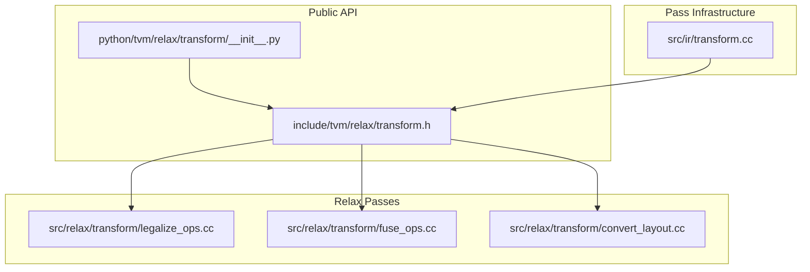
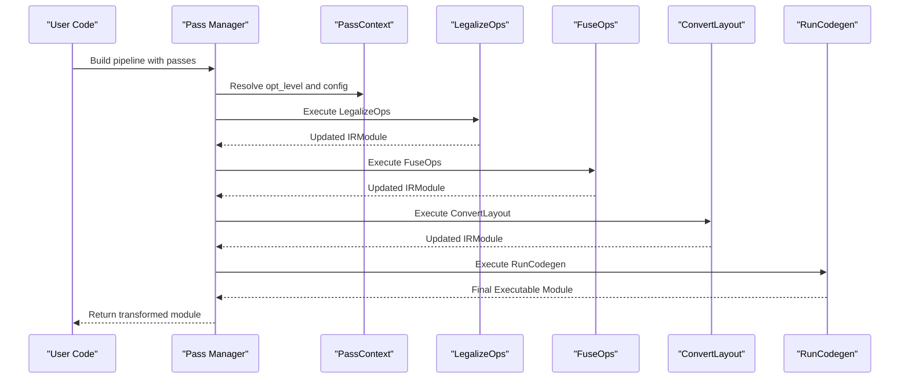
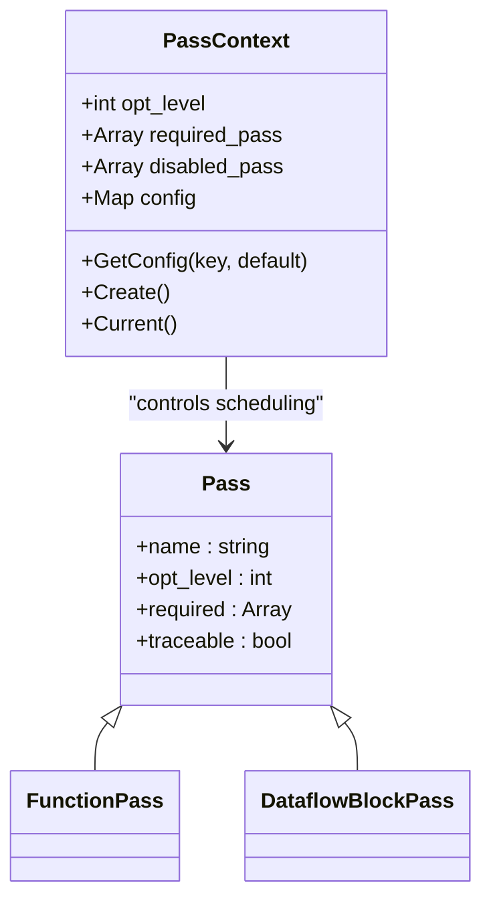
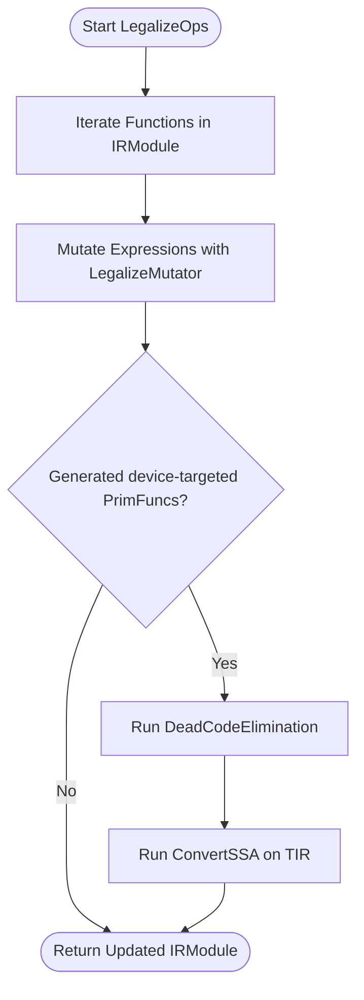
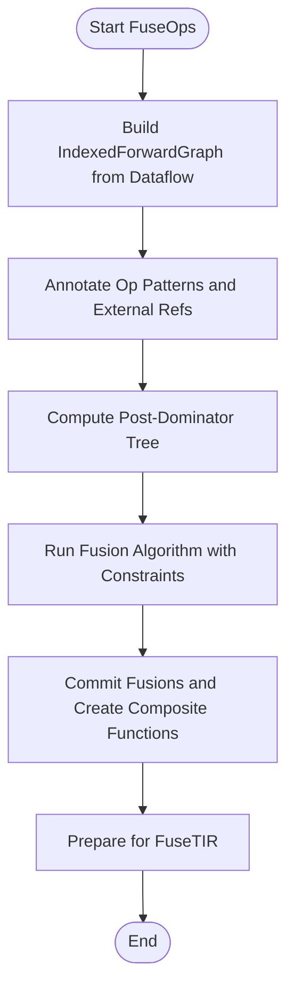
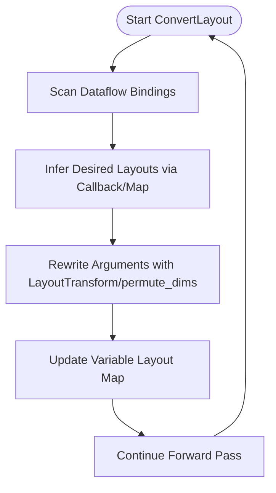
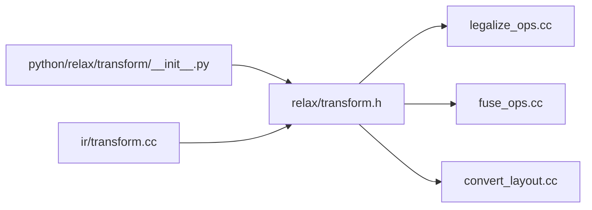

# Transformation System

<cite>
**Referenced Files in This Document**
- [transform.h](file://include/tvm/relax/transform.h)
- [transform.cc](file://src/ir/transform.cc)
- [legalize_ops.cc](file://src/relax/transform/legalize_ops.cc)
- [fuse_ops.cc](file://src/relax/transform/fuse_ops.cc)
- [convert_layout.cc](file://src/relax/transform/convert_layout.cc)
- [__init__.py](file://python/tvm/relax/transform/__init__.py)
- [transform.py](file://python/tvm/relax/transform/transform.py)
- [testing/__init__.py](file://python/tvm/testing/__init__.py)
</cite>

## Table of Contents
1. [Introduction](#introduction)
2. [Project Structure](#project-structure)
3. [Core Components](#core-components)
4. [Architecture Overview](#architecture-overview)
5. [Detailed Component Analysis](#detailed-component-analysis)
6. [Dependency Analysis](#dependency-analysis)
7. [Performance Considerations](#performance-considerations)
8. [Troubleshooting Guide](#troubleshooting-guide)
9. [Conclusion](#conclusion)
10. [Appendices](#appendices)

## Introduction
This document explains the Relax transformation system in TVM. It covers transformation passes for optimization, legalization, and code generation preparation; describes how transformation pipelines are constructed, ordered, and managed; and documents legalizer transformations, layout optimizations, and redundant operation elimination. Practical guidance is included for building custom transformation pipelines, applying optimization passes, debugging workflows, using transformation testing utilities, assessing performance impact, and following best practices for transformation development.

## Project Structure
The Relax transformation system spans C++ core implementations, Python APIs, and pass infrastructure:
- Public C++ API for Relax passes is declared in the header.
- Pass implementations live under the Relax transform directory.
- Python bindings expose pass constructors and orchestration utilities.
- Pass infrastructure (pass manager, pass context, configuration) is implemented in the IR transform layer.

**Diagram sources**
- [transform.h:34-688](file://include/tvm/relax/transform.h#L34-L688)
- [transform.cc:35-200](file://src/ir/transform.cc#L35-L200)
- [legalize_ops.cc:1-200](file://src/relax/transform/legalize_ops.cc#L1-L200)
- [fuse_ops.cc:1-200](file://src/relax/transform/fuse_ops.cc#L1-L200)
- [convert_layout.cc:1-200](file://src/relax/transform/convert_layout.cc#L1-L200)
- [__init__.py:20-103](file://python/tvm/relax/transform/__init__.py#L20-L103)

**Section sources**
- [transform.h:34-688](file://include/tvm/relax/transform.h#L34-L688)
- [transform.cc:35-200](file://src/ir/transform.cc#L35-L200)
- [__init__.py:20-103](file://python/tvm/relax/transform/__init__.py#L20-L103)

## Core Components
- Pass creation and registration: The C++ header defines pass constructors and pass types (function-level and dataflow-block-level). The pass manager and pass context are defined in the IR transform layer.
- Legalization: Converts high-level Relax operators into call_tir to low-level TIR PrimFuncs, with customizable mappings and skipping lists.
- Operator fusion: Groups dataflow bindings into composite functions guided by graph partitioning and post-dominator analysis.
- Layout conversion: Infers and inserts layout conversions (e.g., axis permutations) for operators like convolution.
- Pipeline orchestration: Python exposes pass constructors and orchestrates pass execution through the pass manager.

Key pass categories and representative APIs:
- Legalization: LegalizeOps
- Operator fusion: FuseOps, FuseOpsByPattern, MergeCompositeFunctions, FuseTIR
- Layout: ConvertLayout, AttachAttrLayoutFreeBuffers, SplitLayoutRewritePreproc
- Memory and purity: StaticPlanBlockMemory, RemovePurityChecking
- Codegen preparation: Normalize, ToNonDataflow, AttachGlobalSymbol, RunCodegen
- Optimization: CanonicalizeBindings, EliminateCommonSubexpr, DeadCodeElimination, FoldConstant
- Mixed precision and inplace: ToMixedPrecision, DataflowUseInplaceCalls
- Shape and parameter binding: BindSymbolicVars, BindParams
- Device and virtual device: RealizeVDevice, UpdateVDevice, SpecializePrimFuncBasedOnCallSite

**Section sources**
- [transform.h:57-682](file://include/tvm/relax/transform.h#L57-L682)
- [transform.cc:79-200](file://src/ir/transform.cc#L79-L200)
- [__init__.py:20-103](file://python/tvm/relax/transform/__init__.py#L20-L103)

## Architecture Overview
The Relax transformation system is built on a pass manager that executes a sequence of IRModule-to-IRModule transformations. Passes can be registered with required dependencies and optimization levels. The pass manager enforces enabled/disabled lists and pass context configuration.

**Diagram sources**
- [transform.cc:86-104](file://src/ir/transform.cc#L86-L104)
- [transform.h:254-256](file://include/tvm/relax/transform.h#L254-L256)
- [transform.h:360-360](file://include/tvm/relax/transform.h#L360-L360)
- [transform.h:614-615](file://include/tvm/relax/transform.h#L614-L615)
- [transform.h:563-564](file://include/tvm/relax/transform.h#L563-L564)

## Detailed Component Analysis

### Pass Infrastructure and Pipeline Construction
- Pass types: FunctionPass and DataflowBlockPass are created via pass constructors and registered with the pass manager.
- PassContext controls opt_level thresholds, required/disabled passes, and pass-specific configuration maps.
- PassEnabled evaluation considers disabled lists, required passes, and opt_level.

**Diagram sources**
- [transform.cc:79-138](file://src/ir/transform.cc#L79-L138)
- [transform.cc:94-104](file://src/ir/transform.cc#L94-L104)
- [transform.h:57-74](file://include/tvm/relax/transform.h#L57-L74)

**Section sources**
- [transform.cc:79-138](file://src/ir/transform.cc#L79-L138)
- [transform.cc:94-104](file://src/ir/transform.cc#L94-L104)
- [transform.h:57-74](file://include/tvm/relax/transform.h#L57-L74)

### Legalization Pass (LegalizeOps)
Purpose:
- Convert high-level Relax operator calls into call_tir to corresponding low-level TIR PrimFuncs.
- Supports customization via a mapping of operator names to legalization functions and a skip list.
- Handles purity wrapping and target/vdevice propagation.

Key behaviors:
- Iterates over functions in the IRModule and mutates expressions.
- Optionally runs dead-code elimination and TIR SSA conversion after generating device-targeted PrimFuncs.
- Respects skip lists and enables warnings for missing TIR functions.

**Diagram sources**
- [legalize_ops.cc:80-104](file://src/relax/transform/legalize_ops.cc#L80-L104)
- [legalize_ops.cc:95-101](file://src/relax/transform/legalize_ops.cc#L95-L101)

**Section sources**
- [transform.h:254-256](file://include/tvm/relax/transform.h#L254-L256)
- [legalize_ops.cc:63-104](file://src/relax/transform/legalize_ops.cc#L63-L104)

### Operator Fusion Pass (FuseOps)
Purpose:
- Group dataflow bindings into composite functions using graph partitioning and post-dominator analysis.
- Prepare for downstream lowering to TIR via FuseTIR.

Highlights:
- Builds a dataflow graph, marks external references, and annotates op patterns.
- Uses union-find to manage groups and commits fusions along post-dominators.
- Skips primitive and codegen functions to avoid recomputation.

**Diagram sources**
- [fuse_ops.cc:111-137](file://src/relax/transform/fuse_ops.cc#L111-L137)
- [fuse_ops.cc:191-200](file://src/relax/transform/fuse_ops.cc#L191-L200)
- [fuse_ops.cc:100-101](file://src/relax/transform/fuse_ops.cc#L100-L101)

**Section sources**
- [transform.h:360-360](file://include/tvm/relax/transform.h#L360-L360)
- [fuse_ops.cc:56-94](file://src/relax/transform/fuse_ops.cc#L56-L94)
- [fuse_ops.cc:111-137](file://src/relax/transform/fuse_ops.cc#L111-L137)

### Layout Conversion Pass (ConvertLayout)
Purpose:
- Infer and insert layout conversions for operators (e.g., axis permutations) to align with desired layouts.
- Supports dynamic layout callbacks and nested tuple layouts.

Mechanics:
- Maintains a layout map per variable and rewrites tensor arguments to match desired layouts.
- Uses index maps for non-permutation conversions and permute_dims for swaps.

**Diagram sources**
- [convert_layout.cc:80-144](file://src/relax/transform/convert_layout.cc#L80-L144)
- [convert_layout.cc:166-178](file://src/relax/transform/convert_layout.cc#L166-L178)

**Section sources**
- [transform.h:614-615](file://include/tvm/relax/transform.h#L614-L615)
- [convert_layout.cc:43-79](file://src/relax/transform/convert_layout.cc#L43-L79)
- [convert_layout.cc:166-200](file://src/relax/transform/convert_layout.cc#L166-L200)

### Pipeline Construction and Pass Ordering
Recommended ordering for typical Relax pipelines:
- Preprocessing: ConvertToDataflow, CanonicalizeBindings, FoldConstant
- Legalization: LegalizeOps
- Optimization: EliminateCommonSubexpr, DeadCodeElimination
- Operator fusion: FuseOps, FuseTIR
- Layout: ConvertLayout, AttachAttrLayoutFreeBuffers, SplitLayoutRewritePreproc
- Mixed precision and purity: ToMixedPrecision, RemovePurityChecking
- Code generation preparation: Normalize, ToNonDataflow, AttachGlobalSymbol
- Code generation: RunCodegen

Dependency considerations:
- LegalizeOps should precede fusion to ensure call_tir targets exist.
- ConvertLayout often benefits from CanonicalizeBindings beforehand.
- FuseTIR expects composite functions created by FuseOps.

**Section sources**
- [transform.h:88-88](file://include/tvm/relax/transform.h#L88-L88)
- [transform.h:182-182](file://include/tvm/relax/transform.h#L182-L182)
- [transform.h:228-228](file://include/tvm/relax/transform.h#L228-L228)
- [transform.h:254-256](file://include/tvm/relax/transform.h#L254-L256)
- [transform.h:191-191](file://include/tvm/relax/transform.h#L191-L191)
- [transform.h:642-642](file://include/tvm/relax/transform.h#L642-L642)
- [transform.h:360-360](file://include/tvm/relax/transform.h#L360-L360)
- [transform.h:554-554](file://include/tvm/relax/transform.h#L554-L554)
- [transform.h:614-615](file://include/tvm/relax/transform.h#L614-L615)
- [transform.h:145-145](file://include/tvm/relax/transform.h#L145-L145)
- [transform.h:101-101](file://include/tvm/relax/transform.h#L101-L101)
- [transform.h:160-160](file://include/tvm/relax/transform.h#L160-L160)
- [transform.h:88-88](file://include/tvm/relax/transform.h#L88-L88)
- [transform.h:152-152](file://include/tvm/relax/transform.h#L152-L152)
- [transform.h:563-564](file://include/tvm/relax/transform.h#L563-L564)

### Practical Examples

- Building a custom transformation pipeline:
  - Use pass constructors to assemble a list of passes.
  - Configure PassContext with opt_level and required/disabled passes.
  - Apply passes to an IRModule via the pass manager.

- Applying optimization passes:
  - Insert CanonicalizeBindings, EliminateCommonSubexpr, and DeadCodeElimination after legalization and before fusion.

- Debugging transformation workflows:
  - Enable pass instrumentation via PassContext instruments.
  - Inspect pass configuration with ListConfigs and pass-specific config options.

- Transformation testing utilities:
  - Use tvm.testing utilities for device tests and runner helpers.

**Section sources**
- [transform.py:43-53](file://python/tvm/relax/transform/transform.py#L43-L53)
- [transform.cc:173-182](file://src/ir/transform.cc#L173-L182)
- [__init__.py:91-103](file://python/tvm/relax/transform/__init__.py#L91-L103)
- [testing/__init__.py:22-49](file://python/tvm/testing/__init__.py#L22-L49)

## Dependency Analysis
- Pass registration and discovery:
  - Pass constructors are declared in the Relax transform header and implemented in corresponding C++ files.
  - Python bindings import pass constructors and register them for use.

- Pass interdependencies:
  - LegalizeOps depends on TIR PrimFunc availability; downstream passes expect call_tir targets.
  - FuseOps relies on dataflow structure; ConvertToDataflow may be needed.
  - ConvertLayout depends on accurate layout inference and struct info.

**Diagram sources**
- [transform.h:34-688](file://include/tvm/relax/transform.h#L34-L688)
- [legalize_ops.cc:1-200](file://src/relax/transform/legalize_ops.cc#L1-L200)
- [fuse_ops.cc:1-200](file://src/relax/transform/fuse_ops.cc#L1-L200)
- [convert_layout.cc:1-200](file://src/relax/transform/convert_layout.cc#L1-L200)
- [__init__.py:20-103](file://python/tvm/relax/transform/__init__.py#L20-L103)
- [transform.cc:35-200](file://src/ir/transform.cc#L35-L200)

**Section sources**
- [__init__.py:20-103](file://python/tvm/relax/transform/__init__.py#L20-L103)
- [transform.h:34-688](file://include/tvm/relax/transform.h#L34-L688)

## Performance Considerations
- Fusion depth and grouping:
  - Tune FuseOps max depth and fusion strategy to balance kernel count versus overhead.
- Legalization costs:
  - Limit unnecessary rewrites by using skip lists and targeted operator maps.
- Layout conversions:
  - Prefer permutation-based transforms over expensive reshape-like operations when possible.
- Pass ordering:
  - Early canonicalization reduces redundant work later in the pipeline.
- Mixed precision:
  - Use ToMixedPrecision judiciously to avoid excessive casting around non-GEMM/conv ops.

[No sources needed since this section provides general guidance]

## Troubleshooting Guide
- Pass not running:
  - Verify opt_level meets threshold and pass is not disabled or required.
  - Confirm required passes are satisfied.

- Unexpected fusion behavior:
  - Ensure dataflow structure is normalized and ConvertToDataflow is applied if needed.
  - Review op pattern annotations and post-dominator constraints.

- Layout conversion failures:
  - Check desired layout maps and callback correctness.
  - Validate struct info shapes and unknown dimensions.

- Codegen errors after RunCodegen:
  - Confirm LegalizeOps and FuseTIR were applied.
  - Verify AttachGlobalSymbol and normalization steps.

**Section sources**
- [transform.cc:94-104](file://src/ir/transform.cc#L94-L104)
- [transform.h:360-360](file://include/tvm/relax/transform.h#L360-L360)
- [transform.h:614-615](file://include/tvm/relax/transform.h#L614-L615)
- [transform.h:563-564](file://include/tvm/relax/transform.h#L563-L564)

## Conclusion
The Relax transformation system provides a robust, extensible framework for optimizing and preparing Relax IR for code generation. By leveraging pass constructors, pass context configuration, and carefully ordered pipelines, developers can implement efficient transformations tailored to hardware backends and model characteristics. Legalization, fusion, and layout passes form the backbone of the pipeline, while optimization passes refine the IR for performance. Proper use of instrumentation and testing utilities ensures reliable and debuggable transformations.

[No sources needed since this section summarizes without analyzing specific files]

## Appendices

### Best Practices for Transformation Development
- Keep passes modular and composable; minimize side effects.
- Use pass context configuration for tunables rather than hardcoding behavior.
- Register pass-specific config options for discoverability and validation.
- Provide clear pass dependencies and required passes to ensure deterministic execution.
- Instrument passes for debugging and performance profiling.
- Test transformations against representative models and shapes.

**Section sources**
- [transform.cc:106-182](file://src/ir/transform.cc#L106-L182)
- [__init__.py:101-103](file://python/tvm/relax/transform/__init__.py#L101-L103)