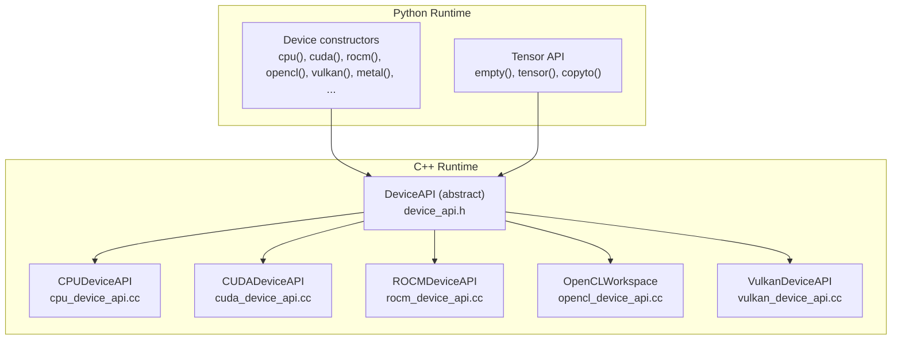
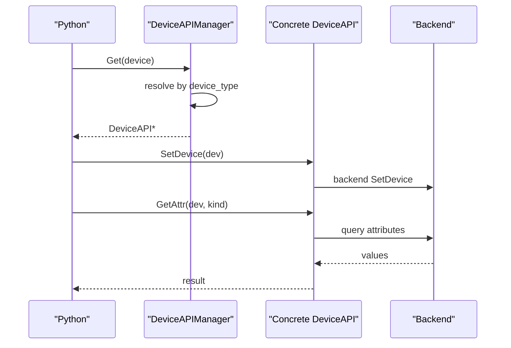
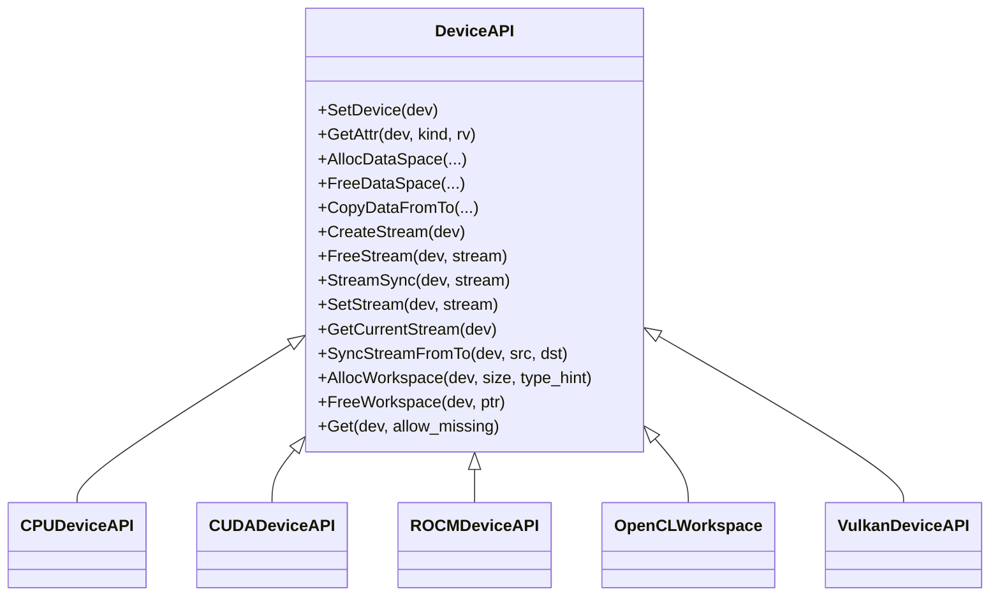

# Device Abstraction Layer

<cite>
**Referenced Files in This Document**
- [device_api.h](file://include/tvm/runtime/device_api.h)
- [device_api.cc](file://src/runtime/device_api.cc)
- [cpu_device_api.cc](file://src/runtime/cpu_device_api.cc)
- [cuda_device_api.cc](file://src/runtime/cuda/cuda_device_api.cc)
- [opencl_device_api.cc](file://src/runtime/opencl/opencl_device_api.cc)
- [rocm_device_api.cc](file://src/runtime/rocm/rocm_device_api.cc)
- [vulkan_device_api.cc](file://src/runtime/vulkan/vulkan_device_api.cc)
- [_tensor.py](file://python/tvm/runtime/_tensor.py)
</cite>

## Table of Contents
1. [Introduction](#introduction)
2. [Project Structure](#project-structure)
3. [Core Components](#core-components)
4. [Architecture Overview](#architecture-overview)
5. [Detailed Component Analysis](#detailed-component-analysis)
6. [Dependency Analysis](#dependency-analysis)
7. [Performance Considerations](#performance-considerations)
8. [Troubleshooting Guide](#troubleshooting-guide)
9. [Conclusion](#conclusion)

## Introduction
This document describes TVM’s device abstraction layer, focusing on the Device class hierarchy, device enumeration, capability queries, device contexts, memory allocation, and command/stream management. It covers supported backends (CPU, CUDA, ROCm, OpenCL, Vulkan) and outlines how to select devices, allocate memory, synchronize streams, and query device properties. Practical examples are provided via Python APIs and internal C++ device implementations.

## Project Structure
The device abstraction is defined in the runtime headers and implemented per-backend in separate modules. Python exposes convenient constructors for device selection and tensor creation.

**Diagram sources**
- [device_api.h:128-310](file://include/tvm/runtime/device_api.h#L128-L310)
- [cpu_device_api.cc:52-139](file://src/runtime/cpu_device_api.cc#L52-L139)
- [cuda_device_api.cc:39-274](file://src/runtime/cuda/cuda_device_api.cc#L39-L274)
- [rocm_device_api.cc:38-239](file://src/runtime/rocm/rocm_device_api.cc#L38-L239)
- [opencl_device_api.cc:123-586](file://src/runtime/opencl/opencl_device_api.cc#L123-L586)
- [vulkan_device_api.cc:36-449](file://src/runtime/vulkan/vulkan_device_api.cc#L36-L449)

**Section sources**
- [device_api.h:128-310](file://include/tvm/runtime/device_api.h#L128-L310)
- [_tensor.py:356-465](file://python/tvm/runtime/_tensor.py#L356-L465)

## Core Components
- DeviceAPI: Abstract interface for device operations (allocation, copying, streams, attributes).
- DeviceAPIManager: Registry that instantiates the correct backend DeviceAPI based on device type.
- Backend-specific DeviceAPI implementations: CPU, CUDA, ROCm, OpenCL, Vulkan.
- Python Device constructors: cpu(), cuda(), rocm(), opencl(), vulkan(), metal(), etc.

Key responsibilities:
- Device selection and attribute queries (e.g., compute capability, memory sizes).
- Memory allocation/free with alignment and scope awareness.
- Cross-device copies and host-device transfers.
- Stream creation/synchronization and inter-stream synchronization.
- Workspace allocation for temporaries.

**Section sources**
- [device_api.h:128-310](file://include/tvm/runtime/device_api.h#L128-L310)
- [device_api.cc:49-95](file://src/runtime/device_api.cc#L49-L95)

## Architecture Overview
The runtime resolves the appropriate DeviceAPI implementation for a given device type and delegates all device operations to it. Python-level device constructors and tensor APIs route through the C++ DeviceAPI.

**Diagram sources**
- [device_api.cc:49-95](file://src/runtime/device_api.cc#L49-L95)
- [device_api.h:128-144](file://include/tvm/runtime/device_api.h#L128-L144)

## Detailed Component Analysis

### Device Class and Attributes
- Device is an alias of DLDevice. Device types include CPU, CUDA, ROCm, OpenCL, Vulkan, Metal, and others.
- DeviceAttrKind enumerates capabilities like existence, max threads/block, warp size, shared memory, compute version, device name, clock rate, multiprocessor count, thread dimensions, register limits, GCN arch, API/driver versions, L2 cache size, total/global memory, available global memory, and image pitch alignment.

Practical usage:
- Select device via Python constructors (e.g., cuda(0), rocm(0), opencl(0), vulkan(0)).
- Query attributes using runtime.GetDeviceAttr or backend-specific helpers.

**Section sources**
- [device_api.h:41-101](file://include/tvm/runtime/device_api.h#L41-L101)
- [device_api.h:317-351](file://include/tvm/runtime/device_api.h#L317-L351)
- [_tensor.py:356-465](file://python/tvm/runtime/_tensor.py#L356-L465)

### CPU Device
- Implements SetDevice (no-op), attribute queries (existence, total memory), aligned host allocations, memcpy-based copies, and thread-local workspace pooling.
- Supports device pointer arithmetic on host.

Typical operations:
- Allocate aligned host memory.
- Copy between CPU pointers.
- Use workspace for temporaries.

**Section sources**
- [cpu_device_api.cc:52-139](file://src/runtime/cpu_device_api.cc#L52-L139)
- [cpu_device_api.cc:141-156](file://src/runtime/cpu_device_api.cc#L141-L156)

### CUDA Device
- Implements SetDevice, extensive attribute queries (threads/block, warp size, shared memory, compute version, device name, clock rate, multiprocessors, thread dims, registers, L2 cache, total/global memory), host/device allocations, peer-to-peer copies, and stream synchronization.
- Provides timers and memory helpers.

Typical operations:
- Allocate device/host memory.
- Copy across host/device/gpu.
- Create/destroy streams and synchronize.

**Section sources**
- [cuda_device_api.cc:39-274](file://src/runtime/cuda/cuda_device_api.cc#L39-L274)
- [cuda_device_api.cc:283-295](file://src/runtime/cuda/cuda_device_api.cc#L283-L295)

### ROCm (AMD GPU) Device
- Mirrors CUDA behavior with HIP wrappers: SetDevice, attributes, host/device allocations, peer-to-peer copies, stream sync, and timers.

Typical operations:
- Allocate device/host memory via HIP.
- Copy across host/device/gpu.
- Stream synchronization.

**Section sources**
- [rocm_device_api.cc:38-239](file://src/runtime/rocm/rocm_device_api.cc#L38-L239)
- [rocm_device_api.cc:248-260](file://src/runtime/rocm/rocm_device_api.cc#L248-L260)

### OpenCL Device
- Uses OpenCL context/queue per device/platform. Supports buffer and image allocations, texture-backed memory scopes, pooled allocator, and various copy patterns (buffer-to-buffer, buffer-to-image, image-to-buffer, image-to-image).
- Attribute queries include max threads/block, warp size, shared memory, compute version, device name, clock rate, compute units, thread dimensions, API/driver versions, L2 cache, total/global memory, and image pitch alignment.

Typical operations:
- Allocate buffers/images with optional texture scopes.
- Copy between CPU and images/buffers.
- Use pooled allocator for workspace.

**Section sources**
- [opencl_device_api.cc:123-586](file://src/runtime/opencl/opencl_device_api.cc#L123-L586)
- [opencl_device_api.cc:820-898](file://src/runtime/opencl/opencl_device_api.cc#L820-L898)

### Vulkan Device
- Enumerates physical devices, filters compute-capable ones, and exposes properties (max threads/block, shared memory, warp size, compute version, device name, driver/API versions, memory sizes).
- Allocates buffers for compute usage, synchronizes via a single stream per thread, and performs host/device copies with staging buffers.
- Provides target property queries for feature flags and limits.

Typical operations:
- Allocate buffers for compute.
- Copy from/to CPU using staging buffers.
- Synchronize via thread-local stream.

**Section sources**
- [vulkan_device_api.cc:36-449](file://src/runtime/vulkan/vulkan_device_api.cc#L36-L449)
- [vulkan_device_api.cc:455-468](file://src/runtime/vulkan/vulkan_device_api.cc#L455-L468)

### Python Device Selection and Tensor Operations
- Device constructors: cpu(), cuda(), rocm(), opencl(), vulkan(), metal(), vpi(), ext_dev(), hexagon(), webgpu().
- Tensor creation and copying: empty(), tensor(), copyto(), numpy conversion.

Example usage patterns:
- Create a CUDA tensor on device 0.
- Copy a tensor to a ROCm device.
- Allocate a Vulkan buffer and synchronize.

**Section sources**
- [_tensor.py:356-465](file://python/tvm/runtime/_tensor.py#L356-L465)
- [_tensor.py:300-354](file://python/tvm/runtime/_tensor.py#L300-L354)
- [_tensor.py:299-327](file://python/tvm/runtime/_tensor.py#L299-L327)

## Dependency Analysis
- DeviceAPI is the central abstraction; each backend derives from it.
- DeviceAPIManager resolves the backend DeviceAPI by device type or RPC session.
- Python runtime delegates to C++ DeviceAPI for device selection, attributes, and tensor operations.

**Diagram sources**
- [device_api.h:128-310](file://include/tvm/runtime/device_api.h#L128-L310)
- [cpu_device_api.cc:52-139](file://src/runtime/cpu_device_api.cc#L52-L139)
- [cuda_device_api.cc:39-274](file://src/runtime/cuda/cuda_device_api.cc#L39-L274)
- [rocm_device_api.cc:38-239](file://src/runtime/rocm/rocm_device_api.cc#L38-L239)
- [opencl_device_api.cc:123-586](file://src/runtime/opencl/opencl_device_api.cc#L123-L586)
- [vulkan_device_api.cc:36-449](file://src/runtime/vulkan/vulkan_device_api.cc#L36-L449)

**Section sources**
- [device_api.cc:49-95](file://src/runtime/device_api.cc#L49-L95)
- [device_api.h:274-286](file://include/tvm/runtime/device_api.h#L274-L286)

## Performance Considerations
- Alignment: Backends enforce alignment requirements (e.g., 256-byte alignment for CUDA/ROCm). DeviceAPI enforces minimum alignment based on element size.
- Workspace pooling: CPU, CUDA, ROCm, and OpenCL backends provide thread-local or pooled allocators for temporaries to reduce overhead.
- Stream usage: Prefer asynchronous copies and kernels; synchronize only when necessary. Use SyncStreamFromTo to coordinate events across streams.
- Memory scopes: OpenCL supports texture-backed memory scopes; Vulkan uses staging buffers for host-device transfers.

[No sources needed since this section provides general guidance]

## Troubleshooting Guide
Common issues and remedies:
- Device not found or unavailable:
  - Verify device existence via GetDeviceAttr(kind=kExist) or backend helpers.
  - CUDA/ROCm: Confirm device_id within bounds and driver availability.
  - OpenCL: Ensure platform/device version meets minimum requirements.
- Allocation failures:
  - Check available global memory and reduce tensor sizes.
  - CUDA: Use GetCudaFreeMemory helper to diagnose.
- Copy errors:
  - Ensure contiguity and matching shapes for CopyDataFromTo.
  - OpenCL: Respect buffer/image layout and alignment; use compatible views.
- Synchronization:
  - Always synchronize streams before accessing results on host.
  - Vulkan: Use thread-local stream synchronization; avoid device-to-device copies across devices.

**Section sources**
- [device_api.cc:101-143](file://src/runtime/device_api.cc#L101-L143)
- [cuda_device_api.cc:340-371](file://src/runtime/cuda/cuda_device_api.cc#L340-L371)
- [opencl_device_api.cc:508-586](file://src/runtime/opencl/opencl_device_api.cc#L508-L586)
- [vulkan_device_api.cc:330-333](file://src/runtime/vulkan/vulkan_device_api.cc#L330-L333)

## Conclusion
TVM’s device abstraction layer cleanly separates device-specific logic behind a unified DeviceAPI. Python provides ergonomic device constructors and tensor operations, while C++ backends implement efficient memory management, stream synchronization, and capability queries. By leveraging the provided APIs and following the troubleshooting tips, developers can reliably target multiple accelerators with consistent behavior.