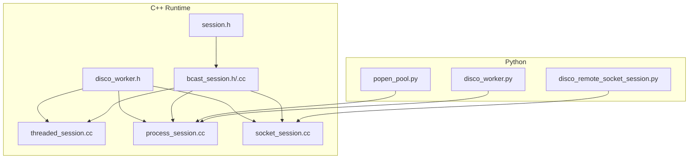
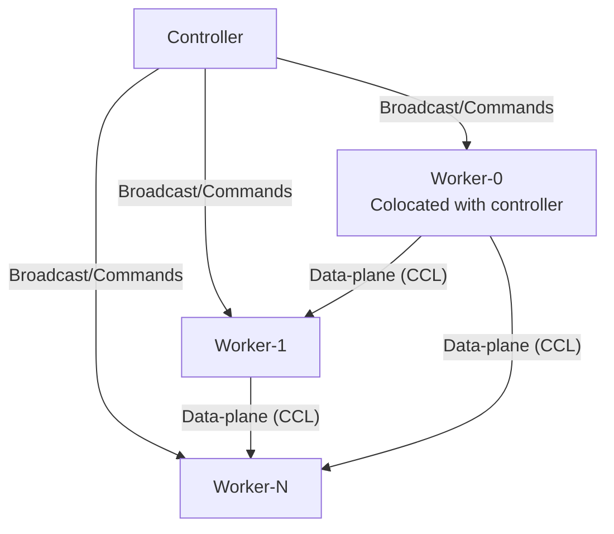
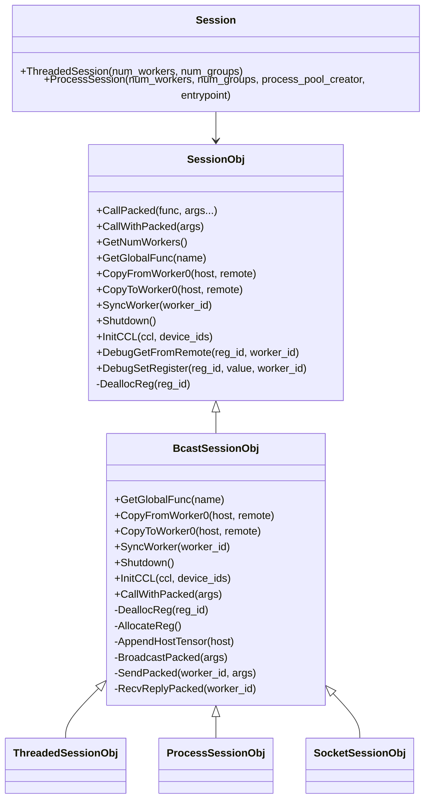
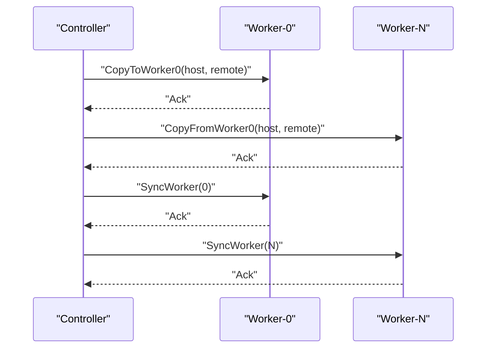
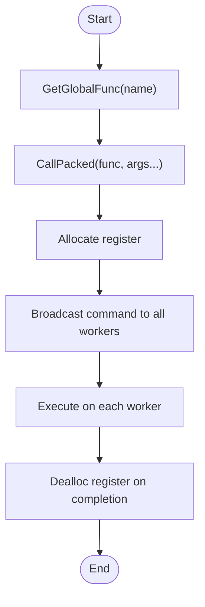
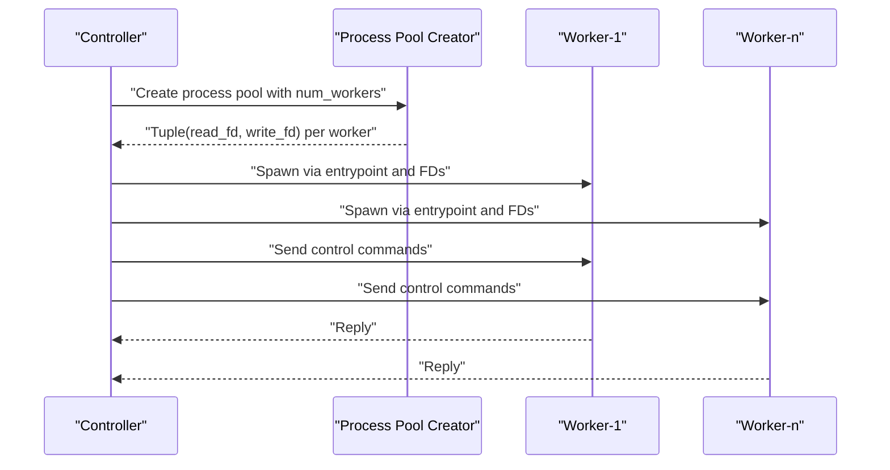
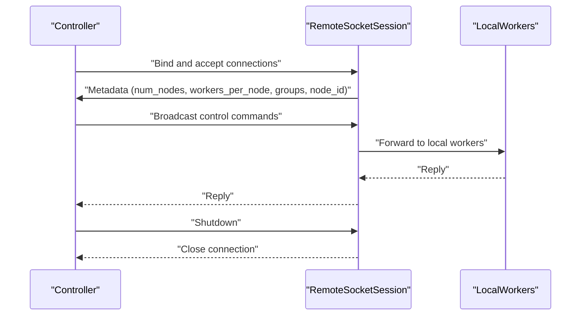
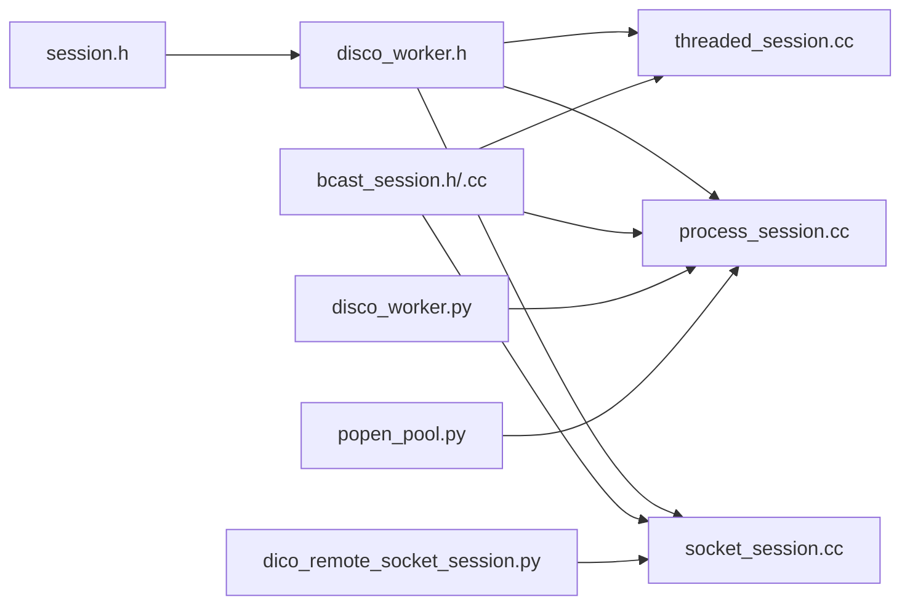

# Distributed Runtime (DisCo)

<cite>
**Referenced Files in This Document**
- [session.h](file://include/tvm/runtime/disco/session.h)
- [disco_worker.h](file://include/tvm/runtime/disco/disco_worker.h)
- [bcast_session.h](file://src/runtime/disco/bcast_session.h)
- [bcast_session.cc](file://src/runtime/disco/bcast_session.cc)
- [threaded_session.cc](file://src/runtime/disco/threaded_session.cc)
- [process_session.cc](file://src/runtime/disco/process_session.cc)
- [socket_session.cc](file://src/runtime/disco/distributed/socket_session.cc)
- [disco_worker.py](file://python/tvm/exec/disco_worker.py)
- [disco_remote_socket_session.py](file://python/tvm/exec/disco_remote_socket_session.py)
- [popen_pool.py](file://python/tvm/contrib/popen_pool.py)
- [test_runtime_builtin_kv_cache_transfer_kernel.py](file://tests/python/relax/nvshmem/test_runtime_builtin_kv_cache_transfer_kernel.py)
</cite>

## Table of Contents
1. [Introduction](#introduction)
2. [Project Structure](#project-structure)
3. [Core Components](#core-components)
4. [Architecture Overview](#architecture-overview)
5. [Detailed Component Analysis](#detailed-component-analysis)
6. [Dependency Analysis](#dependency-analysis)
7. [Performance Considerations](#performance-considerations)
8. [Troubleshooting Guide](#troubleshooting-guide)
9. [Conclusion](#conclusion)
10. [Appendices](#appendices)

## Introduction
This document describes TVM’s distributed runtime system (DisCo), focusing on session management, worker coordination, and distributed computation primitives. It explains how control-plane commands and data-plane communications are orchestrated across a cluster, how process pools and inter-process communication are used, and how cluster management is performed. It also covers fault tolerance, load balancing, resource scheduling, security considerations, authentication mechanisms, network configuration, scaling patterns, performance optimization, and debugging distributed applications.

## Project Structure
DisCo spans C++ runtime headers and implementations, Python executors and helpers, and tests that exercise distributed primitives. The most relevant parts for this document are:
- C++ session and worker interfaces and implementations
- Threaded and process-backed sessions
- Socket-based multi-node sessions
- Python-side worker entrypoints and remote session launchers
- Process pool utilities for launching workers

**Diagram sources**
- [session.h:183-297](file://include/tvm/runtime/disco/session.h#L183-L297)
- [disco_worker.h:41-99](file://include/tvm/runtime/disco/disco_worker.h#L41-L99)
- [bcast_session.h:35-98](file://src/runtime/disco/bcast_session.h#L35-L98)
- [bcast_session.cc:48-124](file://src/runtime/disco/bcast_session.cc#L48-L124)
- [threaded_session.cc:145-195](file://src/runtime/disco/threaded_session.cc#L145-L195)
- [process_session.cc:62-186](file://src/runtime/disco/process_session.cc#L62-L186)
- [socket_session.cc:56-209](file://src/runtime/disco/distributed/socket_session.cc#L56-L209)
- [disco_worker.py:101-127](file://python/tvm/exec/disco_worker.py#L101-L127)
- [disco_remote_socket_session.py:27-37](file://python/tvm/exec/disco_remote_socket_session.py#L27-L37)
- [popen_pool.py:215-340](file://python/tvm/contrib/popen_pool.py#L215-L340)

**Section sources**
- [session.h:1-367](file://include/tvm/runtime/disco/session.h#L1-L367)
- [disco_worker.h:1-119](file://include/tvm/runtime/disco/disco_worker.h#L1-L119)
- [bcast_session.h:1-111](file://src/runtime/disco/bcast_session.h#L1-L111)
- [bcast_session.cc:1-125](file://src/runtime/disco/bcast_session.cc#L1-L125)
- [threaded_session.cc:1-204](file://src/runtime/disco/threaded_session.cc#L1-L204)
- [process_session.cc:1-207](file://src/runtime/disco/process_session.cc#L1-L207)
- [socket_session.cc:1-329](file://src/runtime/disco/distributed/socket_session.cc#L1-L329)
- [disco_worker.py:1-127](file://python/tvm/exec/disco_worker.py#L1-L127)
- [disco_remote_socket_session.py:1-37](file://python/tvm/exec/disco_remote_socket_session.py#L1-L37)
- [popen_pool.py:215-340](file://python/tvm/contrib/popen_pool.py#L215-L340)

## Core Components
- Session: The primary control-plane interface to manage workers, issue commands, and coordinate data movement. Sessions can be threaded, process-based, or socket-based for multi-node clusters.
- Worker: Executes commands on each worker, maintains a register file, and communicates via channels.
- Channels: Bi-directional control-plane channels for sending/receiving commands and replies.
- Broadcast Session: Base session behavior for broadcasting commands and managing registers.
- Process Pool: Mechanism to spawn and manage worker processes for process-based sessions.
- Remote Socket Session: Launches a remote node that connects back to the controller and relays commands.

Key capabilities:
- Control-plane commands: shutdown, kill register, get global function, call packed function, sync worker, copy to/from worker-0, debug get/set register.
- Data-plane initialization: initialize collective communication libraries (e.g., NCCL, RCCL, MPI) via CCL initialization.
- Worker-0: Special worker colocated with the controller for host-side tensor transfers and synchronization.

**Section sources**
- [session.h:92-127](file://include/tvm/runtime/disco/session.h#L92-L127)
- [session.h:183-267](file://include/tvm/runtime/disco/session.h#L183-L267)
- [session.h:273-297](file://include/tvm/runtime/disco/session.h#L273-L297)
- [disco_worker.h:41-99](file://include/tvm/runtime/disco/disco_worker.h#L41-L99)
- [bcast_session.h:35-98](file://src/runtime/disco/bcast_session.h#L35-L98)
- [bcast_session.cc:48-124](file://src/runtime/disco/bcast_session.cc#L48-L124)
- [process_session.cc:62-186](file://src/runtime/disco/process_session.cc#L62-L186)
- [socket_session.cc:56-209](file://src/runtime/disco/distributed/socket_session.cc#L56-L209)

## Architecture Overview
DisCo separates control-plane and data-plane:
- Control-plane: Commands are broadcast or sent to specific workers via channels. Worker-0 is always colocated with the controller for host-side transfers and synchronization.
- Data-plane: Collective communication libraries (NCCL, RCCL, MPI) handle efficient tensor exchanges across workers.

**Diagram sources**
- [session.h:24-72](file://include/tvm/runtime/disco/session.h#L24-L72)
- [bcast_session.cc:48-124](file://src/runtime/disco/bcast_session.cc#L48-L124)
- [socket_session.cc:144-176](file://src/runtime/disco/distributed/socket_session.cc#L144-L176)

## Detailed Component Analysis

### Session Management
Sessions encapsulate worker lifecycle and control-plane orchestration:
- ThreadedSession: Multi-threaded workers within a single process.
- ProcessSession: Workers launched as separate processes with pipes for IPC.
- SocketSession: Multi-node orchestration with a controller and remote nodes.

**Diagram sources**
- [session.h:183-297](file://include/tvm/runtime/disco/session.h#L183-L297)
- [bcast_session.h:35-98](file://src/runtime/disco/bcast_session.h#L35-L98)
- [threaded_session.cc:145-195](file://src/runtime/disco/threaded_session.cc#L145-L195)
- [process_session.cc:62-186](file://src/runtime/disco/process_session.cc#L62-L186)
- [socket_session.cc:56-209](file://src/runtime/disco/distributed/socket_session.cc#L56-L209)

**Section sources**
- [session.h:183-297](file://include/tvm/runtime/disco/session.h#L183-L297)
- [bcast_session.h:35-98](file://src/runtime/disco/bcast_session.h#L35-L98)
- [bcast_session.cc:48-124](file://src/runtime/disco/bcast_session.cc#L48-L124)
- [threaded_session.cc:145-195](file://src/runtime/disco/threaded_session.cc#L145-L195)
- [process_session.cc:62-186](file://src/runtime/disco/process_session.cc#L62-L186)
- [socket_session.cc:56-209](file://src/runtime/disco/distributed/socket_session.cc#L56-L209)

### Worker Coordination
Workers execute commands and maintain a register file. Worker-0 is special because it is colocated with the controller and can synchronize and exchange tensors directly with host memory.

**Diagram sources**
- [session.h:215-235](file://include/tvm/runtime/disco/session.h#L215-L235)
- [bcast_session.cc:54-86](file://src/runtime/disco/bcast_session.cc#L54-L86)
- [socket_session.cc:100-176](file://src/runtime/disco/distributed/socket_session.cc#L100-L176)

**Section sources**
- [disco_worker.h:41-99](file://include/tvm/runtime/disco/disco_worker.h#L41-L99)
- [session.h:215-235](file://include/tvm/runtime/disco/session.h#L215-L235)
- [bcast_session.cc:54-86](file://src/runtime/disco/bcast_session.cc#L54-L86)
- [socket_session.cc:100-176](file://src/runtime/disco/distributed/socket_session.cc#L100-L176)

### Distributed Computation Primitives
DisCo exposes control-plane actions for distributed operations:
- Global function retrieval and invocation
- Register allocation/deallocation
- Synchronization across workers
- Host-device copies via worker-0

**Diagram sources**
- [session.h:92-127](file://include/tvm/runtime/disco/session.h#L92-L127)
- [bcast_session.cc:48-124](file://src/runtime/disco/bcast_session.cc#L48-L124)

**Section sources**
- [session.h:92-127](file://include/tvm/runtime/disco/session.h#L92-L127)
- [bcast_session.cc:48-124](file://src/runtime/disco/bcast_session.cc#L48-L124)

### Process Pools and Inter-Process Communication
Process-based sessions spawn workers and communicate via pipes. The controller creates a process pool and establishes bidirectional channels to each worker.

**Diagram sources**
- [process_session.cc:62-186](file://src/runtime/disco/process_session.cc#L62-L186)
- [disco_worker.py:101-127](file://python/tvm/exec/disco_worker.py#L101-L127)

**Section sources**
- [process_session.cc:62-186](file://src/runtime/disco/process_session.cc#L62-L186)
- [disco_worker.py:101-127](file://python/tvm/exec/disco_worker.py#L101-L127)
- [popen_pool.py:215-340](file://python/tvm/contrib/popen_pool.py#L215-L340)

### Cluster Management (Multi-Node)
Socket-based sessions enable multi-node clusters. The controller binds a socket, accepts remote nodes, and forwards commands to them. Remote nodes initialize local sessions and relay replies.

**Diagram sources**
- [socket_session.cc:56-209](file://src/runtime/disco/distributed/socket_session.cc#L56-L209)
- [socket_session.cc:211-296](file://src/runtime/disco/distributed/socket_session.cc#L211-L296)
- [disco_remote_socket_session.py:27-37](file://python/tvm/exec/disco_remote_socket_session.py#L27-L37)

**Section sources**
- [socket_session.cc:56-209](file://src/runtime/disco/distributed/socket_session.cc#L56-L209)
- [socket_session.cc:211-296](file://src/runtime/disco/distributed/socket_session.cc#L211-L296)
- [disco_remote_socket_session.py:27-37](file://python/tvm/exec/disco_remote_socket_session.py#L27-L37)

### Fault Tolerance, Load Balancing, and Resource Scheduling
- Fault tolerance: Sessions support graceful shutdown and cleanup. Process-based sessions can recycle workers after a maximum number of uses. Channel implementations handle connection failures and timeouts.
- Load balancing: Grouping workers into logical groups enables workload distribution across nodes and devices. The session APIs expose grouping parameters to align with scheduling policies.
- Resource scheduling: Collective communication initialization (CCL) integrates with hardware backends (NCCL, RCCL, MPI) to leverage device topology and bandwidth.

**Section sources**
- [process_session.cc:85-94](file://src/runtime/disco/process_session.cc#L85-L94)
- [popen_pool.py:314-340](file://python/tvm/contrib/popen_pool.py#L314-L340)
- [bcast_session.cc:70-76](file://src/runtime/disco/bcast_session.cc#L70-L76)
- [session.h:240-241](file://include/tvm/runtime/disco/session.h#L240-L241)

### Security Considerations, Authentication, and Network Configuration
- Security: DisCo relies on underlying transport security. For socket sessions, ensure secure network boundaries and consider TLS at the system level. Limit exposure of controller ports and restrict access to trusted networks.
- Authentication: There is no built-in authentication in the referenced code. Deploy behind firewalls or VPNs and use reverse proxies with authentication if needed.
- Network configuration: Configure host and port for SocketSession, ensure firewall rules allow inbound connections from remote nodes, and set keep-alive options for robustness.

**Section sources**
- [socket_session.cc:71-76](file://src/runtime/disco/distributed/socket_session.cc#L71-L76)
- [socket_session.cc:214-222](file://src/runtime/disco/distributed/socket_session.cc#L214-L222)

### Practical Examples

- Setting up a distributed session:
  - Threaded session for single-node multi-GPU: Use the threaded session factory to create a session with a specified number of workers and groups.
  - Process session for multi-process workers: Provide a process pool creator and entrypoint to spawn workers and establish pipes.
  - Socket session for multi-node: Start a controller with host/port and accept remote nodes; each remote node launches a RemoteSocketSession.

- Executing remote functions:
  - Retrieve a global function on all workers, then call it with variadic arguments. The session allocates a register, broadcasts the call, and returns a DRef representing the result.

- Managing distributed datasets:
  - Use worker-0 to stage host tensors, then broadcast copies to other workers. Perform synchronization to ensure readiness before computation.

- NVSHMEM-backed KV cache transfer (example reference):
  - Demonstrates initializing NVSHMEM across ranks and using DisCo sessions to allocate tensors and perform transfers across workers.

**Section sources**
- [session.h:273-297](file://include/tvm/runtime/disco/session.h#L273-L297)
- [process_session.cc:176-186](file://src/runtime/disco/process_session.cc#L176-L186)
- [socket_session.cc:303-308](file://src/runtime/disco/distributed/socket_session.cc#L303-L308)
- [socket_session.cc:292-296](file://src/runtime/disco/distributed/socket_session.cc#L292-L296)
- [test_runtime_builtin_kv_cache_transfer_kernel.py:163-192](file://tests/python/relax/nvshmem/test_runtime_builtin_kv_cache_transfer_kernel.py#L163-L192)

## Dependency Analysis
DisCo composes a layered design:
- Headers define the public API and core types.
- Broadcast session implements common control-plane logic.
- Concrete session implementations (threaded, process, socket) specialize channel and worker management.
- Python executors provide worker entrypoints and remote session launchers.

**Diagram sources**
- [session.h:183-297](file://include/tvm/runtime/disco/session.h#L183-L297)
- [disco_worker.h:41-99](file://include/tvm/runtime/disco/disco_worker.h#L41-L99)
- [bcast_session.h:35-98](file://src/runtime/disco/bcast_session.h#L35-L98)
- [bcast_session.cc:48-124](file://src/runtime/disco/bcast_session.cc#L48-L124)
- [threaded_session.cc:145-195](file://src/runtime/disco/threaded_session.cc#L145-L195)
- [process_session.cc:62-186](file://src/runtime/disco/process_session.cc#L62-L186)
- [socket_session.cc:56-209](file://src/runtime/disco/distributed/socket_session.cc#L56-L209)
- [disco_worker.py:101-127](file://python/tvm/exec/disco_worker.py#L101-L127)
- [dico_remote_socket_session.py:27-37](file://python/tvm/exec/disco_remote_socket_session.py#L27-L37)
- [popen_pool.py:215-340](file://python/tvm/contrib/popen_pool.py#L215-L340)

**Section sources**
- [session.h:183-297](file://include/tvm/runtime/disco/session.h#L183-L297)
- [bcast_session.h:35-98](file://src/runtime/disco/bcast_session.h#L35-L98)
- [threaded_session.cc:145-195](file://src/runtime/disco/threaded_session.cc#L145-L195)
- [process_session.cc:62-186](file://src/runtime/disco/process_session.cc#L62-L186)
- [socket_session.cc:56-209](file://src/runtime/disco/distributed/socket_session.cc#L56-L209)
- [disco_worker.py:101-127](file://python/tvm/exec/disco_worker.py#L101-L127)
- [dico_remote_socket_session.py:27-37](file://python/tvm/exec/disco_remote_socket_session.py#L27-L37)
- [popen_pool.py:215-340](file://python/tvm/contrib/popen_pool.py#L215-L340)

## Performance Considerations
- Prefer data-plane operations for large tensors (broadcast, reduce-scatter, all-reduce) via CCL initialization.
- Minimize host-device transfers; stage data on worker-0 and distribute via data-plane.
- Use grouping to balance workloads across nodes and devices.
- Tune process pool recycling and thread scheduling to reduce overhead.
- For socket sessions, configure keep-alive and buffer sizes appropriately for network conditions.

[No sources needed since this section provides general guidance]

## Troubleshooting Guide
Common issues and remedies:
- Process pool failures: Verify the process pool creator returns the correct file descriptors and that the entrypoint is registered globally.
- Socket connection errors: Confirm controller bind address and port, firewall rules, and remote node connectivity.
- Timeout or worker crashes: Inspect worker logs and consider recycling workers after a maximum number of uses.
- Synchronization stalls: Ensure SyncWorker is called only on colocated worker-0 or properly routed to remote nodes.

**Section sources**
- [process_session.cc:176-186](file://src/runtime/disco/process_session.cc#L176-L186)
- [socket_session.cc:214-222](file://src/runtime/disco/distributed/socket_session.cc#L214-L222)
- [popen_pool.py:267-311](file://python/tvm/contrib/popen_pool.py#L267-L311)

## Conclusion
DisCo provides a flexible distributed runtime with clear separation between control-plane orchestration and data-plane communication. Sessions enable single-node threaded execution, multi-process worker pools, and multi-node socket-based clusters. With CCL initialization, primitive commands, and worker-0 host-device bridging, DisCo supports scalable distributed AI workloads. Proper configuration, security hardening, and performance tuning are essential for production deployments.

[No sources needed since this section summarizes without analyzing specific files]

## Appendices

### API Reference Highlights
- Session factories:
  - ThreadedSession: Creates a multi-threaded session for single-node multi-GPU setups.
  - ProcessSession: Spawns processes and uses pipes for inter-process communication.
  - SocketSession: Manages multi-node clusters with a controller and remote nodes.
- Worker-0:
  - Colocated with the controller for host-side tensor transfers and synchronization.
- Control-plane actions:
  - Shutdown, Kill register, Get global function, Call packed, Sync worker, Copy to/from worker-0, Debug get/set register.
- Data-plane:
  - Initialize CCL with a backend name and device IDs.

**Section sources**
- [session.h:273-297](file://include/tvm/runtime/disco/session.h#L273-L297)
- [session.h:92-127](file://include/tvm/runtime/disco/session.h#L92-L127)
- [session.h:240-241](file://include/tvm/runtime/disco/session.h#L240-L241)
- [bcast_session.cc:48-124](file://src/runtime/disco/bcast_session.cc#L48-L124)