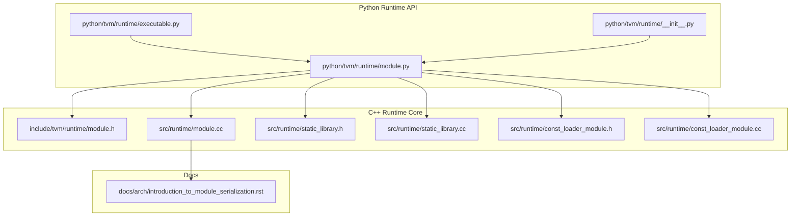
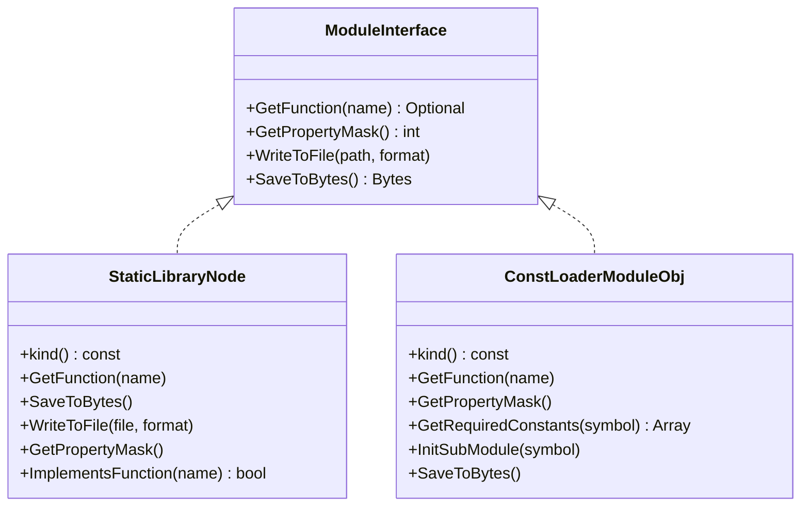
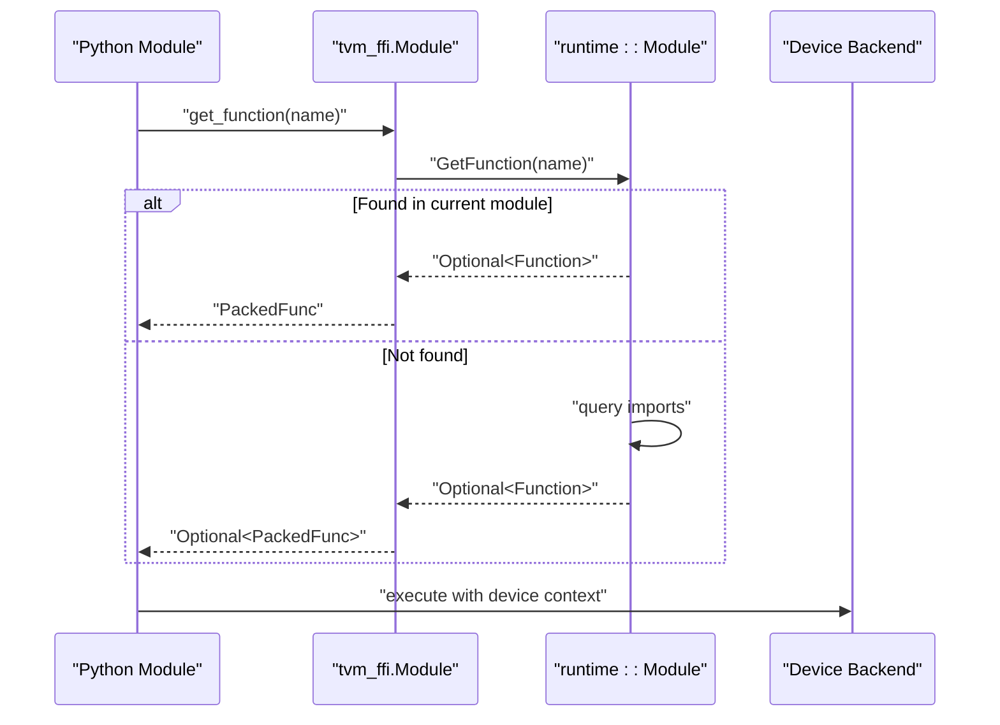
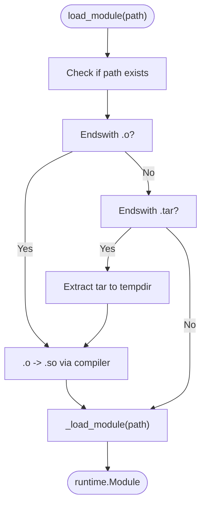
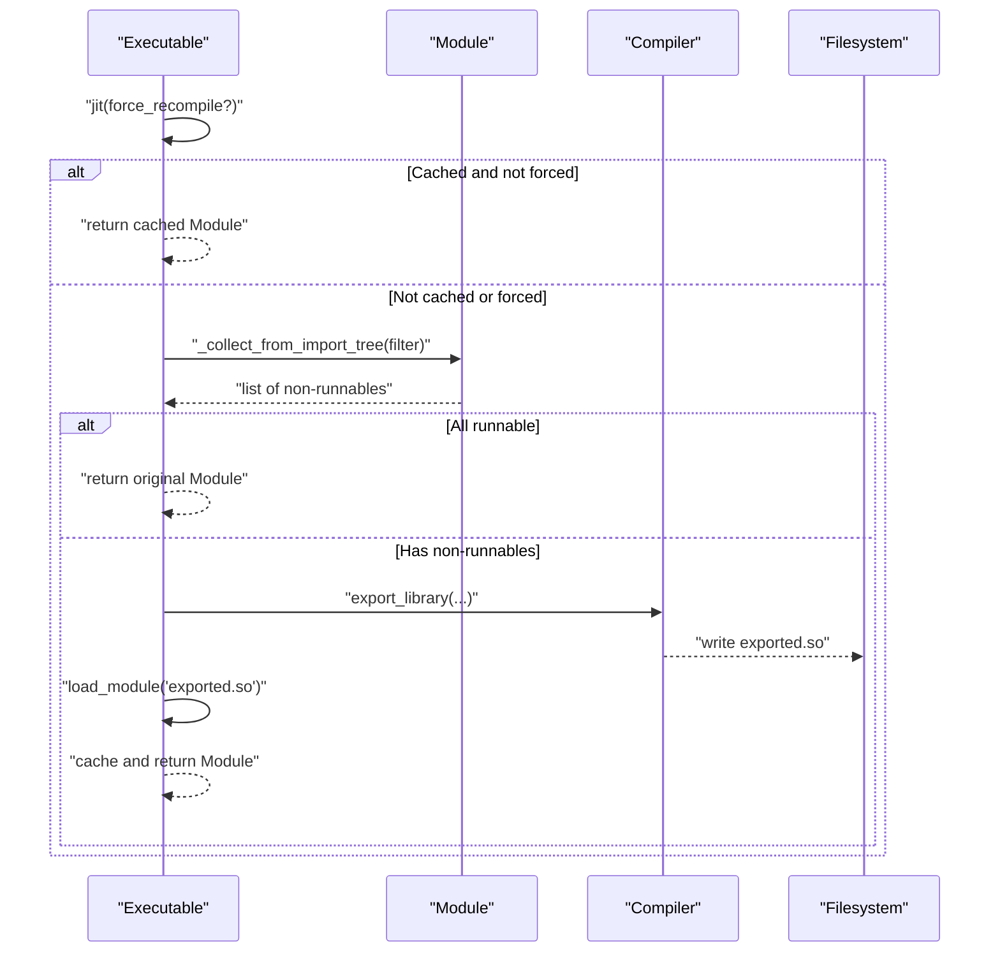
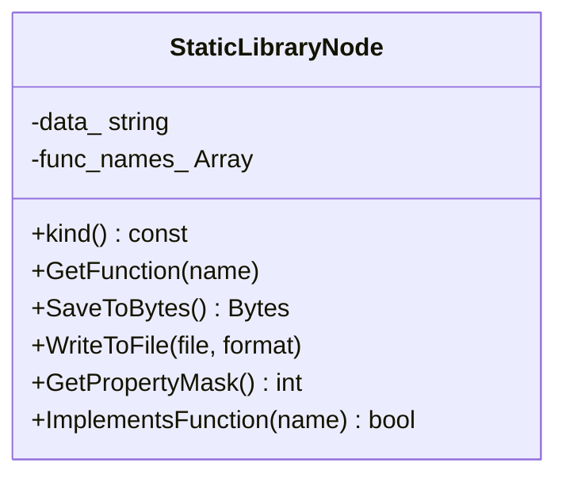
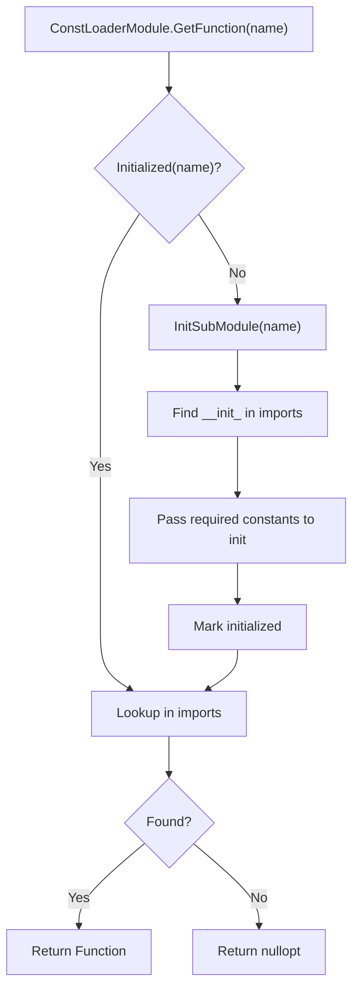
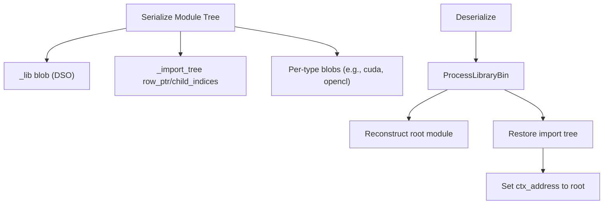
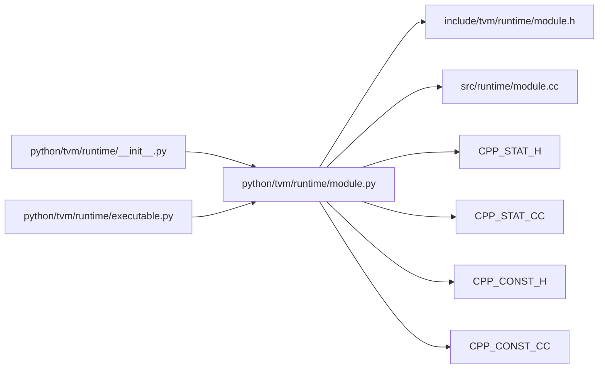

# Module Loading and Execution

<cite>
**Referenced Files in This Document**
- [module.h](file://include/tvm/runtime/module.h)
- [module.cc](file://src/runtime/module.cc)
- [__init__.py](file://python/tvm/runtime/__init__.py)
- [module.py](file://python/tvm/runtime/module.py)
- [executable.py](file://python/tvm/runtime/executable.py)
- [static_library.h](file://src/runtime/static_library.h)
- [static_library.cc](file://src/runtime/static_library.cc)
- [const_loader_module.h](file://src/runtime/const_loader_module.h)
- [const_loader_module.cc](file://src/runtime/const_loader_module.cc)
- [introduction_to_module_serialization.rst](file://docs/arch/introduction_to_module_serialization.rst)
</cite>

## Table of Contents
1. [Introduction](#introduction)
2. [Project Structure](#project-structure)
3. [Core Components](#core-components)
4. [Architecture Overview](#architecture-overview)
5. [Detailed Component Analysis](#detailed-component-analysis)
6. [Dependency Analysis](#dependency-analysis)
7. [Performance Considerations](#performance-considerations)
8. [Troubleshooting Guide](#troubleshooting-guide)
9. [Conclusion](#conclusion)
10. [Appendices](#appendices)

## Introduction
This document explains TVM’s module loading and execution system from a developer’s perspective. It covers how compiled executables are represented as runtime modules, how functions are discovered and resolved, and how modules are initialized, exported, and executed across platforms. It also documents static linking, dynamic loading, module introspection, symbol querying, error handling patterns, and memory-related considerations such as caching and lazy loading.

## Project Structure
At a high level, the module system spans:
- Public C++ API for module interfaces and runtime registration
- Python bindings that expose module loading, JIT export, and execution helpers
- Specialized module types for static libraries and constant-initialized modules
- Serialization and import-tree mechanics for cross-platform deployment

**Diagram sources**
- [module.h](file://include/tvm/runtime/module.h)
- [module.cc](file://src/runtime/module.cc)
- [__init__.py](file://python/tvm/runtime/__init__.py)
- [module.py](file://python/tvm/runtime/module.py)
- [executable.py](file://python/tvm/runtime/executable.py)
- [static_library.h](file://src/runtime/static_library.h)
- [static_library.cc](file://src/runtime/static_library.cc)
- [const_loader_module.h](file://src/runtime/const_loader_module.h)
- [const_loader_module.cc](file://src/runtime/const_loader_module.cc)
- [introduction_to_module_serialization.rst](file://docs/arch/introduction_to_module_serialization.rst)

**Section sources**
- [module.h:1-139](file://include/tvm/runtime/module.h#L1-L139)
- [module.cc:1-94](file://src/runtime/module.cc#L1-L94)
- [__init__.py:19-50](file://python/tvm/runtime/__init__.py#L19-L50)
- [module.py:107-506](file://python/tvm/runtime/module.py#L107-L506)
- [executable.py:30-174](file://python/tvm/runtime/executable.py#L30-L174)
- [static_library.h:26-52](file://src/runtime/static_library.h#L26-L52)
- [static_library.cc:42-144](file://src/runtime/static_library.cc#L42-L144)
- [const_loader_module.h:25-54](file://src/runtime/const_loader_module.h#L25-L54)
- [const_loader_module.cc:46-266](file://src/runtime/const_loader_module.cc#L46-L266)
- [introduction_to_module_serialization.rst:165-193](file://docs/arch/introduction_to_module_serialization.rst#L165-L193)

## Core Components
- Module interface and function resolution
  - The module interface defines a uniform way to discover and call exported functions across different backends. It exposes a function registry and a virtual table macro to bind C++ member functions to callable symbols.
  - Runtime-enabled checks gate optional device backends and targets.

- Python Module class
  - Provides high-level APIs for loading modules, exporting libraries, benchmarking, and introspection. It wraps the underlying C++ module and adds convenience methods for dynamic loading and JIT packaging.

- Executable wrapper
  - Wraps a module that may require on-the-fly compilation and returns a runnable runtime module after exporting and loading a shared library.

- Static library module
  - Represents a prebuilt object file (.o) with known exported function names. It supports serialization and export into a final shared library.

- Constant loader module
  - Initializes imported submodules by passing constant tensors to their initialization functions, enabling separation of code and constants for deployment.

**Section sources**
- [module.h:40-139](file://include/tvm/runtime/module.h#L40-L139)
- [module.cc:38-94](file://src/runtime/module.cc#L38-L94)
- [module.py:107-506](file://python/tvm/runtime/module.py#L107-L506)
- [executable.py:30-174](file://python/tvm/runtime/executable.py#L30-L174)
- [static_library.cc:42-144](file://src/runtime/static_library.cc#L42-L144)
- [const_loader_module.cc:46-266](file://src/runtime/const_loader_module.cc#L46-L266)

## Architecture Overview
The module system composes multiple specialized module types behind a common interface. Modules can be:
- Dynamic shared libraries (DSO)
- Static object files (.o) packaged into DSOs
- Serialized import trees with constant initialization
- System libraries or platform-specific backends

**Diagram sources**
- [module.h:40-139](file://include/tvm/runtime/module.h#L40-L139)
- [static_library.cc:48-123](file://src/runtime/static_library.cc#L48-L123)
- [const_loader_module.cc:50-154](file://src/runtime/const_loader_module.cc#L50-L154)

## Detailed Component Analysis

### Module Interface and Function Resolution
- The module interface declares a virtual function to resolve named functions and a property mask indicating capabilities (e.g., binary serializability, compilation exportability).
- A macro-based virtual table enables binding C++ member functions to callable symbols with automatic argument unpacking and return value handling.
- Runtime-enabled checks determine whether a target’s device runtime is present, allowing safe fallbacks and error reporting.

**Diagram sources**
- [module.h:108-139](file://include/tvm/runtime/module.h#L108-L139)
- [module.cc:38-94](file://src/runtime/module.cc#L38-L94)
- [module.py:107-506](file://python/tvm/runtime/module.py#L107-L506)

**Section sources**
- [module.h:40-139](file://include/tvm/runtime/module.h#L40-L139)
- [module.cc:38-94](file://src/runtime/module.cc#L38-L94)

### Python Module Class: Loading, Exporting, and Benchmarking
- Loading modules from files, including automatic handling of .o and .tar artifacts by converting them to shared libraries.
- Exporting libraries by collecting DSO-compatible modules, optionally packing imports into LLVM/C sources, and invoking a compiler to produce a shared library.
- Benchmarking via a time evaluator that measures repeated invocations and returns statistics.

**Diagram sources**
- [module.py:418-462](file://python/tvm/runtime/module.py#L418-L462)

**Section sources**
- [module.py:107-506](file://python/tvm/runtime/module.py#L107-L506)

### Executable Wrapper: JIT Compilation and Lazy Loading
- The Executable wrapper caches a JIT-compiled module to avoid repeated recompilation.
- It identifies non-runnable modules (e.g., C or static-library kinds) and packages them into a shared library for execution.
- It delegates export to the underlying module and loads the resulting shared library.

**Diagram sources**
- [executable.py:46-114](file://python/tvm/runtime/executable.py#L46-L114)
- [module.py:111-146](file://python/tvm/runtime/module.py#L111-L146)

**Section sources**
- [executable.py:30-174](file://python/tvm/runtime/executable.py#L30-L174)
- [module.py:107-210](file://python/tvm/runtime/module.py#L107-L210)

### Static Library Module: Object Files and Function Names
- A static library module encapsulates raw object file bytes and a list of exported function names.
- It supports serialization/deserialization and marks itself as binary serializable and compilation exportable.
- It exposes a function to list implemented functions for runtime checks.

**Diagram sources**
- [static_library.cc:48-123](file://src/runtime/static_library.cc#L48-L123)
- [static_library.h:42-46](file://src/runtime/static_library.h#L42-L46)

**Section sources**
- [static_library.cc:42-144](file://src/runtime/static_library.cc#L42-L144)
- [static_library.h:26-52](file://src/runtime/static_library.h#L26-L52)

### Constant Loader Module: Separation of Code and Constants
- Initializes imported submodules by passing constant tensors to their initialization functions.
- Maintains a mapping from symbol names to required constants and lazily initializes modules on first use.
- Supports serialization of constants and symbol-to-constants mapping.

**Diagram sources**
- [const_loader_module.cc:72-154](file://src/runtime/const_loader_module.cc#L72-L154)

**Section sources**
- [const_loader_module.cc:46-266](file://src/runtime/const_loader_module.cc#L46-L266)
- [const_loader_module.h:37-48](file://src/runtime/const_loader_module.h#L37-L48)

### Module Serialization and Import Trees
- Modules can be serialized into a single blob that includes:
  - A library blob for DSO modules
  - An import tree structure to reconstruct relationships
  - Per-type binary loaders keyed by blob type keys
- Deserialization reconstructs the root module and sets the context address to enable symbol visibility across the import tree.

**Diagram sources**
- [introduction_to_module_serialization.rst:165-193](file://docs/arch/introduction_to_module_serialization.rst#L165-L193)

**Section sources**
- [introduction_to_module_serialization.rst:165-193](file://docs/arch/introduction_to_module_serialization.rst#L165-L193)

## Dependency Analysis
- Python runtime exposes Module and helper functions, delegating to C++ implementations.
- Module loading paths depend on platform toolchains for .o/.tar artifacts.
- Executable relies on module collection and export to produce runnable modules.
- Static and constant loader modules plug into the module ecosystem via the common interface.

**Diagram sources**
- [__init__.py:19-50](file://python/tvm/runtime/__init__.py#L19-L50)
- [module.py:107-506](file://python/tvm/runtime/module.py#L107-L506)
- [executable.py:30-174](file://python/tvm/runtime/executable.py#L30-L174)
- [module.h:40-139](file://include/tvm/runtime/module.h#L40-L139)
- [module.cc:38-94](file://src/runtime/module.cc#L38-L94)
- [static_library.h:26-52](file://src/runtime/static_library.h#L26-L52)
- [static_library.cc:42-144](file://src/runtime/static_library.cc#L42-L144)
- [const_loader_module.h:25-54](file://src/runtime/const_loader_module.h#L25-L54)
- [const_loader_module.cc:46-266](file://src/runtime/const_loader_module.cc#L46-L266)

**Section sources**
- [__init__.py:19-50](file://python/tvm/runtime/__init__.py#L19-L50)
- [module.py:107-506](file://python/tvm/runtime/module.py#L107-L506)
- [executable.py:30-174](file://python/tvm/runtime/executable.py#L30-L174)
- [module.h:40-139](file://include/tvm/runtime/module.h#L40-L139)
- [module.cc:38-94](file://src/runtime/module.cc#L38-L94)
- [static_library.h:26-52](file://src/runtime/static_library.h#L26-L52)
- [static_library.cc:42-144](file://src/runtime/static_library.cc#L42-L144)
- [const_loader_module.h:25-54](file://src/runtime/const_loader_module.h#L25-L54)
- [const_loader_module.cc:46-266](file://src/runtime/const_loader_module.cc#L46-L266)

## Performance Considerations
- Lazy loading and caching
  - Executable caches the JIT-compiled module to avoid repeated recompilation.
  - Const loader initializes modules on first use and memoizes initialization to minimize repeated overhead.
- Export optimization
  - Collecting only DSO-exportable modules reduces unnecessary work during export.
  - Choosing appropriate object formats and compiler options can improve link times and runtime performance.
- Memory management
  - Serialization and deserialization of modules and constants should be performed carefully to avoid excessive memory copies.
  - Workspace directories for export artifacts should be cleaned up after successful export.

[No sources needed since this section provides general guidance]

## Troubleshooting Guide
- Runtime-enabled checks
  - Use the runtime-enabled API to verify availability of device backends before attempting to load modules targeting those devices.
- Symbol resolution failures
  - When a function is not found, confirm that the module kind supports the requested symbol and that imports are properly attached.
- Static library loading
  - Ensure the function names list matches the actual exported symbols in the object file; mismatches lead to unresolved symbols at runtime.
- Constant loader initialization
  - Verify that required constants are present and correctly mapped to symbols; missing entries cause initialization failures.
- Cross-platform deployment
  - Serialize modules with import trees and rely on per-type loaders to restore platform-specific modules during deserialization.

**Section sources**
- [module.cc:38-94](file://src/runtime/module.cc#L38-L94)
- [module.py:418-462](file://python/tvm/runtime/module.py#L418-L462)
- [static_library.cc:127-144](file://src/runtime/static_library.cc#L127-L144)
- [const_loader_module.cc:140-154](file://src/runtime/const_loader_module.cc#L140-L154)
- [introduction_to_module_serialization.rst:165-193](file://docs/arch/introduction_to_module_serialization.rst#L165-L193)

## Conclusion
TVM’s module system provides a robust, extensible foundation for loading, exporting, and executing compiled AI kernels and functions across diverse targets. By unifying function discovery, supporting static and dynamic linking, and enabling cross-platform serialization, it simplifies deployment and improves runtime performance through caching and lazy initialization.

[No sources needed since this section summarizes without analyzing specific files]

## Appendices

### Practical Examples and Patterns
- Loading a pre-compiled module
  - Use the Python loader to accept .o and .tar artifacts and transparently produce a shared library for execution.
  - Reference: [module.py:418-462](file://python/tvm/runtime/module.py#L418-L462)
- Invoking exported functions
  - Retrieve a function by name from the module and call it with device context.
  - Reference: [module.h:108-139](file://include/tvm/runtime/module.h#L108-L139)
- Handling module dependencies
  - Use the Executable wrapper to package imports and produce a runnable module.
  - Reference: [executable.py:46-114](file://python/tvm/runtime/executable.py#L46-L114)
- Module introspection and symbol querying
  - Inspect module properties and implemented functions via the module interface.
  - Reference: [static_library.cc:94-123](file://src/runtime/static_library.cc#L94-L123)
- Static linking and cross-platform deployment
  - Serialize modules with import trees and rely on per-type loaders during deserialization.
  - Reference: [introduction_to_module_serialization.rst:165-193](file://docs/arch/introduction_to_module_serialization.rst#L165-L193)

[No sources needed since this section aggregates references already cited above]