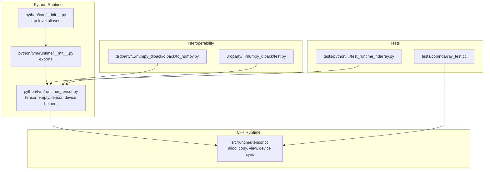
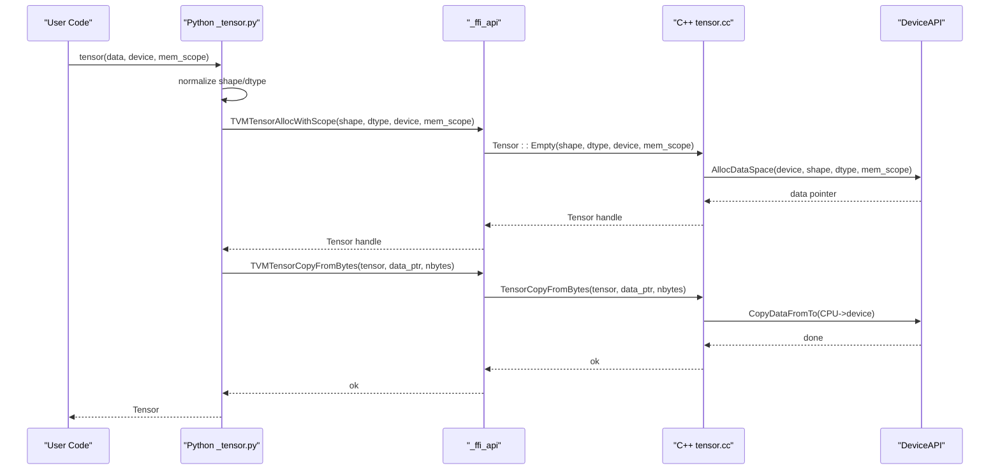
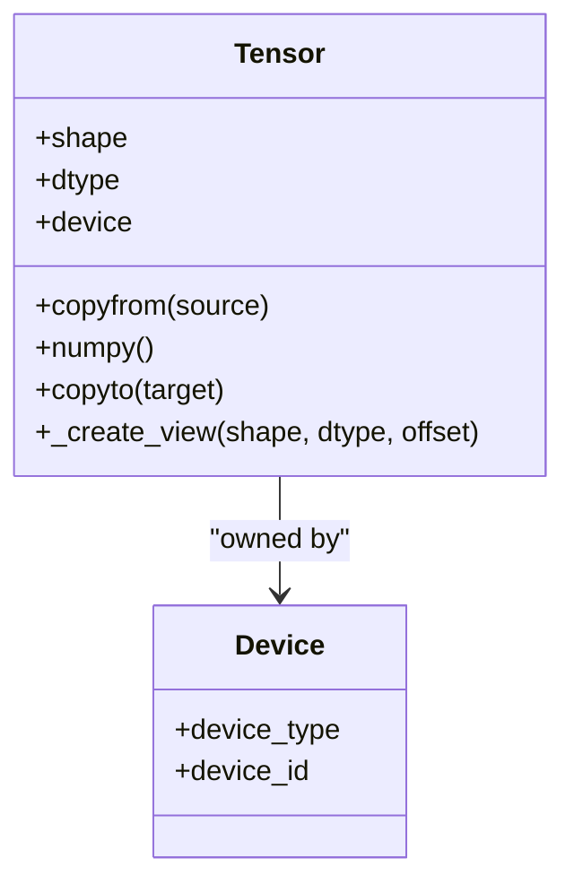
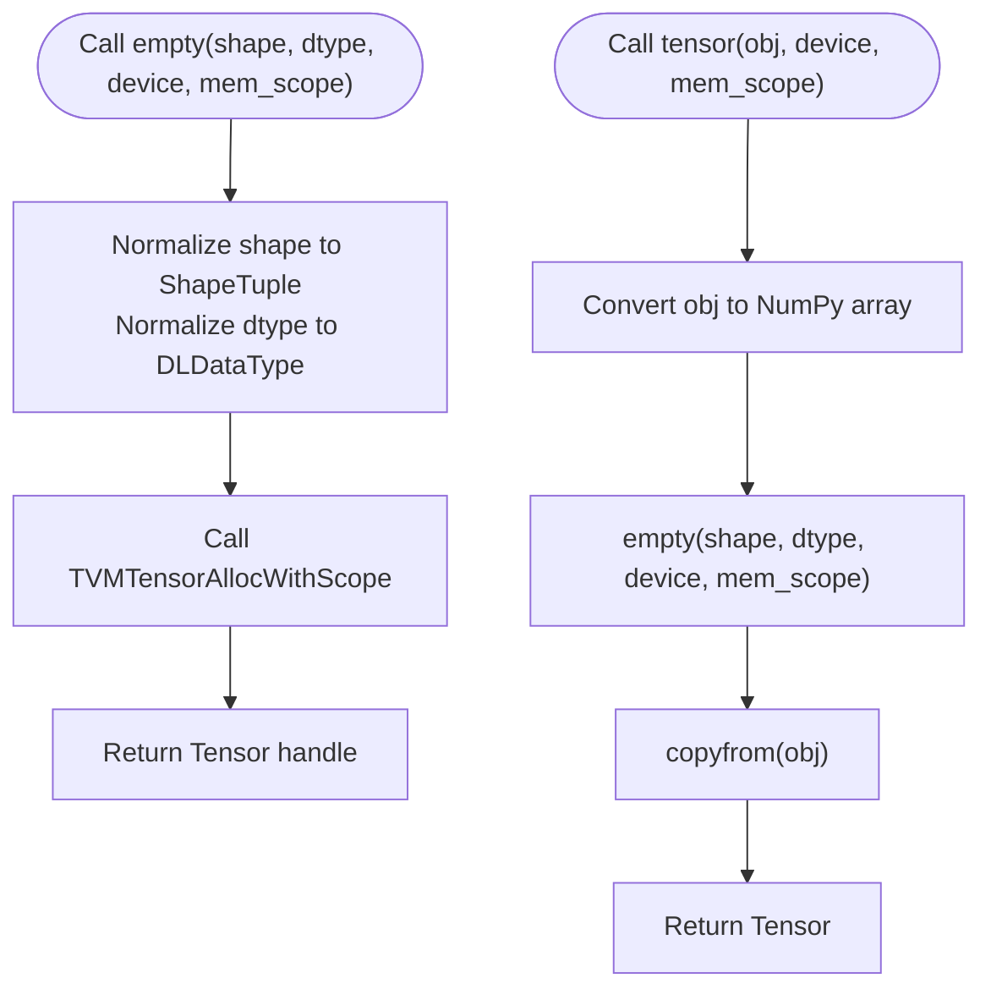
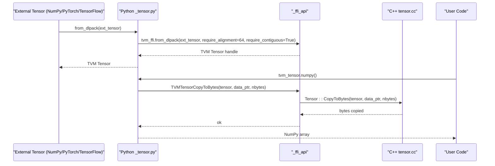
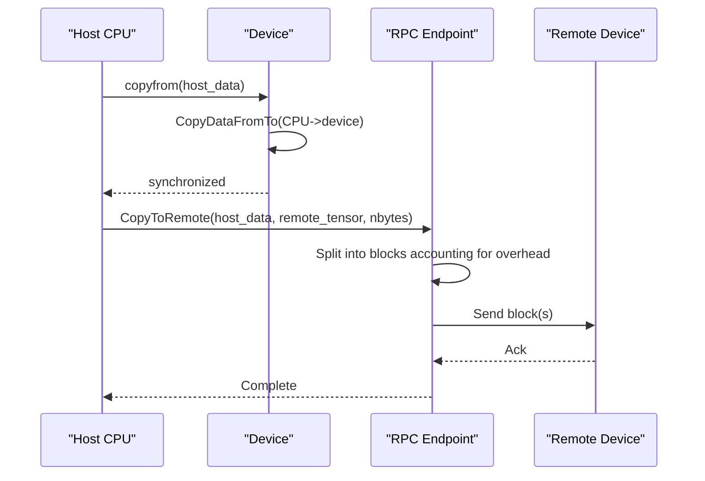
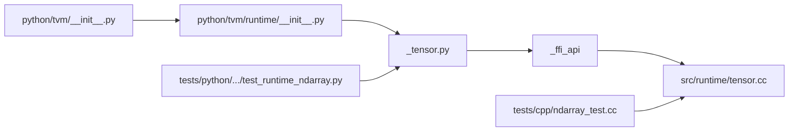

# NDArray Operations

<cite>
**Referenced Files in This Document**
- [python/tvm/runtime/_tensor.py](file://python/tvm/runtime/_tensor.py)
- [src/runtime/tensor.cc](file://src/runtime/tensor.cc)
- [python/tvm/runtime/__init__.py](file://python/tvm/runtime/__init__.py)
- [python/tvm/__init__.py](file://python/tvm/__init__.py)
- [tests/python/all-platform-minimal-test/test_runtime_ndarray.py](file://tests/python/all-platform-minimal-test/test_runtime_ndarray.py)
- [tests/cpp/ndarray_test.cc](file://tests/cpp/ndarray_test.cc)
- [3rdparty/tvm-ffi/3rdparty/dlpack/apps/numpy_dlpack/dlpack/to_numpy.py](file://3rdparty/tvm-ffi/3rdparty/dlpack/apps/numpy_dlpack/dlpack/to_numpy.py)
- [3rdparty/tvm-ffi/3rdparty/dlpack/apps/numpy_dlpack/test.py](file://3rdparty/tvm-ffi/3rdparty/dlpack/apps/numpy_dlpack/test.py)
- [src/runtime/rpc/rpc_endpoint.cc](file://src/runtime/rpc/rpc_endpoint.cc)
- [src/runtime/rpc/rpc_device_api.cc](file://src/runtime/rpc/rpc_device_api.cc)
- [src/runtime/rpc/rpc_session.h](file://src/runtime/rpc/rpc_session.h)
</cite>

## Table of Contents
1. [Introduction](#introduction)
2. [Project Structure](#project-structure)
3. [Core Components](#core-components)
4. [Architecture Overview](#architecture-overview)
5. [Detailed Component Analysis](#detailed-component-analysis)
6. [Dependency Analysis](#dependency-analysis)
7. [Performance Considerations](#performance-considerations)
8. [Troubleshooting Guide](#troubleshooting-guide)
9. [Conclusion](#conclusion)
10. [Appendices](#appendices)

## Introduction
This document provides comprehensive API documentation for TVM’s NDArray (n-dimensional array) system. It covers NDArray creation, manipulation, memory management, tensor shapes and data types, layout conversions, device transfers, array operations (slicing, reshaping, broadcasting, and mathematical computations), serialization/deserialization via DLPack, interoperability with popular frameworks, memory optimization, copy semantics, and performance considerations for large tensors.

## Project Structure
The NDArray runtime is implemented in the Python runtime layer and backed by C++ runtime components. Key areas:
- Python runtime API exposing Tensor, device constructors, and convenience functions
- C++ runtime implementing memory allocation, copying, views, and device transfer
- Tests validating behavior and performance characteristics
- Interoperability helpers for DLPack and NumPy

**Diagram sources**
- [python/tvm/runtime/_tensor.py:1-523](file://python/tvm/runtime/_tensor.py#L1-L523)
- [src/runtime/tensor.cc:1-254](file://src/runtime/tensor.cc#L1-L254)
- [tests/python/all-platform-minimal-test/test_runtime_ndarray.py:1-78](file://tests/python/all-platform-minimal-test/test_runtime_ndarray.py#L1-L78)
- [tests/cpp/ndarray_test.cc:1-74](file://tests/cpp/ndarray_test.cc#L1-L74)
- [3rdparty/tvm-ffi/3rdparty/dlpack/apps/numpy_dlpack/dlpack/to_numpy.py:1-42](file://3rdparty/tvm-ffi/3rdparty/dlpack/apps/numpy_dlpack/dlpack/to_numpy.py#L1-L42)
- [3rdparty/tvm-ffi/3rdparty/dlpack/apps/numpy_dlpack/test.py:1-36](file://3rdparty/tvm-ffi/3rdparty/dlpack/apps/numpy_dlpack/test.py#L1-L36)

**Section sources**
- [python/tvm/runtime/_tensor.py:1-523](file://python/tvm/runtime/_tensor.py#L1-L523)
- [src/runtime/tensor.cc:1-254](file://src/runtime/tensor.cc#L1-L254)
- [python/tvm/runtime/__init__.py:1-50](file://python/tvm/runtime/__init__.py#L1-L50)
- [python/tvm/__init__.py:1-114](file://python/tvm/__init__.py#L1-L114)

## Core Components
- Tensor: Lightweight container representing a buffer with shape, dtype, device, and optional memory scope. Arithmetic operations are not defined on Tensor itself; they are provided by TVM functions/operators.
- Creation functions:
  - empty(shape, dtype="float32", device=None, mem_scope=None): Allocates uninitialized memory on the specified device with optional memory scope.
  - tensor(obj, device=None, mem_scope=None): Creates a Tensor by copying from a NumPy array-like object.
  - device constructors: cpu(), cuda(), rocm(), opencl(), metal(), vulkan(), vpi(), ext_dev(), hexagon(), webgpu().
- Conversion and interop:
  - from_dlpack(ext_tensor): Converts external tensors (e.g., NumPy, PyTorch, TensorFlow) to TVM Tensor using DLPack.
  - numpy(): Converts TVM Tensor to a NumPy array.
- Memory management:
  - copyfrom(source): Synchronous copy from array-like source.
  - copyto(target): Copies to another Tensor or allocates and copies to a new device.
  - _create_view(shape, dtype, relative_byte_offset): Low-level view into existing allocation with independent logical shape and dtype.

Key behaviors:
- Contiguity checks: Copy APIs require contiguous arrays for CPU<->device transfers.
- Data type verification: Strict checks for valid bit-widths and lane configurations.
- Device synchronization: Copy operations synchronize streams to ensure safe access after transfer.

**Section sources**
- [python/tvm/runtime/_tensor.py:300-354](file://python/tvm/runtime/_tensor.py#L300-L354)
- [python/tvm/runtime/_tensor.py:356-522](file://python/tvm/runtime/_tensor.py#L356-L522)
- [python/tvm/runtime/_tensor.py:94-156](file://python/tvm/runtime/_tensor.py#L94-L156)
- [python/tvm/runtime/_tensor.py:229-250](file://python/tvm/runtime/_tensor.py#L229-L250)
- [python/tvm/runtime/_tensor.py:252-298](file://python/tvm/runtime/_tensor.py#L252-L298)
- [src/runtime/tensor.cc:62-121](file://src/runtime/tensor.cc#L62-L121)
- [src/runtime/tensor.cc:217-235](file://src/runtime/tensor.cc#L217-L235)

## Architecture Overview
The NDArray runtime integrates Python user-facing APIs with C++ device-agnostic tensor operations. Python functions allocate and manage Tensor handles, while C++ routines implement memory management, device copies, and synchronization.

**Diagram sources**
- [python/tvm/runtime/_tensor.py:330-354](file://python/tvm/runtime/_tensor.py#L330-L354)
- [src/runtime/tensor.cc:123-136](file://src/runtime/tensor.cc#L123-L136)
- [src/runtime/tensor.cc:62-79](file://src/runtime/tensor.cc#L62-L79)

## Detailed Component Analysis

### Tensor Class and Core Methods
The Tensor class encapsulates a buffer handle and exposes:
- copyfrom(source): Validates shape and dtype, ensures contiguity, and copies bytes to device memory.
- numpy(): Converts device memory to a NumPy array, handling special dtypes and packing/unpacking.
- copyto(target): Copies to another Tensor or allocates on a target device.
- _create_view(shape, dtype, relative_byte_offset): Creates a view into the same allocation with a different logical shape and dtype.

**Diagram sources**
- [python/tvm/runtime/_tensor.py:66-298](file://python/tvm/runtime/_tensor.py#L66-L298)

**Section sources**
- [python/tvm/runtime/_tensor.py:66-298](file://python/tvm/runtime/_tensor.py#L66-L298)

### Creation APIs
- empty(shape, dtype, device, mem_scope): Allocates uninitialized memory on the specified device and returns a Tensor handle.
- tensor(obj, device, mem_scope): Normalizes input to NumPy array, allocates a Tensor, and synchronously copies data.

**Diagram sources**
- [python/tvm/runtime/_tensor.py:300-354](file://python/tvm/runtime/_tensor.py#L300-L354)

**Section sources**
- [python/tvm/runtime/_tensor.py:300-354](file://python/tvm/runtime/_tensor.py#L300-L354)

### Device Constructors and Selection
Device constructors provide convenient ways to select hardware targets:
- cpu(), cuda(), rocm(), opencl(), metal(), vulkan(), vpi(), ext_dev(), hexagon(), webgpu()

These map to DLDeviceType constants and are exported for user convenience.

**Section sources**
- [python/tvm/runtime/_tensor.py:356-522](file://python/tvm/runtime/_tensor.py#L356-L522)
- [python/tvm/runtime/__init__.py:29-36](file://python/tvm/runtime/__init__.py#L29-L36)
- [python/tvm/__init__.py:33-36](file://python/tvm/__init__.py#L33-L36)

### Interoperability with DLPack and NumPy
- from_dlpack(ext_tensor): Converts external tensors (NumPy, PyTorch, TensorFlow) to TVM Tensor with alignment and contiguity requirements.
- numpy(): Converts TVM Tensor to NumPy array, handling special dtypes and packing/unpacking.

**Diagram sources**
- [python/tvm/runtime/_tensor.py:41-62](file://python/tvm/runtime/_tensor.py#L41-L62)
- [python/tvm/runtime/_tensor.py:169-227](file://python/tvm/runtime/_tensor.py#L169-L227)
- [src/runtime/tensor.cc:81-100](file://src/runtime/tensor.cc#L81-L100)

**Section sources**
- [python/tvm/runtime/_tensor.py:41-62](file://python/tvm/runtime/_tensor.py#L41-L62)
- [python/tvm/runtime/_tensor.py:169-227](file://python/tvm/runtime/_tensor.py#L169-L227)
- [3rdparty/tvm-ffi/3rdparty/dlpack/apps/numpy_dlpack/dlpack/to_numpy.py:11-38](file://3rdparty/tvm-ffi/3rdparty/dlpack/apps/numpy_dlpack/dlpack/to_numpy.py#L11-L38)
- [3rdparty/tvm-ffi/3rdparty/dlpack/apps/numpy_dlpack/test.py:6-24](file://3rdparty/tvm-ffi/3rdparty/dlpack/apps/numpy_dlpack/test.py#L6-L24)

### Device Transfers and RPC
- CopyFromTo enforces size equality and device compatibility (CPU or same device type; host-device variants allowed).
- RPC endpoints implement chunked transfers with overhead calculation and asynchronous callbacks for remote memory copies.

**Diagram sources**
- [src/runtime/tensor.cc:217-235](file://src/runtime/tensor.cc#L217-L235)
- [src/runtime/rpc/rpc_endpoint.cc:1136-1160](file://src/runtime/rpc/rpc_endpoint.cc#L1136-L1160)
- [src/runtime/rpc/rpc_device_api.cc:103-113](file://src/runtime/rpc/rpc_device_api.cc#L103-L113)
- [src/runtime/rpc/rpc_session.h:207-238](file://src/runtime/rpc/rpc_session.h#L207-L238)

**Section sources**
- [src/runtime/tensor.cc:217-235](file://src/runtime/tensor.cc#L217-L235)
- [src/runtime/rpc/rpc_endpoint.cc:1136-1160](file://src/runtime/rpc/rpc_endpoint.cc#L1136-L1160)
- [src/runtime/rpc/rpc_device_api.cc:103-113](file://src/runtime/rpc/rpc_device_api.cc#L103-L113)
- [src/runtime/rpc/rpc_session.h:207-238](file://src/runtime/rpc/rpc_session.h#L207-L238)

### Array Operations and Broadcasting
- Slicing and advanced indexing are not implemented on Tensor itself; operations are provided by TVM operators/functions.
- Broadcasting follows standard array-API rules and is handled by TVM’s operator frontends.
- Reshaping is achieved by allocating new Tensors with different shapes and using copy semantics or operator transformations.

Note: Specific operator implementations live in higher-level frontends and are not part of the NDArray runtime layer.

[No sources needed since this section describes general usage patterns without analyzing specific files]

### Serialization and Deserialization
- DLPack-based conversion enables zero-copy transfers between compatible frameworks.
- Tests demonstrate round-trip conversions and stability under repeated conversions.

**Section sources**
- [3rdparty/tvm-ffi/3rdparty/dlpack/apps/numpy_dlpack/test.py:6-24](file://3rdparty/tvm-ffi/3rdparty/dlpack/apps/numpy_dlpack/test.py#L6-L24)

## Dependency Analysis
- Python runtime exports Tensor, device constructors, and convenience functions.
- Internal FFI bridges Python to C++ tensor operations.
- C++ tensor.cc implements allocation, copying, and device synchronization.
- Tests validate correctness and performance characteristics.

**Diagram sources**
- [python/tvm/runtime/__init__.py:29-36](file://python/tvm/runtime/__init__.py#L29-L36)
- [python/tvm/__init__.py:33-36](file://python/tvm/__init__.py#L33-L36)
- [python/tvm/runtime/_tensor.py:300-354](file://python/tvm/runtime/_tensor.py#L300-L354)
- [src/runtime/tensor.cc:123-136](file://src/runtime/tensor.cc#L123-L136)
- [tests/python/all-platform-minimal-test/test_runtime_ndarray.py:30-43](file://tests/python/all-platform-minimal-test/test_runtime_ndarray.py#L30-L43)
- [tests/cpp/ndarray_test.cc:26-73](file://tests/cpp/ndarray_test.cc#L26-L73)

**Section sources**
- [python/tvm/runtime/__init__.py:29-36](file://python/tvm/runtime/__init__.py#L29-L36)
- [python/tvm/__init__.py:33-36](file://python/tvm/__init__.py#L33-L36)
- [python/tvm/runtime/_tensor.py:300-354](file://python/tvm/runtime/_tensor.py#L300-L354)
- [src/runtime/tensor.cc:123-136](file://src/runtime/tensor.cc#L123-L136)
- [tests/python/all-platform-minimal-test/test_runtime_ndarray.py:30-43](file://tests/python/all-platform-minimal-test/test_runtime_ndarray.py#L30-L43)
- [tests/cpp/ndarray_test.cc:26-73](file://tests/cpp/ndarray_test.cc#L26-L73)

## Performance Considerations
- Contiguous memory: Copy APIs enforce contiguous arrays for CPU<->device transfers; ensure input arrays are contiguous to avoid extra copies.
- Alignment: from_dlpack requires alignment and contiguity to guarantee safe access.
- Device synchronization: Copy operations synchronize streams to prevent premature reuse of host buffers.
- RPC transfers: Chunked transfers account for protocol overhead; large transfers benefit from batching and appropriate block sizes.
- Memory scope: Using mem_scope allows device backends to optimize allocation policies (e.g., pinned memory, pooled allocators).
- Reference counting: Deleting the last reference frees device memory; avoid holding unnecessary references to large tensors.

[No sources needed since this section provides general guidance]

## Troubleshooting Guide
Common issues and resolutions:
- Shape mismatch during copyfrom: Ensure the source array shape matches the target Tensor shape.
- Non-contiguous arrays: Convert to contiguous arrays before copyfrom or use ascontiguousarray.
- Unsupported dtype conversions: Some dtypes require additional libraries (e.g., ml_dtypes for bfloat16).
- Cross-device copy errors: Copying between incompatible device types is disallowed; use copyto with a compatible device or a staging CPU buffer.
- RPC transfer failures: Verify block size calculations and session connectivity; ensure sufficient remote memory availability.

**Section sources**
- [python/tvm/runtime/_tensor.py:119-156](file://python/tvm/runtime/_tensor.py#L119-L156)
- [python/tvm/runtime/_tensor.py:169-227](file://python/tvm/runtime/_tensor.py#L169-L227)
- [src/runtime/tensor.cc:217-235](file://src/runtime/tensor.cc#L217-L235)
- [src/runtime/rpc/rpc_endpoint.cc:1136-1160](file://src/runtime/rpc/rpc_endpoint.cc#L1136-L1160)

## Conclusion
TVM’s NDArray runtime provides a lean, efficient tensor container with strong device interoperability and strict memory guarantees. Creation, copying, and device transfers are optimized for performance and safety, while DLPack integration enables seamless interoperability with major frameworks. For advanced operations, leverage TVM’s operator frontends and scheduling infrastructure.

[No sources needed since this section summarizes without analyzing specific files]

## Appendices

### Practical Examples Index
- Creating tensors from NumPy arrays and copying to a device:
  - [tests/python/all-platform-minimal-test/test_runtime_ndarray.py:30-43](file://tests/python/all-platform-minimal-test/test_runtime_ndarray.py#L30-L43)
- Measuring memory usage and allocations:
  - [tests/python/all-platform-minimal-test/test_runtime_ndarray.py:45-69](file://tests/python/all-platform-minimal-test/test_runtime_ndarray.py#L45-L69)
- Contiguity checks for strides:
  - [tests/cpp/ndarray_test.cc:26-73](file://tests/cpp/ndarray_test.cc#L26-L73)
- DLPack interoperability:
  - [3rdparty/tvm-ffi/3rdparty/dlpack/apps/numpy_dlpack/test.py:6-24](file://3rdparty/tvm-ffi/3rdparty/dlpack/apps/numpy_dlpack/test.py#L6-L24)

### Data Type and Shape Semantics
- Shapes: Provided as sequences or ShapeTuple; validated during allocation and view creation.
- Data types: Verified for valid bit-widths and lanes; special handling for packed dtypes (e.g., int4, float4_e2m1fn).
- Layout conversions: Views allow changing logical shape and dtype without copying; physical memory remains shared.

**Section sources**
- [python/tvm/runtime/_tensor.py:252-298](file://python/tvm/runtime/_tensor.py#L252-L298)
- [src/runtime/tensor.cc:36-60](file://src/runtime/tensor.cc#L36-L60)
- [src/runtime/tensor.cc:138-192](file://src/runtime/tensor.cc#L138-L192)