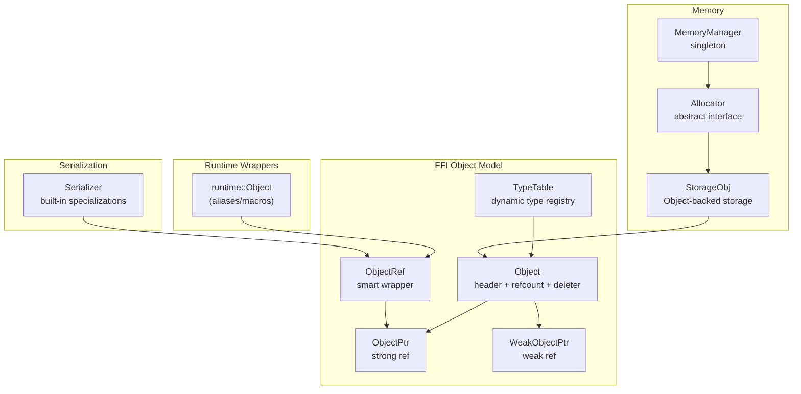
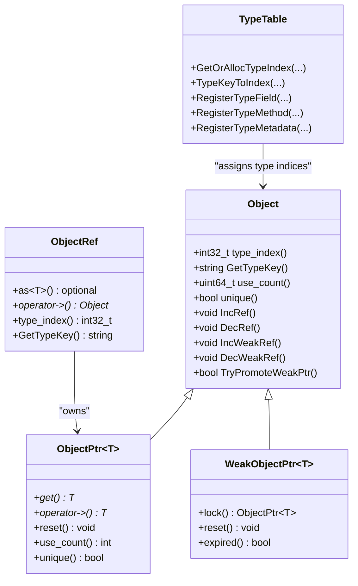
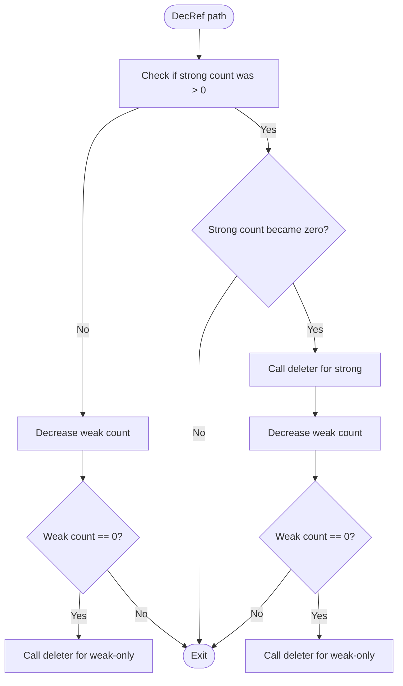
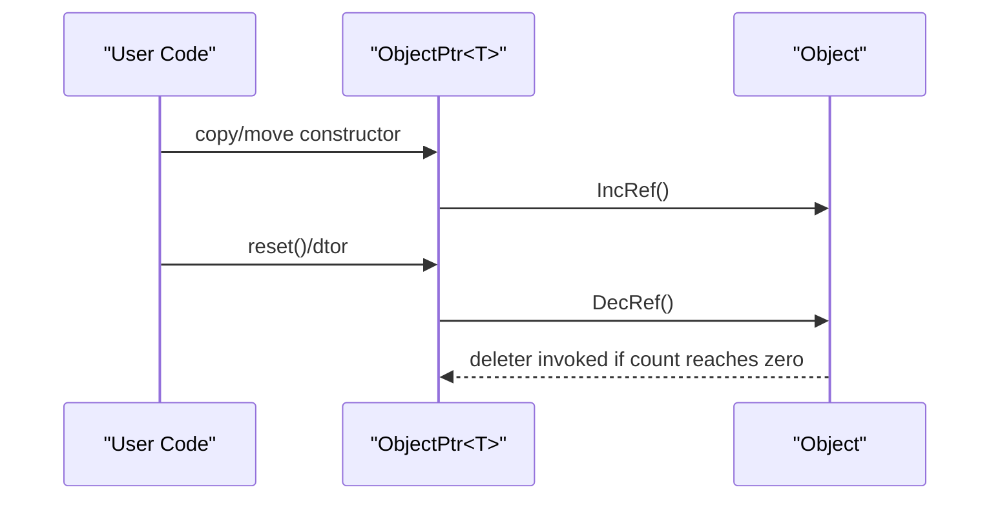
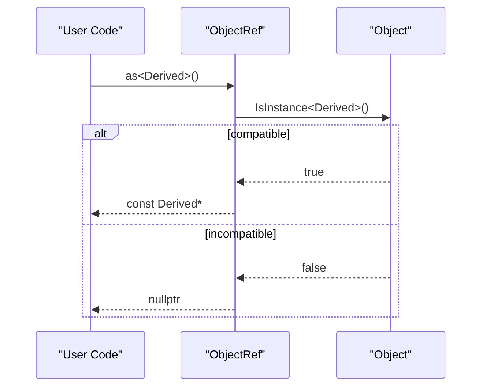
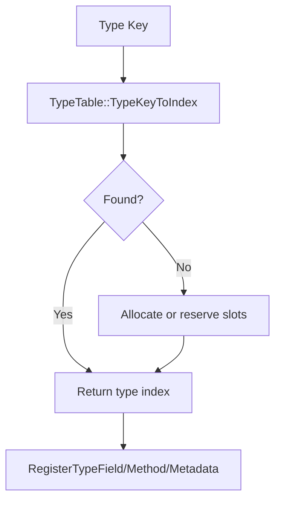
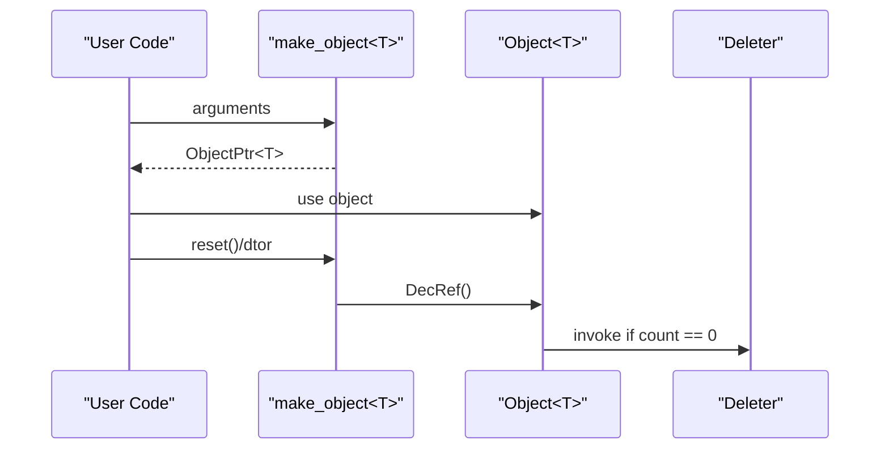
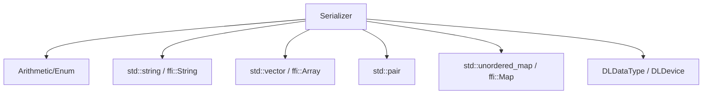
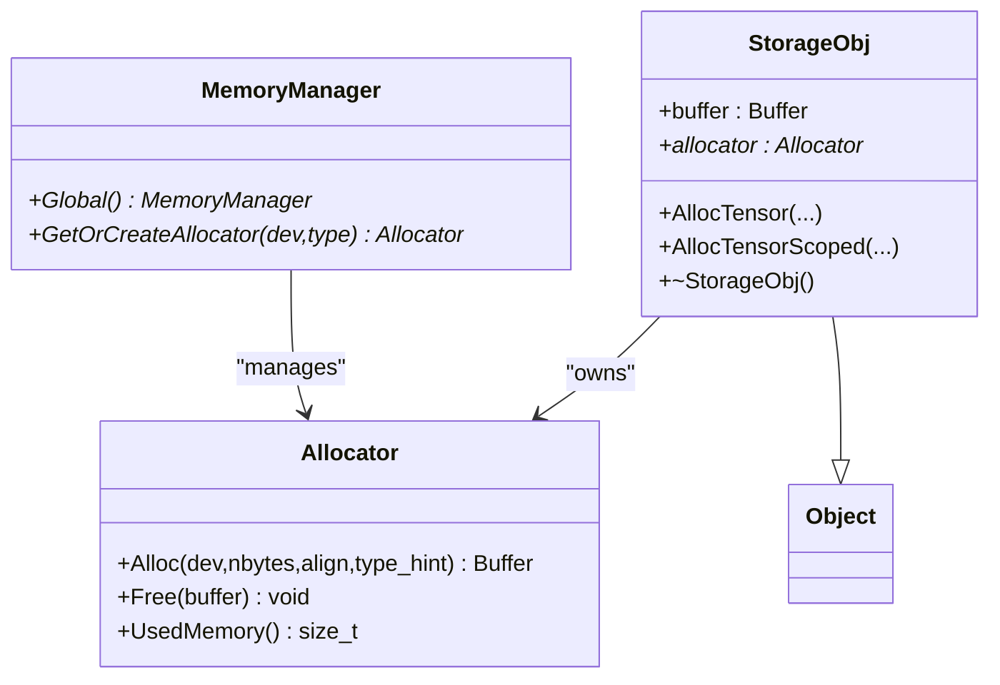
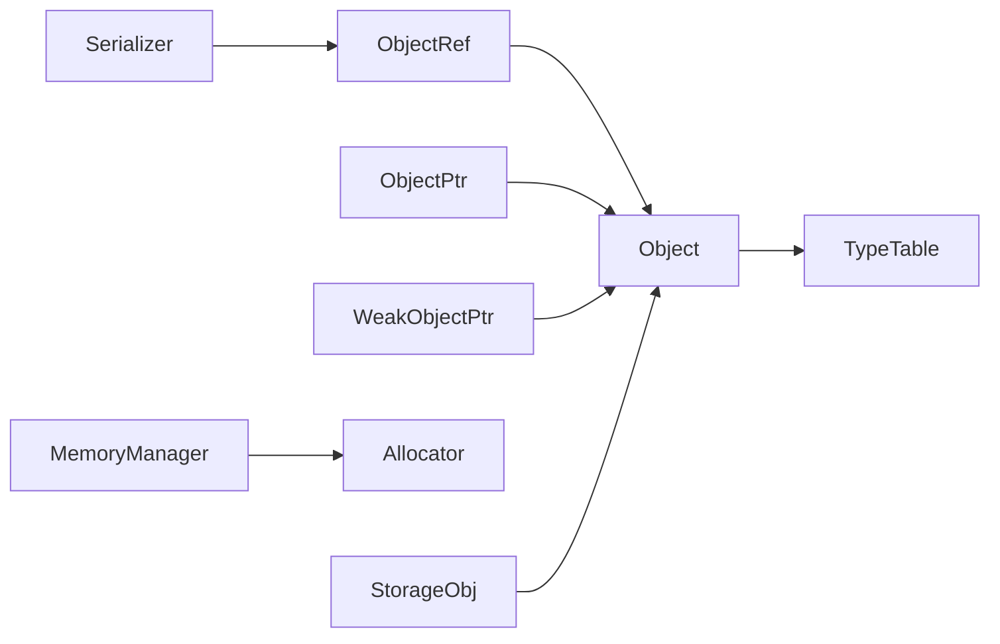

# Object System

<cite>
**Referenced Files in This Document**
- [object.h](file://3rdparty/tvm-ffi/include/tvm/ffi/object.h)
- [object.cc](file://3rdparty/tvm-ffi/src/ffi/object.cc)
- [object_internal.h](file://3rdparty/tvm-ffi/src/ffi/object_internal.h)
- [runtime_object.h](file://include/tvm/runtime/object.h)
- [serializer.h](file://include/tvm/support/serializer.h)
- [memory_manager.h](file://include/tvm/runtime/memory/memory_manager.h)
- [cpp_lang_guide.md](file://3rdparty/tvm-ffi/docs/guides/cpp_lang_guide.md)
</cite>

## Table of Contents
1. [Introduction](#introduction)
2. [Project Structure](#project-structure)
3. [Core Components](#core-components)
4. [Architecture Overview](#architecture-overview)
5. [Detailed Component Analysis](#detailed-component-analysis)
6. [Dependency Analysis](#dependency-analysis)
7. [Performance Considerations](#performance-considerations)
8. [Troubleshooting Guide](#troubleshooting-guide)
9. [Conclusion](#conclusion)

## Introduction
This document describes TVM’s managed object system and memory management. It covers the Object base class, reference counting, weak references, type indexing, object construction/destruction, introspection, dynamic casting, serialization, cross-language interoperability, and practical guidance for building custom objects and avoiding leaks. The goal is to help both new and experienced developers understand how TVM’s object model works and how to use it safely and efficiently.

## Project Structure
The object system spans several headers and a central implementation:
- FFI object model: base classes, smart pointers, type registry, and reflection
- Runtime object wrappers: convenience aliases and macros for runtime usage
- Serialization support: binary serializers for built-in and FFI types
- Memory manager: device/host memory allocation and storage objects backed by Object

**Diagram sources**
- [object.h:205-471](file://3rdparty/tvm-ffi/include/tvm/ffi/object.h#L205-L471)
- [object.h:478-745](file://3rdparty/tvm-ffi/include/tvm/ffi/object.h#L478-L745)
- [object.h:758-890](file://3rdparty/tvm-ffi/include/tvm/ffi/object.h#L758-L890)
- [object.cc:59-452](file://3rdparty/tvm-ffi/src/ffi/object.cc#L59-L452)
- [runtime_object.h:36-147](file://include/tvm/runtime/object.h#L36-L147)
- [serializer.h:54-306](file://include/tvm/support/serializer.h#L54-L306)
- [memory_manager.h:129-181](file://include/tvm/runtime/memory/memory_manager.h#L129-L181)

**Section sources**
- [object.h:205-471](file://3rdparty/tvm-ffi/include/tvm/ffi/object.h#L205-L471)
- [object.h:478-745](file://3rdparty/tvm-ffi/include/tvm/ffi/object.h#L478-L745)
- [object.h:758-890](file://3rdparty/tvm-ffi/include/tvm/ffi/object.h#L758-L890)
- [object.cc:59-452](file://3rdparty/tvm-ffi/src/ffi/object.cc#L59-L452)
- [runtime_object.h:36-147](file://include/tvm/runtime/object.h#L36-L147)
- [serializer.h:54-306](file://include/tvm/support/serializer.h#L54-L306)
- [memory_manager.h:129-181](file://include/tvm/runtime/memory/memory_manager.h#L129-L181)

## Core Components
- Object: base class containing a header with type index, combined strong/weak reference count, and a deleter. Provides type introspection, use_count, and atomic reference manipulation.
- ObjectPtr<T>: RAII strong reference pointer that increments/decrements the reference count on copy/move/reset.
- WeakObjectPtr<T>: weak reference pointer that can upgrade to a strong reference safely.
- ObjectRef: user-facing smart reference to Object, with dynamic casting helpers and type inspection.
- TypeTable: dynamic type registry mapping type keys to runtime type indices, ancestors, and reflection metadata.
- MemoryManager/Allocator/StorageObj: device/host memory management integrated with Object lifecycle.

**Section sources**
- [object.h:205-471](file://3rdparty/tvm-ffi/include/tvm/ffi/object.h#L205-L471)
- [object.h:478-745](file://3rdparty/tvm-ffi/include/tvm/ffi/object.h#L478-L745)
- [object.h:758-890](file://3rdparty/tvm-ffi/include/tvm/ffi/object.h#L758-L890)
- [object.cc:59-452](file://3rdparty/tvm-ffi/src/ffi/object.cc#L59-L452)
- [memory_manager.h:129-181](file://include/tvm/runtime/memory/memory_manager.h#L129-L181)

## Architecture Overview
The object system is designed around a unified header embedded in every Object-derived class. Reference counting is performed atomically using a combined counter for strong and weak counts. Dynamic typing is supported via a global type registry that assigns runtime type indices to user-defined types. Serialization is provided for built-in and FFI types, enabling cross-language persistence and transport.

**Diagram sources**
- [object.h:205-471](file://3rdparty/tvm-ffi/include/tvm/ffi/object.h#L205-L471)
- [object.h:478-745](file://3rdparty/tvm-ffi/include/tvm/ffi/object.h#L478-L745)
- [object.h:758-890](file://3rdparty/tvm-ffi/include/tvm/ffi/object.h#L758-L890)
- [object.cc:59-452](file://3rdparty/tvm-ffi/src/ffi/object.cc#L59-L452)

## Detailed Component Analysis

### Object Base Class and Reference Counting
- Header layout: type_index, combined strong/weak reference count, and a deleter pointer.
- Atomic operations: reference count is manipulated using platform-appropriate atomics and compare-and-swap to ensure thread safety.
- Deletion policy: when the strong reference count reaches zero, the deleter is invoked; if both strong and weak counts reach zero, both strong and weak deletions occur.
- Unique detection: use_count exposes the current strong reference count; unique indicates single ownership.

**Diagram sources**
- [object.h:378-463](file://3rdparty/tvm-ffi/include/tvm/ffi/object.h#L378-L463)

**Section sources**
- [object.h:205-471](file://3rdparty/tvm-ffi/include/tvm/ffi/object.h#L205-L471)
- [object.h:322-463](file://3rdparty/tvm-ffi/include/tvm/ffi/object.h#L322-L463)

### Smart Pointers: ObjectPtr and WeakObjectPtr
- ObjectPtr<T> increments the strong reference on construction and decrements on reset/move.
- WeakObjectPtr<T> increments the weak reference and can upgrade to a strong reference via lock(). TryPromoteWeakPtr ensures safe promotion using compare-and-swap.
- Equality and hashing: ObjectPtrHash/ObjectPtrEqual provide standard-compatible functors for use in unordered containers.

**Diagram sources**
- [object.h:478-608](file://3rdparty/tvm-ffi/include/tvm/ffi/object.h#L478-L608)
- [object.h:615-745](file://3rdparty/tvm-ffi/include/tvm/ffi/object.h#L615-L745)

**Section sources**
- [object.h:478-608](file://3rdparty/tvm-ffi/include/tvm/ffi/object.h#L478-L608)
- [object.h:615-745](file://3rdparty/tvm-ffi/include/tvm/ffi/object.h#L615-L745)

### ObjectRef: Dynamic Casting and Introspection
- as<T>() performs a safe downcast by checking type compatibility via IsInstance.
- Optional-style as<T>() returns an optional ObjectRef of the requested type if compatible.
- getType inspection: type_index and GetTypeKey provide runtime type information.

**Diagram sources**
- [object.h:828-859](file://3rdparty/tvm-ffi/include/tvm/ffi/object.h#L828-L859)

**Section sources**
- [object.h:758-890](file://3rdparty/tvm-ffi/include/tvm/ffi/object.h#L758-L890)
- [object.h:828-859](file://3rdparty/tvm-ffi/include/tvm/ffi/object.h#L828-L859)

### Type Registration and Reflection
- Dynamic type indices are registered via TypeTable. Types can be finalized or leaf types with reserved child slots for fast subtype checks.
- Reflection supports fields, methods, metadata, and attributes. TypeTable stores per-type information and exposes it to the runtime.

**Diagram sources**
- [object.cc:121-188](file://3rdparty/tvm-ffi/src/ffi/object.cc#L121-L188)
- [object.cc:216-269](file://3rdparty/tvm-ffi/src/ffi/object.cc#L216-L269)

**Section sources**
- [object.cc:59-452](file://3rdparty/tvm-ffi/src/ffi/object.cc#L59-L452)

### Object Construction, Destruction, and Lifecycle
- Construction: use make_object<T>(...) to allocate and construct an Object-derived class. The deleter is set up automatically.
- Destruction: DecRef triggers deletion when reference counts drop to zero. For opaque objects, a custom deleter can be supplied.
- Copy-on-write: TVM_DEFINE_OBJECT_REF_COW_METHOD allows mutating a unique object without affecting others by duplicating on write.

**Diagram sources**
- [object.h:205-216](file://3rdparty/tvm-ffi/include/tvm/ffi/object.h#L205-L216)
- [object.h:378-463](file://3rdparty/tvm-ffi/include/tvm/ffi/object.h#L378-L463)
- [runtime_object.h:109-121](file://include/tvm/runtime/object.h#L109-L121)

**Section sources**
- [runtime_object.h:109-121](file://include/tvm/runtime/object.h#L109-L121)
- [object.h:205-216](file://3rdparty/tvm-ffi/include/tvm/ffi/object.h#L205-L216)
- [object.h:378-463](file://3rdparty/tvm-ffi/include/tvm/ffi/object.h#L378-L463)

### Serialization and Cross-Language Interoperability
- Serializer<T> provides binary serialization for arithmetic types, enums, strings, vectors, pairs, unordered_map, ffi::String, ffi::Array, ffi::Map, DLDataType, and DLDevice.
- This enables cross-language persistence and transport of TVM objects and containers.

**Diagram sources**
- [serializer.h:54-306](file://include/tvm/support/serializer.h#L54-L306)

**Section sources**
- [serializer.h:54-306](file://include/tvm/support/serializer.h#L54-L306)

### Memory Management Integration
- MemoryManager provides a global singleton to obtain or create device/host allocators.
- StorageObj derives from Object and encapsulates a Buffer and an Allocator; its destructor frees the underlying buffer.
- This integrates TVM’s memory management with the object lifecycle.

**Diagram sources**
- [memory_manager.h:129-181](file://include/tvm/runtime/memory/memory_manager.h#L129-L181)

**Section sources**
- [memory_manager.h:129-181](file://include/tvm/runtime/memory/memory_manager.h#L129-L181)

### Practical Examples and Patterns
- Creating a custom object: derive from Object, declare type info with TVM_FFI_DECLARE_OBJECT_INFO or FINAL, and construct via make_object<T>.
- Managing hierarchies: use reserved child slots and overflow flags to optimize subtype checks; register reflection metadata for fields/methods.
- Handling references: prefer ObjectRef/ObjectPtr for ownership; use WeakObjectPtr for observer-like references; avoid holding long-lived strong references to prevent leaks.
- Cross-language interoperability: serialize objects using Serializer<T> specializations; ensure type keys and indices are registered.

**Section sources**
- [cpp_lang_guide.md:91-126](file://3rdparty/tvm-ffi/docs/guides/cpp_lang_guide.md#L91-L126)
- [object.h:935-1005](file://3rdparty/tvm-ffi/include/tvm/ffi/object.h#L935-L1005)
- [object.cc:59-452](file://3rdparty/tvm-ffi/src/ffi/object.cc#L59-L452)

## Dependency Analysis
- Object depends on atomic intrinsics and platform-specific memory barriers for reference counting.
- ObjectRef/ObjectPtr depend on Object’s header layout and deleter.
- TypeTable depends on reflection and type metadata to maintain ancestor chains and field/method registries.
- MemoryManager/StorageObj depend on Object for lifecycle management and on device contexts for allocation.

**Diagram sources**
- [object.h:205-890](file://3rdparty/tvm-ffi/include/tvm/ffi/object.h#L205-L890)
- [object.cc:59-452](file://3rdparty/tvm-ffi/src/ffi/object.cc#L59-L452)
- [memory_manager.h:129-181](file://include/tvm/runtime/memory/memory_manager.h#L129-L181)
- [serializer.h:54-306](file://include/tvm/support/serializer.h#L54-L306)

**Section sources**
- [object.h:205-890](file://3rdparty/tvm-ffi/include/tvm/ffi/object.h#L205-L890)
- [object.cc:59-452](file://3rdparty/tvm-ffi/src/ffi/object.cc#L59-L452)
- [memory_manager.h:129-181](file://include/tvm/runtime/memory/memory_manager.h#L129-L181)
- [serializer.h:54-306](file://include/tvm/support/serializer.h#L54-L306)

## Performance Considerations
- Prefer final types with reserved child slots to accelerate IsInstance checks.
- Minimize copying of ObjectRef/ObjectPtr; use move semantics to avoid unnecessary IncRef/DecRef.
- Use WeakObjectPtr for caches or observers to avoid extending object lifetimes.
- For heavy object graphs, consider copy-on-write patterns to reduce duplication costs.
- Serialization is endian-aware; ensure consistent endianness across languages when transporting data.

[No sources needed since this section provides general guidance]

## Troubleshooting Guide
- Stale references: if an object is deleted but a WeakObjectPtr remains, lock() will return a null pointer. Always check expired() or lock() results.
- Type mismatches: as<T>() returns nullptr or std::nullopt for incompatible casts; verify type_index or use GetTypeKey for diagnostics.
- Leaks: ensure ObjectPtr/ObjectRef are destroyed or reset; unique() can help detect single-owner usage.
- Circular references: the object system uses only strong and weak references; cycles are not handled automatically. Break cycles by replacing strong references with weak ones where appropriate.

**Section sources**
- [object.h:615-745](file://3rdparty/tvm-ffi/include/tvm/ffi/object.h#L615-L745)
- [object.h:758-890](file://3rdparty/tvm-ffi/include/tvm/ffi/object.h#L758-L890)

## Conclusion
TVM’s object system provides a robust, type-safe, and cross-language compatible foundation for managed objects. Its atomic reference counting, dynamic type registry, and serialization support enable efficient and safe development of complex IR and runtime constructs. Following the recommended patterns—final types with reserved slots, careful reference management, and optional weak references—helps avoid leaks and performance pitfalls in object-heavy applications.