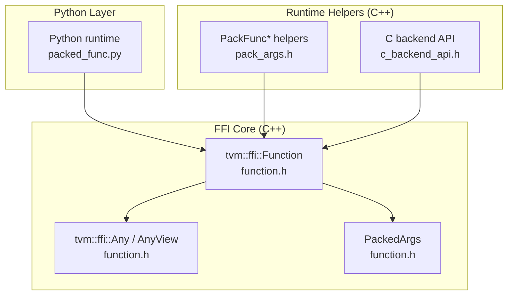
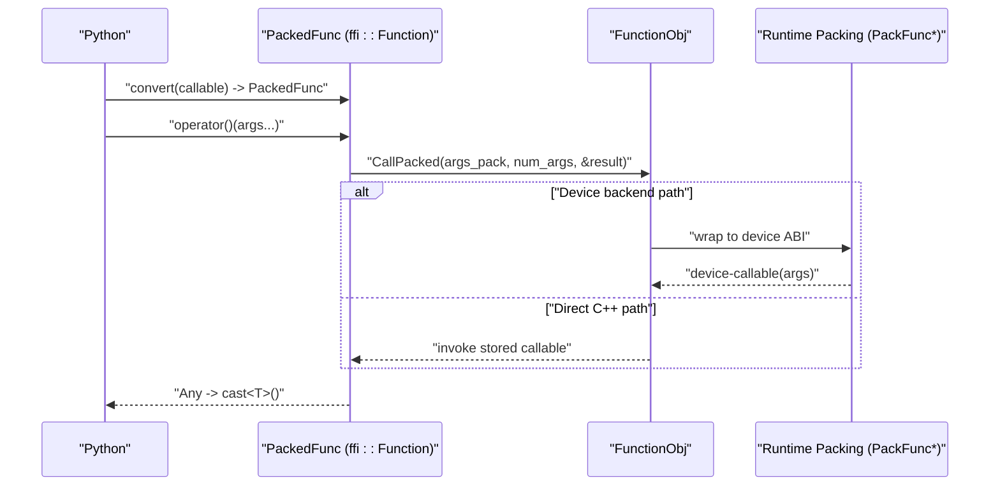
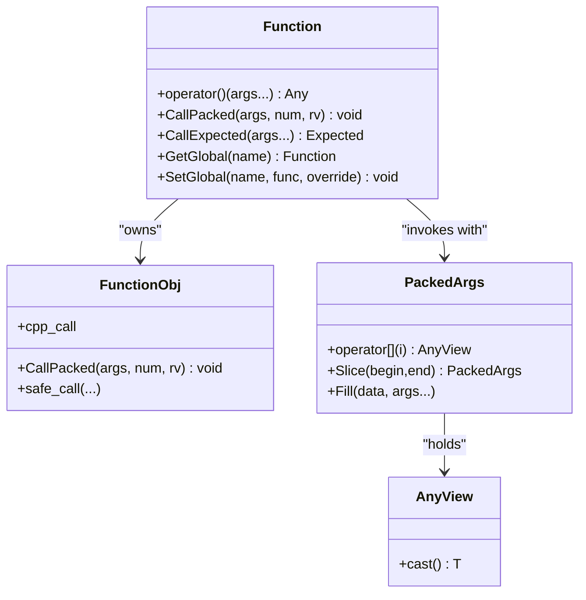
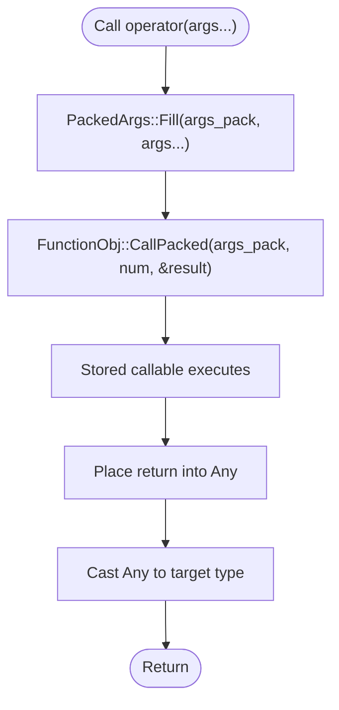
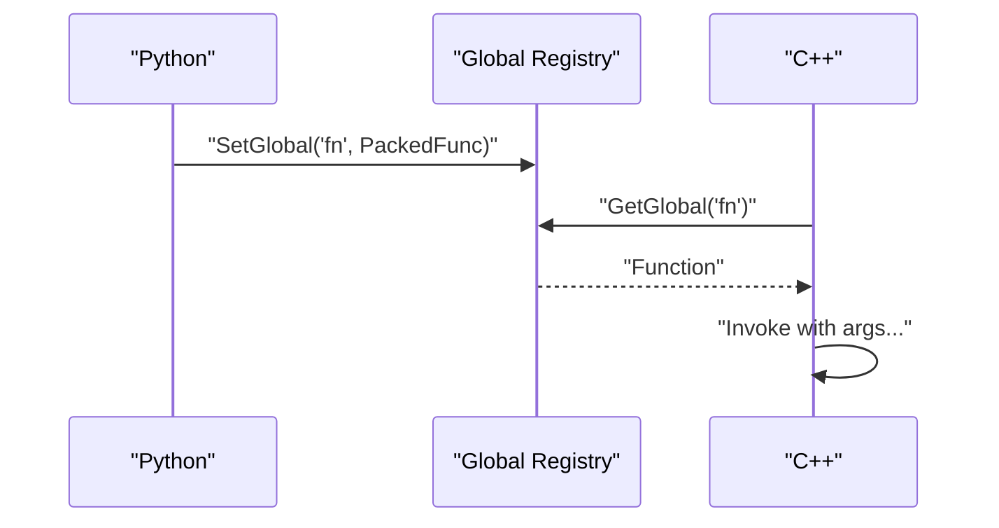
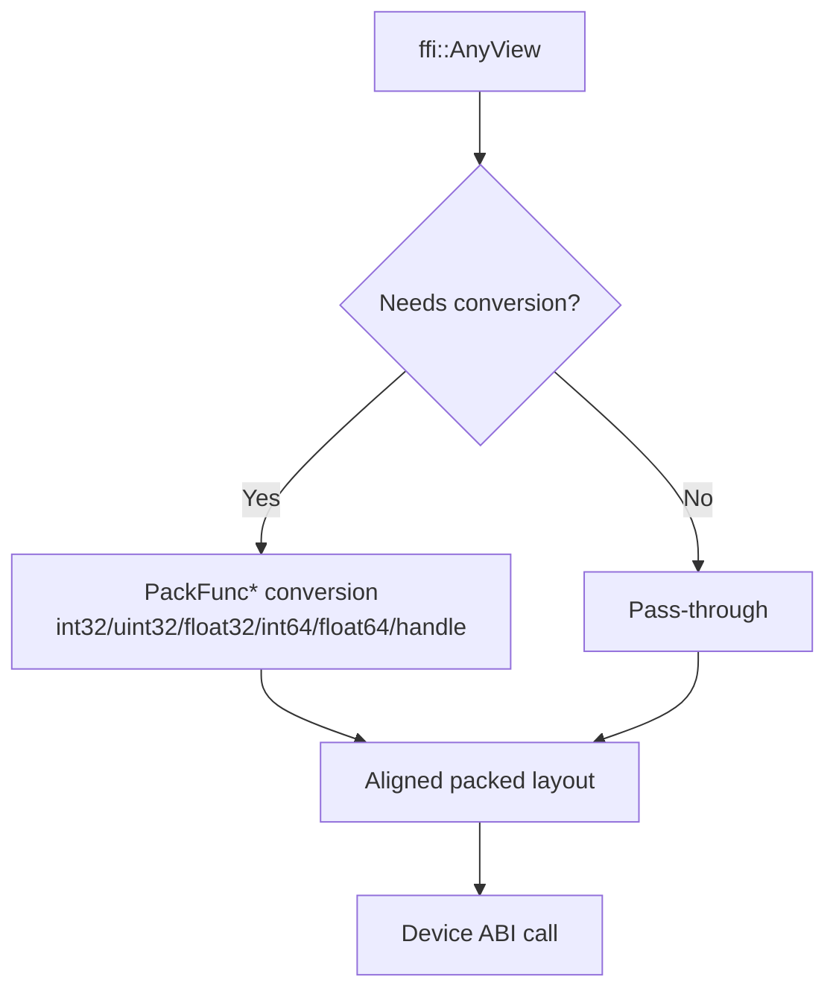
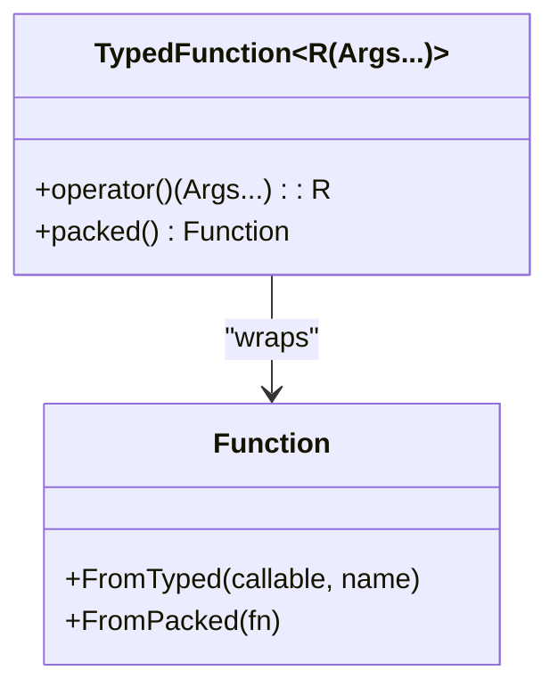
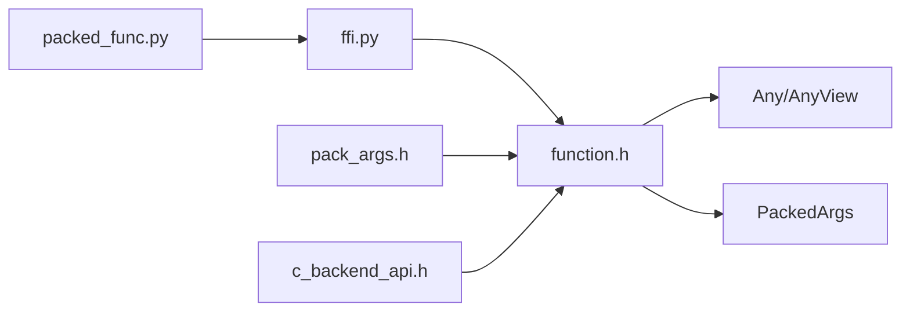

# Packed Functions

<cite>
**Referenced Files in This Document**
- [function.h](file://3rdparty/tvm-ffi/include/tvm/ffi/function.h)
- [pack_args.h](file://src/runtime/pack_args.h)
- [c_backend_api.h](file://include/tvm/runtime/c_backend_api.h)
- [packed_func.py](file://python/tvm/runtime/packed_func.py)
- [runtime.rst](file://docs/arch/runtime.rst)
- [test_runtime_packed_func.py](file://tests/python/all-platform-minimal-test/test_runtime_packed_func.py)
- [ffi.py](file://python/tvm/ffi.py)
</cite>

## Table of Contents
1. [Introduction](#introduction)
2. [Project Structure](#project-structure)
3. [Core Components](#core-components)
4. [Architecture Overview](#architecture-overview)
5. [Detailed Component Analysis](#detailed-component-analysis)
6. [Dependency Analysis](#dependency-analysis)
7. [Performance Considerations](#performance-considerations)
8. [Troubleshooting Guide](#troubleshooting-guide)
9. [Conclusion](#conclusion)

## Introduction
This document explains TVM’s packed function system: how C/C++ functions are wrapped into a type-erased callable, how arguments are marshaled and returned, and how dynamic dispatch and registration work across languages. It covers:
- The PackedFunc wrapper and its role in bridging C++ and Python
- Argument marshaling and return value handling
- Function registration and global lookup
- Dynamic dispatch and type conversion
- Callable objects, lambdas, closures, and variadic invocation
- Introspection and error propagation
- Practical examples and performance/memory considerations

## Project Structure
The packed function system spans three layers:
- FFI core (C++): defines the type-erased function object, argument packing, and global registry
- Runtime helpers (C++): argument packing strategies for device backends
- Python bindings: thin wrappers exposing PackedFunc to Python

**Diagram sources**
- [function.h:316-720](file://3rdparty/tvm-ffi/include/tvm/ffi/function.h#L316-L720)
- [pack_args.h:74-101](file://src/runtime/pack_args.h#L74-L101)
- [c_backend_api.h:37-130](file://include/tvm/runtime/c_backend_api.h#L37-L130)
- [packed_func.py:21-24](file://python/tvm/runtime/packed_func.py#L21-L24)

**Section sources**
- [function.h:316-720](file://3rdparty/tvm-ffi/include/tvm/ffi/function.h#L316-L720)
- [pack_args.h:74-101](file://src/runtime/pack_args.h#L74-L101)
- [c_backend_api.h:37-130](file://include/tvm/runtime/c_backend_api.h#L37-L130)
- [packed_func.py:21-24](file://python/tvm/runtime/packed_func.py#L21-L24)

## Core Components
- Packed function object: a type-erased callable that stores a callable object and exposes a uniform call interface. It supports both C++ direct calls and safe-call exception-handling paths.
- Argument packing: PackedArgs and AnyView form a stack-based argument container that supports heterogeneous types and automatic conversion.
- Return handling: Any/AnyView carries return values and supports casting to target types.
- Global registry: functions can be registered globally by name and retrieved later.
- Runtime packing helpers: PackFuncVoidAddr, PackFuncNonBufferArg, PackFuncPackedArgAligned adapt packed arguments to device ABI conventions.

**Section sources**
- [function.h:113-149](file://3rdparty/tvm-ffi/include/tvm/ffi/function.h#L113-L149)
- [function.h:261-314](file://3rdparty/tvm-ffi/include/tvm/ffi/function.h#L261-L314)
- [function.h:316-720](file://3rdparty/tvm-ffi/include/tvm/ffi/function.h#L316-L720)
- [pack_args.h:74-101](file://src/runtime/pack_args.h#L74-L101)

## Architecture Overview
The packed function architecture unifies C++ and Python through a common ABI. Python code converts callables to PackedFunc; C++ code invokes them with typed signatures. Device backends receive arguments in specialized layouts.

**Diagram sources**
- [function.h:613-622](file://3rdparty/tvm-ffi/include/tvm/ffi/function.h#L613-L622)
- [function.h:125-131](file://3rdparty/tvm-ffi/include/tvm/ffi/function.h#L125-L131)
- [pack_args.h:311-331](file://src/runtime/pack_args.h#L311-L331)

## Detailed Component Analysis

### Packed Function Wrapper and Invocation
- Construction: Packed functions can be built from lambdas, functors, or typed functions. They capture callables and expose a uniform call operator.
- Invocation: operator() packs arguments into AnyView, calls CallPacked, and returns Any, which can be cast to the desired type.
- Exception safety: CallExpected returns Expected<T> to avoid throwing C++ exceptions across boundaries.
- Global registry: GetGlobal/SetGlobal/RemoveGlobal manage named functions.

**Diagram sources**
- [function.h:316-720](file://3rdparty/tvm-ffi/include/tvm/ffi/function.h#L316-L720)
- [function.h:261-314](file://3rdparty/tvm-ffi/include/tvm/ffi/function.h#L261-L314)

**Section sources**
- [function.h:316-720](file://3rdparty/tvm-ffi/include/tvm/ffi/function.h#L316-L720)
- [runtime.rst:51-134](file://docs/arch/runtime.rst#L51-L134)

### Argument Marshaling and Return Handling
- PackedArgs holds AnyView entries for each argument. Fill constructs the packed array from variadic inputs.
- AnyView supports type-safe casting via cast<T>(). Return values are placed into Any and later cast to target types.
- Variadic invocation: operator() supports arbitrary argument lists; they are packed and forwarded to the underlying callable.

**Diagram sources**
- [function.h:613-622](file://3rdparty/tvm-ffi/include/tvm/ffi/function.h#L613-L622)
- [function.h:125-131](file://3rdparty/tvm-ffi/include/tvm/ffi/function.h#L125-L131)

**Section sources**
- [function.h:261-314](file://3rdparty/tvm-ffi/include/tvm/ffi/function.h#L261-L314)
- [function.h:613-622](file://3rdparty/tvm-ffi/include/tvm/ffi/function.h#L613-L622)

### Function Registration and Dynamic Dispatch
- Global registration: SetGlobal associates a name with a PackedFunc; GetGlobal retrieves it by name.
- Listing and removal: ListGlobalNames enumerates all registered functions; RemoveGlobal deletes a function.
- Examples demonstrate registering Python callables and invoking them from C++ via global names.

**Diagram sources**
- [function.h:409-492](file://3rdparty/tvm-ffi/include/tvm/ffi/function.h#L409-L492)
- [runtime.rst:80-134](file://docs/arch/runtime.rst#L80-L134)

**Section sources**
- [function.h:409-521](file://3rdparty/tvm-ffi/include/tvm/ffi/function.h#L409-L521)
- [runtime.rst:80-134](file://docs/arch/runtime.rst#L80-L134)

### Type Conversion Mechanisms
- Type-erased storage: AnyView stores heterogeneous values; cast<T>() performs conversions when possible.
- Device ABI conversions: PackFunc* helpers convert numeric types and handles to device-friendly layouts, ensuring alignment and proper sizes.
- Buffer vs non-buffer distinction: NumBufferArgs separates buffer arguments from scalar arguments for efficient packing.

**Diagram sources**
- [pack_args.h:141-156](file://src/runtime/pack_args.h#L141-L156)
- [pack_args.h:311-331](file://src/runtime/pack_args.h#L311-L331)

**Section sources**
- [pack_args.h:141-156](file://src/runtime/pack_args.h#L141-L156)
- [pack_args.h:311-377](file://src/runtime/pack_args.h#L311-L377)

### Callable Objects, Lambdas, and Closures
- Lambdas and functors: Converted to PackedFunc via FromTyped or FromPacked; captures are moved to avoid dangling references.
- TypedFunction: Compile-time typed wrapper around Function; supports construction from lambdas and conversion to Function.
- Closures: Stored in the callable object; lifetime is managed by the Function object.

**Diagram sources**
- [function.h:757-891](file://3rdparty/tvm-ffi/include/tvm/ffi/function.h#L757-L891)

**Section sources**
- [function.h:535-562](file://3rdparty/tvm-ffi/include/tvm/ffi/function.h#L535-L562)
- [function.h:757-891](file://3rdparty/tvm-ffi/include/tvm/ffi/function.h#L757-L891)

### Practical Examples

- Wrapping a C++ function and calling from Python:
  - Register a global function in C++ and retrieve it in Python via get_global_func.
  - Reference: [runtime.rst:80-134](file://docs/arch/runtime.rst#L80-L134)

- Invoking Python callables from C++:
  - Convert a Python function to PackedFunc; pass it to C++ and call it from C++.
  - Reference: [runtime.rst:113-134](file://docs/arch/runtime.rst#L113-L134)

- Handling variadic arguments:
  - PackedArgs supports arbitrary argument lists; operator() forwards them transparently.
  - Reference: [function.h:613-622](file://3rdparty/tvm-ffi/include/tvm/ffi/function.h#L613-L622)

- Converting Python objects to TVM runtime types:
  - Tests show converting dicts, arrays, tensors, and scalars to PackedFunc-compatible forms.
  - Reference: [test_runtime_packed_func.py:78-158](file://tests/python/all-platform-minimal-test/test_runtime_packed_func.py#L78-L158)

- Python PackedFunc alias:
  - Python runtime exposes PackedFunc via tvm_ffi.
  - Reference: [packed_func.py:21-24](file://python/tvm/runtime/packed_func.py#L21-L24)

**Section sources**
- [runtime.rst:80-134](file://docs/arch/runtime.rst#L80-L134)
- [test_runtime_packed_func.py:78-158](file://tests/python/all-platform-minimal-test/test_runtime_packed_func.py#L78-L158)
- [packed_func.py:21-24](file://python/tvm/runtime/packed_func.py#L21-L24)

### Function Introspection and Signature Querying
- Global function listing: ListGlobalNames returns all registered function names.
- Type schema and metadata: TypedFunction exposes TypeSchema; TVM_FFI_DLL_EXPORT_TYPED_FUNC can export metadata and docstrings.
- References:
  - [function.h:511-521](file://3rdparty/tvm-ffi/include/tvm/ffi/function.h#L511-L521)
  - [function.h:883-886](file://3rdparty/tvm-ffi/include/tvm/ffi/function.h#L883-L886)
  - [function.h:990-1012](file://3rdparty/tvm-ffi/include/tvm/ffi/function.h#L990-L1012)
  - [function.h:1052-1067](file://3rdparty/tvm-ffi/include/tvm/ffi/function.h#L1052-L1067)

**Section sources**
- [function.h:511-521](file://3rdparty/tvm-ffi/include/tvm/ffi/function.h#L511-L521)
- [function.h:883-886](file://3rdparty/tvm-ffi/include/tvm/ffi/function.h#L883-L886)
- [function.h:990-1012](file://3rdparty/tvm-ffi/include/tvm/ffi/function.h#L990-L1012)
- [function.h:1052-1067](file://3rdparty/tvm-ffi/include/tvm/ffi/function.h#L1052-L1067)

### Error Propagation
- Safe call boundary: TVM_FFI_SAFE_CALL_BEGIN/END wrap C++ code to translate exceptions into error codes and propagate Error objects.
- CallExpected: Provides exception-free invocation by returning Expected<T>; caller checks for ok/error and casts appropriately.
- References:
  - [function.h:72-107](file://3rdparty/tvm-ffi/include/tvm/ffi/function.h#L72-L107)
  - [function.h:640-692](file://3rdparty/tvm-ffi/include/tvm/ffi/function.h#L640-L692)

**Section sources**
- [function.h:72-107](file://3rdparty/tvm-ffi/include/tvm/ffi/function.h#L72-L107)
- [function.h:640-692](file://3rdparty/tvm-ffi/include/tvm/ffi/function.h#L640-L692)

## Dependency Analysis
- Python PackedFunc is an alias to tvm_ffi.Function.
- FFI core depends on Any/AnyView and the object lifecycle system.
- Runtime packing helpers depend on DLDataType and device ABI conventions.
- C backend API provides low-level primitives for device-side execution.

**Diagram sources**
- [packed_func.py:21-24](file://python/tvm/runtime/packed_func.py#L21-L24)
- [ffi.py:21](file://python/tvm/ffi.py#L21)
- [function.h:316-720](file://3rdparty/tvm-ffi/include/tvm/ffi/function.h#L316-L720)
- [pack_args.h:74-101](file://src/runtime/pack_args.h#L74-L101)
- [c_backend_api.h:37-130](file://include/tvm/runtime/c_backend_api.h#L37-L130)

**Section sources**
- [packed_func.py:21-24](file://python/tvm/runtime/packed_func.py#L21-L24)
- [ffi.py:21](file://python/tvm/ffi.py#L21)
- [function.h:316-720](file://3rdparty/tvm-ffi/include/tvm/ffi/function.h#L316-L720)
- [pack_args.h:74-101](file://src/runtime/pack_args.h#L74-L101)
- [c_backend_api.h:37-130](file://include/tvm/runtime/c_backend_api.h#L37-L130)

## Performance Considerations
- Stack-based packing: PackedArgs::Fill writes directly into a small stack buffer; keep argument counts modest to reduce allocations.
- Specialized packers: PackFuncVoidAddr/PackFuncNonBufferArg/PackFuncPackedArgAligned choose optimal specializations based on argument count and types.
- Alignment: PackedArgAligned ensures struct fields meet ABI alignment; slight overhead but correctness for device calls.
- Exception handling: Prefer CallExpected to avoid throwing exceptions across boundaries; reduces overhead in hot paths.
- Memory management: Packed functions capture callables by value; avoid large closures to prevent unnecessary copies.

[No sources needed since this section provides general guidance]

## Troubleshooting Guide
- Type mismatches: If casting fails, ensure argument types match the expected schema. Use CallExpected to capture and inspect Error.
- Missing global functions: Verify SetGlobal was called and the name matches exactly; use ListGlobalNames to enumerate.
- Device ABI errors: Confirm argument types and order; NumBufferArgs helps separate buffer from scalar arguments.
- Python conversion issues: Ensure Python objects are convertible to TVM runtime types (e.g., tensors, scalars, dicts).

**Section sources**
- [function.h:640-692](file://3rdparty/tvm-ffi/include/tvm/ffi/function.h#L640-L692)
- [function.h:511-521](file://3rdparty/tvm-ffi/include/tvm/ffi/function.h#L511-L521)
- [pack_args.h:333-344](file://src/runtime/pack_args.h#L333-L344)
- [test_runtime_packed_func.py:78-158](file://tests/python/all-platform-minimal-test/test_runtime_packed_func.py#L78-L158)

## Conclusion
TVM’s packed function system provides a robust, type-erased bridge between C++ and Python, enabling dynamic dispatch, flexible argument marshaling, and safe error propagation. With global registries, typed wrappers, and runtime packing helpers, it supports efficient device-side execution and seamless inter-language interoperability.