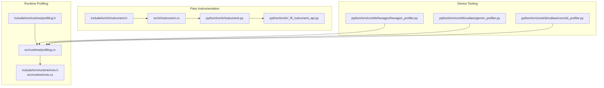
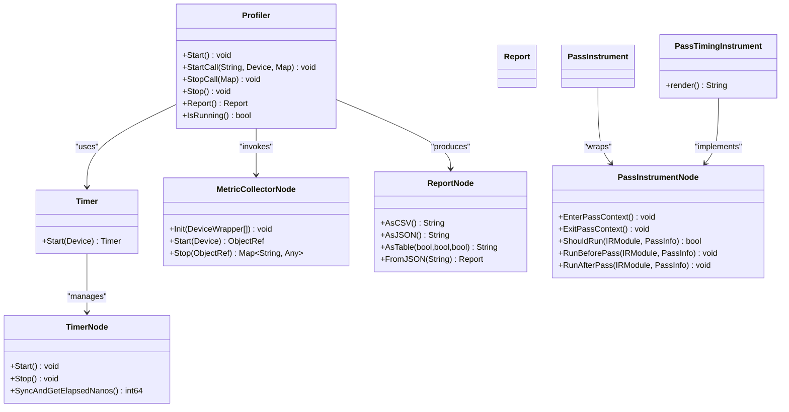
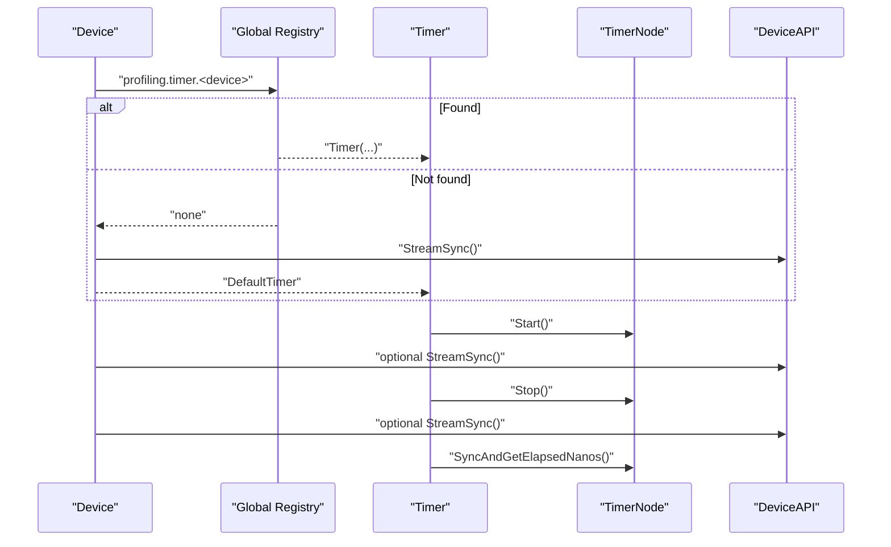
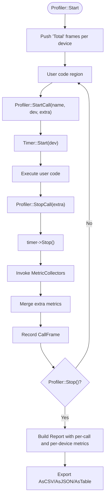
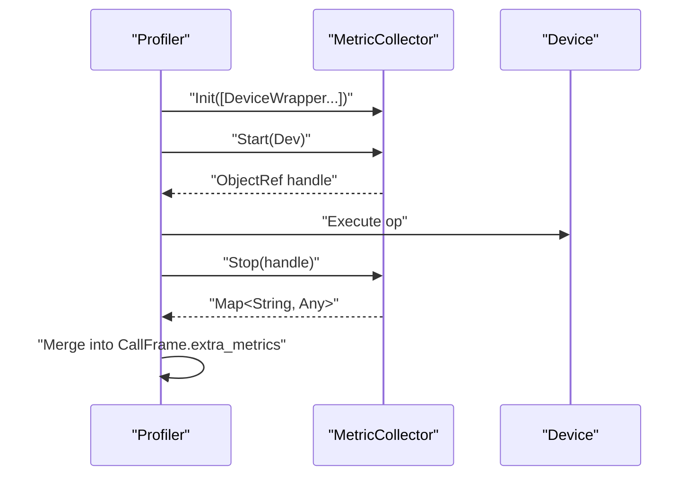
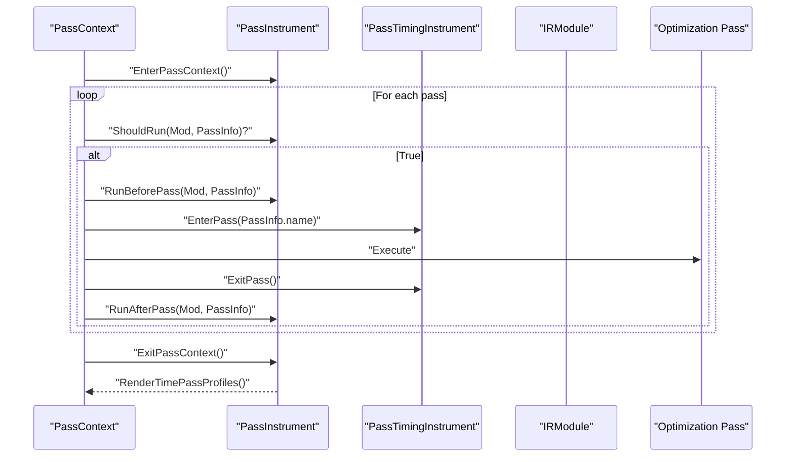
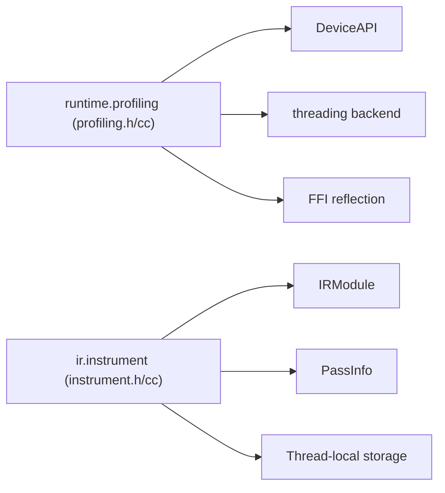

# Profiling and Monitoring

<cite>
**Referenced Files in This Document**
- [profiling.h](file://include/tvm/runtime/profiling.h)
- [profiling.cc](file://src/runtime/profiling.cc)
- [instrument.h](file://include/tvm/ir/instrument.h)
- [instrument.cc](file://src/ir/instrument.cc)
- [instrument.py](file://python/tvm/ir/instrument.py)
- [_ffi_instrument_api.py](file://python/tvm/ir/_ffi_instrument_api.py)
- [profiling.rst](file://docs/reference/api/python/runtime/profiling.rst)
- [nvtx.h](file://include/tvm/runtime/nvtx.h)
- [nvtx.cc](file://src/runtime/nvtx.cc)
- [hexagon_profiler.py](file://python/tvm/contrib/hexagon/hexagon_profiler.py)
- [gemm_profiler.py](file://python/tvm/contrib/cutlass/gemm_profiler.py)
- [conv2d_profiler.py](file://python/tvm/contrib/cutlass/conv2d_profiler.py)
- [test_vm_profiler.py](file://tests/python/relax/test_vm_profiler.py)
- [test_meta_schedule_profiler.py](file://tests/python/s_tir/meta_schedule/test_meta_schedule_profiler.py)
</cite>

## Table of Contents
1. [Introduction](#introduction)
2. [Project Structure](#project-structure)
3. [Core Components](#core-components)
4. [Architecture Overview](#architecture-overview)
5. [Detailed Component Analysis](#detailed-component-analysis)
6. [Dependency Analysis](#dependency-analysis)
7. [Performance Considerations](#performance-considerations)
8. [Troubleshooting Guide](#troubleshooting-guide)
9. [Conclusion](#conclusion)
10. [Appendices](#appendices)

## Introduction
This document describes TVM’s profiling and monitoring capabilities across runtime, pass-level transformations, and device-specific toolchains. It covers:
- Timing utilities and timers for CPU/GPU and default fallbacks
- Runtime profiler for function/operator calls with metrics aggregation
- Event logging and NVTX integration for GPU visibility
- Pass instrumentation for compile-time profiling and logging
- Metrics collection via user-defined collectors and exported reports
- Practical examples for measuring execution time, tracking memory allocations, and analyzing bottlenecks
- Export formats (CSV, JSON, human-readable tables), visualization tips, and production deployment guidance

## Project Structure
TVM’s profiling spans three layers:
- Runtime-level profiling: timers, per-call profiling, and report generation
- Pass-level instrumentation: compile-time profiling of IR transforms
- Device-specific tooling: NVTX markers, vendor profilers (Hexagon/CUTLASS)

**Diagram sources**
- [profiling.h:42-591](file://include/tvm/runtime/profiling.h#L42-L591)
- [profiling.cc:47-938](file://src/runtime/profiling.cc#L47-L938)
- [instrument.h:45-157](file://include/tvm/ir/instrument.h#L45-L157)
- [instrument.cc:34-343](file://src/ir/instrument.cc#L34-L343)
- [instrument.py:33-342](file://python/tvm/ir/instrument.py#L33-L342)
- [_ffi_instrument_api.py:17-22](file://python/tvm/ir/_ffi_instrument_api.py#L17-L22)
- [nvtx.h](file://include/tvm/runtime/nvtx.h)
- [nvtx.cc](file://src/runtime/nvtx.cc)
- [hexagon_profiler.py](file://python/tvm/contrib/hexagon/hexagon_profiler.py)
- [gemm_profiler.py](file://python/tvm/contrib/cutlass/gemm_profiler.py)
- [conv2d_profiler.py](file://python/tvm/contrib/cutlass/conv2d_profiler.py)

**Section sources**
- [profiling.h:42-591](file://include/tvm/runtime/profiling.h#L42-L591)
- [profiling.cc:47-938](file://src/runtime/profiling.cc#L47-L938)
- [instrument.h:45-157](file://include/tvm/ir/instrument.h#L45-L157)
- [instrument.cc:34-343](file://src/ir/instrument.cc#L34-L343)
- [instrument.py:33-342](file://python/tvm/ir/instrument.py#L33-L342)
- [_ffi_instrument_api.py:17-22](file://python/tvm/ir/_ffi_instrument_api.py#L17-L22)

## Core Components
- TimerNode and Timer: device-specific timing with a default fallback; supports Start/Stop and synchronized elapsed retrieval
- Profiler: records per-call durations, aggregates metrics, computes percentages, and produces CSV/JSON/table reports
- MetricCollector: extensible mechanism to collect device-specific metrics (e.g., FLOPs, cache events)
- Report: structured profiling results with per-call and per-device metrics plus configuration
- PassInstrument: pass-level instrumentation with Enter/Exit context and Before/After hooks
- NVTX: optional GPU event markers for timeline visualization
- Device profilers: Hexagon and CUTLASS helpers for specialized kernels

**Section sources**
- [profiling.h:46-148](file://include/tvm/runtime/profiling.h#L46-L148)
- [profiling.h:365-427](file://include/tvm/runtime/profiling.h#L365-L427)
- [profiling.h:279-328](file://include/tvm/runtime/profiling.h#L279-L328)
- [profiling.h:179-277](file://include/tvm/runtime/profiling.h#L179-L277)
- [instrument.h:103-144](file://include/tvm/ir/instrument.h#L103-L144)
- [nvtx.h](file://include/tvm/runtime/nvtx.h)
- [nvtx.cc](file://src/runtime/nvtx.cc)

## Architecture Overview
The runtime profiler integrates with TVM’s device API to time code regions and collect metrics. It supports:
- Nested call frames with per-device timers
- User-defined collectors for device-specific counters
- Aggregation and normalization to percentages
- Export to CSV/JSON/table for downstream analysis

**Diagram sources**
- [profiling.h:46-148](file://include/tvm/runtime/profiling.h#L46-L148)
- [profiling.h:279-328](file://include/tvm/runtime/profiling.h#L279-L328)
- [profiling.h:365-427](file://include/tvm/runtime/profiling.h#L365-L427)
- [profiling.h:179-277](file://include/tvm/runtime/profiling.h#L179-L277)
- [instrument.h:103-144](file://include/tvm/ir/instrument.h#L103-L144)

## Detailed Component Analysis

### Runtime Timers and Timing Utilities
- Timer::Start(Device) selects a device-specific timer via a global registry; if none exists, a default timer is used with CPU-device synchronization overhead
- DefaultTimerNode synchronizes device streams before/after timing to ensure correctness
- CPU timer uses high-resolution clock without device synchronization

**Diagram sources**
- [profiling.cc:94-115](file://src/runtime/profiling.cc#L94-L115)
- [profiling.cc:47-67](file://src/runtime/profiling.cc#L47-L67)
- [profiling.cc:71-82](file://src/runtime/profiling.cc#L71-L82)

**Section sources**
- [profiling.h:46-148](file://include/tvm/runtime/profiling.h#L46-L148)
- [profiling.cc:47-115](file://src/runtime/profiling.cc#L47-L115)

### Runtime Profiler and Reports
- Profiler maintains a stack of in-flight call frames, each with a Timer and optional extra metrics
- Start/Stop wraps a region; StopCall collects metrics from collectors and merges extra metrics
- Report normalizes per-call durations to microseconds, computes percentages against total per device, and exposes CSV/JSON/table

**Diagram sources**
- [profiling.cc:142-183](file://src/runtime/profiling.cc#L142-L183)
- [profiling.cc:149-176](file://src/runtime/profiling.cc#L149-L176)
- [profiling.cc:663-703](file://src/runtime/profiling.cc#L663-L703)
- [profiling.h:179-277](file://include/tvm/runtime/profiling.h#L179-L277)

**Section sources**
- [profiling.h:365-427](file://include/tvm/runtime/profiling.h#L365-L427)
- [profiling.cc:124-140](file://src/runtime/profiling.cc#L124-L140)
- [profiling.cc:663-703](file://src/runtime/profiling.cc#L663-L703)

### Metric Collectors and Extended Metrics
- MetricCollectorNode defines Init/Start/Stop for device-specific metrics
- Collectors are initialized with DeviceWrapper and invoked around call frames
- Results are merged into the Report’s per-call metrics

**Diagram sources**
- [profiling.h:279-328](file://include/tvm/runtime/profiling.h#L279-L328)
- [profiling.cc:149-176](file://src/runtime/profiling.cc#L149-L176)

**Section sources**
- [profiling.h:279-328](file://include/tvm/runtime/profiling.h#L279-L328)
- [profiling.cc:149-176](file://src/runtime/profiling.cc#L149-L176)

### Pass Instrumentation and Compile-Time Profiling
- PassInstrumentNode defines EnterPassContext, ExitPassContext, ShouldRun, RunBeforePass, RunAfterPass
- BasePassInstrument bridges Python callbacks to C++ and registers a “PassTimingInstrument” that measures pass durations
- RenderPassProfiles prints hierarchical pass timings with self-time and parent-relative percentages

**Diagram sources**
- [instrument.h:103-144](file://include/tvm/ir/instrument.h#L103-L144)
- [instrument.cc:38-177](file://src/ir/instrument.cc#L38-L177)
- [instrument.cc:243-264](file://src/ir/instrument.cc#L243-L264)
- [instrument.cc:319-339](file://src/ir/instrument.cc#L319-L339)
- [instrument.py:234-259](file://python/tvm/ir/instrument.py#L234-L259)

**Section sources**
- [instrument.h:103-144](file://include/tvm/ir/instrument.h#L103-L144)
- [instrument.cc:199-317](file://src/ir/instrument.cc#L199-L317)
- [instrument.py:234-259](file://python/tvm/ir/instrument.py#L234-L259)

### NVTX Integration for GPU Timeline Visibility
- NVTX markers can be inserted around regions to visualize kernel timelines in profiling tools
- Integrates with runtime timers and pass instrumentation for end-to-end visibility

**Section sources**
- [nvtx.h](file://include/tvm/runtime/nvtx.h)
- [nvtx.cc](file://src/runtime/nvtx.cc)

### Device-Specific Profilers
- Hexagon profiler: helper utilities for Hexagon device profiling workflows
- CUTLASS profilers: GEMM and Conv2D operation profilers for NVIDIA targets

**Section sources**
- [hexagon_profiler.py](file://python/tvm/contrib/hexagon/hexagon_profiler.py)
- [gemm_profiler.py](file://python/tvm/contrib/cutlass/gemm_profiler.py)
- [conv2d_profiler.py](file://python/tvm/contrib/cutlass/conv2d_profiler.py)

## Dependency Analysis
- Runtime profiling depends on:
  - Device API for stream synchronization and device selection
  - Threading backend to initialize thread pools for collectors
  - FFI reflection for global registry and object registration
- Pass instrumentation depends on:
  - IR module and pass information structures
  - Thread-local storage for hierarchical pass timing

**Diagram sources**
- [profiling.cc:124-140](file://src/runtime/profiling.cc#L124-L140)
- [instrument.cc:238-241](file://src/ir/instrument.cc#L238-L241)

**Section sources**
- [profiling.cc:124-140](file://src/runtime/profiling.cc#L124-L140)
- [instrument.cc:238-241](file://src/ir/instrument.cc#L238-L241)

## Performance Considerations
- Minimizing timer overhead:
  - Prefer device-specific timers when available; default timers synchronize host and device
  - Batch repeated invocations and use WrapTimeEvaluator to stabilize measurements
- Measurement strategy:
  - Warm-up iterations before timing to prime caches
  - Dynamic repetition scaling based on measured durations
- Reporting overhead:
  - Aggregation and formatting occur after timing; keep extra metrics minimal
- Thread safety:
  - Profiler initializes thread pools to attach per-thread collectors

**Section sources**
- [profiling.h:48-74](file://include/tvm/runtime/profiling.h#L48-L74)
- [profiling.cc:851-914](file://src/runtime/profiling.cc#L851-L914)
- [profiling.cc:124-140](file://src/runtime/profiling.cc#L124-L140)

## Troubleshooting Guide
- No device-specific timer found:
  - A warning is logged and a default timer is used; expect higher overhead
- Zero-duration measurements:
  - WrapTimeEvaluator includes safeguards to increase repetition until a minimum duration is met
- RPC modules:
  - Profiling over RPC is not supported due to collector transport limitations
- Pass profiling not printed:
  - Ensure pass profiling is enabled and context is exited before rendering; mismatched enter/exit will cause an error

**Section sources**
- [profiling.cc:98-106](file://src/runtime/profiling.cc#L98-L106)
- [profiling.cc:897-900](file://src/runtime/profiling.cc#L897-L900)
- [profiling.cc:840-848](file://src/runtime/profiling.cc#L840-L848)
- [instrument.cc:249-255](file://src/ir/instrument.cc#L249-L255)

## Conclusion
TVM provides a layered profiling toolkit:
- Runtime-level timers and a flexible profiler for function/operator timing and metrics
- Pass instrumentation for compile-time profiling and logging
- NVTX integration and device-specific profilers for GPU and specialized kernels
- Rich export formats and aggregation for analysis and reporting

Adopt the recommended measurement strategies and production guidelines to minimize overhead and ensure reliable results.

## Appendices

### Practical Examples Index
- Measuring function execution time:
  - Use WrapTimeEvaluator to time repeated executions with dynamic repetition and optional cache flushing
  - Reference: [profiling.cc:851-914](file://src/runtime/profiling.cc#L851-L914)
- Tracking memory allocations:
  - Use MetricCollector to capture allocation counts and sizes; merge into CallFrame metrics
  - Reference: [profiling.h:279-328](file://include/tvm/runtime/profiling.h#L279-L328)
- Analyzing performance bottlenecks:
  - Use Profiler with nested StartCall/StopCall and Report.AsTable to aggregate and sort by duration
  - Reference: [profiling.cc:663-703](file://src/runtime/profiling.cc#L663-L703)
- Exporting profiling data:
  - CSV: Report.AsCSV; JSON: Report.AsJSON; Human-readable: Report.AsTable
  - Reference: [profiling.h:204-256](file://include/tvm/runtime/profiling.h#L204-L256)
- Integrating with external monitoring:
  - Use Report.AsJSON for ingestion into external systems; combine with pass instrumentation logs
  - Reference: [instrument.cc:319-339](file://src/ir/instrument.cc#L319-L339)

### API Surface Summary
- Runtime profiling:
  - Timer::Start, DefaultTimer, Profiler, Report, MetricCollector
  - Reference: [profiling.h:46-591](file://include/tvm/runtime/profiling.h#L46-L591)
- Pass instrumentation:
  - PassInstrument, PassTimingInstrument, PassPrintingInstrument, DumpIR
  - Reference: [instrument.h:103-144](file://include/tvm/ir/instrument.h#L103-L144), [instrument.py:33-342](file://python/tvm/ir/instrument.py#L33-L342)
- Documentation module:
  - tvm.runtime.profiling (Python API reference)
  - Reference: [profiling.rst:18-22](file://docs/reference/api/python/runtime/profiling.rst#L18-L22)