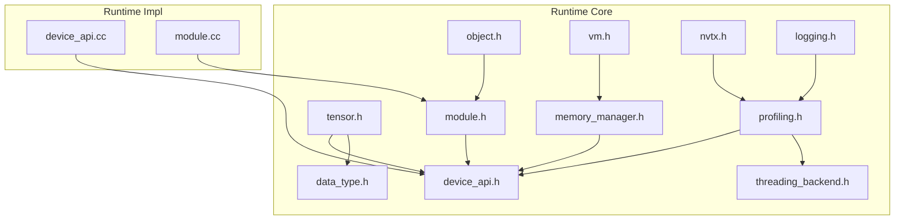
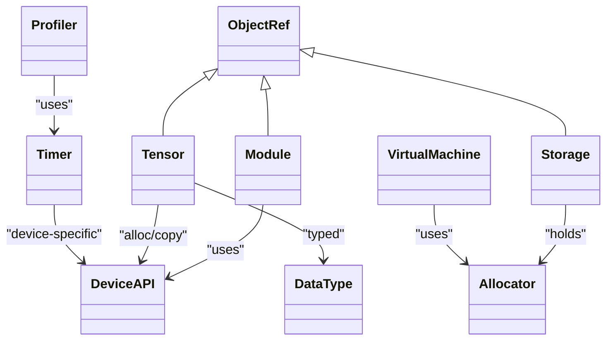
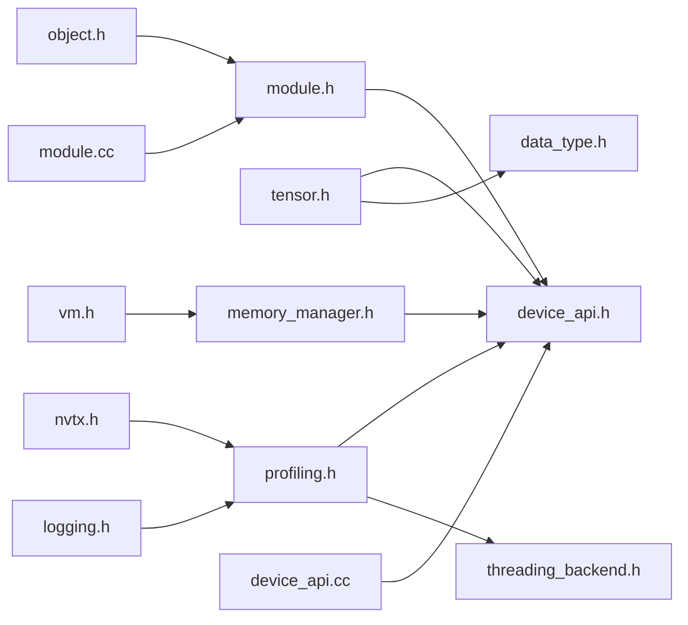

# Runtime API

<cite>
**Referenced Files in This Document**
- [base.h](file://include/tvm/runtime/base.h)
- [object.h](file://include/tvm/runtime/object.h)
- [module.h](file://include/tvm/runtime/module.h)
- [device_api.h](file://include/tvm/runtime/device_api.h)
- [tensor.h](file://include/tvm/runtime/tensor.h)
- [memory_manager.h](file://include/tvm/runtime/memory/memory_manager.h)
- [vm.h](file://include/tvm/runtime/vm/vm.h)
- [profiling.h](file://include/tvm/runtime/profiling.h)
- [data_type.h](file://include/tvm/runtime/data_type.h)
- [nvtx.h](file://include/tvm/runtime/nvtx.h)
- [threading_backend.h](file://include/tvm/runtime/threading_backend.h)
- [int_tuple.h](file://include/tvm/runtime/int_tuple.h)
- [logging.h](file://include/tvm/runtime/logging.h)
- [device_api.cc](file://src/runtime/device_api.cc)
- [module.cc](file://src/runtime/module.cc)
</cite>

## Table of Contents
1. [Introduction](#introduction)
2. [Project Structure](#project-structure)
3. [Core Components](#core-components)
4. [Architecture Overview](#architecture-overview)
5. [Detailed Component Analysis](#detailed-component-analysis)
6. [Dependency Analysis](#dependency-analysis)
7. [Performance Considerations](#performance-considerations)
8. [Troubleshooting Guide](#troubleshooting-guide)
9. [Conclusion](#conclusion)
10. [Appendices](#appendices)

## Introduction
This document provides comprehensive API documentation for TVM’s runtime system. It covers module loading and function invocation, device abstraction and memory management, NDArray operations, runtime object system, initialization and execution, inter-process communication, debugging and profiling utilities, and customization patterns for deployment environments. Practical examples are included via code-path references to real implementations.

## Project Structure
The TVM runtime is organized around a small set of core headers that define the object model, device abstraction, module system, tensor and memory management, VM, profiling, threading, and logging. Implementations are provided in the src/runtime directory and integrated through reflection and FFI mechanisms.

**Diagram sources**
- [object.h:1-149](file://include/tvm/runtime/object.h#L1-L149)
- [module.h:1-139](file://include/tvm/runtime/module.h#L1-L139)
- [device_api.h:1-411](file://include/tvm/runtime/device_api.h#L1-L411)
- [tensor.h:1-347](file://include/tvm/runtime/tensor.h#L1-L347)
- [memory_manager.h:1-202](file://include/tvm/runtime/memory/memory_manager.h#L1-L202)
- [vm.h:1-236](file://include/tvm/runtime/vm/vm.h#L1-L236)
- [profiling.h:1-591](file://include/tvm/runtime/profiling.h#L1-L591)
- [data_type.h:1-528](file://include/tvm/runtime/data_type.h#L1-L528)
- [threading_backend.h:1-229](file://include/tvm/runtime/threading_backend.h#L1-L229)
- [nvtx.h:1-55](file://include/tvm/runtime/nvtx.h#L1-L55)
- [logging.h:1-461](file://include/tvm/runtime/logging.h#L1-L461)
- [device_api.cc:1-278](file://src/runtime/device_api.cc#L1-L278)
- [module.cc:1-94](file://src/runtime/module.cc#L1-L94)

**Section sources**
- [base.h:1-60](file://include/tvm/runtime/base.h#L1-L60)
- [object.h:1-149](file://include/tvm/runtime/object.h#L1-L149)
- [module.h:1-139](file://include/tvm/runtime/module.h#L1-L139)
- [device_api.h:1-411](file://include/tvm/runtime/device_api.h#L1-L411)
- [tensor.h:1-347](file://include/tvm/runtime/tensor.h#L1-L347)
- [memory_manager.h:1-202](file://include/tvm/runtime/memory/memory_manager.h#L1-L202)
- [vm.h:1-236](file://include/tvm/runtime/vm/vm.h#L1-L236)
- [profiling.h:1-591](file://include/tvm/runtime/profiling.h#L1-L591)
- [data_type.h:1-528](file://include/tvm/runtime/data_type.h#L1-L528)
- [nvtx.h:1-55](file://include/tvm/runtime/nvtx.h#L1-L55)
- [threading_backend.h:1-229](file://include/tvm/runtime/threading_backend.h#L1-L229)
- [int_tuple.h:1-39](file://include/tvm/runtime/int_tuple.h#L1-L39)
- [logging.h:1-461](file://include/tvm/runtime/logging.h#L1-L461)
- [device_api.cc:1-278](file://src/runtime/device_api.cc#L1-L278)
- [module.cc:1-94](file://src/runtime/module.cc#L1-L94)

## Core Components
- Runtime object system: managed objects, type indices, and reference semantics for modules, tensors, arrays, and runtime primitives.
- Module system: dynamic loading, function lookup, and runtime enablement checks.
- Device abstraction: unified device API with attributes, memory allocation, streams, and synchronization.
- NDArray/Tensor: device-neutral tensor abstraction with views, copying, and serialization.
- Memory manager: allocators, storage, and workspace management.
- VM: virtual machine for Relax VM, closures, and execution.
- Profiling: timers, device-specific timing, reports, and metric collectors.
- Threading and logging: thread pool controls, NVTX scopes, and structured logging.

**Section sources**
- [object.h:50-149](file://include/tvm/runtime/object.h#L50-L149)
- [module.h:43-139](file://include/tvm/runtime/module.h#L43-L139)
- [device_api.h:128-310](file://include/tvm/runtime/device_api.h#L128-L310)
- [tensor.h:54-192](file://include/tvm/runtime/tensor.h#L54-L192)
- [memory_manager.h:58-198](file://include/tvm/runtime/memory/memory_manager.h#L58-L198)
- [vm.h:130-236](file://include/tvm/runtime/vm/vm.h#L130-L236)
- [profiling.h:52-591](file://include/tvm/runtime/profiling.h#L52-L591)
- [threading_backend.h:63-229](file://include/tvm/runtime/threading_backend.h#L63-L229)
- [nvtx.h:31-55](file://include/tvm/runtime/nvtx.h#L31-L55)
- [logging.h:109-461](file://include/tvm/runtime/logging.h#L109-L461)

## Architecture Overview
The runtime architecture centers on a unified object model and FFI bridge. Modules expose functions that can be invoked through a packed function interface. Device operations are dispatched via the DeviceAPI registry. Memory is managed by allocators and storage abstractions. The VM orchestrates execution with closures and optional extensions. Profiling integrates with timers and device streams.

**Diagram sources**
- [object.h:36-147](file://include/tvm/runtime/object.h#L36-L147)
- [module.h:40-106](file://include/tvm/runtime/module.h#L40-L106)
- [device_api.h:128-310](file://include/tvm/runtime/device_api.h#L128-L310)
- [tensor.h:54-192](file://include/tvm/runtime/tensor.h#L54-L192)
- [memory_manager.h:58-198](file://include/tvm/runtime/memory/memory_manager.h#L58-L198)
- [vm.h:130-236](file://include/tvm/runtime/vm/vm.h#L130-L236)
- [profiling.h:52-148](file://include/tvm/runtime/profiling.h#L52-L148)
- [data_type.h:47-146](file://include/tvm/runtime/data_type.h#L47-L146)

## Detailed Component Analysis

### Runtime Object System
- Managed objects and reference semantics: ObjectRef and ObjectPtr provide shared ownership and move semantics. Type indices enumerate built-in types and reserved slots for custom types.
- Copy-on-write patterns and default copy/move helpers are provided for immutable nodes.
- Static type indices include Module, Tensor, Shape, PackedFunc, Disco DRef, RPCObjectRef, and standard containers.

Practical usage patterns:
- Create and pass around ObjectRef instances for modules and tensors.
- Use CopyOnWrite for in-place modifications when uniqueness is guaranteed.

**Section sources**
- [object.h:50-149](file://include/tvm/runtime/object.h#L50-L149)

### Module Loading and Function Invocation
- Dynamic module loading and function lookup: modules expose GetFunction and can be extended with a vtable macro to bind member functions to symbol names.
- Runtime enablement checks: RuntimeEnabled determines whether a target runtime is present by probing device or target registries.
- Environment integration: module.cc registers context functions and symbols into the FFI environment.

Typical workflow:
- Load a compiled module (e.g., from a target-specific backend).
- Retrieve a function by name via GetFunction.
- Invoke with packed arguments and receive results through Any.

**Section sources**
- [module.h:108-139](file://include/tvm/runtime/module.h#L108-L139)
- [module.cc:38-94](file://src/runtime/module.cc#L38-L94)

### Device Abstraction and Streams
- DeviceAPI defines a uniform interface for device memory management, attributes, streams, and synchronization.
- Device identification and RPC masking utilities support remote device contexts.
- Default implementations delegate to environment functions and can be overridden per device type.

Key capabilities:
- Set device, get attributes, allocate/free data spaces, and workspace.
- Create/destroy streams, set/get current stream, synchronize streams, and copy data across devices.

**Section sources**
- [device_api.h:128-310](file://include/tvm/runtime/device_api.h#L128-L310)
- [device_api.cc:49-202](file://src/runtime/device_api.cc#L49-L202)

### NDArray Operations and Tensor Management
- Tensor is a device-neutral managed tensor backed by a reference-counted container.
- Creation, copying, and conversion to/from DLPack and raw bytes.
- Views, empty allocations, and device transfers with memory scope support.
- Preferred host device selection for pinned memory optimization.

Common operations:
- Create empty tensors on a device.
- Copy between tensors or buffers.
- Serialize/deserialize tensors to streams.

**Section sources**
- [tensor.h:54-192](file://include/tvm/runtime/tensor.h#L54-L192)
- [data_type.h:47-146](file://include/tvm/runtime/data_type.h#L47-L146)

### Memory Management and Workspaces
- Allocator interface supports allocating by size or shape, creating views, and releasing memory.
- MemoryManager maintains per-device allocators and exposes global accessors.
- Storage encapsulates a buffer and its allocator, ensuring cleanup on destruction.

Patterns:
- Use MemoryManager::GetOrCreateAllocator to obtain a device-specific allocator.
- Allocate tensors via Empty or create views for subregions.
- Free memory through Allocator::Free or Storage destruction.

**Section sources**
- [memory_manager.h:58-198](file://include/tvm/runtime/memory/memory_manager.h#L58-L198)

### Virtual Machine Execution
- VirtualMachine provides Init, LoadExecutable, GetClosure, InvokeClosurePacked, and instrumentation hooks.
- Extensions can be registered and retrieved by type index.
- VM supports profiling creation and closure binding helpers.

Execution flow:
- Initialize VM with devices and allocator types.
- Load a VM executable.
- Obtain a closure by name and invoke with packed arguments.

**Section sources**
- [vm.h:130-236](file://include/tvm/runtime/vm/vm.h#L130-L236)

### Profiling, Timers, and Performance Monitoring
- Timer and TimerNode provide device-specific timing with Start/Stop/SyncAndGetElapsedNanos.
- Profiler aggregates per-call and per-device metrics, supports nested calls, and produces CSV/JSON/tables.
- MetricCollector enables custom metrics; WrapTimeEvaluator measures function latency with warmups and repeats.
- NVTXScopedRange integrates GPU profiling markers.

Usage examples:
- Start a timer on a device, run code, stop, and query elapsed time.
- Wrap a function with WrapTimeEvaluator to obtain robust latency estimates.
- Build a Profiler, start/stop calls around operations, and render a report.

**Section sources**
- [profiling.h:52-591](file://include/tvm/runtime/profiling.h#L52-L591)
- [nvtx.h:31-55](file://include/tvm/runtime/nvtx.h#L31-L55)

### Threading Backend and Concurrency
- ThreadGroup manages worker threads, affinity modes, and CPU pinning.
- Utility functions control max concurrency, reset thread pools, and yield.
- parallel_for_with_threading_backend provides templated parallel loops.

Integration:
- Configure thread affinity and concurrency for optimal performance.
- Use parallel constructs to distribute workloads across threads.

**Section sources**
- [threading_backend.h:63-229](file://include/tvm/runtime/threading_backend.h#L63-L229)

### Logging and Debugging
- Structured logging with levels, fatal handling, and verbose/VLOG support controlled by TVM_LOG_DEBUG.
- Backtrace-enabled fatal errors and customizable logging implementations.

Best practices:
- Use VLOG for debug traces gated by environment.
- Use LOG/WARNING/ERROR for runtime diagnostics.
- Enable backtraces for internal errors.

**Section sources**
- [logging.h:109-461](file://include/tvm/runtime/logging.h#L109-L461)

### Inter-Process Communication (RPC)
- Device API supports RPC sessions with device masks and session indexing.
- Reflection registrations expose device stream operations and device attribute queries to the environment.

Operational notes:
- RPC devices carry a session mask; helpers remove/add masks for transport and resolution.
- Use environment functions to set/get streams and synchronize across RPC boundaries.

**Section sources**
- [device_api.h:353-405](file://include/tvm/runtime/device_api.h#L353-L405)
- [device_api.cc:179-239](file://src/runtime/device_api.cc#L179-L239)

### Practical Examples (by code-path)
- Runtime module loading and function invocation:
  - [module.cc:75-88](file://src/runtime/module.cc#L75-L88)
  - [module.h:108-139](file://include/tvm/runtime/module.h#L108-L139)
- NDArray creation and copying:
  - [tensor.h:162-192](file://include/tvm/runtime/tensor.h#L162-L192)
- Device memory allocation and workspace:
  - [device_api.cc:101-143](file://src/runtime/device_api.cc#L101-L143)
- VM initialization and closure invocation:
  - [vm.h:137-157](file://include/tvm/runtime/vm/vm.h#L137-L157)
- Profiling a function:
  - [profiling.h:530-532](file://include/tvm/runtime/profiling.h#L530-L532)
- Timing a region:
  - [profiling.h:145](file://include/tvm/runtime/profiling.h#L145)
- NVTX marker:
  - [nvtx.h:34-49](file://include/tvm/runtime/nvtx.h#L34-L49)

**Section sources**
- [module.cc:75-88](file://src/runtime/module.cc#L75-L88)
- [module.h:108-139](file://include/tvm/runtime/module.h#L108-L139)
- [tensor.h:162-192](file://include/tvm/runtime/tensor.h#L162-L192)
- [device_api.cc:101-143](file://src/runtime/device_api.cc#L101-L143)
- [vm.h:137-157](file://include/tvm/runtime/vm/vm.h#L137-L157)
- [profiling.h:530-532](file://include/tvm/runtime/profiling.h#L530-L532)
- [profiling.h:145](file://include/tvm/runtime/profiling.h#L145)
- [nvtx.h:34-49](file://include/tvm/runtime/nvtx.h#L34-L49)

## Dependency Analysis
The runtime components exhibit clear separation of concerns with low coupling and strong cohesion:
- Object model underpins modules and tensors.
- DeviceAPI is a central dependency for memory and streams.
- MemoryManager depends on DeviceAPI and provides allocator abstractions.
- VM composes MemoryManager and uses DeviceAPI for execution.
- Profiling depends on DeviceAPI and threading backend.
- Logging is foundational across components.

**Diagram sources**
- [object.h:36-147](file://include/tvm/runtime/object.h#L36-L147)
- [module.h:40-106](file://include/tvm/runtime/module.h#L40-L106)
- [device_api.h:128-310](file://include/tvm/runtime/device_api.h#L128-L310)
- [tensor.h:54-192](file://include/tvm/runtime/tensor.h#L54-L192)
- [memory_manager.h:58-198](file://include/tvm/runtime/memory/memory_manager.h#L58-L198)
- [vm.h:130-236](file://include/tvm/runtime/vm/vm.h#L130-L236)
- [profiling.h:52-148](file://include/tvm/runtime/profiling.h#L52-L148)
- [threading_backend.h:63-229](file://include/tvm/runtime/threading_backend.h#L63-L229)
- [nvtx.h:31-55](file://include/tvm/runtime/nvtx.h#L31-L55)
- [logging.h:109-461](file://include/tvm/runtime/logging.h#L109-L461)
- [device_api.cc:49-202](file://src/runtime/device_api.cc#L49-L202)
- [module.cc:38-94](file://src/runtime/module.cc#L38-L94)

**Section sources**
- [object.h:36-147](file://include/tvm/runtime/object.h#L36-L147)
- [module.h:40-106](file://include/tvm/runtime/module.h#L40-L106)
- [device_api.h:128-310](file://include/tvm/runtime/device_api.h#L128-L310)
- [tensor.h:54-192](file://include/tvm/runtime/tensor.h#L54-L192)
- [memory_manager.h:58-198](file://include/tvm/runtime/memory/memory_manager.h#L58-L198)
- [vm.h:130-236](file://include/tvm/runtime/vm/vm.h#L130-L236)
- [profiling.h:52-148](file://include/tvm/runtime/profiling.h#L52-L148)
- [threading_backend.h:63-229](file://include/tvm/runtime/threading_backend.h#L63-L229)
- [nvtx.h:31-55](file://include/tvm/runtime/nvtx.h#L31-L55)
- [logging.h:109-461](file://include/tvm/runtime/logging.h#L109-L461)
- [device_api.cc:49-202](file://src/runtime/device_api.cc#L49-L202)
- [module.cc:38-94](file://src/runtime/module.cc#L38-L94)

## Performance Considerations
- Prefer pinned host memory for device transfers when supported (e.g., CUDA Host, ROCm Host) to reduce copy overhead.
- Use workspace allocation for temporaries to leverage stack-style reuse and minimize fragmentation.
- Align allocations to device-specific alignment requirements to improve DMA and SIMD performance.
- Utilize profiling timers and WrapTimeEvaluator to obtain accurate latency measurements with warmups and repeated runs.
- Configure thread affinity and concurrency to match workload characteristics and NUMA topology.

[No sources needed since this section provides general guidance]

## Troubleshooting Guide
- Logging: Use VLOG and TVM_LOG_DEBUG to enable verbose logs and context stacks for debugging.
- Fatal errors: InternalError carries backtraces; fatal logs throw exceptions.
- Device mismatches: Verify device attributes and existence via runtime.GetDeviceAttr and device API availability.
- Memory issues: Ensure proper FreeWorkspace/Free calls and avoid out-of-bounds views; check alignment and scope.
- RPC correctness: Confirm device masks and session indices when transporting devices across RPC boundaries.

**Section sources**
- [logging.h:109-461](file://include/tvm/runtime/logging.h#L109-L461)
- [device_api.h:279-310](file://include/tvm/runtime/device_api.h#L279-L310)
- [device_api.cc:179-239](file://src/runtime/device_api.cc#L179-L239)

## Conclusion
TVM’s runtime provides a cohesive, extensible foundation for deploying compiled models across diverse hardware. Its object model, device abstraction, memory management, VM, and profiling facilities enable efficient and observable execution. By leveraging the documented APIs and patterns, developers can integrate TVM into deployment environments, customize device backends, and monitor performance effectively.

[No sources needed since this section summarizes without analyzing specific files]

## Appendices

### API Reference Index
- Module system: [module.h:43-139](file://include/tvm/runtime/module.h#L43-L139), [module.cc:38-94](file://src/runtime/module.cc#L38-L94)
- Device API: [device_api.h:128-310](file://include/tvm/runtime/device_api.h#L128-L310), [device_api.cc:49-202](file://src/runtime/device_api.cc#L49-L202)
- Tensor: [tensor.h:54-192](file://include/tvm/runtime/tensor.h#L54-L192), [data_type.h:47-146](file://include/tvm/runtime/data_type.h#L47-L146)
- Memory: [memory_manager.h:58-198](file://include/tvm/runtime/memory/memory_manager.h#L58-L198)
- VM: [vm.h:130-236](file://include/tvm/runtime/vm/vm.h#L130-L236)
- Profiling: [profiling.h:52-591](file://include/tvm/runtime/profiling.h#L52-L591), [nvtx.h:31-55](file://include/tvm/runtime/nvtx.h#L31-L55)
- Threading: [threading_backend.h:63-229](file://include/tvm/runtime/threading_backend.h#L63-L229)
- Logging: [logging.h:109-461](file://include/tvm/runtime/logging.h#L109-L461)

[No sources needed since this section lists references without analysis]