# C++ Backend Implementation

<cite>
**Referenced Files in This Document**
- [cuda_device_api.cc](file://src/runtime/cuda/cuda_device_api.cc)
- [rocm_device_api.cc](file://src/runtime/rocm/rocm_device_api.cc)
- [cpu_device_api.cc](file://src/runtime/cpu_device_api.cc)
- [device_api.cc](file://src/runtime/device_api.cc)
- [workspace_pool.h](file://src/runtime/workspace_pool.h)
- [workspace_pool.cc](file://src/runtime/workspace_pool.cc)
- [thread_storage_scope.h](file://src/runtime/thread_storage_scope.h)
- [profiling.cc](file://src/runtime/profiling.cc)
- [nvtx.cc](file://src/runtime/nvtx.cc)
- [dlpack.h](file://3rdparty/tvm-ffi/3rdparty/dlpack/include/dlpack/dlpack.h)
- [nvcc.py](file://python/tvm/contrib/nvcc.py)
- [rocm.py](file://python/tvm/contrib/rocm.py)
- [dtype.py](file://3rdparty/tvm-ffi/python/tvm_ffi/cpp/dtype.py)
- [library.py](file://python/tvm/contrib/cutlass/library.py)
- [gen_tensor_op.py](file://python/tvm/contrib/cutlass/gen_tensor_op.py)
- [rpc_endpoint.h](file://src/runtime/rpc/rpc_endpoint.h)
- [rpc_endpoint.cc](file://src/runtime/rpc/rpc_endpoint.cc)
- [proxy.py](file://python/tvm/rpc/proxy.py)
- [server.py](file://python/tvm/rpc/server.py)
- [server_ios_launcher.py](file://python/tvm/rpc/server_ios_launcher.py)
- [cuda_utils.cc](file://3rdparty/cutlass_fpA_intB_gemm/utils/cuda_utils.cc)
- [handle.cu](file://3rdparty/cutlass_fpA_intB_gemm/cutlass/tools/library/src/handle.cu)
- [library.h](file://3rdparty/cutlass_fpA_intB_gemm/cutlass/tools/library/include/cutlass/library/library.h)
</cite>

## Table of Contents
1. [Introduction](#introduction)
2. [Project Structure](#project-structure)
3. [Core Components](#core-components)
4. [Architecture Overview](#architecture-overview)
5. [Detailed Component Analysis](#detailed-component-analysis)
6. [Dependency Analysis](#dependency-analysis)
7. [Performance Considerations](#performance-considerations)
8. [Troubleshooting Guide](#troubleshooting-guide)
9. [Conclusion](#conclusion)
10. [Appendices](#appendices)

## Introduction
This document describes the C++ backend implementation of the TVM runtime, focusing on device-specific backends (CUDA, ROCm, CPU), kernel launch configuration, memory management, and profiling/debugging facilities. It also covers integration points with Python frontends, external library dispatch (e.g., CUTLASS), and RPC-based deployment. The goal is to provide a practical guide for developers extending TVM with custom kernels, optimizing performance across heterogeneous hardware, and integrating with Python-based workflows.

## Project Structure
The C++ backend is organized around device-agnostic runtime abstractions and device-specific implementations:
- Device API abstractions and manager: device selection, attributes, streams, memory copies
- Device-specific APIs: CUDA, ROCm, and CPU
- Memory management: workspace pools for temporaries
- Kernel launch configuration: thread/workload descriptors and storage scopes
- Profiling and tracing: timers, metrics, CSV/JSON reports, NVTX integration
- Python integration: device backend detection, compiler helpers, RPC server/proxy

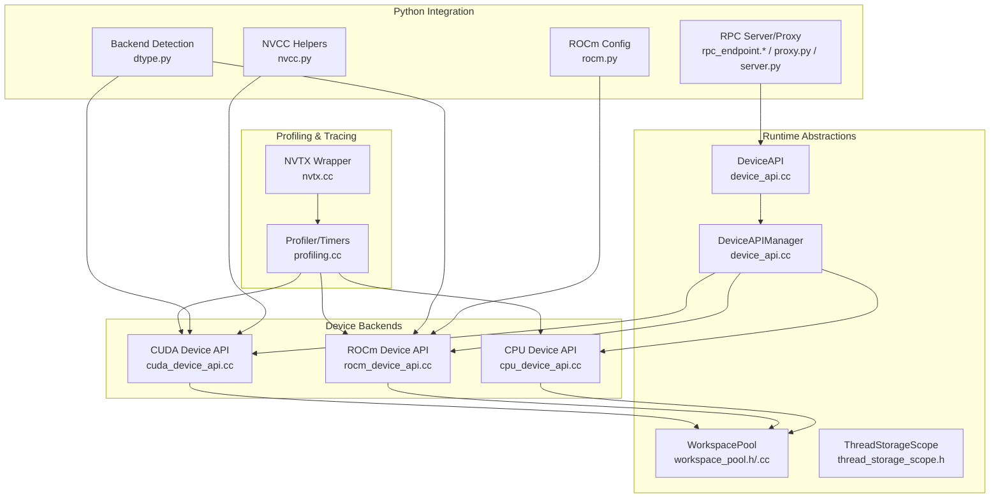

**Diagram sources**
- [device_api.cc:49-95](file://src/runtime/device_api.cc#L49-L95)
- [cuda_device_api.cc:39-274](file://src/runtime/cuda/cuda_device_api.cc#L39-L274)
- [rocm_device_api.cc:38-239](file://src/runtime/rocm/rocm_device_api.cc#L38-L239)
- [cpu_device_api.cc:52-139](file://src/runtime/cpu_device_api.cc#L52-L139)
- [workspace_pool.h:45-77](file://src/runtime/workspace_pool.h#L45-L77)
- [workspace_pool.cc:136-165](file://src/runtime/workspace_pool.cc#L136-L165)
- [thread_storage_scope.h:94-319](file://src/runtime/thread_storage_scope.h#L94-L319)
- [profiling.cc:47-120](file://src/runtime/profiling.cc#L47-L120)
- [nvtx.cc:30-42](file://src/runtime/nvtx.cc#L30-L42)
- [dtype.py:62-75](file://3rdparty/tvm-ffi/python/tvm_ffi/cpp/dtype.py#L62-L75)
- [nvcc.py:306-348](file://python/tvm/contrib/nvcc.py#L306-L348)
- [rocm.py:275-294](file://python/tvm/contrib/rocm.py#L275-L294)
- [rpc_endpoint.h:163-192](file://src/runtime/rpc/rpc_endpoint.h#L163-L192)
- [rpc_endpoint.cc:794-823](file://src/runtime/rpc/rpc_endpoint.cc#L794-L823)
- [proxy.py:320-449](file://python/tvm/rpc/proxy.py#L320-L449)
- [server.py:280-305](file://python/tvm/rpc/server.py#L280-L305)

**Section sources**
- [device_api.cc:49-95](file://src/runtime/device_api.cc#L49-L95)
- [cuda_device_api.cc:39-274](file://src/runtime/cuda/cuda_device_api.cc#L39-L274)
- [rocm_device_api.cc:38-239](file://src/runtime/rocm/rocm_device_api.cc#L38-L239)
- [cpu_device_api.cc:52-139](file://src/runtime/cpu_device_api.cc#L52-L139)
- [workspace_pool.h:45-77](file://src/runtime/workspace_pool.h#L45-L77)
- [workspace_pool.cc:136-165](file://src/runtime/workspace_pool.cc#L136-L165)
- [thread_storage_scope.h:94-319](file://src/runtime/thread_storage_scope.h#L94-L319)
- [profiling.cc:47-120](file://src/runtime/profiling.cc#L47-L120)
- [nvtx.cc:30-42](file://src/runtime/nvtx.cc#L30-L42)
- [dtype.py:62-75](file://3rdparty/tvm-ffi/python/tvm_ffi/cpp/dtype.py#L62-L75)
- [nvcc.py:306-348](file://python/tvm/contrib/nvcc.py#L306-L348)
- [rocm.py:275-294](file://python/tvm/contrib/rocm.py#L275-L294)
- [rpc_endpoint.h:163-192](file://src/runtime/rpc/rpc_endpoint.h#L163-L192)
- [rpc_endpoint.cc:794-823](file://src/runtime/rpc/rpc_endpoint.cc#L794-L823)
- [proxy.py:320-449](file://python/tvm/rpc/proxy.py#L320-L449)
- [server.py:280-305](file://python/tvm/rpc/server.py#L280-L305)

## Core Components
- Device API Manager: selects and instantiates device backends by device type, enabling dynamic dispatch for CPU/CUDA/ROCm/RPC.
- Device APIs: implement device selection, attribute queries, stream creation/sync, memory allocation/free, peer-to-peer copies, and device-side timers.
- Workspace Pool: reusable temporary memory allocator optimized for repeated allocations/releases with page-aligned blocks.
- Thread Storage Scope: encodes storage ranks (global/shared/warp/local) and launch parameter parsing for kernel launches.
- Profiling: device-specific timers, call-stack profiling, CSV/JSON report generation, and optional NVTX ranges.
- Python Integration: automatic backend detection (CUDA vs ROCm), compiler helpers for NVRTC/NVCC, ROCm path discovery, RPC server/proxy.

**Section sources**
- [device_api.cc:49-95](file://src/runtime/device_api.cc#L49-L95)
- [cuda_device_api.cc:39-274](file://src/runtime/cuda/cuda_device_api.cc#L39-L274)
- [rocm_device_api.cc:38-239](file://src/runtime/rocm/rocm_device_api.cc#L38-L239)
- [cpu_device_api.cc:52-139](file://src/runtime/cpu_device_api.cc#L52-L139)
- [workspace_pool.h:45-77](file://src/runtime/workspace_pool.h#L45-L77)
- [workspace_pool.cc:136-165](file://src/runtime/workspace_pool.cc#L136-L165)
- [thread_storage_scope.h:94-319](file://src/runtime/thread_storage_scope.h#L94-L319)
- [profiling.cc:47-120](file://src/runtime/profiling.cc#L47-L120)
- [nvtx.cc:30-42](file://src/runtime/nvtx.cc#L30-L42)
- [dtype.py:62-75](file://3rdparty/tvm-ffi/python/tvm_ffi/cpp/dtype.py#L62-L75)
- [nvcc.py:306-348](file://python/tvm/contrib/nvcc.py#L306-L348)
- [rocm.py:275-294](file://python/tvm/contrib/rocm.py#L275-L294)

## Architecture Overview
The runtime composes device-agnostic abstractions with device-specific implementations. The DeviceAPIManager resolves the appropriate backend based on the device type. Device backends expose:
- Attributes: compute capability, memory, clock rate, warp size, etc.
- Streams: creation, synchronization, inter-stream dependencies
- Memory: host/device allocation, pinned memory, peer-to-peer copies
- Timers: device-specific event-based timers
- Workspace: pooled temporaries for kernel launch intermediates

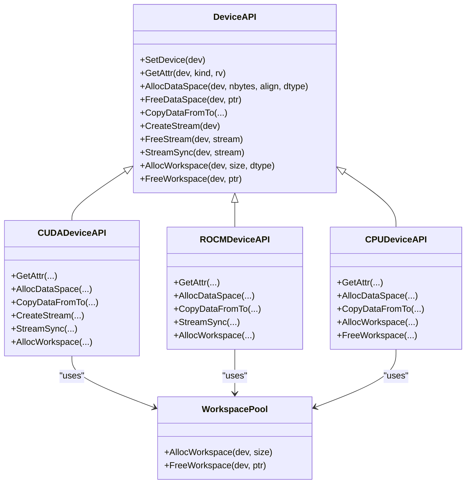

**Diagram sources**
- [device_api.cc:49-95](file://src/runtime/device_api.cc#L49-L95)
- [cuda_device_api.cc:39-274](file://src/runtime/cuda/cuda_device_api.cc#L39-L274)
- [rocm_device_api.cc:38-239](file://src/runtime/rocm/rocm_device_api.cc#L38-L239)
- [cpu_device_api.cc:52-139](file://src/runtime/cpu_device_api.cc#L52-L139)
- [workspace_pool.h:45-77](file://src/runtime/workspace_pool.h#L45-L77)
- [workspace_pool.cc:136-165](file://src/runtime/workspace_pool.cc#L136-L165)

**Section sources**
- [device_api.cc:49-95](file://src/runtime/device_api.cc#L49-L95)
- [cuda_device_api.cc:39-274](file://src/runtime/cuda/cuda_device_api.cc#L39-L274)
- [rocm_device_api.cc:38-239](file://src/runtime/rocm/rocm_device_api.cc#L38-L239)
- [cpu_device_api.cc:52-139](file://src/runtime/cpu_device_api.cc#L52-L139)
- [workspace_pool.h:45-77](file://src/runtime/workspace_pool.h#L45-L77)
- [workspace_pool.cc:136-165](file://src/runtime/workspace_pool.cc#L136-L165)

## Detailed Component Analysis

### CUDA Backend
Highlights:
- Device attributes: compute capability, max threads/block, warp size, L2 cache, total/global memory, max thread dimensions, registers per block, API/driver version
- Memory: aligned allocation, host/device, pinned host, peer-to-peer copies, sticky error handling during teardown
- Streams: non-blocking stream creation, cross-stream synchronization via events, stream sync
- Timers: CUDA event-based timers bound to device streams
- Specialized runtime functions: cuTensorMap encode wrapper for TMA tiled descriptors

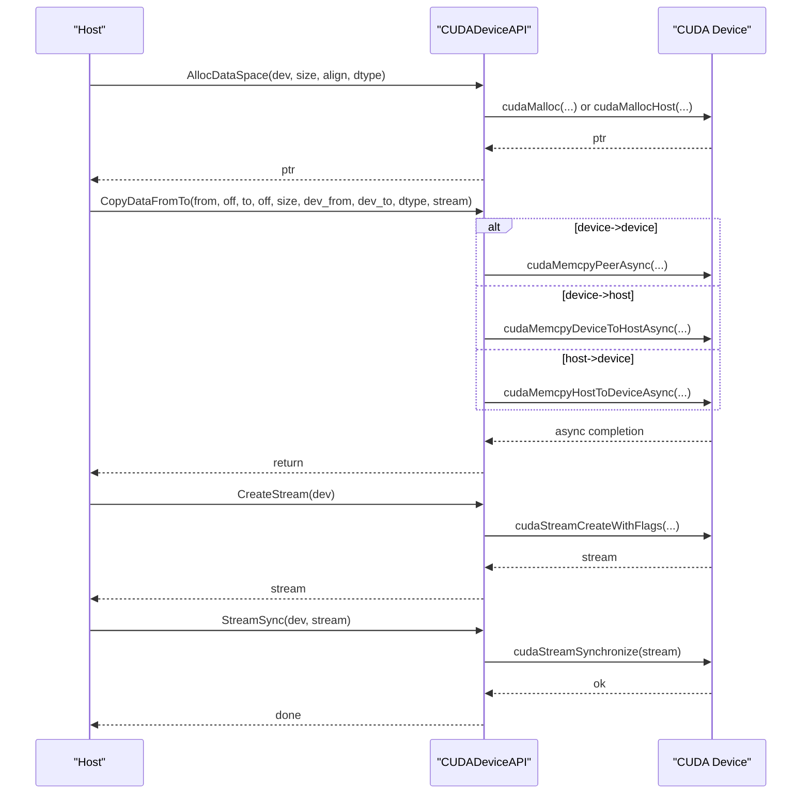

**Diagram sources**
- [cuda_device_api.cc:136-258](file://src/runtime/cuda/cuda_device_api.cc#L136-L258)
- [cuda_device_api.cc:223-250](file://src/runtime/cuda/cuda_device_api.cc#L223-L250)

**Section sources**
- [cuda_device_api.cc:40-135](file://src/runtime/cuda/cuda_device_api.cc#L40-L135)
- [cuda_device_api.cc:136-258](file://src/runtime/cuda/cuda_device_api.cc#L136-L258)
- [cuda_device_api.cc:297-338](file://src/runtime/cuda/cuda_device_api.cc#L297-L338)
- [cuda_device_api.cc:397-587](file://src/runtime/cuda/cuda_device_api.cc#L397-L587)

### ROCm Backend
Highlights:
- Device attributes: compute capability, max threads/block, warp size, L2 cache, total/global memory, max thread dimensions, registers per block, GCN arch string
- Memory: aligned allocation, host/device, pinned host, peer-to-peer copies
- Streams: stream sync
- Timers: HIP event-based timers

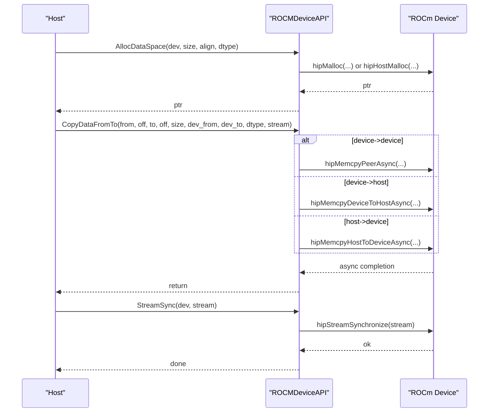

**Diagram sources**
- [rocm_device_api.cc:149-210](file://src/runtime/rocm/rocm_device_api.cc#L149-L210)
- [rocm_device_api.cc:212-215](file://src/runtime/rocm/rocm_device_api.cc#L212-L215)

**Section sources**
- [rocm_device_api.cc:40-148](file://src/runtime/rocm/rocm_device_api.cc#L40-L148)
- [rocm_device_api.cc:149-210](file://src/runtime/rocm/rocm_device_api.cc#L149-L210)
- [rocm_device_api.cc:262-295](file://src/runtime/rocm/rocm_device_api.cc#L262-L295)

### CPU Backend
Highlights:
- Device attributes: existence flag, total global memory detection across platforms
- Memory: aligned allocation with platform-specific APIs
- Streams: no-op (sequential execution)
- Workspace: thread-local pooled allocator

**Section sources**
- [cpu_device_api.cc:52-139](file://src/runtime/cpu_device_api.cc#L52-L139)
- [cpu_device_api.cc:141-156](file://src/runtime/cpu_device_api.cc#L141-L156)

### Device Attribute and Registration Mechanism
- DeviceAPIManager resolves backends by device type and caches them globally.
- Static initializer blocks register device API factories under names like "device_api.cuda", "device_api.rocm", "device_api.cpu".
- Device attributes are queried via a unified enum and mapped to device-specific queries.

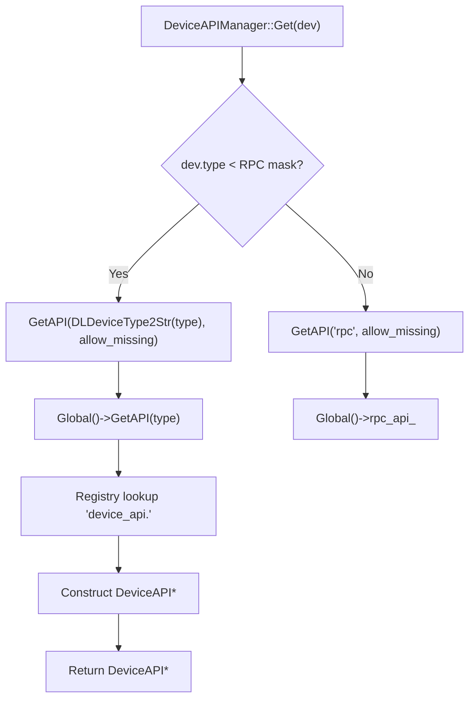

**Diagram sources**
- [device_api.cc:49-95](file://src/runtime/device_api.cc#L49-L95)

**Section sources**
- [device_api.cc:49-95](file://src/runtime/device_api.cc#L49-L95)

### Kernel Launch Configuration and Storage Scopes
- ThreadWorkLoad captures grid/block dimensions and dynamic shared memory requirements.
- LaunchParamConfig parses launch parameters and tags (dynamic shared memory, cooperative launch).
- StorageScope encodes storage ranks (global/shared/warp/local) and special tags for device-specific storage.

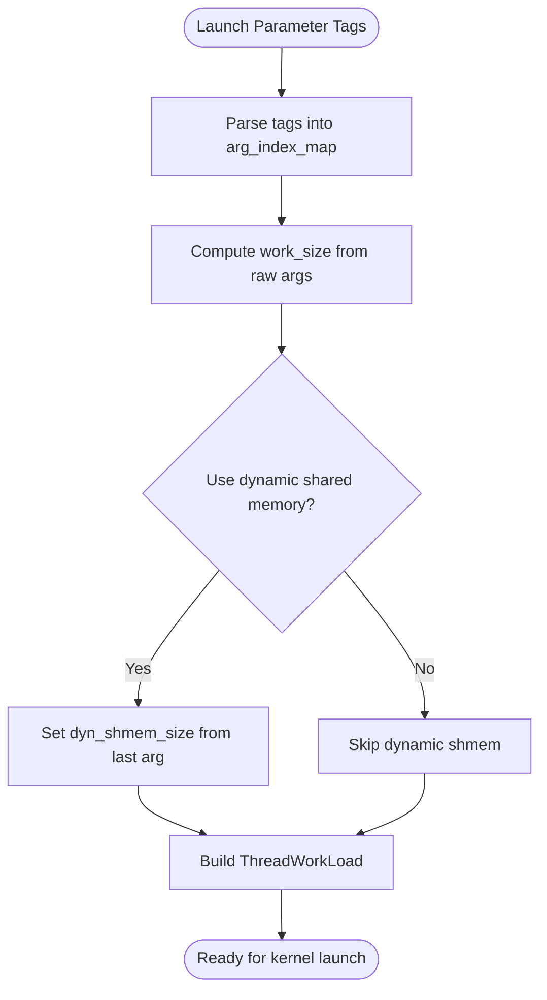

**Diagram sources**
- [thread_storage_scope.h:240-306](file://src/runtime/thread_storage_scope.h#L240-L306)

**Section sources**
- [thread_storage_scope.h:94-319](file://src/runtime/thread_storage_scope.h#L94-L319)

### Memory Management Strategies
- WorkspacePool manages temporaries with page-aligned allocation and reuse:
  - Allocation rounds up to page size and reuses existing pages when possible
  - Free follows LIFO order; unused pages are returned to the device
  - Per-device pools maintain isolation across GPU contexts

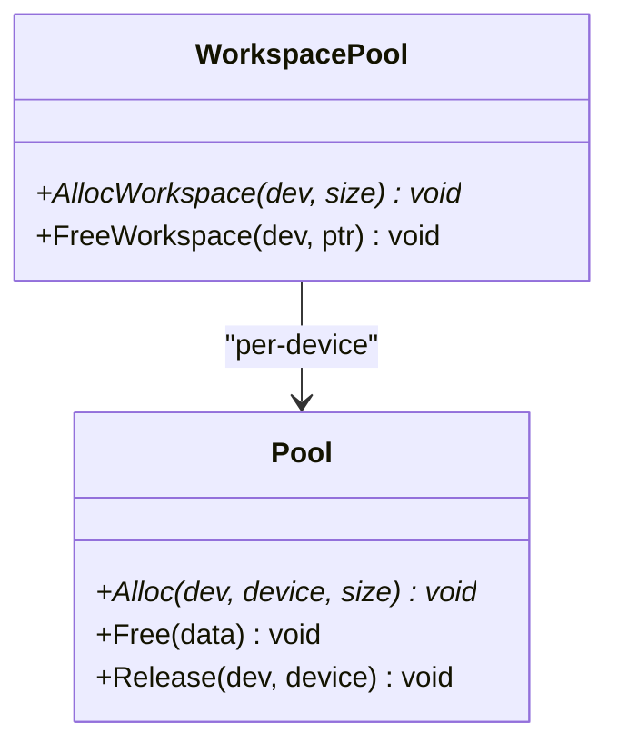

**Diagram sources**
- [workspace_pool.h:45-77](file://src/runtime/workspace_pool.h#L45-L77)
- [workspace_pool.cc:34-134](file://src/runtime/workspace_pool.cc#L34-L134)

**Section sources**
- [workspace_pool.h:45-77](file://src/runtime/workspace_pool.h#L45-L77)
- [workspace_pool.cc:136-165](file://src/runtime/workspace_pool.cc#L136-L165)

### Profiling and Debugging Tools
- Device-specific timers: CUDA/ROCm timers use device events; CPU timer uses high-resolution clock.
- Profiler: records call durations, aggregates metrics, computes percentages, and emits CSV/JSON/table reports.
- NVTX integration: optional scoped ranges around regions of interest.

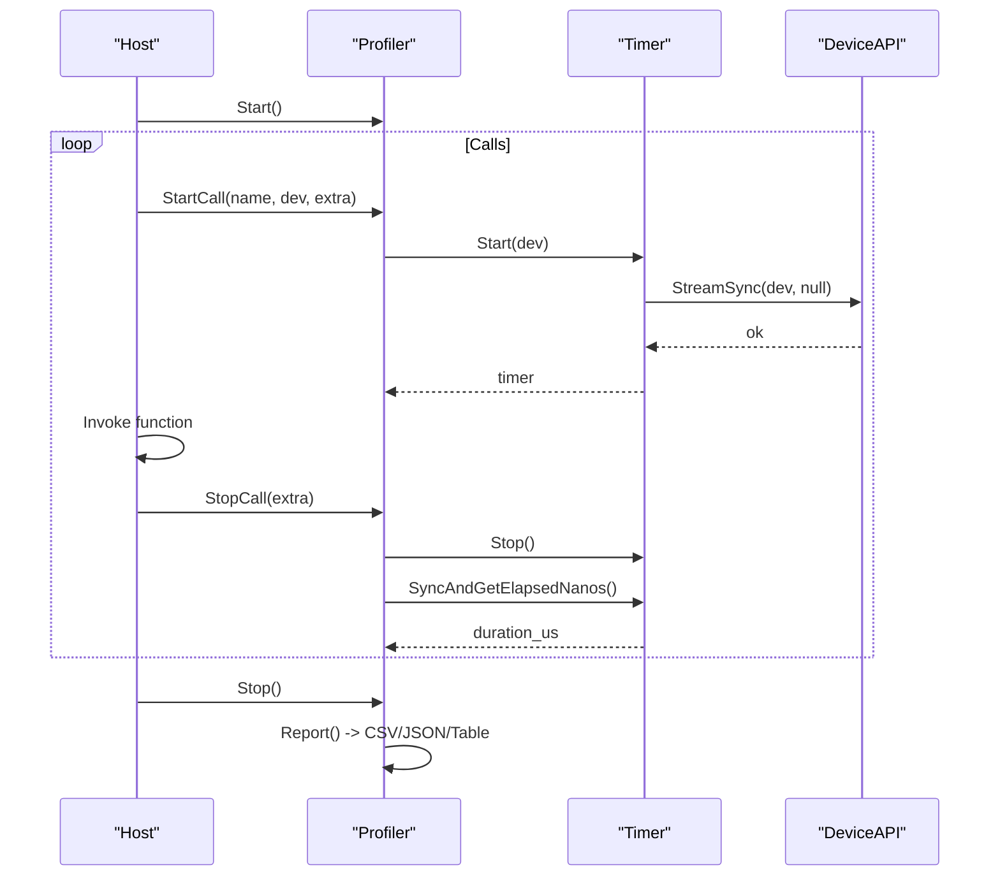

**Diagram sources**
- [profiling.cc:142-183](file://src/runtime/profiling.cc#L142-L183)
- [profiling.cc:785-914](file://src/runtime/profiling.cc#L785-L914)

**Section sources**
- [profiling.cc:47-120](file://src/runtime/profiling.cc#L47-L120)
- [profiling.cc:142-183](file://src/runtime/profiling.cc#L142-L183)
- [profiling.cc:785-914](file://src/runtime/profiling.cc#L785-L914)
- [nvtx.cc:30-42](file://src/runtime/nvtx.cc#L30-L42)

### Python Frontend Integration and Hardware-Specific Optimizations
- Backend detection: automatic CUDA vs ROCm selection based on environment and availability.
- Compiler helpers: NVRTC preamble injection, host-only header stripping, forward-declaring CUtensorMap.
- ROCm configuration: discovering HIP path and GPU architectures via rocminfo.
- CUTLASS integration: Python utilities to generate CUTLASS GEMM/Conv templates and instantiate configurations.

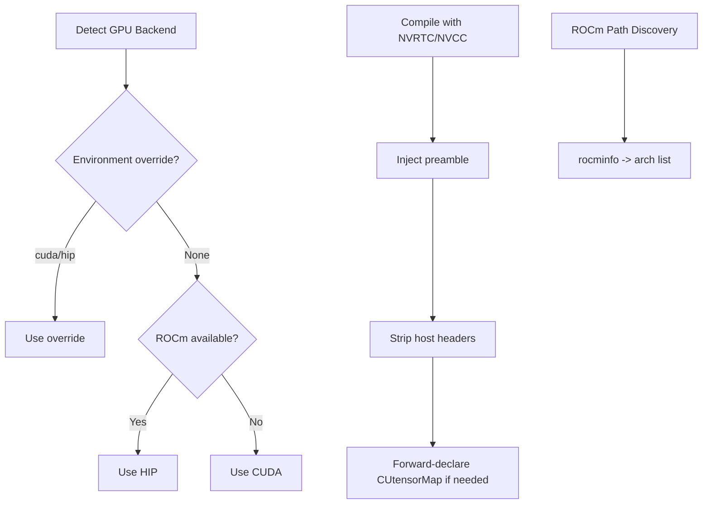

**Diagram sources**
- [dtype.py:40-75](file://3rdparty/tvm-ffi/python/tvm_ffi/cpp/dtype.py#L40-L75)
- [nvcc.py:306-348](file://python/tvm/contrib/nvcc.py#L306-L348)
- [rocm.py:275-294](file://python/tvm/contrib/rocm.py#L275-L294)

**Section sources**
- [dtype.py:40-75](file://3rdparty/tvm-ffi/python/tvm_ffi/cpp/dtype.py#L40-L75)
- [nvcc.py:306-348](file://python/tvm/contrib/nvcc.py#L306-L348)
- [rocm.py:275-294](file://python/tvm/contrib/rocm.py#L275-L294)

### External Library Dispatch (CUTLASS)
- CUTLASS library exposes a base Operation interface with lifecycle: can_implement, get_*_workspace_size, initialize, run.
- Python codegen utilities generate templates for GEMM/Conv, substituting parameters and emitting configurations.

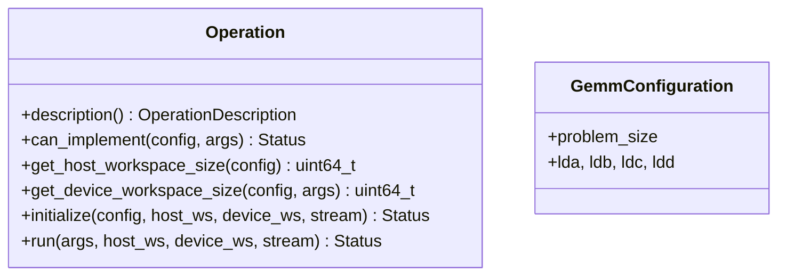

**Diagram sources**
- [library.h:808-863](file://3rdparty/cutlass_fpA_intB_gemm/cutlass/tools/library/include/cutlass/library/library.h#L808-L863)

**Section sources**
- [library.h:808-863](file://3rdparty/cutlass_fpA_intB_gemm/cutlass/tools/library/include/cutlass/library/library.h#L808-L863)
- [library.py:101-157](file://python/tvm/contrib/cutlass/library.py#L101-L157)
- [gen_tensor_op.py:81-120](file://python/tvm/contrib/cutlass/gen_tensor_op.py#L81-L120)

### RPC Integration and Deployment
- RPCEndpoint creates sessions, handles protocol initialization, and manages shutdown sequences.
- Python RPC server/proxy coordinate pairing and key management for client/server roles.

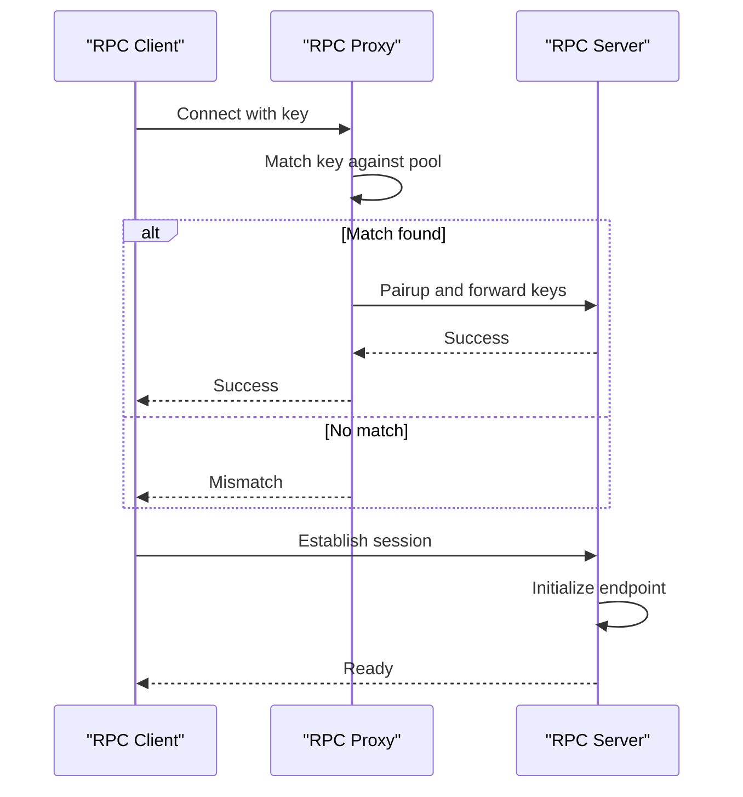

**Diagram sources**
- [rpc_endpoint.h:163-192](file://src/runtime/rpc/rpc_endpoint.h#L163-L192)
- [rpc_endpoint.cc:794-823](file://src/runtime/rpc/rpc_endpoint.cc#L794-L823)
- [proxy.py:320-449](file://python/tvm/rpc/proxy.py#L320-L449)
- [server.py:280-305](file://python/tvm/rpc/server.py#L280-L305)

**Section sources**
- [rpc_endpoint.h:163-192](file://src/runtime/rpc/rpc_endpoint.h#L163-L192)
- [rpc_endpoint.cc:794-823](file://src/runtime/rpc/rpc_endpoint.cc#L794-L823)
- [proxy.py:320-449](file://python/tvm/rpc/proxy.py#L320-L449)
- [server.py:280-305](file://python/tvm/rpc/server.py#L280-L305)
- [server_ios_launcher.py:487-503](file://python/tvm/rpc/server_ios_launcher.py#L487-L503)

## Dependency Analysis
- Device backends depend on device runtime libraries (CUDA/ROCm/CPU) and the DeviceAPI abstraction.
- WorkspacePool depends on DeviceAPI for allocation/free and maintains per-device state.
- Profiling relies on device timers and thread synchronization primitives.
- Python integration influences backend selection and compilation flags.

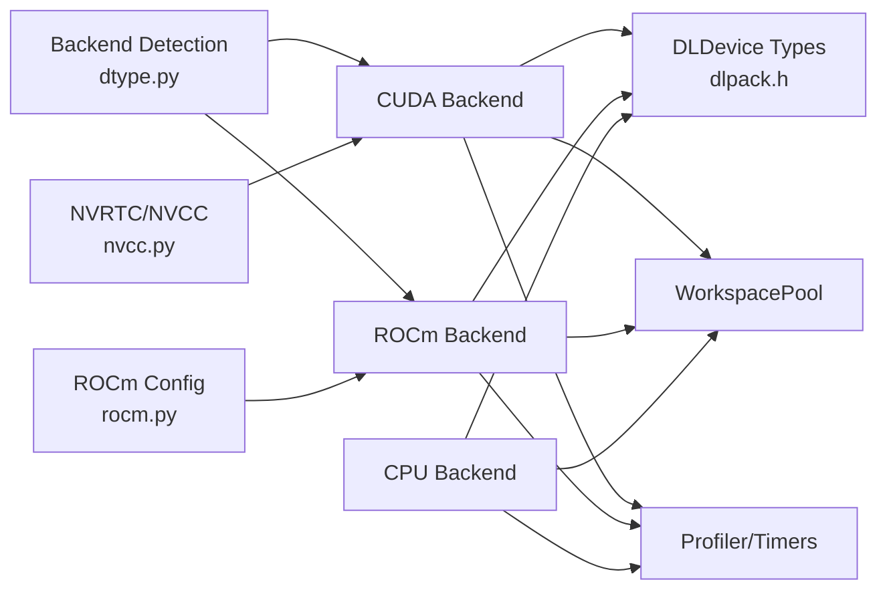

**Diagram sources**
- [dlpack.h:68-136](file://3rdparty/tvm-ffi/3rdparty/dlpack/include/dlpack/dlpack.h#L68-L136)
- [cuda_device_api.cc:39-274](file://src/runtime/cuda/cuda_device_api.cc#L39-L274)
- [rocm_device_api.cc:38-239](file://src/runtime/rocm/rocm_device_api.cc#L38-L239)
- [cpu_device_api.cc:52-139](file://src/runtime/cpu_device_api.cc#L52-L139)
- [workspace_pool.cc:136-165](file://src/runtime/workspace_pool.cc#L136-L165)
- [profiling.cc:47-120](file://src/runtime/profiling.cc#L47-L120)
- [dtype.py:62-75](file://3rdparty/tvm-ffi/python/tvm_ffi/cpp/dtype.py#L62-L75)
- [nvcc.py:306-348](file://python/tvm/contrib/nvcc.py#L306-L348)
- [rocm.py:275-294](file://python/tvm/contrib/rocm.py#L275-L294)

**Section sources**
- [dlpack.h:68-136](file://3rdparty/tvm-ffi/3rdparty/dlpack/include/dlpack/dlpack.h#L68-L136)
- [cuda_device_api.cc:39-274](file://src/runtime/cuda/cuda_device_api.cc#L39-L274)
- [rocm_device_api.cc:38-239](file://src/runtime/rocm/rocm_device_api.cc#L38-L239)
- [cpu_device_api.cc:52-139](file://src/runtime/cpu_device_api.cc#L52-L139)
- [workspace_pool.cc:136-165](file://src/runtime/workspace_pool.cc#L136-L165)
- [profiling.cc:47-120](file://src/runtime/profiling.cc#L47-L120)
- [dtype.py:62-75](file://3rdparty/tvm-ffi/python/tvm_ffi/cpp/dtype.py#L62-L75)
- [nvcc.py:306-348](file://python/tvm/contrib/nvcc.py#L306-L348)
- [rocm.py:275-294](file://python/tvm/contrib/rocm.py#L275-L294)

## Performance Considerations
- Prefer device-local temporaries and reuse via WorkspacePool to reduce allocation overhead.
- Use dynamic shared memory and cooperative launch tags when supported by the backend to improve occupancy and reduce global memory traffic.
- Minimize host-device transfers; batch copies and leverage streams for overlap.
- Use device-specific timers for accurate latency measurements; avoid default timers on devices without specialized implementations.
- For CUDA, consider TMA tiled descriptors for efficient tensor core access patterns when supported by the device and data types.
- For CUTLASS, select appropriate math instructions and tile sizes aligned with the target architecture.

[No sources needed since this section provides general guidance]

## Troubleshooting Guide
Common issues and remedies:
- CUDA sticky errors during teardown: backend guards prevent freeing allocations when the driver is in an unrecoverable error state; allow the original error to propagate.
- Missing device timers: if a device lacks a timer implementation, the runtime falls back to a default timer with potential overhead; implement a device-specific timer.
- ROCm path discovery failures: ensure HIP path is discoverable or set ROCM_PATH; GPU architecture detection via rocminfo can fail if not configured.
- NVRTC compilation issues: ensure host-only headers are stripped and required macros/types are injected; forward-declare CUtensorMap when needed.

**Section sources**
- [cuda_device_api.cc:153-170](file://src/runtime/cuda/cuda_device_api.cc#L153-L170)
- [profiling.cc:94-115](file://src/runtime/profiling.cc#L94-L115)
- [rocm.py:275-294](file://python/tvm/contrib/rocm.py#L275-L294)
- [nvcc.py:306-348](file://python/tvm/contrib/nvcc.py#L306-L348)

## Conclusion
The TVM C++ backend provides a robust, extensible foundation for heterogeneous execution. Device backends encapsulate hardware specifics behind a unified API, while workspace pools and profiling facilities enable efficient memory management and performance insights. Python integration simplifies backend selection, compilation, and deployment via RPC. By leveraging device-specific optimizations (streams, dynamic shared memory, CUTLASS tiles) and careful memory reuse, developers can achieve high performance across CUDA, ROCm, and CPU targets.

[No sources needed since this section summarizes without analyzing specific files]

## Appendices

### Example: Adding a Custom CUDA Kernel
- Implement a device-specific DeviceAPI method to allocate and configure kernel launch parameters.
- Use WorkspacePool for intermediate buffers and ensure proper stream synchronization.
- Register a timer for the device to enable accurate profiling.

**Section sources**
- [cuda_device_api.cc:223-258](file://src/runtime/cuda/cuda_device_api.cc#L223-L258)
- [workspace_pool.cc:136-165](file://src/runtime/workspace_pool.cc#L136-L165)
- [profiling.cc:297-338](file://src/runtime/profiling.cc#L297-L338)

### Example: Integrating with Python Frontends
- Use backend detection to choose CUDA or ROCm paths.
- Leverage NVRTC/NVCC helpers for JIT compilation and CUTLASS codegen for high-performance kernels.

**Section sources**
- [dtype.py:62-75](file://3rdparty/tvm-ffi/python/tvm_ffi/cpp/dtype.py#L62-L75)
- [nvcc.py:306-348](file://python/tvm/contrib/nvcc.py#L306-L348)
- [library.py:101-157](file://python/tvm/contrib/cutlass/library.py#L101-L157)