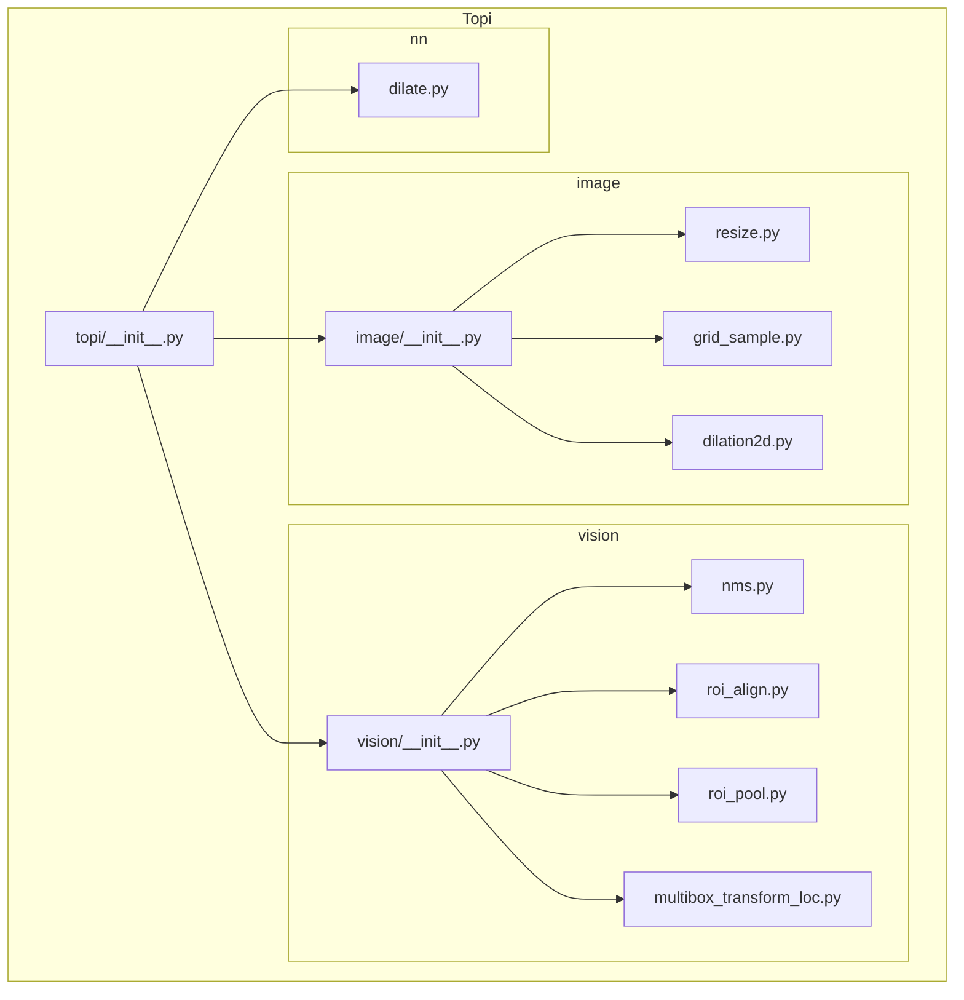
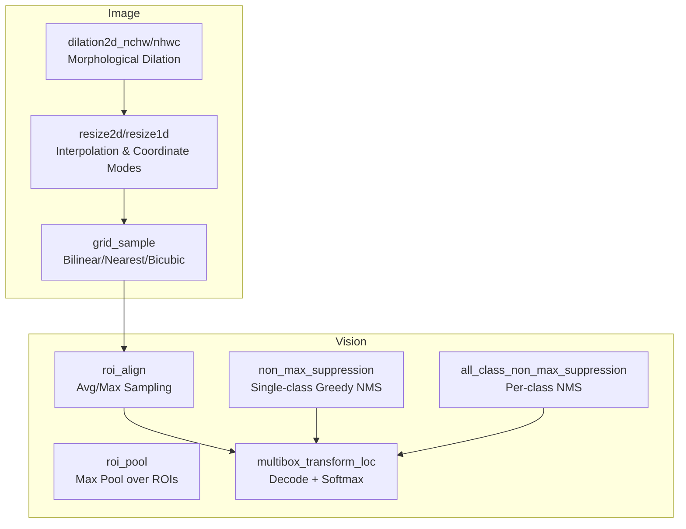
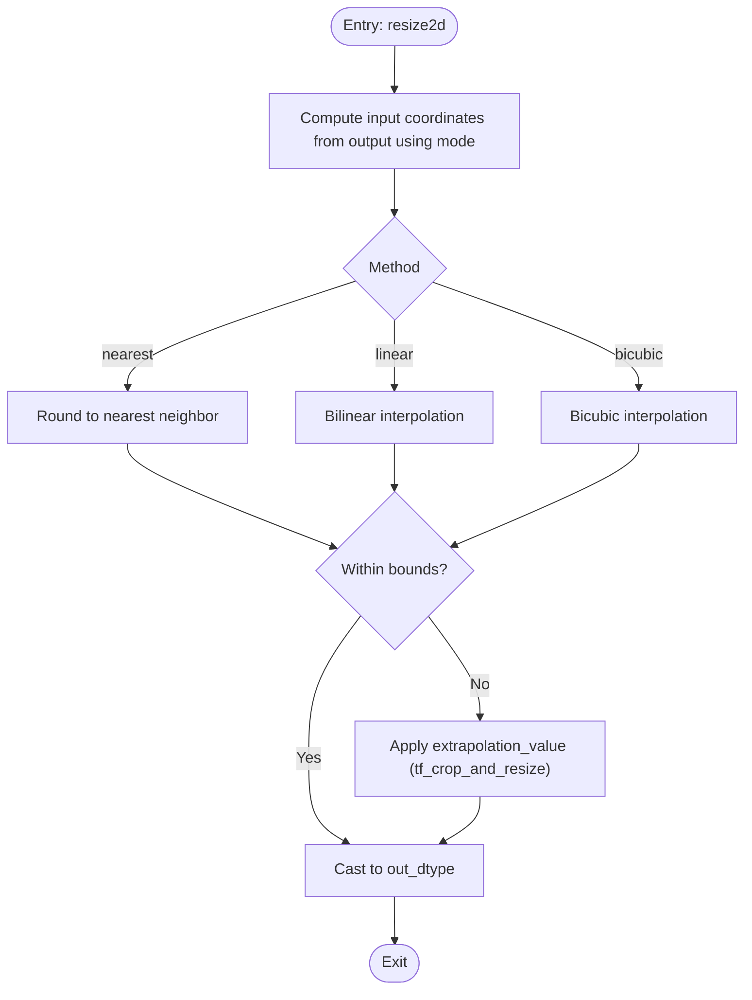
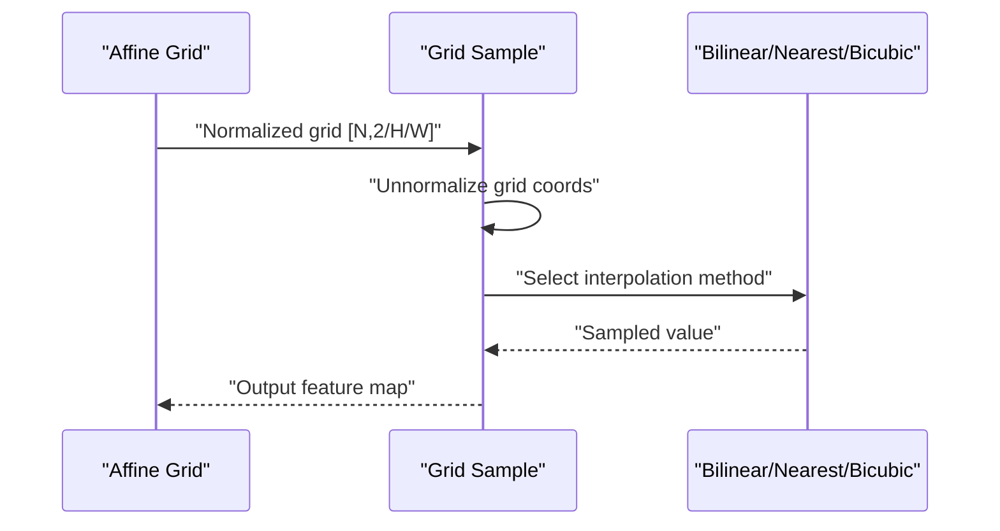
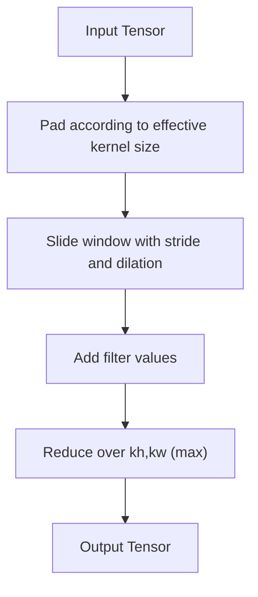
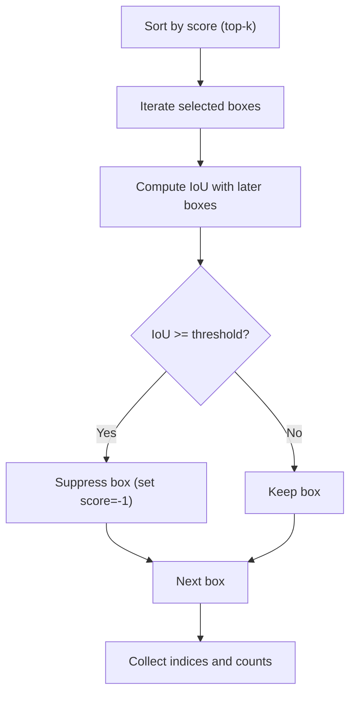
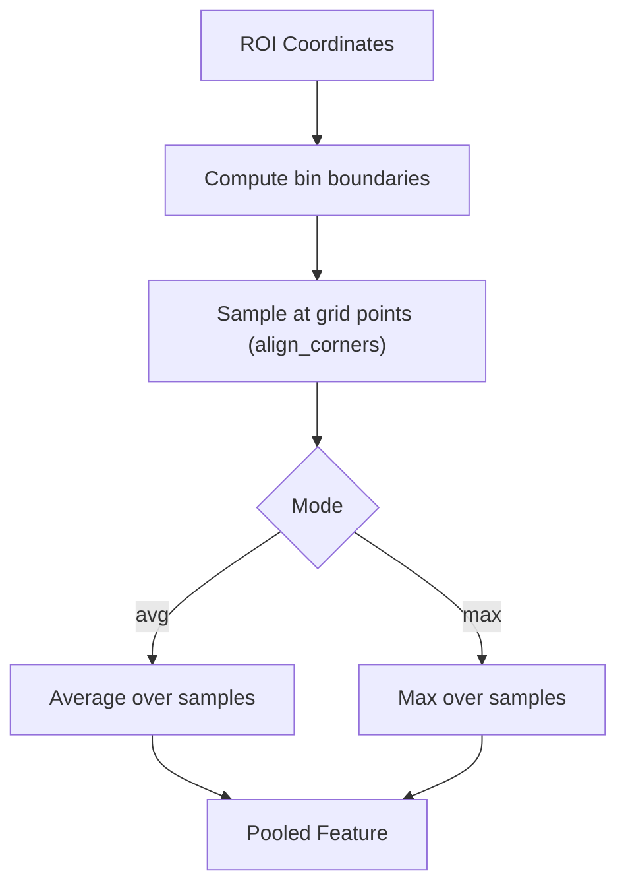
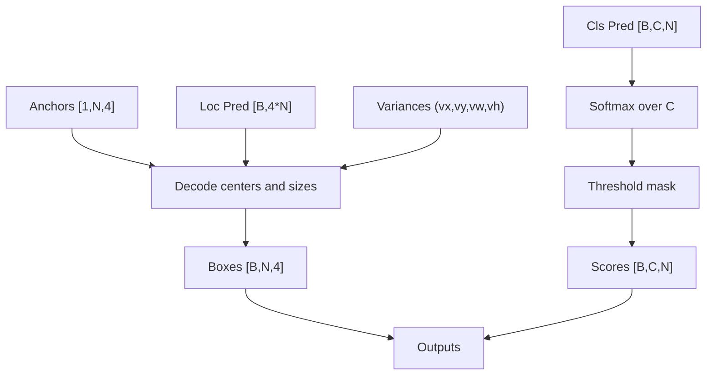
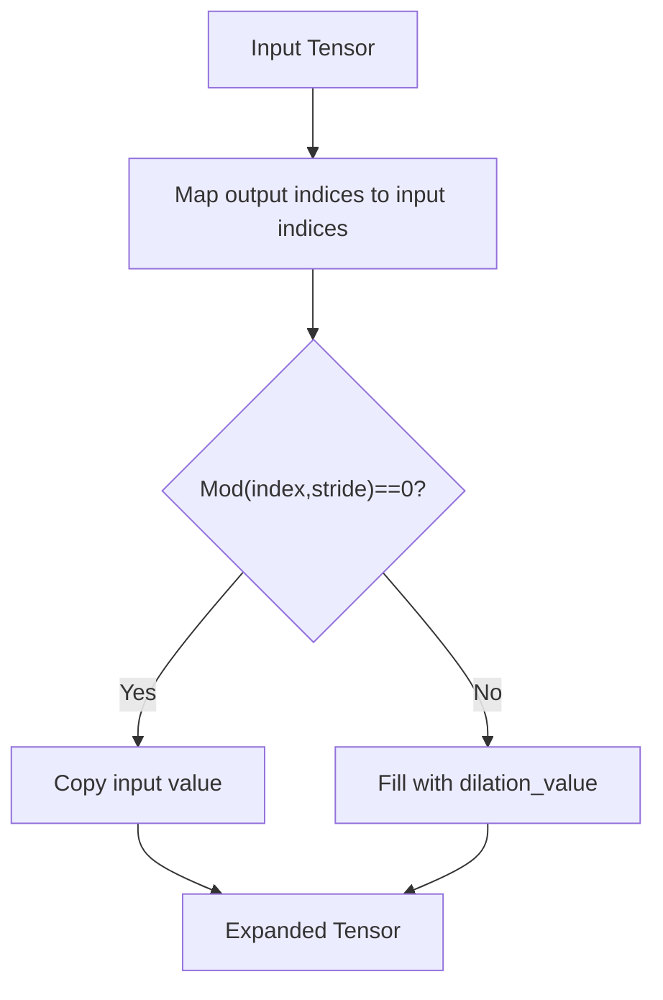
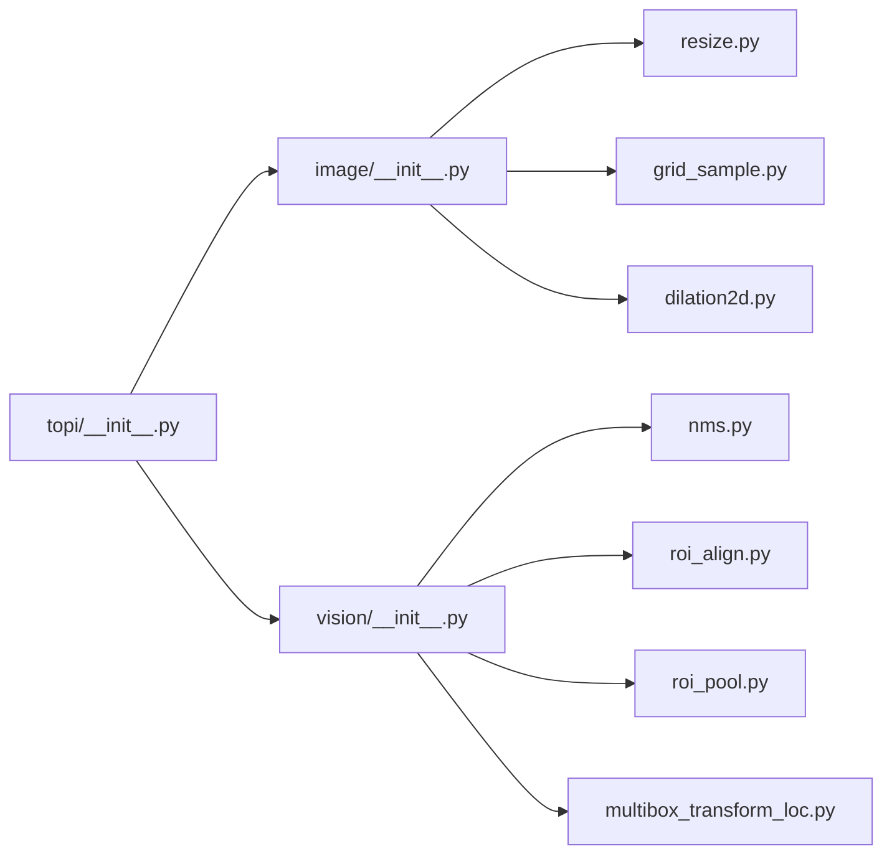

# Image and Vision Operators

<cite>
**Referenced Files in This Document**
- [__init__.py](file://python/tvm/topi/__init__.py)
- [image/__init__.py](file://python/tvm/topi/image/__init__.py)
- [resize.py](file://python/tvm/topi/image/resize.py)
- [grid_sample.py](file://python/tvm/topi/image/grid_sample.py)
- [dilation2d.py](file://python/tvm/topi/image/dilation2d.py)
- [vision/__init__.py](file://python/tvm/topi/vision/__init__.py)
- [nms.py](file://python/tvm/topi/vision/nms.py)
- [roi_align.py](file://python/tvm/topi/vision/roi_align.py)
- [roi_pool.py](file://python/tvm/topi/vision/roi_pool.py)
- [multibox_transform_loc.py](file://python/tvm/topi/vision/multibox_transform_loc.py)
- [dilate.py](file://python/tvm/topi/nn/dilate.py)
</cite>

## Table of Contents
1. [Introduction](#introduction)
2. [Project Structure](#project-structure)
3. [Core Components](#core-components)
4. [Architecture Overview](#architecture-overview)
5. [Detailed Component Analysis](#detailed-component-analysis)
6. [Dependency Analysis](#dependency-analysis)
7. [Performance Considerations](#performance-considerations)
8. [Troubleshooting Guide](#troubleshooting-guide)
9. [Conclusion](#conclusion)
10. [Appendices](#appendices)

## Introduction
This document provides comprehensive API documentation for TOP-I image processing and computer vision operators in the TVM Topi library. It covers:
- Image resizing with multiple interpolation modes and coordinate transformation strategies
- Grid sampling and affine grid generation for spatial transformer-like operations
- Morphological dilation operations
- Vision-specific transforms for object detection pipelines: non-maximum suppression (NMS), region-of-interest (ROI) pooling and alignment, multibox location decoding, and bounding box manipulations

It explains coordinate systems, interpolation modes, padding strategies, and performance considerations, and includes practical examples for preprocessing pipelines, augmentation techniques, and inference optimizations.

## Project Structure
Topi organizes operators by domain:
- Image operators: resizing, grid sampling, morphological dilation
- Vision operators: NMS, ROI pooling, ROI alignment, multibox location transforms
- Additional related operators: generic dilation for expanding tensors

**Diagram sources**
- [__init__.py:52-56](file://python/tvm/topi/__init__.py#L52-L56)
- [image/__init__.py:22-24](file://python/tvm/topi/image/__init__.py#L22-L24)
- [vision/__init__.py:20-23](file://python/tvm/topi/vision/__init__.py#L20-L23)

**Section sources**
- [__init__.py:52-56](file://python/tvm/topi/__init__.py#L52-L56)
- [image/__init__.py:22-24](file://python/tvm/topi/image/__init__.py#L22-L24)
- [vision/__init__.py:20-23](file://python/tvm/topi/vision/__init__.py#L20-L23)

## Core Components
- Image resizing: supports 1D and 2D resizing with nearest, linear, and bicubic interpolation; configurable coordinate transformation modes and rounding strategies; ROI cropping for tf_crop_and_resize.
- Grid sampling: bilinear, nearest, and bicubic sampling on 2D grids; supports padding modes (zeros, border, reflection); align_corners behavior; integrates with affine grid generation.
- Morphological dilation: 2D dilation in NCHW/NHWC layouts with stride/padding/dilation parameters.
- Vision transforms: NMS (single-class and all-class variants), ROI pooling and alignment, multibox location decoding with variance scaling and optional clipping.

**Section sources**
- [resize.py:373-492](file://python/tvm/topi/image/resize.py#L373-L492)
- [grid_sample.py:456-530](file://python/tvm/topi/image/grid_sample.py#L456-L530)
- [dilation2d.py:28-102](file://python/tvm/topi/image/dilation2d.py#L28-L102)
- [nms.py:362-499](file://python/tvm/topi/vision/nms.py#L362-L499)
- [roi_align.py:95-204](file://python/tvm/topi/vision/roi_align.py#L95-L204)
- [roi_pool.py:24-101](file://python/tvm/topi/vision/roi_pool.py#L24-L101)
- [multibox_transform_loc.py:24-121](file://python/tvm/topi/vision/multibox_transform_loc.py#L24-L121)

## Architecture Overview
The operators are implemented as TE compute graphs with explicit scheduling tags and TIR-level primitives. They integrate with TVM’s lowering pipeline to produce efficient kernels across targets.

**Diagram sources**
- [resize.py:746-800](file://python/tvm/topi/image/resize.py#L746-L800)
- [grid_sample.py:456-530](file://python/tvm/topi/image/grid_sample.py#L456-L530)
- [dilation2d.py:28-102](file://python/tvm/topi/image/dilation2d.py#L28-L102)
- [nms.py:362-499](file://python/tvm/topi/vision/nms.py#L362-L499)
- [roi_align.py:95-204](file://python/tvm/topi/vision/roi_align.py#L95-L204)
- [roi_pool.py:24-101](file://python/tvm/topi/vision/roi_pool.py#L24-L101)
- [multibox_transform_loc.py:24-121](file://python/tvm/topi/vision/multibox_transform_loc.py#L24-L121)

## Detailed Component Analysis

### Image Resizing
- Purpose: Resize images along width (and height) with flexible interpolation and coordinate mapping.
- Key parameters:
  - method: nearest, linear, bicubic
  - coordinate_transformation_mode: half_pixel, align_corners, asymmetric, pytorch_half_pixel, tf_half_pixel_for_nn, tf_crop_and_resize
  - rounding_method: round, floor, ceil, round_prefer_floor, round_prefer_ceil
  - roi: cropping window for tf_crop_and_resize
  - extrapolation_value: fill value outside bounds
  - layout: NCW, NWC, NCHW, NHWC, packed layouts
  - bicubic_alpha, bicubic_exclude
  - out_dtype, output_shape
- Interpolation logic:
  - Nearest: maps output coordinates to input via chosen rounding method; supports asymmetric special-case integer division optimization
  - Linear: 1D/2D trilinear interpolation using four nearest neighbors
  - Bicubic: cubic spline weights with optional exclusion of out-of-bounds samples and renormalization
- Coordinate systems:
  - half_pixel: centers aligned at pixel centers
  - align_corners: maps corners to (0,0) and (H-1,W-1)
  - asymmetric: maps [0, W-1] to [0, target-1] without offset
  - pytorch_half_pixel: similar to half_pixel but handles single-pixel targets
  - tf_half_pixel_for_nn: maps to half-pixel grid for nearest
  - tf_crop_and_resize: applies ROI cropping and extrapolation
- Padding and extrapolation:
  - Extrapolation value used when tf_crop_and_resize coordinates fall outside input bounds
- Complexity:
  - Per-pixel interpolation cost depends on method (nearest O(1), linear O(1), bicubic O(1) with small constant factors)
  - Memory bandwidth dominated by input reads; output size proportional to target dimensions

**Diagram sources**
- [resize.py:495-743](file://python/tvm/topi/image/resize.py#L495-L743)

**Section sources**
- [resize.py:373-492](file://python/tvm/topi/image/resize.py#L373-L492)
- [resize.py:746-800](file://python/tvm/topi/image/resize.py#L746-L800)

### Grid Sampling and Affine Grid
- Affine grid:
  - Generates a normalized sampling grid over target_shape and applies affine transforms
  - Output grid normalized to [-1, 1]; supports target_shape validation
- Grid sampling:
  - Supports 2D and 3D grids (NCHW and NCDHW)
  - Methods: bilinear, nearest, bicubic (2D) and trilinear (3D)
  - Padding modes: zeros, border, reflection
  - align_corners: maps grid extremes to pixel centers vs. pixel corners
  - Unnormalization converts [-1,1] grid coordinates to floating-point source indices in input image space
- Implementation highlights:
  - Bilinear/trilinear interpolation computes weighted sums over neighboring samples
  - Reflection padding uses periodic reflection to map out-of-bounds coordinates back into range
  - Border padding clamps coordinates to valid range
  - Nearest uses nearbyint for symmetric rounding

**Diagram sources**
- [grid_sample.py:23-60](file://python/tvm/topi/image/grid_sample.py#L23-L60)
- [grid_sample.py:456-530](file://python/tvm/topi/image/grid_sample.py#L456-L530)

**Section sources**
- [grid_sample.py:23-60](file://python/tvm/topi/image/grid_sample.py#L23-L60)
- [grid_sample.py:456-530](file://python/tvm/topi/image/grid_sample.py#L456-L530)

### Morphological Dilation (2D)
- Purpose: Morphological dilation with configurable stride, padding, and dilation rates.
- Layouts: NCHW and NHWC
- Parameters:
  - input: [N, C, H, W] or [N, H, W, C]
  - filter: [C, kh, kw] or [kh, kw, C]
  - stride: int or [sy, sx]
  - padding: int or auto padding
  - dilations: int or [dy, dx]
  - out_dtype
- Computation:
  - Pads input according to effective kernel size (dilated_kernel = (k-1)*d + 1)
  - Slides a window with stride and dilation, takes element-wise addition with filter, then max-reduction over spatial kernel axes
- Complexity:
  - O(N × C × OH × OW × kh × kw) where OH,OW are output spatial sizes

**Diagram sources**
- [dilation2d.py:28-102](file://python/tvm/topi/image/dilation2d.py#L28-L102)

**Section sources**
- [dilation2d.py:28-102](file://python/tvm/topi/image/dilation2d.py#L28-L102)
- [dilation2d.py:105-179](file://python/tvm/topi/image/dilation2d.py#L105-L179)

### Non-Maximum Suppression (NMS)
- Single-class NMS:
  - Sort boxes by score, optionally keep top-k
  - Greedy suppression with IoU threshold; supports force_suppress and class-aware suppression via id_index
  - Returns indices and counts; can rearrange invalid boxes to bottom
- All-class NMS:
  - Performs NMS per class independently; collects selected indices/scores per class with optional per-class max output limits
  - Supports per-class score thresholds and optional output format controls
- Utilities:
  - get_valid_counts: filters low-score boxes and compacts valid ones
  - Internal helpers for binary search, selection, and overlap computation

**Diagram sources**
- [nms.py:172-359](file://python/tvm/topi/vision/nms.py#L172-L359)
- [nms.py:778-966](file://python/tvm/topi/vision/nms.py#L778-L966)

**Section sources**
- [nms.py:362-499](file://python/tvm/topi/vision/nms.py#L362-L499)
- [nms.py:778-966](file://python/tvm/topi/vision/nms.py#L778-L966)

### Region of Interest (ROI) Operations
- ROI Pool:
  - Divides each ROI into a pooled grid and performs max pooling over each bin
  - Handles empty bins by returning zeros
  - Uses ONNX-style rounding for coordinate mapping
- ROI Align:
  - Computes pooled features by averaging bilinear interpolations over a sampling grid inside each bin
  - Supports average and max modes
  - Configurable sample ratio or adaptive sampling based on bin size
  - Supports aligned vs. non-aligned coordinate mapping

**Diagram sources**
- [roi_pool.py:46-94](file://python/tvm/topi/vision/roi_pool.py#L46-L94)
- [roi_align.py:26-139](file://python/tvm/topi/vision/roi_align.py#L26-L139)

**Section sources**
- [roi_pool.py:24-101](file://python/tvm/topi/vision/roi_pool.py#L24-L101)
- [roi_align.py:95-204](file://python/tvm/topi/vision/roi_align.py#L95-L204)

### Multibox Location Transform (SSD-style Decoding)
- Purpose: Decode anchor-based location predictions into normalized bounding boxes and compute class scores.
- Inputs:
  - cls_pred: [B, C, N] logits
  - loc_pred: [B, 4*N] encodings (x,y,w,h) per anchor
  - anchor: [1, N, 4] anchors in ltrb format
  - variances: tuple (vx, vy, vw, vh)
- Operations:
  - Decode centers and sizes using anchor geometry and variances
  - Optional clipping to [0,1]
  - Softmax over classes, threshold masking, optional background removal
- Outputs:
  - boxes: [B, N, 4] in ymin,xmin,ymax,xmax
  - scores: [B, C, N] post-processed

**Diagram sources**
- [multibox_transform_loc.py:24-121](file://python/tvm/topi/vision/multibox_transform_loc.py#L24-L121)

**Section sources**
- [multibox_transform_loc.py:24-121](file://python/tvm/topi/vision/multibox_transform_loc.py#L24-L121)

### Generic Dilation (Tensor Expansion)
- Purpose: Expand a tensor by inserting gaps (dilation_value) along specified axes according to strides.
- Parameters:
  - data: n-D tensor
  - strides: list of strides per axis
  - dilation_value: fill value for gaps
  - name
- Behavior:
  - For each axis with stride > 1, maps output indices to input via indexdiv/indexmod checks
  - Inserts dilation_value when modulus is non-zero

**Diagram sources**
- [dilate.py:27-73](file://python/tvm/topi/nn/dilate.py#L27-L73)

**Section sources**
- [dilate.py:27-73](file://python/tvm/topi/nn/dilate.py#L27-L73)

## Dependency Analysis
- Module organization:
  - topi/__init__.py aggregates subpackages image, vision, and nn
  - image/__init__.py exports resize, dilation2d, grid_sample
  - vision/__init__.py exports multibox_transform_loc, nms, roi_align, roi_pool
- Internal dependencies:
  - vision/nms.py uses sorting, reductions, and gather/reshape utilities
  - vision/roi_align.py relies on bilinear sampling helpers
  - image/dilation2d.py uses padding utilities
- External integrations:
  - Operators are TE compute nodes tagged for downstream scheduling and lowering

**Diagram sources**
- [__init__.py:52-56](file://python/tvm/topi/__init__.py#L52-L56)
- [image/__init__.py:22-24](file://python/tvm/topi/image/__init__.py#L22-L24)
- [vision/__init__.py:20-23](file://python/tvm/topi/vision/__init__.py#L20-L23)

**Section sources**
- [__init__.py:52-56](file://python/tvm/topi/__init__.py#L52-L56)
- [image/__init__.py:22-24](file://python/tvm/topi/image/__init__.py#L22-L24)
- [vision/__init__.py:20-23](file://python/tvm/topi/vision/__init__.py#L20-L23)

## Performance Considerations
- Interpolation cost:
  - Nearest: minimal overhead; bicubic adds small fixed cost per sample
  - Linear/trilinear: moderate cost; consider reducing sample_ratio in roi_align for speed
- Memory access:
  - Resizing and grid sampling are memory-bound; ensure input locality and avoid repeated re-shaping
- Coordinate mapping:
  - align_corners affects boundary mapping; choose modes consistent with model expectations to reduce post-processing
- Padding modes:
  - Reflection and border require extra arithmetic; zeros is fastest
- Batch and channel layout:
  - NCHW often yields better memory coalescing; ensure data layout matches operator expectations
- ROI sampling:
  - Increase sample_ratio for accuracy; decrease for speed
- NMS:
  - top-k pruning reduces subsequent IoU computations; adjust based on quality/speed trade-offs
- Dilation:
  - Effective kernel size grows with dilation; consider stride/padding to control output size

[No sources needed since this section provides general guidance]

## Troubleshooting Guide
- Unexpected boundary artifacts in resizing:
  - Verify coordinate_transformation_mode and rounding_method
  - For tf_crop_and_resize, confirm roi bounds and extrapolation_value
- Incorrect grid sampling near borders:
  - Check align_corners and padding_mode; switch to border or reflection if needed
- NMS suppressing desired detections:
  - Lower iou_threshold or increase top_k; verify id_index/class-awareness
- ROI pooling returning zeros:
  - Confirm ROI coordinates and spatial_scale; ensure pooled_size is positive
- Multibox boxes out of range:
  - Enable clip and verify variances and anchor scales
- Dilation mismatch:
  - Ensure strides length equals tensor rank; verify effective kernel size and padding

**Section sources**
- [resize.py:140-175](file://python/tvm/topi/image/resize.py#L140-L175)
- [grid_sample.py:123-125](file://python/tvm/topi/image/grid_sample.py#L123-L125)
- [nms.py:362-424](file://python/tvm/topi/vision/nms.py#L362-L424)
- [roi_pool.py:97-101](file://python/tvm/topi/vision/roi_pool.py#L97-L101)
- [multibox_transform_loc.py:97-106](file://python/tvm/topi/vision/multibox_transform_loc.py#L97-L106)
- [dilate.py:50-51](file://python/tvm/topi/nn/dilate.py#L50-L51)

## Conclusion
The TOP-I image and vision operators in TVM Topi provide a comprehensive toolkit for preprocessing, augmentation, and inference stages in computer vision pipelines. By understanding coordinate systems, interpolation modes, padding strategies, and performance characteristics, developers can compose robust and efficient pipelines spanning resizing, spatial sampling, morphological operations, and detection post-processing.

[No sources needed since this section summarizes without analyzing specific files]

## Appendices

### Practical Examples

- Preprocessing pipeline (resize + normalize + grid sampling):
  - Resize input to model resolution using linear interpolation and half_pixel mode
  - Normalize pixel values to [-1,1] or [0,1] depending on model
  - Optionally apply affine grid and grid_sample for spatial augmentations
  - Reference APIs: [resize2d:746-800](file://python/tvm/topi/image/resize.py#L746-L800), [grid_sample:456-530](file://python/tvm/topi/image/grid_sample.py#L456-L530)

- Augmentation techniques (spatial transformer):
  - Generate affine matrices per batch
  - Build normalized grid with affine_grid
  - Sample features with grid_sample using bilinear interpolation and border padding
  - Reference APIs: [affine_grid:23-60](file://python/tvm/topi/image/grid_sample.py#L23-L60), [grid_sample:456-530](file://python/tvm/topi/image/grid_sample.py#L456-L530)

- Inference optimization (ROI alignment + classification):
  - Extract RoIs from proposals; align to fixed pooled size using roi_align avg mode
  - Feed pooled features into classification heads
  - Reference APIs: [roi_align:95-204](file://python/tvm/topi/vision/roi_align.py#L95-L204)

- Object detection post-processing:
  - Decode SSD-style locations with multibox_transform_loc
  - Apply NMS (single-class or all-class) to filter detections
  - Reference APIs: [multibox_transform_loc:24-121](file://python/tvm/topi/vision/multibox_transform_loc.py#L24-L121), [non_max_suppression:362-499](file://python/tvm/topi/vision/nms.py#L362-L499), [all_class_non_max_suppression:778-966](file://python/tvm/topi/vision/nms.py#L778-L966)

- Morphological preprocessing:
  - Dilate masks or feature maps to expand regions using dilation2d
  - Reference APIs: [dilation2d_nchw:28-102](file://python/tvm/topi/image/dilation2d.py#L28-L102), [dilation2d_nhwc:105-179](file://python/tvm/topi/image/dilation2d.py#L105-L179)

[No sources needed since this section provides general guidance]