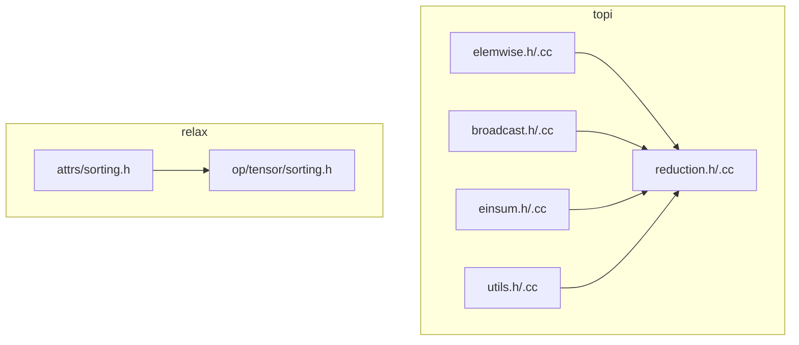
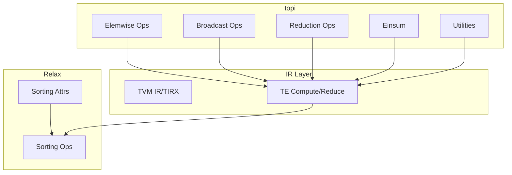
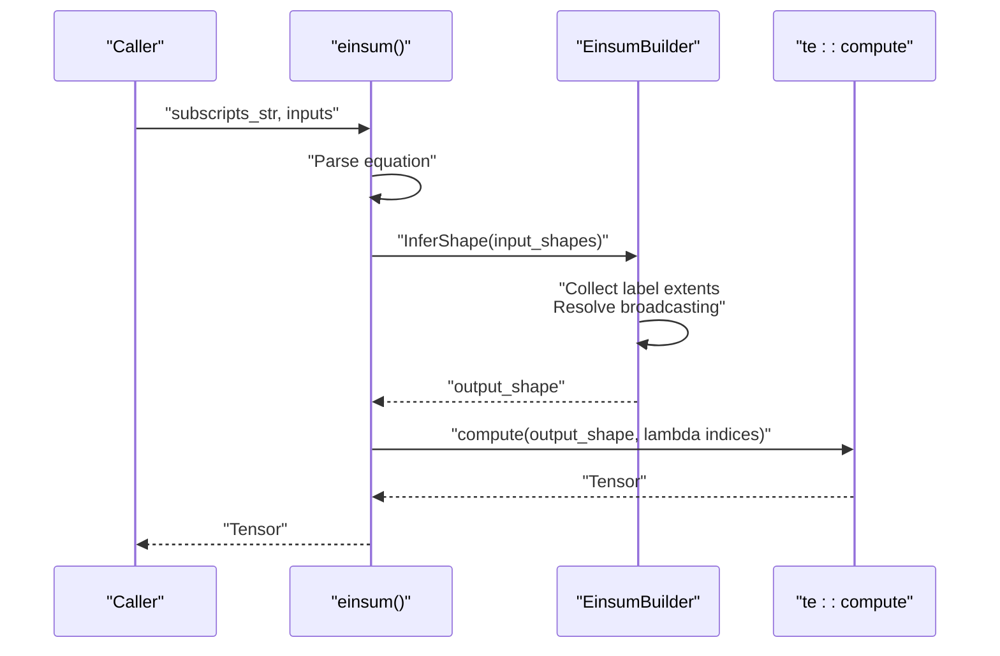
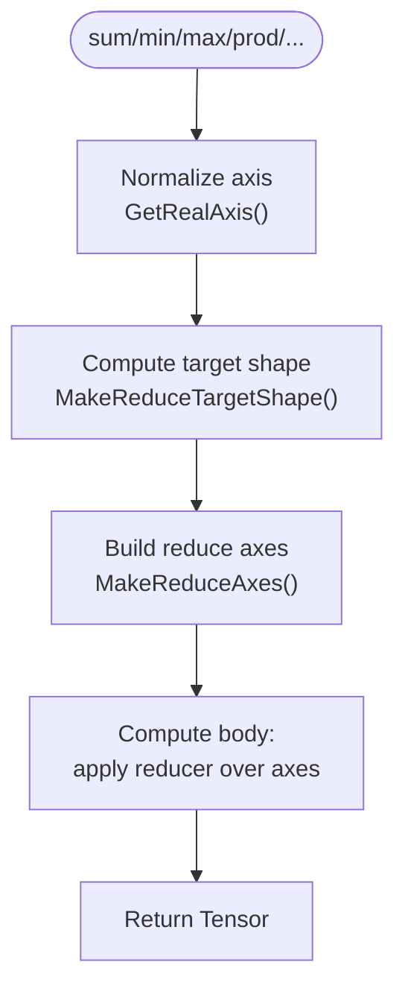
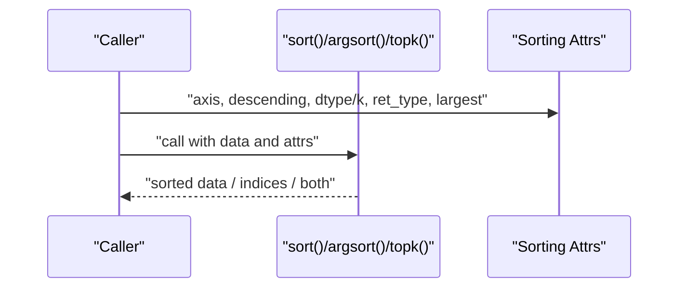
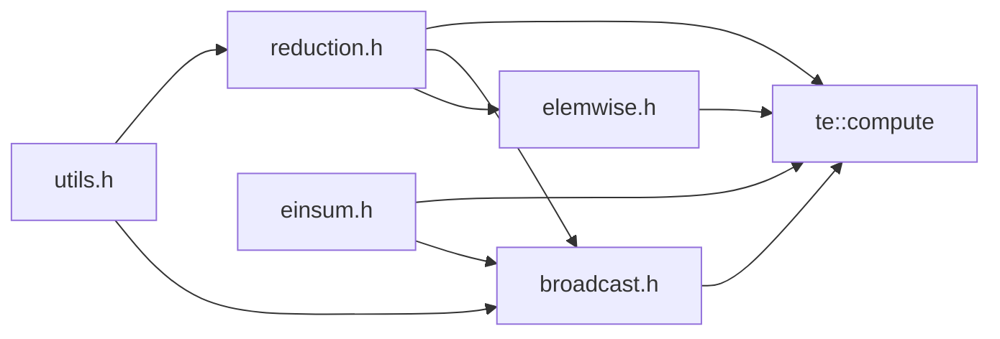

# Mathematical Operations

<cite>
**Referenced Files in This Document**
- [einsum.cc](file://src/topi/einsum.cc)
- [einsum.h](file://include/tvm/topi/einsum.h)
- [elemwise.cc](file://src/topi/elemwise.cc)
- [elemwise.h](file://include/tvm/topi/elemwise.h)
- [reduction.cc](file://src/topi/reduction.cc)
- [reduction.h](file://include/tvm/topi/reduction.h)
- [broadcast.cc](file://src/topi/broadcast.cc)
- [broadcast.h](file://include/tvm/topi/broadcast.h)
- [utils.h](file://include/tvm/topi/utils.h)
- [utils.cc](file://src/topi/utils.cc)
- [sorting.h (Relax attrs)](file://include/tvm/relax/attrs/sorting.h)
- [sorting.h (Relax op)](file://src/relax/op/tensor/sorting.h)
</cite>

## Table of Contents
1. [Introduction](#introduction)
2. [Project Structure](#project-structure)
3. [Core Components](#core-components)
4. [Architecture Overview](#architecture-overview)
5. [Detailed Component Analysis](#detailed-component-analysis)
6. [Dependency Analysis](#dependency-analysis)
7. [Performance Considerations](#performance-considerations)
8. [Troubleshooting Guide](#troubleshooting-guide)
9. [Conclusion](#conclusion)

## Introduction
This document provides comprehensive API documentation for TOP-I mathematical and tensor operations in the TVM codebase. It focuses on element-wise mathematical functions, Einstein summation (einsum), broadcasting utilities, reduction operations (sum, mean, max, min, argmin, argmax, prod, all, any), sorting operators (sort, argsort, topk), and numerical utilities. It explains tensor manipulation patterns, shape inference rules, and memory-efficient computation strategies. Practical examples are included for mathematical modeling, tensor algebra, and numerical optimization techniques, along with performance characteristics and hardware-specific implementation notes.

## Project Structure
TOP-I mathematical operations are primarily implemented in the topi library and Relax operator set:
- topi elemwise, broadcast, einsum, reduction, and utilities define elementwise math, broadcasting, Einstein summation, reductions, and helper utilities.
- Relax sorting attributes and operator declarations provide sort, argsort, and topk capabilities.

**Diagram sources**
- [elemwise.h](file://include/tvm/topi/elemwise.h)
- [broadcast.h](file://include/tvm/topi/broadcast.h)
- [reduction.h](file://include/tvm/topi/reduction.h)
- [einsum.h](file://include/tvm/topi/einsum.h)
- [utils.h](file://include/tvm/topi/utils.h)
- [sorting.h (Relax attrs)](file://include/tvm/relax/attrs/sorting.h)
- [sorting.h (Relax op)](file://src/relax/op/tensor/sorting.h)

**Section sources**
- [elemwise.h:1-491](file://include/tvm/topi/elemwise.h#L1-L491)
- [broadcast.h:1-497](file://include/tvm/topi/broadcast.h#L1-L497)
- [reduction.h:1-614](file://include/tvm/topi/reduction.h#L1-L614)
- [einsum.h:1-96](file://include/tvm/topi/einsum.h#L1-L96)
- [utils.h:1-51](file://include/tvm/topi/utils.h#L1-L51)
- [sorting.h (Relax attrs):1-110](file://include/tvm/relax/attrs/sorting.h#L1-L110)
- [sorting.h (Relax op):1-72](file://src/relax/op/tensor/sorting.h#L1-L72)

## Core Components
- Element-wise math: unary and binary ops, fast approximations, clipping, casting, reinterpretation, and sum aggregation across multiple tensors.
- Broadcasting: numpy-compatible broadcasting with automatic shape alignment and index mapping.
- Einstein summation: equation parsing, implicit/explicit mode, ellipsis handling, shape inference, and reduction axes.
- Reductions: sum, mean, min, max, argmin, argmax, prod, all, any, and collapsed sum with axis handling and keepdims semantics.
- Sorting: sort, argsort, and topk with configurable axis, direction, and return types.
- Utilities: axis normalization, shape checks, and sampling helpers.

**Section sources**
- [elemwise.cc:1-126](file://src/topi/elemwise.cc#L1-L126)
- [broadcast.cc:1-87](file://src/topi/broadcast.cc#L1-L87)
- [einsum.cc:1-378](file://src/topi/einsum.cc#L1-L378)
- [reduction.cc:1-85](file://src/topi/reduction.cc#L1-L85)
- [utils.cc:1-53](file://src/topi/utils.cc#L1-L53)

## Architecture Overview
The TOP-I APIs are layered:
- At the lowest level, TIR primitives and TE compute constructs define the IR graph.
- topi provides high-level operations that wrap TE compute and reductions.
- Relax provides higher-level operator declarations for sorting and other tensor ops.

**Diagram sources**
- [elemwise.h:1-491](file://include/tvm/topi/elemwise.h#L1-L491)
- [broadcast.h:1-497](file://include/tvm/topi/broadcast.h#L1-L497)
- [reduction.h:1-614](file://include/tvm/topi/reduction.h#L1-L614)
- [einsum.h:1-96](file://include/tvm/topi/einsum.h#L1-L96)
- [utils.h:1-51](file://include/tvm/topi/utils.h#L1-L51)
- [sorting.h (Relax attrs):1-110](file://include/tvm/relax/attrs/sorting.h#L1-L110)
- [sorting.h (Relax op):1-72](file://src/relax/op/tensor/sorting.h#L1-L72)

## Detailed Component Analysis

### Element-wise Mathematical Functions
- Unary ops: exp, erf, sigmoid, sqrt, log, log2, log10, trigonometric, inverse trigonometric, rounding, abs, isnan/isfinite/isinf, tanh, fast_tanh, identity, negative, logical_not, bitwise_not, sign, rsqrt, clip, cast, reinterpret, elemwise_sum, full, full_like.
- Binary ops: add, subtract, multiply, divide, floor_divide, trunc_divide, mod, floor_mod, trunc_mod, maximum, minimum, power, left/right shift, logical_and/or/xor, bitwise_and/or/xor, comparisons (>, <, ==, !=, >=, <=), and log_add_exp.
- Fast approximations: fast_exp, fast_erf, fast_tanh with dtype-specialized implementations.

Key implementation patterns:
- Each op is defined via TE compute over the input shape, returning a new Tensor.
- Broadcasting-aware overloads use a helper macro to dispatch between tensor-tensor, tensor-scalar, and scalar-scalar variants.
- Fast paths are provided for common dtypes (e.g., float32/float16) with fallbacks.

Practical examples:
- Apply activation functions to a batch of activations.
- Clip gradients to stabilize training.
- Cast between dtypes for mixed-precision kernels.

**Section sources**
- [elemwise.h:42-491](file://include/tvm/topi/elemwise.h#L42-L491)
- [elemwise.cc:34-122](file://src/topi/elemwise.cc#L34-L122)

### Broadcasting Utilities
- broadcast_to: expands a tensor to a target shape following numpy-compatible rules.
- Binary arithmetic/logical/bitwise ops with auto-broadcasting via a macro that selects the appropriate compute rule and applies index remapping.

Key implementation patterns:
- BroadcastShape computes a common shape and variable mapping.
- InputIndexFromBroadcast maps output indices back to input indices, handling size-1 and symbolic dimensions.
- Overloads handle tensor-scalar and scalar-tensor cases efficiently.

Practical examples:
- Add a bias tensor to a conv output by broadcasting along channel axis.
- Compare a scalar threshold to a feature map.

**Section sources**
- [broadcast.h:48-497](file://include/tvm/topi/broadcast.h#L48-L497)
- [broadcast.cc:35-83](file://src/topi/broadcast.cc#L35-L83)

### Einstein Summation (einsum)
- Equation parsing supports implicit and explicit modes, arrows, commas, and ellipsis.
- Shape inference collects per-label extents, resolves broadcasting, and infers ellipsis sub-shapes.
- Index mapping builds output expressions and sets up reduction axes for labels not present in the output.

Key implementation patterns:
- EinsumEquation.FromString parses subscripts and normalizes to explicit form.
- EinsumBuilder performs shape inference and builds the output expression via multiplication of operand slices and optional sum reduction.
- Broadcasting rules are applied to resolve mismatched dimensions.

Practical examples:
- Matrix multiplication via “mk,kn->mn”.
- Batch matmul via “bmk,bkn->bmn”.
- Trace via “ii->”.

**Diagram sources**
- [einsum.cc:345-367](file://src/topi/einsum.cc#L345-L367)
- [einsum.h:58-73](file://include/tvm/topi/einsum.h#L58-L73)

**Section sources**
- [einsum.cc:34-103](file://src/topi/einsum.cc#L34-L103)
- [einsum.cc:150-212](file://src/topi/einsum.cc#L150-L212)
- [einsum.cc:214-328](file://src/topi/einsum.cc#L214-L328)
- [einsum.h:58-91](file://include/tvm/topi/einsum.h#L58-L91)

### Reduction Operations
- Axis normalization: GetRealAxis converts None/empty and negative indices to positive indices and deduplicates.
- Target shape construction: MakeReduceTargetShape computes output shape with keepdims semantics.
- CommReduce/DoCommReduce orchestrate reduction with reduce axes and optional squeezing.
- Index reductions: argmin/argmax reducers combine index and value comparisons with configurable tie-breaking.

Key implementation patterns:
- FReduce/FCommReduce define reducer signatures.
- CommReduceIdx handles index-returning reductions and ravel/unravel for multi-axis reductions.
- collapse_sum collapses axes by detecting equality with target shape and reducing/squeezing accordingly.

Practical examples:
- Global average pooling via sum followed by division or mean over spatial axes.
- Argmax over class axis for classification predictions.
- Collapse sum to reshape large tensors efficiently.

**Diagram sources**
- [reduction.h:65-125](file://include/tvm/topi/reduction.h#L65-L125)
- [reduction.h:140-192](file://include/tvm/topi/reduction.h#L140-L192)
- [reduction.h:207-253](file://include/tvm/topi/reduction.h#L207-L253)

**Section sources**
- [reduction.h:65-192](file://include/tvm/topi/reduction.h#L65-L192)
- [reduction.h:207-253](file://include/tvm/topi/reduction.h#L207-L253)
- [reduction.h:328-369](file://include/tvm/topi/reduction.h#L328-L369)
- [reduction.cc:35-81](file://src/topi/reduction.cc#L35-L81)

### Sorting Algorithms (Relax)
- sort: reverses order along a given axis, configurable descending.
- argsort: returns indices that sort along an axis, configurable dtype and descending.
- topk: returns top-k values/indices along an axis, configurable k, largest/smallest, and return type.

Key implementation patterns:
- Attributes define axis, descending, dtype, k, ret_type, and largest.
- Operators declared in Relax with typed Expr returns.

Practical examples:
- Retrieve top-1 predictions with argmax (via topk with k=1).
- Stable ranking of scores along a batch axis.

**Diagram sources**
- [sorting.h (Relax attrs):34-104](file://include/tvm/relax/attrs/sorting.h#L34-L104)
- [sorting.h (Relax op):44-66](file://src/relax/op/tensor/sorting.h#L44-L66)

**Section sources**
- [sorting.h (Relax attrs):34-104](file://include/tvm/relax/attrs/sorting.h#L34-L104)
- [sorting.h (Relax op):44-66](file://src/relax/op/tensor/sorting.h#L44-L66)

### Numerical Utilities
- ArrayOrInt: canonicalizes axis arguments to Optional<Array<Integer>> for reduction APIs.
- Sampling helpers: bilinear sampling for NCHW/NHWC layouts.
- Shape checks: is_empty_shape utility.

Practical examples:
- Normalize axis parameter for reduction across dynamic shapes.
- Interpolate features for upsampling/downsampling.

**Section sources**
- [utils.h:36-47](file://include/tvm/topi/utils.h#L36-L47)
- [utils.cc:31-49](file://src/topi/utils.cc#L31-L49)

## Dependency Analysis
- elemwise depends on TIRX intrinsics and TE compute.
- broadcast depends on broadcast shape utilities and TE compute.
- reduction depends on broadcast utilities, TIR reduce, and TE compute.
- einsum depends on broadcast utilities, shape inference, and TE compute.
- sorting relies on Relax attrs and op declarations.

**Diagram sources**
- [elemwise.h:1-491](file://include/tvm/topi/elemwise.h#L1-L491)
- [broadcast.h:1-497](file://include/tvm/topi/broadcast.h#L1-L497)
- [reduction.h:1-614](file://include/tvm/topi/reduction.h#L1-L614)
- [einsum.h:1-96](file://include/tvm/topi/einsum.h#L1-L96)
- [utils.h:1-51](file://include/tvm/topi/utils.h#L1-L51)

**Section sources**
- [elemwise.h:1-491](file://include/tvm/topi/elemwise.h#L1-L491)
- [broadcast.h:1-497](file://include/tvm/topi/broadcast.h#L1-L497)
- [reduction.h:1-614](file://include/tvm/topi/reduction.h#L1-L614)
- [einsum.h:1-96](file://include/tvm/topi/einsum.h#L1-L96)
- [utils.h:1-51](file://include/tvm/topi/utils.h#L1-L51)

## Performance Considerations
- Memory efficiency:
  - Use collapse_sum to fuse adjacent dimensions before reduction to minimize intermediate allocations.
  - Prefer in-place-like patterns via elemwise ops and broadcasting to avoid extra copies.
- Numerical stability:
  - Use log_add_exp for numerically stable log-space sums.
  - Use fast_exp/fast_erf/fast_tanh for speed-critical paths when precision loss is acceptable.
- Reduction strategy:
  - Keepdims=True enables broadcasting-friendly results; choose False to reduce total size.
  - For multi-axis reductions, consider pre-shaping to reduce the number of axes.
- Hardware-specific implementations:
  - Some fast approximations are specialized for float32/float16.
  - Broadcasting utilities leverage symbolic shapes and vector lanes; ensure dtype lanes align for vectorization benefits.

[No sources needed since this section provides general guidance]

## Troubleshooting Guide
Common issues and resolutions:
- Broadcasting mismatches:
  - Ensure dimensions are compatible per numpy rules; size-1 broadcasts are allowed, but unequal sizes must be reshapable.
  - Verify output_shape passed to broadcast_to matches inferred common shape.
- Einsum equation errors:
  - Implicit mode infers output labels; confirm labels appear consistently across inputs.
  - Ellipsis must be unique per operand and resolved to a common sub-shape.
- Reduction axis errors:
  - Negative indices are normalized; ensure they fall within [0, ndim).
  - Empty axis defaults to all axes; confirm intended behavior.
- Sorting operator usage:
  - Axis must be within [-ndim, ndim-1]; descending controls order.
  - For argsort/topk, select dtype for indices appropriately.

**Section sources**
- [broadcast.h:52-70](file://include/tvm/topi/broadcast.h#L52-L70)
- [einsum.cc:34-103](file://src/topi/einsum.cc#L34-L103)
- [reduction.h:65-86](file://include/tvm/topi/reduction.h#L65-L86)
- [sorting.h (Relax attrs):34-104](file://include/tvm/relax/attrs/sorting.h#L34-L104)

## Conclusion
TOP-I mathematical operations in TVM provide a cohesive set of elementwise, broadcasting, einsum, reduction, sorting, and utility APIs. They emphasize correctness with numpy-compatible broadcasting and shape inference, performance via fast approximations and efficient reductions, and flexibility through configurable axes and return types. By leveraging these components, developers can implement robust tensor algebra routines, numerical optimization techniques, and scalable machine learning pipelines.