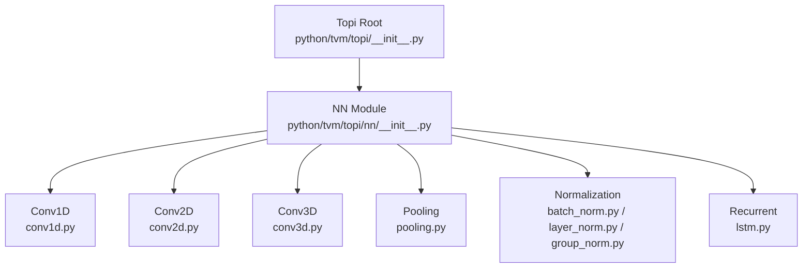
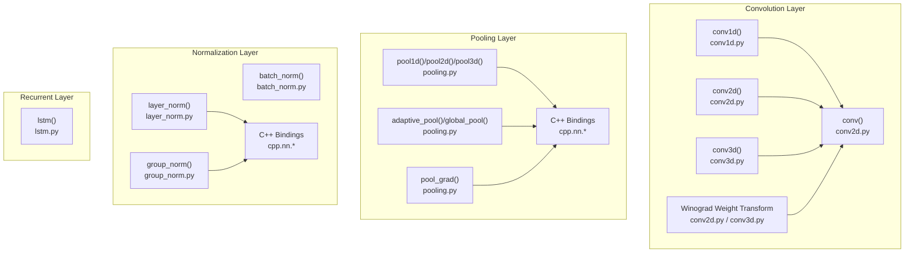
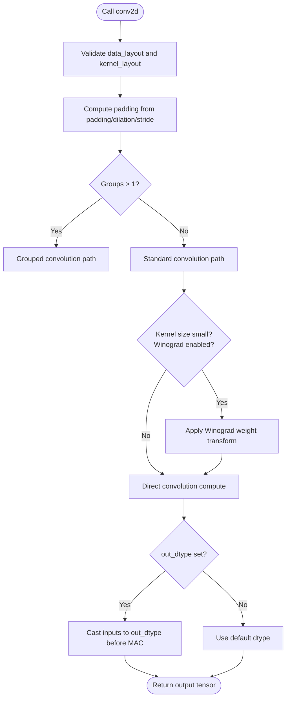
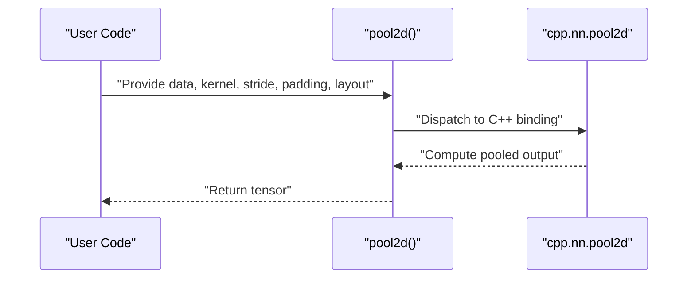
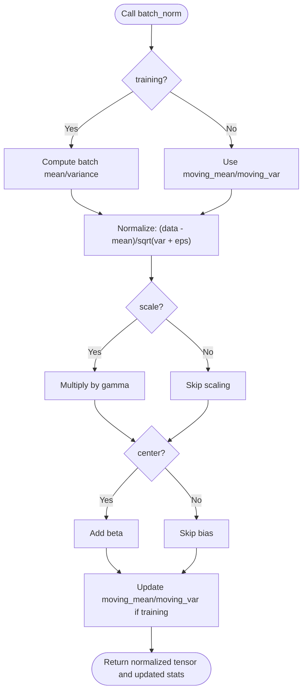
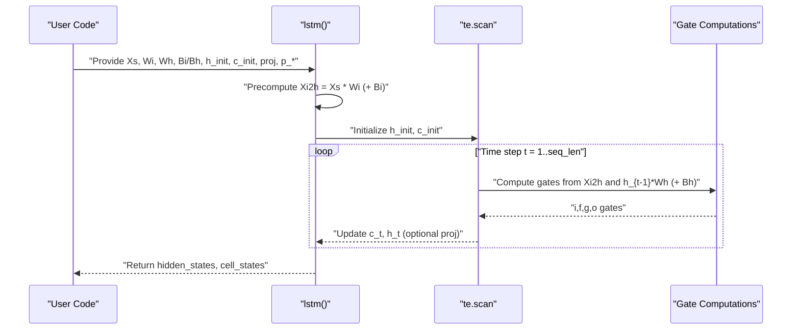
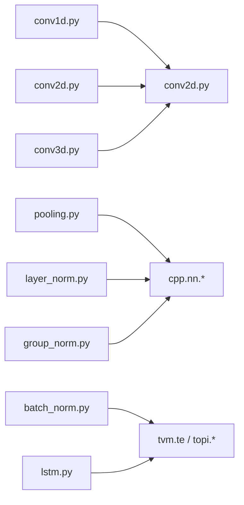

# Neural Network Operators

<cite>
**Referenced Files in This Document**
- [topi/nn/__init__.py](file://python/tvm/topi/nn/__init__.py)
- [topi/nn/conv1d.py](file://python/tvm/topi/nn/conv1d.py)
- [topi/nn/conv2d.py](file://python/tvm/topi/nn/conv2d.py)
- [topi/nn/conv3d.py](file://python/tvm/topi/nn/conv3d.py)
- [topi/nn/pooling.py](file://python/tvm/topi/nn/pooling.py)
- [topi/nn/batch_norm.py](file://python/tvm/topi/nn/batch_norm.py)
- [topi/nn/layer_norm.py](file://python/tvm/topi/nn/layer_norm.py)
- [topi/nn/group_norm.py](file://python/tvm/topi/nn/group_norm.py)
- [topi/nn/lstm.py](file://python/tvm/topi/nn/lstm.py)
- [topi/__init__.py](file://python/tvm/topi/__init__.py)
</cite>

## Table of Contents
1. [Introduction](#introduction)
2. [Project Structure](#project-structure)
3. [Core Components](#core-components)
4. [Architecture Overview](#architecture-overview)
5. [Detailed Component Analysis](#detailed-component-analysis)
6. [Dependency Analysis](#dependency-analysis)
7. [Performance Considerations](#performance-considerations)
8. [Troubleshooting Guide](#troubleshooting-guide)
9. [Conclusion](#conclusion)
10. [Appendices](#appendices)

## Introduction
This document provides comprehensive API documentation for TOP-I neural network operators in the TVM Topi library. It covers convolution operations (conv1d, conv2d, conv3d), transpose convolutions, pooling operations, normalization layers (batch_norm, layer_norm, group_norm), activation functions, attention mechanisms, and recurrent layers (lstm). For each operator, we explain parameters, input/output shapes, layout specifications, and hardware-specific optimizations. We also include practical examples for common neural network patterns, operator fusion opportunities, performance optimization techniques, and testing utilities.

## Project Structure
Topi organizes neural network operators under a dedicated namespace. The nn module exposes a broad set of operators, including convolutions, pooling, normalization, and recurrent layers. The top-level __init__ file aggregates and re-exports these operators for convenient import.

**Diagram sources**
- [topi/__init__.py:1-65](file://python/tvm/topi/__init__.py#L1-L65)
- [topi/nn/__init__.py:1-58](file://python/tvm/topi/nn/__init__.py#L1-L58)

**Section sources**
- [topi/__init__.py:1-65](file://python/tvm/topi/__init__.py#L1-L65)
- [topi/nn/__init__.py:1-58](file://python/tvm/topi/nn/__init__.py#L1-L58)

## Core Components
This section summarizes the primary operator families and their roles in neural networks.

- Convolution family
  - 1D: conv1d, group_conv1d variants
  - 2D: conv2d, group_conv2d, specialized layouts (NCHW, NHWC, HWCN, NCHWxc)
  - 3D: conv3d, group_conv3d
  - Transpose convolutions: conv1d_transpose, conv2d_transpose, conv3d_transpose
  - Winograd weight transforms for 2D and 3D
- Pooling family
  - Global pooling, adaptive pooling, and fixed-size pooling for 1D/2D/3D
  - Pooling gradients
- Normalization family
  - Batch normalization, layer normalization, group normalization
- Recurrent family
  - LSTM with optional projection and peephole connections
- Activation functions
  - Exposed via TIRX ops (e.g., sigmoid, tanh) used inside operators like LSTM

**Section sources**
- [topi/nn/conv1d.py:23-142](file://python/tvm/topi/nn/conv1d.py#L23-L142)
- [topi/nn/conv2d.py:61-800](file://python/tvm/topi/nn/conv2d.py#L61-L800)
- [topi/nn/conv3d.py:28-170](file://python/tvm/topi/nn/conv3d.py#L28-L170)
- [topi/nn/pooling.py:24-407](file://python/tvm/topi/nn/pooling.py#L24-L407)
- [topi/nn/batch_norm.py:24-147](file://python/tvm/topi/nn/batch_norm.py#L24-L147)
- [topi/nn/layer_norm.py:22-50](file://python/tvm/topi/nn/layer_norm.py#L22-L50)
- [topi/nn/group_norm.py:22-56](file://python/tvm/topi/nn/group_norm.py#L22-L56)
- [topi/nn/lstm.py:25-239](file://python/tvm/topi/nn/lstm.py#L25-L239)

## Architecture Overview
The Topi NN operators are thin wrappers around a shared convolution engine and leverage layout-aware scheduling and hardware-specific transformations. Many operators delegate to a generic conv(...) routine with layout and group parameters. Pooling and normalization are implemented via C++ bindings for performance and portability.

**Diagram sources**
- [topi/nn/conv1d.py:65-67](file://python/tvm/topi/nn/conv1d.py#L65-L67)
- [topi/nn/conv2d.py:733-800](file://python/tvm/topi/nn/conv2d.py#L733-L800)
- [topi/nn/conv3d.py:106-118](file://python/tvm/topi/nn/conv3d.py#L106-L118)
- [topi/nn/pooling.py:56-168](file://python/tvm/topi/nn/pooling.py#L56-L168)
- [topi/nn/batch_norm.py:91-147](file://python/tvm/topi/nn/batch_norm.py#L91-L147)
- [topi/nn/layer_norm.py:49](file://python/tvm/topi/nn/layer_norm.py#L49)
- [topi/nn/group_norm.py:55](file://python/tvm/topi/nn/group_norm.py#L55)
- [topi/nn/lstm.py:25-79](file://python/tvm/topi/nn/lstm.py#L25-L79)

## Detailed Component Analysis

### Convolution Operations (conv1d, conv2d, conv3d)
- Parameters
  - data/kernel tensors with explicit layouts
  - strides, padding, dilation
  - groups for grouped convolutions
  - data_layout and kernel_layout selection
  - out_dtype for mixed precision
  - auto_scheduler and meta_schedule hints for layout rewriting
- Input/Output Shapes
  - 1D: input [N, C, W], kernel [F, C, Kw] -> output [N, F, Wo]
  - 2D: input [N, C, H, W], kernel [F, C, KH, KW] -> output [N, F, Ho, Wo]
  - 3D: input [N, C, D, H, W], kernel [F, C, KD, KH, KW] -> output [N, F, Do, Ho, Wo]
- Layout Specifications
  - Supported layouts include NCHW, NHWC, HWCN, NCDHW, NDHWC
  - Kernel layouts inferred from data_layout when omitted
- Hardware-Specific Optimizations
  - Winograd weight transform for 2D/3D kernels
  - Vectorized NCHWc layouts with block factors for GPU-friendly memory access
  - Int8 NCHWc int8 accumulation path for quantized convolutions
- Practical Examples
  - Standard conv1d with NCW layout
  - Grouped conv2d in NCHW
  - Mixed-precision conv3d in NDHWC
- Operator Fusion Opportunities
  - Fuse bias add immediately after convolution
  - Fuse activation (relu, sigmoid, tanh) after convolution or normalization
  - Fuse batch normalization into convolution where supported
- Performance Tips
  - Prefer NHWC/NHWC layouts on CPU; NCHW/NCHWc on GPU
  - Use grouped convolutions to reduce compute when channels are divisible
  - Apply Winograd transform for small square kernels (e.g., 3x3) on GPU

**Diagram sources**
- [topi/nn/conv2d.py:61-100](file://python/tvm/topi/nn/conv2d.py#L61-L100)
- [topi/nn/conv2d.py:660-693](file://python/tvm/topi/nn/conv2d.py#L660-L693)
- [topi/nn/conv3d.py:121-170](file://python/tvm/topi/nn/conv3d.py#L121-L170)

**Section sources**
- [topi/nn/conv1d.py:23-142](file://python/tvm/topi/nn/conv1d.py#L23-L142)
- [topi/nn/conv2d.py:61-272](file://python/tvm/topi/nn/conv2d.py#L61-L272)
- [topi/nn/conv2d.py:275-524](file://python/tvm/topi/nn/conv2d.py#L275-L524)
- [topi/nn/conv2d.py:527-657](file://python/tvm/topi/nn/conv2d.py#L527-L657)
- [topi/nn/conv2d.py:660-693](file://python/tvm/topi/nn/conv2d.py#L660-L693)
- [topi/nn/conv3d.py:28-118](file://python/tvm/topi/nn/conv3d.py#L28-L118)
- [topi/nn/conv3d.py:121-170](file://python/tvm/topi/nn/conv3d.py#L121-L170)

### Transpose Convololutions
- Overview
  - Transpose convolutions (deconvolutions) upsample spatial dimensions using learned filters
  - Implemented via conv2d_transpose, conv1d_transpose, and conv3d_transpose modules
- Parameters
  - Same as forward convolutions with spatial upsampling semantics
- Layouts
  - Support NCHW, NHWC, NCDHW, NDHWC depending on dimensionality
- Practical Examples
  - Decoder blocks in segmentation networks
  - Feature map upsampling in autoencoders
- Performance Tips
  - Use appropriate output padding to match target shapes
  - Combine with batch/layer normalization and activations for stable training

[No sources needed since this section summarizes without analyzing specific files]

### Pooling Operations
- Types
  - Global pooling, adaptive pooling, fixed-size 1D/2D/3D pooling
  - Pooling gradient computation for backpropagation
- Parameters
  - kernel, stride, padding, dilation, ceil_mode, count_include_pad
  - layout string encoding spatial axes and vectorization factors
- Input/Output Shapes
  - Preserve batch and channel axes; spatial dims reduced per layout rules
- Hardware-Specific Notes
  - Implemented via C++ bindings for optimal performance across devices
- Practical Examples
  - Global average pooling before classification head
  - Adaptive pooling to normalize feature map sizes across scales
- Operator Fusion Opportunities
  - Fuse pooling with preceding convolution or normalization
  - Fuse activation after pooling for inference graphs

**Diagram sources**
- [topi/nn/pooling.py:265-334](file://python/tvm/topi/nn/pooling.py#L265-L334)

**Section sources**
- [topi/nn/pooling.py:24-407](file://python/tvm/topi/nn/pooling.py#L24-L407)

### Normalization Layers
- Batch Normalization
  - Parameters: gamma, beta, moving_mean, moving_var, axis, epsilon, center, scale, training, momentum
  - Behavior: training computes batch statistics; inference uses moving averages
  - Output: normalized tensor with optional scaling and shifting
- Layer Normalization
  - Parameters: data, gamma, beta, axis, epsilon
  - Normalizes across axes specified by axis
- Group Normalization
  - Parameters: data, gamma, beta, num_groups, channel_axis, axes, epsilon
  - Divides channels into groups and normalizes within each group
- Practical Examples
  - Batch norm after conv and before activation
  - Layer norm in transformer blocks
  - Group norm as a stable alternative to batch norm for small batches
- Operator Fusion Opportunities
  - Fold BN into convolution via fused kernel or pre-multiplication
  - Compose with activation for fused ReLU-BN patterns

**Diagram sources**
- [topi/nn/batch_norm.py:115-146](file://python/tvm/topi/nn/batch_norm.py#L115-L146)

**Section sources**
- [topi/nn/batch_norm.py:24-147](file://python/tvm/topi/nn/batch_norm.py#L24-L147)
- [topi/nn/layer_norm.py:22-50](file://python/tvm/topi/nn/layer_norm.py#L22-L50)
- [topi/nn/group_norm.py:22-56](file://python/tvm/topi/nn/group_norm.py#L22-L56)

### Activation Functions
- Usage
  - Activations are applied via TIRX ops (e.g., sigmoid, tanh) inside operators such as LSTM gates
- Practical Examples
  - Sigmoid for gate activations, tanh for cell candidates
- Performance Tips
  - Keep activation fusion close to arithmetic units to minimize memory traffic

**Section sources**
- [topi/nn/lstm.py:37-42](file://python/tvm/topi/nn/lstm.py#L37-L42)

### Attention Mechanisms
- Overview
  - Attention operators are exposed in the vision and relax modules; see vision/roi_pool.py and relax op definitions for attention-related primitives
- Practical Examples
  - ROI pooling for detection heads
  - Multi-head attention building blocks (see relax op definitions)
- Performance Tips
  - Use layout-aware pooling and reshape ops to reduce overhead
  - Fuse attention scores with softmax and weighted sum

[No sources needed since this section provides general guidance]

### Recurrent Layers (LSTM)
- Parameters
  - Xs: input sequence (seq_len, batch, in_dim)
  - Wi, Wh: input and hidden weights (packed by weight_layout)
  - Bi, Bh: optional biases
  - h_init, c_init: initial hidden and cell states
  - proj: optional projection matrix
  - p_i, p_f, p_o: peephole connections
  - f_act, g_act, h_act: activation functions for gates and cell
  - reverse: process sequence in reverse
  - weight_layout: order of gates in packed weights ("IFGO" permutations)
- Output
  - Hidden states and cell states for each timestep
- Implementation Highlights
  - Uses TE scan for recurrent computation
  - Precomputes input-to-hidden matmul outside the scan to improve locality
  - Supports projection and peephole connections
- Practical Examples
  - Unidirectional LSTM for sequence modeling
  - Bidirectional LSTM by processing in reverse and concatenating outputs
- Operator Fusion Opportunities
  - Fuse bias additions after matmul
  - Fuse activation functions with gate computations
  - Fuse projection matrix multiply when present

**Diagram sources**
- [topi/nn/lstm.py:25-79](file://python/tvm/topi/nn/lstm.py#L25-L79)
- [topi/nn/lstm.py:103-111](file://python/tvm/topi/nn/lstm.py#L103-L111)
- [topi/nn/lstm.py:128-139](file://python/tvm/topi/nn/lstm.py#L128-L139)
- [topi/nn/lstm.py:144-151](file://python/tvm/topi/nn/lstm.py#L144-L151)
- [topi/nn/lstm.py:226-238](file://python/tvm/topi/nn/lstm.py#L226-L238)

**Section sources**
- [topi/nn/lstm.py:25-239](file://python/tvm/topi/nn/lstm.py#L25-L239)

## Dependency Analysis
- Operator Composition
  - conv1d/conv3d rely on the generic conv(...) routine
  - Pooling relies on C++ bindings for performance
  - Normalization layers call C++ bindings for vectorized kernels
- Layout-Aware Scheduling
  - NCHWc layouts enable vectorization and improve cache locality
  - Auto/meta scheduler hints allow layout rewrites for performance
- Hardware Backends
  - Winograd transforms and int8 accumulations target GPU and specialized accelerators

**Diagram sources**
- [topi/nn/conv1d.py:65-67](file://python/tvm/topi/nn/conv1d.py#L65-L67)
- [topi/nn/conv2d.py:733-800](file://python/tvm/topi/nn/conv2d.py#L733-L800)
- [topi/nn/conv3d.py:106-118](file://python/tvm/topi/nn/conv3d.py#L106-L118)
- [topi/nn/pooling.py:56](file://python/tvm/topi/nn/pooling.py#L56)
- [topi/nn/layer_norm.py:49](file://python/tvm/topi/nn/layer_norm.py#L49)
- [topi/nn/group_norm.py:55](file://python/tvm/topi/nn/group_norm.py#L55)
- [topi/nn/batch_norm.py:91-147](file://python/tvm/topi/nn/batch_norm.py#L91-L147)
- [topi/nn/lstm.py:25-79](file://python/tvm/topi/nn/lstm.py#L25-L79)

**Section sources**
- [topi/nn/conv1d.py:23-142](file://python/tvm/topi/nn/conv1d.py#L23-L142)
- [topi/nn/conv2d.py:61-800](file://python/tvm/topi/nn/conv2d.py#L61-L800)
- [topi/nn/conv3d.py:28-170](file://python/tvm/topi/nn/conv3d.py#L28-L170)
- [topi/nn/pooling.py:24-407](file://python/tvm/topi/nn/pooling.py#L24-L407)
- [topi/nn/batch_norm.py:24-147](file://python/tvm/topi/nn/batch_norm.py#L24-L147)
- [topi/nn/layer_norm.py:22-50](file://python/tvm/topi/nn/layer_norm.py#L22-L50)
- [topi/nn/group_norm.py:22-56](file://python/tvm/topi/nn/group_norm.py#L22-L56)
- [topi/nn/lstm.py:25-239](file://python/tvm/topi/nn/lstm.py#L25-L239)

## Performance Considerations
- Layout Selection
  - Prefer NHWC on CPUs; NCHW/NCHWc on GPUs for vectorization
- Kernel Size and Transform
  - Use Winograd transform for small square kernels (e.g., 3x3) on GPU
- Mixed Precision
  - Set out_dtype for accumulation to reduce bandwidth and increase throughput
- Memory Access Patterns
  - Use NCHWc layouts to exploit vector units and reduce register pressure
- Operator Fusion
  - Fuse bias add, activation, and normalization into convolution
  - Fuse LSTM bias additions and activation steps
- Auto Scheduler Integration
  - Provide auto_scheduler_rewritten_layout and meta_schedule hints to guide layout rewrites

[No sources needed since this section provides general guidance]

## Troubleshooting Guide
- Shape Mismatches
  - Verify data_layout and kernel_layout combinations
  - Ensure groups divide input channels evenly
- Incorrect Outputs
  - Confirm padding modes ("VALID"/"SAME") and dilation values
  - Check axis alignment for normalization layers
- Training vs Inference
  - For batch_norm, ensure training flag is set appropriately
  - Use moving_mean/moving_var for inference
- Layout Constraints
  - Some operators require spatial axes to remain unsplit (e.g., NCHW16h invalid)
- Testing Utilities
  - Use testing modules under python/tvm/topi/testing for unit tests and numerical checks
  - Compare against NumPy implementations for correctness

**Section sources**
- [topi/nn/batch_norm.py:115-146](file://python/tvm/topi/nn/batch_norm.py#L115-L146)
- [topi/nn/pooling.py:24-56](file://python/tvm/topi/nn/pooling.py#L24-L56)

## Conclusion
TOP-I operators in TVM’s Topi provide a comprehensive, layout-aware, and performance-tuned set of neural network primitives. By leveraging hardware-specific optimizations (Winograd, NCHWc, int8 accumulations), operator fusion, and auto/meta schedulers, developers can achieve high performance across diverse hardware targets. The included normalization, pooling, and recurrent layers integrate seamlessly with convolution operators to support modern architectures.

## Appendices
- Practical Example Patterns
  - Convolution + BatchNorm + ReLU stack
  - Global Average Pooling + Dense classifier
  - LSTM encoder-decoder with attention
- Operator Fusion Checklist
  - Bias add after convolution
  - Activation after normalization or convolution
  - Projection in LSTM when needed
- Validation Procedures
  - Cross-check with NumPy implementations
  - Use Topi testing utilities for numerical tolerances
  - Profile with target-specific backends to validate performance

[No sources needed since this section provides general guidance]