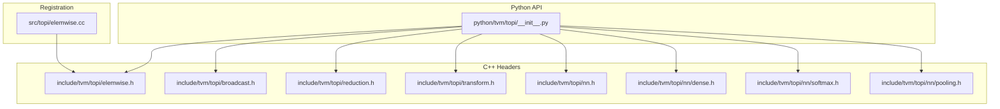
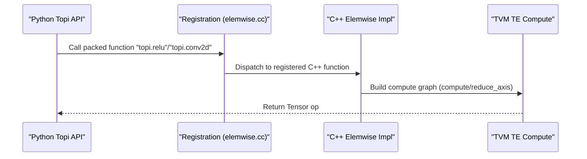
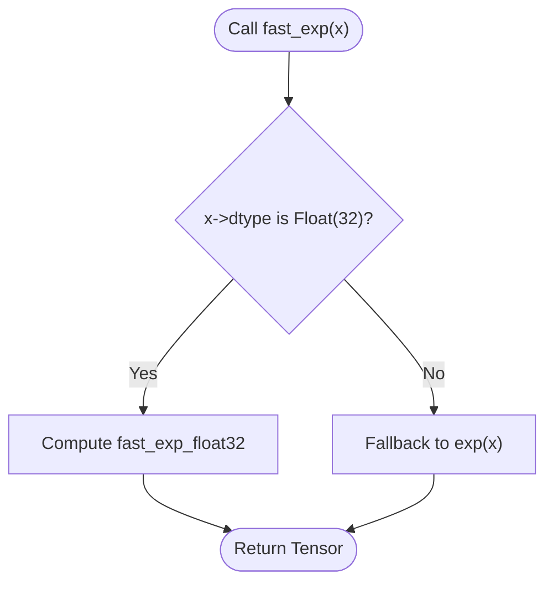
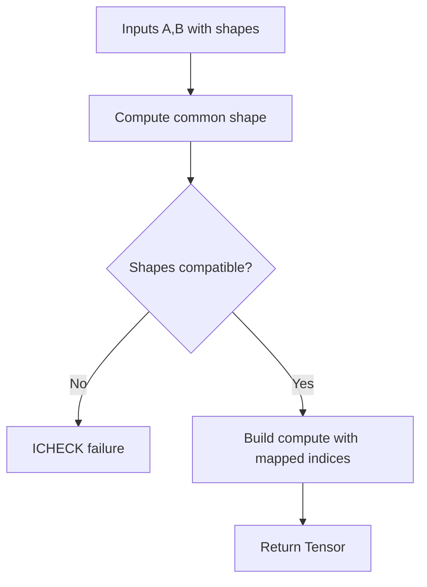
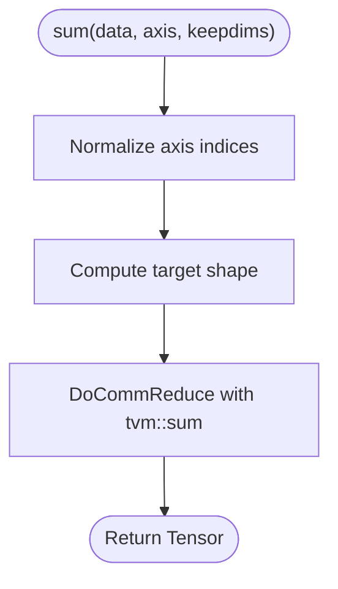
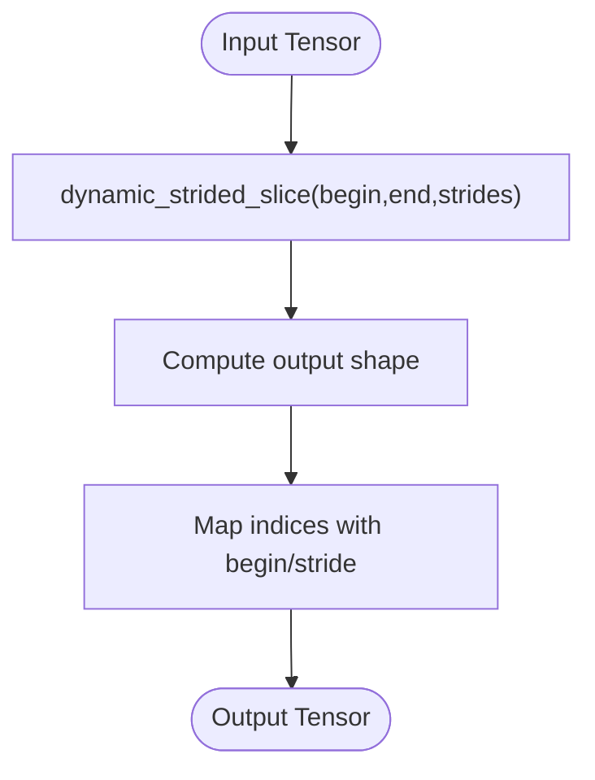
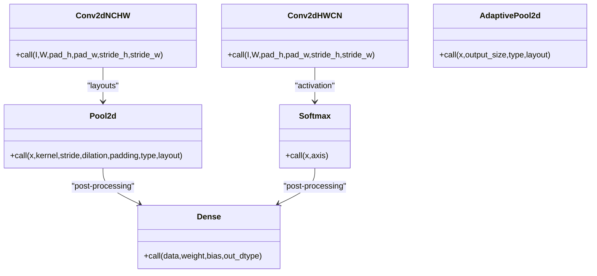
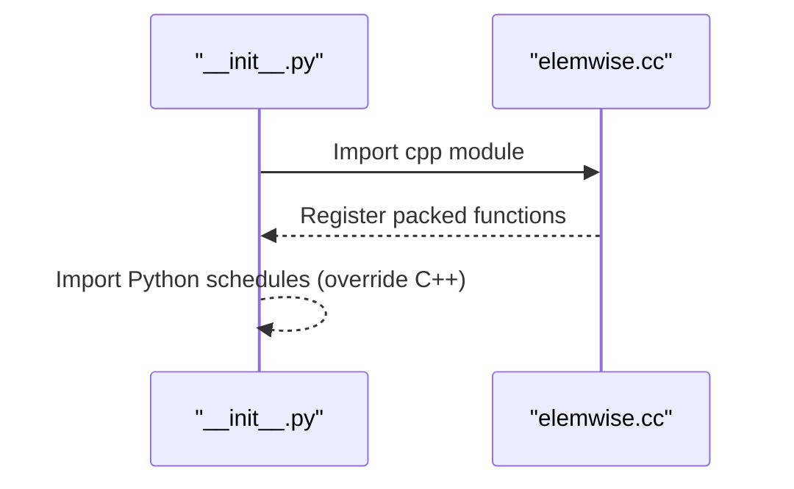
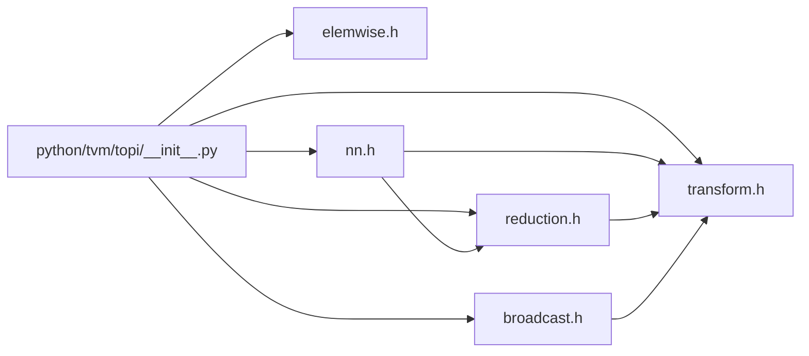

# TOP-I API

<cite>
**Referenced Files in This Document**
- [__init__.py](file://python/tvm/topi/__init__.py)
- [elemwise.h](file://include/tvm/topi/elemwise.h)
- [broadcast.h](file://include/tvm/topi/broadcast.h)
- [reduction.h](file://include/tvm/topi/reduction.h)
- [transform.h](file://include/tvm/topi/transform.h)
- [nn.h](file://include/tvm/topi/nn.h)
- [dense.h](file://include/tvm/topi/nn/dense.h)
- [softmax.h](file://include/tvm/topi/nn/softmax.h)
- [pooling.h](file://include/tvm/topi/nn/pooling.h)
- [elemwise.cc](file://src/topi/elemwise.cc)
- [topi_ewise_test.cc](file://tests/cpp/topi_ewise_test.cc)
</cite>

## Table of Contents
1. [Introduction](#introduction)
2. [Project Structure](#project-structure)
3. [Core Components](#core-components)
4. [Architecture Overview](#architecture-overview)
5. [Detailed Component Analysis](#detailed-component-analysis)
6. [Dependency Analysis](#dependency-analysis)
7. [Performance Considerations](#performance-considerations)
8. [Troubleshooting Guide](#troubleshooting-guide)
9. [Conclusion](#conclusion)
10. [Appendices](#appendices)

## Introduction
This document describes the TOP-I (Tensor Operations and Primitive Implementations) library within TVM. TOP-I provides a curated collection of operator constructors and schedule helpers for building efficient neural networks and numerical kernels. It exposes:
- Neural network operators (convolution, pooling, softmax, normalization, etc.)
- Mathematical primitives (elementwise unary/binary ops, fast approximations)
- Layout and shape transformations (reshape, transpose, slice, stack, concatenate)
- Reductions and reductions with indices (argmax/argmin)
- Broadcasting semantics and utilities

It also documents operator registration, implementation selection, hardware-specific optimizations, testing utilities, and integration patterns.

## Project Structure
TOP-I is organized into:
- Public C++ headers under include/tvm/topi/* exposing operator constructors and schedules
- Python bindings and registration under python/tvm/topi/*
- Implementation registrations under src/topi/*

**Diagram sources**
- [__init__.py:31-64](file://python/tvm/topi/__init__.py#L31-L64)
- [elemwise.h:42-491](file://include/tvm/topi/elemwise.h#L42-L491)
- [broadcast.h:72-497](file://include/tvm/topi/broadcast.h#L72-L497)
- [reduction.h:45-614](file://include/tvm/topi/reduction.h#L45-L614)
- [transform.h:59-800](file://include/tvm/topi/transform.h#L59-L800)
- [nn.h:44-725](file://include/tvm/topi/nn.h#L44-L725)
- [dense.h:38-82](file://include/tvm/topi/nn/dense.h#L38-L82)
- [softmax.h:40-151](file://include/tvm/topi/nn/softmax.h#L40-L151)
- [pooling.h:49-811](file://include/tvm/topi/nn/pooling.h#L49-L811)
- [elemwise.cc:34-122](file://src/topi/elemwise.cc#L34-L122)

**Section sources**
- [__init__.py:31-64](file://python/tvm/topi/__init__.py#L31-L64)

## Core Components
- Elementwise math: unary/binary ops, fast approximations (exp, erf, tanh), clipping, casting, full/fill_like, logical/bitwise not, sign, rsqrt, sum over tensors.
- Broadcasting: automatic broadcasting for binary ops and scalar ops with flexible overloads.
- Reductions: sum, prod, all, any, min, max, argmin, argmax, collapse_sum, with axis handling and squeeze semantics.
- Transformations: reshape, transpose, squeeze, expand_dims, concatenate, stack, split, strided_slice, sliding_window, space_to_batch_nd, batch_to_space_nd.
- Neural network: convolutions (NCHW/HWCN/NHWC variants), depthwise/group conv, pooling (max/avg, adaptive, global), softmax/log_softmax, normalization layers, padding, dense linear layer.

**Section sources**
- [elemwise.h:42-491](file://include/tvm/topi/elemwise.h#L42-L491)
- [broadcast.h:72-497](file://include/tvm/topi/broadcast.h#L72-L497)
- [reduction.h:45-614](file://include/tvm/topi/reduction.h#L45-L614)
- [transform.h:59-800](file://include/tvm/topi/transform.h#L59-L800)
- [nn.h:44-725](file://include/tvm/topi/nn.h#L44-L725)
- [dense.h:38-82](file://include/tvm/topi/nn/dense.h#L38-L82)
- [softmax.h:40-151](file://include/tvm/topi/nn/softmax.h#L40-L151)
- [pooling.h:49-811](file://include/tvm/topi/nn/pooling.h#L49-L811)

## Architecture Overview
TOP-I constructs TVM compute graphs using tvm::te::compute and tvm::te::reduce_axis. Operators are thin wrappers around TE compute expressions and often attach tags and attributes for downstream scheduling and lowering. Python bindings register packed functions for C++ implementations, enabling dynamic dispatch and runtime selection.

**Diagram sources**
- [elemwise.cc:34-122](file://src/topi/elemwise.cc#L34-L122)
- [elemwise.h:54-64](file://include/tvm/topi/elemwise.h#L54-L64)
- [nn.h:269-292](file://include/tvm/topi/nn.h#L269-L292)

## Detailed Component Analysis

### Elementwise Math
- Provides unary ops (exp, erf, sigmoid, sqrt, log, trig, inverse trig, isnan/isfinite/isinf), fast_tanh, fast_exp, fast_erf, identity, negative, logical_not, bitwise_not, sign, rsqrt, clip, cast, reinterpret, elemwise_sum, full, full_like.
- Fast approximations specialize for float-like dtypes and fall back otherwise.
- Broadcasting-aware via helper macros and wrappers.

**Diagram sources**
- [elemwise.h:438-446](file://include/tvm/topi/elemwise.h#L438-L446)

**Section sources**
- [elemwise.h:42-491](file://include/tvm/topi/elemwise.h#L42-L491)

### Broadcasting Semantics
- Binary ops support broadcasting with automatic shape inference and index mapping.
- Overloads exist for Tensor-Tensor, Tensor-Scalar, and Scalar-Tensor.
- Logical/bitwise ops and arithmetic ops are supported.

**Diagram sources**
- [broadcast.h:72-92](file://include/tvm/topi/broadcast.h#L72-L92)

**Section sources**
- [broadcast.h:72-497](file://include/tvm/topi/broadcast.h#L72-L497)

### Reductions
- Generic CommReduce and CommReduceIdx enable sum/product/min/max/all/any and argmin/argmax.
- Axis normalization handles negative indices and keepdims semantics.
- collapse_sum reduces multiple axes to a target shape efficiently.

**Diagram sources**
- [reduction.h:184-192](file://include/tvm/topi/reduction.h#L184-L192)

**Section sources**
- [reduction.h:45-614](file://include/tvm/topi/reduction.h#L45-L614)

### Transformations
- Shape and layout ops: reshape, transpose, squeeze, expand_dims, concatenate, stack, split, strided_slice, sliding_window.
- Index canonicalization helpers for dynamic strided_slice.
- Space-to-batch and batch-to-space via reshape/transpose combinations.

**Diagram sources**
- [transform.h:716-757](file://include/tvm/topi/transform.h#L716-L757)

**Section sources**
- [transform.h:59-800](file://include/tvm/topi/transform.h#L59-L800)

### Neural Network Operators
- Conv2d variants (NCHW/HWCN) with optional padding and stride.
- Depthwise and grouped convolutions.
- Pooling (max/avg) with support for arbitrary layouts, adaptive pooling, global pooling, and gradients.
- Softmax/log_softmax with numerically stable computation.
- Dense (fully connected) with optional bias and mixed precision casting.
- Normalization layers (layer_norm, group_norm, instance_norm, rms_norm).
- Padding and various utility transforms.

**Diagram sources**
- [nn.h:269-335](file://include/tvm/topi/nn.h#L269-L335)
- [pooling.h:750-761](file://include/tvm/topi/nn/pooling.h#L750-L761)
- [softmax.h:50-116](file://include/tvm/topi/nn/softmax.h#L50-L116)
- [dense.h:48-76](file://include/tvm/topi/nn/dense.h#L48-L76)

**Section sources**
- [nn.h:44-725](file://include/tvm/topi/nn.h#L44-L725)
- [dense.h:38-82](file://include/tvm/topi/nn/dense.h#L38-L82)
- [softmax.h:40-151](file://include/tvm/topi/nn/softmax.h#L40-L151)
- [pooling.h:49-811](file://include/tvm/topi/nn/pooling.h#L49-L811)

### Operator Registration and Selection
- Python module imports C++ schedules first, allowing Python overrides.
- C++ elemwise.cc registers packed functions for all elementwise ops, enabling runtime dispatch.
- Tags and attributes propagate through compute nodes to guide scheduling and lowering.

**Diagram sources**
- [__init__.py:31-34](file://python/tvm/topi/__init__.py#L31-L34)
- [elemwise.cc:34-122](file://src/topi/elemwise.cc#L34-L122)

**Section sources**
- [__init__.py:31-34](file://python/tvm/topi/__init__.py#L31-L34)
- [elemwise.cc:34-122](file://src/topi/elemwise.cc#L34-L122)

### Hardware-Specific Optimizations and Scheduling Attributes
- Many operators attach attributes (e.g., schedule_rule) to hint meta-schedule or backend-specific passes.
- Examples include adaptive_pool_max/avg, pool_max/avg schedule rules.
- Mixed precision casting in dense; numerically stable reductions in softmax.

**Section sources**
- [pooling.h:359-371](file://include/tvm/topi/nn/pooling.h#L359-L371)
- [pooling.h:587-601](file://include/tvm/topi/nn/pooling.h#L587-L601)
- [softmax.h:59-116](file://include/tvm/topi/nn/softmax.h#L59-L116)
- [dense.h:61-75](file://include/tvm/topi/nn/dense.h#L61-L75)

### Operator Testing Utilities and Benchmarks
- C++ tests validate elementwise ops and shapes.
- Python tests and integration tests exercise operator correctness and performance across targets.
- Benchmarks can leverage TVM’s measurement infrastructure and meta-schedule passes.

**Section sources**
- [topi_ewise_test.cc](file://tests/cpp/topi_ewise_test.cc)

### Practical Usage Patterns
- Building a simple conv+relu+pool pipeline:
  - Use conv2d_nchw with padding and stride
  - Apply relu
  - Apply pool2d (max or avg)
- Mixed precision dense layers:
  - Use dense with out_dtype for accumulation type
- Numerically stable softmax:
  - Use softmax with axis set to channel dimension

[No sources needed since this subsection provides usage patterns without quoting specific code]

## Dependency Analysis
- Python API aggregates all submodules and ensures C++ registrations are loaded before Python overrides.
- Operators depend on TE compute primitives and arithmetic analyzers for shape simplifications.
- Broadcasting depends on internal shape utilities and index mapping helpers.
- Neural ops depend on reductions and transforms.

**Diagram sources**
- [__init__.py:35-56](file://python/tvm/topi/__init__.py#L35-L56)
- [nn.h:32-34](file://include/tvm/topi/nn.h#L32-L34)

**Section sources**
- [__init__.py:35-56](file://python/tvm/topi/__init__.py#L35-L56)

## Performance Considerations
- Prefer fast approximations (fast_exp, fast_erf, fast_tanh) for float32 where accuracy allows.
- Use adaptive/global pooling to avoid fixed kernel sizing overhead.
- Leverage schedule_rule attributes to guide meta-schedule passes for pooling and adaptive pooling.
- Mixed precision dense matmul via out_dtype can improve throughput on supported backends.
- Use squeeze/expand_dims judiciously to minimize unnecessary copies.

[No sources needed since this section provides general guidance]

## Troubleshooting Guide
- Shape mismatches in broadcasting: ensure shapes are broadcast-compatible; check axis indices for negative values.
- Reduction axis errors: confirm axis normalization and keepdims semantics.
- Layout issues in pooling/conv: verify layout string and that H/W (or D/H/W) dimensions are not split.
- Runtime dispatch failures: ensure packed function names match registrations.

**Section sources**
- [broadcast.h:52-70](file://include/tvm/topi/broadcast.h#L52-L70)
- [reduction.h:65-86](file://include/tvm/topi/reduction.h#L65-L86)
- [pooling.h:294-305](file://include/tvm/topi/nn/pooling.h#L294-L305)

## Conclusion
TOP-I offers a comprehensive, composable set of operator constructors and schedule-friendly primitives. By leveraging broadcasting, reductions, transformations, and neural network primitives, developers can express models efficiently while benefiting from hardware-specific optimizations and robust testing utilities.

[No sources needed since this section summarizes without analyzing specific files]

## Appendices

### API Reference Highlights
- Elementwise: [elemwise.h:42-491](file://include/tvm/topi/elemwise.h#L42-L491)
- Broadcasting: [broadcast.h:72-497](file://include/tvm/topi/broadcast.h#L72-L497)
- Reductions: [reduction.h:45-614](file://include/tvm/topi/reduction.h#L45-L614)
- Transformations: [transform.h:59-800](file://include/tvm/topi/transform.h#L59-L800)
- Neural Networks: [nn.h:44-725](file://include/tvm/topi/nn.h#L44-L725), [dense.h:38-82](file://include/tvm/topi/nn/dense.h#L38-L82), [softmax.h:40-151](file://include/tvm/topi/nn/softmax.h#L40-L151), [pooling.h:49-811](file://include/tvm/topi/nn/pooling.h#L49-L811)
- Registration: [elemwise.cc:34-122](file://src/topi/elemwise.cc#L34-L122)