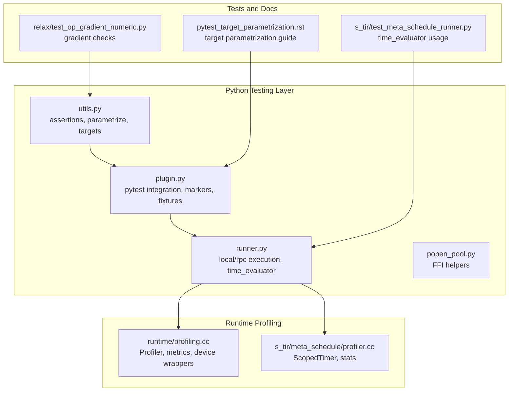
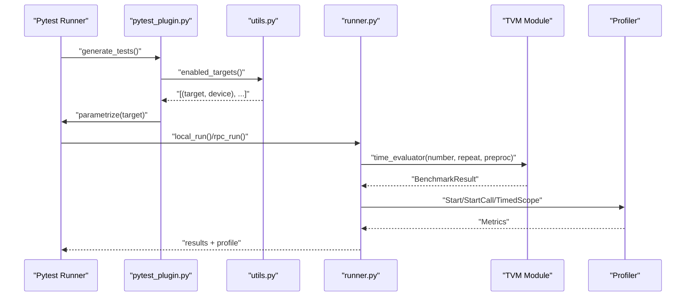
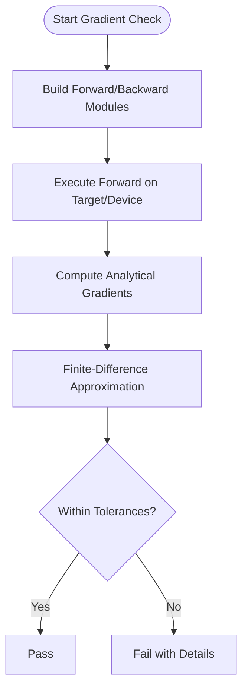
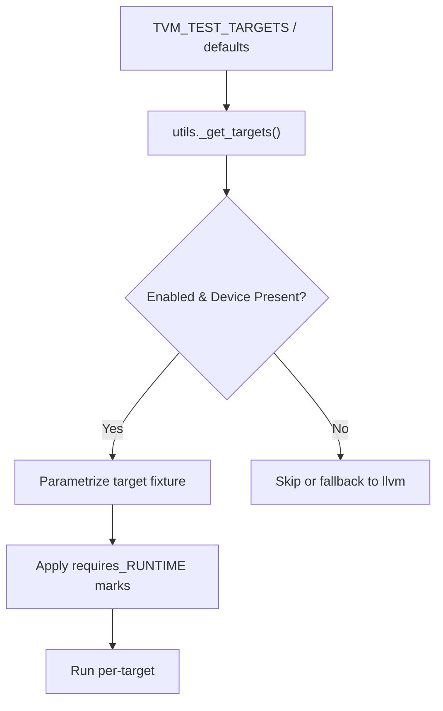
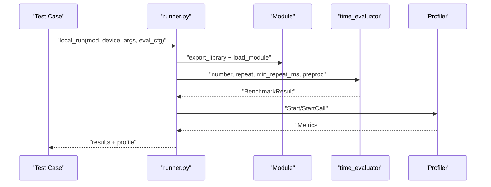
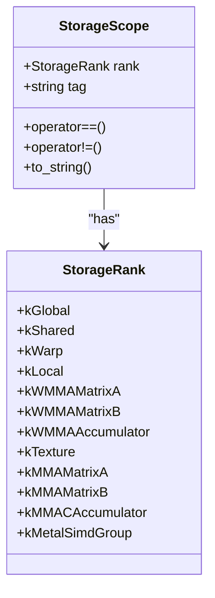
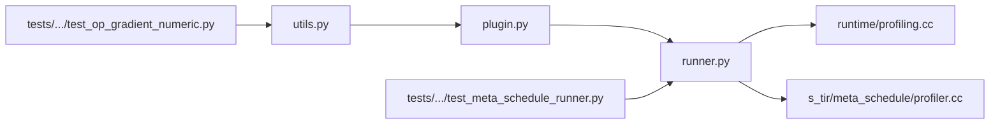

# Testing and Validation Utilities

<cite>
**Referenced Files in This Document**
- [python/tvm/testing/__init__.py](file://python/tvm/testing/__init__.py)
- [python/tvm/testing/utils.py](file://python/tvm/testing/utils.py)
- [python/tvm/testing/plugin.py](file://python/tvm/testing/plugin.py)
- [python/tvm/testing/runner.py](file://python/tvm/testing/runner.py)
- [python/tvm/testing/popen_pool.py](file://python/tvm/testing/popen_pool.py)
- [src/runtime/profiling.cc](file://src/runtime/profiling.cc)
- [src/s_tir/meta_schedule/profiler.cc](file://src/s_tir/meta_schedule/profiler.cc)
- [tests/python/relax/test_op_gradient_numeric.py](file://tests/python/relax/test_op_gradient_numeric.py)
- [tests/python/s_tir/meta_schedule/test_meta_schedule_runner.py](file://tests/python/s_tir/meta_schedule/test_meta_schedule_runner.py)
- [docs/how_to/dev/pytest_target_parametrization.rst](file://docs/how_to/dev/pytest_target_parametrization.rst)
- [src/runtime/thread_storage_scope.h](file://src/runtime/thread_storage_scope.h)
</cite>

## Table of Contents
1. [Introduction](#introduction)
2. [Project Structure](#project-structure)
3. [Core Components](#core-components)
4. [Architecture Overview](#architecture-overview)
5. [Detailed Component Analysis](#detailed-component-analysis)
6. [Dependency Analysis](#dependency-analysis)
7. [Performance Considerations](#performance-considerations)
8. [Troubleshooting Guide](#troubleshooting-guide)
9. [Conclusion](#conclusion)
10. [Appendices](#appendices)

## Introduction
This document describes the testing and validation utilities in TVM with a focus on:
- Operator testing frameworks for correctness and numerical accuracy
- Gradient checking procedures for automatic differentiation validation
- Performance benchmarking and profiling tools
- Test case generation, reference implementation comparisons, and regression testing strategies
- Examples for validating custom operators, performance profiling, and debugging numerical issues
- Testing patterns across hardware backends, memory usage validation, and correctness verification

## Project Structure
The testing infrastructure spans Python utilities, pytest plugins, and runtime/C++ profiling components:
- Python testing utilities provide parametrization, assertions, device targeting, and runner helpers
- Pytest plugin integrates target selection, device fixtures, and runtime markers
- Runtime profiling supports CPU/GPU metrics and scoped timers
- Meta-schedule profiling provides fine-grained timing for tuning loops
- Tests demonstrate gradient checks, evaluator usage, and correctness comparisons

**Diagram sources**
- [python/tvm/testing/utils.py:106-262](file://python/tvm/testing/utils.py#L106-L262)
- [python/tvm/testing/plugin.py:102-230](file://python/tvm/testing/plugin.py#L102-L230)
- [python/tvm/testing/runner.py:80-150](file://python/tvm/testing/runner.py#L80-L150)
- [src/runtime/profiling.cc:122-159](file://src/runtime/profiling.cc#L122-L159)
- [src/s_tir/meta_schedule/profiler.cc:82-125](file://src/s_tir/meta_schedule/profiler.cc#L82-L125)
- [tests/python/relax/test_op_gradient_numeric.py:34-205](file://tests/python/relax/test_op_gradient_numeric.py#L34-L205)
- [tests/python/s_tir/meta_schedule/test_meta_schedule_runner.py:851-879](file://tests/python/s_tir/meta_schedule/test_meta_schedule_runner.py#L851-L879)
- [docs/how_to/dev/pytest_target_parametrization.rst:18-194](file://docs/how_to/dev/pytest_target_parametrization.rst#L18-L194)

**Section sources**
- [python/tvm/testing/__init__.py:19-49](file://python/tvm/testing/__init__.py#L19-L49)
- [python/tvm/testing/utils.py:106-262](file://python/tvm/testing/utils.py#L106-L262)
- [python/tvm/testing/plugin.py:102-230](file://python/tvm/testing/plugin.py#L102-L230)
- [python/tvm/testing/runner.py:80-150](file://python/tvm/testing/runner.py#L80-L150)
- [src/runtime/profiling.cc:122-159](file://src/runtime/profiling.cc#L122-L159)
- [src/s_tir/meta_schedule/profiler.cc:82-125](file://src/s_tir/meta_schedule/profiler.cc#L82-L125)
- [tests/python/relax/test_op_gradient_numeric.py:34-205](file://tests/python/relax/test_op_gradient_numeric.py#L34-L205)
- [tests/python/s_tir/meta_schedule/test_meta_schedule_runner.py:851-879](file://tests/python/s_tir/meta_schedule/test_meta_schedule_runner.py#L851-L879)
- [docs/how_to/dev/pytest_target_parametrization.rst:18-194](file://docs/how_to/dev/pytest_target_parametrization.rst#L18-L194)

## Core Components
- Numerical assertion and gradient checking
  - [assert_allclose:106-118](file://python/tvm/testing/utils.py#L106-L118)
  - [check_numerical_grads:120-262](file://python/tvm/testing/utils.py#L120-L262)
- Target parametrization and device selection
  - [parametrize_targets:390-439](file://python/tvm/testing/utils.py#L390-L439)
  - [enabled_targets:496-517](file://python/tvm/testing/utils.py#L496-L517)
  - [device_enabled:456-494](file://python/tvm/testing/utils.py#L456-L494)
  - [DEFAULT_TEST_TARGETS:442-453](file://python/tvm/testing/utils.py#L442-L453)
- Pytest integration and fixtures
  - [pytest_generate_tests:82-92](file://python/tvm/testing/plugin.py#L82-L92)
  - [dev fixture:102-108](file://python/tvm/testing/plugin.py#L102-L108)
  - [target-to-requirement mapping:293-320](file://python/tvm/testing/plugin.py#L293-L320)
- Execution and benchmarking runners
  - [local_run:80-149](file://python/tvm/testing/runner.py#L80-L149)
  - [rpc_run:152-235](file://python/tvm/testing/runner.py#L152-L235)
- Runtime profiling
  - [Profiler::Start/StartCall:142-159](file://src/runtime/profiling.cc#L142-L159)
  - [ProfileFunction:785-800](file://src/runtime/profiling.cc#L785-L800)
- Scoped timers and statistics
  - [ProfilerTimedScope:82-94](file://src/s_tir/meta_schedule/profiler.cc#L82-L94)
  - [Profiler::TimedScope:96-96](file://src/s_tir/meta_schedule/profiler.cc#L96-L96)

**Section sources**
- [python/tvm/testing/utils.py:106-262](file://python/tvm/testing/utils.py#L106-L262)
- [python/tvm/testing/utils.py:390-517](file://python/tvm/testing/utils.py#L390-L517)
- [python/tvm/testing/plugin.py:82-108](file://python/tvm/testing/plugin.py#L82-L108)
- [python/tvm/testing/plugin.py:293-320](file://python/tvm/testing/plugin.py#L293-L320)
- [python/tvm/testing/runner.py:80-235](file://python/tvm/testing/runner.py#L80-L235)
- [src/runtime/profiling.cc:142-159](file://src/runtime/profiling.cc#L142-L159)
- [src/runtime/profiling.cc:785-800](file://src/runtime/profiling.cc#L785-L800)
- [src/s_tir/meta_schedule/profiler.cc:82-96](file://src/s_tir/meta_schedule/profiler.cc#L82-L96)

## Architecture Overview
The testing pipeline integrates pytest-driven parametrization, device selection, compilation, and execution with optional profiling.

**Diagram sources**
- [python/tvm/testing/plugin.py:82-108](file://python/tvm/testing/plugin.py#L82-L108)
- [python/tvm/testing/utils.py:496-517](file://python/tvm/testing/utils.py#L496-L517)
- [python/tvm/testing/runner.py:80-149](file://python/tvm/testing/runner.py#L80-L149)
- [src/runtime/profiling.cc:142-159](file://src/runtime/profiling.cc#L142-L159)
- [src/s_tir/meta_schedule/profiler.cc:82-94](file://src/s_tir/meta_schedule/profiler.cc#L82-L94)

## Detailed Component Analysis

### Numerical Accuracy and Gradient Checking
- Purpose: Validate numerical stability and correctness of operators via finite-difference gradients and shape/value comparisons.
- Key utilities:
  - [assert_allclose:106-118](file://python/tvm/testing/utils.py#L106-L118): Shape and value comparison with tolerances
  - [check_numerical_grads:120-262](file://python/tvm/testing/utils.py#L120-L262): Finite-difference gradient validation with adaptive stencil and error reporting
- Example usage:
  - [relax_check_gradients:34-205](file://tests/python/relax/test_op_gradient_numeric.py#L34-L205): Builds forward and backward modules, runs on target/device, and validates gradients
  - Unary/binary operator tests demonstrate typical invocation patterns

**Diagram sources**
- [tests/python/relax/test_op_gradient_numeric.py:34-205](file://tests/python/relax/test_op_gradient_numeric.py#L34-L205)
- [python/tvm/testing/utils.py:120-262](file://python/tvm/testing/utils.py#L120-L262)

**Section sources**
- [python/tvm/testing/utils.py:106-262](file://python/tvm/testing/utils.py#L106-L262)
- [tests/python/relax/test_op_gradient_numeric.py:34-205](file://tests/python/relax/test_op_gradient_numeric.py#L34-L205)

### Target Parametrization and Hardware Backends
- Purpose: Automatically run tests across enabled targets and devices, applying runtime markers and skipping unsupported configurations.
- Key utilities:
  - [parametrize_targets:390-439](file://python/tvm/testing/utils.py#L390-L439): Resolve targets respecting build/runtime availability
  - [enabled_targets:496-517](file://python/tvm/testing/utils.py#L496-L517): List of runnable targets and devices
  - [device_enabled:456-494](file://python/tvm/testing/utils.py#L456-L494): Quick check for a specific target
  - [DEFAULT_TEST_TARGETS:442-453](file://python/tvm/testing/utils.py#L442-L453): Default set of targets
  - [pytest integration:118-230](file://python/tvm/testing/plugin.py#L118-L230): Auto-parametrize and add runtime markers
- Guidance:
  - [Target parametrization guide:18-194](file://docs/how_to/dev/pytest_target_parametrization.rst#L18-L194)

**Diagram sources**
- [python/tvm/testing/utils.py:390-517](file://python/tvm/testing/utils.py#L390-L517)
- [python/tvm/testing/plugin.py:118-230](file://python/tvm/testing/plugin.py#L118-L230)
- [docs/how_to/dev/pytest_target_parametrization.rst:18-194](file://docs/how_to/dev/pytest_target_parametrization.rst#L18-L194)

**Section sources**
- [python/tvm/testing/utils.py:390-517](file://python/tvm/testing/utils.py#L390-L517)
- [python/tvm/testing/plugin.py:118-230](file://python/tvm/testing/plugin.py#L118-L230)
- [docs/how_to/dev/pytest_target_parametrization.rst:18-194](file://docs/how_to/dev/pytest_target_parametrization.rst#L18-L194)

### Performance Benchmarking and Profiling
- Local and RPC execution:
  - [local_run:80-149](file://python/tvm/testing/runner.py#L80-L149): Export module, upload args, time-evaluate, sync, and convert results
  - [rpc_run:152-235](file://python/tvm/testing/runner.py#L152-L235): Similar flow over RPC with server session
- Runtime profiling:
  - [Profiler::Start/StartCall:142-159](file://src/runtime/profiling.cc#L142-L159): Initialize and start per-device timers and collectors
  - [ProfileFunction:785-800](file://src/runtime/profiling.cc#L785-L800): Warmup, invoke function, and collect metrics
- Scoped profiling:
  - [ProfilerTimedScope:82-94](file://src/s_tir/meta_schedule/profiler.cc#L82-L94): Scoped timer for tuning loops
  - [Profiler::TimedScope:96-96](file://src/s_tir/meta_schedule/profiler.cc#L96-L96): Thread-local scoped timer

**Diagram sources**
- [python/tvm/testing/runner.py:80-149](file://python/tvm/testing/runner.py#L80-L149)
- [src/runtime/profiling.cc:142-159](file://src/runtime/profiling.cc#L142-L159)
- [src/runtime/profiling.cc:785-800](file://src/runtime/profiling.cc#L785-L800)
- [src/s_tir/meta_schedule/profiler.cc:82-94](file://src/s_tir/meta_schedule/profiler.cc#L82-L94)

**Section sources**
- [python/tvm/testing/runner.py:80-235](file://python/tvm/testing/runner.py#L80-L235)
- [src/runtime/profiling.cc:142-159](file://src/runtime/profiling.cc#L142-L159)
- [src/runtime/profiling.cc:785-800](file://src/runtime/profiling.cc#L785-L800)
- [src/s_tir/meta_schedule/profiler.cc:82-96](file://src/s_tir/meta_schedule/profiler.cc#L82-L96)

### Reference Implementation Comparisons and Regression Testing
- Pattern: Generate inputs, run baseline/reference implementation, run TVM implementation, compare outputs with [assert_allclose:106-118](file://python/tvm/testing/utils.py#L106-L118).
- Regression strategy: Keep a set of representative inputs and expected outputs; periodically re-run to catch drift.
- Memory safety: Use [local_run:80-149](file://python/tvm/testing/runner.py#L80-L149) to ensure device buffers are synchronized and cleaned up.

[No sources needed since this section provides general guidance]

### Debugging Numerical Issues
- Use [check_numerical_grads:120-262](file://python/tvm/testing/utils.py#L120-L262) to pinpoint mismatches between analytical and numerical gradients.
- Inspect shapes and magnitudes with [assert_allclose:106-118](file://python/tvm/testing/utils.py#L106-L118).
- For operator-specific failures, wrap with [relax_check_gradients:34-205](file://tests/python/relax/test_op_gradient_numeric.py#L34-L205) to isolate forward/backward behavior.

**Section sources**
- [python/tvm/testing/utils.py:106-262](file://python/tvm/testing/utils.py#L106-L262)
- [tests/python/relax/test_op_gradient_numeric.py:34-205](file://tests/python/relax/test_op_gradient_numeric.py#L34-L205)

### Memory Usage Validation
- Scope-based storage ranks define memory hierarchy and scoping semantics.
- Storage ranks include global, shared, local, warp, and specialized scopes (e.g., MMA/WMMAs, texture, SIMD groups).
- Use these semantics to reason about memory usage and correctness across backends.

**Diagram sources**
- [src/runtime/thread_storage_scope.h:42-132](file://src/runtime/thread_storage_scope.h#L42-L132)

**Section sources**
- [src/runtime/thread_storage_scope.h:42-132](file://src/runtime/thread_storage_scope.h#L42-L132)

## Dependency Analysis
- Parametrization depends on target availability and runtime markers
- Execution depends on device readiness and evaluator configuration
- Profiling depends on collectors and device wrappers

**Diagram sources**
- [python/tvm/testing/utils.py:390-517](file://python/tvm/testing/utils.py#L390-L517)
- [python/tvm/testing/plugin.py:118-230](file://python/tvm/testing/plugin.py#L118-L230)
- [python/tvm/testing/runner.py:80-149](file://python/tvm/testing/runner.py#L80-L149)
- [src/runtime/profiling.cc:142-159](file://src/runtime/profiling.cc#L142-L159)
- [src/s_tir/meta_schedule/profiler.cc:82-94](file://src/s_tir/meta_schedule/profiler.cc#L82-L94)
- [tests/python/relax/test_op_gradient_numeric.py:34-205](file://tests/python/relax/test_op_gradient_numeric.py#L34-L205)
- [tests/python/s_tir/meta_schedule/test_meta_schedule_runner.py:851-879](file://tests/python/s_tir/meta_schedule/test_meta_schedule_runner.py#L851-L879)

**Section sources**
- [python/tvm/testing/utils.py:390-517](file://python/tvm/testing/utils.py#L390-L517)
- [python/tvm/testing/plugin.py:118-230](file://python/tvm/testing/plugin.py#L118-L230)
- [python/tvm/testing/runner.py:80-149](file://python/tvm/testing/runner.py#L80-L149)
- [src/runtime/profiling.cc:142-159](file://src/runtime/profiling.cc#L142-L159)
- [src/s_tir/meta_schedule/profiler.cc:82-94](file://src/s_tir/meta_schedule/profiler.cc#L82-L94)
- [tests/python/relax/test_op_gradient_numeric.py:34-205](file://tests/python/relax/test_op_gradient_numeric.py#L34-L205)
- [tests/python/s_tir/meta_schedule/test_meta_schedule_runner.py:851-879](file://tests/python/s_tir/meta_schedule/test_meta_schedule_runner.py#L851-L879)

## Performance Considerations
- Prefer [local_run:80-149](file://python/tvm/testing/runner.py#L80-L149) for CPU-bound or when RPC overhead is unnecessary
- Use [rpc_run:152-235](file://python/tvm/testing/runner.py#L152-L235) for remote devices; ensure proper session cleanup
- Enable CPU cache flush pre-processing when measuring device kernels to minimize warm-cache effects
- Leverage scoped timers ([ProfilerTimedScope:82-94](file://src/s_tir/meta_schedule/profiler.cc#L82-L94)) for focused measurements

[No sources needed since this section provides general guidance]

## Troubleshooting Guide
- Gradient mismatch:
  - Use [check_numerical_grads:120-262](file://python/tvm/testing/utils.py#L120-L262) to identify offending positions and magnitudes
  - Verify shapes with [assert_allclose:106-118](file://python/tvm/testing/utils.py#L106-L118)
- Target not runnable:
  - Confirm availability with [device_enabled:456-494](file://python/tvm/testing/utils.py#L456-L494) and [enabled_targets:496-517](file://python/tvm/testing/utils.py#L496-L517)
  - Apply runtime markers via [pytest integration:293-320](file://python/tvm/testing/plugin.py#L293-L320)
- Profiling anomalies:
  - Ensure [Profiler::Start/StartCall:142-159](file://src/runtime/profiling.cc#L142-L159) is invoked before measurement
  - Use [ProfileFunction:785-800](file://src/runtime/profiling.cc#L785-L800) warmup to stabilize timings
- RPC execution issues:
  - Validate session connectivity and artifact cleanup in [rpc_run:152-235](file://python/tvm/testing/runner.py#L152-L235)

**Section sources**
- [python/tvm/testing/utils.py:106-262](file://python/tvm/testing/utils.py#L106-L262)
- [python/tvm/testing/utils.py:456-517](file://python/tvm/testing/utils.py#L456-L517)
- [python/tvm/testing/plugin.py:293-320](file://python/tvm/testing/plugin.py#L293-L320)
- [src/runtime/profiling.cc:142-159](file://src/runtime/profiling.cc#L142-L159)
- [src/runtime/profiling.cc:785-800](file://src/runtime/profiling.cc#L785-L800)
- [python/tvm/testing/runner.py:152-235](file://python/tvm/testing/runner.py#L152-L235)

## Conclusion
TVM’s testing and validation utilities provide a robust foundation for correctness, numerical accuracy, and performance across diverse hardware backends. By combining parametrized targets, gradient checks, execution runners, and profiling primitives, developers can systematically validate custom operators, debug numerical issues, and maintain regression coverage.

[No sources needed since this section summarizes without analyzing specific files]

## Appendices
- Example references:
  - [relax_check_gradients:34-205](file://tests/python/relax/test_op_gradient_numeric.py#L34-L205)
  - [local_run:80-149](file://python/tvm/testing/runner.py#L80-L149)
  - [rpc_run:152-235](file://python/tvm/testing/runner.py#L152-L235)
  - [check_numerical_grads:120-262](file://python/tvm/testing/utils.py#L120-L262)
  - [parametrize_targets:390-439](file://python/tvm/testing/utils.py#L390-L439)

[No sources needed since this section lists references without analyzing specific files]