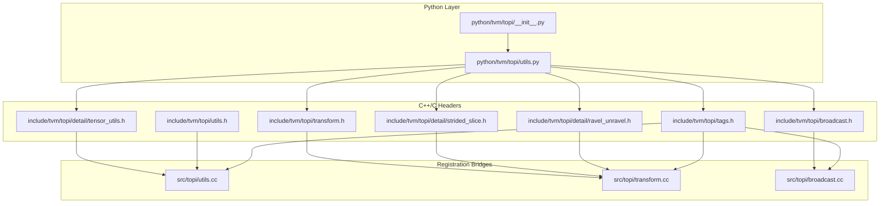
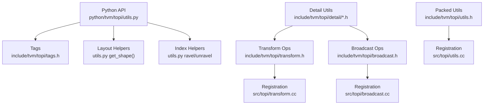
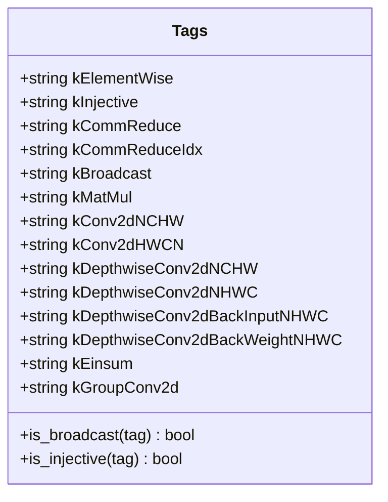
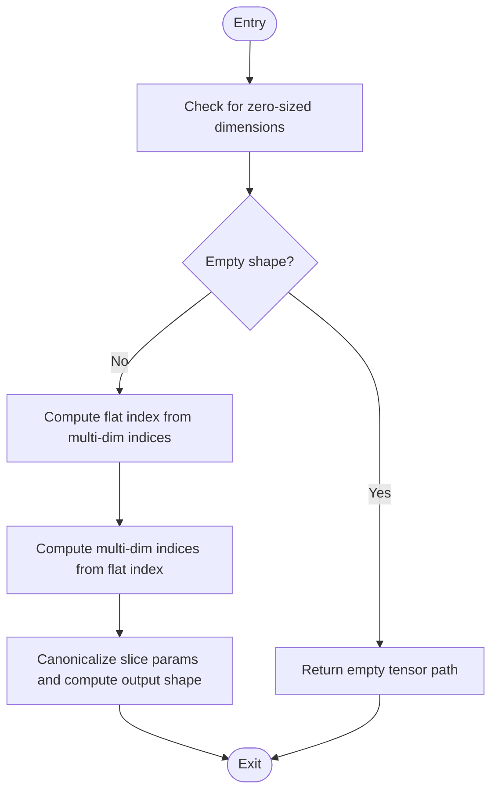
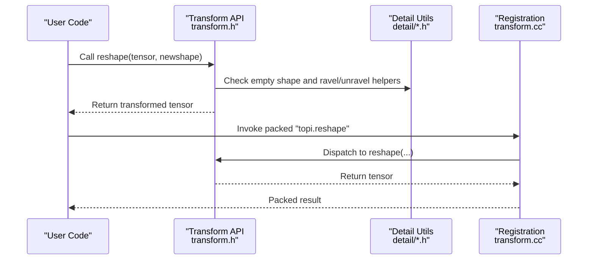
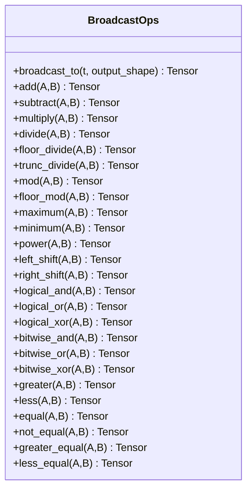
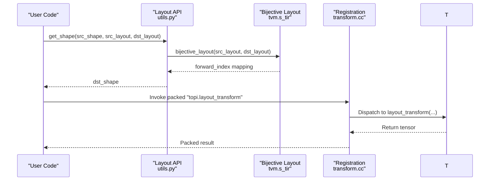
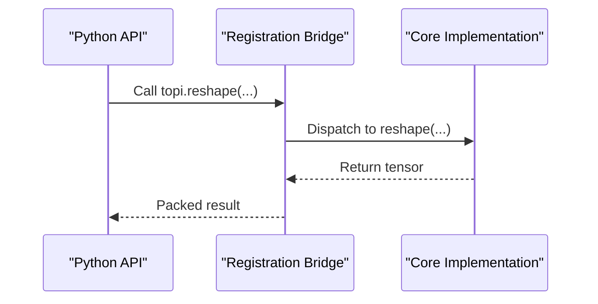
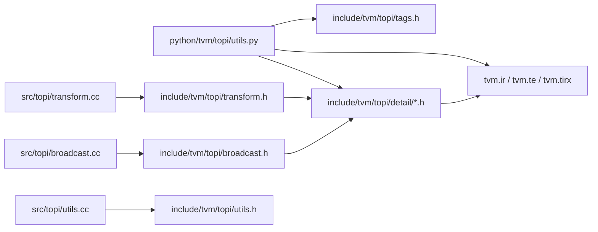

# Utilities and Helper Functions

<cite>
**Referenced Files in This Document**
- [__init__.py](file://python/tvm/topi/__init__.py)
- [utils.py](file://python/tvm/topi/utils.py)
- [utils.h](file://include/tvm/topi/utils.h)
- [utils.cc](file://src/topi/utils.cc)
- [tags.h](file://include/tvm/topi/tags.h)
- [transform.h](file://include/tvm/topi/transform.h)
- [transform.cc](file://src/topi/transform.cc)
- [broadcast.h](file://include/tvm/topi/broadcast.h)
- [broadcast.cc](file://src/topi/broadcast.cc)
- [tensor_utils.h](file://include/tvm/topi/detail/tensor_utils.h)
- [ravel_unravel.h](file://include/tvm/topi/detail/ravel_unravel.h)
- [strided_slice.h](file://include/tvm/topi/detail/strided_slice.h)
</cite>

## Table of Contents
1. [Introduction](#introduction)
2. [Project Structure](#project-structure)
3. [Core Components](#core-components)
4. [Architecture Overview](#architecture-overview)
5. [Detailed Component Analysis](#detailed-component-analysis)
6. [Dependency Analysis](#dependency-analysis)
7. [Performance Considerations](#performance-considerations)
8. [Troubleshooting Guide](#troubleshooting-guide)
9. [Conclusion](#conclusion)

## Introduction
This document explains the TOP-I (TOPI) utility functions and helper components that enable shape manipulation, tensor transformations, operator tagging, and generic operation implementations. It focuses on:
- Shape and layout conversion helpers
- Dimension handling and common tensor manipulation patterns
- Operator tagging mechanisms and their roles in scheduling
- Generic operation implementations for transforms and broadcasts
- Practical guidance for implementing custom operators and integrating with the broader TVM ecosystem

## Project Structure
TOP-I utilities are organized into Python APIs and C++/C headers with registration bridges:
- Python layer exposes convenience functions, shape inference, and scheduling helpers
- C++/C headers define low-level tensor operations and detail utilities
- Registration bridges bind Python-friendly APIs to packed functions for downstream consumers

**Diagram sources**
- [__init__.py:35-56](file://python/tvm/topi/__init__.py#L35-L56)
- [utils.py:1-546](file://python/tvm/topi/utils.py#L1-L546)
- [tags.h:24-59](file://include/tvm/topi/tags.h#L24-L59)
- [utils.h:24-51](file://include/tvm/topi/utils.h#L24-L51)
- [tensor_utils.h:24-148](file://include/tvm/topi/detail/tensor_utils.h#L24-L148)
- [ravel_unravel.h:24-84](file://include/tvm/topi/detail/ravel_unravel.h#L24-L84)
- [strided_slice.h:24-155](file://include/tvm/topi/detail/strided_slice.h#L24-L155)
- [transform.h:24-52](file://include/tvm/topi/transform.h#L24-L52)
- [broadcast.h:24-497](file://include/tvm/topi/broadcast.h#L24-L497)
- [utils.cc:24-53](file://src/topi/utils.cc#L24-L53)
- [transform.cc:24-280](file://src/topi/transform.cc#L24-L280)
- [broadcast.cc:24-87](file://src/topi/broadcast.cc#L24-L87)

**Section sources**
- [__init__.py:19-65](file://python/tvm/topi/__init__.py#L19-L65)
- [utils.py:1-546](file://python/tvm/topi/utils.py#L1-L546)

## Core Components
- Operator tagging constants and predicates define semantics for scheduling and pass infra:
  - Tags include elementwise, injective, broadcast, matmul, convolutions, and einsum
  - Predicates classify tags as broadcast or injective for automated scheduling decisions
- Shape and layout utilities:
  - Empty-shape detection, ravel/unravel index helpers, strided-slice canonicalization
  - Layout shape inference via bijective layout mapping
- Transform operations:
  - Expand dims, transpose, reshape, squeeze, concatenate, stack, split, sliding window
  - Dynamic strided slice with axis-specific begin/end/stride handling
  - Index canonicalization helpers for static/dynamic cases
- Broadcast operations:
  - Auto-broadcasting elementwise ops with tensor/scalar variants
  - Broadcast-to with shape compatibility checks
- Packed-function registration:
  - Bridges Python APIs to C++ implementations for transforms, broadcasts, and sampling utilities

**Section sources**
- [tags.h:24-59](file://include/tvm/topi/tags.h#L24-L59)
- [utils.h:24-51](file://include/tvm/topi/utils.h#L24-L51)
- [tensor_utils.h:24-148](file://include/tvm/topi/detail/tensor_utils.h#L24-L148)
- [ravel_unravel.h:24-84](file://include/tvm/topi/detail/ravel_unravel.h#L24-L84)
- [strided_slice.h:24-155](file://include/tvm/topi/detail/strided_slice.h#L24-L155)
- [transform.h:53-800](file://include/tvm/topi/transform.h#L53-L800)
- [broadcast.h:24-497](file://include/tvm/topi/broadcast.h#L24-L497)
- [utils.cc:24-53](file://src/topi/utils.cc#L24-L53)
- [transform.cc:24-280](file://src/topi/transform.cc#L24-L280)
- [broadcast.cc:24-87](file://src/topi/broadcast.cc#L24-L87)

## Architecture Overview
The TOP-I utilities follow a layered architecture:
- Python layer provides ergonomic APIs and integrates with TVM’s scheduling and IR
- C++/C headers implement core operations and expose detail utilities
- Registration bridges register packed functions for dynamic dispatch
- Tagging system informs scheduling passes and fusion heuristics

**Diagram sources**
- [utils.py:1-546](file://python/tvm/topi/utils.py#L1-L546)
- [tags.h:24-59](file://include/tvm/topi/tags.h#L24-L59)
- [transform.h:53-800](file://include/tvm/topi/transform.h#L53-L800)
- [broadcast.h:24-497](file://include/tvm/topi/broadcast.h#L24-L497)
- [tensor_utils.h:24-148](file://include/tvm/topi/detail/tensor_utils.h#L24-L148)
- [ravel_unravel.h:24-84](file://include/tvm/topi/detail/ravel_unravel.h#L24-L84)
- [strided_slice.h:24-155](file://include/tvm/topi/detail/strided_slice.h#L24-L155)
- [utils.h:24-51](file://include/tvm/topi/utils.h#L24-L51)
- [transform.cc:24-280](file://src/topi/transform.cc#L24-L280)
- [broadcast.cc:24-87](file://src/topi/broadcast.cc#L24-L87)
- [utils.cc:24-53](file://src/topi/utils.cc#L24-L53)

## Detailed Component Analysis

### Operator Tagging Mechanisms
- Purpose: Provide semantic tags for operations to guide scheduling and fusion
- Constants: Elementwise, injective, broadcast, matmul, convolutions, einsum
- Predicates: is_broadcast and is_injective classify tags for pass decisions
- Usage: Many transform and broadcast functions accept a tag parameter and default to appropriate tags

**Diagram sources**
- [tags.h:24-59](file://include/tvm/topi/tags.h#L24-L59)

**Section sources**
- [tags.h:24-59](file://include/tvm/topi/tags.h#L24-L59)

### Shape Manipulation Utilities
- Empty shape detection: Determines if any dimension is zero-sized
- Ravel/unravel index helpers: Convert between multi-dimensional indices and flat indices
- Strided slice canonicalization: Normalize begin/end/stride and compute output shapes for static/dynamic slices
- Layout shape inference: Given source and destination layouts, infer destination shape using bijective mapping

**Diagram sources**
- [tensor_utils.h:43-54](file://include/tvm/topi/detail/tensor_utils.h#L43-L54)
- [ravel_unravel.h:45-78](file://include/tvm/topi/detail/ravel_unravel.h#L45-L78)
- [strided_slice.h:91-149](file://include/tvm/topi/detail/strided_slice.h#L91-L149)

**Section sources**
- [utils.h:35-47](file://include/tvm/topi/utils.h#L35-L47)
- [tensor_utils.h:43-148](file://include/tvm/topi/detail/tensor_utils.h#L43-L148)
- [ravel_unravel.h:45-78](file://include/tvm/topi/detail/ravel_unravel.h#L45-L78)
- [strided_slice.h:91-149](file://include/tvm/topi/detail/strided_slice.h#L91-L149)
- [utils.py:510-524](file://python/tvm/topi/utils.py#L510-L524)
- [utils.py:406-440](file://python/tvm/topi/utils.py#L406-L440)

### Tensor Transformation Helpers
- Expand dims: Insert new axes of length 1 at a given axis
- Transpose: Permute dimensions with optional axis list
- Reshape: Change shape using ravel/unravel index mapping
- Squeeze: Remove axes of length 1 with optional at-least-1D enforcement
- Concatenate/Stack: Join tensors along existing/new axes
- Split: Partition along an axis at given indices
- Sliding window: Create windows over specified axes with strides
- Dynamic strided slice: Support mixed static/dynamic begin/end/stride and axis selection

**Diagram sources**
- [transform.h:330-354](file://include/tvm/topi/transform.h#L330-L354)
- [transform.cc:64-67](file://src/topi/transform.cc#L64-L67)
- [ravel_unravel.h:45-78](file://include/tvm/topi/detail/ravel_unravel.h#L45-L78)
- [tensor_utils.h:43-54](file://include/tvm/topi/detail/tensor_utils.h#L43-L54)

**Section sources**
- [transform.h:156-192](file://include/tvm/topi/transform.h#L156-L192)
- [transform.h:205-249](file://include/tvm/topi/transform.h#L205-L249)
- [transform.h:330-354](file://include/tvm/topi/transform.h#L330-L354)
- [transform.h:415-469](file://include/tvm/topi/transform.h#L415-L469)
- [transform.h:481-529](file://include/tvm/topi/transform.h#L481-L529)
- [transform.h:541-573](file://include/tvm/topi/transform.h#L541-L573)
- [transform.h:587-650](file://include/tvm/topi/transform.h#L587-L650)
- [transform.h:716-757](file://include/tvm/topi/transform.h#L716-L757)
- [transform.cc:64-104](file://src/topi/transform.cc#L64-L104)

### Broadcast Operations and Generic Elementwise Patterns
- Broadcast-to: Expand a tensor to a compatible shape using shape compatibility rules
- Auto-broadcasting elementwise ops: Add, subtract, multiply, divide, logical/bitwise comparisons, shifts, power, mod/floordiv/trunc_div, maximum/minimum, log_add_exp
- Overloads support tensor-tensor, tensor-scalar, and scalar-tensor variants

**Diagram sources**
- [broadcast.h:48-70](file://include/tvm/topi/broadcast.h#L48-L70)
- [broadcast.h:116-491](file://include/tvm/topi/broadcast.h#L116-L491)

**Section sources**
- [broadcast.h:48-70](file://include/tvm/topi/broadcast.h#L48-L70)
- [broadcast.h:116-491](file://include/tvm/topi/broadcast.h#L116-L491)
- [broadcast.cc:50-83](file://src/topi/broadcast.cc#L50-L83)

### Layout Conversions and Dimension Handling
- Layout shape inference: Given source and destination layouts, compute destination shape using bijective mapping
- Index canonicalization: Normalize indices for strided slices and dynamic indexing
- Dynamic shape detection: Identify dynamic sizes for scheduling and shape inference

**Diagram sources**
- [utils.py:406-440](file://python/tvm/topi/utils.py#L406-L440)
- [transform.cc:105-110](file://src/topi/transform.cc#L105-L110)

**Section sources**
- [utils.py:406-440](file://python/tvm/topi/utils.py#L406-L440)
- [utils.py:543-546](file://python/tvm/topi/utils.py#L543-L546)
- [transform.cc:105-110](file://src/topi/transform.cc#L105-L110)

### Packed Function Registration and Integration
- Registration bridges expose TOP-I functions as packed functions for dynamic invocation
- Examples include expand_dims, transpose, reshape, squeeze, concatenate, stack, strided slice, take, matmul, tensordot, and layout transform
- These bridges ensure Python APIs integrate seamlessly with downstream consumers and JIT compilation

**Diagram sources**
- [transform.cc:40-280](file://src/topi/transform.cc#L40-L280)
- [broadcast.cc:50-87](file://src/topi/broadcast.cc#L50-L87)
- [utils.cc:31-53](file://src/topi/utils.cc#L31-L53)

**Section sources**
- [transform.cc:40-280](file://src/topi/transform.cc#L40-L280)
- [broadcast.cc:50-87](file://src/topi/broadcast.cc#L50-L87)
- [utils.cc:31-53](file://src/topi/utils.cc#L31-L53)

## Dependency Analysis
- Python layer depends on TVM IR and scheduling primitives; it also imports C++ utilities via the cpp module
- C++ headers depend on TVM TE, TIRX, and S-TIR layout utilities
- Registration bridges depend on reflection registry and packed function dispatch
- Tagging system is consumed by transforms and broadcasts to annotate operations

**Diagram sources**
- [utils.py:20-31](file://python/tvm/topi/utils.py#L20-L31)
- [tags.h:24-59](file://include/tvm/topi/tags.h#L24-L59)
- [transform.h:27-52](file://include/tvm/topi/transform.h#L27-L52)
- [broadcast.h:27-30](file://include/tvm/topi/broadcast.h#L27-L30)
- [transform.cc:24-33](file://src/topi/transform.cc#L24-L33)
- [broadcast.cc:24-28](file://src/topi/broadcast.cc#L24-L28)
- [utils.cc:24-29](file://src/topi/utils.cc#L24-L29)

**Section sources**
- [utils.py:20-31](file://python/tvm/topi/utils.py#L20-L31)
- [transform.h:27-52](file://include/tvm/topi/transform.h#L27-L52)
- [broadcast.h:27-30](file://include/tvm/topi/broadcast.h#L27-L30)
- [transform.cc:24-33](file://src/topi/transform.cc#L24-L33)
- [broadcast.cc:24-28](file://src/topi/broadcast.cc#L24-L28)
- [utils.cc:24-29](file://src/topi/utils.cc#L24-L29)

## Performance Considerations
- Prefer injective and broadcast tags for operations that map directly to elementwise or broadcasting patterns to enable efficient scheduling and fusion
- Use canonicalized indices and static shape checks where possible to reduce dynamic overhead
- Leverage layout-aware transformations and shape inference to avoid unnecessary copies and promote contiguous memory access
- Utilize packed-function registration to minimize Python overhead during JIT compilation and runtime dispatch

## Troubleshooting Guide
- Invalid shape errors: Some functions raise exceptions for incompatible shapes or unsupported configurations; validate inputs and ensure shapes meet operator requirements
- Dynamic vs static indexing: When mixing static and dynamic indices, ensure canonicalization and output shape computation are handled consistently
- Layout mismatches: When inferring destination shapes, ensure source and destination layouts are compatible and bijectively mappable

**Section sources**
- [utils.py:33-35](file://python/tvm/topi/utils.py#L33-L35)
- [strided_slice.h:119-149](file://include/tvm/topi/detail/strided_slice.h#L119-L149)
- [utils.py:434-439](file://python/tvm/topi/utils.py#L434-L439)

## Conclusion
TOP-I utilities provide a cohesive toolkit for shape manipulation, tensor transformations, operator tagging, and generic operation implementations. By leveraging tagging semantics, layout-aware helpers, and packed-function registration, developers can implement custom operators efficiently and integrate them into the broader TVM ecosystem. Following best practices for code reuse, dimension handling, and performance optimization ensures robust and maintainable operator development.