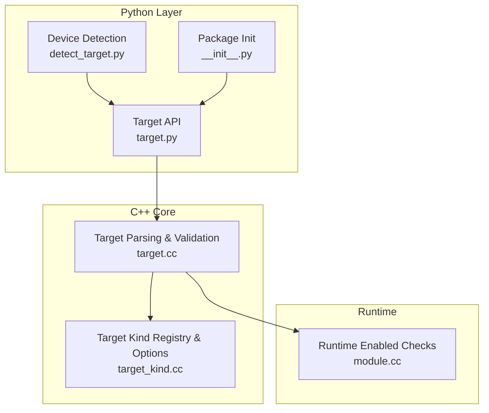
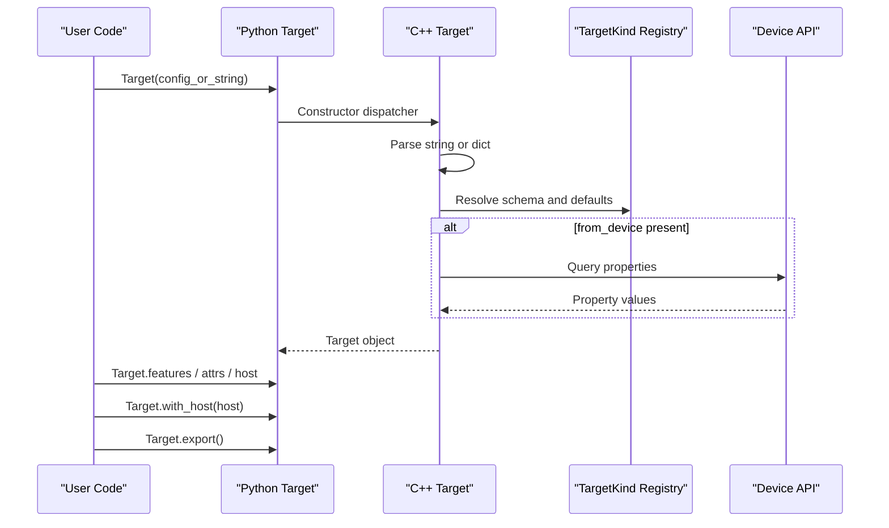
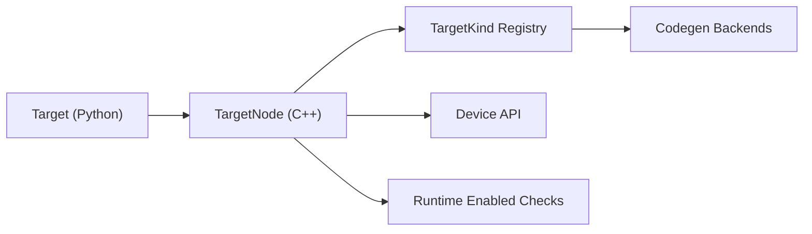

# Target API

<cite>
**Referenced Files in This Document**
- [target.py](file://python/tvm/target/target.py)
- [detect_target.py](file://python/tvm/target/detect_target.py)
- [target.cc](file://src/target/target.cc)
- [target_kind.cc](file://src/target/target_kind.cc)
- [module.cc](file://src/runtime/module.cc)
- [codegen.rst](file://docs/arch/codegen.rst)
- [device_target_interactions.rst](file://docs/arch/device_target_interactions.rst)
- [cross_compilation_and_rpc.py](file://docs/how_to/tutorials/cross_compilation_and_rpc.py)
- [__init__.py](file://python/tvm/target/__init__.py)
- [test_target_codegen.py](file://tests/python/codegen/test_target_codegen.py)
- [target_test.cc](file://tests/cpp/target_test.cc)
</cite>

## Table of Contents
1. [Introduction](#introduction)
2. [Project Structure](#project-structure)
3. [Core Components](#core-components)
4. [Architecture Overview](#architecture-overview)
5. [Detailed Component Analysis](#detailed-component-analysis)
6. [Dependency Analysis](#dependency-analysis)
7. [Performance Considerations](#performance-considerations)
8. [Troubleshooting Guide](#troubleshooting-guide)
9. [Conclusion](#conclusion)
10. [Appendices](#appendices)

## Introduction
This document provides comprehensive API documentation for TVM’s target configuration system. It explains the Target class, target string parsing, and hardware backend selection. It covers target construction methods, target properties, and target-specific configuration options. It documents supported hardware backends (CUDA, ROCm, OpenCL, Metal, Vulkan, etc.), their configuration parameters, and how to use them for target-based compilation. It also addresses target validation, capability detection, cross-compilation scenarios, target inheritance (host), target merging, and dynamic target configuration for flexible deployment strategies.

## Project Structure
The target configuration system spans Python and C++ layers:
- Python API surface for constructing and querying targets
- C++ core for target parsing, validation, canonicalization, and device property queries
- Backend registration and code generation bindings
- Runtime checks for device availability

**Diagram sources**
- [target.py:51-233](file://python/tvm/target/target.py#L51-L233)
- [detect_target.py:109-147](file://python/tvm/target/detect_target.py#L109-L147)
- [target.cc:254-423](file://src/target/target.cc#L254-L423)
- [target_kind.cc:301-506](file://src/target/target_kind.cc#L301-L506)
- [module.cc:38-69](file://src/runtime/module.cc#L38-L69)

**Section sources**
- [__init__.py:18-32](file://python/tvm/target/__init__.py#L18-L32)
- [target.py:51-233](file://python/tvm/target/target.py#L51-L233)
- [target.cc:254-423](file://src/target/target.cc#L254-L423)
- [target_kind.cc:301-506](file://src/target/target_kind.cc#L301-L506)
- [module.cc:38-69](file://src/runtime/module.cc#L38-L69)

## Core Components
- Target: The primary object representing a compilation target and its configuration. It supports construction from strings, dictionaries, tags, and device detection, and exposes properties and methods for querying and scoping.
- TargetKind: Represents a target kind (e.g., llvm, cuda, rocm) and its schema of configurable options.
- TargetFeatures: Provides access to feature flags stored under “feature.” keys.
- Device detection helpers: Automatically infer target configuration from a live device.

Key capabilities:
- Construct targets from JSON-like configuration, tag names, or device descriptors
- Query target options and attributes
- Enter/exit target scopes
- Export targets to canonical configuration
- Attach a host target for cross-compilation
- Detect target from device runtime

**Section sources**
- [target.py:51-233](file://python/tvm/target/target.py#L51-L233)
- [detect_target.py:109-147](file://python/tvm/target/detect_target.py#L109-L147)

## Architecture Overview
The target system is composed of:
- Python Target API that wraps C++ constructors and methods
- C++ TargetNode that parses, validates, and canonicalizes configurations
- TargetKind registry that defines options and defaults per target kind
- Device APIs to query runtime properties for dynamic configuration
- Runtime module checks to validate device availability

**Diagram sources**
- [target.py:78-145](file://python/tvm/target/target.py#L78-L145)
- [target.cc:254-423](file://src/target/target.cc#L254-L423)
- [target_kind.cc:67-78](file://src/target/target_kind.cc#L67-L78)
- [module.cc:38-69](file://src/runtime/module.cc#L38-L69)

## Detailed Component Analysis

### Target Class
The Target class encapsulates target configuration and provides:
- Construction from:
  - Dictionary or JSON string
  - Tag name or tag with overrides
  - Bare kind name (e.g., “cuda”, “llvm”)
  - Device detection
- Scope management via context enter/exit
- Host target attachment for cross-compilation
- Export to canonical configuration
- Access to target kind attributes and features

Important attributes exposed via Python:
- attrs: Access to target attributes (e.g., arch, max_num_threads, mcpu)
- features: Access to feature flags under “feature.” keys
- kind: TargetKind reference
- host: Optional host Target for cross-compilation

Methods:
- Target(target, host=None): Construct from string/dict/tag or attach host
- Target.from_device(device): Detect target from a device
- Target.current(allow_none): Get current target in scope
- Target.list_kinds(): List available target kinds
- Target.target_or_current(target): Resolve target or current
- Target.export(): Export to canonical configuration
- Target.with_host(host): Return a new Target with host attached
- Target.get_kind_attr(attr_name): Query target kind attributes
- Target.get_target_device_type(): Device type for this target

Validation and parsing:
- Accepts tag, kind, keys, device, libs, system-lib, mcpu, model, runtime, mtriple, mattr, mfloat-abi, mabi, host, and other backend-specific attributes
- Rejects CLI-style target strings; requires JSON dict form for complex configurations

Cross-compilation:
- Host target can be attached; exported configuration preserves nested host

Dynamic configuration:
- from_device parameter allows querying device properties during target construction

**Section sources**
- [target.py:51-233](file://python/tvm/target/target.py#L51-L233)
- [target.cc:110-176](file://src/target/target.cc#L110-L176)
- [target.cc:254-423](file://src/target/target.cc#L254-L423)

### TargetKind and Options
TargetKind defines:
- Default device type per target kind
- Schema of configurable options (add_attr_option)
- Default keys (e.g., “cuda”, “gpu”) used for dispatch
- Target canonicalizers for dynamic attribute updates

Supported target kinds and representative options:
- llvm: mattr, mcpu, mtriple, mfloat-abi, mabi, fast-math family, opt-level, cl-opt, jit, vector-width
- c: mcpu, march, workspace-byte-alignment, constants-byte-alignment
- cuda: mcpu, arch, max_shared_memory_per_block, max_threads_per_block, thread_warp_size, registers_per_block, l2_cache_size_bytes, max_num_threads
- nvptx: mcpu, mtriple, max_num_threads, thread_warp_size
- rocm: mcpu, mtriple, mattr, max_num_threads, max_threads_per_block, max_shared_memory_per_block, thread_warp_size
- opencl: max_threads_per_block, max_shared_memory_per_block, max_num_threads, thread_warp_size, texture_spatial_limit, texture_depth_limit, max_function_args, image_base_address_alignment
- metal: max_num_threads, max_threads_per_block, max_shared_memory_per_block, thread_warp_size, max_function_args
- vulkan: supports_* flags, physical limits, device properties, thread_warp_size, max_num_threads, max_threads_per_block
- webgpu: supports_subgroups, thread_warp_size
- hexagon: mattr, mcpu, mtriple, llvm-options, num-cores, vtcm-capacity
- composite: devices array supporting heterogeneous targets
- ext_dev: external device kind
- test: internal test kind

TargetKind options can be listed programmatically and used to validate user-provided configurations.

**Section sources**
- [target_kind.cc:301-506](file://src/target/target_kind.cc#L301-L506)
- [target_kind.cc:67-78](file://src/target/target_kind.cc#L67-L78)

### Device Detection and Capability Queries
Device detection infers target configuration from a live device:
- Supported devices: cpu, cuda, metal, rocm, opencl, vulkan
- Uses runtime device APIs to query properties (e.g., warp size, shared memory limits)
- Validates device existence and driver availability

Capability queries:
- TargetGetFeature: Access feature flags stored under “feature.” keys
- TargetGetDeviceType: Device type for target
- RuntimeEnabled checks: Validates whether a runtime backend is present

**Section sources**
- [detect_target.py:109-147](file://python/tvm/target/detect_target.py#L109-L147)
- [target.cc:472-484](file://src/target/target.cc#L472-L484)
- [module.cc:38-69](file://src/runtime/module.cc#L38-L69)

### Target String Parsing and Validation
Parsing pipeline:
- If the input is a tag, resolve it and merge overrides
- If the input is a JSON string, parse and validate
- Otherwise treat as bare kind name (rejects CLI-style strings)
- Validate against TargetKind schema, apply defaults, and run canonicalizers
- Preserve feature.* keys across round-trips
- Optionally query device properties for missing attributes

Errors:
- Unknown target kind
- Type mismatches
- Unknown non-feature keys
- Unsupported CLI-style target strings

**Section sources**
- [target.cc:254-423](file://src/target/target.cc#L254-L423)
- [target_test.cc:106-149](file://tests/cpp/target_test.cc#L106-L149)
- [target_test.cc:151-170](file://tests/cpp/target_test.cc#L151-L170)

### Target-Based Compilation and Backends
Backends and their code generators:
- llvm → CodeGenCPU (machine code)
- cuda → CodeGenCUDA (PTX/cubin)
- rocm → CodeGenAMDGPU (AMDGPU ISA)
- nvptx → CodeGenNVPTX (PTX)
- metal → CodeGenMetal (Metal Shading Language)
- opencl → CodeGenOpenCL (OpenCL C)
- vulkan → CodeGenSPIRV (SPIR-V)
- webgpu → CodeGenWebGPU (WGSL)
- c → CodeGenCHost (C source)

These bindings are registered via FFI and invoked during compilation.

**Section sources**
- [codegen.rst:88-114](file://docs/arch/codegen.rst#L88-L114)

### Practical Examples

- Creating targets from tag and overrides
  - Example: Target with tag and attribute overrides
  - Path: [target.py:68-76](file://python/tvm/target/target.py#L68-L76)

- Creating targets from JSON configuration
  - Example: CUDA target with arch and limits
  - Path: [test_target_codegen.py:39-41](file://tests/python/codegen/test_target_codegen.py#L39-L41)

- Detecting target from device
  - Example: Target.from_device("cuda")
  - Path: [detect_target.py:109-137](file://python/tvm/target/detect_target.py#L109-L137)

- Attaching host for cross-compilation
  - Example: Target(...).with_host(...)
  - Path: [target.py:157-158](file://python/tvm/target/target.py#L157-L158)

- Exporting target configuration
  - Example: Target.export()
  - Path: [target.py:154-155](file://python/tvm/target/target.py#L154-L155)

- Cross-compilation with RPC
  - Example: Building for a remote device target
  - Path: [cross_compilation_and_rpc.py:112-123](file://docs/how_to/tutorials/cross_compilation_and_rpc.py#L112-L123)

**Section sources**
- [target.py:68-76](file://python/tvm/target/target.py#L68-L76)
- [test_target_codegen.py:39-41](file://tests/python/codegen/test_target_codegen.py#L39-L41)
- [detect_target.py:109-137](file://python/tvm/target/detect_target.py#L109-L137)
- [target.py:154-158](file://python/tvm/target/target.py#L154-L158)
- [cross_compilation_and_rpc.py:112-123](file://docs/how_to/tutorials/cross_compilation_and_rpc.py#L112-L123)

## Dependency Analysis
Target configuration depends on:
- TargetKind registry for schema and defaults
- Device APIs for runtime property queries
- Runtime module checks for backend availability
- Codegen backends for compilation

**Diagram sources**
- [target.py:51-233](file://python/tvm/target/target.py#L51-L233)
- [target.cc:254-423](file://src/target/target.cc#L254-L423)
- [target_kind.cc:301-506](file://src/target/target_kind.cc#L301-L506)
- [module.cc:38-69](file://src/runtime/module.cc#L38-L69)

**Section sources**
- [target.py:51-233](file://python/tvm/target/target.py#L51-L233)
- [target.cc:254-423](file://src/target/target.cc#L254-L423)
- [target_kind.cc:301-506](file://src/target/target_kind.cc#L301-L506)
- [module.cc:38-69](file://src/runtime/module.cc#L38-L69)

## Performance Considerations
- Prefer explicit target configuration (including device-specific attributes) to avoid runtime queries
- Use feature flags (“feature.” keys) judiciously; they are stored in attrs and may affect downstream passes
- For cross-compilation, keep host configuration minimal and aligned with target kind defaults
- When using LLVM-based targets, leverage opt-level and fast-math options appropriately for your workload

## Troubleshooting Guide
Common issues and resolutions:
- Unknown target kind
  - Ensure the target kind is registered and spelled correctly
  - List available kinds via Target.list_kinds()
  - Section sources
    - [target.cc:93-99](file://src/target/target.cc#L93-L99)
    - [target_kind.cc:67-69](file://src/target/target_kind.cc#L67-L69)

- Type mismatch in configuration
  - Validate types for each option against TargetKind schema
  - Section sources
    - [target_test.cc:129-149](file://tests/cpp/target_test.cc#L129-L149)

- Unknown non-feature keys
  - Remove or correct keys not defined in the target kind schema
  - Section sources
    - [target_test.cc:106-127](file://tests/cpp/target_test.cc#L106-L127)

- CLI-style target strings
  - Use JSON dict form instead of CLI-style strings
  - Section sources
    - [target.cc:262-271](file://src/target/target.cc#L262-L271)

- Device not detected or driver missing
  - Verify device existence and runtime availability
  - Section sources
    - [detect_target.py:124-137](file://python/tvm/target/detect_target.py#L124-L137)
    - [module.cc:38-69](file://src/runtime/module.cc#L38-L69)

- Runtime backend not enabled
  - Confirm backend runtime is compiled in and available
  - Section sources
    - [module.cc:38-69](file://src/runtime/module.cc#L38-L69)

## Conclusion
TVM’s target configuration system provides a robust, schema-driven mechanism for specifying compilation targets across diverse hardware backends. The Target class offers flexible construction, validation, and querying, while TargetKind defines backend-specific options and defaults. Device detection and runtime checks enable dynamic configuration, and host-target composition supports cross-compilation. Together, these features enable portable, efficient, and maintainable deployment strategies across CPUs, GPUs, and accelerators.

## Appendices

### Appendix A: Target Construction Methods
- From tag: Target("nvidia/nvidia-a100")
- From tag with overrides: Target({"tag": "...", "l2_cache_size_bytes": 12345})
- From kind: Target("cuda")
- From JSON: Target({"kind": "cuda", "arch": "sm_80"})
- From device: Target.from_device("cuda")

**Section sources**
- [target.py:68-76](file://python/tvm/target/target.py#L68-L76)
- [detect_target.py:109-137](file://python/tvm/target/detect_target.py#L109-L137)

### Appendix B: Target Properties and Attributes
- attrs: Access backend attributes (e.g., arch, max_num_threads, mcpu)
- features: Access feature flags under “feature.”
- kind: TargetKind reference
- host: Optional host Target for cross-compilation

**Section sources**
- [target.py:197-200](file://python/tvm/target/target.py#L197-L200)
- [target.py:157-158](file://python/tvm/target/target.py#L157-L158)

### Appendix C: Supported Hardware Backends and Representative Options
- llvm: mattr, mcpu, mtriple, mfloat-abi, mabi, fast-math family, opt-level, cl-opt, jit, vector-width
- cuda: arch, max_shared_memory_per_block, max_threads_per_block, thread_warp_size, registers_per_block, l2_cache_size_bytes
- rocm: mcpu, mtriple, mattr, max_num_threads, max_threads_per_block, max_shared_memory_per_block, thread_warp_size
- opencl: max_threads_per_block, max_shared_memory_per_block, max_num_threads, thread_warp_size, max_function_args
- metal: max_num_threads, max_threads_per_block, max_shared_memory_per_block, thread_warp_size, max_function_args
- vulkan: supports_* flags, physical limits, device properties, thread_warp_size, max_num_threads, max_threads_per_block
- webgpu: supports_subgroups, thread_warp_size
- hexagon: mattr, mcpu, mtriple, llvm-options, num-cores, vtcm-capacity

**Section sources**
- [target_kind.cc:301-506](file://src/target/target_kind.cc#L301-L506)

### Appendix D: Target Validation and Capability Detection
- Validation: Schema-based validation with type checking and default application
- Capability detection: Device APIs query runtime properties when requested
- Runtime checks: Module-level checks ensure backend availability

**Section sources**
- [target.cc:352-423](file://src/target/target.cc#L352-L423)
- [detect_target.py:109-147](file://python/tvm/target/detect_target.py#L109-L147)
- [module.cc:38-69](file://src/runtime/module.cc#L38-L69)

### Appendix E: Cross-Compilation Scenarios
- Attach host target to produce cross-compiled artifacts
- Use device triple and feature sets for accurate targeting
- Example: Building for ARM Linux triple with LLVM

**Section sources**
- [target.py:157-158](file://python/tvm/target/target.py#L157-L158)
- [cross_compilation_and_rpc.py:112-123](file://docs/how_to/tutorials/cross_compilation_and_rpc.py#L112-L123)