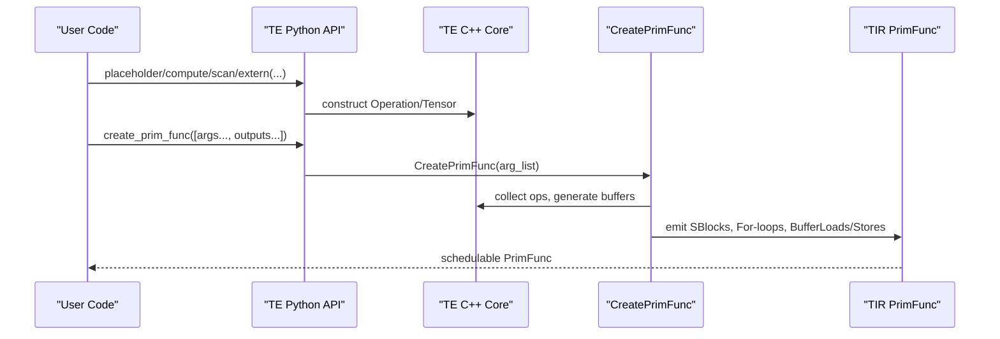
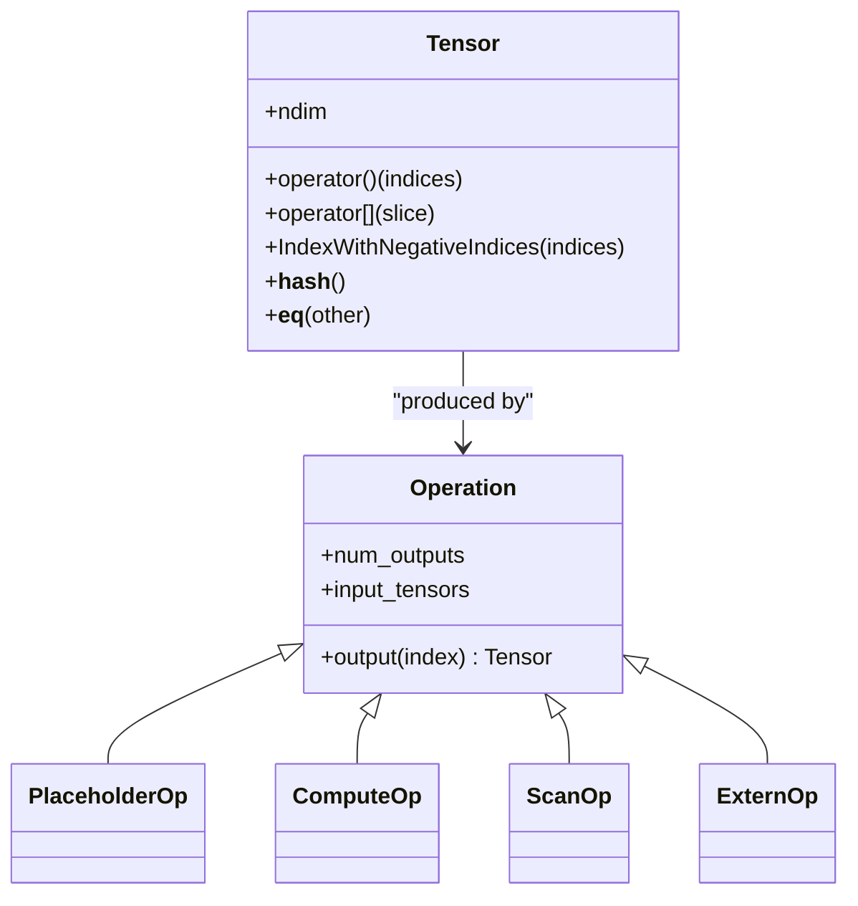
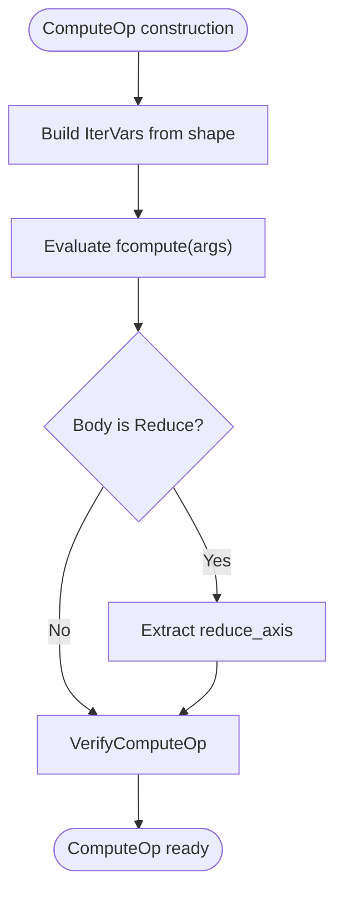
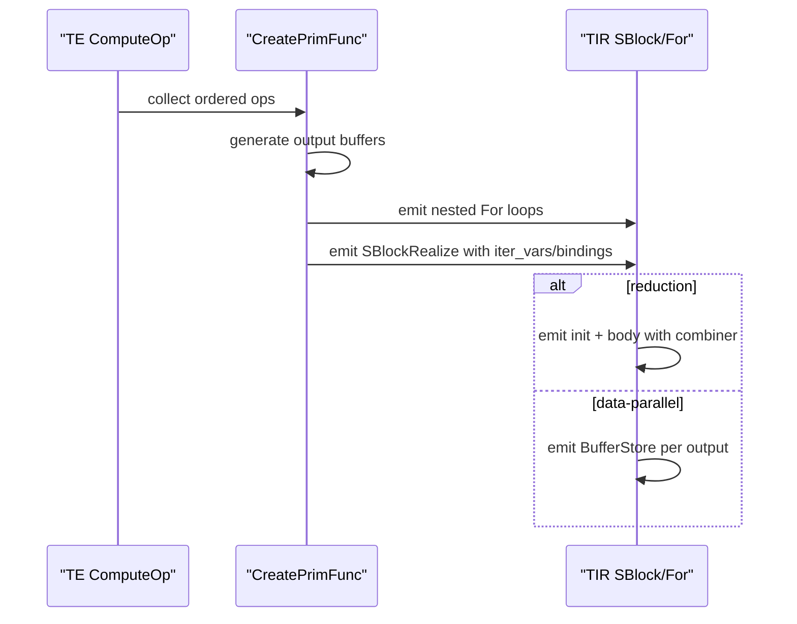
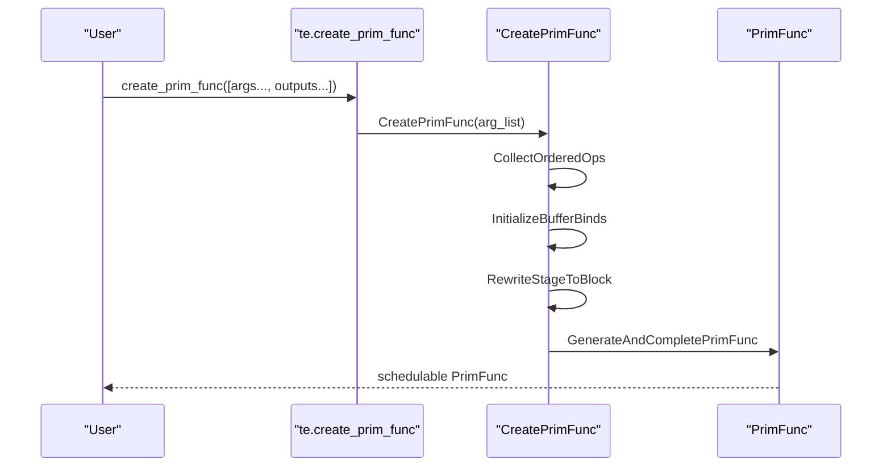
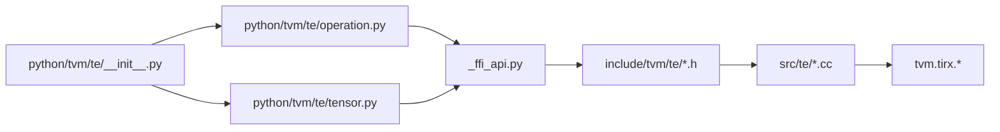

# Tensor Expression (TE) API

<cite>
**Referenced Files in This Document**
- [tensor.h](file://include/tvm/te/tensor.h)
- [operation.h](file://include/tvm/te/operation.h)
- [tensor.py](file://python/tvm/te/tensor.py)
- [operation.py](file://python/tvm/te/operation.py)
- [_ffi_api.py](file://python/tvm/te/_ffi_api.py)
- [__init__.py](file://python/tvm/te/__init__.py)
- [tensor.cc](file://src/te/tensor.cc)
- [compute_op.cc](file://src/te/operation/compute_op.cc)
- [placeholder_op.cc](file://src/te/operation/placeholder_op.cc)
- [create_primfunc.cc](file://src/te/operation/create_primfunc.cc)
- [create_primfunc.h](file://src/te/operation/create_primfunc.h)
</cite>

## Table of Contents
1. [Introduction](#introduction)
2. [Project Structure](#project-structure)
3. [Core Components](#core-components)
4. [Architecture Overview](#architecture-overview)
5. [Detailed Component Analysis](#detailed-component-analysis)
6. [Dependency Analysis](#dependency-analysis)
7. [Performance Considerations](#performance-considerations)
8. [Troubleshooting Guide](#troubleshooting-guide)
9. [Conclusion](#conclusion)
10. [Appendices](#appendices)

## Introduction
This document provides comprehensive API documentation for TVM’s Tensor Expression (TE) system. It explains how to construct tensors, declare compute operations, define schedules, and integrate TE with TIR code generation and the compilation pipeline. It covers tensor operations, reduction operations, compute declaration patterns, schedule primitives, loop manipulation, optimization directives, and advanced techniques such as custom operators and complex computation patterns.

## Project Structure
The TE system spans C++ core headers and runtime objects, Python wrappers for user-facing APIs, and code generation into TIR. Key areas:
- C++ core: tensor and operation definitions, reflection registration, and FFI bindings
- Python API: user-friendly constructors and helpers for placeholders, compute, scan, extern, and primfunc creation
- Code generation: transformation from TE expressions to TIR PrimFunc for scheduling and lowering

```mermaid
graph TB
subgraph "Python TE API"
PY_API["python/tvm/te/*"]
end
subgraph "C++ TE Core"
CPP_HDR["include/tvm/te/*"]
CPP_SRC["src/te/*"]
end
subgraph "TIRX"
TIRX["tvm.tirx.*"]
end
PY_API --> CPP_HDR
PY_API --> CPP_SRC
PY_API --> TIRX
CPP_HDR --> CPP_SRC
CPP_SRC --> TIRX
```

**Diagram sources**
- [tensor.h:40-94](file://include/tvm/te/tensor.h#L40-L94)
- [operation.h:48-186](file://include/tvm/te/operation.h#L48-L186)
- [tensor.py:54-150](file://python/tvm/te/tensor.py#L54-L150)
- [operation.py:35-139](file://python/tvm/te/operation.py#L35-L139)

**Section sources**
- [tensor.h:40-94](file://include/tvm/te/tensor.h#L40-L94)
- [operation.h:48-186](file://include/tvm/te/operation.h#L48-L186)
- [tensor.py:54-150](file://python/tvm/te/tensor.py#L54-L150)
- [operation.py:35-139](file://python/tvm/te/operation.py#L35-L139)

## Core Components
- Tensor: a data-producing node with shape, dtype, and an associated Operation. Supports indexing and slicing syntax.
- Operation: base class for computation producers. Concrete subclasses include PlaceholderOp, ComputeOp, ScanOp, and ExternOp.
- ComputeOp: scalar or vectorized compute over iteration domains; supports reduction at top-level.
- PlaceholderOp: input placeholder with shape and dtype.
- ExternOp: external computation via TIR statements; useful for integrating hand-written kernels or packed functions.
- ScanOp: symbolic scan over an iteration axis with init/update semantics.

Key Python constructors and helpers:
- placeholder(shape, dtype, name)
- compute(shape, fcompute, name, tag, attrs)
- scan(init, update, state_placeholder, inputs, name, tag, attrs)
- extern(shape, inputs, fcompute, name, dtype, in_buffers, out_buffers, tag, attrs)
- extern_primfunc(input_tensors, primfunc, ...)
- thread_axis(dom, tag, name)
- reduce_axis(dom, name)
- create_prim_func(ops, index_dtype_override)

**Section sources**
- [tensor.h:69-209](file://include/tvm/te/tensor.h#L69-L209)
- [operation.h:98-186](file://include/tvm/te/operation.h#L98-L186)
- [tensor.py:54-150](file://python/tvm/te/tensor.py#L54-L150)
- [operation.py:35-139](file://python/tvm/te/operation.py#L35-L139)

## Architecture Overview
TE builds a directed acyclic computation graph of Operations producing Tensors. The graph is lowered into TIR via create_prim_func, which generates a schedulable PrimFunc. The PrimFunc can then be transformed by TIR passes and scheduled.



**Diagram sources**
- [operation.py:550-604](file://python/tvm/te/operation.py#L550-L604)
- [create_primfunc.cc:760-787](file://src/te/operation/create_primfunc.cc#L760-L787)
- [compute_op.cc:100-137](file://src/te/operation/compute_op.cc#L100-L137)
- [placeholder_op.cc:61-63](file://src/te/operation/placeholder_op.cc#L61-L63)

## Detailed Component Analysis

### Tensor Construction and Indexing
- Construction: placeholder creates a PlaceholderOp-backed Tensor; compute/scan/extern create ComputeOp/ScanOp/ExternOp-backed Tensors.
- Indexing: Tensors support multi-dimensional indexing and slicing syntax; negative indices are supported via dedicated methods.
- Equality and hashing: Tensors expose equality checks and hashing for use in maps/sets.



**Diagram sources**
- [tensor.h:69-209](file://include/tvm/te/tensor.h#L69-L209)
- [tensor.py:54-150](file://python/tvm/te/tensor.py#L54-L150)
- [operation.h:98-186](file://include/tvm/te/operation.h#L98-L186)

**Section sources**
- [tensor.h:69-209](file://include/tvm/te/tensor.h#L69-L209)
- [tensor.py:54-150](file://python/tvm/te/tensor.py#L54-L150)

### ComputeOp Definition and Reduction Semantics
- ComputeOp defines a compute stage with axis and optional reduce_axis. Body expressions can be scalar PrimExpr or Reduce nodes.
- Verification enforces that reductions are top-level and consistent across multiple outputs.
- InputTensors traversal collects producer dependencies for scheduling.



**Diagram sources**
- [compute_op.cc:100-156](file://src/te/operation/compute_op.cc#L100-L156)
- [compute_op.cc:167-183](file://src/te/operation/compute_op.cc#L167-L183)

**Section sources**
- [operation.h:134-186](file://include/tvm/te/operation.h#L134-L186)
- [compute_op.cc:100-156](file://src/te/operation/compute_op.cc#L100-L156)

### Schedule Specification and Loop Manipulation
- Iteration variables: thread_axis(dom, tag, name) and reduce_axis(dom, name) create IterVar instances used by compute and extern.
- TE-to-TIR lowering: create_prim_func converts TE graph into TIR with nested SBlocks and For loops, mapping TE axes to block iterators and generating BufferLoad/Store sequences.
- Reduction lowering: init and combiner are emitted into SBlock init and body; multi-buffer reductions are handled with temporary variables and Bind nodes.



**Diagram sources**
- [create_primfunc.cc:478-621](file://src/te/operation/create_primfunc.cc#L478-L621)
- [create_primfunc.cc:335-433](file://src/te/operation/create_primfunc.cc#L335-L433)

**Section sources**
- [operation.py:494-548](file://python/tvm/te/operation.py#L494-L548)
- [create_primfunc.cc:478-621](file://src/te/operation/create_primfunc.cc#L478-L621)

### TE Integration with TIR Code Generation and Compilation Pipeline
- create_prim_func: converts a list of TE Tensors (including placeholders and outputs) into a TIR PrimFunc. It validates supported operations, initializes buffer bindings, lowers compute stages to SBlocks, and completes the function with script.Complete.
- extern_primfunc: integrates a pre-defined TIR PrimFunc into TE by mapping input tensors to primfunc buffers and emitting an ExternOp.



**Diagram sources**
- [operation.py:550-604](file://python/tvm/te/operation.py#L550-L604)
- [create_primfunc.cc:676-787](file://src/te/operation/create_primfunc.cc#L676-L787)

**Section sources**
- [operation.py:550-604](file://python/tvm/te/operation.py#L550-L604)
- [create_primfunc.cc:738-787](file://src/te/operation/create_primfunc.cc#L738-L787)

### Practical Examples and Patterns

- Tensor computation definition
  - Define placeholders, compute a result tensor, and create a schedulable PrimFunc.
  - Reference: [operation.py:550-604](file://python/tvm/te/operation.py#L550-L604)

- Schedule application and performance optimization
  - Lower to TIR via create_prim_func, then apply TIR passes and schedule transformations.
  - Reference: [create_primfunc.cc:760-787](file://src/te/operation/create_primfunc.cc#L760-L787)

- Reduction operations
  - Use reduce_axis and top-level Reduce expressions in compute; create_prim_func emits init and combiner accordingly.
  - References: [operation.h:317-318](file://include/tvm/te/operation.h#L317-L318), [compute_op.cc:150-156](file://src/te/operation/compute_op.cc#L150-L156)

- Custom operators and complex computation patterns
  - Use extern to integrate external kernels or packed functions; use extern_primfunc to embed a TVMScript-defined PrimFunc into TE.
  - References: [operation.py:208-342](file://python/tvm/te/operation.py#L208-L342), [operation.py:344-425](file://python/tvm/te/operation.py#L344-L425)

## Dependency Analysis
- Python TE API depends on C++ TE core objects and TIRX expressions/buffers.
- FFI bridges connect Python wrappers to C++ implementations for tensor, operation, and primfunc creation.
- create_prim_func orchestrates lowering from TE to TIR, invoking graph traversal and buffer allocation.



**Diagram sources**
- [__init__.py:21-39](file://python/tvm/te/__init__.py#L21-L39)
- [operation.py:30-32](file://python/tvm/te/operation.py#L30-L32)
- [tensor.py:26-27](file://python/tvm/te/tensor.py#L26-L27)
- [_ffi_api.py:1-200](file://python/tvm/te/_ffi_api.py#L1-L200)

**Section sources**
- [__init__.py:21-39](file://python/tvm/te/__init__.py#L21-L39)
- [operation.py:30-32](file://python/tvm/te/operation.py#L30-L32)
- [tensor.py:26-27](file://python/tvm/te/tensor.py#L26-L27)
- [_ffi_api.py:1-200](file://python/tvm/te/_ffi_api.py#L1-L200)

## Performance Considerations
- Prefer top-level reductions in compute for efficient lowering to TIR reduction blocks.
- Use extern and extern_primfunc for performance-critical kernels or when integrating external libraries.
- Leverage create_prim_func to materialize a schedulable function for downstream passes and scheduling.
- Ensure shapes and dtypes align between TE tensors and TIR buffers to avoid extra copies or layout conversions.

## Troubleshooting Guide
Common issues and resolutions:
- Mismatched indices in tensor indexing: ensure the number of indices matches tensor ndim.
  - Reference: [tensor.py:57-63](file://python/tvm/te/tensor.py#L57-L63)

- Ambiguous equality for rank-0 tensors: use Tensor.equal or Tensor.same_as explicitly.
  - Reference: [tensor.py:76-82](file://python/tvm/te/tensor.py#L76-L82)

- Unsupported operation types in create_prim_func: only placeholder and compute are supported in the current lowering path.
  - Reference: [create_primfunc.cc:684-689](file://src/te/operation/create_primfunc.cc#L684-L689)

- Reduction placement: reductions must be at top-level in compute; nested reductions are not allowed.
  - Reference: [compute_op.cc:237-242](file://src/te/operation/compute_op.cc#L237-L242)

**Section sources**
- [tensor.py:57-82](file://python/tvm/te/tensor.py#L57-L82)
- [create_primfunc.cc:684-689](file://src/te/operation/create_primfunc.cc#L684-L689)
- [compute_op.cc:237-242](file://src/te/operation/compute_op.cc#L237-L242)

## Conclusion
The TE system provides a concise, composable way to define tensor computations and reductions, with seamless integration into TIR for scheduling and compilation. By leveraging placeholder, compute, scan, extern, and extern_primfunc constructs, developers can express complex computation patterns and optimize performance through TIR-level transformations.

## Appendices

### API Reference Highlights
- Tensor
  - Methods: indexing, slicing, equality, hashing, ndim, name
  - References: [tensor.h:100-209](file://include/tvm/te/tensor.h#L100-L209), [tensor.py:54-95](file://python/tvm/te/tensor.py#L54-L95)

- Operation
  - Properties: output(index), num_outputs, input_tensors
  - References: [tensor.h:48-67](file://include/tvm/te/tensor.h#L48-L67), [tensor.py:98-125](file://python/tvm/te/tensor.py#L98-L125)

- ComputeOp
  - Constructors: ComputeOp(name, tag, attrs, axis, body)
  - Helpers: compute(shape, fcompute, ...), compute(shape, fbatchcompute, ...)
  - References: [operation.h:156-186](file://include/tvm/te/operation.h#L156-L186), [compute_op.cc:100-137](file://src/te/operation/compute_op.cc#L100-L137)

- PlaceholderOp
  - Constructor: PlaceholderOp(name, shape, dtype)
  - Helper: placeholder(shape, dtype, name)
  - References: [operation.h:124-129](file://include/tvm/te/operation.h#L124-L129), [placeholder_op.cc:61-63](file://src/te/operation/placeholder_op.cc#L61-L63)

- ExternOp
  - Helper: extern(shape, inputs, fcompute, ...)
  - Helper: extern_primfunc(input_tensors, primfunc, ...)
  - References: [operation.h:287-294](file://include/tvm/te/operation.h#L287-L294), [operation.py:208-342](file://python/tvm/te/operation.py#L208-L342), [operation.py:344-425](file://python/tvm/te/operation.py#L344-L425)

- Iteration Variables
  - thread_axis(dom, tag, name)
  - reduce_axis(dom, name)
  - References: [operation.h:309-317](file://include/tvm/te/operation.h#L309-L317), [operation.py:494-548](file://python/tvm/te/operation.py#L494-L548)

- TIR Integration
  - create_prim_func(ops, index_dtype_override)
  - References: [operation.py:550-604](file://python/tvm/te/operation.py#L550-L604), [create_primfunc.cc:760-787](file://src/te/operation/create_primfunc.cc#L760-L787)