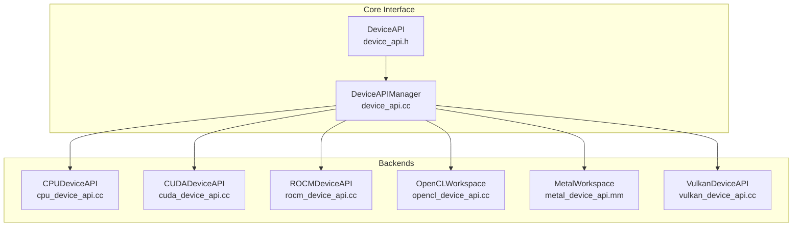
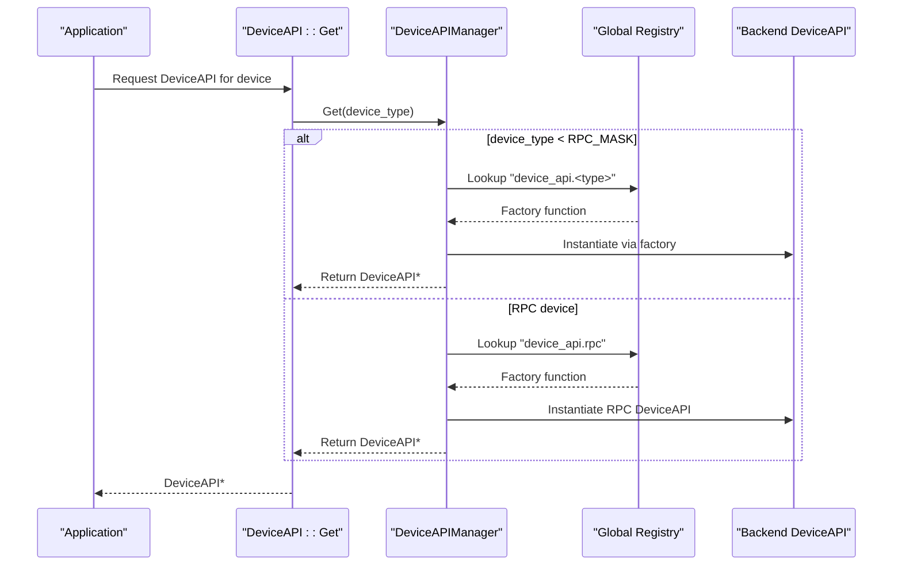
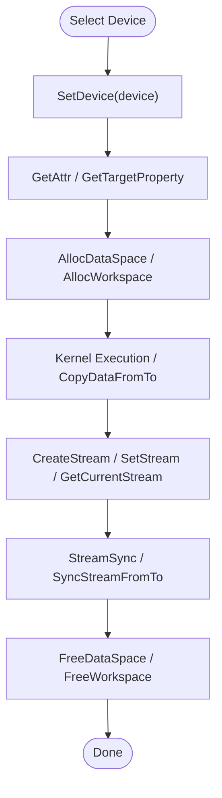
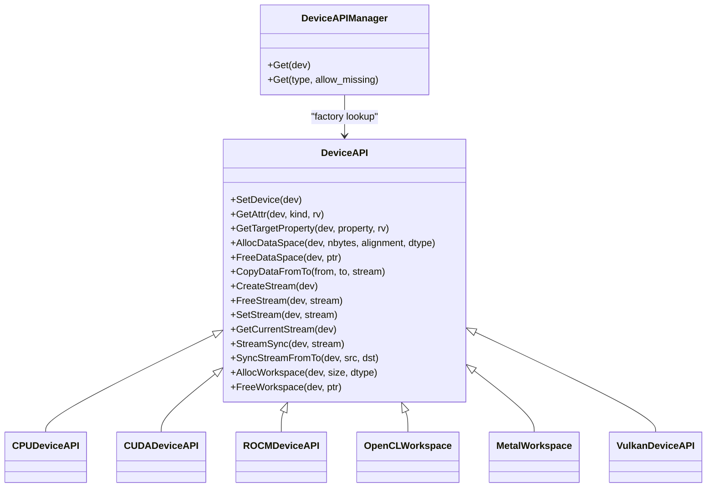

# Device APIs

<cite>
**Referenced Files in This Document**
- [device_api.h](file://include/tvm/runtime/device_api.h)
- [device_api.cc](file://src/runtime/device_api.cc)
- [cpu_device_api.cc](file://src/runtime/cpu_device_api.cc)
- [cuda_device_api.cc](file://src/runtime/cuda/cuda_device_api.cc)
- [opencl_device_api.cc](file://src/runtime/opencl/opencl_device_api.cc)
- [metal_device_api.mm](file://src/runtime/metal/metal_device_api.mm)
- [vulkan_device_api.cc](file://src/runtime/vulkan/vulkan_device_api.cc)
- [rocm_device_api.cc](file://src/runtime/rocm/rocm_device_api.cc)
- [module.cc](file://src/runtime/module.cc)
- [workspace_pool.cc](file://src/runtime/workspace_pool.cc)
- [object.h](file://include/tvm/runtime/object.h)
- [base.h](file://include/tvm/runtime/base.h)
</cite>

## Table of Contents
1. [Introduction](#introduction)
2. [Project Structure](#project-structure)
3. [Core Components](#core-components)
4. [Architecture Overview](#architecture-overview)
5. [Detailed Component Analysis](#detailed-component-analysis)
6. [Dependency Analysis](#dependency-analysis)
7. [Performance Considerations](#performance-considerations)
8. [Troubleshooting Guide](#troubleshooting-guide)
9. [Conclusion](#conclusion)

## Introduction
This document explains TVM’s device abstraction layer: the unified device API interface, device capability queries, and hardware-specific implementations. It covers the device lifecycle, context management, and command queue/stream handling across CPU, CUDA, ROCm, OpenCL, Metal, and Vulkan. Practical examples illustrate device selection, memory operations, kernel execution, synchronization, and performance characteristics. It also documents device enumeration, capability detection, and fallback mechanisms for unsupported features.

## Project Structure
At the center of TVM’s device abstraction is a common interface that delegates to hardware-specific implementations. The core interface resides in the runtime headers, with concrete backends implemented under src/runtime/<backend>.

**Diagram sources**
- [device_api.h:128-310](file://include/tvm/runtime/device_api.h#L128-L310)
- [device_api.cc:49-95](file://src/runtime/device_api.cc#L49-L95)
- [cpu_device_api.cc:52-139](file://src/runtime/cpu_device_api.cc#L52-L139)
- [cuda_device_api.cc:39-274](file://src/runtime/cuda/cuda_device_api.cc#L39-L274)
- [rocm_device_api.cc:38-239](file://src/runtime/rocm/rocm_device_api.cc#L38-L239)
- [opencl_device_api.cc:137-586](file://src/runtime/opencl/opencl_device_api.cc#L137-L586)
- [metal_device_api.mm:44-341](file://src/runtime/metal/metal_device_api.mm#L44-L341)
- [vulkan_device_api.cc:96-442](file://src/runtime/vulkan/vulkan_device_api.cc#L96-L442)

**Section sources**
- [device_api.h:128-310](file://include/tvm/runtime/device_api.h#L128-L310)
- [device_api.cc:49-95](file://src/runtime/device_api.cc#L49-L95)

## Core Components
- Unified device API: Provides a single interface for device selection, attributes, memory allocation/free, copying between devices, streams, and workspace management.
- Device manager: Lazily resolves the appropriate backend DeviceAPI by device type and caches it.
- Backend implementations: Each hardware backend implements the DeviceAPI contract, including stream creation/sync and memory semantics.

Key responsibilities:
- Device selection and context: SetDevice, GetAttr, GetTargetProperty.
- Memory: AllocDataSpace, FreeDataSpace, GetDataSize, AllocWorkspace, FreeWorkspace.
- Data movement: CopyDataFromTo (with optional stream).
- Streams: CreateStream, FreeStream, SetStream, GetCurrentStream, StreamSync, SyncStreamFromTo.

**Section sources**
- [device_api.h:128-310](file://include/tvm/runtime/device_api.h#L128-L310)
- [device_api.cc:97-202](file://src/runtime/device_api.cc#L97-L202)

## Architecture Overview
The runtime locates a backend DeviceAPI via a registry-like mechanism keyed by device type. Backends register themselves under device_api.<backend> and are retrieved dynamically. The CPU backend is always available; others are conditionally enabled based on build/runtime availability.

**Diagram sources**
- [device_api.cc:70-94](file://src/runtime/device_api.cc#L70-L94)
- [module.cc:38-69](file://src/runtime/module.cc#L38-L69)

**Section sources**
- [device_api.cc:70-94](file://src/runtime/device_api.cc#L70-L94)
- [module.cc:38-69](file://src/runtime/module.cc#L38-L69)

## Detailed Component Analysis

### Unified Device API Interface
- Device selection: SetDevice sets the active device context for subsequent operations.
- Attributes: GetAttr queries device capabilities via DeviceAttrKind (existence, max threads/block, warp size, shared memory, compute version, device name, clock rate, multi-processor count, max thread dimensions, registers/block, GCN arch, API/driver version, L2 cache size, total/global memory, image pitch alignment).
- Memory: GetDataSize computes size from tensor shape and dtype; AllocDataSpace/FreeDataSpace manage device memory; AllocWorkspace/FreeWorkspace manage thread-local temporary buffers.
- Streams: CreateStream/FreeStream allocate and destroy streams; SetStream/GetCurrentStream bind/set current stream; StreamSync synchronizes; SyncStreamFromTo synchronizes across streams.
- Target property: GetTargetProperty expands target strings with device-specific properties.

Implementation highlights:
- Default no-op CopyDataFromTo dispatches to a byte-range overload; backends override for device-specific copy semantics.
- Default stream creation returns null (implies default stream), and stream sync is a no-op for CPU.

**Section sources**
- [device_api.h:83-101](file://include/tvm/runtime/device_api.h#L83-L101)
- [device_api.h:128-310](file://include/tvm/runtime/device_api.h#L128-L310)
- [device_api.cc:101-177](file://src/runtime/device_api.cc#L101-L177)

### CPU Device API
- SetDevice is a no-op.
- GetAttr reports existence and total global memory via OS-specific calls.
- AllocDataSpace/FreeDataSpace use aligned host allocations; SupportsDevicePointerArithmeticsOnHost returns true.
- CopyDataFromTo uses memcpy for host-to-host transfers.
- StreamSync is a no-op; workspace pooling uses a thread-local pool.

Practical notes:
- Suitable for CPU-only inference and host-side data movement.
- Alignment and size computations follow the unified API.

**Section sources**
- [cpu_device_api.cc:52-139](file://src/runtime/cpu_device_api.cc#L52-L139)
- [workspace_pool.cc:136-165](file://src/runtime/workspace_pool.cc#L136-L165)

### CUDA Device API
- SetDevice sets the active CUDA device.
- GetAttr queries CUDA device properties (existence, max threads/block, warp size, shared memory, compute capability, device name, clock rate, multiprocessor count, max thread dimensions, registers/block, L2 cache size, total/global memory, image pitch alignment).
- AllocDataSpace/FreeDataSpace allocate/free device/host memory; host allocations use pinned memory; alignment enforced at 256 bytes.
- CopyDataFromTo handles host-to-host, device-to-device, device-to-host, host-to-device, and peer-to-peer copies; uses CUDA streams.
- Stream management: CreateStream/FreeStream create/destroy CUDA streams; StreamSync synchronizes; SyncStreamFromTo records events and makes dst stream wait on src.
- Workspace: Thread-local pool backed by CUDA allocations.
- Timers: CUDA event-based timer for profiling.

Optimization notes:
- Peer-to-peer copies bypass host when devices differ.
- Async copies leverage streams; ensure proper synchronization.

**Section sources**
- [cuda_device_api.cc:39-274](file://src/runtime/cuda/cuda_device_api.cc#L39-L274)
- [cuda_device_api.cc:297-338](file://src/runtime/cuda/cuda_device_api.cc#L297-L338)

### ROCm (AMD) Device API
- SetDevice sets the active ROCm device.
- GetAttr mirrors CUDA attribute queries using HIP equivalents.
- AllocDataSpace/FreeDataSpace allocate device/host memory; alignment enforced at 256 bytes.
- CopyDataFromTo supports device-to-device, device-to-host, host-to-device, and peer-to-peer copies via HIP streams.
- StreamSync synchronizes HIP streams; workspace managed via thread-local pool.

Optimization notes:
- Uses HIP APIs; similar async/stream model to CUDA.

**Section sources**
- [rocm_device_api.cc:38-239](file://src/runtime/rocm/rocm_device_api.cc#L38-L239)
- [rocm_device_api.cc:262-307](file://src/runtime/rocm/rocm_device_api.cc#L262-L307)

### OpenCL Device API
- OpenCLWorkspace encapsulates device enumeration, context/queue creation, and memory/image management.
- GetAttr queries OpenCL device properties; includes warp size via environment override and image pitch alignment.
- Memory: AllocDataSpace supports buffer and image allocations; AllocDataSpaceView adapts between buffers and images; FreeDataSpaceView handles views; GetDataSize computes texture memory footprint.
- CopyDataFromTo supports buffer-to-buffer, buffer-to-image, image-to-buffer, and image-to-image copies; CPU transfers use enqueue read/write; ensures completion via finish.
- StreamSync finishes the command queue; workspace uses pooled allocator.

Device enumeration and fallback:
- Initializes platforms/devices, filters by supported OpenCL version, and logs warnings for unsupported devices.
- Falls back to CPU OpenCL device if GPU devices are unavailable.

**Section sources**
- [opencl_device_api.cc:137-586](file://src/runtime/opencl/opencl_device_api.cc#L137-L586)
- [opencl_device_api.cc:673-763](file://src/runtime/opencl/opencl_device_api.cc#L673-L763)

### Metal Device API
- MetalWorkspace manages device discovery and per-thread default streams.
- GetAttr queries device properties; warp size derived via a dummy kernel pipeline state.
- AllocDataSpace creates MTLBuffer with Private storage mode; FreeDataSpace synchronizes if pending work, then releases.
- CopyDataFromTo supports GPU→GPU blit, GPU→CPU staged readback, and CPU→GPU staged write; uses staging buffers to amortize flushes.
- Stream management: CreateStream/FreeStream allocate/deallocate; StreamSync synchronizes and resets staging pools; workspace uses thread-local pool.

Optimization notes:
- Staging buffers reduce flush overhead; careful encoder ordering within a command buffer.

**Section sources**
- [metal_device_api.mm:44-341](file://src/runtime/metal/metal_device_api.mm#L44-L341)

### Vulkan Device API
- VulkanDeviceAPI enumerates physical devices, filters by compute support, and sorts by device type preference.
- GetAttr queries Vulkan device properties (threads/block, shared memory, warp size, compute version, device name, API/driver versions, total memory).
- GetTargetProperty exposes feature flags and limits (float/int support, storage/push descriptors, cooperative matrix, subgroup ops, max block sizes, ranges).
- AllocDataSpace/FreeDataSpace allocate VulkanBuffer wrappers; StreamSync synchronizes the thread-local stream; SyncStreamFromTo is a no-op (single stream).
- CopyDataFromTo supports device→device buffer copy, device→CPU staged read, and CPU→device staged write; uses staging buffers and memory barriers.

Optimization notes:
- Single-stream model simplifies synchronization; staging buffers improve throughput.

**Section sources**
- [vulkan_device_api.cc:96-442](file://src/runtime/vulkan/vulkan_device_api.cc#L96-L442)

### Device Lifecycle, Context Management, and Streams
- Device selection: SetDevice switches the active device for subsequent operations.
- Context management: Backends maintain device contexts (CUDA/ROCm/HIP contexts, OpenCL contexts, Metal devices, Vulkan instances/devices).
- Streams: CreateStream returns a backend-specific stream handle; SetStream binds a stream to the current device context; GetCurrentStream retrieves the bound stream; StreamSync synchronizes; SyncStreamFromTo synchronizes across streams using events (CUDA) or command buffer synchronization (Metal/Vulkan).

**Diagram sources**
- [device_api.h:128-310](file://include/tvm/runtime/device_api.h#L128-L310)
- [cuda_device_api.cc:223-245](file://src/runtime/cuda/cuda_device_api.cc#L223-L245)
- [metal_device_api.mm:311-333](file://src/runtime/metal/metal_device_api.mm#L311-L333)
- [vulkan_device_api.cc:317-333](file://src/runtime/vulkan/vulkan_device_api.cc#L317-L333)

**Section sources**
- [device_api.h:128-310](file://include/tvm/runtime/device_api.h#L128-L310)

### Practical Examples

- Device selection and capability detection
  - Select device: Use SetDevice to set the active device.
  - Query attributes: Use GetAttr with DeviceAttrKind to fetch properties like kMaxThreadsPerBlock, kWarpSize, kTotalGlobalMemory, kComputeVersion, and kDeviceName.
  - Target property expansion: Use GetTargetProperty to expand target strings with device-specific properties (e.g., Vulkan feature flags).

  Example references:
  - [device_api.cc:205-239](file://src/runtime/device_api.cc#L205-L239)
  - [cuda_device_api.cc:42-135](file://src/runtime/cuda/cuda_device_api.cc#L42-L135)
  - [vulkan_device_api.cc:182-282](file://src/runtime/vulkan/vulkan_device_api.cc#L182-L282)

- Memory operations
  - Allocate device memory: AllocDataSpace with alignment and type hint.
  - Allocate workspace: AllocWorkspace for temporary buffers; FreeWorkspace to release.
  - Free memory: FreeDataSpace; backends handle device/host variants appropriately.

  Example references:
  - [device_api.h:172-190](file://include/tvm/runtime/device_api.h#L172-L190)
  - [cpu_device_api.cc:95-117](file://src/runtime/cpu_device_api.cc#L95-L117)
  - [cuda_device_api.cc:136-180](file://src/runtime/cuda/cuda_device_api.cc#L136-L180)
  - [workspace_pool.cc:151-165](file://src/runtime/workspace_pool.cc#L151-L165)

- Kernel execution and synchronization
  - CUDA: CreateStream, SetStream, StreamSync; kernel launches occur via backend modules; SyncStreamFromTo uses events.
  - ROCm: Similar to CUDA using HIP streams.
  - Metal: CreateStream, StreamSync; GPU→CPU/CPU→GPU staged copies; blit encoders within command buffers.
  - Vulkan: Single-stream model; StreamSync synchronizes the thread-local stream; CopyDataFromTo uses staging buffers and barriers.

  Example references:
  - [cuda_device_api.cc:223-250](file://src/runtime/cuda/cuda_device_api.cc#L223-L250)
  - [rocm_device_api.cc:212-215](file://src/runtime/rocm/rocm_device_api.cc#L212-L215)
  - [metal_device_api.mm:311-333](file://src/runtime/metal/metal_device_api.mm#L311-L333)
  - [vulkan_device_api.cc:330-333](file://src/runtime/vulkan/vulkan_device_api.cc#L330-L333)

- Cross-device copies
  - CUDA/ROCm: CopyDataFromTo supports device-to-device, device-to-host, host-to-device, and peer-to-peer.
  - OpenCL: Supports buffer-to-buffer, buffer-to-image, image-to-buffer, image-to-image; uses enqueue operations and finish for CPU transfers.
  - Metal: GPU→GPU blit, GPU→CPU staged readback, CPU→GPU staged write.
  - Vulkan: Device→device buffer copy; device→CPU and CPU→device staged transfers with barriers.

  Example references:
  - [cuda_device_api.cc:182-220](file://src/runtime/cuda/cuda_device_api.cc#L182-L220)
  - [rocm_device_api.cc:172-210](file://src/runtime/rocm/rocm_device_api.cc#L172-L210)
  - [opencl_device_api.cc:508-586](file://src/runtime/opencl/opencl_device_api.cc#L508-L586)
  - [metal_device_api.mm:226-309](file://src/runtime/metal/metal_device_api.mm#L226-L309)
  - [vulkan_device_api.cc:335-442](file://src/runtime/vulkan/vulkan_device_api.cc#L335-L442)

### Device Enumeration, Capability Detection, and Fallbacks
- CPU: Always exists; total memory queried via OS-specific APIs.
- CUDA/ROCm: Existence checked via device count; attributes queried via runtime APIs.
- OpenCL: Enumerates platforms and devices, filters by supported OpenCL version, logs warnings for unsupported devices, and falls back to CPU OpenCL if GPU devices are unavailable.
- Metal: Enumerates all devices on macOS; derives warp size via a dummy kernel pipeline state.
- Vulkan: Enumerates physical devices, filters by compute support, sorts by device type preference, and exposes feature flags via GetTargetProperty.

**Section sources**
- [cpu_device_api.cc:55-94](file://src/runtime/cpu_device_api.cc#L55-L94)
- [cuda_device_api.cc:42-54](file://src/runtime/cuda/cuda_device_api.cc#L42-L54)
- [rocm_device_api.cc:44-53](file://src/runtime/rocm/rocm_device_api.cc#L44-L53)
- [opencl_device_api.cc:673-763](file://src/runtime/opencl/opencl_device_api.cc#L673-L763)
- [metal_device_api.mm:160-175](file://src/runtime/metal/metal_device_api.mm#L160-L175)
- [vulkan_device_api.cc:46-77](file://src/runtime/vulkan/vulkan_device_api.cc#L46-L77)

## Dependency Analysis
- DeviceAPI is the central abstraction; DeviceAPIManager lazily instantiates backends via a registry lookup keyed by device type.
- Backends depend on their respective runtime libraries (CUDA/HIP/OpenCL/Metal/Vulkan) and expose device_api.<backend> factories.
- Workspace pools are per-backend thread-local pools to amortize allocations.

**Diagram sources**
- [device_api.h:128-310](file://include/tvm/runtime/device_api.h#L128-L310)
- [device_api.cc:49-95](file://src/runtime/device_api.cc#L49-L95)
- [cpu_device_api.cc:52-139](file://src/runtime/cpu_device_api.cc#L52-L139)
- [cuda_device_api.cc:39-274](file://src/runtime/cuda/cuda_device_api.cc#L39-L274)
- [rocm_device_api.cc:38-239](file://src/runtime/rocm/rocm_device_api.cc#L38-L239)
- [opencl_device_api.cc:137-586](file://src/runtime/opencl/opencl_device_api.cc#L137-L586)
- [metal_device_api.mm:44-341](file://src/runtime/metal/metal_device_api.mm#L44-L341)
- [vulkan_device_api.cc:96-442](file://src/runtime/vulkan/vulkan_device_api.cc#L96-L442)

**Section sources**
- [device_api.h:128-310](file://include/tvm/runtime/device_api.h#L128-L310)
- [device_api.cc:49-95](file://src/runtime/device_api.cc#L49-L95)

## Performance Considerations
- Stream usage: Prefer asynchronous copies and kernels with streams to overlap computation and transfers. Ensure proper synchronization using StreamSync or SyncStreamFromTo.
- Peer-to-peer copies: Use direct device-to-device copies when possible (CUDA/ROCm) to avoid host bandwidth.
- Staging buffers: Metal and Vulkan use staging buffers to improve CPU↔GPU transfer performance; minimize flush/invalidate calls.
- Workspace pooling: Use AllocWorkspace/FreeWorkspace to reuse temporary buffers efficiently; thread-local pools reduce allocation overhead.
- Alignment: Respect backend alignment requirements (e.g., 256-byte alignment for CUDA/ROCm) to avoid performance penalties.

[No sources needed since this section provides general guidance]

## Troubleshooting Guide
- Device not found or disabled
  - Verify backend availability via RuntimeEnabled checks and ensure device_api.<backend> is registered.
  - For CUDA/ROCm, confirm device count and runtime library availability.
  - For OpenCL, check supported version and platform/device enumeration logs.

- Synchronization issues
  - Ensure StreamSync is called after asynchronous operations; use SyncStreamFromTo to coordinate between streams (where supported).
  - Metal: GPU→CPU reads require flushing and waiting; CPU→GPU writes may need staging buffer management.

- Memory errors
  - CUDA/ROCm: Avoid freeing allocations during stack unwinding when the driver is in an error state; backends guard against this scenario.
  - Vulkan: Always synchronize before releasing buffers to ensure outstanding commands complete.

- Attribute queries
  - Some attributes may not be available on all backends (e.g., available global memory for OpenCL/Vulkan). Use kExist to probe availability.

**Section sources**
- [cuda_device_api.cc:153-180](file://src/runtime/cuda/cuda_device_api.cc#L153-L180)
- [opencl_device_api.cc:588-592](file://src/runtime/opencl/opencl_device_api.cc#L588-L592)
- [vulkan_device_api.cc:296-303](file://src/runtime/vulkan/vulkan_device_api.cc#L296-L303)
- [module.cc:38-69](file://src/runtime/module.cc#L38-L69)

## Conclusion
TVM’s device abstraction layer provides a uniform interface across heterogeneous hardware backends. The DeviceAPIManager resolves the correct backend dynamically, enabling flexible deployment across CPU, CUDA, ROCm, OpenCL, Metal, and Vulkan. By leveraging streams, staging buffers, and workspace pooling, applications can achieve efficient memory management and synchronization. Capability queries and target property expansion enable robust device selection and fallback strategies for unsupported features.