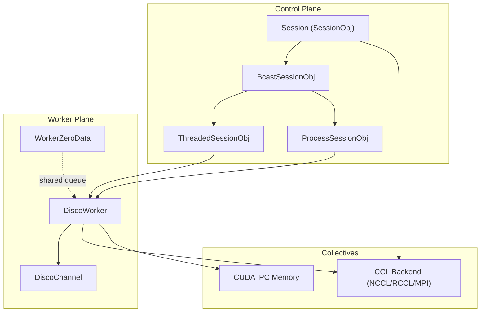
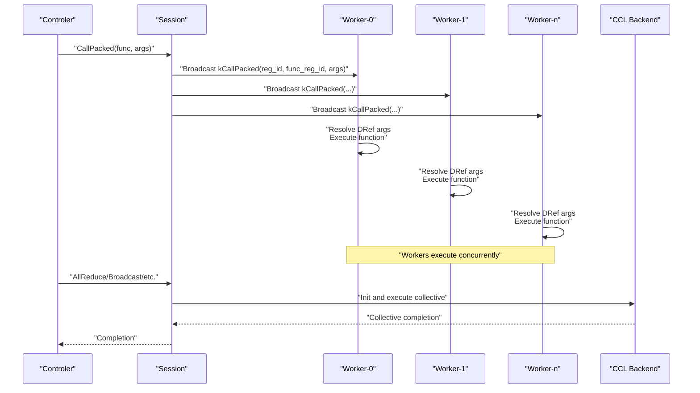
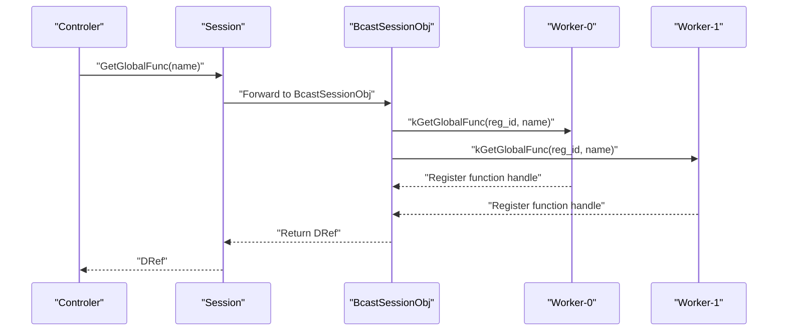
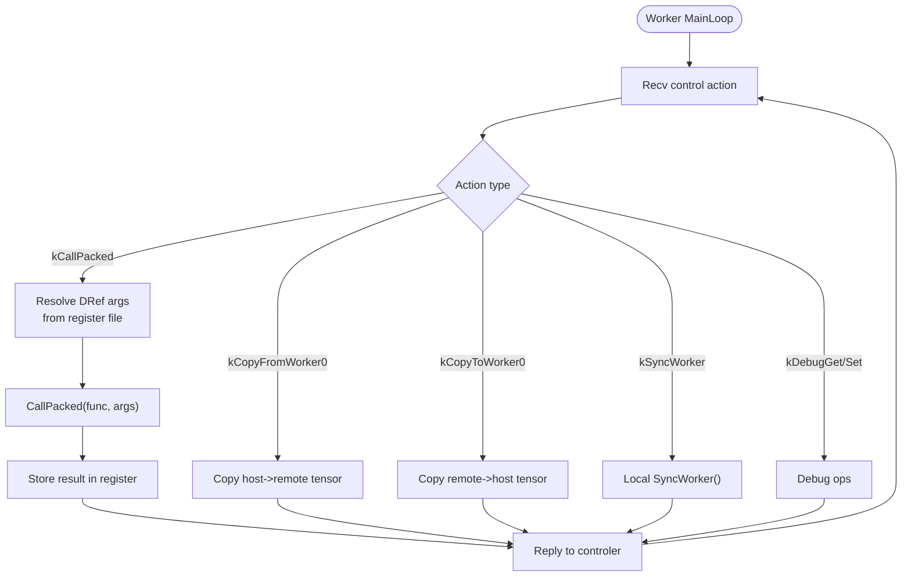
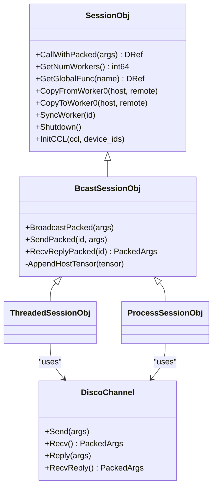
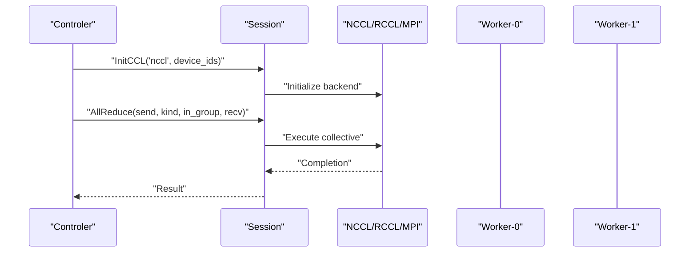
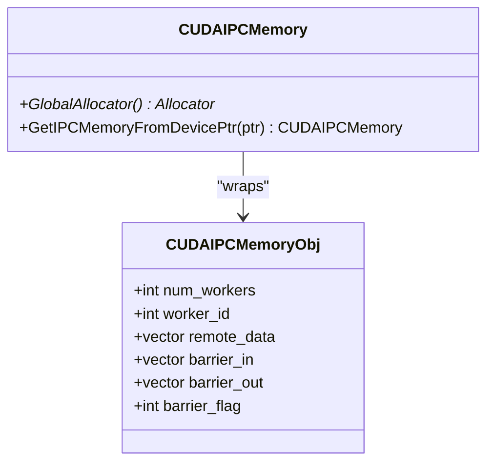
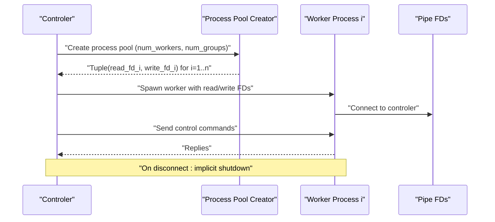
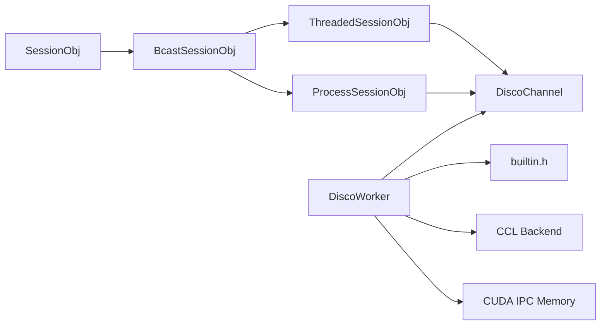

# Distributed Runtime

<cite>
**Referenced Files in This Document**
- [session.h](file://include/tvm/runtime/disco/session.h)
- [builtin.h](file://include/tvm/runtime/disco/builtin.h)
- [cuda_ipc_memory.h](file://include/tvm/runtime/disco/cuda_ipc_memory.h)
- [disco_worker.h](file://include/tvm/runtime/disco/disco_worker.h)
- [session.cc](file://src/runtime/disco/session.cc)
- [threaded_session.cc](file://src/runtime/disco/threaded_session.cc)
- [process_session.cc](file://src/runtime/disco/process_session.cc)
- [bcast_session.h](file://src/runtime/disco/bcast_session.h)
- [bcast_session.cc](file://src/runtime/disco/bcast_session.cc)
- [disco_worker.cc](file://src/runtime/disco/disco_worker.cc)
- [disco_worker_thread.h](file://src/runtime/disco/disco_worker_thread.h)
- [message_queue.h](file://src/runtime/disco/message_queue.h)
- [nccl.cc](file://src/runtime/disco/nccl/nccl.cc)
- [custom_allreduce.cc](file://src/runtime/disco/cuda_ipc/custom_allreduce.cc)
- [custom_allreduce_kernels.h](file://3rdparty/tensorrt_llm/custom_allreduce_kernels.h)
- [custom_allreduce_kernels.cu](file://3rdparty/tensorrt_llm/custom_allreduce_kernels.cu)
</cite>

## Table of Contents
1. [Introduction](#introduction)
2. [Project Structure](#project-structure)
3. [Core Components](#core-components)
4. [Architecture Overview](#architecture-overview)
5. [Detailed Component Analysis](#detailed-component-analysis)
6. [Dependency Analysis](#dependency-analysis)
7. [Performance Considerations](#performance-considerations)
8. [Troubleshooting Guide](#troubleshooting-guide)
9. [Conclusion](#conclusion)
10. [Appendices](#appendices)

## Introduction
This document explains TVM’s distributed runtime (“Disco”), focusing on the distributed computation framework, session management, inter-node communication protocols, discovery and coordination, collective communication primitives, lifecycle and fault tolerance, resource allocation, and integrations with NCCL, custom allreduce operations, and NVSHMEM. It also provides practical guidance for setting up clusters, managing worker sessions, executing distributed computations, optimizing performance, enabling memory sharing across nodes, and debugging distributed applications.

## Project Structure
The distributed runtime is organized around a control-plane session abstraction and worker-side execution loops. Sessions encapsulate control-plane orchestration and expose a unified API for function dispatch, data movement, and synchronization. Workers execute commands, manage a register-backed object model, and coordinate via channels. Collective communication is integrated through pluggable backends (e.g., NCCL, RCCL, MPI) initialized through the session.

**Diagram sources**
- [session.h:180-297](file://include/tvm/runtime/disco/session.h#L180-L297)
- [bcast_session.h:35-98](file://src/runtime/disco/bcast_session.h#L35-L98)
- [threaded_session.cc:145-188](file://src/runtime/disco/threaded_session.cc#L145-L188)
- [process_session.cc:62-173](file://src/runtime/disco/process_session.cc#L62-L173)
- [disco_worker.h:41-99](file://include/tvm/runtime/disco/disco_worker.h#L41-L99)
- [builtin.h:65-148](file://include/tvm/runtime/disco/builtin.h#L65-L148)

**Section sources**
- [session.h:180-297](file://include/tvm/runtime/disco/session.h#L180-L297)
- [bcast_session.h:35-98](file://src/runtime/disco/bcast_session.h#L35-L98)
- [threaded_session.cc:145-188](file://src/runtime/disco/threaded_session.cc#L145-L188)
- [process_session.cc:62-173](file://src/runtime/disco/process_session.cc#L62-L173)
- [disco_worker.h:41-99](file://include/tvm/runtime/disco/disco_worker.h#L41-L99)

## Core Components
- Session and DRef: The Session is the primary control-plane interface. DRef represents remote objects identified by a register ID and backed by a worker’s register file. Sessions broadcast control commands and manage register lifecycles.
- Worker and Channel: Workers execute commands, maintain a register-backed object model, and communicate via a bidirectional channel. Worker-0 is co-located with the controler and shares a queue for host-device transfers.
- BcastSession: Provides broadcast semantics for control-plane commands and register management. Concrete implementations include threaded and process-based sessions.
- Built-in Primitives: Collective communication primitives (allreduce, allgather, broadcast, scatter/gather, send/recv across groups/workers) and worker synchronization are exposed through the builtin header.

Key capabilities:
- Control-plane RPC-like commands: shutdown, kill register, get global function, call packed function, sync worker, copy to/from worker-0.
- Data-plane collectives: allreduce, allgather, broadcast, scatter/gather, group hop send/recv, point-to-point send/recv.
- Worker-0 special role: host tensors are staged here for efficient cross-worker data movement.

**Section sources**
- [session.h:89-127](file://include/tvm/runtime/disco/session.h#L89-L127)
- [session.h:137-177](file://include/tvm/runtime/disco/session.h#L137-L177)
- [session.h:183-267](file://include/tvm/runtime/disco/session.h#L183-L267)
- [session.h:303-330](file://include/tvm/runtime/disco/session.h#L303-L330)
- [builtin.h:34-57](file://include/tvm/runtime/disco/builtin.h#L34-L57)
- [builtin.h:65-148](file://include/tvm/runtime/disco/builtin.h#L65-L148)

## Architecture Overview
Disco follows a “single program, multiple data” (SPMD) runtime model. The controler broadcasts commands to all workers; workers execute identical instruction streams with distinct data partitions. The control plane uses a channel abstraction for RPC-like control messages; the data plane uses optimized collective communication libraries.

**Diagram sources**
- [session.h:183-210](file://include/tvm/runtime/disco/session.h#L183-L210)
- [bcast_session.cc:88-102](file://src/runtime/disco/bcast_session.cc#L88-L102)
- [disco_worker.cc:49-103](file://src/runtime/disco/disco_worker.cc#L49-L103)
- [builtin.h:81-148](file://include/tvm/runtime/disco/builtin.h#L81-L148)

## Detailed Component Analysis

### Session Lifecycle and Control-Plane Commands
- Creation: Threaded and process-based sessions are created via factory methods. Threaded sessions spawn threads; process sessions rely on a process pool creator to establish pipes.
- Command Dispatch: Sessions broadcast control actions (e.g., kCallPacked, kGetGlobalFunc, kCopyFromWorker0) and manage register IDs for remote object handles.
- Shutdown: Sessions broadcast shutdown and clean up resources.

**Diagram sources**
- [session.cc:33-52](file://src/runtime/disco/session.cc#L33-L52)
- [bcast_session.cc:48-52](file://src/runtime/disco/bcast_session.cc#L48-L52)
- [disco_worker.cc:107-113](file://src/runtime/disco/disco_worker.cc#L107-L113)

**Section sources**
- [session.h:273-297](file://include/tvm/runtime/disco/session.h#L273-L297)
- [session.cc:33-52](file://src/runtime/disco/session.cc#L33-L52)
- [bcast_session.cc:48-68](file://src/runtime/disco/bcast_session.cc#L48-L68)

### Worker Execution Model and Register Management
- Worker Loop: Receives control actions, resolves DRef arguments to local register values, executes functions, and replies with results.
- Register File: Per-worker storage of remote objects; SetRegister handles tensor copies and value assignment.
- Worker-0 Specialization: Host tensors are enqueued for cross-worker transfers; sync requests are honored locally.

**Diagram sources**
- [disco_worker.cc:49-103](file://src/runtime/disco/disco_worker.cc#L49-L103)
- [disco_worker.cc:115-167](file://src/runtime/disco/disco_worker.cc#L115-L167)

**Section sources**
- [disco_worker.h:41-99](file://include/tvm/runtime/disco/disco_worker.h#L41-L99)
- [disco_worker.cc:36-47](file://src/runtime/disco/disco_worker.cc#L36-L47)
- [disco_worker.cc:115-167](file://src/runtime/disco/disco_worker.cc#L115-L167)

### Inter-Node Communication Protocols
- Channels: Bidirectional channels connect controler to workers. Threaded sessions use in-process ring buffers; process sessions use pipes.
- Message Queue: Stream-based message queues serialize/deserialize packed arguments and handle implicit shutdown on broken connections.
- Broadcast Semantics: BcastSession broadcasts control actions to all workers and coordinates replies.

**Diagram sources**
- [session.h:183-267](file://include/tvm/runtime/disco/session.h#L183-L267)
- [bcast_session.h:35-98](file://src/runtime/disco/bcast_session.h#L35-L98)
- [threaded_session.cc:126-135](file://src/runtime/disco/threaded_session.cc#L126-L135)
- [process_session.cc:40-60](file://src/runtime/disco/process_session.cc#L40-L60)

**Section sources**
- [message_queue.h:32-128](file://src/runtime/disco/message_queue.h#L32-L128)
- [threaded_session.cc:41-124](file://src/runtime/disco/threaded_session.cc#L41-L124)
- [process_session.cc:40-60](file://src/runtime/disco/process_session.cc#L40-L60)

### Collective Communication Primitives
- Initialization: Sessions call a backend-specific initializer (e.g., runtime.disco.nccl.init_ccl) to set up the data plane.
- Primitives: allreduce, allgather, broadcast, scatter/gather, group-hop send/recv, and point-to-point send/recv are exposed in the builtin header.
- Worker-0 Role: Host tensors are staged here for efficient cross-worker transfers.

**Diagram sources**
- [bcast_session.cc:70-76](file://src/runtime/disco/bcast_session.cc#L70-L76)
- [builtin.h:81-148](file://include/tvm/runtime/disco/builtin.h#L81-L148)

**Section sources**
- [bcast_session.cc:70-76](file://src/runtime/disco/bcast_session.cc#L70-L76)
- [builtin.h:81-148](file://include/tvm/runtime/disco/builtin.h#L81-L148)

### CUDA IPC Memory and Custom Allreduce
- CUDA IPC Memory: Provides a managed object containing per-worker data pointers and barrier helpers for efficient all-reduce implementations across GPUs.
- Custom Allreduce: Integrates with custom kernels and headers for specialized collective operations.

**Diagram sources**
- [cuda_ipc_memory.h:41-94](file://include/tvm/runtime/disco/cuda_ipc_memory.h#L41-L94)

**Section sources**
- [cuda_ipc_memory.h:41-94](file://include/tvm/runtime/disco/cuda_ipc_memory.h#L41-L94)
- [custom_allreduce.cc](file://src/runtime/disco/cuda_ipc/custom_allreduce.cc)
- [custom_allreduce_kernels.h](file://3rdparty/tensorrt_llm/custom_allreduce_kernels.h)
- [custom_allreduce_kernels.cu](file://3rdparty/tensorrt_llm/custom_allreduce_kernels.cu)

### Discovery Service, Worker Coordination, and Fault Tolerance
- Discovery and Coordination: Process sessions rely on a process pool creator to provision worker processes and return pipe descriptors. Worker-0 is always co-located with the controler.
- Fault Tolerance: Message queues treat broken connections as implicit shutdown events, ensuring cleanup. Explicit Shutdown should still be preferred to avoid ambiguous states.

**Diagram sources**
- [process_session.cc:64-83](file://src/runtime/disco/process_session.cc#L64-L83)
- [process_session.cc:176-186](file://src/runtime/disco/process_session.cc#L176-L186)
- [message_queue.h:78-100](file://src/runtime/disco/message_queue.h#L78-L100)

**Section sources**
- [process_session.cc:64-83](file://src/runtime/disco/process_session.cc#L64-L83)
- [process_session.cc:176-186](file://src/runtime/disco/process_session.cc#L176-L186)
- [message_queue.h:78-100](file://src/runtime/disco/message_queue.h#L78-L100)

### Practical Examples and Usage Patterns
- Creating a Cluster Session:
  - Use process-based sessions with a process pool creator to spawn workers and connect via pipes.
  - Initialize the data plane with InitCCL specifying the backend and device IDs.
- Managing Worker Sessions:
  - Use GetGlobalFunc to obtain callable functions on workers.
  - Use CopyToWorker0/CopyFromWorker0 to stage host tensors efficiently.
  - Use SyncWorker to synchronize with worker-0.
- Executing Distributed Computations:
  - Broadcast function calls with CallPacked; pass DRef arguments to reference remote objects.
  - Use collective primitives (AllReduce, AllGather, Broadcast, Scatter/Gather) for data-plane operations.

**Section sources**
- [session.h:273-297](file://include/tvm/runtime/disco/session.h#L273-L297)
- [bcast_session.cc:48-68](file://src/runtime/disco/bcast_session.cc#L48-L68)
- [builtin.h:81-148](file://include/tvm/runtime/disco/builtin.h#L81-L148)

## Dependency Analysis
- Control-plane to Worker-plane: Sessions depend on BcastSession for broadcast semantics; concrete sessions depend on channels for transport.
- Worker to Backend: Workers depend on built-in functions for synchronization and collective operations; collectives depend on backend libraries.
- IPC and Custom Kernels: CUDA IPC memory integrates with custom allreduce kernels for high-performance reductions.

**Diagram sources**
- [session.h:183-267](file://include/tvm/runtime/disco/session.h#L183-L267)
- [bcast_session.h:35-98](file://src/runtime/disco/bcast_session.h#L35-L98)
- [threaded_session.cc:145-188](file://src/runtime/disco/threaded_session.cc#L145-L188)
- [process_session.cc:62-173](file://src/runtime/disco/process_session.cc#L62-L173)
- [builtin.h:81-148](file://include/tvm/runtime/disco/builtin.h#L81-L148)
- [cuda_ipc_memory.h:41-94](file://include/tvm/runtime/disco/cuda_ipc_memory.h#L41-L94)

**Section sources**
- [session.h:183-267](file://include/tvm/runtime/disco/session.h#L183-L267)
- [bcast_session.h:35-98](file://src/runtime/disco/bcast_session.h#L35-L98)
- [threaded_session.cc:145-188](file://src/runtime/disco/threaded_session.cc#L145-L188)
- [process_session.cc:62-173](file://src/runtime/disco/process_session.cc#L62-L173)
- [builtin.h:81-148](file://include/tvm/runtime/disco/builtin.h#L81-L148)
- [cuda_ipc_memory.h:41-94](file://include/tvm/runtime/disco/cuda_ipc_memory.h#L41-L94)

## Performance Considerations
- Use process sessions for multi-node or heterogeneous environments; threaded sessions for single-node multi-GPU.
- Prefer Worker-0 staging for large tensors to minimize cross-node transfers.
- Choose the appropriate CCL backend (NCCL for NVIDIA, RCCL for AMD, MPI for CPU) and align device IDs with topology.
- Utilize CUDA IPC memory and custom allreduce kernels for GPU-centric reductions to reduce overhead and improve throughput.
- Ensure explicit Shutdown to avoid implicit shutdown ambiguity and resource leaks.

[No sources needed since this section provides general guidance]

## Troubleshooting Guide
- Broken Connections: Stream closure triggers implicit shutdown; always call Session::Shutdown explicitly.
- Worker-0 Mismatches: Ensure host tensors are staged via CopyToWorker0/CopyFromWorker0 before broadcast/scatter operations.
- Function Resolution: Verify global function registration and availability on all workers.
- Synchronization: Use SyncWorker to ensure deterministic ordering when inspecting worker state.

**Section sources**
- [message_queue.h:78-100](file://src/runtime/disco/message_queue.h#L78-L100)
- [bcast_session.cc:54-64](file://src/runtime/disco/bcast_session.cc#L54-L64)
- [disco_worker.cc:107-113](file://src/runtime/disco/disco_worker.cc#L107-L113)

## Conclusion
TVM’s Disco runtime provides a robust, SPMD-oriented distributed system with clear separation between control and data planes. Sessions offer a unified API for orchestration, workers execute commands deterministically, and collectives integrate seamlessly with NCCL/RCCL/MPI. With CUDA IPC memory and custom allreduce kernels, performance-critical multi-GPU and multi-node training becomes practical. Proper session lifecycle management, explicit shutdown, and careful use of Worker-0 staging yield reliable and efficient distributed execution.

[No sources needed since this section summarizes without analyzing specific files]

## Appendices

### Appendix A: NCCL Integration
- Backend initialization is dispatched via a global initializer named after the backend (e.g., runtime.disco.nccl.init_ccl).
- The session delegates collective operations to the backend through the builtin primitives.

**Section sources**
- [bcast_session.cc:70-76](file://src/runtime/disco/bcast_session.cc#L70-L76)
- [builtin.h:81-148](file://include/tvm/runtime/disco/builtin.h#L81-L148)

### Appendix B: NVSHMEM Support
- NVSHMEM support is integrated similarly to NCCL/RCCL via the same InitCCL mechanism. Select the appropriate backend string and device IDs during initialization.

[No sources needed since this section provides general guidance]

### Appendix C: Practical Setup Checklist
- Confirm process pool creator returns correct pipe descriptors for each worker.
- Initialize CCL with matching device IDs and backend.
- Stage host tensors via Worker-0 before broadcast/scatter.
- Use explicit Shutdown to finalize sessions cleanly.

**Section sources**
- [process_session.cc:64-83](file://src/runtime/disco/process_session.cc#L64-L83)
- [bcast_session.cc:70-76](file://src/runtime/disco/bcast_session.cc#L70-L76)
- [builtin.h:81-148](file://include/tvm/runtime/disco/builtin.h#L81-L148)