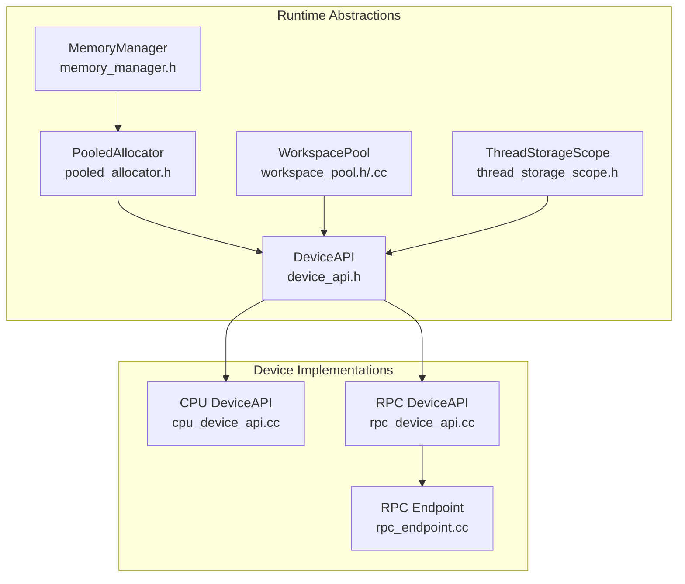
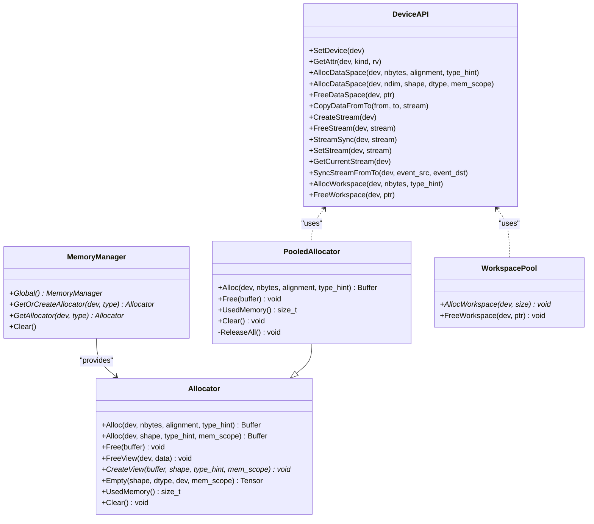
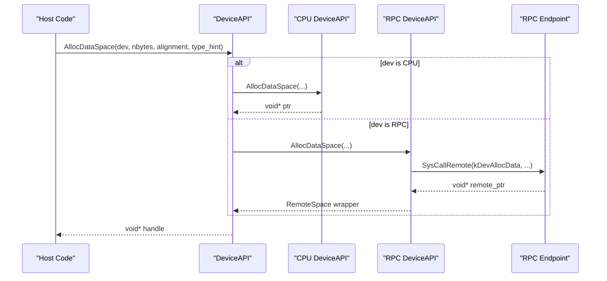
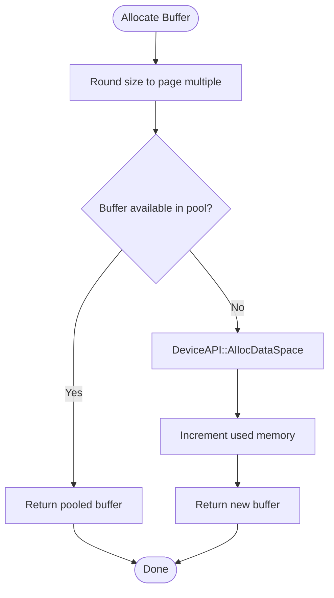
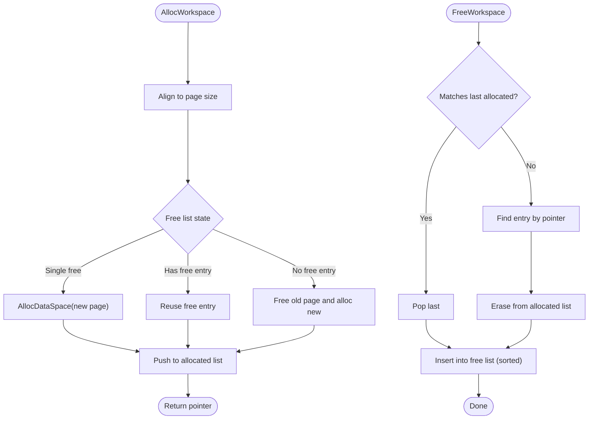
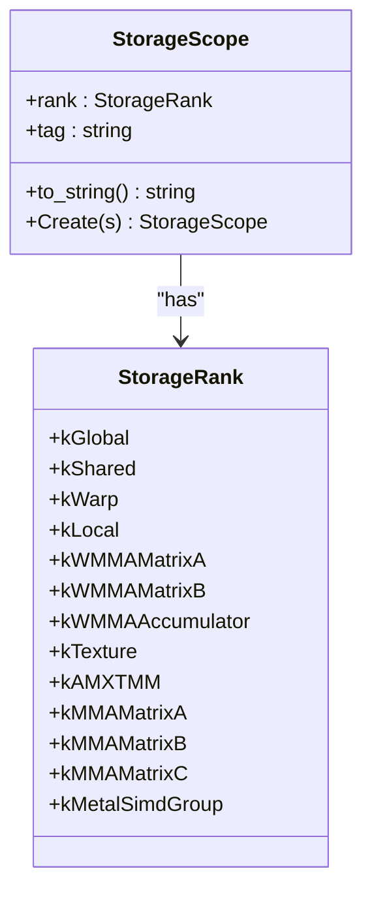
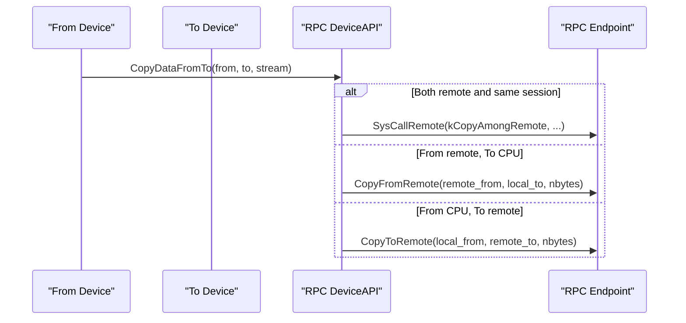
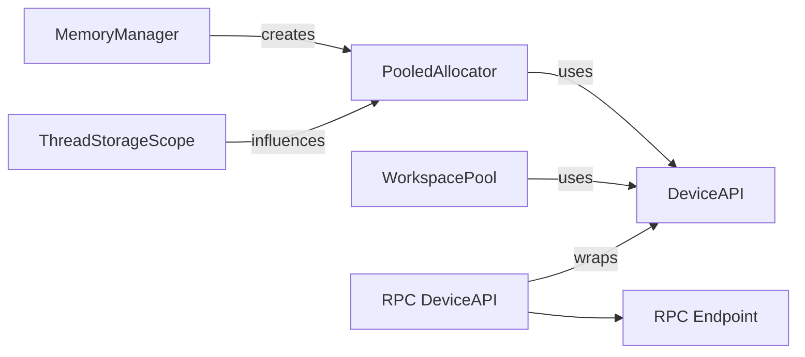

# Memory Management

<cite>
**Referenced Files in This Document**
- [memory_manager.h](file://include/tvm/runtime/memory/memory_manager.h)
- [pooled_allocator.h](file://src/runtime/memory/pooled_allocator.h)
- [workspace_pool.h](file://src/runtime/workspace_pool.h)
- [workspace_pool.cc](file://src/runtime/workspace_pool.cc)
- [device_api.h](file://include/tvm/runtime/device_api.h)
- [cpu_device_api.cc](file://src/runtime/cpu_device_api.cc)
- [rpc_device_api.cc](file://src/runtime/rpc/rpc_device_api.cc)
- [rpc_endpoint.cc](file://src/runtime/rpc/rpc_endpoint.cc)
- [thread_storage_scope.h](file://src/runtime/thread_storage_scope.h)
- [device_target_interactions.rst](file://docs/arch/device_target_interactions.rst)
- [memory_manager_tests.cc](file://tests/cpp/runtime/memory/memory_manager_tests.cc)
</cite>

## Table of Contents
1. [Introduction](#introduction)
2. [Project Structure](#project-structure)
3. [Core Components](#core-components)
4. [Architecture Overview](#architecture-overview)
5. [Detailed Component Analysis](#detailed-component-analysis)
6. [Dependency Analysis](#dependency-analysis)
7. [Performance Considerations](#performance-considerations)
8. [Troubleshooting Guide](#troubleshooting-guide)
9. [Conclusion](#conclusion)
10. [Appendices](#appendices)

## Introduction
This document explains TVM’s memory management system with a focus on hierarchical allocation across devices (CPU, GPU, and specialized accelerators), workspace pools, thread-local allocators, and cross-device memory transfers. It covers allocator interfaces, device memory management, memory planning and allocation policies, garbage collection and resource cleanup, and practical patterns for efficient deployments. Guidance on debugging, leak detection, and best practices is included.

## Project Structure
TVM’s memory subsystem is organized around:
- A unified device abstraction and device API for memory allocation, freeing, and cross-device copies.
- A flexible memory manager that exposes allocator interfaces and supports both naive and pooled allocators.
- A workspace pool optimized for temporary, per-operator intermediate allocations with strict LIFO semantics.
- Thread storage scopes that define memory hierarchy ranks (global, shared, local, and specialized scopes) for kernels and accelerators.
- RPC device API and endpoint implementations for remote memory allocation and transfers.

**Diagram sources**
- [device_api.h:128-310](file://include/tvm/runtime/device_api.h#L128-L310)
- [memory_manager.h:129-156](file://include/tvm/runtime/memory/memory_manager.h#L129-L156)
- [pooled_allocator.h:39-126](file://src/runtime/memory/pooled_allocator.h#L39-L126)
- [workspace_pool.h:45-77](file://src/runtime/workspace_pool.h#L45-L77)
- [workspace_pool.cc:34-134](file://src/runtime/workspace_pool.cc#L34-L134)
- [thread_storage_scope.h:42-190](file://src/runtime/thread_storage_scope.h#L42-L190)
- [cpu_device_api.cc:95-109](file://src/runtime/cpu_device_api.cc#L95-L109)
- [rpc_device_api.cc:47-113](file://src/runtime/rpc/rpc_device_api.cc#L47-L113)
- [rpc_endpoint.cc:1191-1235](file://src/runtime/rpc/rpc_endpoint.cc#L1191-L1235)

**Section sources**
- [device_api.h:128-310](file://include/tvm/runtime/device_api.h#L128-L310)
- [memory_manager.h:129-156](file://include/tvm/runtime/memory/memory_manager.h#L129-L156)
- [pooled_allocator.h:39-126](file://src/runtime/memory/pooled_allocator.h#L39-L126)
- [workspace_pool.h:45-77](file://src/runtime/workspace_pool.h#L45-L77)
- [workspace_pool.cc:34-134](file://src/runtime/workspace_pool.cc#L34-L134)
- [thread_storage_scope.h:42-190](file://src/runtime/thread_storage_scope.h#L42-L190)
- [cpu_device_api.cc:95-109](file://src/runtime/cpu_device_api.cc#L95-L109)
- [rpc_device_api.cc:47-113](file://src/runtime/rpc/rpc_device_api.cc#L47-L113)
- [rpc_endpoint.cc:1191-1235](file://src/runtime/rpc/rpc_endpoint.cc#L1191-L1235)

## Core Components
- DeviceAPI: Abstracts device memory management, including AllocDataSpace, FreeDataSpace, AllocWorkspace, FreeWorkspace, and cross-device copy operations. It defines alignment constants and stream synchronization primitives.
- MemoryManager: Provides a global registry of allocators keyed by device and allocator type, enabling retrieval or creation of device-specific allocators.
- PooledAllocator: Implements a pooled allocator that reuses device memory pages sized to multiples of a configurable page size, reducing allocation overhead and fragmentation.
- WorkspacePool: Manages temporary workspace allocations with page-aligned sizes and LIFO semantics, optimized for frequent small allocations and predictable lifetimes.
- ThreadStorageScope: Defines memory hierarchy ranks (global, shared, local, warp, texture, MMA/WMMA, Metal SIMD group, etc.) and parsing helpers for storage scopes.
- RPC DeviceAPI and Endpoint: Enable remote memory allocation and transfers across sessions, with masking/unmasking of device types and segmented copy routines.

**Section sources**
- [device_api.h:128-310](file://include/tvm/runtime/device_api.h#L128-L310)
- [memory_manager.h:129-156](file://include/tvm/runtime/memory/memory_manager.h#L129-L156)
- [pooled_allocator.h:39-126](file://src/runtime/memory/pooled_allocator.h#L39-L126)
- [workspace_pool.h:45-77](file://src/runtime/workspace_pool.h#L45-L77)
- [workspace_pool.cc:34-134](file://src/runtime/workspace_pool.cc#L34-L134)
- [thread_storage_scope.h:42-190](file://src/runtime/thread_storage_scope.h#L42-L190)
- [rpc_device_api.cc:47-113](file://src/runtime/rpc/rpc_device_api.cc#L47-L113)
- [rpc_endpoint.cc:1191-1235](file://src/runtime/rpc/rpc_endpoint.cc#L1191-L1235)

## Architecture Overview
The memory management architecture separates concerns:
- Device abstraction: DeviceAPI defines the contract for memory operations and streams.
- Allocator layer: MemoryManager exposes Allocator instances; PooledAllocator implements reusable page-based allocation.
- Temporary workspace: WorkspacePool provides device-local, per-device-id pools with LIFO semantics.
- Scope-awareness: ThreadStorageScope maps thread/work-group contexts to memory ranks for kernels and accelerators.
- Cross-device: RPC DeviceAPI and endpoint translate and segment cross-session memory operations.

**Diagram sources**
- [device_api.h:128-310](file://include/tvm/runtime/device_api.h#L128-L310)
- [memory_manager.h:129-156](file://include/tvm/runtime/memory/memory_manager.h#L129-L156)
- [pooled_allocator.h:39-126](file://src/runtime/memory/pooled_allocator.h#L39-L126)
- [workspace_pool.h:45-77](file://src/runtime/workspace_pool.h#L45-L77)

## Detailed Component Analysis

### Device Memory Management and Cross-Device Transfers
- DeviceAPI defines:
  - Data space allocation/free with alignment and optional shape/type hints.
  - Workspace allocation for temporaries with stack-like semantics.
  - Stream creation/sync and cross-stream synchronization.
  - Cross-device copy via CopyDataFromTo with optional streams.
- CPU DeviceAPI implements aligned host allocations and queries total physical memory.
- RPC DeviceAPI and Endpoint:
  - Wrap remote device pointers and forward calls to remote DeviceAPI.
  - Segment large transfers into blocks respecting RPC packet overhead and max transfer size.
  - Support masked device types for RPC sessions and unmasking for server-side operations.

**Diagram sources**
- [device_api.h:164-190](file://include/tvm/runtime/device_api.h#L164-L190)
- [cpu_device_api.cc:95-109](file://src/runtime/cpu_device_api.cc#L95-L109)
- [rpc_device_api.cc:47-69](file://src/runtime/rpc/rpc_device_api.cc#L47-L69)
- [rpc_endpoint.cc:1191-1194](file://src/runtime/rpc/rpc_endpoint.cc#L1191-L1194)

**Section sources**
- [device_api.h:164-190](file://include/tvm/runtime/device_api.h#L164-L190)
- [cpu_device_api.cc:95-109](file://src/runtime/cpu_device_api.cc#L95-L109)
- [rpc_device_api.cc:47-113](file://src/runtime/rpc/rpc_device_api.cc#L47-L113)
- [rpc_endpoint.cc:1136-1235](file://src/runtime/rpc/rpc_endpoint.cc#L1136-L1235)

### Memory Manager and Allocators
- MemoryManager:
  - Global registry keyed by Device and AllocatorType.
  - GetOrCreateAllocator and GetAllocator provide per-device allocator instances.
- Allocator:
  - Abstract interface for Buffer allocation and Tensor creation with optional memory scopes.
  - FreeView and CreateView enable scoped views over buffers.
- PooledAllocator:
  - Rounds up requested size to a fixed page size and reuses buffers from an internal pool.
  - Uses DeviceAPI to allocate/free device memory and tracks used memory atomically.
  - On allocation failure, attempts to release all unused buffers and retry.

**Diagram sources**
- [pooled_allocator.h:48-74](file://src/runtime/memory/pooled_allocator.h#L48-L74)
- [pooled_allocator.h:108-119](file://src/runtime/memory/pooled_allocator.h#L108-L119)

**Section sources**
- [memory_manager.h:129-156](file://include/tvm/runtime/memory/memory_manager.h#L129-L156)
- [pooled_allocator.h:39-126](file://src/runtime/memory/pooled_allocator.h#L39-L126)

### Workspace Pool: Temporary Allocations
- WorkspacePool:
  - Per-device-id pools of page-aligned temporary buffers.
  - Allocation aligns to a fixed page size and either reuses a free entry or allocates a new page.
  - Free follows LIFO semantics with smallest-fit reuse when possible.
  - Release frees all pooled pages for a device.
- Assumptions:
  - Few allocations, reverse-release order, repeated allocation patterns across runs.

**Diagram sources**
- [workspace_pool.cc:46-86](file://src/runtime/workspace_pool.cc#L46-L86)
- [workspace_pool.cc:88-115](file://src/runtime/workspace_pool.cc#L88-L115)

**Section sources**
- [workspace_pool.h:45-77](file://src/runtime/workspace_pool.h#L45-L77)
- [workspace_pool.cc:34-134](file://src/runtime/workspace_pool.cc#L34-L134)

### Thread Storage Scopes and Device-Specific Optimizations
- ThreadStorageScope:
  - Defines memory hierarchy ranks (global, shared, warp, local, texture, MMA/WMMA, Metal SIMD group).
  - Parses storage scope strings and maps to ranks for kernels and accelerators.
- Device-specific optimizations:
  - Alignment constants (alloc and temp allocation) ensure optimal access patterns.
  - Streams and stream synchronization enable asynchronous transfers and kernel scheduling.
  - Memory scope hints allow allocators to select appropriate memory pools (e.g., managed, unified, or accelerator-local).

**Diagram sources**
- [thread_storage_scope.h:42-190](file://src/runtime/thread_storage_scope.h#L42-L190)

**Section sources**
- [thread_storage_scope.h:42-190](file://src/runtime/thread_storage_scope.h#L42-L190)
- [device_api.h:103-123](file://include/tvm/runtime/device_api.h#L103-L123)

### Cross-Device Memory Transfers
- CopyDataFromTo supports:
  - Same-device transfers with optional streams.
  - Cross-device transfers with byte offsets and type hints.
- RPC path:
  - Mask/unmask device types for session routing.
  - Segment large transfers into blocks to respect RPC overhead and max transfer size.
  - CopyToRemote/CopyFromRemote handle segmented copies and byte offsets.

**Diagram sources**
- [device_api.h:192-201](file://include/tvm/runtime/device_api.h#L192-L201)
- [rpc_device_api.cc:81-113](file://src/runtime/rpc/rpc_device_api.cc#L81-L113)
- [rpc_endpoint.cc:1136-1176](file://src/runtime/rpc/rpc_endpoint.cc#L1136-L1176)

**Section sources**
- [device_api.h:192-201](file://include/tvm/runtime/device_api.h#L192-L201)
- [rpc_device_api.cc:81-113](file://src/runtime/rpc/rpc_device_api.cc#L81-L113)
- [rpc_endpoint.cc:1136-1176](file://src/runtime/rpc/rpc_endpoint.cc#L1136-L1176)

## Dependency Analysis
- MemoryManager depends on Device and AllocatorType to construct per-device allocator instances.
- PooledAllocator depends on DeviceAPI for device memory operations and uses a recursive mutex for thread safety.
- WorkspacePool depends on DeviceAPI for AllocDataSpace/FreeDataSpace and maintains per-device Pool instances.
- ThreadStorageScope informs kernel launch configuration and memory scope selection.
- RPC DeviceAPI and Endpoint depend on session management and segmentation logic.

**Diagram sources**
- [memory_manager.h:129-156](file://include/tvm/runtime/memory/memory_manager.h#L129-L156)
- [pooled_allocator.h:39-126](file://src/runtime/memory/pooled_allocator.h#L39-L126)
- [workspace_pool.h:45-77](file://src/runtime/workspace_pool.h#L45-L77)
- [thread_storage_scope.h:42-190](file://src/runtime/thread_storage_scope.h#L42-L190)
- [rpc_device_api.cc:47-113](file://src/runtime/rpc/rpc_device_api.cc#L47-L113)
- [rpc_endpoint.cc:1191-1235](file://src/runtime/rpc/rpc_endpoint.cc#L1191-L1235)

**Section sources**
- [memory_manager.h:129-156](file://include/tvm/runtime/memory/memory_manager.h#L129-L156)
- [pooled_allocator.h:39-126](file://src/runtime/memory/pooled_allocator.h#L39-L126)
- [workspace_pool.h:45-77](file://src/runtime/workspace_pool.h#L45-L77)
- [thread_storage_scope.h:42-190](file://src/runtime/thread_storage_scope.h#L42-L190)
- [rpc_device_api.cc:47-113](file://src/runtime/rpc/rpc_device_api.cc#L47-L113)
- [rpc_endpoint.cc:1191-1235](file://src/runtime/rpc/rpc_endpoint.cc#L1191-L1235)

## Performance Considerations
- Page-alignment and pooling:
  - WorkspacePool and PooledAllocator round sizes to page boundaries to reduce fragmentation and improve reuse.
- LIFO allocation:
  - WorkspacePool assumes reverse-release order, minimizing free-list churn.
- Stream-based asynchronous operations:
  - Use streams and StreamSync to overlap transfers and compute.
- Scope-aware allocation:
  - Select memory scopes (managed, unified, accelerator-local) to minimize copies.
- RPC transfer segmentation:
  - Break large transfers into blocks to respect RPC overhead and bandwidth.

[No sources needed since this section provides general guidance]

## Troubleshooting Guide
- Leak detection:
  - Use UsedMemory on allocators to track current usage and verify zero at teardown.
  - Tests demonstrate basic lifecycle checks for naive allocator usage.
- Resource cleanup:
  - PooledAllocator::ReleaseAll frees all pooled buffers and resets counters.
  - WorkspacePool::Release frees all pooled pages for a device.
- RPC failures:
  - RPC DeviceAPI catches exceptions during remote frees for fault tolerance.
- Validation:
  - Ensure device attributes (e.g., total/global memory) are queried correctly before allocation.

**Section sources**
- [memory_manager_tests.cc:51-59](file://tests/cpp/runtime/memory/memory_manager_tests.cc#L51-L59)
- [pooled_allocator.h:108-119](file://src/runtime/memory/pooled_allocator.h#L108-L119)
- [workspace_pool.cc:117-122](file://src/runtime/workspace_pool.cc#L117-L122)
- [rpc_device_api.cc:70-79](file://src/runtime/rpc/rpc_device_api.cc#L70-L79)

## Conclusion
TVM’s memory management combines a robust device abstraction, allocator interfaces, and device-specific optimizations to support efficient multi-device execution. Workspace pools and thread storage scopes tailor memory usage to kernel execution models, while RPC integrations enable seamless cross-session memory operations. By leveraging page-aligned pooling, LIFO workspace semantics, and stream-based asynchronous transfers, deployments can achieve strong performance and reliability.

[No sources needed since this section summarizes without analyzing specific files]

## Appendices

### Practical Allocation Patterns and Examples
- Temporary workspace:
  - Use WorkspacePool for short-lived intermediates within operators; expect LIFO semantics.
- Persistent buffers:
  - Use PooledAllocator for frequently reused buffers; it rounds sizes to page multiples and reuses memory.
- Scoped allocations:
  - Use memory scopes (e.g., managed, unified) to minimize cross-device copies.
- Cross-device transfers:
  - Use CopyDataFromTo with streams; for RPC, rely on segmented transfers handled by RPC DeviceAPI/Endpoint.

**Section sources**
- [workspace_pool.cc:46-86](file://src/runtime/workspace_pool.cc#L46-L86)
- [pooled_allocator.h:48-74](file://src/runtime/memory/pooled_allocator.h#L48-L74)
- [device_api.h:192-201](file://include/tvm/runtime/device_api.h#L192-L201)
- [rpc_device_api.cc:81-113](file://src/runtime/rpc/rpc_device_api.cc#L81-L113)
- [rpc_endpoint.cc:1136-1176](file://src/runtime/rpc/rpc_endpoint.cc#L1136-L1176)

### Memory Planning and Allocation Policies
- Policy highlights:
  - Prefer pooled allocation for repeated shapes and sizes.
  - Align allocations to page boundaries for hardware efficiency.
  - Use workspace pools for temporaries with predictable lifecycles.
  - Select memory scopes based on device capabilities and data movement costs.
- References:
  - Device API alignment and workspace policy comments.
  - Workspace pool assumptions documented in header comments.

**Section sources**
- [device_api.h:249-271](file://include/tvm/runtime/device_api.h#L249-L271)
- [workspace_pool.h:34-44](file://src/runtime/workspace_pool.h#L34-L44)