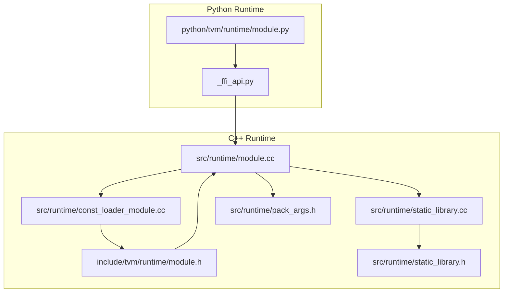
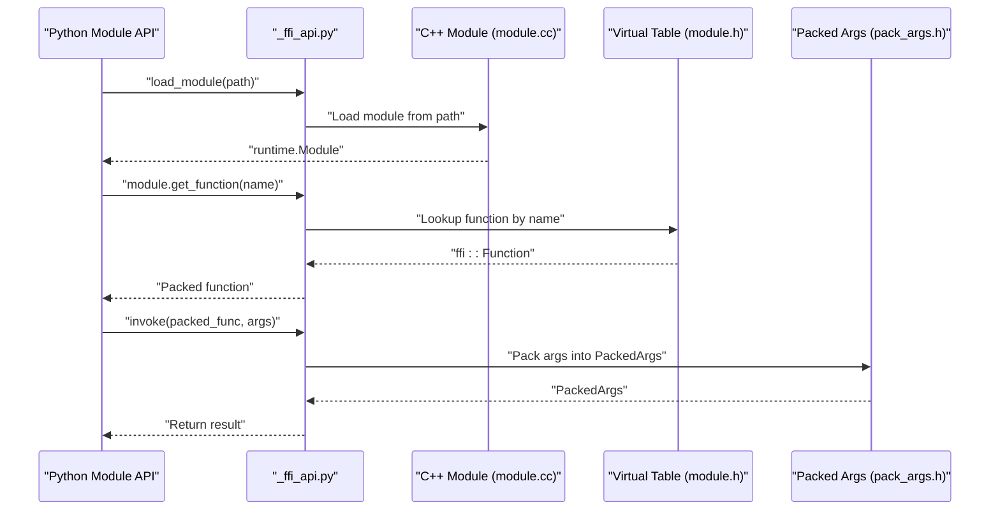
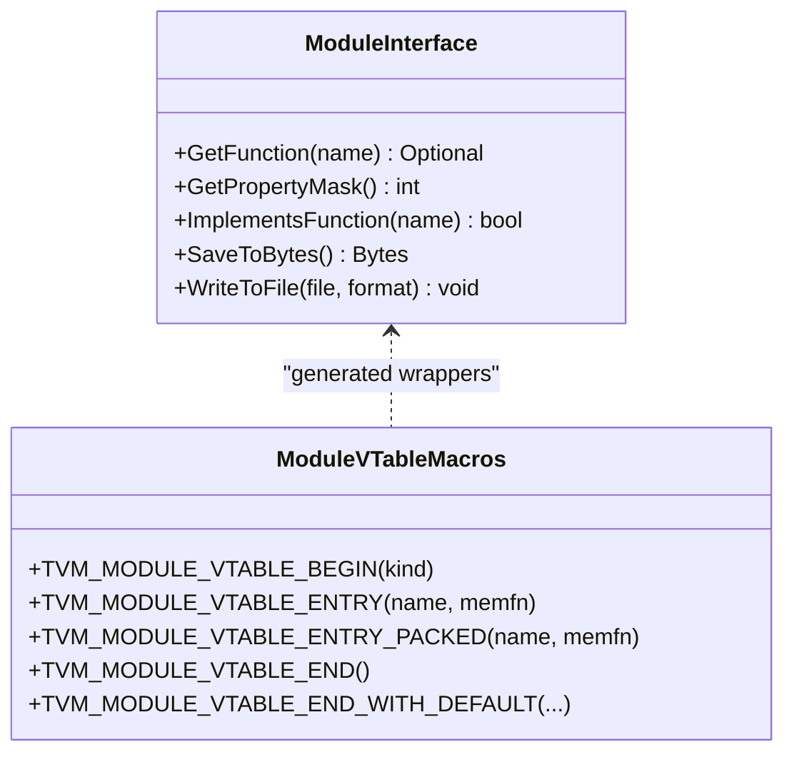
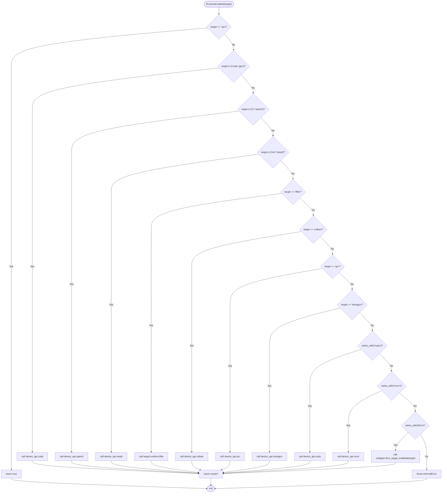
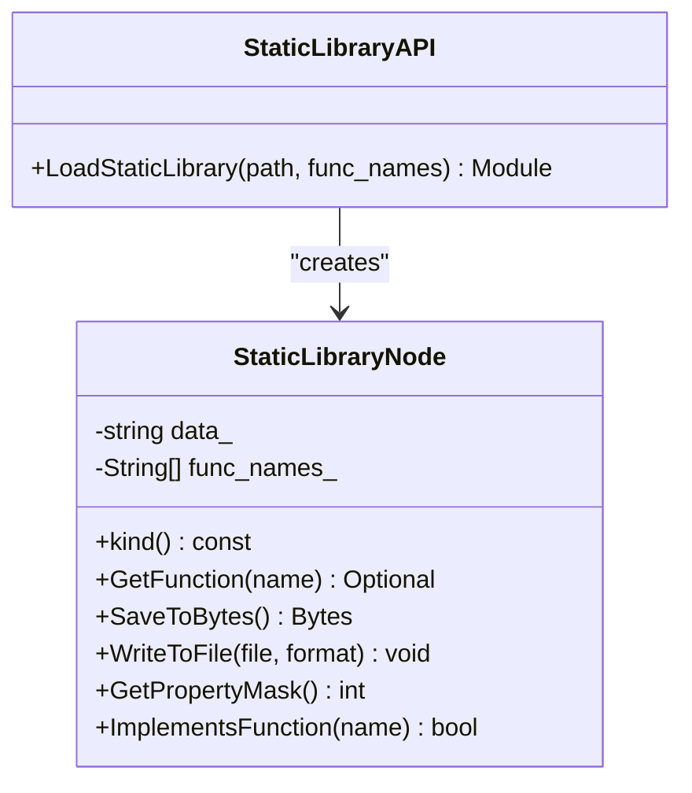
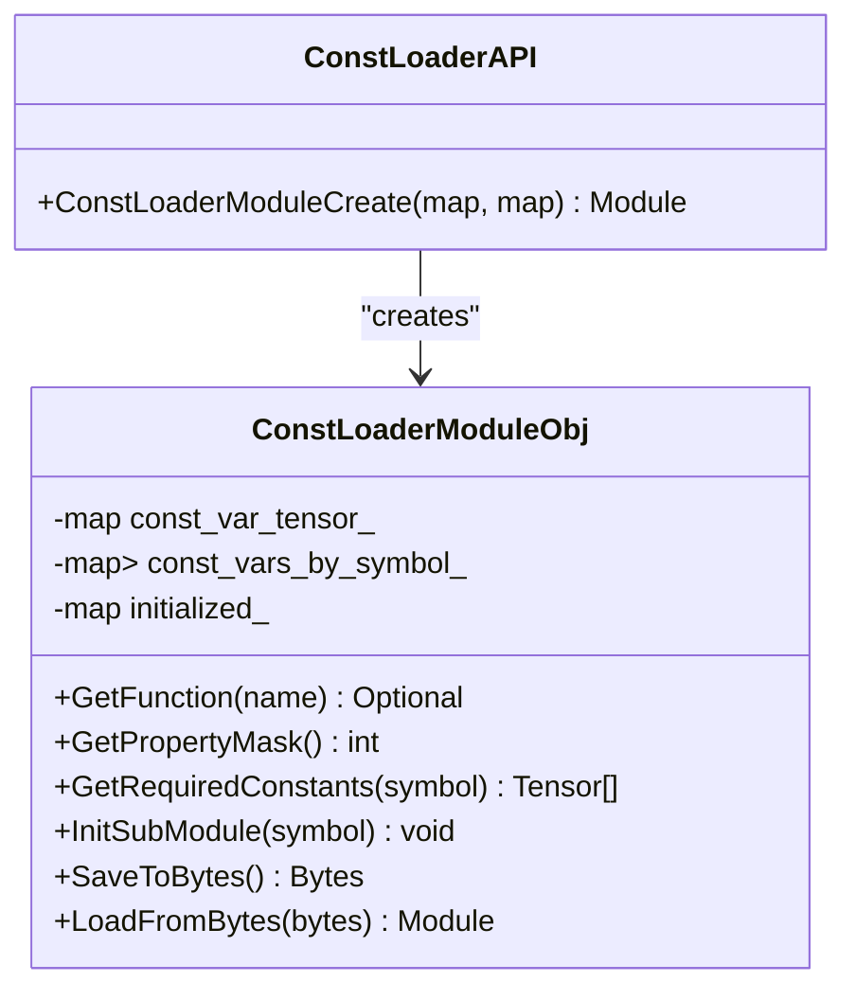
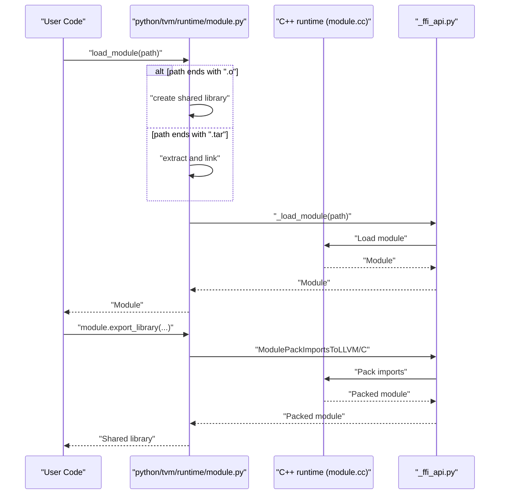
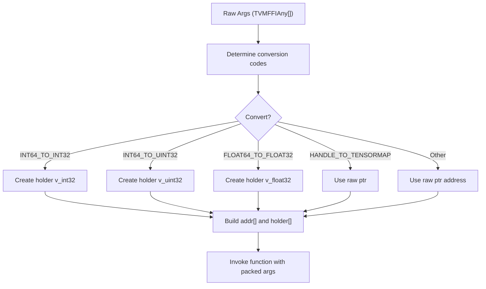
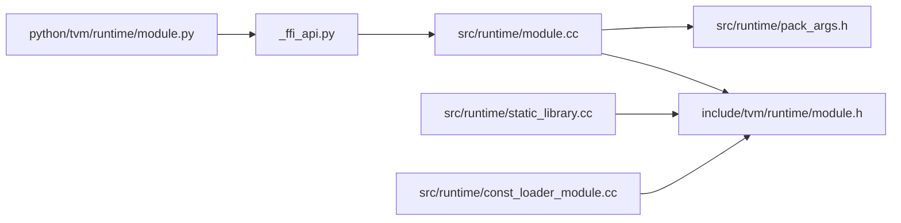

# Module Loading and Execution

<cite>
**Referenced Files in This Document**
- [module.h](file://include/tvm/runtime/module.h)
- [module.cc](file://src/runtime/module.cc)
- [static_library.h](file://src/runtime/static_library.h)
- [static_library.cc](file://src/runtime/static_library.cc)
- [const_loader_module.cc](file://src/runtime/const_loader_module.cc)
- [module.py](file://python/tvm/runtime/module.py)
- [_ffi_api.py](file://python/tvm/runtime/_ffi_api.py)
- [pack_args.h](file://src/runtime/pack_args.h)
</cite>

## Table of Contents
1. [Introduction](#introduction)
2. [Project Structure](#project-structure)
3. [Core Components](#core-components)
4. [Architecture Overview](#architecture-overview)
5. [Detailed Component Analysis](#detailed-component-analysis)
6. [Dependency Analysis](#dependency-analysis)
7. [Performance Considerations](#performance-considerations)
8. [Troubleshooting Guide](#troubleshooting-guide)
9. [Conclusion](#conclusion)
10. [Appendices](#appendices)

## Introduction
This document explains TVM’s module loading and execution system: how compiled functions are packaged into runtime modules, how modules are dynamically loaded and dispatched, and how the unified API supports heterogeneous backends and conventions. It covers the module lifecycle from compilation to execution, including static library integration, runtime-enabled checks, module creation and function lookup, cross-language interoperability via FFI, virtual table dispatch, packed function wrapping, memory management integration, and serialization/deserialization for deployment across platforms.

## Project Structure
At a high level, the module system spans:
- C++ runtime headers and implementations for the module interface, static libraries, and constant loader modules
- Python runtime bindings that expose module loading, packaging, and evaluation utilities
- FFI glue that bridges Python and C++ runtime modules

**Diagram sources**
- [module.py:107-506](file://python/tvm/runtime/module.py#L107-L506)
- [_ffi_api.py:19-23](file://python/tvm/runtime/_ffi_api.py#L19-L23)
- [module.h:26-139](file://include/tvm/runtime/module.h#L26-L139)
- [module.cc:24-94](file://src/runtime/module.cc#L24-L94)
- [static_library.h:1-200](file://src/runtime/static_library.h#L1-L200)
- [static_library.cc:25-144](file://src/runtime/static_library.cc#L25-L144)
- [const_loader_module.cc:30-266](file://src/runtime/const_loader_module.cc#L30-L266)
- [pack_args.h:158-201](file://src/runtime/pack_args.h#L158-L201)

**Section sources**
- [module.py:107-506](file://python/tvm/runtime/module.py#L107-L506)
- [module.h:26-139](file://include/tvm/runtime/module.h#L26-L139)
- [module.cc:24-94](file://src/runtime/module.cc#L24-L94)
- [static_library.cc:25-144](file://src/runtime/static_library.cc#L25-L144)
- [const_loader_module.cc:30-266](file://src/runtime/const_loader_module.cc#L30-L266)
- [pack_args.h:158-201](file://src/runtime/pack_args.h#L158-L201)

## Core Components
- Runtime module interface and virtual table macros: define the module contract and dispatch mechanism for function lookup and invocation.
- Runtime-enabled checks: gate optional runtimes by target and availability of device backends.
- Static library module: embed precompiled object files with explicit function names and enable binary serialization.
- Constant loader module: initialize imported submodules with constant tensors and support serialization.
- Python module API: load modules, export libraries, evaluate performance, and check runtime availability.
- Packed function argument packing: bridge heterogeneous argument types into a uniform packed representation.

**Section sources**
- [module.h:40-139](file://include/tvm/runtime/module.h#L40-L139)
- [module.cc:38-88](file://src/runtime/module.cc#L38-L88)
- [static_library.cc:48-140](file://src/runtime/static_library.cc#L48-L140)
- [const_loader_module.cc:50-262](file://src/runtime/const_loader_module.cc#L50-L262)
- [module.py:107-506](file://python/tvm/runtime/module.py#L107-L506)
- [pack_args.h:158-201](file://src/runtime/pack_args.h#L158-L201)

## Architecture Overview
The module system provides a unified runtime container for compiled functions. Modules can be dynamically loaded from files, constructed from static libraries, or composed from imported submodules. Function dispatch uses a virtual table mechanism that wraps member functions into packed functions. Serialization enables deployment across platforms.

**Diagram sources**
- [module.py:418-462](file://python/tvm/runtime/module.py#L418-L462)
- [_ffi_api.py:19-23](file://python/tvm/runtime/_ffi_api.py#L19-L23)
- [module.cc:24-94](file://src/runtime/module.cc#L24-L94)
- [module.h:108-136](file://include/tvm/runtime/module.h#L108-L136)
- [pack_args.h:158-201](file://src/runtime/pack_args.h#L158-L201)

## Detailed Component Analysis

### Runtime Module Container and Virtual Table Dispatch
- The module interface defines a virtual table macro system to bind member functions to string-dispatched functions. The macros generate wrappers that unpack packed arguments and call into the underlying method, returning a packed result.
- The virtual table entry helpers support both const and non-const member functions, with and without return values, ensuring type-safe dispatch.

**Diagram sources**
- [module.h:108-136](file://include/tvm/runtime/module.h#L108-L136)

**Section sources**
- [module.h:60-136](file://include/tvm/runtime/module.h#L60-L136)

### Runtime-Enabled Checks
- The runtime-enabled function inspects the target string and resolves device backends or codegen capabilities. It returns whether a given runtime is available by checking global function presence.

**Diagram sources**
- [module.cc:38-69](file://src/runtime/module.cc#L38-L69)

**Section sources**
- [module.cc:38-88](file://src/runtime/module.cc#L38-L88)

### Static Library Integration
- The static library module encapsulates a precompiled object file and exposes a fixed set of function names. It supports binary serialization and file writing, and integrates with the module export pipeline.

**Diagram sources**
- [static_library.cc:48-140](file://src/runtime/static_library.cc#L48-L140)

**Section sources**
- [static_library.cc:48-140](file://src/runtime/static_library.cc#L48-L140)
- [static_library.h:1-200](file://src/runtime/static_library.h#L1-L200)

### Constant Loader Module
- The constant loader module initializes imported submodules with constant tensors and exposes a function to retrieve all constants. It supports serialization and acts as a bridge between code and metadata.

**Diagram sources**
- [const_loader_module.cc:50-262](file://src/runtime/const_loader_module.cc#L50-L262)

**Section sources**
- [const_loader_module.cc:50-262](file://src/runtime/const_loader_module.cc#L50-L262)

### Python Module API: Loading, Exporting, and Evaluation
- The Python module API provides:
  - Loading modules from files, including automatic handling of .o and .tar artifacts
  - Exporting modules into a single device library with optional packing of imports
  - Enabling/disabling runtime per target
  - Time evaluation utilities for performance measurement

**Diagram sources**
- [module.py:418-462](file://python/tvm/runtime/module.py#L418-L462)
- [module.py:147-318](file://python/tvm/runtime/module.py#L147-L318)
- [_ffi_api.py:19-23](file://python/tvm/runtime/_ffi_api.py#L19-L23)
- [module.cc:24-94](file://src/runtime/module.cc#L24-L94)

**Section sources**
- [module.py:107-506](file://python/tvm/runtime/module.py#L107-L506)
- [_ffi_api.py:19-23](file://python/tvm/runtime/_ffi_api.py#L19-L23)

### Packed Function Wrapping and Argument Packing
- Packed functions unify heterogeneous argument types into a single packed representation. The argument packing logic converts raw arguments into typed holders and addresses, enabling safe invocation across language boundaries.

**Diagram sources**
- [pack_args.h:158-201](file://src/runtime/pack_args.h#L158-L201)

**Section sources**
- [pack_args.h:158-201](file://src/runtime/pack_args.h#L158-L201)

## Dependency Analysis
- Python module API depends on the FFI runtime namespace to resolve module loading and evaluation functions.
- C++ runtime module relies on FFI reflection and registry to register global functions and context symbols.
- Static library and constant loader modules depend on the module interface and serialization utilities.
- Virtual table macros depend on packed function wrappers to dispatch to member functions.

**Diagram sources**
- [module.py:107-506](file://python/tvm/runtime/module.py#L107-L506)
- [_ffi_api.py:19-23](file://python/tvm/runtime/_ffi_api.py#L19-L23)
- [module.cc:24-94](file://src/runtime/module.cc#L24-L94)
- [module.h:26-139](file://include/tvm/runtime/module.h#L26-L139)
- [static_library.cc:25-144](file://src/runtime/static_library.cc#L25-L144)
- [const_loader_module.cc:30-266](file://src/runtime/const_loader_module.cc#L30-L266)
- [pack_args.h:158-201](file://src/runtime/pack_args.h#L158-L201)

**Section sources**
- [module.py:107-506](file://python/tvm/runtime/module.py#L107-L506)
- [_ffi_api.py:19-23](file://python/tvm/runtime/_ffi_api.py#L19-L23)
- [module.cc:24-94](file://src/runtime/module.cc#L24-L94)
- [module.h:26-139](file://include/tvm/runtime/module.h#L26-L139)
- [static_library.cc:25-144](file://src/runtime/static_library.cc#L25-L144)
- [const_loader_module.cc:30-266](file://src/runtime/const_loader_module.cc#L30-L266)
- [pack_args.h:158-201](file://src/runtime/pack_args.h#L158-L201)

## Performance Considerations
- Prefer exporting modules with a single device library to minimize dynamic linking overhead and improve startup latency.
- Use time evaluation utilities to profile function performance and tune workload parameters.
- Leverage runtime-enabled checks to avoid unnecessary initialization of unavailable backends.
- Serialize modules to reduce deployment size and enable offline optimization.

## Troubleshooting Guide
- Runtime not enabled for target: Verify device backend availability and target string correctness.
- Unknown optional runtime: Ensure the appropriate device API or codegen function is registered.
- Static library not relocatable: Confirm function names are explicitly provided and module supports binary serialization.
- Constant loader initialization failure: Ensure required constants are present and initialization functions are named consistently.

**Section sources**
- [module.cc:38-88](file://src/runtime/module.cc#L38-L88)
- [static_library.cc:48-140](file://src/runtime/static_library.cc#L48-L140)
- [const_loader_module.cc:140-154](file://src/runtime/const_loader_module.cc#L140-L154)

## Conclusion
TVM’s module system unifies heterogeneous compiled functions behind a consistent runtime interface. Through virtual table dispatch, packed function wrapping, and robust serialization, it supports dynamic loading, cross-language interoperability, and efficient deployment across platforms. The Python API simplifies common tasks like loading, exporting, and evaluating modules, while the C++ runtime enforces type safety and integrates with device backends and memory management.

## Appendices

### Practical Examples (by reference)
- Loading a compiled model and invoking a function:
  - [module.py:418-462](file://python/tvm/runtime/module.py#L418-L462)
- Exporting a module to a single device library:
  - [module.py:147-318](file://python/tvm/runtime/module.py#L147-L318)
- Checking runtime availability:
  - [module.py:471-494](file://python/tvm/runtime/module.py#L471-L494)
  - [module.cc:38-69](file://src/runtime/module.cc#L38-L69)
- Serializing and deserializing modules:
  - [static_library.cc:62-86](file://src/runtime/static_library.cc#L62-L86)
  - [const_loader_module.cc:156-192](file://src/runtime/const_loader_module.cc#L156-L192)
  - [const_loader_module.cc:194-237](file://src/runtime/const_loader_module.cc#L194-L237)