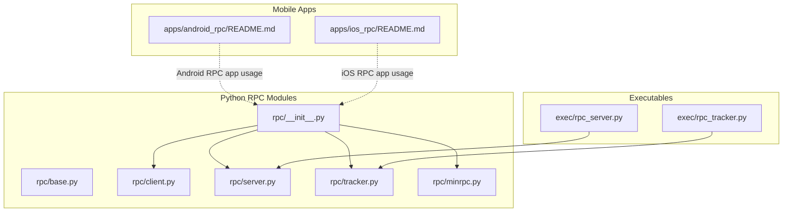
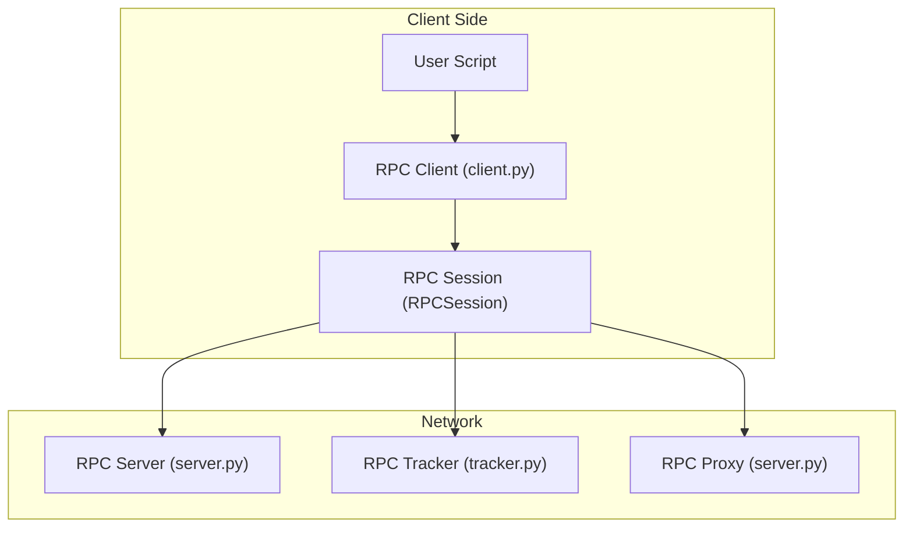
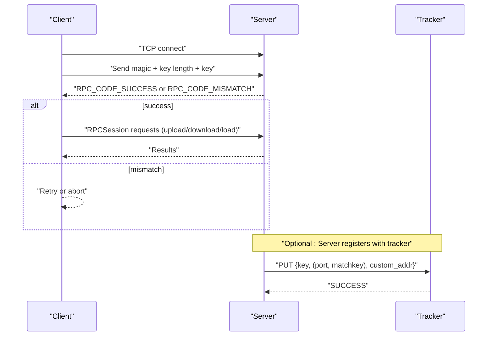
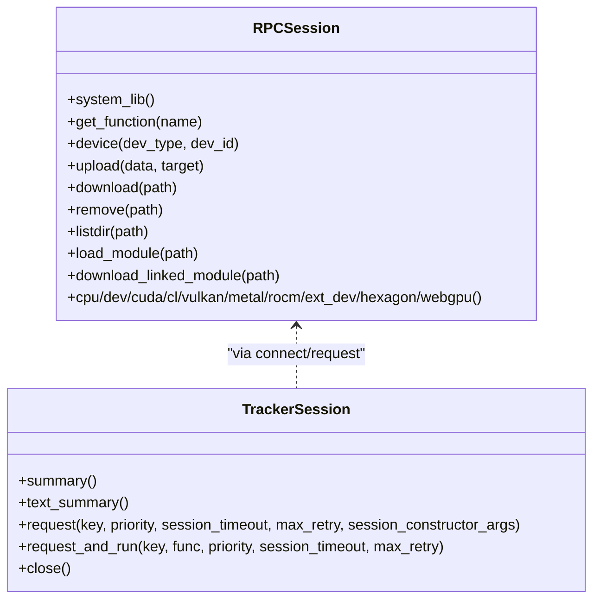
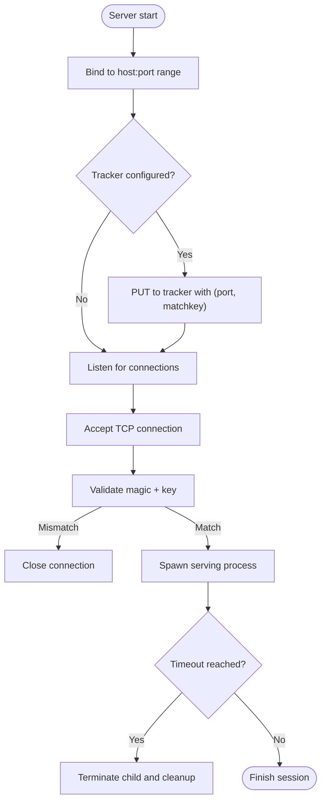
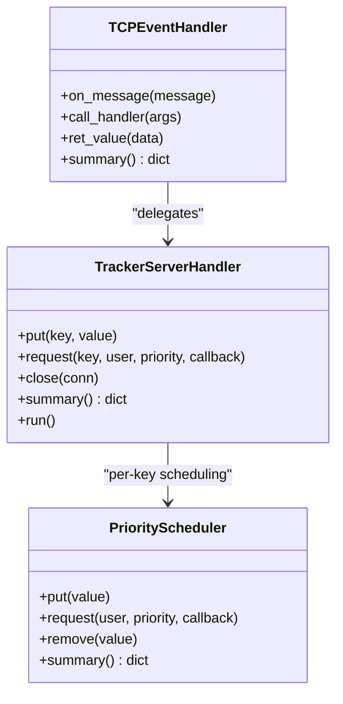
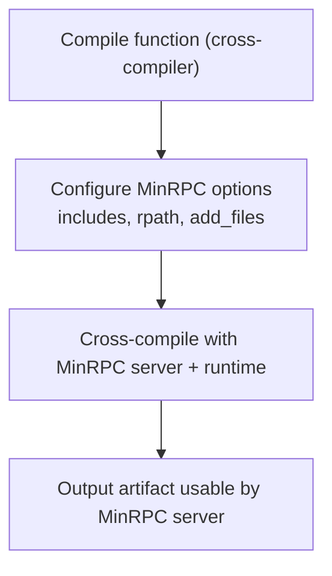
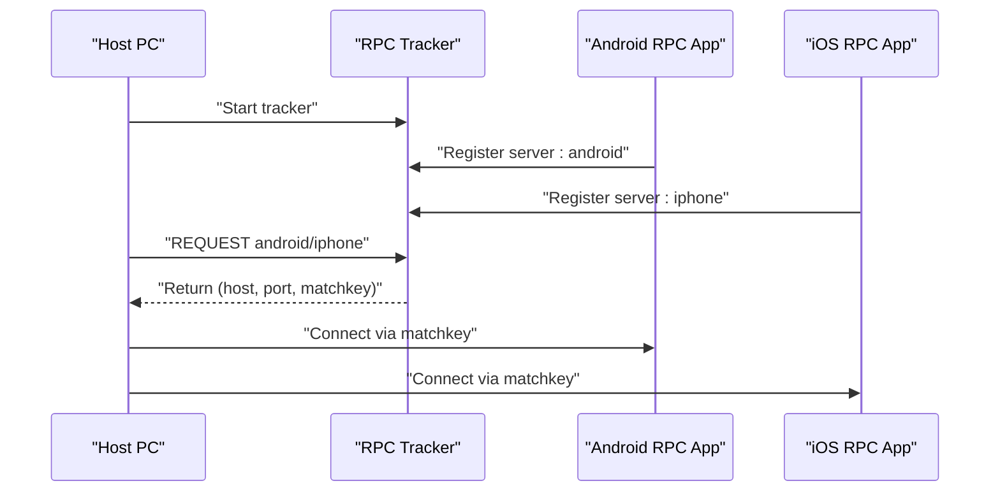
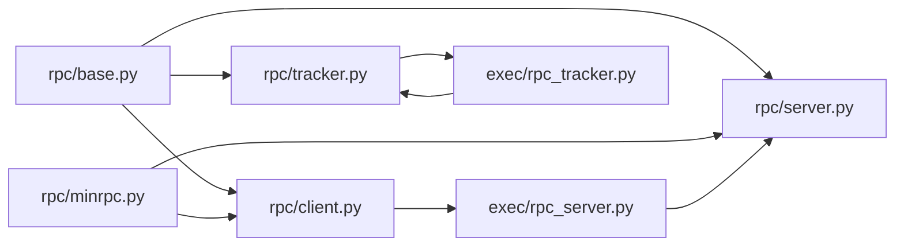

# RPC System

<cite>
**Referenced Files in This Document**
- [__init__.py](file://python/tvm/rpc/__init__.py)
- [base.py](file://python/tvm/rpc/base.py)
- [client.py](file://python/tvm/rpc/client.py)
- [server.py](file://python/tvm/rpc/server.py)
- [tracker.py](file://python/tvm/rpc/tracker.py)
- [minrpc.py](file://python/tvm/rpc/minrpc.py)
- [rpc_server.py](file://python/tvm/exec/rpc_server.py)
- [rpc_tracker.py](file://python/tvm/exec/rpc_tracker.py)
- [rpc.py](file://python/tvm/contrib/rpc.py)
- [README.md (Android RPC)](file://apps/android_rpc/README.md)
- [README.md (iOS RPC)](file://apps/ios_rpc/README.md)
</cite>

## Table of Contents
1. [Introduction](#introduction)
2. [Project Structure](#project-structure)
3. [Core Components](#core-components)
4. [Architecture Overview](#architecture-overview)
5. [Detailed Component Analysis](#detailed-component-analysis)
6. [Dependency Analysis](#dependency-analysis)
7. [Performance Considerations](#performance-considerations)
8. [Troubleshooting Guide](#troubleshooting-guide)
9. [Conclusion](#conclusion)
10. [Appendices](#appendices)

## Introduction
This document explains TVM’s Remote Procedure Call (RPC) system: the client-server architecture, distributed compilation workflows, and the RPC tracker. It covers server registration, client connection management, the RPC protocol and message serialization, transport abstractions, authentication and security considerations, debugging and performance monitoring, and cross-platform deployment including mobile RPC for Android and iOS.

## Project Structure
The RPC system spans Python modules for client, server, tracker, and MinRPC utilities, plus CLI entry points and mobile app integrations.

**Diagram sources**
- [__init__.py:18-38](file://python/tvm/rpc/__init__.py#L18-L38)
- [base.py:30-122](file://python/tvm/rpc/base.py#L30-L122)
- [client.py:37-570](file://python/tvm/rpc/client.py#L37-L570)
- [server.py:18-554](file://python/tvm/rpc/server.py#L18-L554)
- [tracker.py:17-506](file://python/tvm/rpc/tracker.py#L17-L506)
- [minrpc.py:17-90](file://python/tvm/rpc/minrpc.py#L17-L90)
- [rpc_server.py:18-105](file://python/tvm/exec/rpc_server.py#L18-L105)
- [rpc_tracker.py:18-43](file://python/tvm/exec/rpc_tracker.py#L18-L43)
- [README.md (Android RPC):19-171](file://apps/android_rpc/README.md#L19-L171)
- [README.md (iOS RPC):18-257](file://apps/ios_rpc/README.md#L18-L257)

**Section sources**
- [__init__.py:18-38](file://python/tvm/rpc/__init__.py#L18-L38)
- [rpc_server.py:18-105](file://python/tvm/exec/rpc_server.py#L18-L105)
- [rpc_tracker.py:18-43](file://python/tvm/exec/rpc_tracker.py#L18-L43)
- [README.md (Android RPC):19-171](file://apps/android_rpc/README.md#L19-L171)
- [README.md (iOS RPC):18-257](file://apps/ios_rpc/README.md#L18-L257)

## Core Components
- RPC client: connects to servers, manages sessions, uploads/downloads artifacts, loads remote modules, and exposes device handles.
- RPC server: accepts connections, registers with tracker, serves requests, and optionally acts as a proxy.
- RPC tracker: resource scheduler and registry for servers; supports priority queues and pending match keys.
- MinRPC utilities: attach MinRPC server options to compilation functions for lightweight embedded execution.
- Executables: CLI entry points to start RPC server and tracker processes.

Key responsibilities and behaviors are defined in the referenced files below.

**Section sources**
- [client.py:37-570](file://python/tvm/rpc/client.py#L37-L570)
- [server.py:18-554](file://python/tvm/rpc/server.py#L18-L554)
- [tracker.py:17-506](file://python/tvm/rpc/tracker.py#L17-L506)
- [minrpc.py:17-90](file://python/tvm/rpc/minrpc.py#L17-L90)
- [rpc_server.py:18-105](file://python/tvm/exec/rpc_server.py#L18-L105)
- [rpc_tracker.py:18-43](file://python/tvm/exec/rpc_tracker.py#L18-L43)

## Architecture Overview
The RPC system supports three primary deployment modes:
- Direct connection: client connects to a server by host/port.
- Proxy mode: server connects to a proxy and client talks to the proxy.
- Tracker mode: server registers with a tracker; client requests a server via the tracker.

**Diagram sources**
- [client.py:37-570](file://python/tvm/rpc/client.py#L37-L570)
- [server.py:18-554](file://python/tvm/rpc/server.py#L18-L554)
- [tracker.py:17-506](file://python/tvm/rpc/tracker.py#L17-L506)

## Detailed Component Analysis

### RPC Protocol and Message Serialization
- Handshake and framing:
  - Servers and trackers use a magic header to identify RPC control/data planes.
  - Messages are length-prefixed JSON frames for control-plane messages.
- Client-to-server handshake:
  - Client sends magic, key length, and key; server responds with success/mismatch codes and its key.
- Tracker control-plane:
  - Uses JSON messages with integer codes for PUT, REQUEST, PING, UPDATE_INFO, SUMMARY, GET_PENDING_MATCHKEYS, STOP.

**Diagram sources**
- [base.py:30-122](file://python/tvm/rpc/base.py#L30-L122)
- [server.py:181-282](file://python/tvm/rpc/server.py#L181-L282)
- [tracker.py:247-298](file://python/tvm/rpc/tracker.py#L247-L298)

**Section sources**
- [base.py:30-122](file://python/tvm/rpc/base.py#L30-L122)
- [server.py:18-554](file://python/tvm/rpc/server.py#L18-L554)
- [tracker.py:17-506](file://python/tvm/rpc/tracker.py#L17-L506)

### Client Connection Management
- RPCSession encapsulates remote function calls, device construction, and artifact operations (upload/download/remove/listdir/load_module).
- TrackerSession manages tracker connectivity, summary queries, and resource requests with priority and timeouts.
- connect/connect_tracker establish sessions; connect supports optional session constructor arguments and logging.

**Diagram sources**
- [client.py:37-570](file://python/tvm/rpc/client.py#L37-L570)

**Section sources**
- [client.py:37-570](file://python/tvm/rpc/client.py#L37-L570)

### RPC Server Registration and Lifecycle
- Server listens on a configured port range, registers with tracker if provided, and maintains match keys to prevent misuse.
- Accept loop validates client keys and negotiates session options (e.g., timeout).
- Serving spawns a subprocess; timeouts terminate child processes and clean up working directories.

**Diagram sources**
- [server.py:181-282](file://python/tvm/rpc/server.py#L181-L282)

**Section sources**
- [server.py:18-554](file://python/tvm/rpc/server.py#L18-L554)

### RPC Tracker Scheduler and Distribution
- PriorityScheduler queues requests by priority and matches them to available servers.
- TCPEventHandler handles tracker control-plane messages, manages pending match keys, and returns server endpoints to clients.
- Summary and UPDATE_INFO expose queue and server inventory.

**Diagram sources**
- [tracker.py:81-380](file://python/tvm/rpc/tracker.py#L81-L380)

**Section sources**
- [tracker.py:17-506](file://python/tvm/rpc/tracker.py#L17-L506)

### MinRPC and Lightweight Embedded Execution
MinRPC utilities attach MinRPC server options to compilation functions, enabling cross-compilation with minimal runtime overhead. They configure include paths, runtime linkage, and add server sources.

**Diagram sources**
- [minrpc.py:51-90](file://python/tvm/rpc/minrpc.py#L51-L90)

**Section sources**
- [minrpc.py:17-90](file://python/tvm/rpc/minrpc.py#L17-L90)

### Mobile RPC Support (Android and iOS)
- Android RPC app builds an APK that registers with a tracker or runs standalone; tests demonstrate CPU/OpenCL/Vulkan targets.
- iOS RPC app supports three modes: standalone, proxy, and tracker; includes USB muxing for constrained networks.

**Diagram sources**
- [README.md (Android RPC):100-136](file://apps/android_rpc/README.md#L100-L136)
- [README.md (iOS RPC):170-214](file://apps/ios_rpc/README.md#L170-L214)

**Section sources**
- [README.md (Android RPC):19-171](file://apps/android_rpc/README.md#L19-L171)
- [README.md (iOS RPC):18-257](file://apps/ios_rpc/README.md#L18-L257)

## Dependency Analysis
- Python RPC modules are cohesive: client depends on base for protocol primitives, server on base and tracker for registration, tracker on tornado utilities for async networking.
- Executables wrap RPC components for easy startup.
- Mobile apps integrate with tracker and provide usage workflows.

**Diagram sources**
- [base.py:30-122](file://python/tvm/rpc/base.py#L30-L122)
- [client.py:37-570](file://python/tvm/rpc/client.py#L37-L570)
- [server.py:18-554](file://python/tvm/rpc/server.py#L18-L554)
- [tracker.py:17-506](file://python/tvm/rpc/tracker.py#L17-L506)
- [minrpc.py:17-90](file://python/tvm/rpc/minrpc.py#L17-L90)
- [rpc_server.py:18-105](file://python/tvm/exec/rpc_server.py#L18-L105)
- [rpc_tracker.py:18-43](file://python/tvm/exec/rpc_tracker.py#L18-L43)

**Section sources**
- [__init__.py:18-38](file://python/tvm/rpc/__init__.py#L18-L38)
- [rpc.py:18-29](file://python/tvm/contrib/rpc.py#L18-L29)

## Performance Considerations
- Use tracker mode for resource pooling and fair scheduling across heterogeneous devices.
- Prefer MinRPC for lightweight embedded targets to reduce overhead.
- Tune session timeouts to balance resource utilization and responsiveness.
- Monitor tracker summaries to identify bottlenecks and adjust priorities.

[No sources needed since this section provides general guidance]

## Troubleshooting Guide
Common issues and remedies:
- Connection refused or handshake failures:
  - Verify server magic and key format; ensure client key matches server matchkey.
  - Retry with connect_with_retry for transient outages.
- Tracker connectivity:
  - Confirm tracker is reachable and responding to PING; check pending match keys.
  - Re-register server if matchkey becomes stale.
- Timeouts:
  - Increase session_timeout on server; ensure child processes exit cleanly.
- Platform-specific pitfalls:
  - Android/iOS apps require correct target/toolchain setup; verify tracker key and device capabilities.

**Section sources**
- [base.py:169-199](file://python/tvm/rpc/base.py#L169-L199)
- [server.py:181-282](file://python/tvm/rpc/server.py#L181-L282)
- [tracker.py:247-298](file://python/tvm/rpc/tracker.py#L247-L298)
- [README.md (Android RPC):100-136](file://apps/android_rpc/README.md#L100-L136)
- [README.md (iOS RPC):170-214](file://apps/ios_rpc/README.md#L170-L214)

## Conclusion
TVM’s RPC system provides a flexible, extensible framework for distributed compilation and execution. With tracker-based resource management, robust client/server protocols, and MinRPC for lightweight deployments, it supports diverse environments including mobile platforms. Proper configuration of keys, timeouts, and transports ensures secure and efficient operation.

[No sources needed since this section summarizes without analyzing specific files]

## Appendices

### Practical Setup Examples
- Start an RPC tracker:
  - Command-line: [rpc_tracker.py:26-29](file://python/tvm/exec/rpc_tracker.py#L26-L29)
- Start an RPC server:
  - Command-line: [rpc_server.py:26-55](file://python/tvm/exec/rpc_server.py#L26-L55)
- Connect a client:
  - Use [client.py:482-570](file://python/tvm/rpc/client.py#L482-L570) connect/connect_tracker APIs.
- Request resources via tracker:
  - Use [client.py:385-480](file://python/tvm/rpc/client.py#L385-L480) request/request_and_run.

**Section sources**
- [rpc_tracker.py:26-29](file://python/tvm/exec/rpc_tracker.py#L26-L29)
- [rpc_server.py:26-55](file://python/tvm/exec/rpc_server.py#L26-L55)
- [client.py:385-570](file://python/tvm/rpc/client.py#L385-L570)

### Transport Mechanisms and Security Notes
- Transports:
  - TCP sockets for direct and proxy modes; tracker uses JSON over TCP.
  - MinRPC integrates cross-compilation and runtime embedding.
- Authentication and security:
  - The RPC server assumes a trusted network and encrypted channels; it allows full remote code execution and arbitrary file writes. Use firewalls, VPNs, or proxies to protect endpoints.

**Section sources**
- [server.py:476-496](file://python/tvm/rpc/server.py#L476-L496)
- [base.py:30-122](file://python/tvm/rpc/base.py#L30-L122)
- [minrpc.py:17-90](file://python/tvm/rpc/minrpc.py#L17-L90)