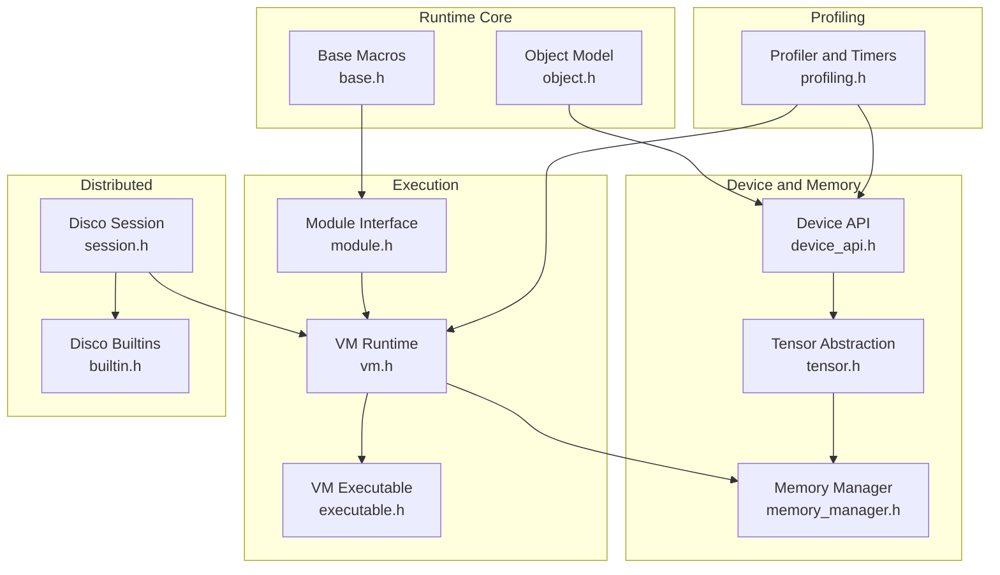
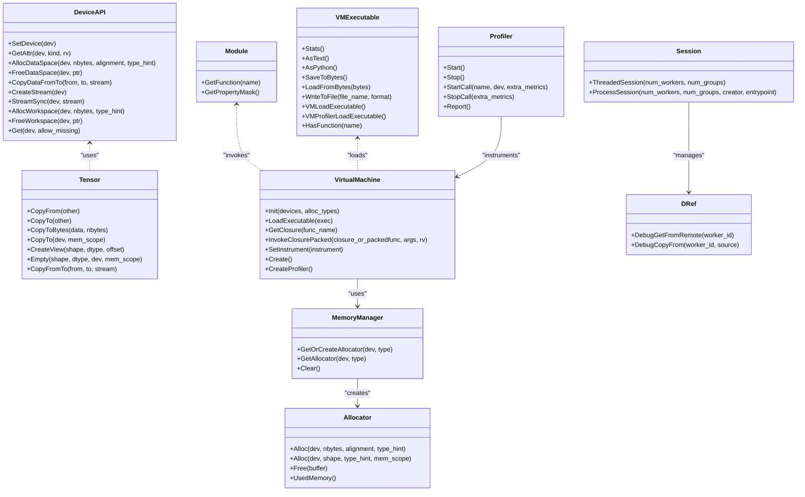
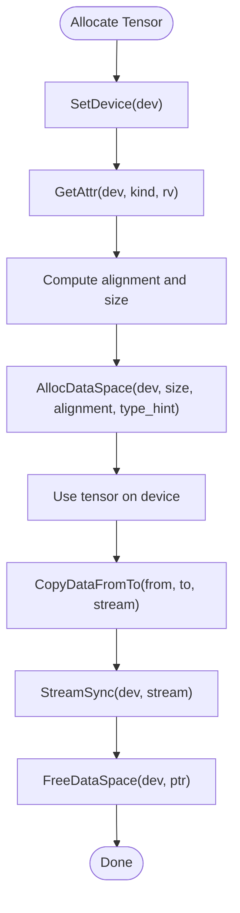
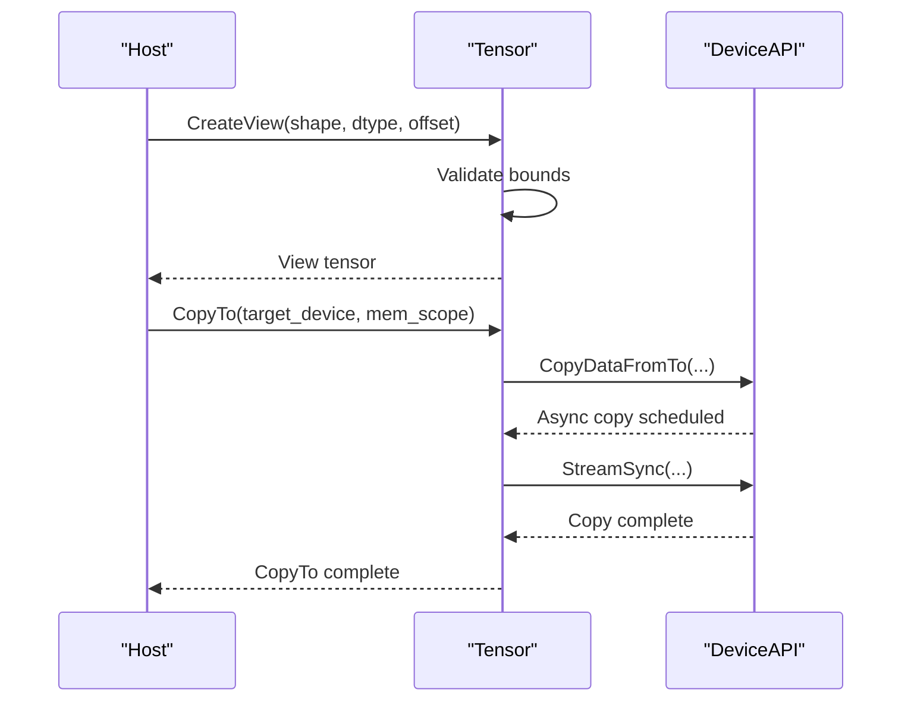
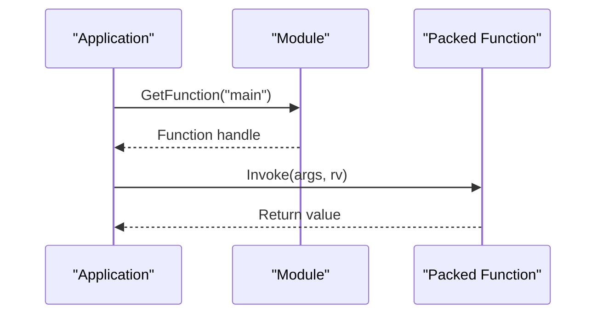
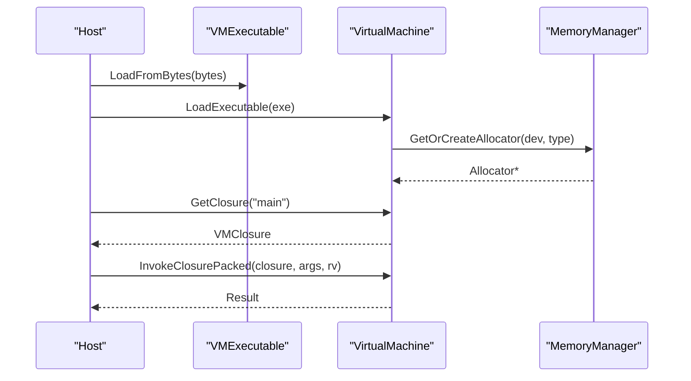
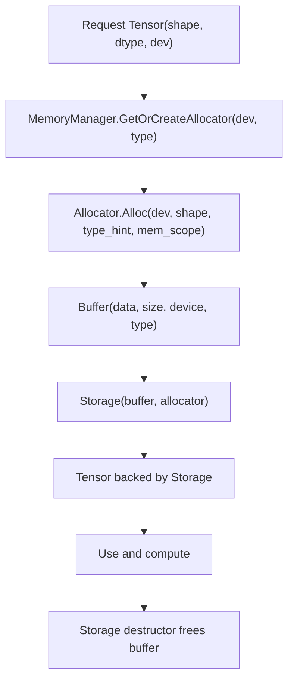
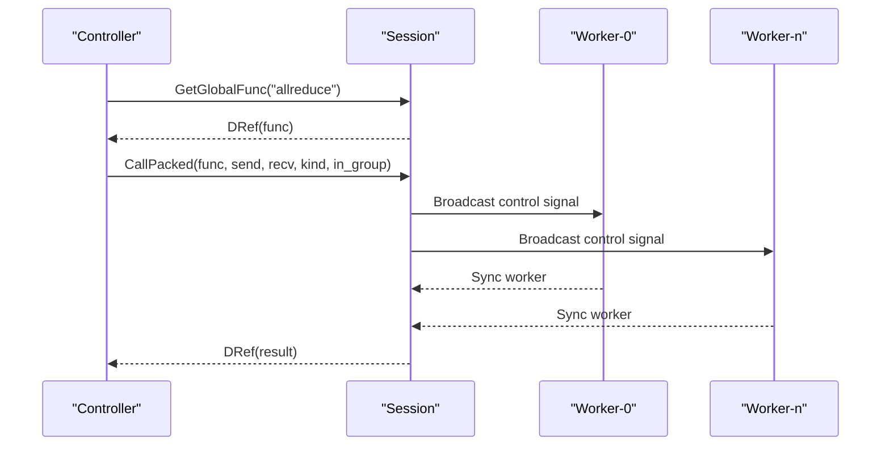
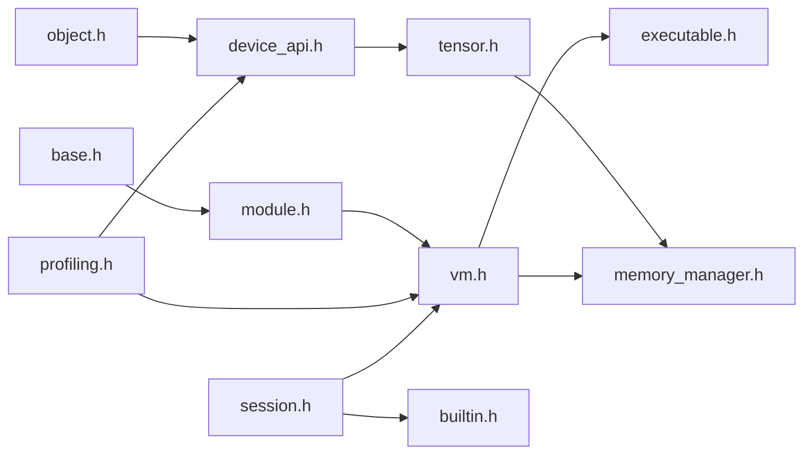

# Runtime System

<cite>
**Referenced Files in This Document**
- [base.h](file://include/tvm/runtime/base.h)
- [module.h](file://include/tvm/runtime/module.h)
- [device_api.h](file://include/tvm/runtime/device_api.h)
- [tensor.h](file://include/tvm/runtime/tensor.h)
- [object.h](file://include/tvm/runtime/object.h)
- [vm.h](file://include/tvm/runtime/vm/vm.h)
- [executable.h](file://include/tvm/runtime/vm/executable.h)
- [memory_manager.h](file://include/tvm/runtime/memory/memory_manager.h)
- [profiling.h](file://include/tvm/runtime/profiling.h)
- [session.h](file://include/tvm/runtime/disco/session.h)
- [builtin.h](file://include/tvm/runtime/disco/builtin.h)
</cite>

## Table of Contents
1. [Introduction](#introduction)
2. [Project Structure](#project-structure)
3. [Core Components](#core-components)
4. [Architecture Overview](#architecture-overview)
5. [Detailed Component Analysis](#detailed-component-analysis)
6. [Dependency Analysis](#dependency-analysis)
7. [Performance Considerations](#performance-considerations)
8. [Troubleshooting Guide](#troubleshooting-guide)
9. [Conclusion](#conclusion)
10. [Appendices](#appendices)

## Introduction
This document explains TVM’s runtime system with a focus on module loading and execution, heterogeneous device memory management, and the virtual machine (VM) subsystem. It covers the runtime API for deploying compiled models, the device abstraction layer, inter-process communication via RPC and the distributed Disco runtime, memory allocators and resource management, and practical examples for runtime usage. It also addresses performance optimization, profiling, debugging, and guidance for extending the runtime with custom memory allocators and device APIs.

## Project Structure
The runtime system is organized around several core areas:
- Device abstraction and memory management
- Tensor and data structures
- Module loading and function dispatch
- Virtual Machine (VM) bytecode execution
- Profiling and performance measurement
- Distributed runtime (Disco) and RPC

**Diagram sources**
- [object.h:1-149](file://include/tvm/runtime/object.h#L1-L149)
- [base.h:1-60](file://include/tvm/runtime/base.h#L1-L60)
- [device_api.h:1-411](file://include/tvm/runtime/device_api.h#L1-L411)
- [memory_manager.h:1-202](file://include/tvm/runtime/memory/memory_manager.h#L1-L202)
- [tensor.h:1-347](file://include/tvm/runtime/tensor.h#L1-L347)
- [module.h:1-139](file://include/tvm/runtime/module.h#L1-L139)
- [vm.h:1-236](file://include/tvm/runtime/vm/vm.h#L1-L236)
- [executable.h:1-246](file://include/tvm/runtime/vm/executable.h#L1-L246)
- [profiling.h:1-591](file://include/tvm/runtime/profiling.h#L1-L591)
- [session.h:1-367](file://include/tvm/runtime/disco/session.h#L1-L367)
- [builtin.h:1-154](file://include/tvm/runtime/disco/builtin.h#L1-L154)

**Section sources**
- [object.h:1-149](file://include/tvm/runtime/object.h#L1-L149)
- [base.h:1-60](file://include/tvm/runtime/base.h#L1-L60)
- [device_api.h:1-411](file://include/tvm/runtime/device_api.h#L1-L411)
- [memory_manager.h:1-202](file://include/tvm/runtime/memory/memory_manager.h#L1-L202)
- [tensor.h:1-347](file://include/tvm/runtime/tensor.h#L1-L347)
- [module.h:1-139](file://include/tvm/runtime/module.h#L1-L139)
- [vm.h:1-236](file://include/tvm/runtime/vm/vm.h#L1-L236)
- [executable.h:1-246](file://include/tvm/runtime/vm/executable.h#L1-L246)
- [profiling.h:1-591](file://include/tvm/runtime/profiling.h#L1-L591)
- [session.h:1-367](file://include/tvm/runtime/disco/session.h#L1-L367)
- [builtin.h:1-154](file://include/tvm/runtime/disco/builtin.h#L1-L154)

## Core Components
- Device abstraction and memory management: Provides a unified interface for device selection, attributes, allocation, copying, and stream synchronization across heterogeneous devices.
- Tensor abstraction: A device-independent managed tensor with copy semantics, views, and serialization support.
- Module loading and dispatch: Encapsulates runtime modules, function lookup, and packed function invocation with a stable ABI.
- Virtual Machine: Bytecode-based execution engine with an executable format, memory allocators, and optional profiling.
- Memory manager: Manages device-specific allocators and storage lifetimes.
- Profiling: Timers, call-level metrics, and reports for performance analysis.
- Distributed runtime (Disco): SPMD-style distributed execution with control/data planes, channels, and built-in collective operations.

**Section sources**
- [device_api.h:128-310](file://include/tvm/runtime/device_api.h#L128-L310)
- [tensor.h:54-192](file://include/tvm/runtime/tensor.h#L54-L192)
- [module.h:40-139](file://include/tvm/runtime/module.h#L40-L139)
- [vm.h:130-236](file://include/tvm/runtime/vm/vm.h#L130-L236)
- [memory_manager.h:58-156](file://include/tvm/runtime/memory/memory_manager.h#L58-L156)
- [profiling.h:52-427](file://include/tvm/runtime/profiling.h#L52-L427)
- [session.h:183-267](file://include/tvm/runtime/disco/session.h#L183-L267)
- [builtin.h:65-154](file://include/tvm/runtime/disco/builtin.h#L65-L154)

## Architecture Overview
The runtime architecture integrates device-agnostic abstractions with device-specific implementations. Modules expose functions that the VM can invoke. The VM uses an executable bytecode format and a memory manager to allocate and manage tensors. Profiling instruments execution, and Disco enables distributed SPMD execution with control/data channels.

**Diagram sources**
- [device_api.h:128-310](file://include/tvm/runtime/device_api.h#L128-L310)
- [tensor.h:54-192](file://include/tvm/runtime/tensor.h#L54-L192)
- [module.h:40-139](file://include/tvm/runtime/module.h#L40-L139)
- [vm.h:130-236](file://include/tvm/runtime/vm/vm.h#L130-L236)
- [executable.h:90-230](file://include/tvm/runtime/vm/executable.h#L90-L230)
- [memory_manager.h:129-156](file://include/tvm/runtime/memory/memory_manager.h#L129-L156)
- [profiling.h:365-427](file://include/tvm/runtime/profiling.h#L365-L427)
- [session.h:183-297](file://include/tvm/runtime/disco/session.h#L183-L297)
- [builtin.h:65-154](file://include/tvm/runtime/disco/builtin.h#L65-L154)

## Detailed Component Analysis

### Device Abstraction and Memory Management
- DeviceAPI defines the contract for device selection, attributes, allocation/free, copying, streams, and workspace management. It supports device-specific properties and RPC-aware device handling.
- Alignment and workspace policies are standardized to ensure efficient memory usage across devices.
- RPC device masking utilities enable transparent encoding/decoding of devices across RPC boundaries.

**Diagram sources**
- [device_api.h:128-310](file://include/tvm/runtime/device_api.h#L128-L310)

**Section sources**
- [device_api.h:128-310](file://include/tvm/runtime/device_api.h#L128-L310)
- [device_api.h:353-405](file://include/tvm/runtime/device_api.h#L353-L405)

### Tensor Operations and Views
- Tensor provides device-independent creation, copying, serialization, and view semantics. It supports cross-device copies and ensures proper synchronization.
- Preferred host device helpers select pinned host memory for CUDA/ROCm to reduce copy overhead.

**Diagram sources**
- [tensor.h:152-192](file://include/tvm/runtime/tensor.h#L152-L192)
- [device_api.h:201-247](file://include/tvm/runtime/device_api.h#L201-L247)

**Section sources**
- [tensor.h:54-192](file://include/tvm/runtime/tensor.h#L54-L192)
- [tensor.h:223-308](file://include/tvm/runtime/tensor.h#L223-L308)
- [tensor.h:315-325](file://include/tvm/runtime/tensor.h#L315-L325)

### Module Loading and Execution Framework
- Module encapsulates runtime functions and exposes a stable ABI for dynamic loading and dispatch. It supports packed function wrappers and vtable generation for method binding.
- RuntimeEnabled checks target availability, and symbol constants define global barriers and device setup hooks.

**Diagram sources**
- [module.h:40-139](file://include/tvm/runtime/module.h#L40-L139)

**Section sources**
- [module.h:40-139](file://include/tvm/runtime/module.h#L40-L139)

### Virtual Machine System
- VirtualMachine is an abstract interface for initialization, loading executables, invoking closures, and instrumentation. It maintains device lists and allocators.
- VMExecutable stores bytecode, constants, function table, and memory scopes, and supports serialization and introspection.
- The VM integrates with the MemoryManager to allocate tensors and storage.

**Diagram sources**
- [vm.h:130-236](file://include/tvm/runtime/vm/vm.h#L130-L236)
- [executable.h:90-230](file://include/tvm/runtime/vm/executable.h#L90-L230)
- [memory_manager.h:129-156](file://include/tvm/runtime/memory/memory_manager.h#L129-L156)

**Section sources**
- [vm.h:130-236](file://include/tvm/runtime/vm/vm.h#L130-L236)
- [executable.h:90-230](file://include/tvm/runtime/vm/executable.h#L90-L230)
- [memory_manager.h:129-156](file://include/tvm/runtime/memory/memory_manager.h#L129-L156)

### Memory Allocators and Resource Management
- AllocatorType distinguishes naive and pooled allocators. Allocators provide shape-aware allocation, views, and memory accounting.
- MemoryManager creates and caches allocators per device and type, ensuring lifecycle management and thread safety.
- Storage ties a buffer to an allocator and frees it on destruction.

**Diagram sources**
- [memory_manager.h:58-156](file://include/tvm/runtime/memory/memory_manager.h#L58-L156)

**Section sources**
- [memory_manager.h:42-156](file://include/tvm/runtime/memory/memory_manager.h#L42-L156)

### Distributed Runtime (Disco) and Inter-Process Communication
- Session manages a cluster of workers, control-plane channels, and data-plane collectives. It supports SPMD execution and worker-0 coordination.
- DRef represents remote objects with register IDs and back-pointers to the session.
- Built-in functions provide allreduce, allgather, broadcast/scatter/gather, point-to-point send/recv, and synchronization.

**Diagram sources**
- [session.h:183-267](file://include/tvm/runtime/disco/session.h#L183-L267)
- [builtin.h:81-154](file://include/tvm/runtime/disco/builtin.h#L81-L154)

**Section sources**
- [session.h:183-267](file://include/tvm/runtime/disco/session.h#L183-L267)
- [builtin.h:65-154](file://include/tvm/runtime/disco/builtin.h#L65-L154)

### Practical Examples and Usage Patterns
- Runtime module loading and invocation:
  - Load a compiled module and retrieve a function by name.
  - Invoke the function with packed arguments and capture the return value.
  - Reference: [module.h:40-139](file://include/tvm/runtime/module.h#L40-L139)
- Tensor operations:
  - Create tensors on a target device, copy between devices, and serialize to/from streams.
  - Reference: [tensor.h:152-192](file://include/tvm/runtime/tensor.h#L152-L192), [tensor.h:223-308](file://include/tvm/runtime/tensor.h#L223-L308)
- Multi-device execution:
  - Use DeviceAPI to set device, allocate pinned host memory for preferred host device, and synchronize streams.
  - Reference: [device_api.h:128-310](file://include/tvm/runtime/device_api.h#L128-L310), [tensor.h:315-325](file://include/tvm/runtime/tensor.h#L315-L325)
- VM bytecode execution:
  - Serialize/deserialize VMExecutable, load into VirtualMachine, and invoke closures.
  - Reference: [executable.h:90-230](file://include/tvm/runtime/vm/executable.h#L90-L230), [vm.h:130-236](file://include/tvm/runtime/vm/vm.h#L130-L236)
- Distributed collectives:
  - Use built-in collectives to perform allreduce/allgather/broadcast/scatter/gather.
  - Reference: [builtin.h:81-154](file://include/tvm/runtime/disco/builtin.h#L81-L154)

## Dependency Analysis
The runtime components exhibit clear separation of concerns:
- Object and base headers provide foundational type and macro infrastructure.
- DeviceAPI and Tensor depend on each other for device operations and data movement.
- MemoryManager and Allocator encapsulate allocation policies and device-specific backends.
- VMExecutable and VirtualMachine integrate with MemoryManager and rely on Module for function discovery.
- Profiling integrates with both VM and DeviceAPI for accurate timing and metrics.
- Disco Session and DRef coordinate control/data plane operations across workers.

**Diagram sources**
- [base.h:1-60](file://include/tvm/runtime/base.h#L1-L60)
- [object.h:1-149](file://include/tvm/runtime/object.h#L1-L149)
- [device_api.h:1-411](file://include/tvm/runtime/device_api.h#L1-L411)
- [tensor.h:1-347](file://include/tvm/runtime/tensor.h#L1-L347)
- [memory_manager.h:1-202](file://include/tvm/runtime/memory/memory_manager.h#L1-L202)
- [module.h:1-139](file://include/tvm/runtime/module.h#L1-L139)
- [vm.h:1-236](file://include/tvm/runtime/vm/vm.h#L1-L236)
- [executable.h:1-246](file://include/tvm/runtime/vm/executable.h#L1-L246)
- [profiling.h:1-591](file://include/tvm/runtime/profiling.h#L1-L591)
- [session.h:1-367](file://include/tvm/runtime/disco/session.h#L1-L367)
- [builtin.h:1-154](file://include/tvm/runtime/disco/builtin.h#L1-L154)

**Section sources**
- [base.h:1-60](file://include/tvm/runtime/base.h#L1-L60)
- [object.h:1-149](file://include/tvm/runtime/object.h#L1-L149)
- [device_api.h:1-411](file://include/tvm/runtime/device_api.h#L1-L411)
- [tensor.h:1-347](file://include/tvm/runtime/tensor.h#L1-L347)
- [memory_manager.h:1-202](file://include/tvm/runtime/memory/memory_manager.h#L1-L202)
- [module.h:1-139](file://include/tvm/runtime/module.h#L1-L139)
- [vm.h:1-236](file://include/tvm/runtime/vm/vm.h#L1-L236)
- [executable.h:1-246](file://include/tvm/runtime/vm/executable.h#L1-L246)
- [profiling.h:1-591](file://include/tvm/runtime/profiling.h#L1-L591)
- [session.h:1-367](file://include/tvm/runtime/disco/session.h#L1-L367)
- [builtin.h:1-154](file://include/tvm/runtime/disco/builtin.h#L1-L154)

## Performance Considerations
- Prefer pinned host memory for CUDA/ROCm tensors to reduce PCIe copy overhead when transferring between host and device.
- Use stream-based asynchronous copies and synchronize only when necessary to overlap computation and communication.
- Leverage pooled allocators for reduced fragmentation and improved reuse in long-running workloads.
- Instrument VM execution with profiling to identify hotspots and correlate device-level timings.
- For distributed workloads, minimize data-plane traffic by batching and using appropriate collectives.

[No sources needed since this section provides general guidance]

## Troubleshooting Guide
- Device mismatch errors: Ensure the device is set before kernel launches on device types that require it.
- Synchronization issues: Always synchronize streams after asynchronous copies or kernel launches to guarantee completion.
- Serialization problems: Verify tensor serialization format and device affinity; tensors are saved as CPU tensors to avoid device dependency.
- Profiling accuracy: Use device-specific timers and avoid mixing CPU/GPU timers without proper synchronization.
- RPC device encoding: When passing devices across RPC sessions, remove/add RPC session masks appropriately.

**Section sources**
- [device_api.h:282-292](file://include/tvm/runtime/device_api.h#L282-L292)
- [tensor.h:223-308](file://include/tvm/runtime/tensor.h#L223-L308)
- [profiling.h:106-148](file://include/tvm/runtime/profiling.h#L106-L148)
- [device_api.h:353-405](file://include/tvm/runtime/device_api.h#L353-L405)

## Conclusion
TVM’s runtime system provides a cohesive framework for deploying compiled models across heterogeneous devices. Its device abstraction, tensor model, module interface, VM bytecode engine, memory management, profiling, and distributed capabilities enable efficient and portable inference. By leveraging the documented APIs and patterns, developers can build robust, high-performance applications and extend the runtime with custom allocators and device backends.

[No sources needed since this section summarizes without analyzing specific files]

## Appendices

### Extending the Runtime
- Custom memory allocators:
  - Implement Allocator with Alloc/Free/CreateView/FreeView and register with MemoryManager per device.
  - Reference: [memory_manager.h:58-127](file://include/tvm/runtime/memory/memory_manager.h#L58-L127)
- Custom device APIs:
  - Extend DeviceAPI to support new device types, implement allocation, copying, and stream semantics.
  - Reference: [device_api.h:128-310](file://include/tvm/runtime/device_api.h#L128-L310)
- VM extensions:
  - Derive VMExtension and use VirtualMachine::GetOrCreateExtension to attach custom functionality.
  - Reference: [vm.h:108-117](file://include/tvm/runtime/vm/vm.h#L108-L117), [vm.h:186-197](file://include/tvm/runtime/vm/vm.h#L186-L197)

**Section sources**
- [memory_manager.h:58-127](file://include/tvm/runtime/memory/memory_manager.h#L58-L127)
- [device_api.h:128-310](file://include/tvm/runtime/device_api.h#L128-L310)
- [vm.h:108-117](file://include/tvm/runtime/vm/vm.h#L108-L117)
- [vm.h:186-197](file://include/tvm/runtime/vm/vm.h#L186-L197)