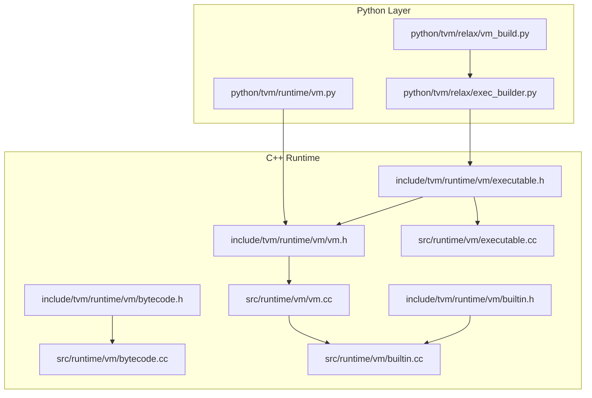
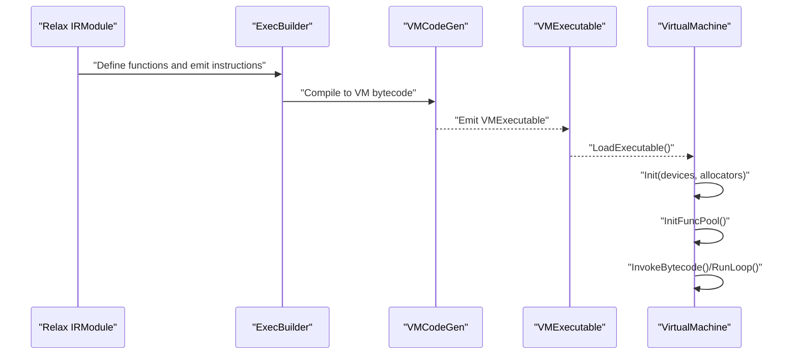
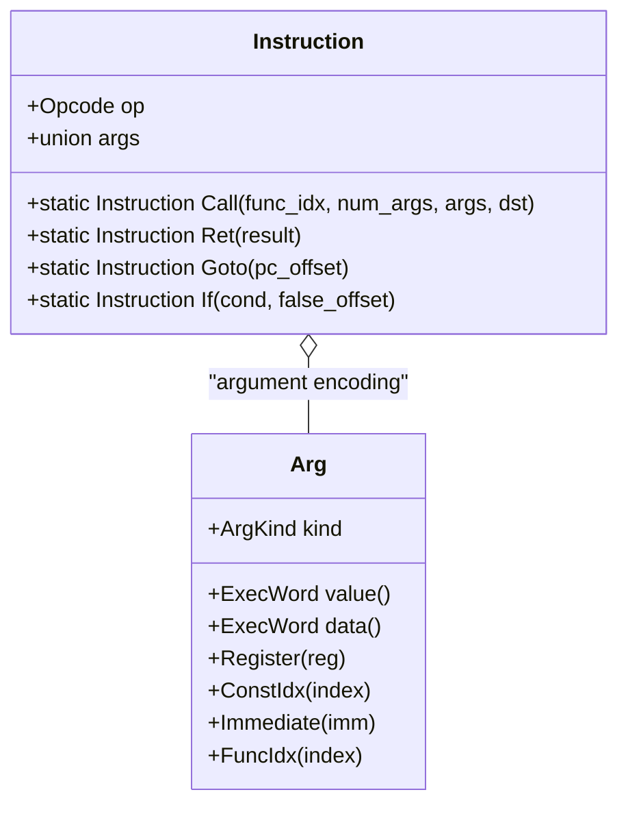
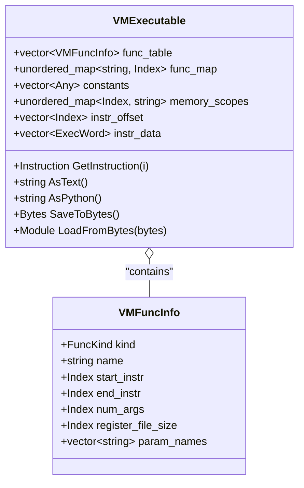
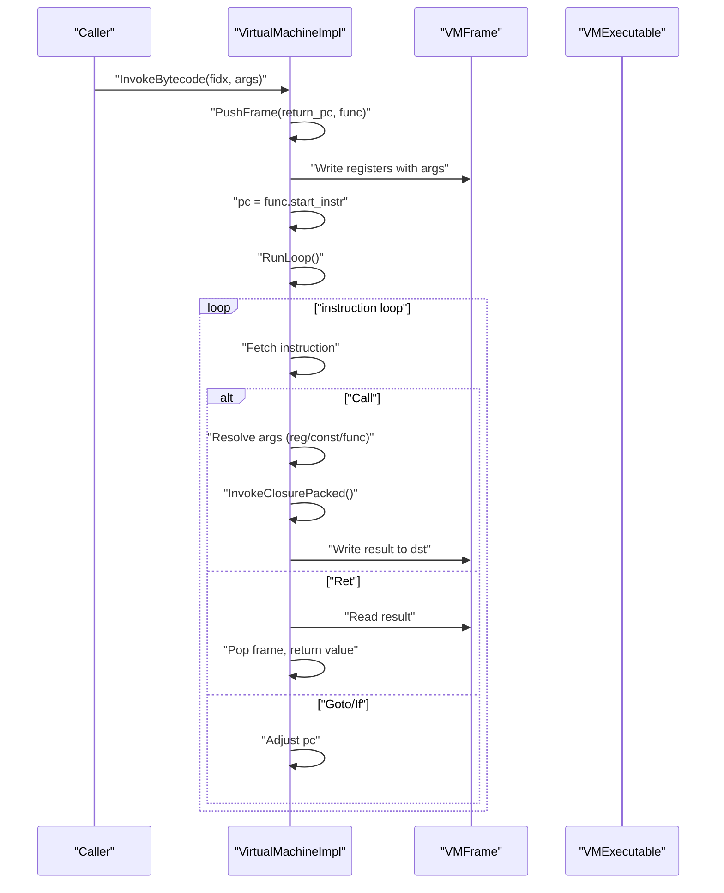
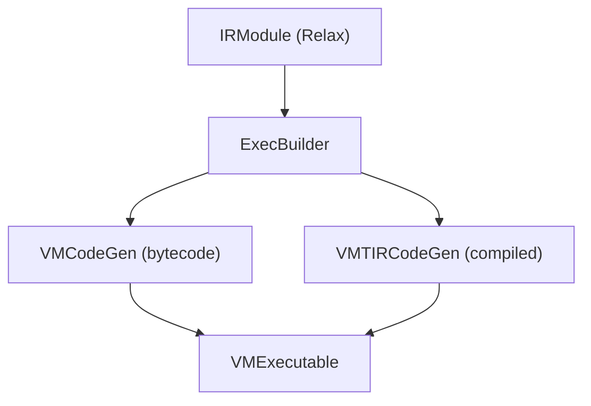
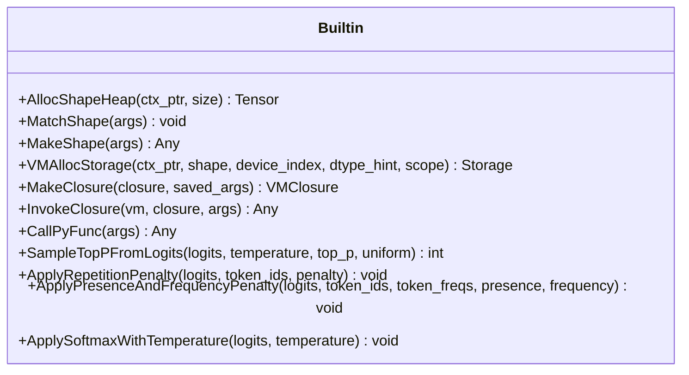
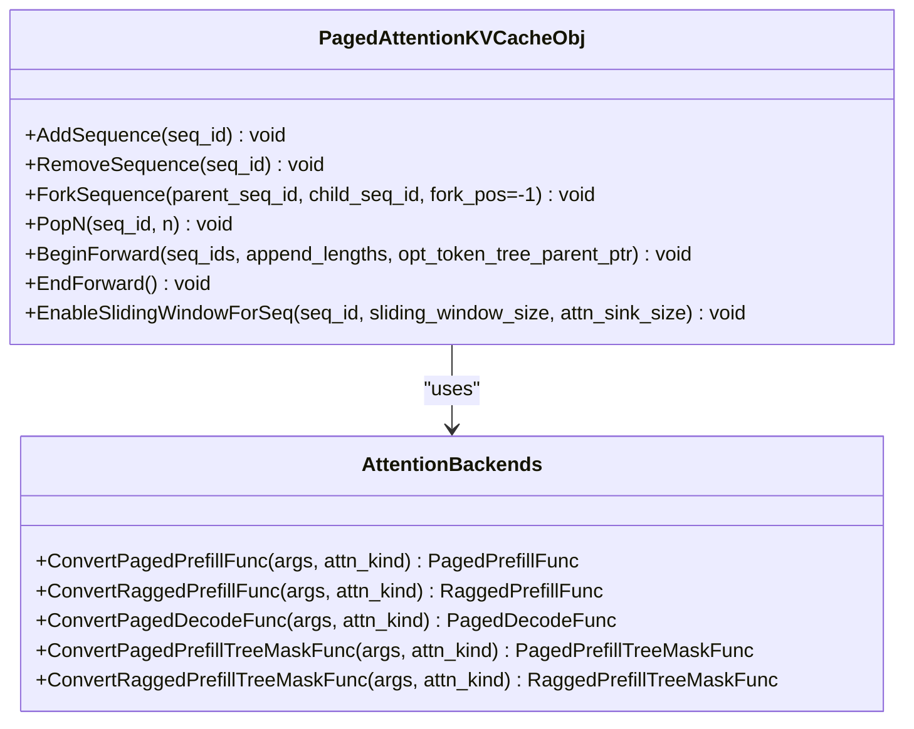
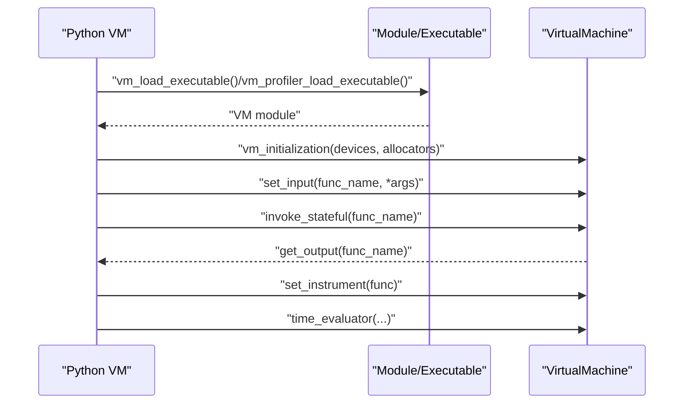
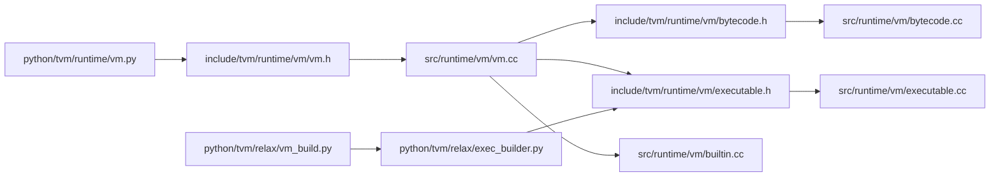

# Virtual Machine

<cite>
**Referenced Files in This Document**
- [vm.h](file://include/tvm/runtime/vm/vm.h)
- [bytecode.h](file://include/tvm/runtime/vm/bytecode.h)
- [executable.h](file://include/tvm/runtime/vm/executable.h)
- [vm.cc](file://src/runtime/vm/vm.cc)
- [bytecode.cc](file://src/runtime/vm/bytecode.cc)
- [executable.cc](file://src/runtime/vm/executable.cc)
- [builtin.h](file://include/tvm/runtime/vm/builtin.h)
- [builtin.cc](file://src/runtime/vm/builtin.cc)
- [vm.py](file://python/tvm/runtime/vm.py)
- [vm_build.py](file://python/tvm/relax/vm_build.py)
- [exec_builder.py](file://python/tvm/relax/exec_builder.py)
- [paged_kv_cache.cc](file://src/runtime/vm/paged_kv_cache.cc)
- [attn_backend.cc](file://src/runtime/vm/attn_backend.cc)
- [lm_support.cc](file://src/runtime/vm/lm_support.cc)
- [relax_vm.rst](file://docs/arch/relax_vm.rst)
</cite>

## Table of Contents
1. [Introduction](#introduction)
2. [Project Structure](#project-structure)
3. [Core Components](#core-components)
4. [Architecture Overview](#architecture-overview)
5. [Detailed Component Analysis](#detailed-component-analysis)
6. [Dependency Analysis](#dependency-analysis)
7. [Performance Considerations](#performance-considerations)
8. [Troubleshooting Guide](#troubleshooting-guide)
9. [Conclusion](#conclusion)
10. [Appendices](#appendices)

## Introduction
This document explains TVM’s Relax Virtual Machine (VM) system: its bytecode-based execution engine, virtual machine architecture, and built-in function implementations. It covers the VM bytecode format, instruction set, execution semantics, the VM builder and executable compilation, runtime execution model, and advanced features such as Paged KV Cache for LLM inference and attention backends. Practical examples demonstrate program construction, bytecode interpretation, and performance optimization. The document also describes integration with TVM’s IR system, function calling conventions, parameter passing, debugging, profiling, and memory management within the VM context.

## Project Structure
The VM system spans C++ runtime headers and implementations, Python runtime bindings, and Relax IR integration:
- C++ runtime core: VM interface, bytecode, executable, and built-in functions
- Python runtime: VM wrapper, instrumentation, profiling, and convenience APIs
- Relax IR integration: VM builder, code generation, and execution modes

**Diagram sources**
- [vm.py:1-508](file://python/tvm/runtime/vm.py#L1-L508)
- [vm_build.py:1-79](file://python/tvm/relax/vm_build.py#L1-L79)
- [exec_builder.py:86-151](file://python/tvm/relax/exec_builder.py#L86-L151)
- [vm.h:1-236](file://include/tvm/runtime/vm/vm.h#L1-L236)
- [bytecode.h:1-247](file://include/tvm/runtime/vm/bytecode.h#L1-L247)
- [executable.h:1-246](file://include/tvm/runtime/vm/executable.h#L1-L246)
- [vm.cc:1-800](file://src/runtime/vm/vm.cc#L1-L800)
- [bytecode.cc:1-69](file://src/runtime/vm/bytecode.cc#L1-L69)
- [executable.cc:1-597](file://src/runtime/vm/executable.cc#L1-L597)
- [builtin.h:1-90](file://include/tvm/runtime/vm/builtin.h#L1-L90)
- [builtin.cc:1-797](file://src/runtime/vm/builtin.cc#L1-L797)

**Section sources**
- [vm.h:1-236](file://include/tvm/runtime/vm/vm.h#L1-L236)
- [bytecode.h:1-247](file://include/tvm/runtime/vm/bytecode.h#L1-L247)
- [executable.h:1-246](file://include/tvm/runtime/vm/executable.h#L1-L246)
- [vm.cc:1-800](file://src/runtime/vm/vm.cc#L1-L800)
- [bytecode.cc:1-69](file://src/runtime/vm/bytecode.cc#L1-L69)
- [executable.cc:1-597](file://src/runtime/vm/executable.cc#L1-L597)
- [builtin.h:1-90](file://include/tvm/runtime/vm/builtin.h#L1-L90)
- [builtin.cc:1-797](file://src/runtime/vm/builtin.cc#L1-L797)
- [vm.py:1-508](file://python/tvm/runtime/vm.py#L1-L508)
- [vm_build.py:1-79](file://python/tvm/relax/vm_build.py#L1-L79)
- [exec_builder.py:86-151](file://python/tvm/relax/exec_builder.py#L86-L151)

## Core Components
- VirtualMachine interface: initialization, loading executables, closure retrieval, invocation, instrumentation, and extensions.
- VMExecutable: serializable bytecode container with function table, constants, and instruction stream.
- Instruction set: register-based bytecode with Call, Ret, Goto, If opcodes and argument encoding.
- Built-in functions: shape handling, storage management, closure invocation, device transfers, data structure helpers, and LM utilities.
- Python VM wrapper: device setup, input/output management, instrumentation, profiling, and time evaluation.

Key responsibilities:
- VMExecutable encapsulates the VM program and metadata for loading and inspection.
- VirtualMachineImpl interprets bytecode, manages frames, registers, and invokes closures.
- Built-ins provide shape inference, memory management, and runtime utilities.
- Python bindings expose a convenient API for building, loading, and executing VM programs.

**Section sources**
- [vm.h:130-236](file://include/tvm/runtime/vm/vm.h#L130-L236)
- [executable.h:90-246](file://include/tvm/runtime/vm/executable.h#L90-L246)
- [bytecode.h:56-247](file://include/tvm/runtime/vm/bytecode.h#L56-L247)
- [builtin.cc:1-797](file://src/runtime/vm/builtin.cc#L1-L797)
- [vm.py:42-508](file://python/tvm/runtime/vm.py#L42-L508)

## Architecture Overview
The VM architecture consists of:
- Builder and IR integration: Relax IR is lowered to VM bytecode via ExecBuilder and VMCodeGen.
- Executable: Serialized VMExecutable with function table, constants, and instruction stream.
- Runtime: VirtualMachine loads the executable, initializes devices and allocators, resolves function pools, and executes bytecode.

**Diagram sources**
- [relax_vm.rst:94-274](file://docs/arch/relax_vm.rst#L94-L274)
- [vm_build.py:51-79](file://python/tvm/relax/vm_build.py#L51-L79)
- [executable.cc:418-428](file://src/runtime/vm/executable.cc#L418-L428)
- [vm.cc:457-485](file://src/runtime/vm/vm.cc#L457-L485)

## Detailed Component Analysis

### Bytecode and Instruction Set
The VM uses a register-based instruction set with minimal opcodes:
- Opcodes: Call, Ret, Goto, If
- Arguments: register, immediate, constant index, function index
- Encoding: tagged union with bit packing for compact storage

**Diagram sources**
- [bytecode.h:56-247](file://include/tvm/runtime/vm/bytecode.h#L56-L247)

Execution semantics:
- Call: resolve args from registers/constants/functions, invoke target, store result
- Ret: read result register, write to caller’s return register
- Goto: adjust pc by offset
- If: evaluate condition register, jump by false_offset if zero

**Section sources**
- [bytecode.h:56-247](file://include/tvm/runtime/vm/bytecode.h#L56-L247)
- [bytecode.cc:35-65](file://src/runtime/vm/bytecode.cc#L35-L65)

### VM Executable and Serialization
VMExecutable stores:
- Function table with metadata (name, start/end instruction, register file size, parameter names)
- Constants and memory scopes
- Instruction offsets and packed instruction data
- Methods to serialize/deserialize and print textual/Python forms

**Diagram sources**
- [executable.h:54-246](file://include/tvm/runtime/vm/executable.h#L54-L246)
- [executable.cc:116-145](file://src/runtime/vm/executable.cc#L116-L145)

**Section sources**
- [executable.h:54-246](file://include/tvm/runtime/vm/executable.h#L54-L246)
- [executable.cc:147-230](file://src/runtime/vm/executable.cc#L147-L230)

### Virtual Machine Execution Engine
VirtualMachineImpl orchestrates:
- Initialization: devices, allocators, constant pool, function pool
- Invocation: push frame, write args to register file, set pc, RunLoop
- Dispatch loop: interpret instructions, manage call frames, return values
- Instrumentation: optional before/after hooks for Call instructions

**Diagram sources**
- [vm.cc:657-695](file://src/runtime/vm/vm.cc#L657-L695)
- [vm.cc:395-396](file://src/runtime/vm/vm.cc#L395-L396)
- [vm.cc:724-800](file://src/runtime/vm/vm.cc#L724-L800)

**Section sources**
- [vm.h:130-236](file://include/tvm/runtime/vm/vm.h#L130-L236)
- [vm.cc:457-485](file://src/runtime/vm/vm.cc#L457-L485)
- [vm.cc:657-695](file://src/runtime/vm/vm.cc#L657-L695)
- [vm.cc:724-800](file://src/runtime/vm/vm.cc#L724-L800)

### VM Builder and Compilation
The VM builder compiles Relax IR to VM bytecode:
- ExecBuilder emits instructions (call, ret, goto, if) and manages function scopes
- VMCodeGen lowers Relax expressions to VM instructions
- VMTIRCodeGen compiles to TIR-backed functions for direct register manipulation

**Diagram sources**
- [relax_vm.rst:94-274](file://docs/arch/relax_vm.rst#L94-L274)
- [vm_build.py:51-79](file://python/tvm/relax/vm_build.py#L51-L79)
- [exec_builder.py:96-151](file://python/tvm/relax/exec_builder.py#L96-L151)

**Section sources**
- [relax_vm.rst:94-274](file://docs/arch/relax_vm.rst#L94-L274)
- [vm_build.py:51-79](file://python/tvm/relax/vm_build.py#L51-L79)
- [exec_builder.py:96-151](file://python/tvm/relax/exec_builder.py#L96-L151)

### Built-in Functions and Utilities
Built-ins cover:
- Shape handling: match and make symbolic shapes, heap allocation
- Storage management: allocate storage and tensors, device transfers
- Closure handling: make and invoke closures, dynamic call
- Data structures: tuples, shape conversion, ensure zero offset
- Debugging: invoke debug functions
- LM support: legacy KV cache, sampling, repetition penalties, softmax with temperature

**Diagram sources**
- [builtin.h:45-84](file://include/tvm/runtime/vm/builtin.h#L45-L84)
- [builtin.cc:48-797](file://src/runtime/vm/builtin.cc#L48-L797)

**Section sources**
- [builtin.h:45-84](file://include/tvm/runtime/vm/builtin.h#L45-L84)
- [builtin.cc:48-797](file://src/runtime/vm/builtin.cc#L48-L797)

### Paged KV Cache and Attention Backends
Paged KV Cache enables efficient LLM inference with:
- Page-based management of K/V tensors along sequence length
- Support for sliding window, attention sinks, token trees, and KV transfer
- Attention backends: TIRX and FlashInfer adapters

**Diagram sources**
- [paged_kv_cache.cc:73-520](file://src/runtime/vm/paged_kv_cache.cc#L73-L520)
- [attn_backend.cc:28-134](file://src/runtime/vm/attn_backend.cc#L28-L134)

**Section sources**
- [paged_kv_cache.cc:73-520](file://src/runtime/vm/paged_kv_cache.cc#L73-L520)
- [attn_backend.cc:28-134](file://src/runtime/vm/attn_backend.cc#L28-L134)

### Python Runtime Integration and Usage
The Python VM wrapper provides:
- Device initialization and allocator selection
- Input/output management and stateful invocation
- Instrumentation and profiling
- Time evaluation helpers

**Diagram sources**
- [vm.py:48-128](file://python/tvm/runtime/vm.py#L48-L128)
- [vm.py:256-330](file://python/tvm/runtime/vm.py#L256-L330)
- [vm.py:371-478](file://python/tvm/runtime/vm.py#L371-L478)
- [executable.cc:418-428](file://src/runtime/vm/executable.cc#L418-L428)

**Section sources**
- [vm.py:42-508](file://python/tvm/runtime/vm.py#L42-L508)

## Dependency Analysis
The VM system exhibits layered dependencies:
- Python runtime depends on C++ VM interface and executable
- Executable depends on bytecode definitions
- VM implementation depends on built-in functions and memory manager
- Builder and codegen integrate with Relax IR

**Diagram sources**
- [vm.py:1-508](file://python/tvm/runtime/vm.py#L1-L508)
- [vm.h:1-236](file://include/tvm/runtime/vm/vm.h#L1-L236)
- [vm.cc:1-800](file://src/runtime/vm/vm.cc#L1-L800)
- [bytecode.h:1-247](file://include/tvm/runtime/vm/bytecode.h#L1-L247)
- [bytecode.cc:1-69](file://src/runtime/vm/bytecode.cc#L1-L69)
- [executable.h:1-246](file://include/tvm/runtime/vm/executable.h#L1-L246)
- [executable.cc:1-597](file://src/runtime/vm/executable.cc#L1-L597)
- [builtin.cc:1-797](file://src/runtime/vm/builtin.cc#L1-L797)
- [vm_build.py:1-79](file://python/tvm/relax/vm_build.py#L1-L79)
- [exec_builder.py:86-151](file://python/tvm/relax/exec_builder.py#L86-L151)

**Section sources**
- [vm.h:1-236](file://include/tvm/runtime/vm/vm.h#L1-L236)
- [executable.h:1-246](file://include/tvm/runtime/vm/executable.h#L1-L246)
- [vm.cc:1-800](file://src/runtime/vm/vm.cc#L1-L800)
- [builtin.cc:1-797](file://src/runtime/vm/builtin.cc#L1-L797)
- [vm.py:1-508](file://python/tvm/runtime/vm.py#L1-L508)
- [vm_build.py:1-79](file://python/tvm/relax/vm_build.py#L1-L79)
- [exec_builder.py:86-151](file://python/tvm/relax/exec_builder.py#L86-L151)

## Performance Considerations
- Execution modes:
  - Bytecode mode: interpreted dispatch loop with flexibility
  - Compiled mode: TIR-backed functions reduce dispatch overhead
- Memory management:
  - Allocator selection (naive vs pooled) impacts allocation speed and fragmentation
  - Device-aware conversions minimize transfers
- Instrumentation and profiling:
  - Lightweight instrumentation hooks can be inserted around Call instructions
  - Profiling reports provide per-op timing
- Attention backends:
  - FlashInfer and TIRX backends accelerate prefill/decode kernels
  - Paged KV cache reduces memory footprint and improves locality

[No sources needed since this section provides general guidance]

## Troubleshooting Guide
Common issues and remedies:
- Unknown function or missing closure: verify function name and imports
- Argument count mismatch: ensure provided arguments match function arity and parameter names
- Device mismatch: convert inputs to target device before invoking
- Instrumentation anomalies: confirm instrument function signature and return kind
- Serialization/version errors: ensure executable version compatibility

**Section sources**
- [vm.cc:487-525](file://src/runtime/vm/vm.cc#L487-L525)
- [vm.py:256-330](file://python/tvm/runtime/vm.py#L256-L330)
- [executable.cc:147-166](file://src/runtime/vm/executable.cc#L147-L166)

## Conclusion
TVM’s Relax VM offers a compact, register-based bytecode execution engine with a rich set of built-in functions and seamless integration with TVM’s IR system. The VM supports flexible execution modes, robust memory management, and advanced LLM features such as Paged KV Cache and attention backends. The Python runtime bindings provide a practical interface for building, inspecting, and profiling VM programs, while the C++ implementation ensures efficient and extensible execution.

[No sources needed since this section summarizes without analyzing specific files]

## Appendices

### VM Bytecode Instruction Reference
- Call: dst, func_idx, num_args, args[]
- Ret: result
- Goto: pc_offset
- If: cond, false_offset

Argument kinds:
- Register, Immediate, ConstIdx, FuncIdx

**Section sources**
- [bytecode.h:56-247](file://include/tvm/runtime/vm/bytecode.h#L56-L247)
- [bytecode.cc:35-65](file://src/runtime/vm/bytecode.cc#L35-L65)

### VM Builder API Highlights
- Function declaration and scoping
- Emit call, ret, goto, if
- Convert constants and special registers

**Section sources**
- [exec_builder.py:92-151](file://python/tvm/relax/exec_builder.py#L92-L151)